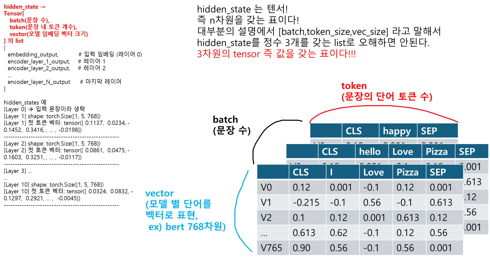

# retriver 구현
```python
class Retriever:
    def __init__(self, documents, embedding_model_name):
        self.documents = documents
        self.tokenizer = AutoTokenizer.from_pretrained(embedding_model_name)
        self.model = AutoModel.from_pretrained(embedding_model_name)
        self.documents_embeddings = self.build_docs_embedding()

    def get_embedding(self, text):
        token_ids = self.tokenizer([text], return_tensors="pt").input_ids
        embedding = self.model(token_ids)[0]
        embedding = torch.mean(embedding, dim=1).squeeze()
        return embedding

    def build_docs_embedding(self):
        documents_embeddings = torch.zeros([len(self.documents),self.model.config.hidden_size])
        for i, document in enumerate(self.documents):
            documents_embeddings[i,:] = self.get_embedding(document)
        return documents_embeddings

    def retrieve_doc(self, query):
        query_embedding = self.get_embedding(query)
        top_1_idx = torch.argmax(self.cosine_similarity(query_embedding))
        doc = self.documents[top_1_idx]
        return doc

    def cosine_similarity(self, query_embedding):
        scores = self.documents_embeddings.matmul(query_embedding) / (
                    torch.linalg.norm(self.documents_embeddings, dim=1) * torch.linalg.norm(query_embedding))
        return scores
```


# 1. 문장 Embedding

## 🔹 전체 코드 설명

```python
def get_embedding(self, text):
    token_ids = self.tokenizer([text], return_tensors="pt").input_ids
    embedding = self.model(token_ids)[0]
    embedding = torch.mean(embedding, dim=1).squeeze() 
    return embedding
```

---

## 🔍 1. `token_ids = self.tokenizer([text], return_tensors="pt").input_ids`

- HuggingFace의 `AutoTokenizer`를 사용하여 입력 텍스트 `text`를 **토큰화(tokenization)** 하고 **PyTorch tensor 형태**로 반환합니다.
- `input_ids`는 텍스트가 토큰으로 나뉘어 정수 ID로 바뀐 결과입니다.
- 예: `"hello world"` → `[101, 7592, 2088, 102]` (BERT 기준)

---

## 🔍 2. `embedding = self.model(token_ids)[0]`

- `self.model`은 HuggingFace의 사전학습 모델 (예: BERT 등) 입니다.
- 이 줄에서는 모델에 토큰화된 문장을 넣어 **토큰 임베딩 출력을 받는 단계**입니다.
- `.model(token_ids)`의 반환값은 일반적으로 `last_hidden_state`, `pooler_output` 등이 포함된 튜플입니다.
  - `[0]`을 사용했기 때문에 `last_hidden_state`를 선택한 것입니다.
- `last_hidden_state`: 각 토큰에 대한 출력 벡터 (형상: `[batch_size, seq_len, hidden_dim]`)

---

## 🔍 3. `embedding = torch.mean(embedding, dim=1).squeeze()`

- **문장 임베딩(sentence embedding)**을 얻기 위한 방법 중 하나인 **평균 풀링(mean pooling)**을 적용합니다.
  - `dim=1`로 평균을 내면, **토큰 차원(seq_len)**에 대해 평균을 계산합니다.
  - 즉, 모든 토큰 임베딩을 평균 내어 **하나의 문장 벡터**로 축약하는 것.
- `squeeze()`는 불필요한 차원을 제거해, 결과적으로 벡터의 shape을 `[hidden_dim]`으로 만듭니다.

---

## ✅ 최종 결과

```python
return embedding
```

- 최종적으로 반환되는 것은 **입력 텍스트에 대한 하나의 고정 길이 벡터**입니다.  
- 이 벡터는 나중에 다른 문서와 비교(예: 코사인 유사도)할 수 있습니다.

---

## 📌 요약

| 단계 | 설명 |
|------|------|
| Tokenize | 문장을 토큰으로 분리하고 ID로 변환 |
| 모델 통과 | 사전학습 모델을 거쳐 각 토큰의 벡터 출력 |
| 평균 풀링 | 토큰 임베딩을 평균 내어 문장 임베딩으로 변환 |
| 결과 | 텍스트에 대한 벡터 표현을 반환 |

---

## ✅ 보완 가능한 점

1. **`attention_mask` 사용 권장**  
   현재 코드에서는 `attention_mask` 없이 평균을 내므로, 패딩 토큰까지 평균에 포함됩니다. 이를 방지하려면 아래처럼 수정하면 더 정확합니다:
   ```python
   encoded = self.tokenizer([text], return_tensors="pt", padding=True, truncation=True)
   outputs = self.model(**encoded)
   attention_mask = encoded["attention_mask"]
   last_hidden = outputs.last_hidden_state
   mask_expanded = attention_mask.unsqueeze(-1).expand(last_hidden.size()).float()
   sum_embeddings = torch.sum(last_hidden * mask_expanded, dim=1)
   sum_mask = torch.clamp(mask_expanded.sum(dim=1), min=1e-9)
   embedding = sum_embeddings / sum_mask
   return embedding.squeeze()
   ```

2. **`with torch.no_grad()` 사용 추천**  
   추론 시에는 학습이 필요 없기 때문에 아래처럼 감싸주는 것이 메모리 낭비를 막습니다:
   ```python
   with torch.no_grad():
       ...
   ```

---
# 2. 문서 Embedding

좋아요! 주신 `build_docs_embedding()` 함수는 **여러 문서들을 한 번에 임베딩 벡터로 바꾸어 저장해두는 함수**입니다.  
즉, 이 Retriever가 나중에 검색할 수 있도록 **문서 벡터 인덱스를 미리 구축하는 과정**이에요.

아래에 코드 전체를 설명해드릴게요:

---

## 🔹 전체 코드
```python
def build_docs_embedding(self):
    documents_embeddings = torch.zeros([len(self.documents), self.model.config.hidden_size])
    for i, document in enumerate(self.documents):
        documents_embeddings[i, :] = self.get_embedding(document)
    return documents_embeddings
```

---

## 🔸 1. `documents_embeddings = torch.zeros([...])`

```python
torch.zeros([len(self.documents), self.model.config.hidden_size])
```

- 문서 수만큼 행(row), 임베딩 차원 수만큼 열(column)인 2D 텐서를 초기화합니다.
- 예:
  - 문서가 10개
  - BERT의 hidden size = 768일 경우:
    ```python
    documents_embeddings.shape = [10, 768]
    ```
- 초기에 `0`으로 다 채워진 텐서 (나중에 실제 임베딩 값으로 교체)

---

## 🔸 2. `for i, document in enumerate(self.documents):`

- `self.documents`는 문자열 리스트예요.  
  예: `["I love pizza", "AI is amazing", "Python is great"]`

- 각 문서에 대해 하나씩 `get_embedding()`을 호출해서 임베딩을 생성합니다.

---

## 🔸 3. `documents_embeddings[i, :] = self.get_embedding(document)`

- 해당 문서를 임베딩으로 바꾼 후 → i번째 row에 삽입
- `get_embedding(document)`는 `[768]`짜리 벡터를 반환
- 결국 `documents_embeddings` 텐서는 **모든 문서의 벡터들을 한 자리에 정리한 행렬**이 됩니다.

---

## 🔸 4. `return documents_embeddings`

- 완성된 문서 임베딩 행렬을 반환합니다.
- 이걸 나중에 `cosine_similarity()` 등에서 검색용으로 활용하게 됩니다.

---

## ✅ 최종 요약

| 단계 | 설명 |
|------|------|
| 텐서 초기화 | `[문서 개수, 임베딩 차원]` 크기의 텐서 생성 |
| 각 문서 임베딩 | `get_embedding()`으로 벡터 생성 |
| 저장 | 해당 위치에 벡터 저장 |
| 반환 | 전체 문서 임베딩 행렬 반환 |

---

## 🔍 시각적으로 보면:

```
documents_embeddings = [
  [0.12, -0.03, ..., 0.77],  ← 문서 1 임베딩
  [0.03,  0.44, ..., 0.21],  ← 문서 2 임베딩
  ...
  [0.91, -0.12, ..., 0.01]   ← 문서 N 임베딩
]
```

---
좋아요! 주어진 `retrieve_doc` 함수는 **입력된 질의(query)**에 대해 가장 유사한 문서 하나를 선택해서 반환하는 **간단한 정보 검색기**입니다. 아래에 코드의 각 줄을 상세하게 설명드릴게요:

---
# 3. 쿼리에 맞는 문장 검색

## 🔍 전체 코드
```python
def retrieve_doc(self, query): 
    query_embedding = self.get_embedding(query)
    top_1_idx = torch.argmax(self.cosine_similarity(query_embedding))
    doc = self.documents[top_1_idx]
    return doc
```

---

## 🔹 1. `query_embedding = self.get_embedding(query)`

- **설명**: 입력된 텍스트 `query`를 벡터로 변환합니다.
- 보통 자연어 처리를 할 때는 문장이나 단어를 벡터 공간에 매핑해야 비교가 가능하므로, 이 단계에서 `query`는 **임베딩(embedding)** 과정을 거칩니다.
- 예: `"What is AI?"` → `[0.23, -0.01, ..., 0.75]` 와 같은 벡터.

---

## 🔹 2. `top_1_idx = torch.argmax(self.cosine_similarity(query_embedding))`

- **`self.cosine_similarity(query_embedding)`**: 
  - 입력 질의 임베딩과 저장된 문서들의 임베딩 간의 **코사인 유사도**를 계산합니다.
  - 이 함수는 각 문서와 `query_embedding` 간의 유사도를 수치로 반환합니다.
    - 예: `[0.21, 0.75, 0.32]` (query와 문서1, 문서2, 문서3 사이의 유사도)
- **`torch.argmax(...)`**: 
  - 위 유사도 리스트에서 **가장 큰 값(=가장 유사한 문서)**의 인덱스를 선택합니다.
    - 예: `[0.21, 0.75, 0.32]` → `1` (두 번째 문서가 가장 유사)

---

## 🔹 3. `doc = self.documents[top_1_idx]`

- 선택된 인덱스(`top_1_idx`)에 해당하는 문서를 `self.documents`에서 꺼냅니다.
- 이 문서는 `query`와 가장 유사한 문서입니다.

---

## 🔹 4. `return doc`

- 최종적으로 **가장 유사한 문서 하나**를 반환합니다.

---

## ✅ 요약

| 단계 | 설명 |
|------|------|
| 1. 임베딩 | 질의를 벡터로 변환 |
| 2. 유사도 계산 | 질의 벡터와 모든 문서 벡터 간 유사도 계산 |
| 3. 가장 유사한 문서 선택 | 유사도가 가장 높은 문서 인덱스 선택 |
| 4. 문서 반환 | 선택된 문서 반환 |

---

## 📌 비유적으로 설명하면?

> 마치 문서들을 정해진 위치에 놓아둔 후, 질의를 하나 던져보고  
> 어떤 문서와 가장 "방향이 비슷한지" (= 코사인 유사도) 확인해서  
> 그 문서를 "집어서 가져오는" 과정입니다!

---
좋아요! 👏  
지금 보신 함수 `cosine_similarity()`는 **query 벡터와 문서 벡터들 간의 코사인 유사도(cosine similarity)**를 계산하는 코드입니다.  
이건 IR(Information Retrieval) 시스템에서 **가장 중요한 유사도 계산 방식 중 하나**예요.

---

## ✅ 전체 함수 다시 보기

```python
def cosine_similarity(self, query_embedding):
    scores = self.documents_embeddings.matmul(query_embedding) / (
                torch.linalg.norm(self.documents_embeddings, dim=1) * torch.linalg.norm(query_embedding))
    return scores
```

---
# 4. 유사도
## 🔍 한 줄씩 분석

### 1. `self.documents_embeddings.matmul(query_embedding)`

- 🔸 `self.documents_embeddings`: `[num_docs, hidden_size]`  
- 🔸 `query_embedding`: `[hidden_size]`

👉 결과:
```python
scores_numerator = [num_docs]
```

즉, **각 문서 벡터와 질의 벡터 사이의 내적(dot product)** 값이 나옵니다.  
→ 유사도 계산의 분자 부분입니다.

---

### 2. `torch.linalg.norm(self.documents_embeddings, dim=1)`

- 각 문서 벡터의 **L2 노름(길이)**  
- 결과 shape: `[num_docs]`

---

### 3. `torch.linalg.norm(query_embedding)`

- 질의 벡터의 L2 노름 (스칼라)

---

### 4. 전체 나눗셈

```python
scores = dot_product / (||doc|| * ||query||)
```

즉,
\[
\text{cosine similarity} = \frac{\vec{q} \cdot \vec{d}}{||\vec{q}|| \cdot ||\vec{d}||}
\]

- `q`: query_embedding  
- `d`: documents_embeddings

✅ 이게 바로 **코사인 유사도 공식**입니다!

---

## 🧠 출력 예시

- 반환값: `scores`: `[num_docs]`  
  → 각 문서가 query와 얼마나 유사한지를 나타내는 값 (범위: -1 ~ 1)

예:
```python
scores = [0.12, 0.89, 0.47, 0.03]  # 문서 2가 가장 유사!
```

---

## ✅ 최종 요약

| 구성 요소 | 의미 |
|-----------|------|
| `matmul(query_embedding)` | 각 문서와 쿼리의 내적 |
| `norm(..., dim=1)` | 각 문서 벡터의 크기 |
| `norm(query_embedding)` | 쿼리 벡터의 크기 |
| 전체 식 | **문서와 쿼리 간의 코사인 유사도** |
| 반환값 | `[num_docs]` 크기의 유사도 벡터 |

---

# 4-1. matmul 과 torch.linalg
좋은 질문이에요! 😊  
`matmul`과 `torch.linalg`은 PyTorch에서 **선형대수 연산**을 할 때 자주 쓰이는 도구들이에요.  
둘 다 "벡터/행렬을 수학적으로 처리하는 함수"인데, **역할이 다릅니다**.

---

## ✅ 1. `matmul`: **행렬 곱 (Matrix Multiplication)**

### 🔸 뜻:  
> `matmul`은 "matrix multiplication"의 줄임말로,  
> 두 개의 벡터 또는 행렬을 **수학적으로 곱하는 연산**을 수행합니다.

### 📌 예제:

```python
A = torch.tensor([[1, 2], [3, 4]])  # 2x2
B = torch.tensor([5, 6])           # 2차원 벡터

result = A.matmul(B)  # [1*5 + 2*6, 3*5 + 4*6] = [17, 39]
```

### 🔹 일반적인 사용

| 형태 | 의미 |
|------|------|
| `vector @ vector` | 벡터 내적 (dot product) |
| `matrix @ vector` | 행렬과 벡터 곱 |
| `matrix @ matrix` | 행렬 곱 |

---

## ✅ 2. `torch.linalg`: **선형대수(linear algebra) 연산 모듈**

### 🔸 뜻:
> `torch.linalg`는 **벡터의 노름(norm), 행렬식, 고유값, 역행렬** 등  
> 수학 시간에 배운 선형대수 개념을 계산하는 **전문 라이브러리**입니다.

### 🔹 여기서 사용한 함수:

```python
torch.linalg.norm(x)
```

- 👉 벡터(또는 행렬)의 **크기(길이)** 를 계산합니다.
- 기본은 **L2 노름 (Euclidean norm)**

### 📌 예제:

```python
x = torch.tensor([3.0, 4.0])
norm = torch.linalg.norm(x)  # √(3² + 4²) = 5.0
```

### 사용 예시 (문서 코사인 유사도에서):

```python
torch.linalg.norm(self.documents_embeddings, dim=1)
```

- → 각 문서 벡터(768차원)의 길이를 계산 (문서별 1개의 값)

---

## ✅ 둘의 차이 한줄 요약

| 함수 | 역할 |
|------|------|
| `matmul` | 벡터/행렬 **곱하기** |
| `torch.linalg.norm` | 벡터/행렬의 **길이(크기)** 구하기 |

---

## 🔍 코사인 유사도와 연결하면

```python
cos_sim = (query @ doc) / (||query|| * ||doc||)
        = matmul(...)     /  (linalg.norm(...) * linalg.norm(...))
```