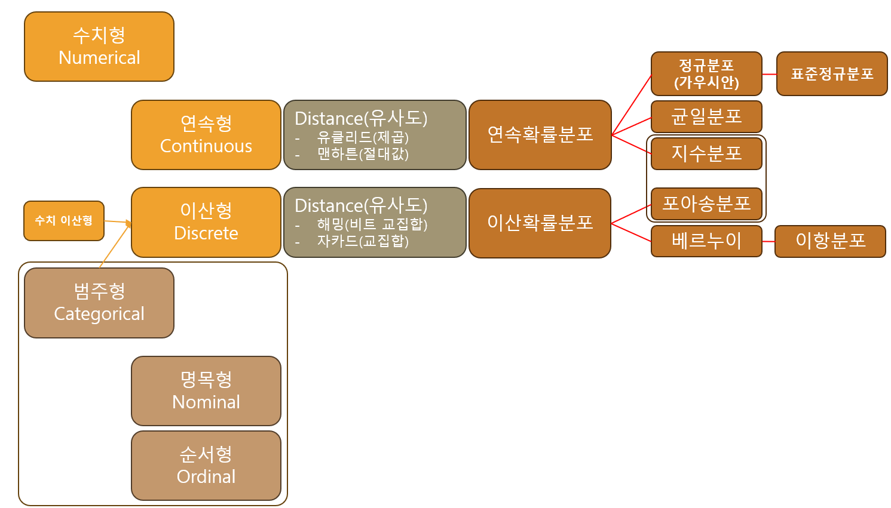

- 데이터 -> 분포

## 데이터 종류

### 수치형(Numerical)
- 연속형(Continuous) : 유리수 이상
- 이산형(Discrete) : 정수, 자연수, ***범주형***

### 범주형(Categorical)
- 명목형(Nominal) : 성별, 지역 등
- 순서형(Ordinal) : 등수, 만족도(상/중/하), 금/은/동 등
- **이산형으로 변형**
    - 알고리즘 계산을 위해 글자를 숫자로 변형
        1. 레이블 : 가중치 줄 수 있는 순서나 크기의 의마기 있는 데이터
            - 금/은/동 : 3, 2, 1 로 임의로 숫자를 매겼으나 가치에 대한 가중치 의미를 부여할 수 있음
        2. 원핫인코딩 : 순서나 크기의 의미가 없는 데이터

# 확률 분포 정리

## 1. 이산확률분포 (Discrete Probability Distribution)

데이터가 1개, 2개처럼 딱딱 끊어지는 **정수(이산형 데이터)**일 때 사용하는 분포. 주로 "횟수"나 "성공/실패"를 다룬다.

### 베르누이 분포 (Bernoulli Distribution)

- **개념**: 결과가 오직 '성공(1)' 아니면 '실패(0)', 딱 두 가지만 있는 **단 1번의 시도**에 대한 분포.
- **예시**: 동전을 한 번 던져 앞면이 나올 확률 (성공 확률 $p$).

### 이항 분포 (Binomial Distribution)

- **개념**: 베르누이 시행(성공 확률이 $p$인 실험)을 여러 번($n$번) 반복했을 때, **성공한 '횟수'**가 따르는 분포.
- **예시**:
  - 주사위를 10번 던져서 숫자 6이 나오는 횟수
  - 불량률이 5%인 공장에서 100개의 제품을 뽑았을 때 불량품의 개수

### 포아송 분포 (Poisson Distribution)

- **개념**: 정해진 시간이나 공간 안에서 아주 드물게 발생하는 사건의 **'발생 횟수'**를 나타내는 분포. (평균 발생 횟수 $\lambda$가 핵심 파라미터)
- **예시**:
  - 하루 동안 콜센터에 걸려 오는 항의 전화 횟수
  - 책 한 페이지에 있는 오타의 개수

---

## 2. 연속확률분포 (Continuous Probability Distribution)

데이터가 키, 몸무게, 시간처럼 소수점 아래로 무한히 쪼개질 수 있는 **연속형 데이터**인 경우에 사용하는 분포.

### 정규 분포 (Normal / Gaussian Distribution)

- **개념**: 통계학의 꽃이자 세상에서 가장 중요한 분포. 평균($\mu$)을 중심으로 양쪽이 대칭인 아름다운 **'종 모양(Bell Curve)'**을 그린다. 자연계와 사회의 수많은 데이터가 이 분포를 따른다.
- **예시**:
  - 대한민국 성인 남성의 키
  - 수능 점수 분포

### 표준정규분포 (Standard Normal Distribution)

- **개념**: 수많은 정규분포들을 서로 비교하기 위해, 평균을 0, 표준편차를 1로 강제로 통일(표준화, **Z-score**)시킨 분포.
- **예시**: "내 키(175cm)가 상위 몇 %인지" 확률을 계산할 때 사용.

### 지수 분포 (Exponential Distribution)

- **개념**: 포아송 분포와 단짝. 포아송이 '발생 횟수'라면, 지수 분포는 **'다음 사건이 일어날 때까지 걸리는 대기 시간'**을 나타낸다.
- **예시**:
  - 버스 정류장에서 다음 버스가 올 때까지 기다리는 시간
  - 기계가 고장 날 때까지 걸리는 시간(수명)

### 균일 분포 (Uniform Distribution)

- **개념**: 특정 구간 내에서 모든 값이 나타날 확률이 **완벽하게 똑같은** 평평한 분포.
- **예시**: 0부터 1 사이에서 난수(Random Number)를 뽑을 때.

---

## 한눈에 비교

| 구분 | 분포 | 핵심 파라미터 | 다루는 것 |
|------|------|---------------|-----------|
| 이산 | 베르누이 | $p$ | 1회 성공/실패 |
| 이산 | 이항 | $n, p$ | $n$회 중 성공 횟수 |
| 이산 | 포아송 | $\lambda$ | 단위 구간 내 발생 횟수 |
| 연속 | 정규 | $\mu, \sigma$ | 종 모양 데이터 |
| 연속 | 표준정규 | — | 표준화된 정규분포 |
| 연속 | 지수 | $\lambda$ | 사건 사이 대기 시간 |
| 연속 | 균일 | $a, b$ | 구간 내 균등한 값 |

## 모델

### 1. Linear Regression

### 2. Binary Logistic Regression

### 3. k-NN

### 4. Decision Tree

### 5. Random Forest

### 6. Naive-Bayes Classification

### 7. k-Means Clustering
|학습유형|모델|독립변수|문제유형|종속변수|성능평가|
|-|-|-|-|-|-|
|지도|Linear Regression|연속형|회귀|연속형|MSE, RMSE, MAE, MAPE, $R^2$(결정계수)|
|지도|Naive-Bayes|이산형(text)|분류|이산형|혼동행렬(Accuracy, Precision, Recall,F1-score), ROC-AUC|
|지도|Binary Logistic Regression|연속형/이산형|분류|이산형(0,1)|혼동행렬(Accuracy, Precision, Recall,F1-score), ROC-AUC|
|지도|Decision Tree|연속형/이산형|*회귀  *분류|*연속형  *이산형|[분류] 불순도(지니/엔트로피) / [회귀] MSE|
|지도|Random Forest|연속형/이산형|*회귀  *분류|*연속형  *이산형|앙상블 평균, voting|
|지도|k-NN|연속형(scaling)|*회귀  *분류|*연속형  *이산형|*MSE, RMSE, MAE, MAPE, $R^2$(결정계수)   *혼동행렬(Accuracy, Precision, Recall,F1-score), ROC-AUC|
|비지도|k-Means|연속형(scaling)|군집|없음|실루엣 계수(Silhouette), 응집도(Inertia)|

## 성능평가
### Mean, Distance 이용
- 이상치
- 스케일링
- 범주형 -> 이산형

1. k-means : 요소 간 거리 계산
    - 범주형 -> 이산형 : 원핫인코딩

### 📊 [머신러닝 핵심 수식 및 평가지표 총정리]

| 분류 | 지표 / 수식명 | 수식 (Formula) | 최솟값 | 최댓값 | 핵심 의미 및 해석 |
| :--- | :--- | :--- | :---: | :---: | :--- |
| **회귀 평가** | **MSE** (평균제곱오차) | $$\frac{1}{n}\sum(y_i - \hat{y}_i)^2$$ | $0$ | $\infty$ | 예측값과 실제값의 오차 크기. 🌟 **작을수록 좋음 (0이 완벽).** |
| | **$R^2$** (결정계수) | $$1 - \frac{SSE}{SST}$$ | $0$ | $1$ | 모델이 데이터를 얼마나 잘 설명하는가. 🌟 **1에 가까울수록 완벽한 설명력.** |
| **로지스틱 회귀** | **Sigmoid** (로지스틱 함수) | $$p = \frac{1}{1 + e^{-x}}$$ | $0$ | $1$ | 입력 데이터를 0~1 사이의 확률로 변환. 🌟 **보통 0.5를 기준으로 분류(Threshold).** |
| | **Odds** (오즈) | $$\frac{p}{1-p}$$ | $0$ | $\infty$ | 실패 확률 대비 성공 확률의 비율. 🌟 **1보다 크면 성공 확률이 더 높다는 뜻.** |
| **분류 평가** | **Accuracy** (정확도) | $$\frac{TP + TN}{TP + TN + FP + FN}$$ | $0$ | $1$ | 전체 예측 중 정답을 맞힌 비율. 🌟 **클래스 불균형 시 신뢰할 수 없음.** |
| | **Precision** (정밀도) | $$\frac{TP}{TP + FP}$$ | $0$ | $1$ | 모델이 '양성(1)'이라 예측한 것 중 진짜 양성의 비율. 🌟 **FP(오진)를 줄이는 것이 목표일 때 중요.** |
| | **Recall** (재현율 / TPR) | $$\frac{TP}{TP + FN}$$ | $0$ | $1$ | 실제 '양성(1)'인 데이터 중 모델이 찾아낸 비율. 🌟 **FN(놓친 정답)을 줄이는 것이 목표일 때 중요.** |
| | **F1 Score** (조화평균) | $$2 \times \frac{\text{Precision} \times \text{Recall}}{\text{Precision} + \text{Recall}}$$ | $0$ | $1$ | 정밀도와 재현율이 한쪽으로 치우치지 않았는지 평가. 🌟 **데이터 불균형 상태에서 가장 중요한 지표.** |
| **트리 모델** | **Gini Index** (지니 불순도) | $$1 - \sum p_i^2$$ | $0$ | $0.5$ | 노드 내에 서로 다른 데이터가 얼마나 섞여 있는지 측정. 🌟 **작을수록 순수(Pure)하며, 분할의 기준이 됨.** (이진분류 기준 최대 0.5) |
| | **Entropy** (엔트로피) | $$-\sum p_i \log_2(p_i)$$ | $0$ | $1$ | 정보의 불확실성 또는 혼잡도. 🌟 **작을수록 좋음.** (이진분류 기준 최대 1) |
| **군집 평가** | **Silhouette** (실루엣 계수) | $$s(i) = \frac{b(i) - a(i)}{\max(a(i), b(i))}$$ | $-1$ | $1$ | 군집 내 데이터는 뭉쳐 있고(a), 다른 군집과는 멀리 떨어져 있는지(b) 평가. 🌟 **1에 가까울수록 군집화가 완벽히 잘 됨.** |
| | **Dunn** | $$\frac{b}{a}$$ | $0$ | $\infty$ | 군집 내 데이터는 뭉쳐 있고(a), 다른 군집과는 멀리 떨어져 있는지(b) 평가. 🌟 **무한대에 가까울수록 군집화가 완벽히 잘 됨.** |
| **관계 분석** | **Pearson $r$** (피어슨 상관계수) | $$\frac{\text{Cov}(X, Y)}{S_X S_Y}$$ | $-1$ | $1$ | 두 연속형 변수 간의 **선형(직선)** 관계 강도. 🌟 **0이면 선형 관계 없음, ±1이면 완벽한 직선.** |
| | **Spearman $\rho$** (스피어만 상관계수)| $$1 - \frac{6 \sum d_i^2}{n(n^2 - 1)}$$ | $-1$ | $1$ | 데이터의 **순위(Rank)**를 이용한 비선형적 단조 관계 평가. 🌟 **이상치에 강하며, 곡선 형태의 비례/반비례도 잡아냄.** |

### 💡 실무 암기 팁 (결정의 순간들)

* **0이 좋은 녀석들 (에러, 불순도 계열):** MSE, 지니 지수, 엔트로피 $\rightarrow$ *낮출수록 모델이 똑똑해집니다.*
* **1이 좋은 녀석들 (성능 지표 계열):** $R^2$, Accuracy, Precision, Recall, F1 Score $\rightarrow$ *높을수록 모델이 똑똑해집니다.*
* **$\pm1$이 좋은 녀석들 (관계, 군집 계열):** 상관계수($r$, $\rho$), 실루엣 계수 $\rightarrow$ *0에서 멀어질수록 성격이 뚜렷해집니다.*

### 회귀모델
$$
error(오차) : y_i-\hat y_i
$$
$$
실제값(데이터값) : y_i
$$
$$
예측값 : \hat y_i
$$

#### 1. MSE(Mean Square Error) = 오차제곱평균
- Error 의 Square의 Mean
$$
MSE = \frac{\Sigma^n_{i=1}(y_i-\hat y_i)^2}{n}
$$

#### 2. RMSE(Root Mean Square Error) = 오차제곱평균제곱근
- Error 의 Square의 Mean
$$
RMSE =\sqrt{MSE} = \sqrt{\frac{\Sigma^n_{i=1}(y_i-\hat y_i)^2}{n}}
$$

#### 3. MAE(Mean Absolute Error) = 오차절대값평균
$$
MAE = \frac{\Sigma^n_{i=1}|y_i-\hat y_i|}{n}
$$

#### 4. MAPE(Mean Absolute Error) = 오차절대값평균
$$
MAPE = \frac{\Sigma^n_{i=1}|\frac{y_i-\hat y_i}{y_i}|}{n}*100
$$

### 분류모델
- 혼동행렬
    ||model이 예측한 Negative|model이 예측한 Positive|
    |-|-|-|
    |Real 데이터의 Negative|TN|FP|
    |Real 데이터의 Positive|FN|TP|
    
    $$
    Accuracy = \frac{TP+TN}{TP+TN+FP+FN}
    $$

    $$
    Precision = \frac{TP}{TP+FP}
    $$
    - model이 맞다고 한 것 중 model이 맞은 것

    $$
    Recall = \frac{TP}{TP+FN}
    $$
    - Real 맞는 데이터 중 model 이 맞은 것

    $$
    F1 Score = 2\frac{precision*recall}{precision + recall}