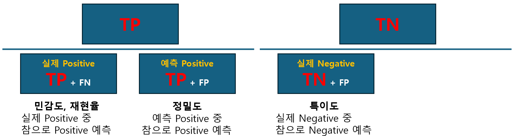
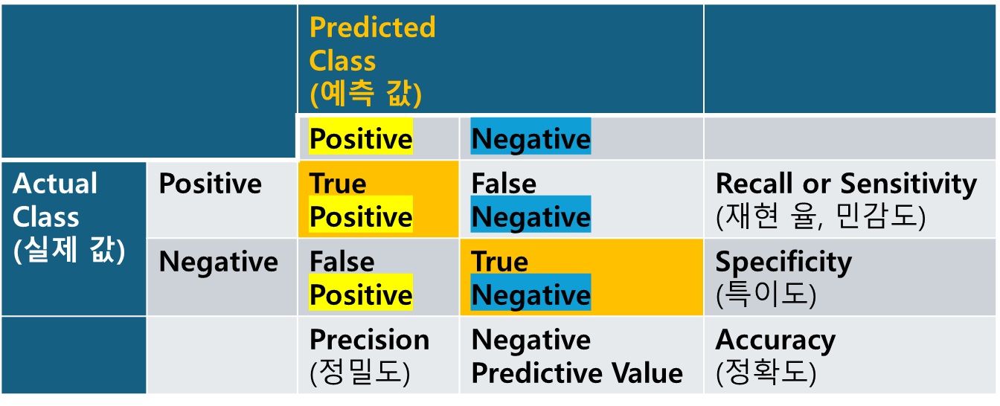
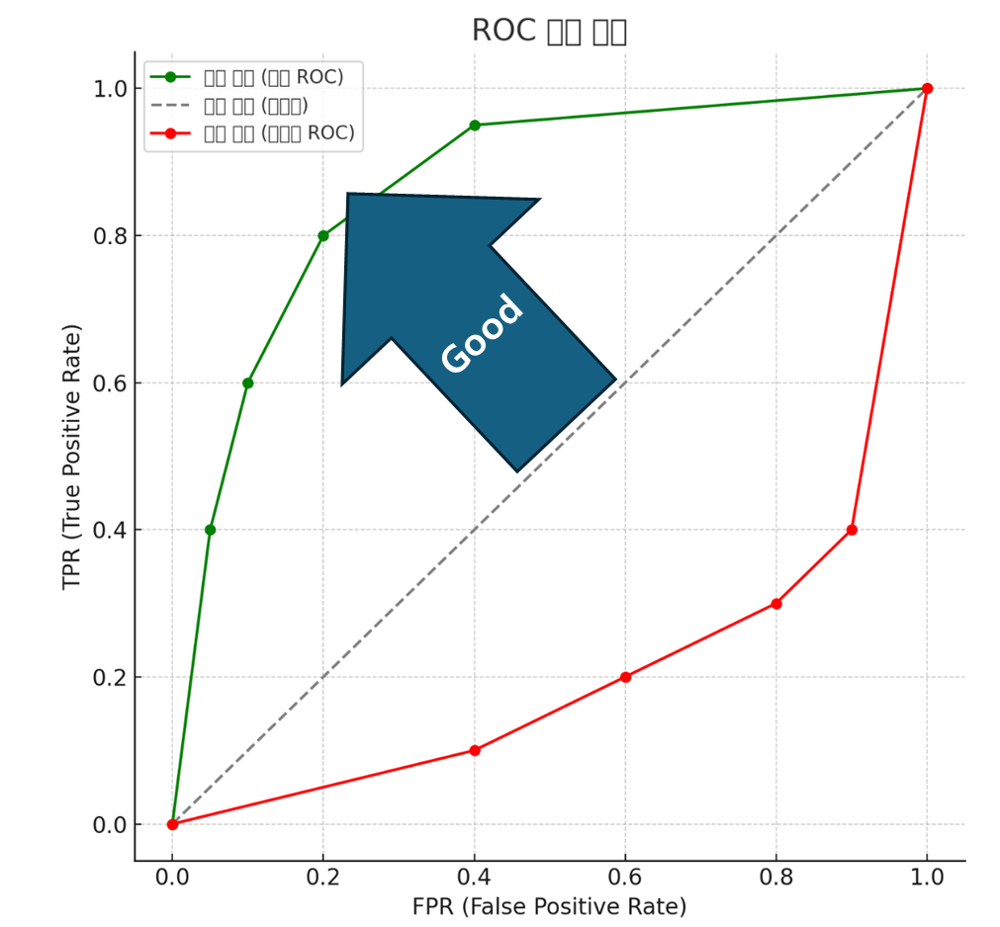
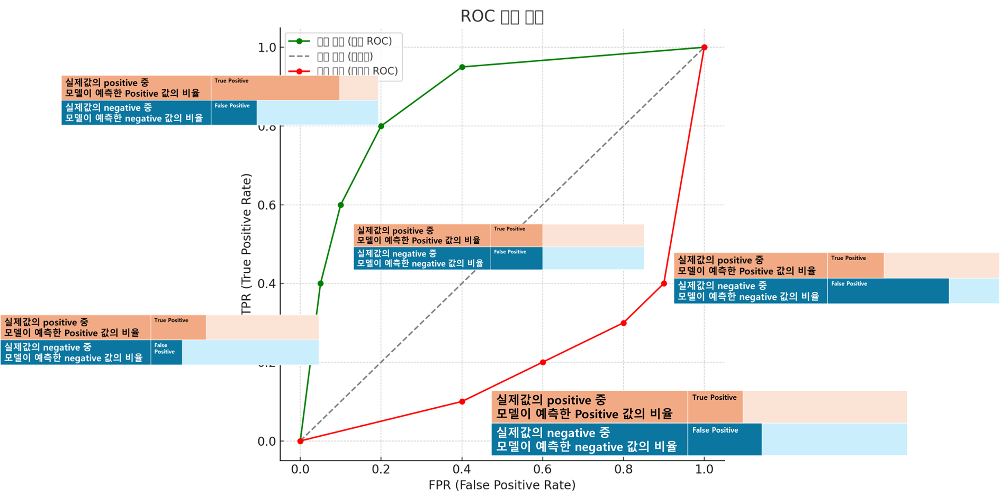

# 머신러닝의 평가

```
- 숫자로 표현
    - 가능 : Numerical(수치형)
        - Discrete (이산형)
            - 정수
        - Continuous (연속형)
            - 유리수
    - 불가능 : Categorical(범주형)
        - Nominal(명목형)
            - 빨,주,노
        - Ordinal(순서형)
            - 수,우,미,양,가
```

## 회귀모델의 평가지표

### 분류형
- 분류형의 평가는  
    postive(정분류)  
    negative(오분류)  
를 기준으로 한다.

#### 혼동행렬(confusion metrix)

- 모델이 예측한 값과 실제 정답을 Positive/Negative로 나누어 비교한 표
- 모든 판단 기준은 모델의 예측값이다.
    - 그러므로 모델이 판단한 P 중 실제값과 일치하면 T, 틀리면 F
    - 실제값의 P, N는 고정되고 모델을 튜닝하면서 예측값의 P, N 이 바뀌는 것
- 분자에 TP(예측이 postive 를 실제 찾아낸) 가 있으면 1에 가까울 수록 좋다.
    - Precision, Recall, Accuracy, F1 score
- Accuracy를 제일 먼저 사용
    - TN 도 같이 쓰이므로 정확도가 높다고해서 TP가 높다고 할 수 없다. 즉 TP가 낮아도 정확도는 높을 수 있다.
    
- **예측 값**이 **실제 값**과 어떠한가?
- 얼마나 정밀하게 맞췄나?(예측값 전체 중 positive 예측 값)



| 지표 | 수식 | 의미 | 특징 |
|------|------|------|------|
| **Accuracy** (정확도) | $\frac{TP + TN}{TP + TN + FP + FN}$ | 전체 예측 중 맞춘 비율 | 클래스 비율이 균형 잡힌 데이터에서 유용 |
| **Precision** (정밀도) | $\frac{TP}{TP + FP}$ | Positive로 예측한 것 중 실제 Positive 비율 | FP(거짓 양성)를 줄이는 데 초점 |
| **Recall** (재현율, 민감도, Sensitivity) | $\frac{TP}{TP + FN}$ | 실제 Positive 중 모델이 맞춘 비율 | FN(거짓 음성)를 줄이는 데 초점 |
| **Specificity** (특이도) | $\frac{TN}{TN + FP}$ | 실제 Negative 중 모델이 맞춘 비율 | Negative 예측 성능 평가 |
| **F1-score** | $\frac{2 \times Precision \times Recall}{Precision + Recall}$ <br>또는 <br> $\frac{2TP}{2TP + FP + FN}$ | Precision과 Recall의 조화평균 | Precision과 Recall 균형 평가 |

- F1 스코어는 TN를 제외한 대신 TP 를 더 강력하게 넣었다고 생각하자


### ROC(Receiver Operationg characteristic Curve)

- 예측한 positive 중 False Positive와 True Positive의 관계
    - 잘못 예측한 positive(실제 negative)와 참 positive의 관계
     예측한 Positive = True Positive + False Positive
- 값들은 실제값이 기준이 되어야하니
    - True Positive : 민감도(TP/실제값 P)\
         $$ \frac{TP}{TP + FN} $$
    - False Positive : 1-특이도 (FP/실제값 N)
         $$ \frac{FP}{TN + FP} $$

- 
    - 잘못 판단한 P(FP)에 비해 잘 판단한 P(TP)가 높을수록 좋음
        - 자연스레 곡선아래면적은 1에 수렴할 수록 모델의 성능이 좋음을 알 수 있음(AUC = Area of Under Curve)
            | 곡선 색         | 설명                                                             |
            | ------------ | -------------------------------------------------------------- |
            | 🟢 **좋은 모델** | ROC 곡선이 **왼쪽 위로 굽어 있음** → 낮은 FPR + 높은 TPR → **정확하고 신뢰도 높은 모델** |
            | ⚪ **랜덤 추측**  | 대각선 (FPR = TPR) → 동전 던지기 수준                                    |
            | 🔴 **나쁜 모델** | ROC 곡선이 **오른쪽 아래로 굽음** → 거짓 양성이 많고 진짜 양성은 못 잡음 → **최악의 모델**    |

- 

