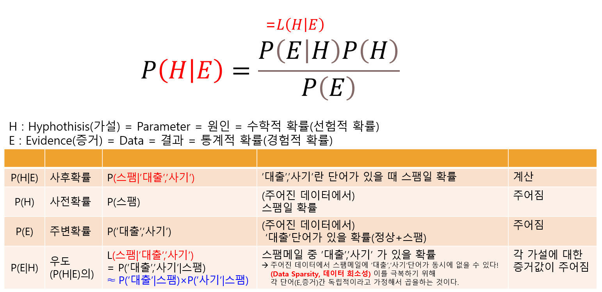

## 나이브 베이즈 분류기

## 예시
- 메일 중 스팸메일 분류하기
    - 메일, 스팸메일 모두 단어의 조합.
    - 가지고 있는 데이터에서 스팸메일에 있는 단어들을 이용한다.
        - E : 메일에 있는 단어(스팸메일 단어 + 일반 단어), H : 스팸메일에 있는 단어
            - E : 메일에 있는 단어'들'
            - H : 스팸메일에 있는 단어'들'
            - P(H|E) : 메일에 있는 단어 중 스팸메일에 있을 확률
            - P(E|H) : 스팸메일에 있는 단어가 메일에 있을 확률
                - 스팸메일에 있는 모든 단어로 선정한 단어가 메일에 없을 수도 있다.
                    - 1 스팸메일 = {'대출', '완벽'}  
                      2 스팸메일 = {'대출', '사랑'}  
                      H = {'대출', '완벽', '사랑'}
                - 그래서 이 때 단어들(feature) 끼리는 연관이 없는 '독립'이라고 가정하고, 이를 베이즈 시행을 이용해 사건간 곱으로 대신하는 것이다
                    - $$ P(E|H) = \Pi_{i=1}^k P(E_i|H)$$
                    - $$ E_i = \{'일반단어', '스팸단어들'\}$$

## 정리
- 모든 feature는 독립이라고 가정

## 특징
- 적은데이터로 좋은 성능
- 데이터를 독립으로 취급
- 이상치 민감
- 유형
    1. 가우시안 나이브 베이즈 
    2. 다항 나이브 베이즈
    3. 베르누이 나이브 베이즈
- Laplace smoothing
    - 학습 데이터에 존재하지 않는 원소에 의해 P(E|H)가 0이 되는 것을 막기 위한 방법
    - 원소 최소등장횟수 1을 더함
    - 원소 집합 V 크기만큼 적용
## 개념

## 성능평가
- 혼동행렬
- ROC-AUC

## 고려사항
- 이상치, 결측치 제거
- 강한 상관관계 독립변수 제거
- 과신 : 중복된 정보가 많아지면 모델이 예측에 대해 지나치게 확신