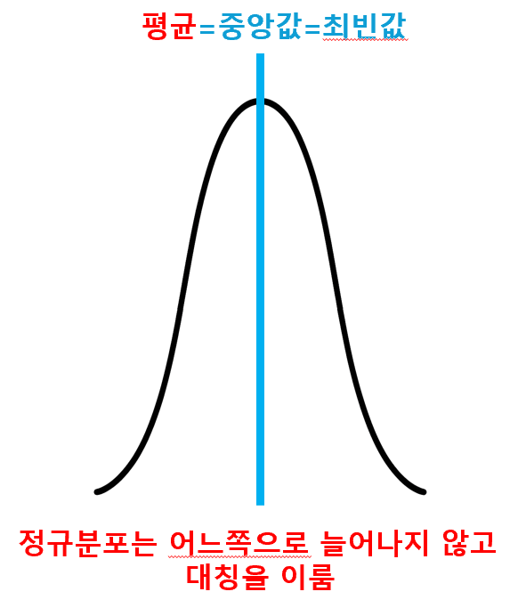
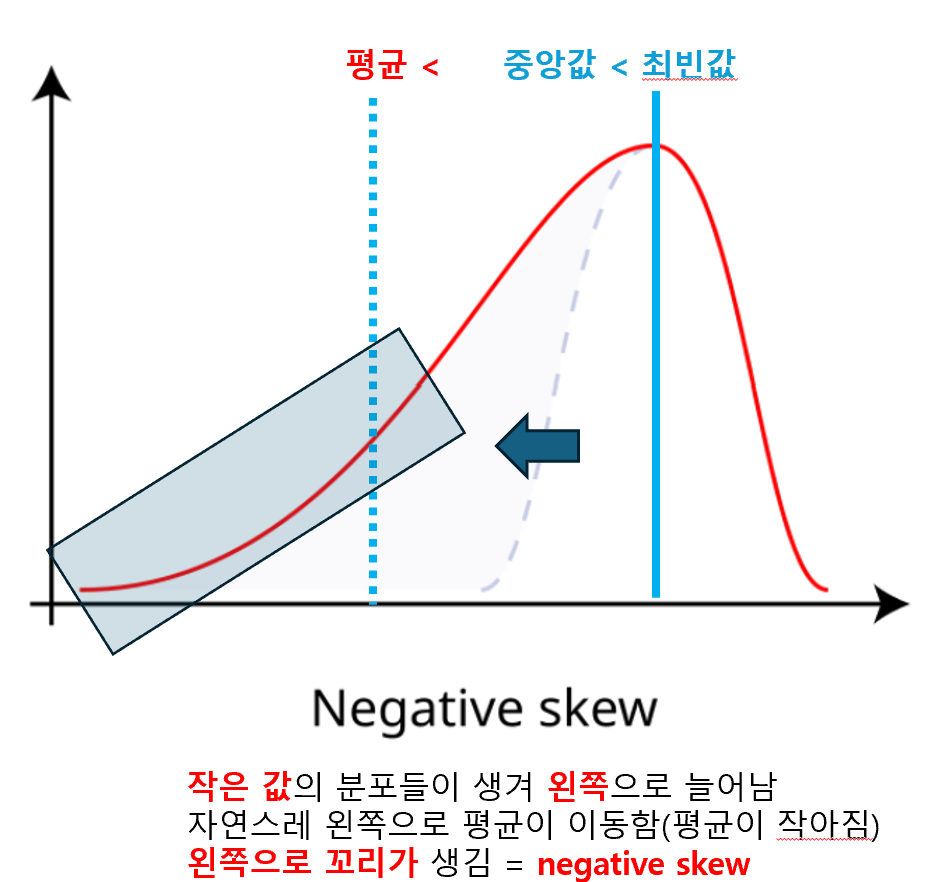
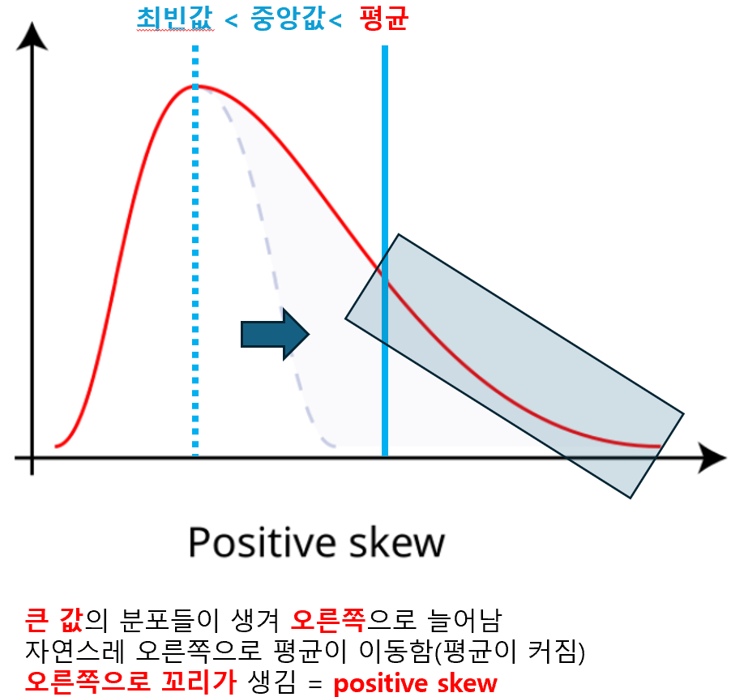

## 왜도
- 왜곡된 정도
- skewnewss
    - 비스듬해진 정도
- 늘어나서 꼬리가 생기는게 판단기준이다.
    - 이름 자체가 왜도다. 즉 왜곡을 유발하는 값들로 인해 꼬리가 생김을 봐야한다.

1. 정규분포를 이루는 데이터가 처리하기 좋다.

- 하지만 비정규분포를 이루는 경우가 더 많은데, 이 때 정규분포에서 얼마나 왜곡된 정도가 있는가 를 보는게 왜도(skewness)이다.

- 왜곡된 정도를 파악하는 것 중 **왜곡을 유발하는 값들** 이 정규분포 상 오른쪽에 있나, 왼쪽에 있나를 파악하기가 용이하다.

2. negative skew
- 잘 있다가 왼쪽으로 분포된 놈들이 생겨 왼쪽으로 꼬리가 생김
- 평균도 왼쪽으로 가게 됨. 작아짐.
    - 평균 < 중앙값 < 최빈값
- 

3. positive skew
- 잘 있다가 오른쪽으로 분포된 놈들이 생겨 오른쪽으로 꼬리가 생김
- 평균도 오른쪽으로 가게 됨. 커짐.
    - 최빈값 < 중앙값 < 평균
- 