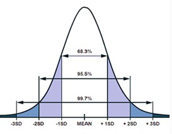
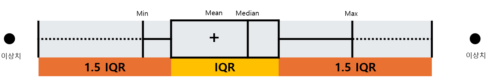

## 이상치
- 데이터의 중심 경향에서 일정 이상 떨어진 값
- 이상치 판별법
    - 어느 경우 어떻게 이용에 대한 절대적 기준은 없다.

### 1. 분산
- 
    - 3SD(Standard Deviation) 을 넘으면 이상치
- 기하평균
- 사분위수
    - 
        - 1.5 IQR을 넘으면 이상치

### 2. 우도(likelihood)
- 베이즈 정리

### 3. K-NN(최근접이웃)
- 데이터 주변 K개의 데이터간 거리값이 크면 이상치
- 밀도,군집분석