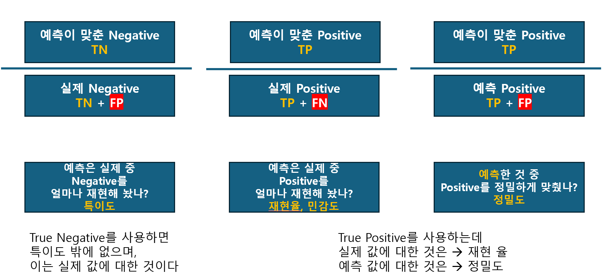

# 머신러닝의 평가

```
- 숫자로 표현
    - 가능 : Numerical(수치형)
        - Discrete (이산형)
            - 정수
        - Continuous (연속형)
            - 유리수
    - 불가능 : Categorical(범주형)
        - Nominal(명목형)
            - 빨,주,노
        - Ordinal(순서형)
            - 수,우,미,양,가
```

## 회귀모델의 평가지표

### 분류형
- 분류형의 평가는  
    postive(정분류)  
    negative(오분류)  
를 기준으로 한다.

#### 혼동행렬(confusion metrix)

- 모델이 예측한 값과 실제 정답을 Positive/Negative로 나누어 비교한 표
- 분자에 TP(예측이 postive 를 실제 찾아낸) 가 있으면 1에 가까울 수록 좋다.
    - Precision, Recall, Accuracy, F1 score
- Accuracy를 제일 먼저 사용
    - TN 도 같이 쓰이므로 정확도가 높다고해서 TP가 높다고 할 수 없다. 즉 TP가 낮아도 정확도는 높을 수 있다.
    
- **예측 값**이 **실제 값**과 어떠한가?
- 얼마나 정밀하게 맞췄나?(예측값 전체 중 positive 예측 값)



| 지표 | 수식 | 의미 | 특징 |
|------|------|------|------|
| **Accuracy** (정확도) | $$ \frac{TP + TN}{TP + TN + FP + FN} $$ | 전체 예측 중 맞춘 비율 | 클래스 비율이 균형 잡힌 데이터에서 유용 |
| **Precision** (정밀도) | $$ \frac{TP}{TP + FP} $$ | Positive로 예측한 것 중 실제 Positive 비율 | FP(거짓 양성)를 줄이는 데 초점 |
| **Recall** (재현율, 민감도, Sensitivity) | $$ \frac{TP}{TP + FN} $$ | 실제 Positive 중 모델이 맞춘 비율 | FN(거짓 음성)를 줄이는 데 초점 |
| **Specificity** (특이도) | $$ \frac{TN}{TN + FP} $$ | 실제 Negative 중 모델이 맞춘 비율 | Negative 예측 성능 평가 |
| **F1-score** | $$ \frac{2 \times Precision \times Recall}{Precision + Recall} $$<br>또는 $$ \frac{2TP}{2TP + FP + FN} $$ | Precision과 Recall의 조화평균 | Precision과 Recall 균형 평가 |

- F1 스코어는 TN를 제외한 대신 TP 를 더 강력하게 넣었다고 생각하자
- Accu