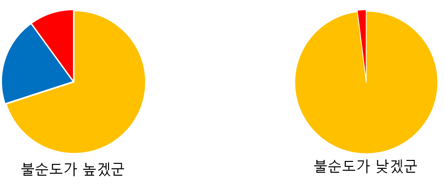

## Decision Tree
```
정리
- 불순도
    - 범주형 : 지니지수, 엔트로피
    - 수치형 : 분산
- 정보이득
```

```
- 숫자로 표현
    - 가능 : Numerical(수치형)
        - Discrete (이산형)
            - 정수
        - Continuous (연속형)
            - 유리수
    - 불가능 : Categorical(범주형)
        - Nominal(명목형)
            - 빨,주,노
        - Ordinal(순서형)
            - 수,우,미,양,가
```

### Decision Tree란?

- **트리 형태의 규칙**으로 입력을 쪼개 가며 **분류**(명목형)나 **회귀**(수치형)를 수행하는 모델.
  - 입력데이터 : 수치형, 분류형 모두 사용가능
  - **출력데이터** 및 분류
    - Regression Tree : 수치형
    - Classification Tree(분류나무) : 명목형
- 사람이 읽기 쉬운 **IF–THEN 규칙**으로 설명 가능해 **해석**이 용이

### 특징

- feature 에 따라 데이터를 분할함
  - 리프로 갈수록 데이터 개수가 줄어들수 있고 같은 depth의 데이터를 합하면 전체 데이터 개수가 됨
- 각 가지에서 다시 가장 좋은 특성을 골라 **반복 분할**
- 더 이상 쪼개지 않거나 제한에 도달하면 **리프 노드**가 됨
  - **분류**: 리프 안의 **다수 클래스**(또는 클래스 확률)로 예측
  - **회귀**: 리프 안의 **평균/중앙값**으로 예측

### 분할 기준(불순도 ↘︎)

- 불순도 :  단순히 클래스 개수가 많다고 해서 높아지는 게 아니라,
클래스별 비율이 서로 비슷한가?
  - 
    - 종류가 아니라 종류가 있는데, 종류들끼리 차지하는 정도가 불순도가 높다와 낮다를 구분한다.

| 구분                 | **분류트리 (Classification Tree)**                                           | **회귀트리 (Regression Tree)**                                                            |
| ------------------ | ------------------------------------------------------------------------ | ------------------------------------------------------------------------------------- |
| **타겟(목표변수) 타입**    | **범주형(Categorical)** <br> 예: 스팸/정상, A/B/C 등급                             | **수치형(Numerical)** <br> 예: 가격, 온도, 무게                                                 |
| **예측 결과**          | 범주(Label)                                                                | 연속값(Value)                                                                            |
| **입력(Feature) 타입** | 범주형·수치형 모두 가능                                                            | 범주형·수치형 모두 가능                                                                         |
| **주요 불순도/분할 지표**   | - 확률기반  <br> - 지니 지수(Gini Index) <br> - 엔트로피(Entropy) |- 오차기반 <br>  - 분산 감소 <br> - MSE 감소<br> - MAE 감소 |
| **사용 예시**          | 고객 이탈 여부 예측, 암 진단(양성/음성)                                                 | 집값 예측, 주가 예측                                                                          |

---

### 분류트리(범주형) 불순도 지표

| 지표                                  | 수식                                                     | 의미                                      | 특징                        |
| ----------------------------------- | ------------------------------------------------------ | --------------------------------------- | ------------------------- |
| **지니 지수 (Gini Index)**              | $\displaystyle Gini = 1 - \sum_{i=1}^K p_i^2$          | 데이터 집합에서 임의로 2개 뽑았을 때 **서로 다른 클래스일 확률** | 0 ~ 0.5 |
| **엔트로피 (Entropy)**                  | $\displaystyle Entropy = -\sum_{i=1}^K p_i \log_2 p_i$ | 데이터 집합의 **불확실성** 측정                     | 0 ~ 1  |

- K개의 클래스라면

    | 지표                                        | 최대 불순도 조건      | 최대값                                   | 최소값|
    | ----------------------------------------- | -------------- | ------------------------------------- |----- |
    |  지니지수        | 모든 $p_i = 1/K$ | $1 - \frac{1}{K}$ <br>(예: 2클래스 → 0.5) | 0|
    | 엔트로피 | 모든 $p_i = 1/K$ | $\log_2 K$ <br>(예: 2클래스 → 1.0)        | 0|

- 지니계수 0 ~ 0.5
  - 0 : 한 클래스만 있는 순수 노드
  - 0.5 : 두개 클래스가 딱 반반(최대 불순도)
  - 이진 분할이니까
  - 단순한 제곱이라 계산이 빠름

- 엔트로피 0 ~ 1
  - 0 : 한 클래스만 있는 순수 노드(log1 =0)
  - 1 : 두개 클래스가 딱 반반(최대 불순도)
  - 로그라 계산이 느림

### 회귀트리(수치형) 불순도 지표

| 지표 | 수식 | 의미 | 특징 |
|---|---|---|---|
| **분산 감소 (Variance Reduction)** | $\displaystyle Var(S)=\frac{1}{n}\sum_{j=1}^{n}(y_j-\bar{y})^2$ | 분할 전후의 **분산 차이** 최대화 | 데이터 퍼짐 정도 |
| **MSE 감소 (Mean Squared Error Reduction)** | $\displaystyle MSE=\frac{1}{n}\sum_{j=1}^{n}(y_j-\hat{y})^2$ | 예측값과 실제값의 **제곱 오차 평균** | 이상치에 민감 |
| **MAE 감소 (Mean Absolute Error Reduction)** | $\displaystyle MAE=\frac{1}{n}\sum_{j=1}^{n}\left\lvert y_j-\hat{y}\right\rvert$ | 예측값과 실제값의 **절대 오차 평균** | 이상치에 강건 |

- 결국 MSE는 분산이랑 구조가 똑같다. 평균을 빼는 거 대신 예측값을 빼는 거니까. 즉 예측값과 실제값의 차이가 클수록 MSE가 커져 불순도가 높고, MSE가 작을수록 불순도가 낮을 것이다.

### Information Gain(정보 이득)
- 부모노드의 불순도와 부모노드 바로 아래 자식노드들의 불순도 합의 차이
- 자식노드들에 대한 가중치는 데이터 개수비율

$
Information Gain = Entropy(N_P) - \sum_{i=1}^n w_i \times Entropy(N_{C_i})
$

- $ N_P $ : 부모 노드  
- $ N_{C_i} $ : $ i $ 번째 자식 노드  
- $ w_i $ : $ i $ 번째 자식 노드의 가중치(노드 크기, 즉 데이터 만큼 비례)