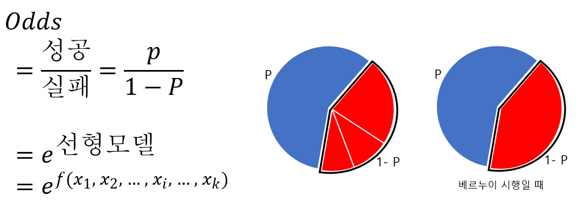
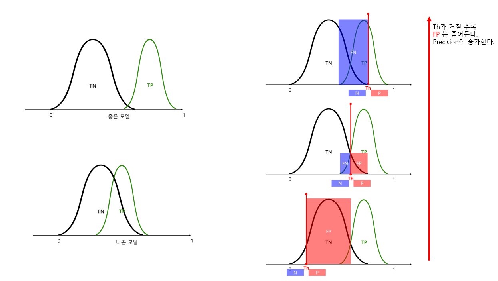
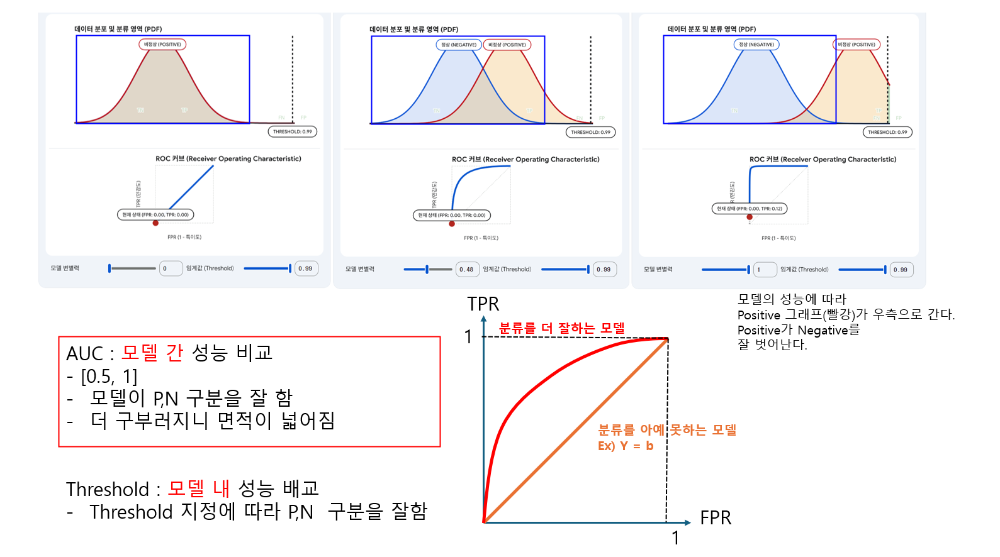
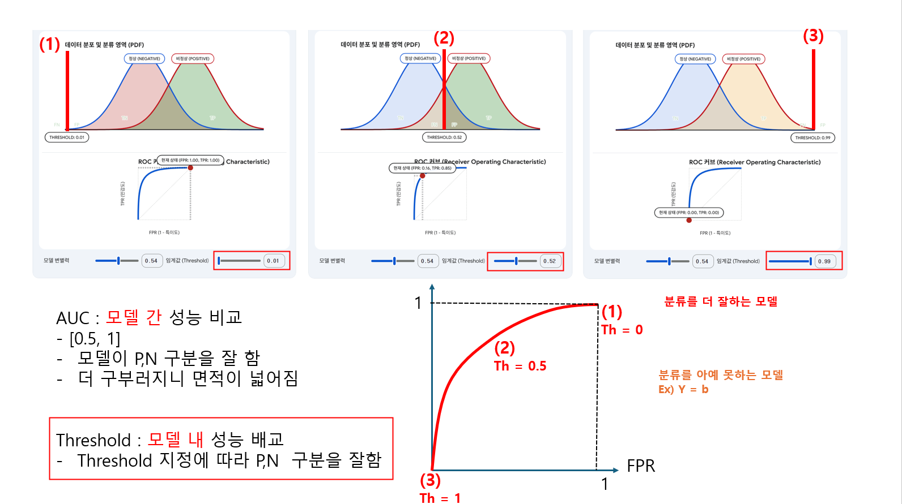
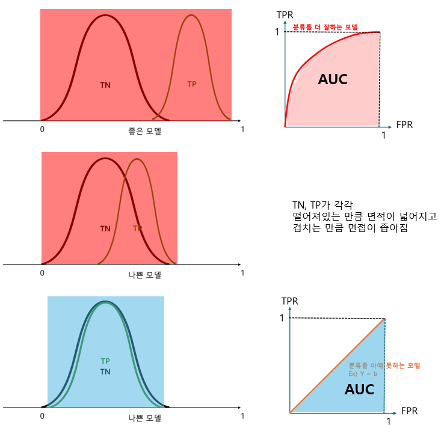

## 이항 로지스틱 회귀분석
- 모델링 : 함수만들기
- 모집단 : 모델링을 하는 목표. 모집단의 데이터에 얼마나 잘 들어맞는 모델링(함수)를 만드느냐가 목표. 하지만 모집단을 실제 데이터로 다 쓸 수가 없다. 
    - 너무 많고, 그 많은 것을 다 취집할 수도 없다.
- 표본 : 함수만들려고 쓰는 모집단 내의 데이터들
- 독립 변수 : 입력값
    - 다양한 독립변수 : 입력값의 종류는 다양할 수 있다.
    - 독립변수의 영향력 : 계수의 곱만큼 영향력이 변한다.
        - 계수는 '회귀계수'라고 한다.
- 종속 변수 : 출력값
- 평가 : 모델(함수)을 평가 --> ROC 커브
- 해석 : 독립변수(input)의 영향력 --> 승산비

### 개요
- 이항 분류 예측 모델링
    - **여러 종류 input들 -> 선형회귀 모델([$-\infty, \infty$]) -> 로지스틱**(확률, [$0, 1$]) -> threshold -> 이항분류(yes/no)
        - 여러 종류 input들
            - $$X_1, X_2,  \dots,  X_i,  \dots,  X_k$$
        - 선형회귀 모델 : 여러 종류 input들 -> 영향력(회귀계수) -> 하나의 대표값!
            - 하나의 대표값 : 선형 예측자(Linear Predictor) 또는 로짓 점수(Logit Score)
            - $$\eta = \beta_0 + \beta_1 X_1 + \dots + \beta_k X_k$$
        - 로지스틱 : [$-\infty, \infty$] --> [$0, 1$]
            - **S**igmoid 함수를 활용(Logi**S**tic) :  [$-\infty, \infty$] -->  [$0, 1$]
            - $$p = \frac{1}{1 + e^{-\eta}}$$
        - threshold : 확률값을 yes/no 의 판단기준
    - $$X_1, X_2,  \dots,  X_i,  \dots,  X_k$$
    - $$\eta = \beta_0 + \beta_1 X_1 + \dots + \beta_k X_k$$
    - $$p = \frac{1}{1 + e^{-\eta}}$$
    - $$ \hat{y} =
        \begin{cases}
        1 & \text{if } p \ge \tau \\
        0 & \text{if } p < \tau
        \end{cases}
        $$
        * $\tau$: 보통 0.5 사용
        * 확률이 기준 이상이면 "1(사건 발생)", 아니면 "0(사건 미발생)"

- 평가와 해석  
    |||
    |-|-|
    |여러 종류 input들 |해석|
    |선형회귀 모델([$-\infty, \infty$]) |평가|
    |로지스틱(확률, [$0, 1$])||
    |threshold|평가|
    |이항분류(yes/no)||
        
### 목적과 특징

### 쓰임

### 가정

### 해석
- 승산비(Odds ratio)
    - Sigmoid 함수의 분석 방법
    - 선형모델 처럼 기울기로 x증가만큼 y증가로 모델을 해석하는 것이 아니다.
    - 그래도 독립변수 x가 '어떤 영향력'인지 궁금하다.
    - x -> 선형 -> 시그모이드 -> $\^y$
    - $\frac{\Delta?}{\Delta x}$ 
    - $\^y$ 증가량 = 일정치가 않다.
    - $\frac{\^y}{1 - \^y}$ 증가량 = 일정하다
        - 로지스틱 회귀의 핵심 공식은 $\ln(Odds) = aX + b$ 
        - 여기서 $Y$ 자리에 $\ln(Odds)$가 그대로 들어갔으므로, 기울기($a$)는 다음과 같이 정의
        - $ \frac{\Delta \ln(Odds)}{\Delta X} = a \text{ (일정한 상수)} $
        - 즉, $X$가 1 증가할 때마다 '로그 승산'이 항상 $a$만큼 '더하기(+)'가 되는 것입니다!
        - 로그($\ln$)의 세계에서는 더하기(+)였던 것이, 로그를 벗고 현실 세계(승산)로 내려오면 곱하기($\times$)로 바뀝니다.그래서 "승산의 변화량($\Delta Odds$)"을 빼기(-)로 구하지 않고, 나눗셈(비율)으로 구하는 것입니다.나눗셈으로 구한 이 일정한 상수가 바로 우리가 앞서 배웠던 승산비(Odds Ratio)입니다.변화량(덧셈)의 관점: $X$가 1 증가할 때, $\ln(Odds)$는 항상 $+ a$ 만큼 일정하게 증가한다.비율(곱셈)의 관점: $X$가 1 증가할 때, $Odds$는 항상 $\times e^a$ 배(승산비)만큼 일정하게 증가한다.결론적으로, 질문자님께서 찾고자 하셨던 "일정한 상수"는 덧셈의 관점에서는 '로그 승산(Logit)', 곱셈의 관점에서는 '승산비(OR)'라는 형태로 S자 곡선 안에 완벽하게 숨어있었던 것입니다.
    - 독립변수 $x_i$가 1증가할 때
    - 승산(Odds) : 성공은 실패의 몇배인가?
        - 
            - odds = 1 : 성공과 실패가 각각 50%로 완전 랜덤
            - odds > 1 : 성공할 확률이 odds 배 높다
                - ex)승산이 1.6이면 = 성공할 확률이 1.6배 더 높다
            - odds < 1 : 성공할 확률이 odds 배 낮다
                -  실패할 확률이 1-odds 배 높다.
    - 갑자기 승산이 왜나오나?
        - 모델은 다 만든 상황 = $\beta_i$, 즉 회귀계수들의 값이 다 결정나서 함수를 만들었다.
        - p는 시그모이드(선형모델)
        선형모델 = 로짓(P/1-p)
        p/1-p = e(선형모델) = 승산
        (p/1-p)/(p\`/1-\`p) = 승산비 -> $\beta_i$ 을 구함
    - 1. 확률($y$)의 함정: "증가량이 매번 다릅니다!"일반적인 선형 회귀(직선)에서는 $x$가 1 증가할 때 $y$의 증가량이 항상 똑같습니다. (어느 구간이든 항상 +3).하지만 로지스틱 회귀의 결과인 확률($p$)은 S자 곡선을 그립니다. S자 곡선은 중심(50% 부근)에서는 아주 가파르고, 양 끝(0%나 100% 부근)에서는 아주 완만하죠.이 때문에 "현재 $x$가 어디에 있느냐에 따라, 똑같이 $x$가 1 증가해도 확률($y$)의 증가량이 고무줄처럼 변해버립니다."예시 (공부 시간 $x$ vs 합격 확률 $y$):A학생 (기초 부족): 합격 확률 1% 구간. 여기서 1시간 더 공부($x+1$)해도 확률은 2%가 됩니다. ($1\%p$ 증가)B학생 (경계선): 합격 확률 50% 구간. 여기서 1시간 더 공부($x+1$)하면 확률이 단숨에 70%가 됩니다. ($20\%p$ 증가)C학생 (수석권): 합격 확률 98% 구간. 여기서 1시간 더 공부($x+1$)해봤자 확률은 99%가 됩니다. ($1\%p$ 증가)자, 이제 팀장님이 묻습니다. "그래서 공부 시간($x$)이 1시간 늘어나면 합격 확률($y$)이 얼마나 오르나?"우리는 대답할 수가 없습니다. "음... A학생은 1% 오르고요, B학생은 20% 오르고요..." 라고 구구절절 설명해야 하니까요. 즉, $\Delta y$(확률 증가량)를 하나의 고정된 대표 숫자로 말할 수가 없는 것입니다.2. 승산비(OR)의 마법: "언제나 고정된 숫자!"이 딜레마를 해결해 주는 구원투수가 바로 승산비(Odds Ratio)입니다.우리가 파이프라인에서 보았듯, $\ln(Odds) = ax + b$ 라는 공식은 완벽한 '직선'입니다. 이 식을 수학적으로 풀면 마법 같은 일이 벌어집니다.$x$가 곡선 위 어디에 있든 상관없이, "$x$가 1 증가하면 승산(Odds)은 항상 $e^a$ 배가 된다"는 완벽하게 고정된 법칙이 만들어집니다.A학생의 합격 승산도 약 2.7배 증가B학생의 합격 승산도 약 2.7배 증가C학생의 합격 승산도 약 2.7배 증가이제 팀장님께 깔끔하게 하나의 숫자로 보고할 수 있습니다!🗣️ "팀장님, 현재 확률이 몇 % 건 간에, 공부 시간이 1시간 늘어날 때마다 합격 승산이 항상 2.7배씩 고정적으로 증가합니다!"
### 예측값 산출

### 평가
- 모델의 평가에 영향을 미치는 요소 = 선형회귀모델, threshold

#### Confusion Matrix(혼동행렬)
- 분류형 모델 평가를 위한 도구
1. 용어
    - P(Positive) : 기준이라 예측한 것
        - 양품,불량 -> 불량정도를 보니 기준삼은 것이 불량이 될 수 있다.
        - 질병 유무 -> 질병 걸린 것을 기준 삼음
    - N(Negative) : 기준이 아니라고 예측한 것
    - T(True) : 예측한 것이 맞음
        - TP : 기준삼은 것이 맞음
        - TN : 기준삼지않은 것이 맞음
    - F(False) : 예측한 것이 틀림
        - FP : 기준이라 예측한 것이 틀림 = 실제는 기준이 아님
        - FN : 기준이 아니라고 예측한 것이 틀림 = 실제는 기준임
2. P와 N의 데이터 정도에 따라 
    - P와 N의 데이터 비율이 비슷하다 : Accuracy로 평가 용이
    - P와 N의 데이터 비율이 한 쪽으로 극단적이다 : F-1 Score로 평가가 더 용이
3. 평가 척도
    - Accuracy(정확도) : $\frac{TP+TN}{TP+FN+TN+FP}$
        - 데이터 중 예측이 성공한 P, N
        - 정확도가 높다고 분류를 잘하는 것은 아니다.
        - $ TP + TN $ 은 합이기 때문에
            - $ TP >> TN $  
            $ TP << TN $  
            일 수 있어 다른 판단의 정확한 정도가 묻힌다.
    - F-1 Score : Precision과 Recall의 조화 평균
        $$ 2 \frac{precision*recall}{precision + recall}$$
        - precision 및 recall 모두 TN을 사용하지 않음. Accuracy에서 TP, TN 값이 극단적으로 한 쪽이 많은 경우가 방지됨.
        - 전반적으로 F-1 Score가 모델의 성능 평가에 더 적합하다.
    - Precision(정밀도) : $\frac{TP}{TP+FP}$
        - P라고 예측한 것 중 예측이 성공한 P
    - Recall(재현율/민감도) :  $\frac{TP}{TP+FN}$
        - Real P 중 예측이 성공한 P
4. threshold와 precision, recall
    - threshold의 조절 FP, FN을 조절하기 위함.
    - 실제 P(상수) = TP + FN
    - 실제 N(상수) = TN + FP
        
    - threshold up
        - FP down --> precision up
        - TP down
        - FN up --> recall down
    - threshold down
        - FN down --> recall up
        - TP up
        - FP up --> precision down

#### ROC Curve
- **이항분류모델은 공통으로 쓸 수 있다.**
    - 확률을 threshold에 비교하여 true, false를 결정한다.
    - 이항 로지스틱 회귀, 랜덤 포레스트, XGBoost 등
- 모델의 **'예측 성능'**을 평가하는 지표.
    - 그래서 X,Y축 모두 **예측 P**를 이용한다.
    - X축 : **틀린 예측 P**
    - 범위 : [0, 1]
    - $$\frac{FP}{TN+FP}$$
        - FP = Negative 이므로 Negative 총합이 되려면 TN+FP(상수)안에서 비율을 찾아야 한다.
    - Y축 : **맞춘 예측 P(Recall)**
    - 범위 : [0, 1]
    - $$\frac{TP}{TP+FN}$$
        - TP = Postive 이므로 Positive 총합이 되려면 TP+FN(상수)안에서 비율을 찾아야한다.
- threshold와의 관계
    - ** 중요가정 : 데이터들은 P와 N중에 비중이 치우쳐져 있다.**
        - 모델은 불량률, 질병 등이 정상과 비등비등해서 찾으려는게 아니라 상대적으로 매우 작은 양을 잘 분별해내야하는 작은 것을 잘 찾아내야 성능이 좋은 것이다.
        - 그러므로 threshold가 바뀜에따라 FN, FP의 변화정도가 TP,TN 변화정도보다 훨씬 영향력이 크게 작용하기 때문에, 상수로 인해 서로 반비례되는 (const = TP + FN) 상황이라도 영향이 비등한게 아니라 FN에 치중된다고 보면 된다. 
    - **threshold 가 증가하면 precision이 증가한다.**
        - 쭉정이(FP)가 낮아지니까
        - Positive(상수) = TP + FN
        - Negative(상수) = TN + FP
    - roc가 최악인 모델
    - 기울기가 1인 상황
        - $ Y = \beta$ 인 모델은 어떤 데이터를 넣어도 결과가 동일하니 완전 랜덤인 상황인 최악의 모델!
    - 모델 간 성능 비교 : AOC
    - 
    - 모델 내 threshold에 의한 성능 비교
    - 
- AUC
    - 

#### 우도(Liklyhood)

### 고려사항
- 일반적으로 데이터는 매우 편파적으로 되어있다.
    ex) 지문의 인식률 : 대부분 인증성공이고 소수 인증 실패
    ex) 공장의 양불판정 : 양품 99900 개, 불량품 100개

### 선행 지식