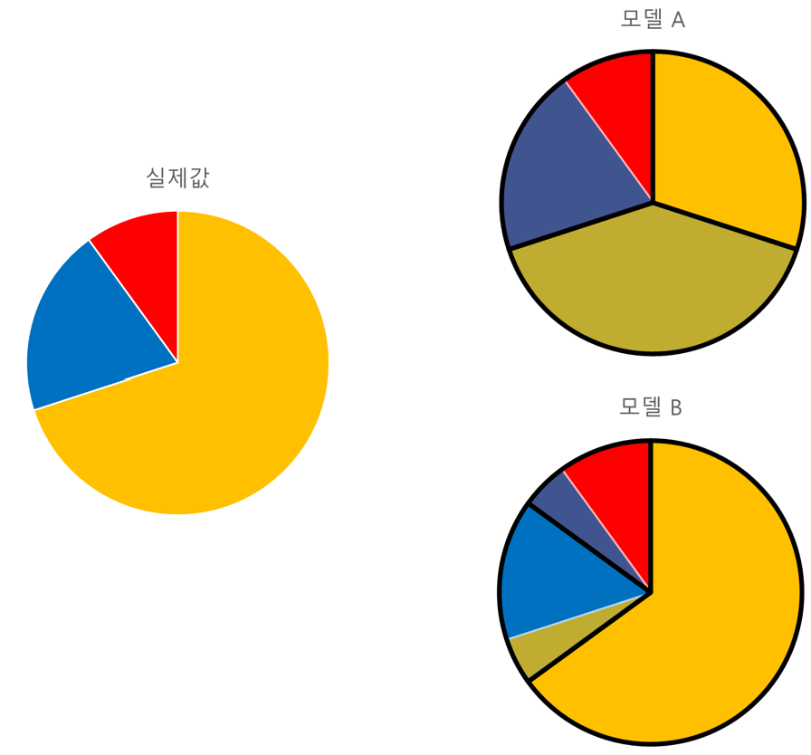

## 나이브 베이즈 분류기

### 우도(likelihood)

1. 정의 : 현재의 데이터를 잘 설명하는 "모델을 찾기"위한 척도
    - 즉 데이터(고정)에 맞는 모델은 어떤 모델(추정) 인가?
    - 우리는 가장 좋은 모델(함수, 분류기)을 만드는 것이 목적이다.
        - 그래서 주어진 데이터를 학습/검증/평가 등으로 나눠서 꽤 잘돌아가는 모델을 "선정"하고 데이터 밖의 데이터가 입력되었더라도 공신력있는 결과를 얻고 싶은 것
    - 즉 어떤 모델이 주어진 데이터를 입력했을 때 잘 설명(학습->평가)해주는지, 데이터와 친한정도를 우도라고 한다.

2. 형태
    - 우도는 조건부확률을 활용한다.
        - ~  중에 ~인 확률
            - 동전을 10번 던질 때 3번 나올 확률  
              (1/2의 확률을 가지는데, 10번 중 3번인)
            - 메일 중 스팸일 확률
        - (고정) 중에 (고정)인 확률 = (변수)
        - 우도는 (변수) 중에 (고정인) 확률 = (고정) 과 같다.
            - 
    - 지도학습이므로 정답을 알고 있다.
    - 그래서 내가 만들 모델 X가 
    - **우도는 수학적으로는 조건부 확률의 형태를 띠지만** **개념적으로는 "조건부 확률"과 목적이 다르다.**
    - **조건부 확률 $P(x(대상)|\theta(기준))$**:
    → **기준이 주어졌을 때 대상 x가 나올 확률**

    - **우도 $L(\theta|x)$**:
    → **데이터 x가 주어졌을 때 모델(θ)이 그럴듯한 정도**

## 문장으로 파악
- P(B|A) = P(특정 카테고리|주어진 데이터들)
    - A중에 B일 확률
    - A가 B일 확률
    - 이메일이 스팸메일일 확률

---

### 🎯 핵심 차이: **"누가 고정이고, 누가 변수냐?"**

| 구분 | 조건부 확률 $P(x|\theta)$ | 우도 $L(\theta|x)$ |
|------|-------------------------------|------------------------|
| 고정 | 모델(θ) 고정 | 데이터(x) 고정 |
| 변수 | x가 변수 (미래 예측) | θ가 변수 (모델 추정) |
| 목적 | 특정 상황에서의 결과 확률 계산 | 주어진 결과에 가장 적합한 모델 찾기 |
| 사용 | 예측 | 모델 학습 (예: MLE) |

---

### 📌 예제

> 어떤 동전이 있고, 앞면이 나올 확률이 $p$라고 가정
> 10번 던져서 앞면이 7번 나왔다면?

#### 조건부 확률:

$$
P(\text{앞면 7번}|p=0.5)
$$

→ "p=0.5일 때, 실제로 앞면이 7번 나올 확률은 얼마인가?"

#### 우도:

$$
L(p) = P(\text{앞면 7번} | p)
$$

→ "앞면이 7번 나온 것을 기준으로, 그럴듯한 p는 무엇인가?"

---

### ✅ 한 줄 요약

> **우도는 조건부 확률과 같은 수식 형태를 갖지만,
> 역할과 해석의 방향이 반대입니다.**

즉,

* 조건부 확률은 **미래를 예측**하는 데 쓰이고,
* 우도는 **과거 관측을 설명할 모델을 찾는 데** 쓰입니다.

---

원하시면 "베이즈 정리에서 우도 역할", "MLE와 MAP 비교"도 설명해드릴 수 있어요!
