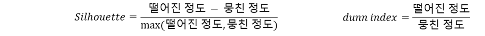
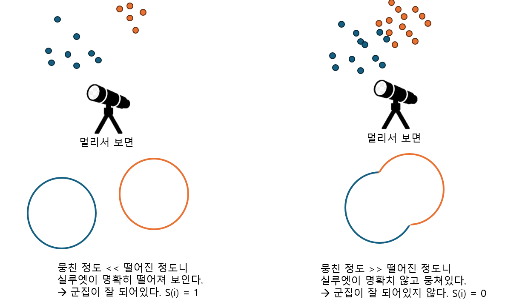
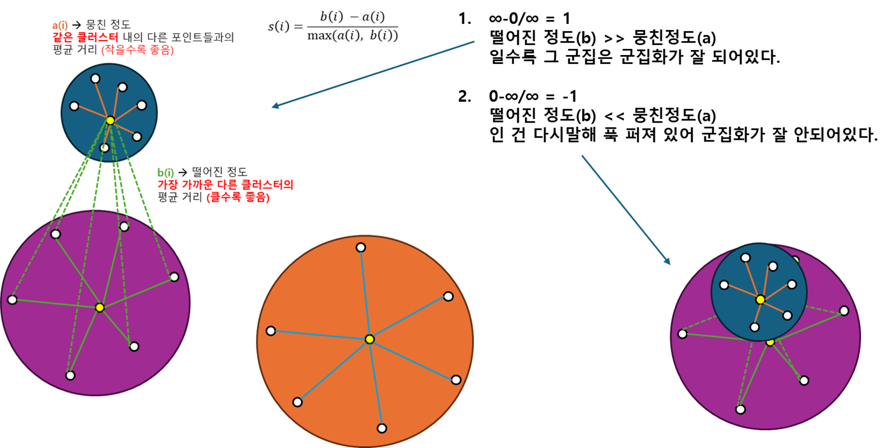
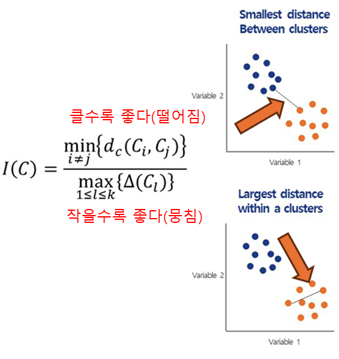

## k-means 군집분석
```
정리
- k-means
- 군집타당성지표
    - 실루엣 지수
    - dunn 지수

```
### 개념
- k 개로 묶는다.
- mean을 사용하기에 이상치에 민감
- k값 선정은 다소 주관적이다.
- 군집의 중심점(centroid)은 최초에 임의의 위치로 선정
    - 평균을 활용하여 위치조정

### 군집 타당성 지표
- **적절한 K(군집 개수)** 를 결정하기 위해 사용
    - 얼마나 군집을 잘 하였는가?
    - 떨어진 정도가 궁금하다, 그 기준은 뭉친정도와의 차이
    - 
        - 실루엣
            - 차이 : 떨어진 정도 - 뭉친정도
            - 계산이 많음
            - 정규화를 위해 나눔
                - 이 때 떨어진정도와 뭉친정도 중 큰 값을 이용
        - Dunn 
            - 비율 : 떨어진 정도/뭉친정도
        - sklearn 기준
            | - | 실루엣 | dunn |
            | - | - | - |
            | max | 1 | 무한대 |
            | min | 0 | 0 |
#### 실루엣 분석



| 장점 | 단점 |
|------|------|
| ✅ 클러스터 품질 평가 가능 | ⚠️ 고차원 데이터에서 정확도가 낮을 수 있음 |
| ✅ 최적의 K 선택에 도움 | ⚠️ 군집의 모양이 비구형일 경우 한계가 있음 |
| ✅ 시각화를 통해 직관적인 해석 가능 | ⚠️ 계산 비용이 높은 경우도 있음 |



#### Dunn Index
- 클러스터 간 거리의 최소값/클러스터 내 요소 간 거리의 최대값
    


