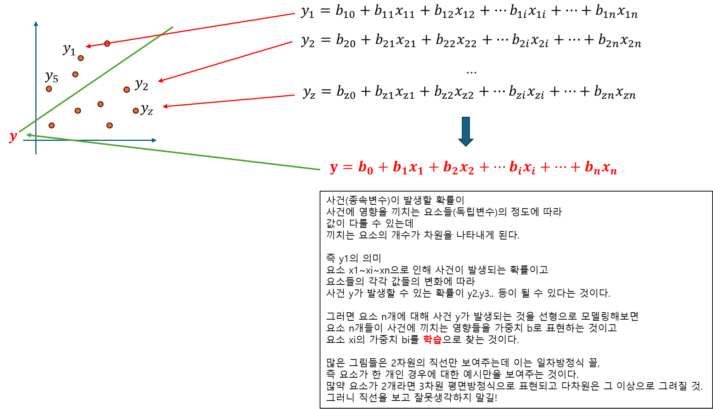
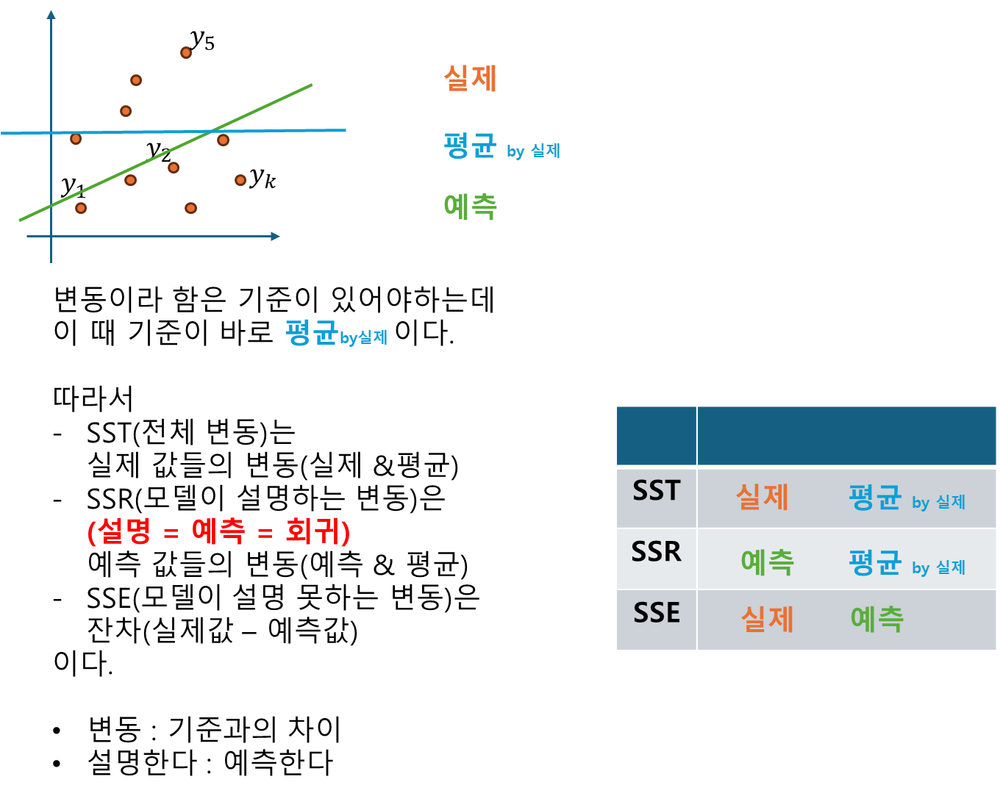
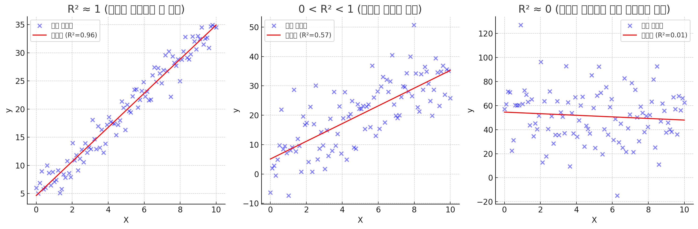
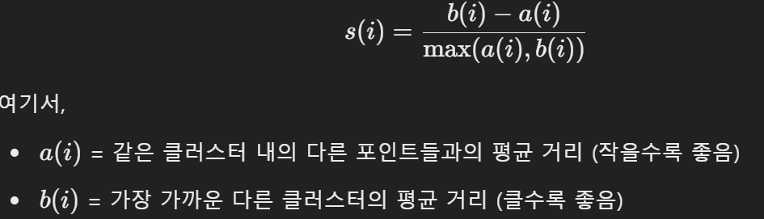

# 지도학습과 비지도학습

### 🆚 **핵심 차이점**  
| 구분 |지도학습 |비지도학습 |
| - | - | - |
| **데이터**| 입력 데이터 + 정답(라벨) 제공| 입력 데이터|
| **목표**| 정확한 예측 또는 분류| 패턴이나 군집 찾기|
| **예시 문제**| 이메일 분류, 가격 예측| 고객 군집화, 데이터 시각화|
| **평가 방법**| 정확도, RMSE 등 정답과 비교하여 평가 | 군집 품질, 실루엣 계수 등 패턴 평가 |

---
# 꿀팁정리
1. 예측한다
   - 예측 = 설명 = 회귀 같은 의미로 보면 된다.  

# 지도학습
## 선형 회귀 분석
- 어떤 사건이 일어날 확률을 linear function 으로 표현한 것  
이 사건이 일어날 때 관여되는 요소는 여러개가 있을 수 있을 것이다.
식의 표현은
yk = b0+b1x1+b2x2+...이다.
즉 한 사건 yk가 일어날 확률은  
x1  
x2  
xi  
...  
가 연관되어 있고 각각 bi 로 가중치가 있는 것이다.
y가 발생될 요소 x들을 더해서 표현한 것이 선형 회귀인 것이다.

### 선형회귀의 가정
- 잔차에 대해 3가지를 만족한 상태에서 선형 회귀 분석을 진행하는 것!
    - 잔차 : 실제값 - 예측값
        - 예측값 : 내가 만든 모델이 실제값을 반환하는 같은 요소값을 넣었을 때 만들어지는 값
    
    | 개념 | 정의 | 검증 방법 | 위반 시 해결 방법 |
    |----|----|----|----|
    | **정규성** | 잔차가 정규 분포를 따라야 함 | 히스토그램, Q-Q Plot, Shapiro-Wilk Test | 로그 변환, 다항 회귀 적용 |
    | **등분산성** | 잔차의 분산이 일정해야 함 | 잔차 vs 예측값 그래프, Breusch-Pagan Test | 가중 회귀, 변환(로그, 제곱근) |
    | **독립성** | 잔차가 서로 독립적이어야 함 | Residuals vs Order Plot, Durbin-Watson Test | 시차 변수 추가, 시계열 모델 적용 |
        
### 회귀모델 추정
1. OLS(Ordinary Least Squares, 최소 제곱법)
    - 제곱의 효과 : 양수, 계산이 빠름
2. 결정계수(coefficent of determination)
    - 회귀 모델이 데이터를 얼마나 잘 설명하는가?
        
        - 평균값을 기준으로 얼마나 퍼저있는지를 확인
        - 잔차를 활용 -> OLS
        - 평균, 실제값, 예측값 -> 3C2 = 3개
            - SS(Sum of Squares)
            - SST = SSR + SSE
                - SST(데이터 전체 변동성)
                - SSR(모델이 설명하는 변동성)
                - SSE(모델이 설명 못하는 변동성)
            - SST(Total) : 실제값과 평균의 OLS
                - 평균을 기준으로 얼마나 분산되어있나
            - SSR(Regression) : 예측값과 평균의 OLS
                - 클수록 좋다. 
            - SSE(Error) : 실제값과 예측값(잔차)의 OLS
                - 작을수록 좋다.-> 모델이 예측을잘한다.
    - 그래프 설명
        
        - 결정계수(\( R^2 \))가 클수록 회귀 모델이 데이터를 잘 설명함.  
        - \( R^2 \) 값이 0에 가까우면 모델이 쓸모없는 상태임.  
        - 다중 회귀에서는 **조정된 결정계수(Adjusted \( R^2 \))**를 활용해 불필요한 변수를 고려해야 함.

        1. **왼쪽 (R² ≈ 1, 좋은 모델)**  
            - 데이터가 **거의 직선 형태로 정렬**되어 있음.  
            - 회귀선이 데이터를 잘 설명하고 있으며, 오차가 적음.  
            - **모델이 데이터를 매우 잘 설명하는 경우**.

        2. **가운데 (0 < R² < 1, 중간 정도의 모델)**  
            - 데이터가 회귀선 근처에 있지만, **노이즈가 많아 오차가 큼**.  
            - 모델이 어느 정도 데이터의 경향성을 설명하지만, 완벽하지 않음.  
            - **일부 설명력을 가지지만 개선이 필요함**.

        3. **오른쪽 (R² ≈ 0, 나쁜 모델)**  
            - 데이터가 **완전히 랜덤하게 분포**되어 있음.  
            - 회귀선이 의미 없는 선이 되어 버림.  
            - **모델이 데이터를 거의 설명하지 못하는 경우**.

3. 수정된 결정계수
- 요소(독립변수, feature)가 많아질 때 문제 발생가능
    - 결정계수값의 증가
        - 모델이 좋아서
        - 독립변수 추가 --> 모델이 좋다고 할 수 없음
    - 이것을 구분하기 위해 결정계수에 독립변수와 예측치(데이터 샘플)의 갯수 정보를 추가함.
- 변수를 추가했을 때 값이 증가 -> 유의미한 변수
- 변수를 추가했을 때 값이 감소 -> 불필요한 변수

1. **\( R^2 \) vs \( R^2_{adj} \) 비교**
    | 항목 | 결정계수 (\( R^2 \)) | 수정된 결정계수 (\( R^2_{adj} \)) |
    |------|----------------------|----------------------|
    | 의미 | 모델이 데이터를 얼마나 설명하는지 측정 | 불필요한 변수의 영향을 보정하여 모델의 설명력 평가 |
    | 변수 추가 시 변화 | 변수를 추가하면 항상 증가 (좋지 않은 변수 포함 가능) | 불필요한 변수를 추가하면 감소 |
    | 해석 | 모델의 단순한 설명력 | 모델이 정말로 좋은지를 판단하는 기준 |
2. VIF(분산 팽창 계수, Variation Inflation Factor)
- 다중공선성(multi col linearity)
    - 독립변수끼리 상관관계를 보고싶다.
    - 수치가 크면 독립변수의 상관관계가 크다.
    - 상관관계가 커지면 회귀계수의 분산이 커진다
        -분산이 커지면 모델의 해석력은 떨어진다.
    - 모델의 결과를 독립변수로 만들어 측정한 것
    - 최소값 1, 최대값 무한대
    - 10을 넘기면 문제가 있음

## 📌 **1. 일반적인 회귀 분석과 차이점**
- 보통 회귀 분석에서는 **독립 변수(Feature)들이 종속 변수(Target, \( Y \))를 얼마나 잘 예측하는지** 분석합니다.
- 하지만 **다중공선성을 확인하기 위해서는 특정 독립 변수 \( X_j \)를 종속 변수처럼 두고, 나머지 독립 변수들로 예측하는 회귀 분석**을 수행합니다.

---

## 📊 **2. 개념을 직관적으로 이해하기**
### ✅ **일반적인 회귀 분석**

\[
Y = \beta_0 + \beta_1 X_1 + \beta_2 X_2 + ... + \beta_n X_n + \varepsilon
\]

- 독립 변수들 (\( X_1, X_2, ..., X_n \))이 **종속 변수(\( Y \))를 예측**.

### ✅ **다중공선성을 확인하는 회귀 분석**
\[
X_j = \gamma_0 + \gamma_1 X_1 + \gamma_2 X_2 + ... + \gamma_n X_n + \varepsilon
\]
- 특정 독립 변수 \( X_j \)를 **종속 변수처럼 취급**하고, 나머지 독립 변수들로 회귀 분석을 수행.
- 이 회귀 분석에서 나온 **결정계수(\( R^2_j \)) 값이 크면**, 즉, \( X_j \)가 다른 변수들로 잘 예측되면 다중공선성이 높음.
- **\( R^2_j \) 값이 클수록 \( VIF \) 값도 커짐.**

## 🔥 **4. 쉽게 이해하는 방법**
1. **우리가 일반적으로 하는 회귀 분석**
   - 여러 개의 독립 변수(예: X1, X2, X3)가 종속 변수(예: Y)를 얼마나 잘 예측하는지 분석.
   - 즉, **X1, X2, X3로 Y를 예측하는 모델**을 학습.

2. **다중공선성을 확인하는 회귀 분석**
   - 특정 독립 변수(예: X1)를 종속 변수로 설정하고, 나머지 독립 변수(예: X2, X3)들로 회귀 분석을 수행.
   - 즉, **X2, X3로 X1을 예측하는 모델**을 학습.
   - 만약 이 모델의 결정계수(\( R^2_j \))가 크면, X1은 X2, X3로 쉽게 예측되므로 다중공선성이 존재함.

✅ **즉, 특정 변수를 종속 변수로 삼아 회귀 분석을 수행하는 것은 "이 변수가 다른 변수들로 얼마나 설명될 수 있는지"를 확인하는 과정입니다.**  
✅ **이렇게 구한 결정계수(\( R^2_j \))를 이용해 VIF(분산 팽창 계수)를 계산하고, 다중공선성이 있는지 판단할 수 있습니다.**

6. 정보량 규준(Information Criterion)
- 모델이 좋은지 판단하는 지표 : 우도
- 모델의 복잡한 정도를 포함해야한다. : 요소 개수(독립변수)
- overfitting 방지
- 값이 적을 수록 좋다
- 변수가 많아지면 복잡해지므로 패널티를 주는데,  
AIC : 2k
BIC : klog(n)  
으로 예측치 n개를 곱해주는 BIC가 패널티가 더 크다.

## 📊 **2. AIC(Akaike Information Criterion)란?**
**AIC(Akaike Information Criterion, 아카이케 정보 기준)**은 **모델의 적합도와 복잡성을 동시에 고려하는 평가 지표**입니다.

\[
AIC = -2 \ln(L) + 2k
\]

✔️ **각 항목의 의미**
- \( L \) : **최대 우도(Maximum Likelihood)** → 모델이 데이터를 얼마나 잘 설명하는지.
- \( k \) : **모델의 독립 변수(파라미터) 개수** → 모델의 복잡성.
- **\(-2 \ln(L)\)** → 모델의 적합도(Fit) 측정.
- **\( 2k \)** → 모델의 복잡성(Penalty) 조정.

✅ **해석**
- AIC 값이 작을수록 **모델이 데이터를 잘 설명하면서도 복잡성이 적당함**을 의미.
- **변수(파라미터)가 많아질수록 패널티(\( 2k \))가 커져 과적합을 방지**.

---

## 📊 **3. BIC(Bayesian Information Criterion)란?**
**BIC(Bayesian Information Criterion, 베이지안 정보 기준)**은 AIC와 유사하지만, **모델의 복잡성에 더 강한 패널티를 부과**하는 지표입니다.

\[
BIC = -2 \ln(L) + k \ln(n)
\]

✔️ **각 항목의 의미**
- \( n \) : **데이터 샘플 개수**.
- \( k \) : **모델의 독립 변수(파라미터) 개수**.
- \( \ln(n) \) : **데이터 개수에 따라 증가하는 패널티 항**.

✅ **해석**
- **BIC는 AIC보다 복잡한 모델에 더 강한 패널티를 부여**.
- **데이터가 많을수록(샘플 수 \( n \)이 증가할수록) 복잡한 모델에 불리**.
- **BIC 값이 작을수록 더 좋은 모델**.

---

## 🔄 **4. AIC vs BIC 비교**
| 비교 항목 | AIC | BIC |
|-----------|--------------------------------|--------------------------------|
| **목적** | 모델 성능 평가 | 모델 성능 평가 |
| **패널티 강도** | \( 2k \) (약함) | \( k \ln(n) \) (강함) |
| **변수 개수 증가 시** | 변수 추가에 덜 민감 | 변수 추가에 매우 민감 |
| **데이터 샘플 수 영향** | 샘플 수와 관계 없음 | 샘플 수가 많을수록 복잡한 모델에 불리 |
| **과적합 방지 성능** | 비교적 약함 | 더 강력함 |
| **적용 예시** | 일반적인 모델 선택 | 데이터 샘플이 많은 경우 추천 |

✅ **요약**
- **AIC는 더 유연한 모델 선택을 제공** → 적합도에 집중.
- **BIC는 더 단순한 모델을 선호** → 과적합 방지에 더 강력.
- **데이터 샘플이 많다면 BIC를 더 신뢰할 수 있음**.

---

✔️ **해석**
- AIC와 BIC 값이 모델의 성능을 나타냄.
- 다른 모델과 비교하여 **더 낮은 AIC/BIC 값을 가진 모델이 더 적합함**.

---

## 🎯 **6. 결론**
| 개념 | 공식 | 의미 |
|------|------|------|
| **AIC** | \( AIC = -2 \ln(L) + 2k \) | 모델의 적합도를 평가하면서 복잡성 패널티 적용 |
| **BIC** | \( BIC = -2 \ln(L) + k \ln(n) \) | 데이터 수가 많을수록 더 강한 패널티 적용 |

## 로지스틱 회귀 분석(logistic regression)
- 분류
    - 시그모이드 꼴이기 때문에 true, false 임
        - 하나의 로지스틱을 쓰면 이진분류
        - 여러 로지스틱을 써서 다중 분류 가능(0~9 손글씨)
        - true, false 조건문 추가해서 여러 클래스 구분 가능한 것과 같은 느낌으로 생각
            - 조건문 1개 추가를 겹치면 2^n 제곱가지의 분류가 되듯이
    - 종속변수는 2가지 범주를 가진다
        - 종속변수 = 결과는 0 또는 1의 2가지 범주를 가진다.
    - 선형모델의 threshold를 갖게 한 게 로지스틱 회귀라고 볼 수 있겠다.
        - 선형의 결과를 여기서 부터 여기까지는 0, 저기서 부터 저기까지는 1로 취급할 수 있게 하여  
        분류를 하는 것
- 승산(odds)
    - 말그대로 이길 수 있는 정도, 얼마나 true 이냐
    true/false
    - true = 1, false = 0 이면 무한대
    - true = 0, false = 1 이면 0
        - 0 프로라는 뜻
    - 범위 0 ~ 무한대
    - true + false = 1일테니
    - 로지스틱 선형회귀에 국한된 개념이 아니라 진짜 발생할 확률/발생안할 확률의 개념이다.
- 로짓(logit)
    - 0 ~ 무한대의 결과를 -무한대 ~ 무한대, 즉 실수로 변형  
    즉, 선형화를 만들기 위해 로그를 씌운 것
- 종합하면 이진분류를 생각하면 true, false 인데, 이는 자연스레 발생할 확률/발생안할 확률 인  
승산을 활용할 수 있다.
    - 승산 자체로는 선형회귀를 쓸 수 없다 --> 그래서 로짓을 도입함
    - 승산(비선형) -> 로짓(선형) -> 로지스틱 활용하여 분류가능!

- 승신비(odds ratio)
    - 두 그룹 간의 승산비율
    - 어떤 사건에 대해  
    한그룹에서  
    다른 한그룹보다  
    얼마나 더 발생하는가?
    - 흡연/비흡연 그룹에 대해 폐암이 발생할 확률        
        |그룹|폐암발생|폐암미발생|
        |-|-|-|
        |흡연자|40%|60%|
        |비흡연자|10%|90%|
        - 승산비 0.67/0.11 = 6.09
    - 로지스틱에 가져와서 승산비를 활용하는 방법
    - 사건 y가 발생할 여부(종속변수)가 요소 x(독립변수)에 얼마나 영향을 끼치고 있는지를 승산비로 알 수 있는데  
    - 요소 x가 1이 증가했을 때 승산비가  
        - 1이면 --> 요소가 이 사건 발생에 영향을 주지않고 있다, 즉 가중치 b =0 이란 뜻
            - 이 요소(독립변수)는 결과(종속변수)와 무관하다는 판단을 내릴 수 있음
        - 1 보다 크면 --> 영향을 끼치고 있어 결과가 true, 이 분류에 영향을 많이 끼치는 요소라는 뜻
            - 예) 승산비가 1.5가 된다는 뜻은 결과(종속 변수가) true가 될 확률이 1.5배 증가
        - 1 보다 작으면 --> 영향이 미미해 결과가 false, 이 분류에 영향을 적게 끼치는 요소라는 뜻뜻
    - 승산비는 결국 사건에 영향을 미치는 요소의 비중을 가중치(b)말고 알 수 있는 다른 방법으로 활용가능할 수 있음을 보이는 듯하다. 

## K-NN(Nearest Neighbor)
- 원하는 데이터 주변 k개의 요소로 예측
- 나는 내 주변 친구의 평균과 같다!
- k
    - 1 --> 과적합 : 친구 한놈만 보고 나를 판별하니 과적합 될 수 밖에
    - k --> 과소적합 : 너무 많이 봐도 헷깔리고 계산이 힘들어지겠지
    - 홀수가 좋다
        - 찬반투표가 홀수인 거랑 같은 의미
- k-NN은 평균을 어떻게 구하냐봤더니 거리로 본다
    - 유클라디안
    - 맨해튼 등을 사용
    - 확인하려는 친구(k) 가 많으면 계산 오래 걸릴 것
    - 확인하려는 요소(차원)이 많아도 계싼 오래 걸릴 것
        - 외모
        - 키
        - 재산
        - 성격

## Decision Tree
분류
 - 지니계수
소수를 제곱하면 더 작아짐  
그럼에도 합이 1에 가깝다는 건
그 클래스만 제곱되어 높은 값이 보장된다는 뜻  
다시말해 카테고리의 분산이 작으면 지니계수가 0이되어 좋고
카테고리 분산이 크면 지니계수가 1에 가까워 안좋음

- 엔트로피
제곱 대신 로그를 곱함함

회귀
MSE

분류냐 회귀냐의 구분은
숫자 아님, 크기 구분할 수 없다 --> 분류
숫자, 크기 구분할 수 있다 --> 회귀

변수
1. 질적 변수(Qualitative)
    : 숫자아님, 크기 구분 X
    - 범주형(categorical)
        1. 명목형(nominal)
            : 순서 구분 X
        2. 서열형(ordinal)
            : 순서 구분 O
    - 라벨링 -> 원-핫 인코딩
2. 양적 변수(Quantitative)
    : 숫자, 크기 구분 O
    수치형(numerical)
    1. 연속형(continuous)
        : 실수 
    2. 이산형(discrete)
        : 정수

분류 나무
    - 명목형
    - 이진분할
        - 지니계수
        - 엔트로피
    - 다지 분할
        - 카이제곱곱
회귀 나무
    - 연속형
    - 패널티 함수 사용(SSE-오차제곱합)
    - 이진분할
        - 분산 감소량
    - 다지분할
        - ANOVA F

지니계수, 엔트로피는  
원하는 데이터가  
어떤 cluster에  
있나 를 보는 것이다.
즉, 불순도라고 표현하는 게
불순한 정도(부정적 표현)이므로
작을 수록 좋다.
그래서 -를 붙이는 거고
불순도가 낮을수록(0) 좋은 것
불순도가 낮아야 솎아내기 쉽다.
분류가 쉽다.
- 지니계수 0 ~ 0.5
    - 0 : 한 클래스만 있는 순수 노드
    - 0.5 : 두개 클래스가 딱 반반(최대 불순도)
    - 이진 분할이니까
    - 단순한 제곱이라 계산이 빠름
- 엔트로피 0 ~ 1
    - 0 : 한 클래스만 있는 순수 노드
    - 1 : 두개 클래스가 딱 반반(최대 불순도)
    - 로그라 계산이 느림
- 생각해보면 불순한 정도가 가장 큰 건 딱 2개의 분류일 때지 3개 부터는 그 이하로 불순하지

- 불순도를 이용한 것이 정보이득 information gain  
분류하기 전 불순도와 분류한 후 불순도의 차이로, 불순도가 점점 작아져서 이전과 차이가 커지는게 분류를 잘해나가는 과정이므로 정보이득이 커질 수록 분류를 잘해나가고 있다는 뜻
    - 분류 전이 부모노드, 분류 후가 자식노드이므로 부모노드 불순도 - 자식노드 불순도 가 정보이득이 된다.
    - 쉽게 부모 지니계수/엔트로피 - 자식 지니계수/엔트로피 인 것이지
    - 자식마다 가중치가 있음

# 비지도학습
## K-means 군집분석
1. 주어진 데이터를 K 개의 군집으로 묶는 알고리즘
2. 최초 k 값 선정이 어려움
    - 주관적으로 k 값을 선정
    - 평균을 활용 --> 이상치에 민감
    - 최초 중심점(centroid)는 임의로 선정
### 군집 타당성 지표(Clustering Validity Index)
- 군집의 결과를 평가하기 위한 지표
    - 얼마나 군집을 잘 하였는가?
    - 떨어진 정도가 궁금하다, 그 기준은 뭉친정도와의 차이
        - 차이로 보는 거 -> 실루엣
            - 떨어진 정도 - 뭉친정도
        - 비율로 보는거 -> Dunn 
            - 떨어진 정도/뭉친정도

#### 1. 실루엣 분석(Silhouette Analysis)

| 장점 | 단점 |
|------|------|
| ✅ 클러스터 품질 평가 가능 | ⚠️ 고차원 데이터에서 정확도가 낮을 수 있음 |
| ✅ 최적의 K 선택에 도움 | ⚠️ 군집의 모양이 비구형일 경우 한계가 있음 |
| ✅ 시각화를 통해 직관적인 해석 가능 | ⚠️ 계산 비용이 높은 경우도 있음 |
- 군집의  
    특정원소와 각 원소거리 평균  
    타 군집 원소 간의 거리 평균을 기반으로 산출
- 계산이 많음 --> 표본추출
- 정규화 --> 최대값으로 나눔
- sklearn에서 min : 0 , max : 1

#### 2. Dunn Index

- 클러스터 간 거리의 최소값  
  /클러스터 내 요소 간 거리의 최대값
    

#### 두 계수 비교

- sklearn 기준
    | - | 실루엣 | dunn |
    | - | - | - |
    | max | 1 | 무한대 |
    | min | 0 | 0 |

