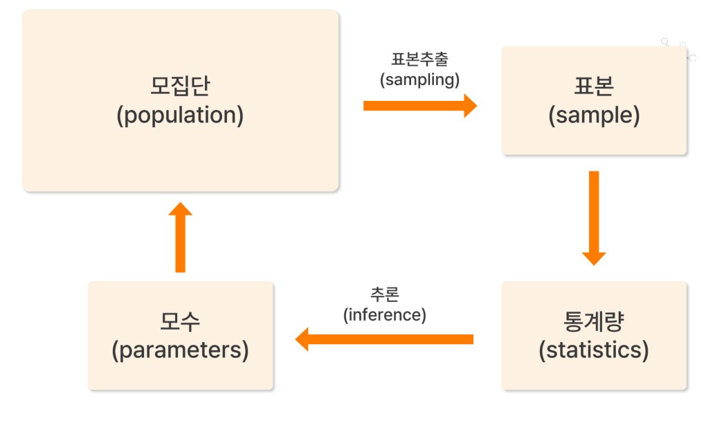

# 01. 통계분석개요

> 원본 PDF 범위: 3~27쪽 · PDF 설명 순서에 따라 재작성

## 주요 단어 먼저 보기

| 주요 단어 | 뜻 |
|---|---|
| 통계분석 | 데이터에서 의미 있는 정보를 얻는 분석 과정 |
| 기술통계 | 수집한 데이터를 표·그래프·통계량으로 요약 |
| 추론통계 | 표본을 이용해 모집단의 특성을 추정·판단 |
| 모집단 | 관심 대상 전체 |
| 표본 | 모집단에서 실제 조사한 일부 |
| 모수 | 모집단의 수치적 특성 |
| 통계량 | 표본에서 계산한 수치 |
| 측정척도 | 명목·순서·등간·비율척도 |

> **단원 시작법:** 주요 단어의 뜻을 먼저 읽고, 아래 PDF 절 순서대로 학습한다.

<!-- TOC START -->
## 목차

- [1. 개요](#1-개요)
  - [1. 통계분석의 정의와 목적](#1-통계분석의-정의와-목적)
  - [2. 기술통계와 추론통계](#2-기술통계와-추론통계)
- [2. 모집단과 표본](#2-모집단과-표본)
  - [3. 모집단·표본·모수·통계량](#3-모집단표본모수통계량)
- [3. 관련 기호](#3-관련-기호)
  - [4. 통계 기호](#4-통계-기호)
- [4. 데이터의 이해](#4-데이터의-이해)
  - [5. 데이터·데이터 포인트·데이터셋](#5-데이터데이터-포인트데이터셋)
  - [6. 변수](#6-변수)
  - [7. 수치형과 범주형 데이터](#7-수치형과-범주형-데이터)
  - [수치형 데이터](#수치형-데이터)
  - [범주형 데이터](#범주형-데이터)
- [5. 측정 척도](#5-측정-척도)
  - [8. 측정 척도](#8-측정-척도)
- [6. 교재 문제와 해설](#6-교재-문제와-해설)
  - [문제 바로가기](#문제-바로가기)
  - [문제 1. 수치형 데이터](#문제-1-수치형-데이터)
  - [문제 2. 데이터 포인트](#문제-2-데이터-포인트)
  - [문제 3. 모수와 통계량](#문제-3-모수와-통계량)
  - [문제 4. 비율척도](#문제-4-비율척도)
  - [문제 5. 명목척도와 순서척도](#문제-5-명목척도와-순서척도)
- [보충 학습](#보충-학습)
  - [10. 보강 내용](#10-보강-내용)
  - [표본추출의 대표 방법](#표본추출의-대표-방법)
  - [연구 설계와 편향](#연구-설계와-편향)
  - [분석 전에 확인할 질문](#분석-전에-확인할-질문)
  - [11. 핵심 점검](#11-핵심-점검)
- [시험 직전 암기](#시험-직전-암기)
<!-- TOC END -->

## 1. 개요

> **PDF 4~5쪽**

> **암기 한 줄:** 기술통계는 현재 데이터를 요약하고, 추론통계는 표본으로 모집단을 판단한다.

### 1. 통계분석의 정의와 목적

통계분석은 수집된 데이터에 통계학적 원리와 기법을 적용하여 데이터에 내재된 정보와 패턴을 추출하고, 의미 있는 결론을 도출하는 체계적 과정이다.

교재가 제시하는 목적은 다음 네 가지다.

- 현상의 기술과 요약: 데이터의 특성과 분포를 파악한다.
- 관계의 탐지: 변수 간 상관관계나 인과관계를 분석한다.
- 추론과 일반화: 표본으로 모집단의 특성을 추정한다.
- 예측과 의사결정: 미래 현상을 예측하고 최적 의사결정을 지원한다.

상관관계가 관찰되었다고 인과관계가 바로 증명되는 것은 아니다. 인과 해석에는 시간적 선후, 교란변수 통제, 연구 설계가 함께 필요하다.

### 2. 기술통계와 추론통계

- 기술통계학(descriptive statistics): 수집된 데이터를 표, 그래프, 대표값 등으로 요약하고 기술한다.
- 추론통계학(inferential statistics): 표본 정보를 이용해 모집단에 대한 추정이나 가설검정을 수행한다.

예를 들어 조사 참여자 500명의 평균 연령을 계산하는 일은 기술통계이고, 그 결과로 전체 고객의 평균 연령을 추정하는 일은 추론통계다.

## 2. 모집단과 표본

> **PDF 6~7쪽**

> **암기 한 줄:** 모집단의 숫자는 모수, 표본의 숫자는 통계량이다.

### 3. 모집단·표본·모수·통계량

| 용어 | 의미 | 예시 |
|---|---|---|
| 모집단(population) | 관심 대상 전체의 집합 | 전체 고객 |
| 표본(sample) | 직접 조사한 모집단의 일부 | 조사에 참여한 고객 500명 |
| 표본추출(sampling) | 모집단에서 표본을 얻는 과정 또는 방법 | 고객 500명 무작위 선택 |
| 모수(parameter) | 모집단의 특성을 나타내는 값 | 모집단 평균 $\mu$ |
| 통계량(statistic) | 표본에서 계산한 값 | 표본평균 $\bar{x}$ |

흐름은 `모집단 → 표본추출 → 표본 → 통계량 계산 → 모집단 모수 추론`이다. 모수는 해당 모집단에서 고정된 미지의 값이고, 통계량은 어떤 표본이 뽑혔는지에 따라 달라지는 확률변수다.

*그림: 모집단에서 표본을 뽑고, 표본 통계량으로 모집단 모수를 추론하는 관계 — 원문 슬라이드에서 설명에 필요한 도해 영역만 잘라 수록.*

## 3. 관련 기호

> **PDF 8~9쪽**

> **암기 한 줄:** 모평균 μ-표본평균 x̄, 모표준편차 σ-표본표준편차 s를 짝으로 외운다.

### 4. 통계 기호

교재는 이후 수식에서 사용할 그리스 문자와 모수·통계량의 표기를 소개한다.

| 대상 | 모집단 모수 | 표본 통계량 |
|---|---:|---:|
| 평균 | $\mu$ | $\bar{x}$ |
| 분산 | $\sigma^2$ | $s^2$ |
| 표준편차 | $\sigma$ | $s$ |
| 비율 | $p$ 또는 $\pi$ | $\hat{p}$ |

자주 쓰는 그리스 문자에는 $\alpha$(알파), $\beta$(베타), $\gamma$(감마), $\mu$(뮤), $\sigma$(시그마), $\rho$(로), $\theta$(세타) 등이 있다. 기호 자체보다 ‘모집단 값인지 표본에서 계산한 값인지’를 구별하는 것이 중요하다.

## 4. 데이터의 이해

> **PDF 10~14쪽**

> **암기 한 줄:** 행은 관측 한 건, 열은 변수 하나다. 숫자 모양이라고 반드시 수치형은 아니다.

### 5. 데이터·데이터 포인트·데이터셋

데이터는 관찰이나 측정을 통해 수집된 사실 또는 정보의 집합이다. 현실 세계의 현상을 수치나 기호로 표현한 원시 자료이며, 분석과 해석을 거쳐 정보와 지식으로 변환되고 의사결정의 근거가 된다.

- 데이터 포인트(data point): 데이터셋의 개별 관측 또는 기록 한 건. observation, instance, sample, record라고도 부른다.
- 데이터셋(dataset): 동일한 구조를 가진 데이터 포인트들의 집합. 표형 데이터에서는 보통 행이 데이터 포인트, 열이 변수다.

데이터 포인트는 숫자만으로 구성될 필요가 없다. 고객 한 명의 기록에는 나이 같은 수치형 값과 지역 같은 범주형 값이 함께 들어갈 수 있다.

### 6. 변수

변수(variable)는 데이터 포인트의 측정 가능한 특성이나 속성이다.

- 독립변수(independent variable): 다른 변수에 영향을 주거나 결과를 설명하는 변수. 일반적으로 $X$로 표기하며 설명변수(explanatory variable), 특성(feature)이라고도 한다.
- 종속변수(dependent variable): 독립변수의 영향을 받는 결과 변수. 일반적으로 $Y$로 표기하며 결과변수(outcome), 타깃(target)이라고도 한다.

예를 들어 생산 기록의 한 행이 데이터 포인트라면 `생산라인`과 `중량`은 변수다. 중량을 예측할 때 생산라인은 설명변수, 중량은 종속변수가 될 수 있다. 단, 변수의 역할은 분석 목적에 따라 달라진다.

### 7. 수치형과 범주형 데이터

### 수치형 데이터

숫자로 표현되고 수학적 연산이 가능한 데이터다.

- 이산형(discrete): 셀 수 있는 개별 값만 가진다. 예: 고객 수, 불량품 수.
- 연속형(continuous): 실수 범위의 값이 가능하다. 예: 중량, 길이, 시간.

교재는 연속형 데이터를 측정 척도 관점에서 등간형과 비율형으로 다시 연결한다. 숫자로 저장되었다는 사실만으로 수치형인 것은 아니다. 전화번호나 상품코드는 숫자 모양의 범주형 데이터다.

### 범주형 데이터

범주나 그룹을 나타내는 질적 데이터다.

- 명목형(nominal): 범주 사이에 순서가 없다. 예: 지역, 색상.
- 순서형(ordinal): 범주에 순서나 등급이 있다. 예: 만족도, 등급.

## 5. 측정 척도

> **PDF 15~17쪽**

> **암기 한 줄:** 명-순-등-비: 구분, 순서, 간격, 절대 0의 순서로 정보가 하나씩 늘어난다.

### 8. 측정 척도

측정(measurement)은 현실 세계의 특성이나 속성을 숫자나 기호로 표현하는 과정이고, 척도(scale)는 측정에 사용하는 기준이나 규칙이다.

| 척도 | 구분 | 순서 | 동일 간격 | 절대적 0 | 예시 | 의미 있는 연산 |
|---|:---:|:---:|:---:|:---:|---|---|
| 명목 | ○ | × | × | × | 제품명, 전화번호, 색상 | 빈도, 최빈값 |
| 순서 | ○ | ○ | × | × | 등수, 별점, 만족도 | 순위, 중앙값 |
| 등간(구간) | ○ | ○ | ○ | × | 섭씨온도, 연도 | 차이, 평균 |
| 비율 | ○ | ○ | ○ | ○ | 키, 몸무게, 금액 | 사칙연산, 비율 |

섭씨 20도가 10도보다 ‘10도 높다’는 해석은 가능하지만 ‘두 배로 덥다’고 할 수는 없다. 반면 20cm는 10cm의 두 배라고 해석할 수 있다.

## 6. 교재 문제와 해설

> **원문 단원 말미 문제 전체 수록**

> 먼저 문제와 보기를 풀고, **정답 및 선택지별 해설 보기**를 펼쳐 확인하세요. 일반 4지선다 문항은 ①~④를 모두 해설하며, 원문이 2지선다인 경우에는 실제 보기만 수록합니다.

### 문제 바로가기

| 문제 | 주제 | 관련 목차 | PDF |
|---:|---|---|---:|
| [1](#ch01-q1) | 수치형 데이터 | [4. 데이터의 이해](#4-데이터의-이해) | 18쪽 |
| [2](#ch01-q2) | 데이터 포인트 | [4. 데이터의 이해](#4-데이터의-이해) | 20쪽 |
| [3](#ch01-q3) | 모수와 통계량 | [2. 모집단과 표본](#2-모집단과-표본) · [3. 관련 기호](#3-관련-기호) | 22쪽 |
| [4](#ch01-q4) | 비율척도 | [5. 측정 척도](#5-측정-척도) | 24쪽 |
| [5](#ch01-q5) | 명목척도와 순서척도 | [5. 측정 척도](#5-측정-척도) | 26쪽 |

### 문제 1. 수치형 데이터

**출처:** PDF 18쪽  
**관련 목차:** [4. 데이터의 이해](#4-데이터의-이해)

다음 중 수치형 데이터의 특징에 대한 설명으로 가장 적절한 것은?

1. 항상 연속형 데이터이다.
2. 연속형과 이산형으로 나뉘며, 연속형은 실수 범위에서 모든 값이 가능하다.
3. 범주형 데이터와 동일한 개념이다.
4. 수학적 연산이 불가능하다.

정답 및 선택지별 해설 보기

**정답: ② 연속형과 이산형으로 나뉘며, 연속형은 실수 범위에서 모든 값이 가능하다.**

- **① 오답:** 수치형 데이터에는 키·시간 같은 연속형뿐 아니라 고객 수·불량품 수처럼 셀 수 있는 이산형도 있다. ‘항상 연속형’으로 한정할 수 없다.
- **② 정답:** 수치형은 이산형과 연속형으로 나뉜다. 연속형은 이론적으로 실수 구간의 값을 취할 수 있어 가능한 값의 수가 무한하다.
- **③ 오답:** 수치형은 크기와 차이를 계산할 수 있는 양적 데이터이고, 범주형은 이름·등급으로 구분하는 질적 데이터다.
- **④ 오답:** 수치형 데이터에는 합·차·평균 등의 연산을 적용할 수 있다. 단, 허용되는 해석 범위는 측정 척도에 따라 달라진다.

### 문제 2. 데이터 포인트

**출처:** PDF 20쪽  
**관련 목차:** [4. 데이터의 이해](#4-데이터의-이해)

데이터 포인트(Data Point)에 대한 설명으로 옳지 않은 것은?

1. 데이터셋에서 하나의 개별 관측값 또는 기록을 의미한다.
2. 관측값(observation)과 같은 의미로 사용된다.
3. 데이터 포인트들이 모여서 데이터셋을 구성한다.
4. 데이터 포인트는 반드시 숫자로만 구성되어야 한다.

정답 및 선택지별 해설 보기

**정답: ④ 데이터 포인트는 반드시 숫자로만 구성되어야 한다.**

- **① 오답:** 정답이 아님. 데이터 포인트는 고객 한 명, 거래 한 건처럼 분석 단위 하나에 대한 관측 기록을 뜻한다.
- **② 오답:** 정답이 아님. 문맥에 따라 데이터 포인트와 관측값은 한 행 또는 한 사례를 가리키는 같은 뜻으로 쓰인다.
- **③ 오답:** 정답이 아님. 여러 데이터 포인트를 행으로 모으고, 각 속성을 열로 배치하면 데이터셋이 된다.
- **④ 정답:** 정답(옳지 않은 설명). 한 데이터 포인트에는 나이 같은 숫자뿐 아니라 성별·지역·제품명 같은 범주형 값도 함께 들어갈 수 있다.

### 문제 3. 모수와 통계량

**출처:** PDF 22쪽  
**관련 목차:** [2. 모집단과 표본](#2-모집단과-표본) · [3. 관련 기호](#3-관련-기호)

모수(Parameters)와 통계량(Statistics)에 대한 설명으로 옳지 않은 것은?

1. 모수는 모집단을 분석하여 얻는 값이다.
2. 통계량은 표본을 분석하여 얻는 값이다.
3. 모수는 변하는 값이고, 통계량은 고정된 값이다.
4. 모집단 평균은 μ로, 표본평균은 x̄로 표기한다.

정답 및 선택지별 해설 보기

**정답: ③ 모수는 변하는 값이고, 통계량은 고정된 값이다.**

- **① 오답:** 정답이 아님. 모수는 모평균 μ, 모분산 σ²처럼 모집단 전체의 특성을 나타내는 값이다.
- **② 오답:** 정답이 아님. 통계량은 표본평균 x̄, 표본분산 s²처럼 표본에서 계산한 요약값이다.
- **③ 정답:** 정답(옳지 않은 설명). 모집단이 정해지면 모수는 고정되어 있지만 보통 미지수다. 표본을 다시 뽑으면 통계량은 표본마다 달라진다.
- **④ 오답:** 정답이 아님. μ는 모평균, x̄는 표본평균을 나타내는 표준적인 기호다.

### 문제 4. 비율척도

**출처:** PDF 24쪽  
**관련 목차:** [5. 측정 척도](#5-측정-척도)

다음 데이터 중 비율척도(Ratio Scale)에 해당하는 것은?

1. 온도(섭씨)
2. 학점(A, B, C, D, F)
3. 키(cm)
4. 전화번호

정답 및 선택지별 해설 보기

**정답: ③ 키(cm)**

- **① 오답:** 섭씨 0도는 온도의 부재가 아닌 임의의 기준점이다. 차이는 의미 있지만 ‘20도가 10도의 두 배’라는 비율 해석은 불가능하므로 등간척도다.
- **② 오답:** 학점에는 순서가 있지만 A와 B, B와 C의 간격이 같다고 보장할 수 없으므로 순서척도다.
- **③ 정답:** 0cm는 길이가 없음을 뜻하는 절대적 0이고, 20cm가 10cm의 두 배라는 비율도 의미가 있다.
- **④ 오답:** 전화번호의 숫자는 대상을 식별하는 이름표일 뿐 크기·간격·비율이 의미 없으므로 명목척도다.

### 문제 5. 명목척도와 순서척도

**출처:** PDF 26쪽  
**관련 목차:** [5. 측정 척도](#5-측정-척도)

다음 중 명목척도(Nominal Scale)와 순서척도(Ordinal Scale)의 차이점에 대한 설명으로 가장 적절한 것은?

1. 명목척도는 숫자로 표현되고, 순서척도는 문자로 표현된다.
2. 명목척도는 단순 구분·분류, 순서척도는 순서나 등급이 있는 범주형 데이터이다.
3. 명목척도에서는 평균 계산이 가능하지만, 순서척도에서는 불가능하다.
4. 명목척도와 순서척도는 본질적으로 동일한 측정 방법이다.

정답 및 선택지별 해설 보기

**정답: ② 명목척도는 단순 구분·분류, 순서척도는 순서나 등급이 있는 범주형 데이터이다.**

- **① 오답:** 척도는 저장 형식이 숫자인지 문자인지가 아니라 값이 담고 있는 정보로 구분한다. 숫자로 코딩한 성별도 명목척도일 수 있다.
- **② 정답:** 명목척도는 범주를 구별만 하고, 순서척도는 구별에 더해 높고 낮음이나 선후 순서를 표현한다.
- **③ 오답:** 명목척도와 순서척도 모두 일반적인 산술평균 해석이 부적절하다. 순서척도에는 중앙값·순위 같은 순서 기반 통계가 알맞다.
- **④ 오답:** 두 척도 모두 범주형이지만 순서 정보의 존재 여부가 본질적인 차이다.

## 보충 학습

> 원문 1~마지막 이론 절을 모두 학습한 뒤 보는 확장 내용이다.

### 10. 보강 내용

### 표본추출의 대표 방법

- 단순무작위추출: 모든 원소에 같은 추출 기회를 준다.
- 층화추출: 모집단을 동질적인 층으로 나누고 각 층에서 추출한다.
- 군집추출: 자연스럽게 형성된 군집을 추출 단위로 삼는다.
- 계통추출: 임의의 시작점에서 일정 간격으로 추출한다.

### 연구 설계와 편향

관찰연구는 기존 차이를 관찰하므로 연관성을 찾을 수 있지만 교란요인 때문에 인과 해석이 제한된다. 실험연구에서 무작위 배정은 교란요인을 평균적으로 균형화한다. 선택편향, 무응답편향, 생존자편향, 측정편향 같은 체계적 오류는 표본 수만 늘려도 사라지지 않는다.

### 분석 전에 확인할 질문

1. 한 행이 나타내는 분석 단위는 무엇인가?
2. 목표변수와 설명변수는 무엇인가?
3. 각 변수의 데이터 유형과 측정 척도는 무엇인가?
4. 표본이 모집단을 대표하는가?
5. 결측, 중복, 측정오류가 있는가?

### 11. 핵심 점검

- 기술통계는 관측 데이터를 요약하고, 추론통계는 표본에서 모집단을 추론한다.
- 모수는 모집단의 고정된 특성이고 통계량은 표본에 따라 달라진다.
- 데이터 포인트는 한 관측 기록, 변수는 그 기록의 속성이다.
- 숫자 모양과 수치형 변수는 같은 뜻이 아니다.
- 측정 척도가 허용하는 연산을 벗어나면 계산값이 있어도 해석은 잘못될 수 있다.

## 시험 직전 암기

- 기술통계는 현재 데이터를 요약하고, 추론통계는 표본으로 모집단을 판단한다.
- 모집단의 숫자는 모수, 표본의 숫자는 통계량이다.
- 모평균 μ-표본평균 x̄, 모표준편차 σ-표본표준편차 s를 짝으로 외운다.
- 행은 관측 한 건, 열은 변수 하나다. 숫자 모양이라고 반드시 수치형은 아니다.
- 명-순-등-비: 구분, 순서, 간격, 절대 0의 순서로 정보가 하나씩 늘어난다.
