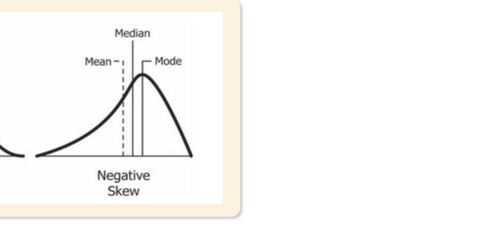

# 02. 통계량

> 원본 PDF 범위: 28~66쪽 · PDF 설명 순서에 따라 재작성

## 주요 단어 먼저 보기

| 주요 단어 | 뜻 |
|---|---|
| 기술통계량 | 데이터의 위치·변이·모양을 요약하는 수치 |
| 평균 | 모든 값을 더해 개수로 나눈 위치 통계량 |
| 중앙값 | 정렬했을 때 가운데 값 |
| 최빈값 | 가장 자주 나타나는 값 |
| 분위수 | 정렬된 자료를 일정 비율로 나누는 경계 |
| 분산 | 평균에서 떨어진 거리의 제곱 평균 |
| 표준편차 | 분산의 제곱근 |
| 왜도 | 분포의 좌우 비대칭 정도 |
| 첨도 | 분포 꼬리와 극단값의 정도 |

> **단원 시작법:** 주요 단어의 뜻을 먼저 읽고, 아래 PDF 절 순서대로 학습한다.

<!-- TOC START -->
## 목차

- [1. 통계량 개요](#1-통계량-개요)
  - [통계량의 개요와 종류](#통계량의-개요와-종류)
- [2. 기술통계량](#2-기술통계량)
- [3. 위치 통계량](#3-위치-통계량)
  - [중심경향](#중심경향)
  - [분위수](#분위수)
  - [계산 예시](#계산-예시)
- [4. 변이 통계량](#4-변이-통계량)
  - [산포](#산포)
- [5. 모양 통계량](#5-모양-통계량)
  - [분포의 모양](#분포의-모양)
- [6. 통계량의 선형 연산](#6-통계량의-선형-연산)
  - [선형변환의 영향](#선형변환의-영향)
  - [두 변수의 결합 요약](#두-변수의-결합-요약)
- [7. 교재 문제와 해설](#7-교재-문제와-해설)
  - [문제 바로가기](#문제-바로가기)
  - [문제 1. 제2사분위수](#문제-1-제2사분위수)
  - [문제 2. 첨도](#문제-2-첨도)
  - [문제 3. 사분위수 범위](#문제-3-사분위수-범위)
  - [문제 4. 조화평균](#문제-4-조화평균)
  - [문제 5. 분산의 선형변환](#문제-5-분산의-선형변환)
- [보충 학습](#보충-학습)
  - [표준화 점수](#표준화-점수)
  - [보강: 통계량 선택 가이드](#보강-통계량-선택-가이드)
  - [체크포인트](#체크포인트)
- [시험 직전 암기](#시험-직전-암기)
<!-- TOC END -->

## 1. 통계량 개요

> **PDF 29~30쪽**

> **암기 한 줄:** 통계량은 표본의 함수이며 표본이 바뀌면 값도 바뀐다.

### 통계량의 개요와 종류

통계량은 표본의 특성을 요약하고 모집단의 모수를 추정하거나 가설을 검정하는 데 사용하는 값이다. $T=T(X_1,X_2,\ldots,X_n)$처럼 표본의 함수로 표현하며, 표본이 달라지면 값도 달라지는 확률변수다.

- 기술통계량: 표본 데이터의 특성을 요약·기술한다.
- 검정통계량: 통계적 가설검정의 판단 기준으로 사용한다.
- 추정량: 모수를 추정한다.
- 순서통계량: 데이터를 정렬한 뒤 위치에 따라 정의한다. 최솟값, 중앙값, 최댓값 등이 해당한다.
- 충분통계량: 모수에 관해 표본이 제공하는 정보를 모두 담는 통계량이다.

기술통계량은 다시 위치통계량, 변이통계량, 모양통계량으로 나뉜다. 데이터의 전반적 특성과 패턴을 간결하게 보여 주고 추론통계의 기초 정보를 제공한다.

## 2. 기술통계량

> **PDF 31~33쪽**

> **암기 한 줄:** 기술통계량은 위치·변이·모양의 세 축으로 분포를 요약한다.

기술통계량은 데이터의 전체적인 특성을 파악하고 복잡한 자료를 간단한 수치로 압축한다. 위치통계량은 데이터가 어디에 모였는지, 변이통계량은 얼마나 흩어졌는지, 모양통계량은 좌우 비대칭과 꼬리 형태가 어떤지를 설명한다. 대표값 하나만으로는 서로 다른 분포가 같은 자료처럼 보일 수 있으므로 세 종류를 함께 확인한다.

> **시험 포인트:** “평균이 같다”만으로 두 집단이 비슷하다고 결론 내리지 않는다. 산포와 모양까지 같아야 분포가 유사하다고 말할 근거가 생긴다.

## 3. 위치 통계량

> **PDF 34~43쪽**

> **암기 한 줄:** 평균은 전체 값, 중앙값은 가운데 위치, 최빈값은 가장 잦은 값이다.

### 중심경향

- 산술평균: $\bar{x}=\frac{1}{n}\sum x_i$
- 가중평균: $\bar{x}_w=\frac{\sum w_ix_i}{\sum w_i}$
- 기하평균: $G=(\prod x_i)^{1/n}$ — 성장률·수익률 누적에 적합
- 조화평균: $H=\frac{n}{\sum 1/x_i}$ — 속도·단위당 비율 평균에 적합
- 중앙값: 정렬했을 때 가운데 값 — 이상치에 강함
- 최빈값: 가장 자주 관측된 값 — 범주형에도 사용 가능

평균은 모든 값을 사용해 정보량이 크지만 이상치에 민감하다. 치우친 분포에서는 중앙값이 전형적인 관측값을 더 잘 나타낼 수 있다.

평균 사이에는 양수 자료에서 `조화평균 ≤ 기하평균 ≤ 산술평균` 관계가 성립한다. 기하평균은 0이 포함되면 0이 되며, 조화평균은 0에 가까운 작은 값의 영향을 크게 받는다. 최빈값은 여러 개일 수 있고, 연속형 자료에서는 구간별 빈도로 근사한다.

### 분위수

분위수는 정렬된 데이터를 일정 비율로 나누는 위치값으로 이상치에 비교적 강건하다.

- 사분위수: 데이터를 4개 구간으로 나눈다. $Q_1=P_{25}$, $Q_2=P_{50}$=중앙값, $Q_3=P_{75}$.
- 십분위수: 10개 구간으로 나눈다.
- 백분위수: 100개 구간으로 나눈다.

분위수 계산법은 소프트웨어마다 위치 보간 규칙이 다를 수 있으므로 작은 표본에서는 어떤 규칙을 썼는지 확인한다.

### 계산 예시

데이터가 `2, 3, 3, 4, 18`이면 평균은 6, 중앙값은 3이다. 극단값 18이 평균을 크게 끌어올리지만 중앙값에는 제한적인 영향만 준다. 이처럼 대표값은 계산 가능 여부보다 분포에 맞는지가 중요하다.

## 4. 변이 통계량

> **PDF 44~48쪽**

> **암기 한 줄:** 범위는 양 끝, IQR은 가운데 50%, 표준편차는 평균 주변의 퍼짐이다.

### 산포

$$
s^2=\frac{1}{n-1}\sum_{i=1}^n(x_i-\bar{x})^2,\qquad s=\sqrt{s^2}
$$

- 범위: 최댓값−최솟값
- 사분위범위: $IQR=Q_3-Q_1$
- 분산: 평균에서 떨어진 거리의 제곱 평균
- 표준편차: 분산의 제곱근으로 원자료와 단위가 같음
- 변동계수: $CV=s/\bar{x}$ — 단위나 평균 규모가 다른 자료 비교

표본분산의 분모가 $n-1$인 이유는 표본평균을 이미 추정해 자유도 하나를 사용했기 때문이다.

## 5. 모양 통계량

> **PDF 49~54쪽**

> **암기 한 줄:** 왜도는 좌우 치우침, 첨도는 꼬리와 극단값의 정도다.

### 분포의 모양

- 왜도: 좌우 비대칭 정도
  - 양의 왜도: 오른쪽 꼬리가 길고 보통 평균 > 중앙값
  - 음의 왜도: 왼쪽 꼬리가 길고 보통 평균 < 중앙값
- 첨도: 꼬리와 극단값의 발생 정도를 나타내는 지표

*그림: 왜도에 따른 평균·중앙값·최빈값의 상대적 위치 — 원문 슬라이드에서 설명에 필요한 도해 영역만 잘라 수록.*

## 6. 통계량의 선형 연산

> **PDF 55~56쪽**

> **암기 한 줄:** 더하기는 평균만 이동하고, 곱하기 a는 분산을 a²배 한다.

### 선형변환의 영향

$Y=aX+b$일 때 다음이 성립한다.

$$
E[Y]=aE[X]+b,\qquad Var(Y)=a^2Var(X)
$$

상수를 더하면 평균·중앙값·사분위수는 그만큼 이동하지만 분산은 변하지 않는다. 모든 값에 $a$를 곱하면 표준편차는 $|a|$배, 분산은 $a^2$배가 된다.

### 두 변수의 결합 요약

$Z=aX+bY+c$일 때

$$
E[Z]=aE[X]+bE[Y]+c
$$

$$
Var(Z)=a^2Var(X)+b^2Var(Y)+2ab\,Cov(X,Y)
$$

$X,Y$가 독립이면 공분산이 0이므로 마지막 항이 사라진다. 독립이면 공분산이 0이지만, 공분산이 0이라고 반드시 독립인 것은 아니다.

$$
Cov(X,Y)=\frac{1}{n-1}\sum_i(x_i-\bar x)(y_i-\bar y)
$$

공분산의 부호는 함께 변하는 방향을 나타낸다. 단위에 따라 크기가 달라 직접 비교하기 어려우므로 표준화한 상관계수를 사용한다.

## 7. 교재 문제와 해설

> **원문 단원 말미 문제 전체 수록**

> 먼저 문제와 보기를 풀고, **정답 및 선택지별 해설 보기**를 펼쳐 확인하세요. 일반 4지선다 문항은 ①~④를 모두 해설하며, 원문이 2지선다인 경우에는 실제 보기만 수록합니다.

### 문제 바로가기

| 문제 | 주제 | 관련 목차 | PDF |
|---:|---|---|---:|
| [1](#ch02-q1) | 제2사분위수 | [3. 위치 통계량](#3-위치-통계량) | 57쪽 |
| [2](#ch02-q2) | 첨도 | [5. 모양 통계량](#5-모양-통계량) | 59쪽 |
| [3](#ch02-q3) | 사분위수 범위 | [3. 위치 통계량](#3-위치-통계량) · [4. 변이 통계량](#4-변이-통계량) | 61쪽 |
| [4](#ch02-q4) | 조화평균 | [3. 위치 통계량](#3-위치-통계량) | 63쪽 |
| [5](#ch02-q5) | 분산의 선형변환 | [6. 통계량의 선형 연산](#6-통계량의-선형-연산) | 65쪽 |

### 문제 1. 제2사분위수

**출처:** PDF 57쪽  
**관련 목차:** [3. 위치 통계량](#3-위치-통계량)

전체 데이터를 4개 구간으로 나누는 사분위수에서 제2사분위수(Q2)와 같은 의미를 가지는 것은?

1. 제25백분위수
2. 중위수(median)
3. 제75백분위수
4. 최빈값(mode)

정답 및 선택지별 해설 보기

**정답: ② 중위수(median)**

- **① 오답:** 제25백분위수는 자료의 하위 25% 경계인 제1사분위수 Q1이다.
- **② 정답:** 제2사분위수 Q2는 정렬 자료의 가운데 위치인 제50백분위수, 즉 중위수와 같다.
- **③ 오답:** 제75백분위수는 하위 75% 경계인 제3사분위수 Q3이다.
- **④ 오답:** 최빈값은 가장 자주 나타난 값으로, 자료의 가운데 위치를 뜻하는 Q2와 정의가 다르다.

### 문제 2. 첨도

**출처:** PDF 59쪽  
**관련 목차:** [5. 모양 통계량](#5-모양-통계량)

다음 중 첨도(Kurtosis)에 대한 설명으로 옳은 것은?

1. 첨도가 0이면 정규분포와 같은 첨도를 가진다.
2. 첨도가 양수이면 정규분포보다 평평한 분포이다.
3. 첨도가 음수이면 정규분포보다 뾰족한 분포이다.
4. 첨도는 분포의 비대칭성을 측정하는 지표이다.

정답 및 선택지별 해설 보기

**정답: ① 첨도가 0이면 정규분포와 같은 첨도를 가진다.**

- **① 정답:** 교재는 초과첨도 기준을 사용한다. 초과첨도 0은 정규분포와 같은 꼬리·첨도 수준을 뜻한다.
- **② 오답:** 초과첨도가 양수이면 정규분포보다 꼬리가 두껍고 더 뾰족한 형태로 해석한다.
- **③ 오답:** 초과첨도가 음수이면 정규분포보다 꼬리가 얇고 더 평평한 형태다.
- **④ 오답:** 비대칭성은 왜도(skewness)가 측정한다. 첨도는 주로 꼬리의 두꺼움과 극단값 경향을 나타낸다.

### 문제 3. 사분위수 범위

**출처:** PDF 61쪽  
**관련 목차:** [3. 위치 통계량](#3-위치-통계량) · [4. 변이 통계량](#4-변이-통계량)

데이터 {2, 8, 6, 4, 10}에서 사분위수 범위(IQR)를 구하면?

1. 2
2. 4
3. 6
4. 8

정답 및 선택지별 해설 보기

**정답: ② 4**

- **① 오답:** 정렬하면 {2, 4, 6, 8, 10}이고 교재 방식의 Q1=4, Q3=8이므로 차이는 2가 아니다.
- **② 정답:** IQR=Q3−Q1=8−4=4이다. IQR은 가운데 50% 자료가 퍼진 폭을 나타낸다.
- **③ 오답:** 6은 이 자료의 중앙값 Q2이지 Q3−Q1이 아니다.
- **④ 오답:** 8은 제3사분위수 Q3 자체이며, 사분위수 범위는 Q1을 빼야 한다.

### 문제 4. 조화평균

**출처:** PDF 63쪽  
**관련 목차:** [3. 위치 통계량](#3-위치-통계량)

조화평균에 대한 설명으로 옳지 않은 것은?

1. 역수들의 산술평균의 역수이다.
2. 속도·밀도·비율의 평균에 사용된다.
3. 항상 기하평균보다 크거나 같다.
4. 작은 값의 영향을 크게 받는다.

정답 및 선택지별 해설 보기

**정답: ③ 항상 기하평균보다 크거나 같다.**

- **① 오답:** 정답이 아님. 양수 자료의 조화평균은 각 값의 역수를 평균한 뒤 다시 역수를 취해 계산한다.
- **② 오답:** 정답이 아님. 같은 거리에서의 평균속도처럼 분모에 놓이는 비율을 평균할 때 조화평균이 적합하다.
- **③ 정답:** 정답(옳지 않은 설명). 양수 자료에서는 조화평균 ≤ 기하평균 ≤ 산술평균 관계가 성립하므로 ‘크거나 같다’는 방향이 반대다.
- **④ 오답:** 정답이 아님. 역수를 사용하므로 작은 값일수록 큰 역수가 되어 결과에 더 큰 영향을 준다.

### 문제 5. 분산의 선형변환

**출처:** PDF 65쪽  
**관련 목차:** [6. 통계량의 선형 연산](#6-통계량의-선형-연산)

변수 X에 대해 Y=3X+5의 선형변환을 했을 때 E[X]=10, Var(X)=4라면 Var(Y)는?

1. 16
2. 149
3. 47
4. 36

정답 및 선택지별 해설 보기

**정답: ④ 36**

- **① 오답:** 분산에는 계수 3을 그대로 곱하는 것이 아니라 제곱한 3²을 곱한다. 따라서 4×3=12나 16이 되지 않는다.
- **② 오답:** E[Y]=3×10+5=35이지만 평균과 분산을 섞어 계산하면 안 된다. 상수 5와 평균 10은 Var(Y) 계산에 들어가지 않는다.
- **③ 오답:** 상수항 5를 분산에 더하지 않는다. Var(aX+b)=a²Var(X)이므로 47이 될 근거가 없다.
- **④ 정답:** Var(3X+5)=3²Var(X)=9×4=36이다. 상수의 덧셈은 위치만 옮기므로 분산을 바꾸지 않는다.

## 보충 학습

> 원문 1~마지막 이론 절을 모두 학습한 뒤 보는 확장 내용이다.

### 표준화 점수

$$
z_i=\frac{x_i-\bar{x}}{s}
$$

z-score는 값이 평균에서 표준편차 몇 배만큼 떨어져 있는지를 뜻한다. 서로 단위가 다른 변수의 상대적 위치를 비교할 수 있다.

### 보강: 통계량 선택 가이드

| 데이터 상황 | 중심 | 산포 |
|---|---|---|
| 대칭이고 이상치가 적음 | 평균 | 표준편차 |
| 치우침·이상치가 큼 | 중앙값 | IQR |
| 범주형 | 최빈값 | 빈도·비율 |
| 성장률 누적 | 기하평균 | 로그수익률 표준편차 |

요약통계 하나만 보고 분포를 단정하지 않는다. 평균·표준편차가 같아도 분포 모양은 완전히 다를 수 있으므로 반드시 시각화를 병행한다.

### 체크포인트

- 분산은 원자료 단위의 제곱, 표준편차는 원자료와 같은 단위다.
- 최빈값은 없거나 여러 개일 수 있다.
- 이상치가 있는 경우 평균보다 중앙값과 IQR이 안정적이다.

## 시험 직전 암기

- 통계량은 표본의 함수이며 표본이 바뀌면 값도 바뀐다.
- 기술통계량은 위치·변이·모양의 세 축으로 분포를 요약한다.
- 평균은 전체 값, 중앙값은 가운데 위치, 최빈값은 가장 잦은 값이다.
- 범위는 양 끝, IQR은 가운데 50%, 표준편차는 평균 주변의 퍼짐이다.
- 왜도는 좌우 치우침, 첨도는 꼬리와 극단값의 정도다.
- 더하기는 평균만 이동하고, 곱하기 a는 분산을 a²배 한다.
