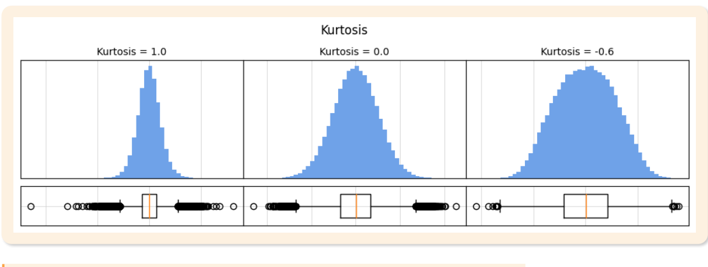

# 02. 통계량

> 원본 PDF 범위: 28~66쪽 · PDF 설명 순서에 따라 재작성

## 주요 단어 먼저 보기

| 주요 단어 | 뜻 |
|---|---|
| 기술통계량 | 데이터의 위치·변이·모양을 요약하는 수치 |
| 평균 | 모든 값을 더해 개수로 나눈 위치 통계량 |
| 중앙값 | 정렬했을 때 가운데 값 |
| 최빈값 | 가장 자주 나타나는 값 |
| 분위수 | 정렬된 자료를 일정 비율로 나누는 경계 |
| 분산 | 평균에서 떨어진 거리의 제곱 평균 |
| 표준편차 | 분산의 제곱근 |
| 왜도 | 분포의 좌우 비대칭 정도 |
| 첨도 | 분포 꼬리와 극단값의 정도 |

> **단원 시작법:** 주요 단어의 뜻을 먼저 읽고, 아래 PDF 절 순서대로 학습한다.

<!-- TOC START -->
## 목차

- [1. 통계량 개요](#1-통계량-개요)
  - [통계량의 정의](#통계량의-정의)
  - [통계량의 종류](#통계량의-종류)
- [2. 기술통계량](#2-기술통계량)
- [3. 위치 통계량](#3-위치-통계량)
  - [평균](#평균)
  - [중앙값](#중앙값)
  - [최빈값](#최빈값)
  - [분위수](#분위수)
  - [계산 예시](#계산-예시)
- [4. 변이 통계량](#4-변이-통계량)
  - [범위](#범위)
  - [사분위범위](#사분위범위)
  - [분산](#분산)
  - [표준편차](#표준편차)
  - [변동계수](#변동계수)
- [5. 모양 통계량](#5-모양-통계량)
  - [왜도](#왜도)
  - [첨도](#첨도)
- [6. 통계량의 선형 연산](#6-통계량의-선형-연산)
  - [선형변환의 영향](#선형변환의-영향)
  - [두 변수의 결합 요약](#두-변수의-결합-요약)
- [7. 교재 문제와 해설](#7-교재-문제와-해설)
  - [문제 바로가기](#문제-바로가기)
  - [문제 1. 제2사분위수](#문제-1-제2사분위수)
  - [문제 2. 첨도](#문제-2-첨도)
  - [문제 3. 사분위수 범위](#문제-3-사분위수-범위)
  - [문제 4. 조화평균](#문제-4-조화평균)
  - [문제 5. 분산의 선형변환](#문제-5-분산의-선형변환)
- [보충 학습](#보충-학습)
  - [표준화 점수](#표준화-점수)
  - [보강: 통계량 선택 가이드](#보강-통계량-선택-가이드)
  - [체크포인트](#체크포인트)
- [시험 직전 암기](#시험-직전-암기)
<!-- TOC END -->

## 1. 통계량 개요

> **PDF 29~30쪽**

> **암기 한 줄:** 통계량은 표본의 함수이며 표본이 바뀌면 값도 바뀐다.

### 통계량의 정의

표본 $X_1,X_2,\ldots,X_n$의 값만으로 계산되는 함수를 **통계량(statistic)**이라 한다.

$$
T=T(X_1,X_2,\ldots,X_n)
$$

통계량의 핵심 성질은 다음 네 가지다.

1. **표본의 함수**다. 계산식에는 알 수 없는 모집단 모수가 직접 들어가지 않는다.
2. 표본을 다시 뽑으면 값이 달라질 수 있으므로 **확률변수**다.
3. 표본의 복잡한 정보를 평균·분산 같은 몇 개의 값으로 **요약**한다.
4. 모집단 모수의 **추정량**이나 가설검정의 **판단 기준**으로 사용된다.

예를 들어 표본평균 $\bar X$는 한 번 추출한 표본에서는 하나의 숫자지만, 반복 표집을 생각하면 표본마다 달라진다. 따라서 `관측된 통계량`과 `통계량의 표집분포`를 구분해야 한다.

### 통계량의 종류

| 종류 | 역할 | 대표 예시 |
|---|---|---|
| 기술통계량 | 자료의 중심·퍼짐·모양을 요약 | 평균, 중앙값, 분산, 왜도 |
| 검정통계량 | 귀무가설을 기각할지 판단하는 기준 | $t$, $F$, $\chi^2$ 통계량 |
| 추정량 | 알 수 없는 모집단 모수를 추정 | $\bar X$로 $\mu$ 추정 |
| 순서통계량 | 정렬한 자료의 위치로 정의 | 최솟값, 중앙값, 최댓값 |
| 충분통계량 | 모수에 관한 표본 정보를 빠짐없이 압축 | 분포·모수에 따라 달라짐 |

> **구분:** 통계량은 계산 규칙이고, 그 규칙으로 실제 표본에서 얻은 숫자는 통계값이다. 추정량으로 얻은 구체적인 숫자는 추정값이다.

## 2. 기술통계량

> **PDF 31~33쪽**

> **암기 한 줄:** 기술통계량은 위치·변이·모양의 세 축으로 분포를 요약한다.

기술통계량은 데이터의 전체적인 특성을 파악하고 복잡한 자료를 간결한 숫자로 요약한다. 이를 통해 자료의 패턴과 구조를 찾고, 이후 추정·검정 등 추론통계를 수행할 기초 정보를 얻는다.

| 구분 | 묻는 질문 | 대표 통계량 |
|---|---|---|
| 위치통계량 | 값들이 주로 어디에 모여 있는가? | 평균, 중앙값, 최빈값, 분위수 |
| 변이통계량 | 값들이 얼마나 흩어져 있는가? | 범위, IQR, 분산, 표준편차, 변동계수 |
| 모양통계량 | 분포가 어느 쪽으로 치우치고 꼬리는 어떤가? | 왜도, 첨도 |

기술통계량의 목적은 `전체 모습 파악 → 숫자로 요약 → 패턴·구조 발견 → 추론의 기초 마련`으로 기억하면 쉽다. 대표값 하나만으로는 서로 다른 분포가 같은 자료처럼 보일 수 있으므로 위치·변이·모양을 함께 확인한다.

> **시험 포인트:** “평균이 같다”만으로 두 집단이 비슷하다고 결론 내리지 않는다. 산포와 모양까지 같아야 분포가 유사하다고 말할 근거가 생긴다.

## 3. 위치 통계량

> **PDF 34~43쪽**

> **암기 한 줄:** 평균은 전체 값, 중앙값은 가운데 위치, 최빈값은 가장 잦은 값이다.

위치통계량은 자료가 어느 위치를 중심으로 모이는지 나타낸다. 교재는 **평균 → 중앙값 → 최빈값 → 분위수** 순서로 설명한다.

### 평균

#### 1) 산술평균

$$
\bar{x}=\frac{x_1+x_2+\cdots+x_n}{n}=\frac{1}{n}\sum_{i=1}^{n}x_i
$$

모든 관측값을 사용하고 계산이 단순해 가장 널리 쓰인다. 하지만 값 하나가 매우 커지거나 작아지면 평균도 크게 움직이므로 이상치에 민감하다.

#### 2) 가중평균

$$
\bar{x}_w=\frac{w_1x_1+w_2x_2+\cdots+w_nx_n}{w_1+w_2+\cdots+w_n}
=\frac{\sum_{i=1}^{n}w_ix_i}{\sum_{i=1}^{n}w_i}
$$

관측값마다 중요도나 빈도가 다를 때 사용한다. 가중치의 합을 1로 정규화하기도 하고, 빈도를 가중치로 쓰면 합이 전체 개수 $n$이 된다. 모든 가중치가 같으면 산술평균과 같다.

#### 3) 기하평균

$$
G=\sqrt[n]{x_1x_2\cdots x_n}=\left(\prod_{i=1}^{n}x_i\right)^{1/n}
$$

비율이 연속해서 곱해지는 성장률·수익률의 평균에 적합하다. 예를 들어 기간별 성장배수를 곱한 뒤 기간 수만큼 제곱근을 취한다. 양수 자료에서 기하평균은 산술평균보다 크지 않으며, 0이 하나라도 있으면 전체가 0이 된다. 일반적인 실수 범위에서는 음수가 포함된 자료에 바로 적용하기 어렵다.

#### 4) 조화평균

$$
H=\frac{n}{\frac1{x_1}+\frac1{x_2}+\cdots+\frac1{x_n}}
$$

속도·밀도·단위당 가격처럼 **분모에 놓이는 비율**을 평균낼 때 알맞다. 같은 거리를 서로 다른 속도로 이동했다면 평균속도는 조화평균으로 구한다. 작은 값의 영향을 크게 받고, 0이 있으면 계산할 수 없으며 0에 가까운 값이 있으면 평균도 크게 작아진다.

모든 값이 양수이면 다음 관계가 성립한다.

$$
H\le G\le \bar{x}
$$

> **암기:** 더해서 평균은 산술, 중요도가 있으면 가중, 곱해 누적되면 기하, 분모의 비율이면 조화.

### 중앙값

자료를 작은 값부터 정렬했을 때 가운데에 있는 값이다.

- 관측값이 홀수개면 정확히 가운데 값이다.
- 관측값이 짝수개면 가운데 두 값의 산술평균이다.

예를 들어 `1, 3, 5, 7, 9`의 중앙값은 5이고, `1, 3, 5, 7`의 중앙값은 $(3+5)/2=4$다. 중앙값은 값의 크기보다 **정렬된 위치**를 사용하므로 이상치에 강건하다. 소득처럼 한쪽으로 심하게 치우친 자료의 대표값으로 유용하다.

### 최빈값

가장 자주 나타난 값이다. 명목척도를 포함한 범주형 자료에서도 사용할 수 있는 중심 위치 통계량이다.

- 최빈값이 하나면 단봉, 둘 이상이면 다봉일 수 있다.
- 모든 값의 빈도가 같으면 뚜렷한 최빈값이 없을 수 있다.
- 연속형 자료는 정확히 같은 값이 반복되지 않을 수 있어, 보통 구간을 만든 뒤 빈도가 가장 높은 최빈구간으로 근사한다.

### 분위수

분위수는 정렬된 데이터를 일정 비율로 나누는 경계값이다. 자료의 상대적 위치와 분포를 파악하고 상자그림을 만들 때 사용하며, 이상치에 비교적 강건하다.

- 사분위수: 데이터를 4등분한다. $Q_1=P_{25}$, $Q_2=P_{50}$=중앙값, $Q_3=P_{75}$.
- 십분위수: 데이터를 10등분하며 $D_k$는 하위 $10k\%$의 경계다.
- 백분위수: 데이터를 100등분하며 $P_k$는 하위 $k\%$의 경계다.

분위수 계산법은 소프트웨어마다 위치 보간 규칙이 다를 수 있으므로 작은 표본에서는 어떤 규칙을 썼는지 확인한다.

### 계산 예시

데이터가 `2, 3, 3, 4, 18`이면 산술평균은 6, 중앙값은 3, 최빈값도 3이다. 극단값 18이 평균을 크게 끌어올리지만 중앙값과 최빈값에는 제한적인 영향만 준다. 이처럼 대표값은 단순히 계산 가능한 것을 쓰는 것이 아니라 자료의 분포와 측정척도에 맞게 선택해야 한다.

## 4. 변이 통계량

> **PDF 44~48쪽**

> **암기 한 줄:** 범위는 양 끝, IQR은 가운데 50%, 표준편차는 평균 주변의 퍼짐이다.

변이통계량은 자료가 중심에서 얼마나 퍼져 있는지 나타낸다. 교재는 **범위 → 사분위범위 → 분산 → 표준편차 → 변동계수**를 제시한다.

### 범위

$$
R=x_{\max}-x_{\min}
$$

최댓값과 최솟값만 알면 계산할 수 있어 간단하지만, 가운데 자료의 정보는 전혀 사용하지 않는다. 두 극단값에 매우 민감하며 표본 수가 늘수록 더 큰 극단값을 만날 가능성이 높아져 범위도 커지기 쉽다.

### 사분위범위

$$
IQR=Q_3-Q_1
$$

가운데 50% 자료가 차지하는 범위다. 양 끝의 극단값을 제외하므로 범위보다 이상치에 강건하며 상자그림과 이상치 판정에 활용된다.

### 분산

평균으로부터 떨어진 편차를 제곱하여 평균낸 값이다. 교재의 식은 관측 자료 전체를 기술하는 분산으로 분모가 $n$이다.

$$
Var_n(x)=\frac{1}{n}\sum_{i=1}^{n}(x_i-\bar{x})^2
$$

모집단에서 뽑은 표본으로 모집단 분산을 불편추정할 때는 보통 분모가 $n-1$인 표본분산을 쓴다.

$$
s^2=\frac{1}{n-1}\sum_{i=1}^{n}(x_i-\bar{x})^2
$$

- 편차의 합은 0이므로 편차를 그대로 평균내지 않고 제곱한다.
- 항상 0 이상이며 모든 값이 같을 때만 0이다.
- 이상치의 편차가 제곱되므로 이상치에 민감하다.
- 단위도 제곱된다. 길이가 m이면 분산의 단위는 m²다.
- 모든 값에 같은 상수를 더해도 퍼짐은 같으므로 분산은 변하지 않는다.

> **분모 주의:** `현재 자료 자체의 퍼짐`은 $n$, `표본으로 모집단 분산 추정`은 $n-1$로 기억한다.

### 표준편차

$$
Std_n(x)=\sqrt{Var_n(x)},\qquad s=\sqrt{s^2}
$$

분산의 양의 제곱근이다. 항상 0 이상이고, 원자료와 단위가 같아 실제 값의 퍼짐을 해석하기 쉽다. 모든 값에 같은 상수를 더해도 변하지 않는다.

### 변동계수

$$
CV=\frac{s}{\bar{x}}\quad\text{또는}\quad \frac{s}{\bar{x}}\times100\%
$$

표준편차를 평균으로 나눈 상대적 산포다. 단위나 평균의 크기가 서로 다른 집단의 변동성을 비교할 때 유용하다. 평균이 0이거나 0에 매우 가까우면 값이 정의되지 않거나 과도하게 커지므로 사용에 주의한다.

## 5. 모양 통계량

> **PDF 49~54쪽**

> **암기 한 줄:** 왜도는 좌우 치우침, 첨도는 꼬리와 극단값의 정도다.

### 왜도

왜도는 분포의 좌우 비대칭 정도를 나타낸다. 모집단 왜도의 한 표현은 다음과 같다.

$$
\gamma_1=E\left[\left(\frac{X-\mu}{\sigma}\right)^3\right]
$$

- 왜도 $=0$: 좌우대칭이다. 다만 0이라는 사실만으로 정규분포라고 단정할 수는 없다.
- 왜도 $>0$: **오른쪽 꼬리**가 길다. 일반적으로 `최빈값 < 중앙값 < 평균`이다.
- 왜도 $<0$: **왼쪽 꼬리**가 길다. 일반적으로 `평균 < 중앙값 < 최빈값`이다.

긴 꼬리 쪽의 극단값이 평균을 끌어당긴다고 기억하면 위치 관계를 외우기 쉽다.

*그림: 왜도에 따른 평균·중앙값·최빈값의 상대적 위치 — 원문 슬라이드에서 설명에 필요한 도해 영역만 잘라 수록.*

### 첨도

첨도는 표준화한 4차 중심적률로 계산하며, 분포 꼬리의 두꺼움과 극단값 발생 경향을 설명한다.

$$
\beta_2=E\left[\left(\frac{X-\mu}{\sigma}\right)^4\right],\qquad
\gamma_2=\beta_2-3
$$

$\gamma_2$는 **초과첨도**다. 정규분포의 첨도 3을 빼므로 정규분포가 기준 0이 된다.

| 초과첨도 | 명칭 | 정규분포와 비교 |
|---:|---|---|
| $=0$ | 중첨(mesokurtic) | 정규분포와 같은 기준 첨도 |
| $>0$ | 급첨(leptokurtic) | 꼬리가 두껍고 극단값 가능성이 큼 |
| $<0$ | 완첨(platykurtic) | 꼬리가 얇고 상대적으로 평평함 |

*그림: 중첨·급첨·완첨의 형태 비교 — 원문 슬라이드에서 필요한 그래프와 범례만 잘라 수록.*

교재는 첨도가 높을수록 평균 부근에 값이 집중되어 뾰족하다고 설명한다. 시험에서는 이 표현과 `급첨·중첨·완첨`을 연결한다. 다만 현대 통계 해석에서는 봉우리 높이만 보기보다 **두꺼운 꼬리와 극단값 경향**을 중심으로 이해하는 편이 정확하다.

## 6. 통계량의 선형 연산

> **PDF 55~56쪽**

> **암기 한 줄:** 더하기는 평균만 이동하고, 곱하기 a는 분산을 a²배 한다.

### 선형변환의 영향

$Y=aX+b$일 때 다음이 성립한다.

$$
E[Y]=aE[X]+b,\qquad Var(Y)=a^2Var(X)
$$

상수 $b$를 더하면 평균·중앙값·사분위수는 $b$만큼 이동하지만 퍼짐은 변하지 않는다. 모든 값에 $a$를 곱하면 표준편차는 $|a|$배, 분산은 $a^2$배가 된다.

> **암기:** 평균은 `a배 후 b 더하기`, 분산은 `a²배이고 b는 무시`.

### 두 변수의 결합 요약

$Z=aX+bY+c$일 때

$$
E[Z]=aE[X]+bE[Y]+c
$$

$$
Var(Z)=a^2Var(X)+b^2Var(Y)+2ab\,Cov(X,Y)
$$

$X,Y$가 독립이면 공분산이 0이므로 마지막 항이 사라진다.

$$
Var(X\pm Y)=Var(X)+Var(Y)\pm2Cov(X,Y)
$$

독립이면 $Cov(X,Y)=0$이어서 $Var(X\pm Y)=Var(X)+Var(Y)$다. 특히 빼기의 경우에도 독립이면 분산은 더해진다는 점을 자주 묻는다. 독립이면 공분산이 0이지만, 공분산이 0이라고 반드시 독립인 것은 아니다.

$$
Cov(X,Y)=\frac{1}{n-1}\sum_i(x_i-\bar x)(y_i-\bar y)
$$

공분산의 부호는 함께 변하는 방향을 나타낸다. 단위에 따라 크기가 달라 직접 비교하기 어려우므로 표준화한 상관계수를 사용한다.

## 7. 교재 문제와 해설

> **원문 단원 말미 문제 전체 수록**

> 먼저 문제와 보기를 풀고, **정답 및 선택지별 해설 보기**를 펼쳐 확인하세요. 일반 4지선다 문항은 ①~④를 모두 해설하며, 원문이 2지선다인 경우에는 실제 보기만 수록합니다.

### 문제 바로가기

| 문제 | 주제 | 관련 목차 | PDF |
|---:|---|---|---:|
| [1](#ch02-q1) | 제2사분위수 | [3. 위치 통계량](#3-위치-통계량) | 57쪽 |
| [2](#ch02-q2) | 첨도 | [5. 모양 통계량](#5-모양-통계량) | 59쪽 |
| [3](#ch02-q3) | 사분위수 범위 | [3. 위치 통계량](#3-위치-통계량) · [4. 변이 통계량](#4-변이-통계량) | 61쪽 |
| [4](#ch02-q4) | 조화평균 | [3. 위치 통계량](#3-위치-통계량) | 63쪽 |
| [5](#ch02-q5) | 분산의 선형변환 | [6. 통계량의 선형 연산](#6-통계량의-선형-연산) | 65쪽 |

### 문제 1. 제2사분위수

**출처:** PDF 57쪽  
**관련 목차:** [3. 위치 통계량](#3-위치-통계량)

전체 데이터를 4개 구간으로 나누는 사분위수에서 제2사분위수(Q2)와 같은 의미를 가지는 것은?

1. 제25백분위수
2. 중위수(median)
3. 제75백분위수
4. 최빈값(mode)

정답 및 선택지별 해설 보기

**정답: ② 중위수(median)**

- **① 오답:** 제25백분위수는 자료의 하위 25% 경계인 제1사분위수 Q1이다.
- **② 정답:** 제2사분위수 Q2는 정렬 자료의 가운데 위치인 제50백분위수, 즉 중위수와 같다.
- **③ 오답:** 제75백분위수는 하위 75% 경계인 제3사분위수 Q3이다.
- **④ 오답:** 최빈값은 가장 자주 나타난 값으로, 자료의 가운데 위치를 뜻하는 Q2와 정의가 다르다.

### 문제 2. 첨도

**출처:** PDF 59쪽  
**관련 목차:** [5. 모양 통계량](#5-모양-통계량)

다음 중 첨도(Kurtosis)에 대한 설명으로 옳은 것은?

1. 첨도가 0이면 정규분포와 같은 첨도를 가진다.
2. 첨도가 양수이면 정규분포보다 평평한 분포이다.
3. 첨도가 음수이면 정규분포보다 뾰족한 분포이다.
4. 첨도는 분포의 비대칭성을 측정하는 지표이다.

정답 및 선택지별 해설 보기

**정답: ① 첨도가 0이면 정규분포와 같은 첨도를 가진다.**

- **① 정답:** 교재는 초과첨도 기준을 사용한다. 초과첨도 0은 정규분포와 같은 꼬리·첨도 수준을 뜻한다.
- **② 오답:** 초과첨도가 양수이면 정규분포보다 꼬리가 두껍고 더 뾰족한 형태로 해석한다.
- **③ 오답:** 초과첨도가 음수이면 정규분포보다 꼬리가 얇고 더 평평한 형태다.
- **④ 오답:** 비대칭성은 왜도(skewness)가 측정한다. 첨도는 주로 꼬리의 두꺼움과 극단값 경향을 나타낸다.

### 문제 3. 사분위수 범위

**출처:** PDF 61쪽  
**관련 목차:** [3. 위치 통계량](#3-위치-통계량) · [4. 변이 통계량](#4-변이-통계량)

데이터 {2, 8, 6, 4, 10}에서 사분위수 범위(IQR)를 구하면?

1. 2
2. 4
3. 6
4. 8

정답 및 선택지별 해설 보기

**정답: ② 4**

- **① 오답:** 정렬하면 {2, 4, 6, 8, 10}이고 교재 방식의 Q1=4, Q3=8이므로 차이는 2가 아니다.
- **② 정답:** IQR=Q3−Q1=8−4=4이다. IQR은 가운데 50% 자료가 퍼진 폭을 나타낸다.
- **③ 오답:** 6은 이 자료의 중앙값 Q2이지 Q3−Q1이 아니다.
- **④ 오답:** 8은 제3사분위수 Q3 자체이며, 사분위수 범위는 Q1을 빼야 한다.

### 문제 4. 조화평균

**출처:** PDF 63쪽  
**관련 목차:** [3. 위치 통계량](#3-위치-통계량)

조화평균에 대한 설명으로 옳지 않은 것은?

1. 역수들의 산술평균의 역수이다.
2. 속도·밀도·비율의 평균에 사용된다.
3. 항상 기하평균보다 크거나 같다.
4. 작은 값의 영향을 크게 받는다.

정답 및 선택지별 해설 보기

**정답: ③ 항상 기하평균보다 크거나 같다.**

- **① 오답:** 정답이 아님. 양수 자료의 조화평균은 각 값의 역수를 평균한 뒤 다시 역수를 취해 계산한다.
- **② 오답:** 정답이 아님. 같은 거리에서의 평균속도처럼 분모에 놓이는 비율을 평균할 때 조화평균이 적합하다.
- **③ 정답:** 정답(옳지 않은 설명). 양수 자료에서는 조화평균 ≤ 기하평균 ≤ 산술평균 관계가 성립하므로 ‘크거나 같다’는 방향이 반대다.
- **④ 오답:** 정답이 아님. 역수를 사용하므로 작은 값일수록 큰 역수가 되어 결과에 더 큰 영향을 준다.

### 문제 5. 분산의 선형변환

**출처:** PDF 65쪽  
**관련 목차:** [6. 통계량의 선형 연산](#6-통계량의-선형-연산)

변수 X에 대해 Y=3X+5의 선형변환을 했을 때 E[X]=10, Var(X)=4라면 Var(Y)는?

1. 16
2. 149
3. 47
4. 36

정답 및 선택지별 해설 보기

**정답: ④ 36**

- **① 오답:** 분산에는 계수 3을 그대로 곱하는 것이 아니라 제곱한 3²을 곱한다. 따라서 4×3=12나 16이 되지 않는다.
- **② 오답:** E[Y]=3×10+5=35이지만 평균과 분산을 섞어 계산하면 안 된다. 상수 5와 평균 10은 Var(Y) 계산에 들어가지 않는다.
- **③ 오답:** 상수항 5를 분산에 더하지 않는다. Var(aX+b)=a²Var(X)이므로 47이 될 근거가 없다.
- **④ 정답:** Var(3X+5)=3²Var(X)=9×4=36이다. 상수의 덧셈은 위치만 옮기므로 분산을 바꾸지 않는다.

## 보충 학습

> 원문 1~마지막 이론 절을 모두 학습한 뒤 보는 확장 내용이다.

### 표준화 점수

$$
z_i=\frac{x_i-\bar{x}}{s}
$$

z-score는 값이 평균에서 표준편차 몇 배만큼 떨어져 있는지를 뜻한다. 서로 단위가 다른 변수의 상대적 위치를 비교할 수 있다.

### 보강: 통계량 선택 가이드

| 데이터 상황 | 중심 | 산포 |
|---|---|---|
| 대칭이고 이상치가 적음 | 평균 | 표준편차 |
| 치우침·이상치가 큼 | 중앙값 | IQR |
| 범주형 | 최빈값 | 빈도·비율 |
| 성장률 누적 | 기하평균 | 로그수익률 표준편차 |

요약통계 하나만 보고 분포를 단정하지 않는다. 평균·표준편차가 같아도 분포 모양은 완전히 다를 수 있으므로 반드시 시각화를 병행한다.

### 체크포인트

- 분산은 원자료 단위의 제곱, 표준편차는 원자료와 같은 단위다.
- 최빈값은 없거나 여러 개일 수 있다.
- 이상치가 있는 경우 평균보다 중앙값과 IQR이 안정적이다.

## 시험 직전 암기

- 통계량은 표본의 함수이며 표본이 바뀌면 값도 바뀐다.
- 기술통계량은 위치·변이·모양의 세 축으로 분포를 요약한다.
- 평균은 전체 값, 중앙값은 가운데 위치, 최빈값은 가장 잦은 값이다.
- 범위는 양 끝, IQR은 가운데 50%, 표준편차는 평균 주변의 퍼짐이다.
- 왜도는 좌우 치우침, 첨도는 꼬리와 극단값의 정도다.
- 더하기는 평균만 이동하고, 곱하기 a는 분산을 a²배 한다.
