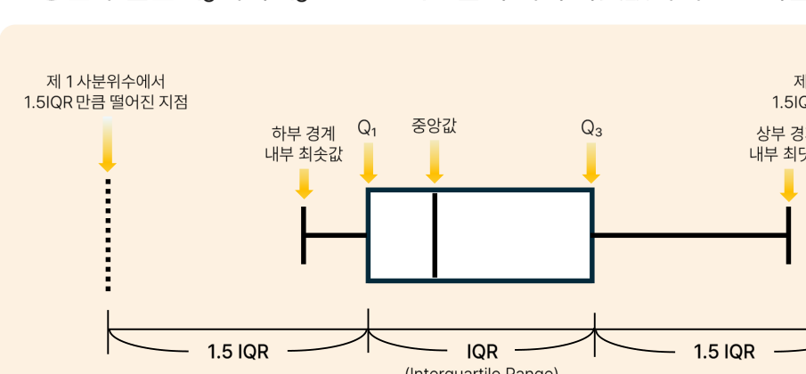
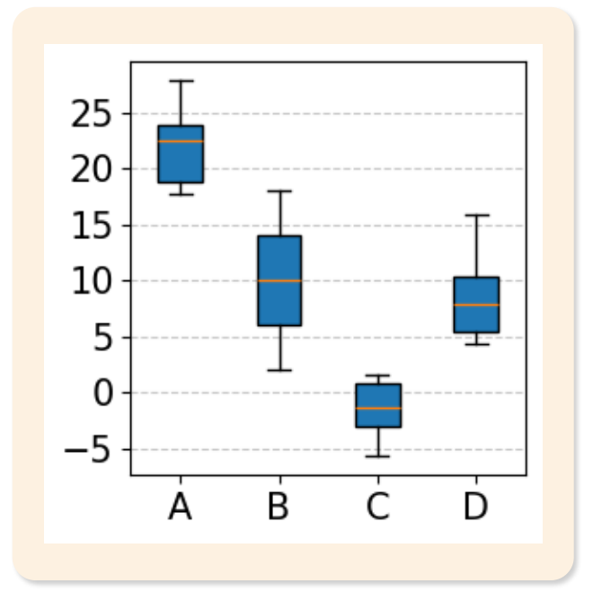

# 03. 자료의 표현

> 원본 PDF 범위: 67~100쪽 · PDF 설명 순서에 따라 재작성

## 주요 단어 먼저 보기

| 주요 단어 | 뜻 |
|---|---|
| 도수 | 값이나 구간이 나타난 횟수 |
| 상대도수 | 전체에서 해당 도수가 차지하는 비율 |
| 누적도수 | 해당 구간까지 도수를 더한 값 |
| 도수분포표 | 자료를 값·구간별 도수로 정리한 표 |
| 분할표 | 두 범주형 변수의 조합별 빈도를 나타낸 표 |
| 히스토그램 | 수치형 자료의 구간별 분포 |
| 상자그림 | 최솟값·사분위수·최댓값을 요약한 그래프 |
| 산점도 | 두 수치형 변수의 관계를 점으로 표현 |

> **단원 시작법:** 주요 단어의 뜻을 먼저 읽고, 아래 PDF 절 순서대로 학습한다.

<!-- TOC START -->
## 목차

- [1. 개요](#1-개요)
  - [원시자료를 정리하는 이유](#원시자료를-정리하는-이유)
- [2. 도수분포표](#2-도수분포표)
  - [빈도표와 교차표](#빈도표와-교차표)
- [3. 분할표](#3-분할표)
- [4. 데이터 시각화](#4-데이터-시각화)
  - [데이터 시각화의 목적과 분류](#데이터-시각화의-목적과-분류)
- [5. 일변량 그래프](#5-일변량-그래프)
  - [그래프 선택](#그래프-선택)
  - [사분위수와 상자그림](#사분위수와-상자그림)
- [6. 이변량 그래프](#6-이변량-그래프)
  - [다변량 표현](#다변량-표현)
- [7. 교재 문제와 해설](#7-교재-문제와-해설)
  - [문제 바로가기](#문제-바로가기)
  - [문제 1. 상대도수](#문제-1-상대도수)
  - [문제 2. 계급폭](#문제-2-계급폭)
  - [문제 3. 원그래프 중심각](#문제-3-원그래프-중심각)
  - [문제 4. 상자그림 판독](#문제-4-상자그림-판독)
  - [문제 5. 누적 막대그래프](#문제-5-누적-막대그래프)
- [보충 학습](#보충-학습)
  - [보강: 좋은 시각화의 원칙](#보강-좋은-시각화의-원칙)
  - [경험적 누적분포함수](#경험적-누적분포함수)
  - [왜곡을 만드는 표현](#왜곡을-만드는-표현)
  - [체크포인트](#체크포인트)
- [시험 직전 암기](#시험-직전-암기)
<!-- TOC END -->

## 1. 개요

> **PDF 68~70쪽**

> **암기 한 줄:** 표는 정확한 값, 그래프는 전체 패턴을 빠르게 보여 준다.

### 원시자료를 정리하는 이유

원시자료(raw data)는 수집된 그대로의 가공되지 않은 데이터다. 정보가 많지만 구조가 드러나지 않아 직접 해석하기 어렵고, 비교·패턴 탐색·의사결정에도 불편하다. 표와 그래프로 정리하면 핵심 정보가 압축되고 분포, 경향, 관계를 빠르게 파악할 수 있다.

- 표: 정확한 수치를 제공하고 계산·검증이 쉽지만, 전체 패턴을 직관적으로 보기 어렵다.
- 그래프: 패턴과 관계를 빠르게 보여 주지만, 정확한 수치를 읽기 어렵고 표현 방식에 따라 왜곡될 수 있다.

## 2. 도수분포표

> **PDF 71~74쪽**

> **암기 한 줄:** 도수는 개수, 상대도수는 비율, 누적도수는 이전 구간까지의 합이다.

### 빈도표와 교차표

- 도수: 범주나 구간에 속한 관측치 수
- 상대도수: 도수를 전체 관측치 수로 나눈 비율
- 누적도수: 순서가 있는 범주·구간까지의 도수 합
- 교차표: 두 범주형 변수의 결합 빈도를 행과 열로 표현

비율을 비교할 때는 전체 비율인지 행 비율인지 열 비율인지 명확히 표시한다.

연속형 자료는 계급구간으로 나눠 도수분포표를 만든다.

- 계급(class): 값을 묶은 구간.
- 계급폭(class width): 한 구간의 폭. 간단한 설계에서는 `(최댓값-최솟값)/계급 수`로 정한다.
- 계급값(class mark): 계급의 중앙값.
- 계급경계(class boundary): 인접 계급을 구분하는 실제 경계.

분할표(contingency table)는 둘 이상의 범주형 변수 조합에 따른 빈도를 나타낸다. 셀도수는 특정 조합의 빈도, 주변도수는 행 또는 열의 합, 총도수는 전체 관측 수다. 행·열 비율을 함께 보면 집단 크기가 다른 경우에도 조건부 분포를 비교할 수 있다.

## 3. 분할표

> **PDF 75~77쪽**

> **암기 한 줄:** 셀도수-주변도수-총도수를 구분하고 비교 기준이 행인지 열인지 확인한다.

분할표(contingency table)는 두 범주형 변수의 조합별 도수를 행과 열로 배열한다. 표 내부의 값은 셀도수, 각 행·열의 합은 주변도수, 모든 셀의 합은 총도수다. 집단 크기가 다르면 셀도수만 비교하지 말고 행 백분율이나 열 백분율을 사용한다.

| 보고 싶은 질문 | 계산 기준 |
|---|---|
| 각 성별 안에서 선호 음료가 어떻게 다른가? | 성별 행 합을 100%로 둔 행 비율 |
| 각 음료 선호자 중 성별 구성이 어떤가? | 음료 열 합을 100%로 둔 열 비율 |

> **함정:** 주변도수가 큰 집단은 셀도수도 커지기 쉽다. 조건부 비율을 보지 않으면 집단 크기 효과를 관계로 오해할 수 있다.

## 4. 데이터 시각화

> **PDF 78~79쪽**

> **암기 한 줄:** 변수 개수와 자료형을 먼저 보고 그래프를 고른다.

### 데이터 시각화의 목적과 분류

시각화는 데이터의 패턴·경향·관계를 그래픽으로 표현해 직관적으로 이해하도록 돕는다. 변수 수에 따라 일변량·이변량·다변량 그래프로 나누며, 자료 유형에 따라 범주형 또는 수치형 그래프를 선택한다.

## 5. 일변량 그래프

> **PDF 80~85쪽**

> **암기 한 줄:** 범주는 막대·원, 수치 분포는 히스토그램·상자그림이다.

### 그래프 선택

| 목적 | 권장 표현 | 주의점 |
|---|---|---|
| 범주별 크기 비교 | 막대그래프 | 축을 과도하게 잘라 차이를 부풀리지 않기 |
| 시간 흐름 | 선그래프 | 시간 간격을 균일하게 표시 |
| 수치형 분포 | 히스토그램, 밀도곡선 | 구간 폭에 따라 모양이 달라짐 |
| 중앙값·사분위수·이상치 | 상자그림 | 표본 크기는 별도로 확인 |
| 두 수치형 변수 관계 | 산점도 | 중첩·비선형 패턴 확인 |
| 구성비 | 누적막대 | 범주가 많으면 원형그래프보다 읽기 어려움 |

- 원그래프: 각 범주의 비율을 $비율\times360^\circ$의 중심각으로 표시한다. 범주가 많거나 비율 차이가 작으면 막대그래프가 더 읽기 쉽다.
- 복합 막대그래프: 주범주마다 부범주의 막대를 나란히 두어 하위 집단끼리 직접 비교하기 좋다.
- 누적 막대그래프: 주범주의 전체 합과 각 부범주의 기여도를 함께 보여 주지만, 기준선이 다른 중간 범주는 정확히 비교하기 어렵다.

### 사분위수와 상자그림

- $Q_1$: 제25백분위수
- $Q_2$: 중앙값, 제50백분위수
- $Q_3$: 제75백분위수
- 일반적인 이상치 후보: $Q_1-1.5IQR$ 미만 또는 $Q_3+1.5IQR$ 초과

상자그림에서 수염 밖의 점은 자동으로 오류가 아니다. 드문 정상값일 수 있으므로 도메인 검토 없이 제거하지 않는다.

*그림: 상자그림의 사분위수·IQR·수염 구조 — 원문 슬라이드에서 설명에 필요한 도해 영역만 잘라 수록.*

## 6. 이변량 그래프

> **PDF 86~90쪽**

> **암기 한 줄:** 수치-수치는 산점도, 시간 흐름은 선, 범주 조합은 복합·누적 막대다.

### 다변량 표현

- 색·모양: 산점도에 범주형 변수를 추가
- 패싯: 집단별로 동일한 축의 작은 그래프를 반복
- 상관행렬·히트맵: 많은 수치형 변수의 쌍별 관계를 탐색
- 평행좌표: 여러 수치형 변수의 패턴을 동시에 비교

색상에 수치적 순서를 표현할 때는 밝기가 점진적으로 변하는 연속 팔레트를, 범주 구분에는 명확히 다른 정성 팔레트를 사용한다.

## 7. 교재 문제와 해설

> **원문 단원 말미 문제 전체 수록**

> 먼저 문제와 보기를 풀고, **정답 및 선택지별 해설 보기**를 펼쳐 확인하세요. 일반 4지선다 문항은 ①~④를 모두 해설하며, 원문이 2지선다인 경우에는 실제 보기만 수록합니다.

### 문제 바로가기

| 문제 | 주제 | 관련 목차 | PDF |
|---:|---|---|---:|
| [1](#ch03-q1) | 상대도수 | [2. 도수분포표](#2-도수분포표) | 91쪽 |
| [2](#ch03-q2) | 계급폭 | [2. 도수분포표](#2-도수분포표) | 93쪽 |
| [3](#ch03-q3) | 원그래프 중심각 | [5. 일변량 그래프](#5-일변량-그래프) | 95쪽 |
| [4](#ch03-q4) | 상자그림 판독 | [5. 일변량 그래프](#5-일변량-그래프) | 97쪽 |
| [5](#ch03-q5) | 누적 막대그래프 | [5. 일변량 그래프](#5-일변량-그래프) · [6. 이변량 그래프](#6-이변량-그래프) | 99쪽 |

### 문제 1. 상대도수

**출처:** PDF 91쪽  
**관련 목차:** [2. 도수분포표](#2-도수분포표)

도수분포표의 상대도수에 대한 설명으로 옳지 않은 것은?

1. 전체 관측값에 대한 각 구간의 도수 비율을 나타낸다.
2. 모든 상대도수의 합은 항상 1이 된다.
3. 상대도수는 0 이상 1 이하의 값을 가진다.
4. 상대도수는 절대도수보다 항상 작은 값을 가진다.

정답 및 선택지별 해설 보기

**정답: ④ 상대도수는 절대도수보다 항상 작은 값을 가진다.**

- **① 오답:** 정답이 아님. 상대도수는 해당 구간 도수를 전체 도수로 나눈 비율이다.
- **② 오답:** 정답이 아님. 모든 구간이 표본 전체를 빠짐없이 나누면 상대도수의 합은 1(100%)이다.
- **③ 오답:** 정답이 아님. 도수/전체 도수이므로 상대도수의 범위는 0≤상대도수≤1이다.
- **④ 정답:** 정답(옳지 않은 설명). 전체 관측값이 1이고 해당 구간 도수가 1이면 절대도수와 상대도수가 모두 1이다. 따라서 ‘항상 작다’는 틀리다.

### 문제 2. 계급폭

**출처:** PDF 93쪽  
**관련 목차:** [2. 도수분포표](#2-도수분포표)

연속형 데이터의 최솟값이 15, 최댓값이 85이고 계급의 개수를 7로 설정할 때 계급폭은?

1. 10
2. 12
3. 14
4. 16

정답 및 선택지별 해설 보기

**정답: ① 10**

- **① 정답:** 계급폭=(최댓값−최솟값)/계급 수=(85−15)/7=10이다.
- **② 오답:** 범위 70을 계급 수 7로 나눈 값은 12가 아니라 10이다.
- **③ 오답:** 14는 계급 수를 잘못 적용한 값이며, 7개 계급이면 70/7로 계산한다.
- **④ 오답:** 16을 계급폭으로 쓰면 7개 계급의 총 폭이 112가 되어 자료 범위 70과 맞지 않는다.

### 문제 3. 원그래프 중심각

**출처:** PDF 95쪽  
**관련 목차:** [5. 일변량 그래프](#5-일변량-그래프)

원그래프에서 어떤 범주의 도수가 전체의 25%를 차지한다면 이 범주에 해당하는 중심각의 크기는?

1. 45°
2. 60°
3. 90°
4. 120°

정답 및 선택지별 해설 보기

**정답: ③ 90°**

- **① 오답:** 45°/360°=12.5%이므로 25%를 나타내지 않는다.
- **② 오답:** 60°/360°≈16.7%이므로 주어진 비율보다 작다.
- **③ 정답:** 중심각=0.25×360°=90°이다.
- **④ 오답:** 120°/360°=약 33.3%로 25%보다 크다.

### 문제 4. 상자그림 판독

**출처:** PDF 97쪽  
**관련 목차:** [5. 일변량 그래프](#5-일변량-그래프)

데이터 {2, 4, 6, 8, 10, 12, 14, 16, 18}로 그린 상자그림으로 판단되는 것은 무엇인가?

1. A
2. B
3. C
4. D

정답 및 선택지별 해설 보기

**정답: ② B**

- **① 오답:** A는 중앙값과 상자의 위치가 20 이상으로 올라가 있어 주어진 자료의 중앙값 10과 맞지 않는다.
- **② 정답:** 정렬 자료에서 Q1=6, 중앙값=10, Q3=14이고 최솟값=2, 최댓값=18이므로 B와 일치한다.
- **③ 오답:** C는 상자와 중앙값이 0 아래에 있어 모두 양수인 자료 범위 2~18과 맞지 않는다.
- **④ 오답:** D의 중앙값과 사분위 범위는 주어진 Q1=6, Q2=10, Q3=14를 나타내지 않는다.

### 문제 5. 누적 막대그래프

**출처:** PDF 99쪽  
**관련 목차:** [5. 일변량 그래프](#5-일변량-그래프) · [6. 이변량 그래프](#6-이변량-그래프)

누적 막대그래프의 특징으로 옳지 않은 것은?

1. 각 주범주에 대해 부범주를 누적하여 표시한다.
2. 전체 합계 정보를 파악하기 쉽다.
3. 각 부분의 기여도를 파악하기 쉽다.
4. 중간 범주의 변화를 정확히 파악하기 쉽다.

정답 및 선택지별 해설 보기

**정답: ④ 중간 범주의 변화를 정확히 파악하기 쉽다.**

- **① 오답:** 정답이 아님. 누적 막대는 한 막대 안에 부범주 값을 차례로 쌓아 주범주의 구성을 표현한다.
- **② 오답:** 정답이 아님. 막대 전체 높이가 합계를 나타내므로 주범주별 총량 비교에 유리하다.
- **③ 오답:** 정답이 아님. 각 색 구간의 크기로 전체에서 각 부범주가 차지하는 기여를 볼 수 있다.
- **④ 정답:** 정답(옳지 않은 설명). 중간 구간은 기준선이 막대마다 달라 길이를 직접 비교하기 어렵다. 첫 구간이나 전체 합계보다 변화 파악이 불리하다.

## 보충 학습

> 원문 1~마지막 이론 절을 모두 학습한 뒤 보는 확장 내용이다.

### 보강: 좋은 시각화의 원칙

1. 질문에 맞는 차트를 선택한다.
2. 축·단위·표본 수를 표시한다.
3. 색은 의미가 있을 때만 사용한다.
4. 3D 효과나 장식으로 면적을 왜곡하지 않는다.
5. 집계값 뒤에 가려진 분포와 불확실성을 함께 보여준다.

### 경험적 누적분포함수

경험적 누적분포함수(ECDF)는 각 값 $x$ 이하인 관측치 비율을 표시한다.

$$
\widehat F(x)=\frac{1}{n}\sum_{i=1}^n I(x_i\le x)
$$

히스토그램처럼 구간 폭을 정할 필요가 없고 중앙값·백분위수를 직접 읽기 좋다. 반면 표본이 많으면 계단이 촘촘해져 집단 간 비교가 복잡해질 수 있다.

### 왜곡을 만드는 표현

- 막대그래프의 y축을 0이 아닌 값에서 시작해 작은 차이를 과장
- 서로 다른 단위의 이중 y축으로 우연한 동행을 강조
- 면적·부피가 값의 제곱·세제곱으로 커지는 그림문자 사용
- 전체 표본 수가 다른 집단의 빈도만 비교

그래프는 데이터를 압축하는 모델이다. 무엇을 생략했는지까지 설명해야 한다.

### 체크포인트

- 히스토그램은 연속형 변수의 구간별 빈도, 막대그래프는 범주별 빈도를 표현한다.
- $Q_2$는 중앙값이다.
- 상관관계는 산점도로 먼저 확인하고 계수로 요약한다.

## 시험 직전 암기

- 표는 정확한 값, 그래프는 전체 패턴을 빠르게 보여 준다.
- 도수는 개수, 상대도수는 비율, 누적도수는 이전 구간까지의 합이다.
- 셀도수-주변도수-총도수를 구분하고 비교 기준이 행인지 열인지 확인한다.
- 변수 개수와 자료형을 먼저 보고 그래프를 고른다.
- 범주는 막대·원, 수치 분포는 히스토그램·상자그림이다.
- 수치-수치는 산점도, 시간 흐름은 선, 범주 조합은 복합·누적 막대다.
