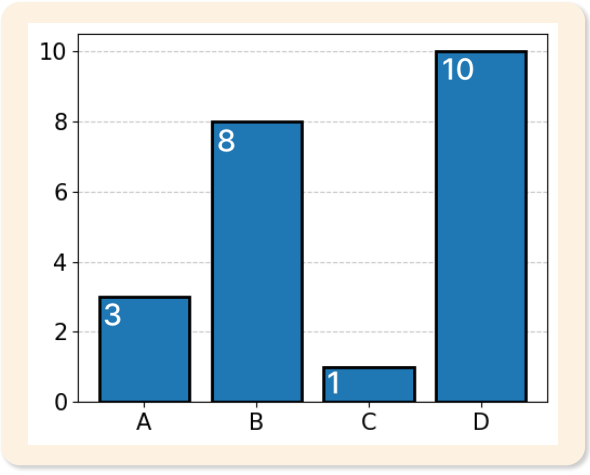
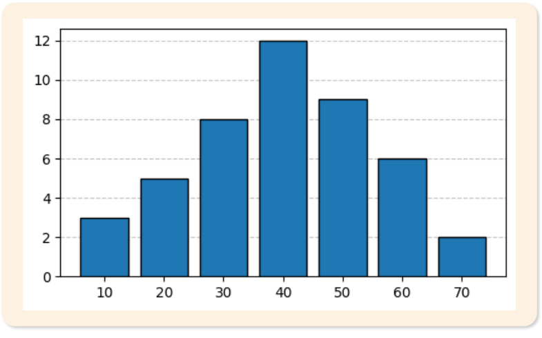
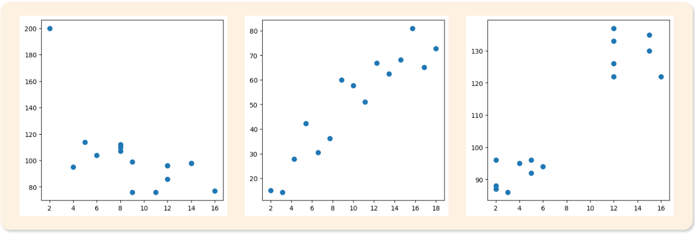
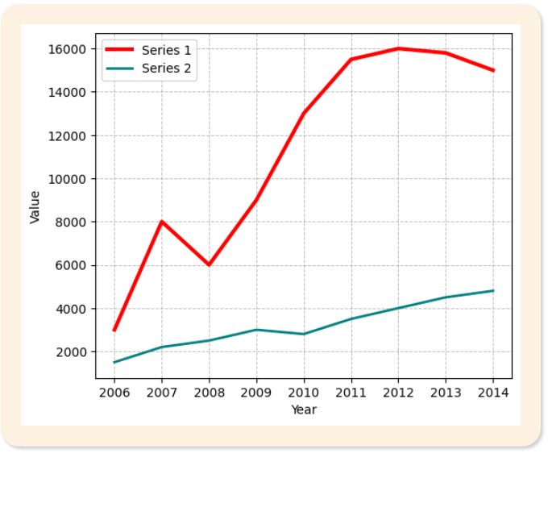
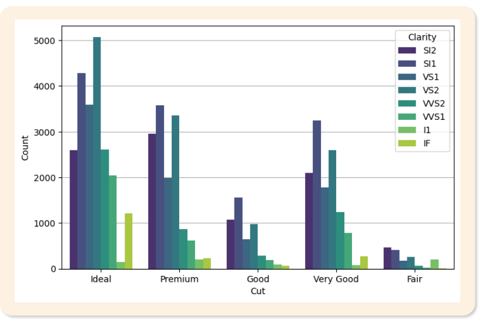
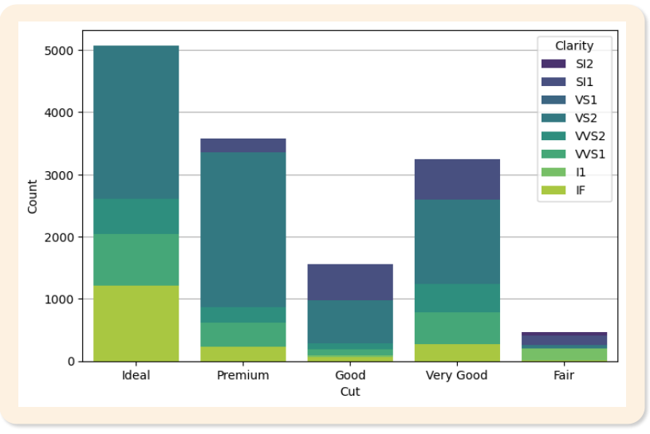

# 03. 자료의 표현

> 원본 PDF 범위: 67~100쪽 · PDF 설명 순서에 따라 재작성

## 주요 단어 먼저 보기

| 주요 단어 | 뜻 |
|---|---|
| 도수 | 값이나 구간이 나타난 횟수 |
| 상대도수 | 전체에서 해당 도수가 차지하는 비율 |
| 누적도수 | 해당 구간까지 도수를 더한 값 |
| 도수분포표 | 자료를 값·구간별 도수로 정리한 표 |
| 분할표 | 두 범주형 변수의 조합별 빈도를 나타낸 표 |
| 히스토그램 | 수치형 자료의 구간별 분포 |
| 상자그림 | 최솟값·사분위수·최댓값을 요약한 그래프 |
| 산점도 | 두 수치형 변수의 관계를 점으로 표현 |

> **단원 시작법:** 주요 단어의 뜻을 먼저 읽고, 아래 PDF 절 순서대로 학습한다.

<!-- TOC START -->
## 목차

- [1. 개요](#1-개요)
  - [원시자료를 정리하는 이유](#원시자료를-정리하는-이유)
- [2. 도수분포표](#2-도수분포표)
  - [도수분포표의 구성](#도수분포표의-구성)
  - [질적 자료의 도수분포표 예시](#질적-자료의-도수분포표-예시)
  - [양적 자료의 계급구간](#양적-자료의-계급구간)
- [3. 분할표](#3-분할표)
- [4. 데이터 시각화](#4-데이터-시각화)
  - [데이터 시각화의 목적과 분류](#데이터-시각화의-목적과-분류)
- [5. 일변량 그래프](#5-일변량-그래프)
  - [막대그래프](#막대그래프)
  - [히스토그램](#히스토그램)
  - [원그래프](#원그래프)
  - [상자그림](#상자그림)
  - [집단별 상자그림](#집단별-상자그림)
- [6. 이변량 그래프](#6-이변량-그래프)
  - [산점도](#산점도)
  - [선그래프](#선그래프)
  - [복합 막대그래프](#복합-막대그래프)
  - [누적 막대그래프](#누적-막대그래프)
- [7. 교재 문제와 해설](#7-교재-문제와-해설)
  - [문제 바로가기](#문제-바로가기)
  - [문제 1. 상대도수](#문제-1-상대도수)
  - [문제 2. 계급폭](#문제-2-계급폭)
  - [문제 3. 원그래프 중심각](#문제-3-원그래프-중심각)
  - [문제 4. 상자그림 판독](#문제-4-상자그림-판독)
  - [문제 5. 누적 막대그래프](#문제-5-누적-막대그래프)
- [보충 학습](#보충-학습)
  - [보강: 좋은 시각화의 원칙](#보강-좋은-시각화의-원칙)
  - [경험적 누적분포함수](#경험적-누적분포함수)
  - [왜곡을 만드는 표현](#왜곡을-만드는-표현)
  - [체크포인트](#체크포인트)
- [시험 직전 암기](#시험-직전-암기)
<!-- TOC END -->

## 1. 개요

> **PDF 68~70쪽**

> **암기 한 줄:** 표는 정확한 값, 그래프는 전체 패턴을 빠르게 보여 준다.

### 원시자료를 정리하는 이유

원시자료(raw data)는 관찰이나 측정을 통해 수집한 뒤 아직 정리·가공하지 않은 데이터다. 개별 관측값은 모두 남아 있지만 자료가 많아질수록 전체 구조를 한눈에 파악하기 어렵다.

- 값이 어디에 집중되는지 알기 어렵다.
- 자료의 분포·경향·관계를 직접 비교하기 어렵다.
- 이상치나 반복되는 패턴을 발견하기 어렵다.
- 분석 결과를 다른 사람에게 전달하고 의사결정에 활용하기 어렵다.

자료를 표나 그래프로 정리하면 많은 값을 압축하여 핵심 정보를 전달하고, 분포의 형태·집단 차이·변수 사이의 관계를 빠르게 찾을 수 있다.

| 표현 | 장점 | 한계 |
|---|---|---|
| 표 | 정확한 값과 세부 정보를 확인·비교하기 좋다 | 전체 패턴을 직관적으로 파악하기 어렵다 |
| 그래프 | 분포·경향·관계를 빠르게 이해하기 좋다 | 정확한 수치를 읽기 어렵고 설계에 따라 왜곡될 수 있다 |

> **선택 기준:** 정확한 숫자가 중요하면 표, 전체 모습과 패턴이 중요하면 그래프를 우선한다. 실제 보고서에서는 두 표현을 함께 쓰기도 한다.

## 2. 도수분포표

> **PDF 71~74쪽**

> **암기 한 줄:** 도수는 개수, 상대도수는 비율, 누적도수는 이전 구간까지의 합이다.

### 도수분포표의 구성

도수분포표(frequency table)는 관측값을 범주나 계급구간으로 묶고, 각 항목이 나타난 횟수를 정리한 표다.

- **도수 $f_i$:** 범주 또는 구간에 속한 관측값의 수
- **상대도수 $r_i$:** 전체에서 해당 도수가 차지하는 비율, $r_i=f_i/n$
- **누적도수 $F_i$:** 첫 범주부터 현재 범주까지 도수를 차례로 더한 값, $F_i=\sum_{j=1}^{i}f_j$
- 상대도수의 합은 1, 마지막 누적도수는 전체 관측 수 $n$이다.

누적도수는 순서를 정할 수 있는 자료에서 의미가 있다. 명목형 자료는 범주 순서가 없으므로 단순히 누적해도 해석상 의미가 약하다.

### 질적 자료의 도수분포표 예시

교재의 품목 자료를 그대로 표로 옮기면 다음과 같다.

| 품목 | 도수 | 상대도수 | 누적도수 |
|---|---:|---:|---:|
| 절연 장갑 | 25 | 0.25 | 25 |
| 볼트 | 20 | 0.20 | 45 |
| 너트 | 15 | 0.15 | 60 |
| 손세정제 | 30 | 0.30 | 90 |
| 복사용지 | 10 | 0.10 | 100 |
| **합계** | **100** | **1.00** | **100** |

### 양적 자료의 계급구간

연속형 자료는 값 하나하나의 도수를 세기보다 여러 값을 계급으로 묶는다.

- **계급(class/bin):** 자료를 묶은 값의 구간
- **계급폭(class width):** 한 계급이 차지하는 구간의 너비
- **계급값(class mark):** 계급의 대표값으로 보통 양 끝값의 평균
- **계급경계(class boundary):** 인접 계급이 겹치지 않게 나누는 실제 경계

교재의 길이 자료는 다음과 같다.

| 계급 | 계급값 | 도수 | 상대도수 | 누적도수 |
|---|---:|---:|---:|---:|
| 180~184 | 182 | 5 | 0.10 | 5 |
| 185~189 | 187 | 8 | 0.16 | 13 |
| 190~194 | 192 | 15 | 0.30 | 28 |
| 195~199 | 197 | 12 | 0.24 | 40 |
| 200~204 | 202 | 7 | 0.14 | 47 |
| 205~210 | 207 | 3 | 0.06 | 50 |
| **합계** |  | **50** | **1.00** | **50** |

> **교재 표기 주의:** 마지막 계급이 `205~210`이면 양 끝의 평균은 207.5이고, 앞 계급들과 포함 정수 개수도 달라진다. 표의 계급값 207 및 일정한 계급폭을 유지하려면 마지막 계급은 `205~209`로 보는 것이 자연스럽다. 위 표는 원문 값을 그대로 수록했으며, 계산 문제에서는 주어진 계급 양 끝의 평균을 직접 확인한다.

계급 수가 너무 적으면 분포의 세부 구조가 사라지고, 너무 많으면 원시자료처럼 복잡해진다. 서로 다른 자료의 히스토그램을 비교할 때는 계급경계와 계급폭을 같게 맞추는 것이 좋다.

## 3. 분할표

> **PDF 75~77쪽**

> **암기 한 줄:** 셀도수-주변도수-총도수를 구분하고 비교 기준이 행인지 열인지 확인한다.

분할표(contingency table)는 두 범주형 변수의 범주 조합별 도수를 행과 열에 배열한 표다. $f_{ij}$를 $i$번째 행과 $j$번째 열의 도수라 하면 다음을 구분한다.

- **결합도수:** 두 조건을 동시에 만족하는 셀의 도수 $f_{ij}$
- **주변도수:** 행 합 $f_{i\cdot}$ 또는 열 합 $f_{\cdot j}$
- **총도수:** 모든 셀의 합 $n$
- **결합상대도수:** 전체 중 특정 조합의 비율 $f_{ij}/n$
- **조건부상대도수:** 특정 행 안에서의 비율 $f_{ij}/f_{i\cdot}$ 또는 특정 열 안에서의 비율 $f_{ij}/f_{\cdot j}$

교재의 성별·선호 범주 도수 예시는 다음과 같다.

| 구분 | 범주 1 | 범주 2 | 범주 3 | 합계 |
|---|---:|---:|---:|---:|
| 남성 | 45 | 15 | 20 | 80 |
| 여성 | 25 | 35 | 40 | 100 |
| **합계** | **70** | **50** | **60** | **180** |

전체 180명을 분모로 한 결합상대도수는 다음과 같다. 반올림 때문에 표시값의 행·열 합에 작은 차이가 생길 수 있다.

| 구분 | 범주 1 | 범주 2 | 범주 3 | 합계 |
|---|---:|---:|---:|---:|
| 남성 | 0.25 | 0.08 | 0.11 | 0.44 |
| 여성 | 0.14 | 0.19 | 0.22 | 0.56 |
| **합계** | **0.39** | **0.28** | **0.33** | **1.00** |

> **중요:** 위 두 번째 표는 모든 셀을 전체 $n=180$으로 나눈 **결합상대도수표**다. 예를 들어 남성 중 범주 1의 조건부상대도수는 $45/80=0.5625$로, 결합상대도수 $45/180=0.25$와 다르다.

집단 크기가 다르면 셀도수만 비교하지 말고 질문에 맞는 조건부 비율을 사용한다.

| 보고 싶은 질문 | 계산 기준 |
|---|---|
| 각 성별 안에서 선호 음료가 어떻게 다른가? | 성별 행 합을 100%로 둔 행 비율 |
| 각 음료 선호자 중 성별 구성이 어떤가? | 음료 열 합을 100%로 둔 열 비율 |

> **함정:** 주변도수가 큰 집단은 셀도수도 커지기 쉽다. 조건부 비율을 보지 않으면 집단 크기 효과를 관계로 오해할 수 있다.

## 4. 데이터 시각화

> **PDF 78~79쪽**

> **암기 한 줄:** 변수 개수와 자료형을 먼저 보고 그래프를 고른다.

### 데이터 시각화의 목적과 분류

시각화는 데이터의 패턴·경향·관계를 그림으로 표현하여 직관적으로 이해하고 전달하는 과정이다. 숫자만 볼 때 놓치기 쉬운 분포, 이상치, 시간 변화, 변수 관계를 찾는 데 유용하다.

그래프는 먼저 **변수 개수**, 그다음 **자료형**으로 고른다.

| 변수 수 | 자료형·목적 | 대표 그래프 |
|---|---|---|
| 일변량 | 범주형 빈도·비율 | 막대그래프, 원그래프 |
| 일변량 | 수치형 분포 | 히스토그램, 상자그림 |
| 이변량 | 수치형-수치형 관계 | 산점도, 선그래프 |
| 이변량 | 범주형 조합 비교 | 복합 막대그래프, 누적 막대그래프 |

다변량 자료는 색·모양·면 분할 등을 더해 표현할 수 있지만, 한 화면에 너무 많은 정보를 넣으면 오히려 해석이 어려워진다.

## 5. 일변량 그래프

> **PDF 80~85쪽**

> **암기 한 줄:** 범주는 막대·원, 수치 분포는 히스토그램·상자그림이다.

교재의 일변량 그래프는 **막대그래프 → 히스토그램 → 원그래프 → 상자그림 → 집단별 상자그림** 순서다.

### 막대그래프

범주별 빈도나 값을 막대 길이로 비교한다. 범주는 서로 분리되어 있으므로 막대 사이도 띄운다. 막대를 세로 또는 가로로 배치할 수 있으며, 축을 과도하게 잘라 작은 차이를 크게 보이게 하지 않아야 한다.

*그림: 막대그래프의 기본 형태 — 원문 슬라이드에서 필요한 그래프 영역만 잘라 수록.*

### 히스토그램

연속형 수치자료를 계급구간으로 나눈 뒤 도수나 상대도수를 막대 면적으로 나타낸다. 구간이 연속되므로 일반적으로 막대 사이를 붙인다. 계급폭이 달라지면 단순 높이가 아니라 **도수밀도**를 사용해 막대의 면적이 도수에 비례하게 해야 한다.

*그림: 히스토그램의 기본 형태 — 원문 슬라이드에서 필요한 그래프 영역만 잘라 수록.*

> **막대 vs 히스토그램:** 막대그래프는 범주 순서를 바꿀 수 있고 막대가 떨어진다. 히스토그램은 수치 구간 순서가 고정되고 막대가 이어진다.

### 원그래프

전체를 원 하나로 보고 각 범주의 비율을 부채꼴로 나타낸다.

$$
\text{중심각}=\text{상대도수}\times360^\circ
$$

전체에 대한 구성비를 보여 주기 좋지만, 범주가 많거나 비율 차이가 작으면 각도 비교가 어렵다. 이때는 막대그래프가 더 명확하다.

### 상자그림

다섯 수치 요약인 `최솟값, Q1, 중앙값(Q2), Q3, 최댓값`을 이용해 분포를 간결하게 나타낸다. 실제 상자그림에서는 수염을 단순한 최솟값·최댓값이 아니라 울타리 안의 가장 바깥 관측값까지 그리는 방식이 널리 쓰인다.

- $Q_1$: 제25백분위수
- $Q_2$: 중앙값, 제50백분위수
- $Q_3$: 제75백분위수
- 일반적인 이상치 후보: $Q_1-1.5IQR$ 미만 또는 $Q_3+1.5IQR$ 초과

상자그림에서 수염 밖의 점은 자동으로 오류가 아니다. 드문 정상값일 수 있으므로 도메인 검토 없이 제거하지 않는다.

*그림: 상자그림의 사분위수·IQR·수염 구조 — 원문 슬라이드에서 설명에 필요한 도해 영역만 잘라 수록.*

상자의 길이는 가운데 50%의 퍼짐, 상자 안의 선은 중앙값을 뜻한다. 중앙값의 위치와 양쪽 수염 길이를 비교하면 치우침을 짐작할 수 있다.

### 집단별 상자그림

여러 집단의 상자그림을 같은 축에 나란히 놓으면 중앙값, IQR, 전체 범위, 이상치와 치우침을 동시에 비교할 수 있다. 다만 상자 폭이 표본 수를 나타내도록 별도 설정하지 않은 한, 일반적인 상자 폭만으로 표본 크기를 판단하면 안 된다.

## 6. 이변량 그래프

> **PDF 86~90쪽**

> **암기 한 줄:** 수치-수치는 산점도, 시간 흐름은 선, 범주 조합은 복합·누적 막대다.

교재는 이변량 자료의 표현으로 **산점도 → 선그래프 → 복합 막대그래프 → 누적 막대그래프**를 설명한다.

### 산점도

두 수치형 변수의 관측값 $(x_i,y_i)$를 좌표평면의 점으로 표시한다. 점의 방향으로 양·음의 관계를, 점이 모인 정도로 관계의 강도를, 곡선 모양으로 비선형 관계를 탐색할 수 있다. 이상치와 여러 집단이 섞인 패턴도 확인한다.

*그림: 산점도의 양·음·무상관 패턴 — 원문 슬라이드에서 필요한 도해 영역만 잘라 수록.*

점이 너무 많이 겹치면 투명도, 작은 점, 흔들기(jitter), 육각형 구간 등을 사용할 수 있다. 산점도의 패턴은 인과관계를 증명하지 않으며, 제3의 변수나 집단 효과를 확인해야 한다.

### 선그래프

시간처럼 순서가 있는 $x$축의 관측값을 선으로 연결한다. 시간에 따른 추세·주기·급격한 변화를 파악하는 데 적합하다. 시간 간격은 실제 간격에 맞춰 표시하고, 순서가 없는 범주를 선으로 연결하지 않는다.

*그림: 선그래프의 기본 형태 — 원문 슬라이드에서 필요한 그래프 영역만 잘라 수록.*

### 복합 막대그래프

주범주마다 부범주의 막대를 나란히 배치한다. 각 부범주가 같은 기준선에서 시작하므로 집단 사이의 값을 직접 비교하기 좋다.

*그림: 복합 막대그래프의 기본 형태 — 원문 슬라이드에서 필요한 그래프 영역만 잘라 수록.*

### 누적 막대그래프

하나의 막대 안에 부범주 값을 쌓아 전체 크기와 구성비를 함께 보여 준다. 첫 구간을 제외한 중간 구간은 기준선이 서로 달라 정확한 크기 비교가 어렵다. 100% 누적 막대그래프는 전체 크기 대신 집단별 구성비를 비교한다.

*그림: 누적 막대그래프의 기본 형태 — 원문 슬라이드에서 필요한 그래프 영역만 잘라 수록.*

> **암기:** 숫자 둘은 점(산점도), 시간은 선, 범주 둘은 나란히(복합) 또는 쌓기(누적).

## 7. 교재 문제와 해설

> **원문 단원 말미 문제 전체 수록**

> 먼저 문제와 보기를 풀고, **정답 및 선택지별 해설 보기**를 펼쳐 확인하세요. 일반 4지선다 문항은 ①~④를 모두 해설하며, 원문이 2지선다인 경우에는 실제 보기만 수록합니다.

### 문제 바로가기

| 문제 | 주제 | 관련 목차 | PDF |
|---:|---|---|---:|
| [1](#ch03-q1) | 상대도수 | [2. 도수분포표](#2-도수분포표) | 91쪽 |
| [2](#ch03-q2) | 계급폭 | [2. 도수분포표](#2-도수분포표) | 93쪽 |
| [3](#ch03-q3) | 원그래프 중심각 | [5. 일변량 그래프](#5-일변량-그래프) | 95쪽 |
| [4](#ch03-q4) | 상자그림 판독 | [5. 일변량 그래프](#5-일변량-그래프) | 97쪽 |
| [5](#ch03-q5) | 누적 막대그래프 | [5. 일변량 그래프](#5-일변량-그래프) · [6. 이변량 그래프](#6-이변량-그래프) | 99쪽 |

### 문제 1. 상대도수

**출처:** PDF 91쪽  
**관련 목차:** [2. 도수분포표](#2-도수분포표)

도수분포표의 상대도수에 대한 설명으로 옳지 않은 것은?

1. 전체 관측값에 대한 각 구간의 도수 비율을 나타낸다.
2. 모든 상대도수의 합은 항상 1이 된다.
3. 상대도수는 0 이상 1 이하의 값을 가진다.
4. 상대도수는 절대도수보다 항상 작은 값을 가진다.

정답 및 선택지별 해설 보기

**정답: ④ 상대도수는 절대도수보다 항상 작은 값을 가진다.**

- **① 오답:** 정답이 아님. 상대도수는 해당 구간 도수를 전체 도수로 나눈 비율이다.
- **② 오답:** 정답이 아님. 모든 구간이 표본 전체를 빠짐없이 나누면 상대도수의 합은 1(100%)이다.
- **③ 오답:** 정답이 아님. 도수/전체 도수이므로 상대도수의 범위는 0≤상대도수≤1이다.
- **④ 정답:** 정답(옳지 않은 설명). 전체 관측값이 1이고 해당 구간 도수가 1이면 절대도수와 상대도수가 모두 1이다. 따라서 ‘항상 작다’는 틀리다.

### 문제 2. 계급폭

**출처:** PDF 93쪽  
**관련 목차:** [2. 도수분포표](#2-도수분포표)

연속형 데이터의 최솟값이 15, 최댓값이 85이고 계급의 개수를 7로 설정할 때 계급폭은?

1. 10
2. 12
3. 14
4. 16

정답 및 선택지별 해설 보기

**정답: ① 10**

- **① 정답:** 계급폭=(최댓값−최솟값)/계급 수=(85−15)/7=10이다.
- **② 오답:** 범위 70을 계급 수 7로 나눈 값은 12가 아니라 10이다.
- **③ 오답:** 14는 계급 수를 잘못 적용한 값이며, 7개 계급이면 70/7로 계산한다.
- **④ 오답:** 16을 계급폭으로 쓰면 7개 계급의 총 폭이 112가 되어 자료 범위 70과 맞지 않는다.

### 문제 3. 원그래프 중심각

**출처:** PDF 95쪽  
**관련 목차:** [5. 일변량 그래프](#5-일변량-그래프)

원그래프에서 어떤 범주의 도수가 전체의 25%를 차지한다면 이 범주에 해당하는 중심각의 크기는?

1. 45°
2. 60°
3. 90°
4. 120°

정답 및 선택지별 해설 보기

**정답: ③ 90°**

- **① 오답:** 45°/360°=12.5%이므로 25%를 나타내지 않는다.
- **② 오답:** 60°/360°≈16.7%이므로 주어진 비율보다 작다.
- **③ 정답:** 중심각=0.25×360°=90°이다.
- **④ 오답:** 120°/360°=약 33.3%로 25%보다 크다.

### 문제 4. 상자그림 판독

**출처:** PDF 97쪽  
**관련 목차:** [5. 일변량 그래프](#5-일변량-그래프)

데이터 {2, 4, 6, 8, 10, 12, 14, 16, 18}로 그린 상자그림으로 판단되는 것은 무엇인가?

1. A
2. B
3. C
4. D

정답 및 선택지별 해설 보기

**정답: ② B**

- **① 오답:** A는 중앙값과 상자의 위치가 20 이상으로 올라가 있어 주어진 자료의 중앙값 10과 맞지 않는다.
- **② 정답:** 정렬 자료에서 Q1=6, 중앙값=10, Q3=14이고 최솟값=2, 최댓값=18이므로 B와 일치한다.
- **③ 오답:** C는 상자와 중앙값이 0 아래에 있어 모두 양수인 자료 범위 2~18과 맞지 않는다.
- **④ 오답:** D의 중앙값과 사분위 범위는 주어진 Q1=6, Q2=10, Q3=14를 나타내지 않는다.

### 문제 5. 누적 막대그래프

**출처:** PDF 99쪽  
**관련 목차:** [5. 일변량 그래프](#5-일변량-그래프) · [6. 이변량 그래프](#6-이변량-그래프)

누적 막대그래프의 특징으로 옳지 않은 것은?

1. 각 주범주에 대해 부범주를 누적하여 표시한다.
2. 전체 합계 정보를 파악하기 쉽다.
3. 각 부분의 기여도를 파악하기 쉽다.
4. 중간 범주의 변화를 정확히 파악하기 쉽다.

정답 및 선택지별 해설 보기

**정답: ④ 중간 범주의 변화를 정확히 파악하기 쉽다.**

- **① 오답:** 정답이 아님. 누적 막대는 한 막대 안에 부범주 값을 차례로 쌓아 주범주의 구성을 표현한다.
- **② 오답:** 정답이 아님. 막대 전체 높이가 합계를 나타내므로 주범주별 총량 비교에 유리하다.
- **③ 오답:** 정답이 아님. 각 색 구간의 크기로 전체에서 각 부범주가 차지하는 기여를 볼 수 있다.
- **④ 정답:** 정답(옳지 않은 설명). 중간 구간은 기준선이 막대마다 달라 길이를 직접 비교하기 어렵다. 첫 구간이나 전체 합계보다 변화 파악이 불리하다.

## 보충 학습

> 원문 1~마지막 이론 절을 모두 학습한 뒤 보는 확장 내용이다.

### 보강: 좋은 시각화의 원칙

1. 질문에 맞는 차트를 선택한다.
2. 축·단위·표본 수를 표시한다.
3. 색은 의미가 있을 때만 사용한다.
4. 3D 효과나 장식으로 면적을 왜곡하지 않는다.
5. 집계값 뒤에 가려진 분포와 불확실성을 함께 보여준다.

### 경험적 누적분포함수

경험적 누적분포함수(ECDF)는 각 값 $x$ 이하인 관측치 비율을 표시한다.

$$
\widehat F(x)=\frac{1}{n}\sum_{i=1}^n I(x_i\le x)
$$

히스토그램처럼 구간 폭을 정할 필요가 없고 중앙값·백분위수를 직접 읽기 좋다. 반면 표본이 많으면 계단이 촘촘해져 집단 간 비교가 복잡해질 수 있다.

### 왜곡을 만드는 표현

- 막대그래프의 y축을 0이 아닌 값에서 시작해 작은 차이를 과장
- 서로 다른 단위의 이중 y축으로 우연한 동행을 강조
- 면적·부피가 값의 제곱·세제곱으로 커지는 그림문자 사용
- 전체 표본 수가 다른 집단의 빈도만 비교

그래프는 데이터를 압축하는 모델이다. 무엇을 생략했는지까지 설명해야 한다.

### 체크포인트

- 히스토그램은 연속형 변수의 구간별 빈도, 막대그래프는 범주별 빈도를 표현한다.
- $Q_2$는 중앙값이다.
- 상관관계는 산점도로 먼저 확인하고 계수로 요약한다.

## 시험 직전 암기

- 표는 정확한 값, 그래프는 전체 패턴을 빠르게 보여 준다.
- 도수는 개수, 상대도수는 비율, 누적도수는 이전 구간까지의 합이다.
- 셀도수-주변도수-총도수를 구분하고 비교 기준이 행인지 열인지 확인한다.
- 변수 개수와 자료형을 먼저 보고 그래프를 고른다.
- 범주는 막대·원, 수치 분포는 히스토그램·상자그림이다.
- 수치-수치는 산점도, 시간 흐름은 선, 범주 조합은 복합·누적 막대다.
