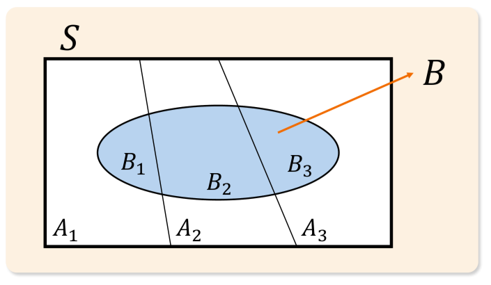

# 05. 확률의 계산

> 원본 PDF 범위: 127~155쪽 · PDF 설명 순서에 따라 재작성

## 주요 단어 먼저 보기

| 주요 단어 | 뜻 |
|---|---|
| 독립사건 | 한 사건의 발생이 다른 사건 확률을 바꾸지 않음 |
| 상호배타사건 | 두 사건이 동시에 일어날 수 없어 교집합이 공집합인 사건 |
| 조건부확률 | B가 발생했다는 조건에서 A가 발생할 확률 |
| 양의·음의 종속 | 조건을 알았을 때 원래 확률이 커지거나 작아지는 관계 |
| 곱셈법칙 | 교집합 확률을 조건부확률의 곱으로 계산 |
| 덧셈법칙 | 합집합 확률에서 중복 교집합을 제외 |
| 여사건·드모르간 | ‘일어나지 않음’을 1에서 빼거나 합집합·교집합을 뒤집어 계산 |
| 분할 | 표본공간을 겹치지 않고 빠짐없이 나눈 사건들의 모음 |
| 전확률법칙 | 표본공간을 분할한 모든 경로의 확률을 합함 |
| 베이즈 정리 | 새 증거로 원인의 확률을 갱신 |
| 사전확률 | 증거를 보기 전 확률 |
| 사후확률 | 증거를 반영한 뒤의 확률 |
| 우도 | 원인이 주어졌을 때 관측 증거가 나타날 확률 |
| 주변확률(증거확률) | 가능한 모든 원인에서 증거가 나타날 전체 확률 |

> **단원 시작법:** 주요 단어의 뜻을 먼저 읽고, 아래 PDF 절 순서대로 학습한다.

<!-- TOC START -->
## 목차

- [1. 독립성](#1-독립성)
  - [독립성의 대칭성과 여사건](#독립성의-대칭성과-여사건)
  - [독립 판단과 상호배타의 구분](#독립-판단과-상호배타의-구분)
- [2. 조건부확률](#2-조건부확률)
- [3. 확률의 기본 계산 법칙](#3-확률의-기본-계산-법칙)
  - [덧셈법칙: 합집합](#덧셈법칙-합집합)
  - [곱셈법칙: 교집합](#곱셈법칙-교집합)
  - [여사건과 드모르간 법칙](#여사건과-드모르간-법칙)
- [4. 전확률의 법칙](#4-전확률의-법칙)
  - [표본공간의 분할](#표본공간의-분할)
  - [원문 공장 예제](#원문-공장-예제)
- [5. 베이즈 정리](#5-베이즈-정리)
  - [원문 의료검사 예제](#원문-의료검사-예제)
- [6. 교재 문제와 해설](#6-교재-문제와-해설)
  - [문제 바로가기](#문제-바로가기)
  - [문제 1. 독립사건의 곱셈](#문제-1-독립사건의-곱셈)
  - [문제 2. 독립사건의 합집합](#문제-2-독립사건의-합집합)
  - [문제 3. 전확률의 법칙](#문제-3-전확률의-법칙)
  - [문제 4. 드모르간 법칙](#문제-4-드모르간-법칙)
  - [문제 5. 베이즈 정리](#문제-5-베이즈-정리)
- [보충 학습](#보충-학습)
  - [경우의 수](#경우의-수)
  - [확률나무와 계산 순서](#확률나무와-계산-순서)
  - [자주 틀리는 구분](#자주-틀리는-구분)
  - [체크포인트](#체크포인트)
- [시험 직전 암기](#시험-직전-암기)
<!-- TOC END -->

## 1. 독립성

> **PDF 128~130쪽**

> **암기 한 줄:** 독립이면 조건을 알아도 확률이 변하지 않고 교집합은 곱이다.

두 사건 $A,B$ 중 하나의 발생 여부가 다른 사건의 발생 가능성에 영향을 주지 않으면 **독립**이라고 한다. 확률식으로는

$$
P(A\cap B)=P(A)P(B)
$$

이다. 대표 사례는 서로 다른 동전 던지기, 서로 다른 사람의 생일, 독립적으로 관리되는 생산 라인의 고장 여부처럼 발생 원인이 분리된 경우다. 다만 물리적으로 달라 보인다는 이유만으로 독립을 가정하지 말고 자료와 문제 조건을 확인해야 한다.

### 독립성의 대칭성과 여사건

독립성은 대칭적이므로 $A$와 $B$가 독립이면 $B$와 $A$도 독립이다. 또한 한쪽 또는 양쪽을 여사건으로 바꾸어도 독립이다.

$$
\begin{aligned}
P(A\cap B^c)
&=P(A)-P(A\cap B)\\
&=P(A)-P(A)P(B)\\
&=P(A)\{1-P(B)\}=P(A)P(B^c)
\end{aligned}
$$

따라서 $A$와 $B^c$, $A^c$와 $B$, $A^c$와 $B^c$도 각각 독립이다.

### 독립 판단과 상호배타의 구분

독립인지 판단할 때는 다음 세 가지를 차례로 본다.

1. **정의 확인:** $P(A\cap B)=P(A)P(B)$인가?
2. **상황 확인:** 한 사건의 발생 원인이 다른 사건과 실제로 분리되어 있는가?
3. **정보 확인:** $B$를 알았을 때 $A$의 확률이 달라지는가?

**상호배타**는 $A\cap B=\varnothing$라는 뜻이고, **독립**은 서로 확률을 바꾸지 않는다는 뜻이다. $P(A)>0$, $P(B)>0$인 두 사건이 상호배타라면 $P(A\cap B)=0$이지만 $P(A)P(B)>0$이므로 독립이 아니다.

> **시험 함정:** “동시에 일어나지 않는다”는 상호배타, “서로 영향을 주지 않는다”는 독립이다.

## 2. 조건부확률

> **PDF 131~133쪽**

> **암기 한 줄:** 조건 B가 새 표본공간이 되므로 P(A∩B)를 P(B)로 나눈다.

$$P(A\mid B)=\frac{P(A\cap B)}{P(B)},\qquad P(B)>0$$

조건 $B$가 주어지면 가능한 경우를 $B$ 안으로 제한한다. 따라서 분모는 전체 표본공간이 아니라 $P(B)$이고, 분자는 그 안에서 $A$도 함께 일어나는 $P(A\cap B)$이다.

독립사건이면 조건을 알아도 원래 확률이 바뀌지 않는다.

$$
P(A\mid B)=P(A),\qquad P(B\mid A)=P(B)
$$

반대로 값이 달라지면 두 사건은 종속이다.

| 관계 | 판정 | 뜻 | 원문 사례 |
|---|---|---|---|
| 양의 종속 | $P(A\mid B)>P(A)$ | $B$가 $A$의 가능성을 높임 | 비가 오면 우산 판매 가능성이 커짐 |
| 독립 | $P(A\mid B)=P(A)$ | $B$가 $A$에 정보를 주지 않음 | 독립적으로 관리되는 두 공정 |
| 음의 종속 | $P(A\mid B)<P(A)$ | $B$가 $A$의 가능성을 낮춤 | 온라인 수업이면 카페 방문 가능성이 낮아짐 |

> **암기법:** 세로 막대 `| B`는 “B라는 세계 안에서”라고 읽는다.

## 3. 확률의 기본 계산 법칙

> **PDF 134~138쪽**

> **암기 한 줄:** “또는”은 더하고 겹친 부분을 빼며, “그리고”는 조건을 붙여 곱한다.

### 덧셈법칙: 합집합

두 사건 중 적어도 하나가 발생할 확률은

$$
P(A\cup B)=P(A)+P(B)-P(A\cap B)
$$

이다. $P(A)+P(B)$에는 두 사건이 함께 발생한 영역이 두 번 들어가므로 교집합을 한 번 뺀다. 두 사건이 상호배타이면 교집합이 0이어서 $P(A\cup B)=P(A)+P(B)$로 단순해진다.

세 사건에는 포함배제 원리를 적용한다.

$$
\begin{aligned}
P(A\cup B\cup C)
=&P(A)+P(B)+P(C)\\
&-P(A\cap B)-P(A\cap C)-P(B\cap C)\\
&+P(A\cap B\cap C)
\end{aligned}
$$

쌍별 교집합을 빼면 세 사건의 공통 부분을 너무 많이 빼게 되므로 삼중 교집합을 다시 한 번 더한다.

**원문 예제:** 영어 가능 사건 $E$, 중국어 가능 사건 $C$에 대해 $P(E)=0.60$, $P(C)=0.40$, $P(E\cap C)=0.25$이면

$$
P(E\cup C)=0.60+0.40-0.25=0.75
$$

이므로 둘 중 하나 이상의 언어를 할 수 있는 비율은 75%다.

### 곱셈법칙: 교집합

두 사건이 차례로 함께 일어날 확률은

$$
P(A\cap B)=P(A\mid B)P(B)=P(B\mid A)P(A)
$$

이다. 세 사건 이상도 앞에서 얻은 정보를 조건에 계속 넣는다.

$$
P(A\cap B\cap C)=P(A)P(B\mid A)P(C\mid A\cap B)
$$

독립일 때만 조건부확률이 원래 확률과 같아져 $P(A\cap B)=P(A)P(B)$로 줄어든다.

### 여사건과 드모르간 법칙

$$
P(A^c)=1-P(A)
$$

“적어도 하나”는 직접 여러 경우를 더하기보다 “하나도 없음”의 여사건을 이용하면 빠르다. 드모르간 법칙은 다음과 같다.

$$
(A\cap B)^c=A^c\cup B^c,\qquad
(A\cup B)^c=A^c\cap B^c
$$

> **암기법:** 괄호 밖에 여사건을 붙이면 $\cap$와 $\cup$가 서로 뒤집힌다.

## 4. 전확률의 법칙

> **PDF 139~141쪽**

> **암기 한 줄:** 표본공간을 원인별로 나눈 뒤 `경로는 곱하고, 같은 결과는 더한다`.

### 표본공간의 분할

$A_1,\ldots,A_n$이 표본공간 $\Omega$의 분할이 되려면 다음을 모두 만족해야 한다.

1. 서로 겹치지 않는다: $A_i\cap A_j=\varnothing\;(i\ne j)$.
2. 빠짐없이 전체를 덮는다: $\bigcup_{i=1}^{n}A_i=\Omega$.
3. 각 사건은 공집합이 아니며 조건부확률을 쓸 때 $P(A_i)>0$이다.

*그림: 분할 $A_1,A_2,A_3$ 각각에서 사건 $B$가 발생하는 영역 — 원문 슬라이드의 필요한 도식만 잘라 수록.*

분할의 각 사건을 통해 결과 $B$에 도달하는 확률을 모두 더하면 전확률의 법칙이 된다.

$$
P(B)=\sum_{i=1}^{n}P(B\cap A_i)
=\sum_{i=1}^{n}P(B\mid A_i)P(A_i)
$$

### 원문 공장 예제

공장 $A,B,C$의 생산 비율이 각각 0.5, 0.3, 0.2이고 불량률이 각각 0.02, 0.03, 0.05라면 전체 불량 사건 $D$의 확률은

$$
\begin{aligned}
P(D)
&=P(A)P(D\mid A)+P(B)P(D\mid B)+P(C)P(D\mid C)\\
&=0.5(0.02)+0.3(0.03)+0.2(0.05)\\
&=0.029
\end{aligned}
$$

이다. 전체 제품의 불량률은 2.9%다.

## 5. 베이즈 정리

> **PDF 142~145쪽**

> **암기 한 줄:** 사후확률은 우도×사전확률을 전체 증거확률로 나눈 값이다.

조건부확률의 곱셈법칙을 양쪽 방향으로 쓰면

$$
P(H\cap E)=P(H)P(E\mid H)=P(E)P(H\mid E)
$$

이므로 베이즈 정리를 얻는다.

$$
P(H\mid E)=\frac{P(E\mid H)P(H)}{P(E)}
$$

가설 $H_1,\ldots,H_n$이 표본공간을 분할한다면 분모에 전확률의 법칙을 적용한다.

$$
P(H_i\mid E)=
\frac{P(E\mid H_i)P(H_i)}
{\sum_{j=1}^{n}P(E\mid H_j)P(H_j)}
$$

| 구성요소 | 기호 | 뜻 |
|---|---|---|
| 사전확률 | $P(H)$ | 증거를 보기 전 가설의 확률 |
| 우도 | $P(E\mid H)$ | 가설이 참일 때 증거가 관측될 확률 |
| 주변확률·증거확률 | $P(E)$ | 가능한 모든 가설에서 증거가 관측될 전체 확률 |
| 사후확률 | $P(H\mid E)$ | 증거를 반영해 갱신한 가설의 확률 |

> **방향 주의:** $P(E\mid H)$와 $P(H\mid E)$는 일반적으로 다르다. 검사의 민감도와 양성예측도를 같은 값으로 보면 안 된다.

### 원문 의료검사 예제

질병 유병률이 1%, 민감도 $P(+\mid D)=0.90$, 위양성률 $P(+\mid D^c)=0.05$라면

$$
P(+)=0.90(0.01)+0.05(0.99)=0.0585
$$

이고, 양성인 사람이 실제로 질병일 확률은

$$
P(D\mid +)=\frac{0.90(0.01)}{0.0585}
=\frac{0.009}{0.0585}\approx0.1538
$$

즉 약 15.38%다. 검사가 비교적 정확해도 질병 자체가 매우 드물면 거짓 양성이 실제 환자보다 많이 생길 수 있다.

## 6. 교재 문제와 해설

> **원문 단원 말미 문제 전체 수록**

> 먼저 문제와 보기를 풀고, **정답 및 선택지별 해설 보기**를 펼쳐 확인하세요. 일반 4지선다 문항은 ①~④를 모두 해설하며, 원문이 2지선다인 경우에는 실제 보기만 수록합니다.

### 문제 바로가기

| 문제 | 주제 | 관련 목차 | PDF |
|---:|---|---|---:|
| [1](#ch05-q1) | 독립사건의 곱셈 | [1. 독립성](#1-독립성) · [3. 확률의 기본 계산 법칙](#3-확률의-기본-계산-법칙) | 146쪽 |
| [2](#ch05-q2) | 독립사건의 합집합 | [1. 독립성](#1-독립성) · [3. 확률의 기본 계산 법칙](#3-확률의-기본-계산-법칙) | 148쪽 |
| [3](#ch05-q3) | 전확률의 법칙 | [4. 전확률의 법칙](#4-전확률의-법칙) | 150쪽 |
| [4](#ch05-q4) | 드모르간 법칙 | [1. 독립성](#1-독립성) · [3. 확률의 기본 계산 법칙](#3-확률의-기본-계산-법칙) | 152쪽 |
| [5](#ch05-q5) | 베이즈 정리 | [4. 전확률의 법칙](#4-전확률의-법칙) · [5. 베이즈 정리](#5-베이즈-정리) | 154쪽 |

### 문제 1. 독립사건의 곱셈

**출처:** PDF 146쪽  
**관련 목차:** [1. 독립성](#1-독립성) · [3. 확률의 기본 계산 법칙](#3-확률의-기본-계산-법칙)

두 제품을 독립적으로 검사한다. 각 제품의 합격 확률이 각각 0.9, 0.8일 때 두 제품 모두 합격할 확률은?

1. 0.72
2. 0.85
3. 0.98
4. 0.81

정답 및 선택지별 해설 보기

**정답: ① 0.72**

- **① 정답:** 독립사건의 교집합은 확률을 곱하므로 0.9×0.8=0.72이다.
- **② 오답:** 두 합격 확률을 평균한 0.85는 ‘둘 다 합격’ 확률이 아니다.
- **③ 오답:** 0.9와 0.8을 더하거나 보정 없이 조합하면 안 된다. 두 사건의 동시 발생에는 곱셈법칙을 쓴다.
- **④ 오답:** 0.81은 0.9²로 두 제품의 합격 확률이 모두 0.9일 때의 값이다. 두 번째 제품 확률은 0.8이다.

### 문제 2. 독립사건의 합집합

**출처:** PDF 148쪽  
**관련 목차:** [1. 독립성](#1-독립성) · [3. 확률의 기본 계산 법칙](#3-확률의-기본-계산-법칙)

한 학급에서 영어와 수학을 잘하는 학생 비율이 각각 40%, 30%이다. 두 실력이 독립적일 때 영어나 수학 중 적어도 하나를 잘하는 학생의 비율은?

1. 0.58
2. 0.90
3. 0.12
4. 0.70

정답 및 선택지별 해설 보기

**정답: ① 0.58**

- **① 정답:** P(E∩M)=0.4×0.3=0.12이고 P(E∪M)=0.4+0.3−0.12=0.58이다.
- **② 오답:** 0.90은 합집합 공식으로 나오지 않는다. 두 비율을 중복 교집합 없이 단순 합산해서도 0.70이다.
- **③ 오답:** 0.12는 두 과목을 모두 잘하는 교집합 확률이지 적어도 하나를 잘하는 합집합 확률이 아니다.
- **④ 오답:** 0.70은 0.4+0.3으로 두 과목을 모두 잘하는 0.12를 중복 계산한 값이다.

### 문제 3. 전확률의 법칙

**출처:** PDF 150쪽  
**관련 목차:** [4. 전확률의 법칙](#4-전확률의-법칙)

제품을 A공장에서 60%, B공장에서 40% 생산한다. A공장의 불량률은 2%, B공장의 불량률은 5%일 때 임의로 선택한 제품이 불량품일 확률은?

1. 0.042
2. 0.035
3. 0.032
4. 0.070

정답 및 선택지별 해설 보기

**정답: ③ 0.032**

- **① 오답:** 공장별 불량률만 더하거나 생산비율을 잘못 곱한 값이다. 서로 배타적인 생산경로의 가중확률을 합해야 한다.
- **② 오답:** 불량률 2%와 5%의 단순평균 3.5%는 두 공장의 생산비중 60:40을 반영하지 않는다.
- **③ 정답:** P(D)=0.6×0.02+0.4×0.05=0.012+0.020=0.032이다.
- **④ 오답:** 0.02+0.05=0.07은 생산비중을 무시한 단순 합이며 전체 불량확률이 아니다.

### 문제 4. 드모르간 법칙

**출처:** PDF 152쪽  
**관련 목차:** [1. 독립성](#1-독립성) · [3. 확률의 기본 계산 법칙](#3-확률의-기본-계산-법칙)

두 사건 A와 B가 독립이고 P(A)=0.4, P(B)=0.3이다. 각 사건의 여사건의 합사건 P(Aᶜ∪Bᶜ)은?

1. 0.88
2. 0.78
3. 0.70
4. 0.42

정답 및 선택지별 해설 보기

**정답: ① 0.88**

- **① 정답:** 드모르간 법칙으로 Aᶜ∪Bᶜ=(A∩B)ᶜ이고, 독립이므로 1−0.4×0.3=0.88이다.
- **② 오답:** P(A∩B)=0.12의 여집합을 계산하면 0.78이 아니라 0.88이다.
- **③ 오답:** 0.70은 P(Aᶜ)=0.6과 P(Bᶜ)=0.7 중 한 값을 혼동했거나 합집합 보정을 빠뜨린 값이다.
- **④ 오답:** 0.42는 P(Aᶜ∩Bᶜ)=0.6×0.7이다. 문제는 교집합이 아니라 합집합을 묻는다.

### 문제 5. 베이즈 정리

**출처:** PDF 154쪽  
**관련 목차:** [4. 전확률의 법칙](#4-전확률의-법칙) · [5. 베이즈 정리](#5-베이즈-정리)

시장조사 결과가 긍정적일 확률은 실제 성공 제품이면 80%, 실패 제품이면 30%이다. 과거 신제품 성공률이 60%일 때, 시장조사가 긍정적으로 나온 제품이 실제 성공할 확률은?

1. 0.30
2. 0.60
3. 0.45
4. 0.80

정답 및 선택지별 해설 보기

**정답: ④ 0.80**

- **① 오답:** 0.30은 실패 제품에서 긍정 결과가 나올 조건부확률 P(긍정|실패)이다.
- **② 오답:** 0.60은 사전확률 P(성공)이며 긍정 결과라는 새 증거를 반영하기 전 값이다.
- **③ 오답:** 성공이면서 긍정일 확률 0.8×0.6=0.48도 0.45가 아니며, 사후확률은 이를 전체 긍정확률로 나눠야 한다.
- **④ 정답:** P(긍정)=0.8×0.6+0.3×0.4=0.60, 따라서 P(성공|긍정)=0.48/0.60=0.80이다.

## 보충 학습

> 원문 1~마지막 이론 절을 모두 학습한 뒤 보는 확장 내용이다.

### 경우의 수

- 순열: 순서가 중요, ${}_nP_r=\frac{n!}{(n-r)!}$
- 조합: 순서가 중요하지 않음, ${}_nC_r=\frac{n!}{r!(n-r)!}$

### 확률나무와 계산 순서

조건이 여러 단계인 문제는 나무로 정리하면 실수가 줄어든다.

1. 첫 가지에는 분할 사건의 사전확률을 쓴다.
2. 다음 가지에는 앞 사건을 조건으로 한 확률을 쓴다.
3. 하나의 끝점까지는 확률을 곱한다.
4. 같은 결과로 끝나는 경로는 모두 더한다.

이 규칙은 각각 곱셈법칙과 전확률의 법칙을 그림으로 옮긴 것이다.

### 자주 틀리는 구분

| 문장 | 사용할 개념 |
|---|---|
| A 또는 B | 덧셈법칙 |
| A 그리고 B | 곱셈법칙 |
| B가 일어났을 때 A | 조건부확률 |
| 여러 원인 중 결과의 전체 확률 | 전확률의 법칙 |
| 결과를 보고 원인을 역으로 추정 | 베이즈 정리 |
| 적어도 하나 | 여사건을 먼저 검토 |

### 체크포인트

- 베이즈 정리의 분자는 `우도 × 사전확률`이다.
- 독립과 상호배타를 구분하고, 독립일 때만 단순 곱을 쓴다.
- 전확률의 분모·분자는 가능한 모든 원인 경로를 빠짐없이 포함한다.
- 순열은 순서를 고려하고 조합은 고려하지 않는다.

## 시험 직전 암기

- 독립이면 조건을 알아도 확률이 변하지 않고 교집합은 곱이다.
- 조건 B가 새 표본공간이 되므로 P(A∩B)를 P(B)로 나눈다.
- 합집합은 더하고 중복 교집합을 빼며, 연속 단계는 조건부확률을 곱한다.
- 같은 결과로 모이는 모든 경로의 확률을 더한다.
- 사후확률은 우도×사전확률을 전체 증거확률로 나눈 값이다.
- 독립은 ‘영향 없음’, 상호배타는 ‘동시 발생 불가’다.
