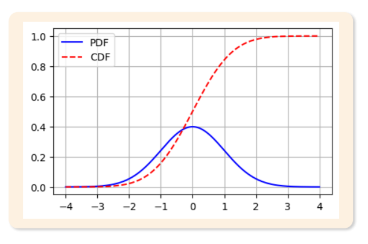
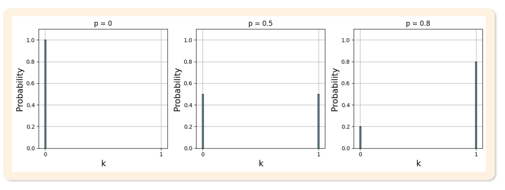
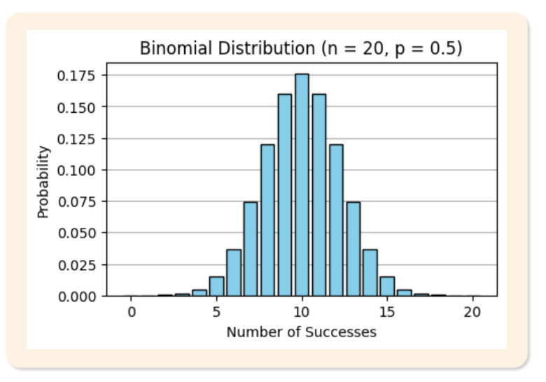

# 06. 이산확률분포

> 원본 PDF 범위: 156~179쪽 · PDF 설명 순서에 따라 재작성

## 주요 단어 먼저 보기

| 주요 단어 | 뜻 |
|---|---|
| 확률변수 | 표본공간의 결과를 숫자에 대응시키는 함수 |
| 이산확률변수 | 셀 수 있는 값만 갖는 확률변수 |
| 연속확률변수 | 어떤 구간의 실수값을 연속적으로 갖는 확률변수 |
| 확률질량함수 | 이산확률변수의 각 값에 확률을 부여 |
| 확률밀도함수 | 연속확률변수의 구간확률을 면적으로 계산하는 함수 |
| 누적분포함수 | 특정 값 이하일 확률을 누적한 함수 |
| 기댓값 | 확률을 가중치로 계산한 장기 평균 |
| 분산 | 확률변수의 퍼짐 |
| 베르누이 시행 | 결과가 둘이고 성공확률이 일정하며 서로 독립인 시행 |
| 베르누이분포 | 한 번의 성공·실패 시행 |
| 이항분포 | 독립 베르누이 시행 n번의 성공 횟수 |
| 포아송 과정 | 일정한 발생률로 독립적으로 사건이 생기는 과정 |
| 포아송분포 | 일정 구간에서 사건이 발생한 횟수 |
| 성공확률 p | 베르누이·이항분포의 성공 가능성 |
| 발생률 λ | 포아송분포의 평균 사건 수 |

> **단원 시작법:** 주요 단어의 뜻을 먼저 읽고, 아래 PDF 절 순서대로 학습한다.

<!-- TOC START -->
## 목차

- [1. 확률변수](#1-확률변수)
  - [이산형과 연속형](#이산형과-연속형)
- [2. 확률함수](#2-확률함수)
  - [확률질량함수(PMF)](#확률질량함수pmf)
  - [확률밀도함수(PDF)](#확률밀도함수pdf)
  - [누적분포함수(CDF)](#누적분포함수cdf)
- [3. 베르누이 분포](#3-베르누이-분포)
  - [베르누이 시행의 조건](#베르누이-시행의-조건)
  - [확률질량함수와 모수](#확률질량함수와-모수)
- [4. 이항분포](#4-이항분포)
- [5. 포아송분포](#5-포아송분포)
  - [포아송 과정의 가정](#포아송-과정의-가정)
  - [확률질량함수와 성질](#확률질량함수와-성질)
- [6. 교재 문제와 해설](#6-교재-문제와-해설)
  - [문제 바로가기](#문제-바로가기)
  - [문제 1. 확률변수](#문제-1-확률변수)
  - [문제 2. 확률질량함수](#문제-2-확률질량함수)
  - [문제 3. 이항분포 계산](#문제-3-이항분포-계산)
  - [문제 4. 포아송분포 계산](#문제-4-포아송분포-계산)
  - [문제 5. 포아송 과정](#문제-5-포아송-과정)
- [보충 학습](#보충-학습)
  - [분포 선택 한눈에 보기](#분포-선택-한눈에-보기)
  - [초기하분포](#초기하분포)
  - [기하분포와 음이항분포](#기하분포와-음이항분포)
  - [분포 사이의 근사](#분포-사이의-근사)
  - [체크포인트](#체크포인트)
- [시험 직전 암기](#시험-직전-암기)
<!-- TOC END -->

## 1. 확률변수

> **PDF 157~158쪽**

> **암기 한 줄:** 확률변수는 ‘무작위 결과 그 자체’가 아니라 결과를 숫자로 바꾸는 함수다.

확률변수 $X$는 표본공간 $\Omega$의 각 결과를 실수에 대응시키는 함수다.

$$
X:\Omega\rightarrow\mathbb{R}
$$

**원문 동전 예제:** 동전 두 개를 던져 앞면의 개수를 $X$라 하면

| 표본공간의 결과 $\omega$ | TT | TH | HT | HH |
|---|---:|---:|---:|---:|
| $X(\omega)$ | 0 | 1 | 1 | 2 |

이다. `TH`와 `HT`는 서로 다른 실험 결과지만 둘 다 숫자 1로 대응된다. 따라서 확률변수는 표본공간의 원소가 아니라 표본공간 위에 정의된 **함수**다.

### 이산형과 연속형

| 구분 | 값의 형태 | 예 |
|---|---|---|
| 이산확률변수 | 유한개 또는 셀 수 있는 값 | 불량품 수, 방문 고객 수, 앞면 수 |
| 연속확률변수 | 구간 안의 실수값 | 키, 몸무게, 온도, 대기시간 |

> **판정법:** 값 사이를 하나씩 셀 수 있으면 이산형, 측정 정밀도를 높일수록 소수값이 계속 생기면 연속형이다.

## 2. 확률함수

> **PDF 159~161쪽**

> **암기 한 줄:** PMF는 ‘점의 확률’, PDF는 ‘면적을 만드는 높이’, CDF는 ‘이하 누적확률’이다.

### 확률질량함수(PMF)

이산확률변수 $X$의 확률질량함수는

$$
p(x)=P(X=x)
$$

이며 다음을 만족한다.

1. $p(x)\ge0$
2. 가능한 모든 값에서 $\sum_xp(x)=1$
3. $p(x)$ 자체가 한 점의 확률이다.
4. $X$가 가질 수 없는 값에서는 $p(x)=0$이다.

기댓값과 분산은 PMF를 가중치로 계산한다.

$$
E[X]=\sum_xxp(x),\qquad
Var(X)=\sum_x(x-E[X])^2p(x)=E[X^2]-E[X]^2
$$

### 확률밀도함수(PDF)

연속확률변수의 구간확률은 밀도함수 아래의 면적이다.

$$
P(a\le X\le b)=\int_a^bf(x)\,dx
$$

밀도함수는 $f(x)\ge0$, $\int_{-\infty}^{\infty}f(x)\,dx=1$을 만족한다. $f(x)$의 높이 자체는 확률이 아니며 연속형에서는 $P(X=x)=0$이다.

### 누적분포함수(CDF)

이산형과 연속형 모두

$$
F(x)=P(X\le x)
$$

로 정의한다. $0\le F(x)\le1$이고 감소하지 않으며,

$$
\lim_{x\to-\infty}F(x)=0,\qquad
\lim_{x\to\infty}F(x)=1
$$

이다. 연속형에서는 $P(a<X\le b)=F(b)-F(a)$이고 미분 가능하면 $f(x)=F'(x)$다.

*그림: PDF는 국소적인 밀도, CDF는 왼쪽부터 누적한 확률 — 원문 슬라이드의 그래프만 잘라 수록.*

> **시험 포인트:** “특정 값 이하”는 CDF, “구간 안”은 PDF 적분 또는 CDF의 차이로 연결한다.

## 3. 베르누이 분포

> **PDF 162~164쪽**

> **암기 한 줄:** 결과가 0·1인 한 번의 시행은 베르누이, 모수는 성공확률 $p$ 하나다.

### 베르누이 시행의 조건

베르누이 시행은 다음 조건을 갖는 실험이다.

- 결과가 성공·실패처럼 서로 배타적인 두 가지다.
- 매 시행의 성공확률 $p$가 일정하다.
- 여러 번 시행할 때 각 시행은 서로 독립이다.

동전의 앞·뒤, 제품의 합격·불합격, 고객의 구매·비구매가 대표 사례다. 성공을 $X=1$, 실패를 $X=0$으로 두면 $X\sim Bernoulli(p)$다.

### 확률질량함수와 모수

$$
P(X=k)=p^k(1-p)^{1-k},\qquad k\in\{0,1\},\quad 0\le p\le1
$$

- $P(X=1)=p$
- $P(X=0)=1-p$
- $E[X]=p$
- $Var(X)=p(1-p)$

$p$가 0이면 항상 실패, 0.5이면 성공·실패가 같은 확률, 0.8이면 성공 쪽 질량이 더 크다.

*그림: 성공확률에 따른 베르누이 분포의 모양 — 원문 슬라이드에서 설명에 필요한 도해 영역만 잘라 수록.*

## 4. 이항분포

> **PDF 165~166쪽**

> **암기 한 줄:** 같은 p의 독립 베르누이 시행 n번에서 성공 횟수를 센다.

독립적인 베르누이 시행을 $n$번 반복했을 때의 성공 횟수 $X$는 이항분포를 따른다.

$$
X\sim Binomial(n,p),\qquad
P(X=k)={n\choose k}p^k(1-p)^{n-k},\quad k=0,1,\ldots,n
$$

모수는 시행 횟수 $n$과 성공확률 $p$다. 정확히 $k$번 성공하는 배열의 수가 ${n\choose k}$이고, 각 배열의 확률이 $p^k(1-p)^{n-k}$이므로 두 값을 곱한다.

$$
E[X]=np,\qquad Var(X)=np(1-p)
$$

원문에서는 $n=20$, $p=0.5$인 경우 분포가 평균 $np=10$을 중심으로 나타나는 모습을 제시한다.

*그림: 20번의 독립 시행에서 성공 횟수의 분포 — 원문 슬라이드의 그래프만 잘라 수록.*

이항분포의 조건은 시행 횟수 $n$ 고정, 각 시행의 두 결과, 시행 간 독립, 성공확률 $p$ 일정이다. 비복원추출처럼 시행이 서로 의존하거나 시간에 따라 $p$가 바뀌면 이항모형이 맞지 않을 수 있다.

> **암기법:** `고-둘-독-같` = 횟수 고정, 결과 둘, 서로 독립, p가 같음.

## 5. 포아송분포

> **PDF 167~169쪽**

> **암기 한 줄:** 일정 시간·공간의 희귀사건 횟수는 포아송, 모수 $\lambda$는 평균이자 분산이다.

### 포아송 과정의 가정

포아송분포는 일정 시간 또는 공간에서 사건이 몇 번 발생하는지 모델링한다. 원문의 포아송 과정 가정은 다음과 같다.

1. 서로 겹치지 않는 구간의 사건 수는 독립이다.
2. 같은 길이의 구간은 위치와 관계없이 같은 평균 발생률을 갖는다.
3. 아주 짧은 구간에서는 두 번 이상 발생할 확률이 매우 작다.

따라서 사건이 독립적이고 평균 발생률이 일정한 희귀사건에 적합하다.

### 확률질량함수와 성질

단위 구간당 평균 발생 횟수를 $\lambda>0$라 하면

$$
X\sim Poisson(\lambda),\qquad
P(X=k)=e^{-\lambda}\frac{\lambda^k}{k!},\quad k=0,1,2,\ldots
$$

이다.

$$
E[X]=\lambda,\qquad Var(X)=\lambda
$$

구간 길이가 $t$배이면 평균 발생 횟수도 $t\lambda$가 되어 그 구간의 사건 수는 $Poisson(t\lambda)$를 따른다.

포아송분포는 $n$이 매우 크고 $p$가 매우 작으면서 $np=\lambda$로 유지될 때 이항분포의 극한으로 얻어진다.

$$
Binomial(n,p)\ \longrightarrow\ Poisson(\lambda=np)
$$

단위시간당 결함 수, 일정 시간의 고객 도착 수, 강철 1m당 결함 수처럼 **노출 구간 안의 횟수**가 원문 예시다.

> **적합성 확인:** 실제 자료에서 분산이 평균보다 훨씬 크면 사건의 군집 또는 서로 다른 발생률을 의심하고 음이항모형 등을 검토한다.

## 6. 교재 문제와 해설

> **원문 단원 말미 문제 전체 수록**

> 먼저 문제와 보기를 풀고, **정답 및 선택지별 해설 보기**를 펼쳐 확인하세요. 일반 4지선다 문항은 ①~④를 모두 해설하며, 원문이 2지선다인 경우에는 실제 보기만 수록합니다.

### 문제 바로가기

| 문제 | 주제 | 관련 목차 | PDF |
|---:|---|---|---:|
| [1](#ch06-q1) | 확률변수 | [1. 확률변수](#1-확률변수) | 170쪽 |
| [2](#ch06-q2) | 확률질량함수 | [2. 확률함수](#2-확률함수) | 172쪽 |
| [3](#ch06-q3) | 이항분포 계산 | [4. 이항분포](#4-이항분포) | 174쪽 |
| [4](#ch06-q4) | 포아송분포 계산 | [5. 포아송분포](#5-포아송분포) | 176쪽 |
| [5](#ch06-q5) | 포아송 과정 | [5. 포아송분포](#5-포아송분포) | 178쪽 |

### 문제 1. 확률변수

**출처:** PDF 170쪽  
**관련 목차:** [1. 확률변수](#1-확률변수)

동전 2개를 동시에 던지는 실험에서 앞면이 나온 개수를 X라고 할 때, 다음 중 올바른 설명은?

1. X는 표본공간의 원소이다.
2. X=1은 확률변수이다.
3. X는 표본공간에서 실수로의 함수이다.
4. X(앞면, 뒷면)=2이다.

정답 및 선택지별 해설 보기

**정답: ③ X는 표본공간에서 실수로의 함수이다.**

- **① 오답:** 표본공간의 원소는 (앞,앞), (앞,뒤) 같은 실험 결과다. X는 각 결과를 앞면 개수 0·1·2에 대응시키는 함수다.
- **② 오답:** X가 확률변수이고 ‘X=1’은 확률변수가 값 1을 갖는 사건이다.
- **③ 정답:** 확률변수의 정의는 표본공간 Ω의 각 원소를 실수에 대응시키는 함수 X:Ω→ℝ이다.
- **④ 오답:** (앞면, 뒷면)에는 앞면이 하나뿐이므로 X(앞면,뒷면)=1이다.

### 문제 2. 확률질량함수

**출처:** PDF 172쪽  
**관련 목차:** [2. 확률함수](#2-확률함수)

이산확률변수 X의 확률질량함수 p(x)에 대한 설명 중 틀린 것은?

1. 모든 x에 대해 확률은 0 이상이다.
2. 가능한 모든 x값에 대한 확률의 합은 1이다.
3. 확률질량함수는 확률변수가 특정 값 x와 같을 확률을 나타낸다.
4. 확률질량함수는 특정 값 x 이하의 누적확률을 나타낸다.

정답 및 선택지별 해설 보기

**정답: ④ 확률질량함수는 특정 값 x 이하의 누적확률을 나타낸다.**

- **① 오답:** 정답이 아님. 확률의 비음수성 때문에 p(x)=P(X=x)≥0이다.
- **② 오답:** 정답이 아님. 가능한 값 전체의 확률질량을 합하면 1이어야 한다.
- **③ 오답:** 정답이 아님. PMF는 한 점의 확률 P(X=x)를 직접 나타낸다.
- **④ 정답:** 정답(틀린 설명). P(X≤x)처럼 특정 값 이하를 누적한 것은 누적분포함수 CDF다. PMF와 CDF를 구분해야 한다.

### 문제 3. 이항분포 계산

**출처:** PDF 174쪽  
**관련 목차:** [4. 이항분포](#4-이항분포)

불량률이 10%인 공장에서 제품 5개를 무작위로 선택했을 때 정확히 2개가 불량품일 확률은?

1. 0.0729
2. 0.0087
3. 0.2048
4. 0.3280

정답 및 선택지별 해설 보기

**정답: ① 0.0729**

- **① 정답:** X~Bin(5,0.1)이므로 P(X=2)=C(5,2)(0.1)²(0.9)³=10×0.01×0.729=0.0729다.
- **② 오답:** 조합 수 C(5,2)=10을 빠뜨리면 0.00729 수준이 된다. 어느 두 제품이 불량인지의 경우의 수를 포함해야 한다.
- **③ 오답:** 성공확률과 실패확률의 지수를 바꾸거나 다른 성공 횟수를 계산한 값이다. 정확히 2개이면 p²(1−p)³이다.
- **④ 오답:** ‘2개 이하’ 같은 누적확률과 혼동하면 안 된다. 문제는 X=2 한 경우만 묻는다.

### 문제 4. 포아송분포 계산

**출처:** PDF 176쪽  
**관련 목차:** [5. 포아송분포](#5-포아송분포)

시간당 평균 3건의 고객 문의가 들어오는 콜센터에서 특정 1시간 동안 4건의 문의가 들어올 확률은?

1. 0.1680
2. 0.2240
3. 0.1890
4. 0.1512

정답 및 선택지별 해설 보기

**정답: ① 0.1680**

- **① 정답:** X~Poisson(3)이므로 P(X=4)=e⁻³3⁴/4!≈0.1680이다.
- **② 오답:** λ=3과 x=4를 포아송 공식 e⁻λλˣ/x!에 정확히 대입하면 0.2240이 나오지 않는다.
- **③ 오답:** 평균 발생 수 λ는 4가 아니라 시간당 평균인 3이다. 관측 건수 4는 지수와 팩토리얼 자리에 들어간다.
- **④ 오답:** e⁻³×81을 24로 나눈 값은 약 0.1680이며 0.1512가 아니다.

### 문제 5. 포아송 과정

**출처:** PDF 178쪽  
**관련 목차:** [5. 포아송분포](#5-포아송분포)

포아송 과정에 대한 설명 중 틀린 것은?

1. 서로 다른 구간에서 발생하는 사건은 독립적이다.
2. 단위 구간당 평균 발생률이 일정하다.
3. 매우 짧은 구간에서는 최대 1개의 사건만 발생한다고 본다.
4. 각 시행에서 성공확률이 0.5로 고정되어 있다.

정답 및 선택지별 해설 보기

**정답: ④ 각 시행에서 성공확률이 0.5로 고정되어 있다.**

- **① 오답:** 정답이 아님. 겹치지 않는 구간의 사건 수가 서로 독립이라는 것은 포아송 과정의 핵심 가정이다.
- **② 오답:** 정답이 아님. 정상 포아송 과정에서는 단위 시간·공간당 평균 발생률 λ가 일정하다.
- **③ 오답:** 정답이 아님. 아주 짧은 구간에서 둘 이상이 동시에 발생할 확률을 무시할 수 있다고 가정한다.
- **④ 정답:** 정답(틀린 설명). 성공확률 0.5는 포아송 과정의 조건이 아니다. 포아송 과정은 고정된 발생률 λ로 희귀 사건의 횟수를 모델링한다.

## 보충 학습

> 원문 1~마지막 이론 절을 모두 학습한 뒤 보는 확장 내용이다.

### 분포 선택 한눈에 보기

| 질문 | 분포 | 핵심 모수 |
|---|---|---|
| 한 번의 성공 여부 | 베르누이 | $p$ |
| 고정된 $n$회 중 성공 횟수 | 이항 | $n,p$ |
| 시간·공간 내 사건 발생 횟수 | 포아송 | $\lambda$ |
| 비복원추출에서 성공 개수 | 초기하 | $N,K,n$ |
| 첫 성공까지 시행 횟수 | 기하 | $p$ |
| 정해진 성공 횟수까지 시행 횟수 | 음이항 | 성공 횟수와 $p$ |

### 초기하분포

유한한 모집단 $N$개 중 성공이 $K$개일 때, 복원하지 않고 $n$개를 뽑아 성공 개수 $X$를 세면

$$
P(X=k)=\frac{{K\choose k}{N-K\choose n-k}}{{N\choose n}}
$$

이다. 비복원추출에서는 한 번 뽑은 결과가 다음 추출의 성공확률을 바꾸므로 이항분포의 독립 가정과 다르다.

### 기하분포와 음이항분포

- **기하분포:** 첫 성공까지 필요한 시행 횟수이며 이산분포 중 무기억성을 갖는다.
- **음이항분포:** 정해진 성공 횟수에 도달할 때까지의 시행 횟수, 또는 평균보다 분산이 큰 카운트 자료에 사용한다.

### 분포 사이의 근사

- $n$이 크고 $p$가 작으며 $np=\lambda$이면 이항분포를 포아송분포로 근사한다.
- $np$와 $n(1-p)$가 충분히 크면 이항분포를 정규분포로 근사할 수 있다.
- 이산형을 연속형으로 근사할 때 $P(X\le k)$를 $P(Y\le k+0.5)$처럼 바꾸는 **연속성 수정**을 고려한다.

### 체크포인트

- 확률질량함수의 값 자체가 점확률이다.
- PDF의 높이는 확률이 아니며 CDF는 항상 감소하지 않는다.
- 이항분포는 $n$과 $p$, 포아송분포는 $\lambda$가 핵심 모수다.
- 포아송분포는 평균과 분산이 같다.

## 시험 직전 암기

- 확률변수는 결과를 숫자에 대응시키는 함수다.
- PMF는 한 점의 확률, PDF는 밀도, CDF는 이하 누적확률이다.
- 한 번의 성공/실패가 베르누이, 성공확률은 p다.
- 같은 p의 독립 베르누이 시행 n번에서 성공 횟수를 센다.
- 일정 구간의 희귀사건 횟수이며 평균과 분산이 모두 λ다.
