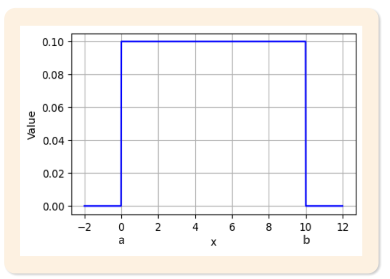
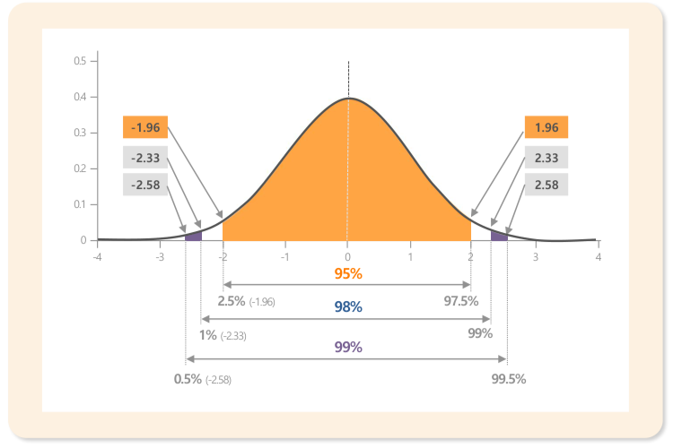
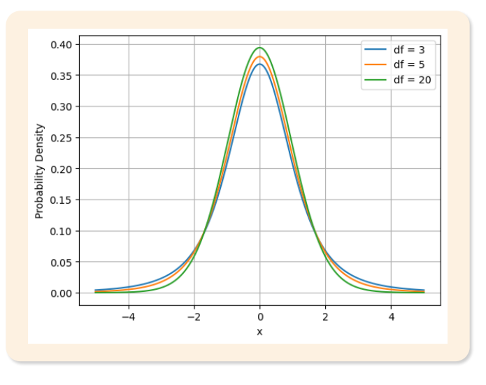
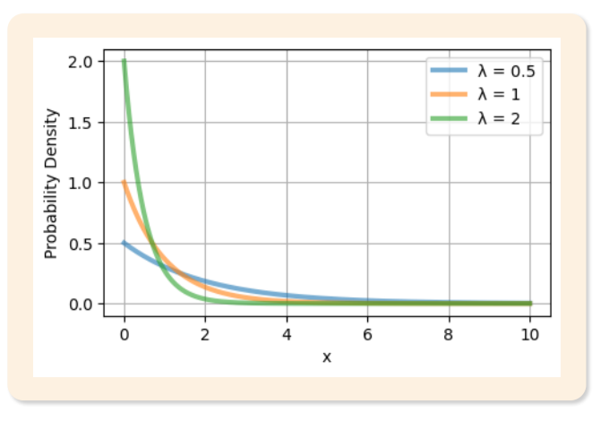
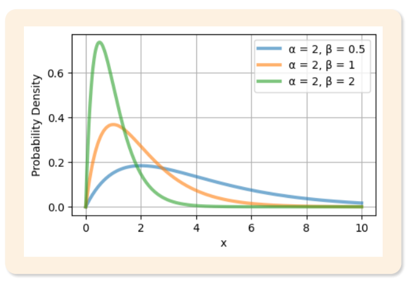
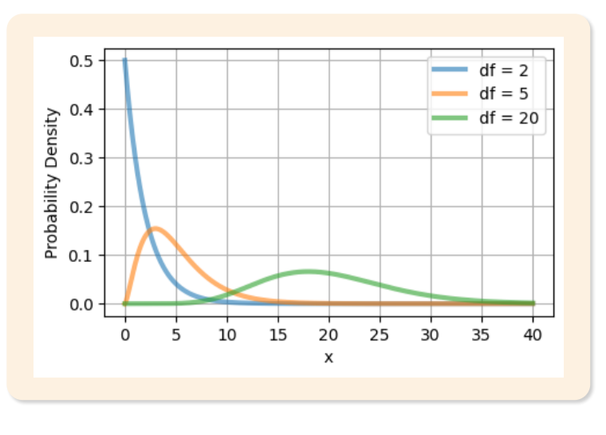

# 07. 연속확률분포

> 원본 PDF 범위: 180~203쪽 · PDF 설명 순서에 따라 재작성

## 주요 단어 먼저 보기

| 주요 단어 | 뜻 |
|---|---|
| 확률밀도함수 | 연속형 변수에서 구간확률을 면적으로 표현 |
| 누적분포함수 | 특정 값 이하일 확률 |
| 균등분포 | 구간 안의 밀도가 일정한 분포 |
| 정규분포 | 평균을 중심으로 좌우대칭인 종 모양 분포 |
| 표준정규분포 | 평균 0, 분산 1인 정규분포 |
| 임계값 | 분포의 꼬리확률을 기준으로 정한 경계값 |
| t분포 | 모표준편차를 모를 때 평균 추론에 사용하는 분포 |
| 지수분포 | 포아송 사건 사이의 대기시간 분포 |
| 무기억성 | 이미 기다린 시간이 앞으로의 대기확률에 영향을 주지 않는 성질 |
| 감마분포 | 여러 사건이 생길 때까지의 대기시간 분포 |
| 카이제곱분포 | 제곱합과 분산 추론에 연결되는 분포 |
| 자유도 | 독립적으로 변할 수 있는 정보의 수 |
| 모양모수·비율모수 | 감마분포의 모양과 시간 단위당 발생률을 정하는 모수 |

> **단원 시작법:** 주요 단어의 뜻을 먼저 읽고, 아래 PDF 절 순서대로 학습한다.

<!-- TOC START -->
## 목차

- [1. 확률함수 복습](#1-확률함수-복습)
- [2. 균등분포](#2-균등분포)
- [3. 정규분포](#3-정규분포)
- [4. t분포](#4-t분포)
- [5. 지수분포](#5-지수분포)
- [6. 감마분포](#6-감마분포)
- [7. 카이제곱분포](#7-카이제곱분포)
- [8. 교재 문제와 해설](#8-교재-문제와-해설)
  - [문제 바로가기](#문제-바로가기)
  - [문제 1. 균등분포](#문제-1-균등분포)
  - [문제 2. t분포](#문제-2-t분포)
  - [문제 3. 지수분포의 무기억성](#문제-3-지수분포의-무기억성)
  - [문제 4. 감마분포의 특수한 경우](#문제-4-감마분포의-특수한-경우)
  - [문제 5. 연속확률분포](#문제-5-연속확률분포)
- [보충 학습](#보충-학습)
  - [보강: 밀도와 확률의 차이](#보강-밀도와-확률의-차이)
  - [F-분포](#f-분포)
  - [분포 관계 한눈에 보기](#분포-관계-한눈에-보기)
  - [체크포인트](#체크포인트)
- [시험 직전 암기](#시험-직전-암기)
<!-- TOC END -->

## 1. 확률함수 복습

> **PDF 181쪽**

> **암기 한 줄:** 연속분포의 확률은 PDF의 높이가 아니라 구간 아래의 면적이다.

연속확률변수 $X$의 확률밀도함수 $f(x)$는 다음을 만족한다.

$$
f(x)\ge0,\qquad
\int_{-\infty}^{\infty}f(x)\,dx=1
$$

구간확률은 밀도 아래의 면적으로 계산한다.

$$
P(a<X\le b)=\int_a^bf(x)\,dx
$$

연속형에서는 한 점의 면적이 0이므로 $P(X=x)=0$이고, 따라서 구간 끝에 등호를 붙이는지는 확률값에 영향을 주지 않는다.

누적분포함수는

$$
F(x)=P(X\le x)=\int_{-\infty}^{x}f(t)\,dt
$$

이며 미분 가능한 경우 $F'(x)=f(x)$다.

## 2. 균등분포

> **PDF 182~183쪽**

> **암기 한 줄:** 균등분포는 $[a,b]$ 안의 높이가 모두 같고 평균은 양 끝의 정중앙이다.

$X\sim U(a,b)$이면 하한 $a$부터 상한 $b$까지 모든 같은 길이의 구간이 같은 확률을 갖는다.

$$
f(x)=
\begin{cases}
\dfrac{1}{b-a}, & a\le x\le b,\\
0, & \text{그 외}
\end{cases}
$$

직사각형의 전체 넓이가 1이어야 하므로 높이는 $1/(b-a)$다.

$$
E[X]=\frac{a+b}{2},\qquad
Var(X)=\frac{(b-a)^2}{12}
$$

*그림: $a$와 $b$ 사이에서 일정한 밀도 — 원문 슬라이드의 그래프만 잘라 수록.*

구간 $[c,d]\subseteq[a,b]$의 확률은 길이의 비율로 바로 계산할 수 있다.

$$
P(c\le X\le d)=\frac{d-c}{b-a}
$$

## 3. 정규분포

> **PDF 184~185쪽**

> **암기 한 줄:** 정규분포는 $\mu$가 중심, $\sigma$가 폭을 정하고 표준화하면 $N(0,1)$이다.

$X\sim N(\mu,\sigma^2)$의 확률밀도함수는

$$
f(x)=\frac{1}{\sigma\sqrt{2\pi}}
\exp\left[-\frac{(x-\mu)^2}{2\sigma^2}\right],qquad -\infty<x<\infty
$$

이다. 평균 $\mu$를 중심으로 좌우대칭인 종 모양이며, 분산 $\sigma^2$ 또는 표준편차 $\sigma$가 퍼짐을 정한다. 정규분포는 가우시안 분포(Gaussian distribution)라고도 한다.

$\mu=0$, $\sigma^2=1$인 분포가 표준정규분포다.

$$
Z=\frac{X-\mu}{\sigma}\sim N(0,1)
$$

표준화는 관측값이 평균에서 표준편차 몇 개만큼 떨어졌는지를 나타낸다.

*그림: 중앙 95%·98%·99%와 대응 임계값 — 원문 슬라이드의 분포 도식만 잘라 수록.*

| 중앙확률 | 양쪽 임계값 | 한쪽 꼬리확률 |
|---:|---:|---:|
| 95% | $\pm1.96$ | 2.5% |
| 98% | $\pm2.33$ | 1% |
| 99% | $\pm2.58$ | 0.5% |

또한 빠른 근사로 평균 $\pm1\sigma$, $\pm2\sigma$, $\pm3\sigma$ 안에 각각 약 68%, 95%, 99.7%가 들어가는 경험법칙을 사용한다. 정확한 95% 임계값은 2가 아니라 1.96이다.

## 4. t분포

> **PDF 186~187쪽**

> **암기 한 줄:** 작은 표본에서 모표준편차를 모르면 t, 자유도가 커지면 표준정규에 가까워진다.

t분포는 작은 표본으로 모평균을 추정하면서 모표준편차 $\sigma$를 몰라 표본표준편차 $S$로 대신할 때 나타난다.

$$
T=\frac{\bar X-\mu}{S/\sqrt n}
$$

자유도 $\nu$인 t분포의 밀도는

$$
f(t)=
\frac{\Gamma\left(\frac{\nu+1}{2}\right)}
{\sqrt{\nu\pi}\,\Gamma\left(\frac{\nu}{2}\right)}
\left(1+\frac{t^2}{\nu}\right)^{-\frac{\nu+1}{2}}
$$

이다. 자유도는 독립적으로 변할 수 있는 정보의 수이며, 한 표본 평균 문제에서는 보통 $\nu=n-1$이다.

- 0을 중심으로 좌우대칭이다.
- 표준정규분포보다 꼬리가 두꺼워 $\sigma$를 추정한 불확실성을 반영한다.
- 자유도가 커질수록 꼬리가 얇아지고 표준정규분포에 가까워진다.

*그림: 자유도 3·5·20의 t분포 — 원문 슬라이드의 그래프만 잘라 수록.*

## 5. 지수분포

> **PDF 188~189쪽**

> **암기 한 줄:** 포아송 과정의 첫 사건까지 기다리는 시간은 지수분포이며 무기억성을 갖는다.

지수분포는 포아송 과정에서 다음 사건, 즉 첫 사건이 발생할 때까지의 대기시간을 나타낸다. $\lambda>0$는 단위시간당 평균 사건 발생률이다.

$$
f(x)=
\begin{cases}
\lambda e^{-\lambda x}, & x\ge0,\\
0, & x<0
\end{cases}
$$

누적분포함수와 생존함수는 각각

$$
F(x)=1-e^{-\lambda x},\qquad P(X>x)=e^{-\lambda x}
$$

이다.

$$
E[X]=\frac{1}{\lambda},\qquad Var(X)=\frac{1}{\lambda^2}
$$

발생률 $\lambda$가 클수록 사건이 자주 생기므로 평균 대기시간은 짧아진다.

*그림: $\lambda=0.5,1,2$일 때 지수분포 — 원문 슬라이드의 그래프만 잘라 수록.*

지수분포의 핵심 성질은 **무기억성**이다.

$$
P(X>s+t\mid X>s)=P(X>t)
$$

이미 $s$만큼 기다렸다는 정보가 앞으로 $t$만큼 더 기다릴 확률을 바꾸지 않는다.

> **시험 연결:** 포아송분포는 구간의 **발생 횟수**, 지수분포는 사건 사이의 **대기시간**이다.

## 6. 감마분포

> **PDF 190~191쪽**

> **암기 한 줄:** 첫 사건은 지수, 여러 번째 사건까지의 총 대기시간은 감마다.

감마분포는 지수분포를 일반화해 포아송 과정에서 여러 번째 사건이 발생할 때까지의 총 대기시간을 모델링한다. 모양모수 $\alpha>0$와 비율모수 $\beta>0$를 쓰면

$$
f(x)=
\frac{\beta^\alpha}{\Gamma(\alpha)}x^{\alpha-1}e^{-\beta x},
\qquad x>0
$$

여기서 감마함수는

$$
\Gamma(\alpha)=\int_0^\infty t^{\alpha-1}e^{-t}\,dt
$$

이고 양의 정수 $n$에 대해 $\Gamma(n)=(n-1)!$다.

$$
E[X]=\frac{\alpha}{\beta},\qquad
Var(X)=\frac{\alpha}{\beta^2}
$$

- $\alpha$: 모양을 정하는 모수이며 사건 순서와 연결된다.
- $\beta$: 단위시간당 비율을 정하는 모수다.
- $\alpha$가 커질수록 오른쪽 치우침이 줄고 정규분포와 비슷한 모양이 된다.
- 문헌에 따라 비율 대신 척도 $\theta=1/\beta$를 사용하므로 모수화를 확인한다.

*그림: $\alpha=2$에서 $\beta$가 달라질 때 감마분포 — 원문 슬라이드의 그래프만 잘라 수록.*

특수한 경우는 다음과 같다.

- $\alpha=1$이면 지수분포다.
- $\alpha=\nu/2$, $\beta=1/2$이면 자유도 $\nu$인 카이제곱분포다.

## 7. 카이제곱분포

> **PDF 192~193쪽**

> **암기 한 줄:** 독립 표준정규변수의 제곱합은 카이제곱이며 값은 항상 0 이상이다.

서로 독립인 표준정규변수 $Z_1,\ldots,Z_\nu$의 제곱합은 자유도 $\nu$인 카이제곱분포를 따른다.

$$
\chi^2_\nu=\sum_{i=1}^{\nu}Z_i^2
$$

밀도함수는

$$
f(x)=
\frac{1}{2^{\nu/2}\Gamma(\nu/2)}
x^{\nu/2-1}e^{-x/2},\qquad x>0
$$

이다. 감마분포에서 $\alpha=\nu/2$, $\beta=1/2$인 특수한 경우다.

$$
E[X]=\nu,\qquad Var(X)=2\nu
$$

제곱합이므로 0보다 작을 수 없고 자유도가 작을 때는 오른쪽으로 치우친다. 자유도가 커지면 평균 $\nu$ 주변으로 이동하면서 상대적인 치우침이 줄고 정규분포에 가까워진다.

*그림: 자유도에 따라 달라지는 카이제곱분포의 모양 — 원문 슬라이드에서 설명에 필요한 도해 영역만 잘라 수록.*

카이제곱분포는 모분산 추론, 적합도검정, 범주형 변수의 독립성검정에 연결된다.

## 8. 교재 문제와 해설

> **원문 단원 말미 문제 전체 수록**

> 먼저 문제와 보기를 풀고, **정답 및 선택지별 해설 보기**를 펼쳐 확인하세요. 일반 4지선다 문항은 ①~④를 모두 해설하며, 원문이 2지선다인 경우에는 실제 보기만 수록합니다.

### 문제 바로가기

| 문제 | 주제 | 관련 목차 | PDF |
|---:|---|---|---:|
| [1](#ch07-q1) | 균등분포 | [2. 균등분포](#2-균등분포) | 194쪽 |
| [2](#ch07-q2) | t분포 | [4. t분포](#4-t분포) | 196쪽 |
| [3](#ch07-q3) | 지수분포의 무기억성 | [5. 지수분포](#5-지수분포) | 198쪽 |
| [4](#ch07-q4) | 감마분포의 특수한 경우 | [6. 감마분포](#6-감마분포) · [7. 카이제곱분포](#7-카이제곱분포) | 200쪽 |
| [5](#ch07-q5) | 연속확률분포 | [1. 확률함수 복습](#1-확률함수-복습) | 202쪽 |

### 문제 1. 균등분포

**출처:** PDF 194쪽  
**관련 목차:** [2. 균등분포](#2-균등분포)

균등분포 U(2,8)에 대한 설명 중 옳지 않은 것은?

1. 구간 [2,8] 내의 모든 점에서 동일한 확률밀도를 갖는다.
2. 기댓값은 5이다.
3. 확률밀도함수의 값은 1/8이다.
4. 누적분포함수는 구간 [2,8]에서 선형적으로 증가한다.

정답 및 선택지별 해설 보기

**정답: ③ 확률밀도함수의 값은 1/8이다.**

- **① 오답:** 정답이 아님. 연속균등분포는 지지구간 전체에서 일정한 밀도 1/(b−a)를 가진다.
- **② 오답:** 정답이 아님. E[X]=(a+b)/2=(2+8)/2=5이다.
- **③ 정답:** 정답(옳지 않은 설명). 밀도는 1/(8−2)=1/6이다. 상한 8 자체로 나누지 않는다.
- **④ 오답:** 정답이 아님. 2≤x≤8에서 F(x)=(x−2)/6이므로 직선으로 증가한다.

### 문제 2. t분포

**출처:** PDF 196쪽  
**관련 목차:** [4. t분포](#4-t분포)

t분포에 대한 설명 중 틀린 것은?

1. 자유도가 증가할수록 표준정규분포에 가까워진다.
2. 표준정규분포보다 두꺼운 꼬리를 갖는다.
3. 0을 중심으로 대칭인 분포이다.
4. 자유도가 1일 때 표준정규분포와 같아진다.

정답 및 선택지별 해설 보기

**정답: ④ 자유도가 1일 때 표준정규분포와 같아진다.**

- **① 오답:** 정답이 아님. 자유도가 커지면 모분산 추정의 불확실성이 줄어 t분포가 표준정규분포로 수렴한다.
- **② 오답:** 정답이 아님. 유한 자유도의 t분포는 표준정규분포보다 꼬리가 두꺼워 극단값 확률이 더 크다.
- **③ 오답:** 정답이 아님. t분포는 평균 0을 기준으로 좌우 대칭이다.
- **④ 정답:** 정답(틀린 설명). 자유도 1의 t분포는 코시분포로 꼬리가 매우 두껍다. 표준정규분포와 같아지는 것은 자유도가 무한히 커질 때다.

### 문제 3. 지수분포의 무기억성

**출처:** PDF 198쪽  
**관련 목차:** [5. 지수분포](#5-지수분포)

지수분포의 무기억성에 대한 설명으로 옳은 것은?

1. 과거의 정보가 미래 예측에 도움이 된다.
2. 경과 시간은 앞으로 사건이 발생할 때까지의 대기시간에 영향을 미치지 않는다.
3. 시간이 지날수록 사건 발생확률이 증가한다.
4. 무기억성을 갖는 연속확률분포는 기하분포뿐이다.

정답 및 선택지별 해설 보기

**정답: ② 경과 시간은 앞으로 사건이 발생할 때까지의 대기시간에 영향을 미치지 않는다.**

- **① 오답:** 무기억성은 이미 기다린 시간이 앞으로의 잔여 대기시간 분포를 바꾸지 않는다는 뜻이다.
- **② 정답:** P(X>s+t|X>s)=P(X>t)로, s만큼 기다렸다는 정보가 추가 대기시간에 영향을 주지 않는다.
- **③ 오답:** 지수분포의 위험률은 λ로 일정하다. 시간이 지났다고 순간 발생률이 커지지 않는다.
- **④ 오답:** 기하분포는 이산형 무기억 분포이고, 연속형에서 무기억성을 갖는 대표 분포는 지수분포다.

### 문제 4. 감마분포의 특수한 경우

**출처:** PDF 200쪽  
**관련 목차:** [6. 감마분포](#6-감마분포) · [7. 카이제곱분포](#7-카이제곱분포)

감마분포 Gamma(α,β)가 다른 분포가 되는 경우에 대한 설명으로 틀린 것은?

1. α=1일 때 지수분포가 된다.
2. α=ν/2, β=1/2일 때 자유도 ν인 카이제곱분포가 된다.
3. α가 무한대로 갈 때 정규분포에 근사한다.
4. α=0일 때 균등분포가 된다.

정답 및 선택지별 해설 보기

**정답: ④ α=0일 때 균등분포가 된다.**

- **① 오답:** 정답이 아님. 형상모수 α=1인 감마분포는 지수분포라는 특수한 형태가 된다.
- **② 오답:** 정답이 아님. 교재의 β를 율(rate)로 두는 모수화에서 Gamma(ν/2,1/2)는 χ²(ν)와 같다.
- **③ 오답:** 정답이 아님. 형상모수가 충분히 커지면 감마분포는 중심극한 효과로 정규분포에 가까워진다.
- **④ 정답:** 정답(틀린 설명). 감마분포는 α>0이어야 하므로 α=0은 허용되지 않으며 균등분포가 되지도 않는다.

### 문제 5. 연속확률분포

**출처:** PDF 202쪽  
**관련 목차:** [1. 확률함수 복습](#1-확률함수-복습)

연속확률분포에 대한 설명으로 옳지 않은 것은?

1. 확률밀도함수의 값 자체가 확률을 나타낸다.
2. 확률밀도함수의 전체 구간 적분값은 1이다.
3. 누적분포함수는 단조증가하는 함수이다.
4. 특정한 한 점에서의 확률은 0이다.

정답 및 선택지별 해설 보기

**정답: ① 확률밀도함수의 값 자체가 확률을 나타낸다.**

- **① 정답:** 정답(옳지 않은 설명). f(x)는 밀도이지 점확률이 아니다. 연속형 확률은 P(a≤X≤b)=∫ₐᵇf(x)dx처럼 구간의 면적으로 계산한다.
- **② 오답:** 정답이 아님. 유효한 확률밀도함수는 전체 실수 구간의 적분이 1이어야 한다.
- **③ 오답:** 정답이 아님. F(x)=P(X≤x)는 x가 커질수록 감소할 수 없는 비감소 함수다.
- **④ 오답:** 정답이 아님. 연속분포에서는 P(X=x)=0이지만, 폭이 있는 구간은 양의 확률을 가질 수 있다.

## 보충 학습

> 원문 1~마지막 이론 절을 모두 학습한 뒤 보는 확장 내용이다.

### 보강: 밀도와 확률의 차이

연속형 변수에서 한 점의 확률은 $P(X=x)=0$이다. 밀도 $f(x)$는 1보다 클 수도 있지만 면적의 총합은 반드시 1이다.

예를 들어 $U(0,0.5)$의 밀도 높이는 2지만 전체 면적은 $2\times0.5=1$이다. 따라서 “밀도는 항상 1 이하”라는 문장은 틀리다.

### F-분포

서로 독립인 카이제곱변수 $U\sim\chi^2_{d_1}$, $V\sim\chi^2_{d_2}$를 각각의 자유도로 나눈 비는 F분포를 따른다.

$$
F=\frac{U/d_1}{V/d_2}
$$

F분포는 0 이상이고 오른쪽으로 치우친다. 두 분산의 비교, 분산분석(ANOVA), 회귀모형 전체의 유의성 검정에 사용한다.

### 분포 관계 한눈에 보기

| 분포 | 대표 용도 | 연결 관계 |
|---|---|---|
| 지수 | 첫 사건까지 대기시간 | 감마의 $\alpha=1$ 특수형 |
| 감마 | 여러 사건까지 대기시간 | 카이제곱의 일반형 |
| 카이제곱 | 분산 추론 | 표준정규 제곱합 |
| t | 평균 추론 | 정규/카이제곱의 결합 |
| F | 분산비·ANOVA | 카이제곱 두 개의 비 |

### 체크포인트

- 구간 확률은 CDF의 차이 $F(b)-F(a)$다.
- $N(0,1)$의 1은 표준편차가 아니라 분산 표기이지만 둘 다 1이다.
- t분포와 카이제곱분포의 모양은 자유도에 따라 달라진다.
- 감마분포의 $\beta$가 비율인지 척도인지 반드시 확인한다.
- 정규화(normalization)와 정규분포(normal distribution)를 혼동하지 않는다.

## 시험 직전 암기

- 연속분포의 확률은 PDF 높이가 아니라 구간 아래 면적이다.
- 구간 안의 밀도가 일정하고 평균은 양 끝의 중간이다.
- μ가 중심, σ가 폭을 정하며 표준화하면 N(0,1)이다.
- 모표준편차를 모를 때 쓰며 자유도가 커지면 정규분포에 가까워진다.
- 포아송 사건 사이 대기시간이며 무기억성을 가진다.
- 여러 포아송 사건이 생길 때까지의 대기시간으로 지수분포를 확장한다.
- 카이제곱은 분산, F는 두 분산의 비에 연결된다.
