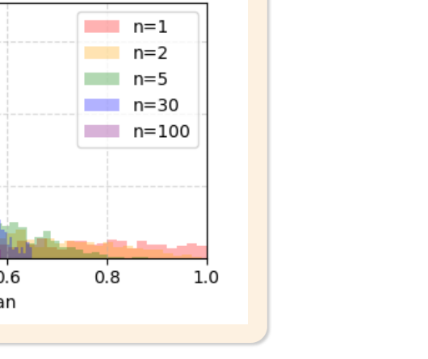

# 08. 추론통계

> 원본 PDF 범위: 204~229쪽 · PDF 설명 순서에 따라 재작성

## 주요 단어 먼저 보기

| 주요 단어 | 뜻 |
|---|---|
| 추론통계 | 표본으로 모집단의 특성을 판단 |
| 추정 | 알 수 없는 모수를 표본으로 계산 |
| 중심극한정리 | 표본크기가 커지면 표본평균 분포가 정규분포에 가까워짐 |
| 표본분포 | 통계량을 반복 계산했을 때의 분포 |
| 점추정 | 모수를 하나의 값으로 추정 |
| 구간추정 | 모수가 있을 것으로 기대되는 범위를 추정 |
| 신뢰수준 | 반복 표집에서 구간이 모수를 포함하는 장기 비율 |
| 표준오차 | 통계량 표본분포의 표준편차 |
| 오차한계 | 추정값 주변에 더하고 빼는 불확실성 범위 |

> **단원 시작법:** 주요 단어의 뜻을 먼저 읽고, 아래 PDF 절 순서대로 학습한다.

<!-- TOC START -->
## 목차

- [1. 추론통계 개요](#1-추론통계-개요)
- [2. 추정](#2-추정)
- [3. 중심극한정리](#3-중심극한정리)
  - [표본분포와 중심극한정리](#표본분포와-중심극한정리)
- [4. 표본분포](#4-표본분포)
  - [평균·비율·분산의 표본분포](#평균비율분산의-표본분포)
- [5. 점추정](#5-점추정)
  - [점추정과 구간추정](#점추정과-구간추정)
- [6. 구간추정](#6-구간추정)
- [7. 교재 문제와 해설](#7-교재-문제와-해설)
  - [문제 바로가기](#문제-바로가기)
  - [문제 1. 추론통계의 목적](#문제-1-추론통계의-목적)
  - [문제 2. 중심극한정리](#문제-2-중심극한정리)
  - [문제 3. 표준오차](#문제-3-표준오차)
  - [문제 4. 점추정](#문제-4-점추정)
  - [문제 5. 모평균 신뢰구간](#문제-5-모평균-신뢰구간)
- [보충 학습](#보충-학습)
  - [가설검정](#가설검정)
  - [대표 검정 선택](#대표-검정-선택)
  - [다중검정](#다중검정)
  - [효과크기](#효과크기)
  - [보강: 자주 하는 오해](#보강-자주-하는-오해)
  - [체크포인트](#체크포인트)
- [시험 직전 암기](#시험-직전-암기)
<!-- TOC END -->

## 1. 추론통계 개요

> **PDF 205~207쪽**

> **암기 한 줄:** 표본의 불확실성을 수치화해 모집단의 모수에 대해 판단한다.

추론통계는 표본으로 모집단의 특성을 추정하거나 가설을 검정한다. 전수조사가 비용·시간·물리적으로 어렵기 때문에 필요하며, 결론에는 항상 표본추출에서 생기는 불확실성이 따른다. 기술통계가 “관측된 데이터가 어떠한가”를 묻는다면 추론통계는 “이 표본을 근거로 모집단에 무엇을 말할 수 있는가”를 묻는다.

## 2. 추정

> **PDF 208~209쪽**

> **암기 한 줄:** 하나의 값이면 점추정, 범위와 신뢰수준을 제시하면 구간추정이다.

추정량(estimator)은 표본으로 모수를 계산하는 규칙이고, 추정값(estimate)은 실제 표본을 넣어 얻은 숫자다. 예를 들어 $\bar X$는 모평균 $\mu$의 추정량이고 이번 표본에서 계산된 52.3은 추정값이다.

좋은 추정량은 반복 표본에서 평균적으로 참값을 맞추는 불편성, 표본이 커질수록 참값에 가까워지는 일치성, 같은 조건에서 분산이 작은 효율성을 살핀다.

## 3. 중심극한정리

> **PDF 210~211쪽**

> **암기 한 줄:** 표본이 충분히 크면 표본평균의 분포가 정규분포에 가까워진다.

### 표본분포와 중심극한정리

표본평균의 기대값과 표준오차는 다음과 같다.

$$
E[\bar X]=\mu,\qquad SE(\bar X)=\frac{\sigma}{\sqrt n}
$$

표본 크기가 충분히 크면 원자료의 분포와 관계없이 표본평균의 분포가 정규분포에 가까워진다. 이것이 중심극한정리다.

*그림: 표본크기가 커질수록 표본평균 분포가 정규분포에 가까워지는 모습 — 원문 슬라이드에서 설명에 필요한 도해 영역만 잘라 수록.*

## 4. 표본분포

> **PDF 212~213쪽**

> **암기 한 줄:** 표본분포는 원자료가 아니라 통계량을 반복 계산한 분포다.

### 평균·비율·분산의 표본분포

- 정규 모집단의 평균: 모분산을 알면 z, 모르면 t 통계량
- 표본비율: 표본이 충분히 크면 정규근사
- 정규 모집단의 표본분산: 카이제곱분포
- 두 분산의 비: F-분포

표본분포를 선택할 때는 목표 모수, 표본 독립성, 정규성, 표본 크기를 함께 확인한다.

## 5. 점추정

> **PDF 214~216쪽**

> **암기 한 줄:** 좋은 추정량은 불편성·일치성·효율성을 살핀다.

### 점추정과 구간추정

- 점추정: 하나의 통계량으로 모수를 추정
- 구간추정: 신뢰수준을 갖는 범위로 모수를 추정

좋은 추정량의 성질은 불편성, 일치성, 효율성, 충분성이다.

모분산을 알고 있을 때 평균의 신뢰구간:

$$
\bar x\pm z_{\alpha/2}\frac{\sigma}{\sqrt n}
$$

모분산을 모르고 표본이 작다면 t-분포를 사용한다.

$$
\bar x\pm t_{\alpha/2,n-1}\frac{s}{\sqrt n}
$$

## 6. 구간추정

> **PDF 217~219쪽**

> **암기 한 줄:** 추정치 ± 임계값×표준오차 구조를 먼저 외운다.

모표준편차 $\sigma$를 알고 모평균을 추정하는 대표식은

$$\bar x\pm z_{\alpha/2}\frac{\sigma}{\sqrt n}$$

이다. 모표준편차를 모르고 표본이 작다면 일반적으로 $s$와 t분포 임계값을 사용한다. 신뢰수준을 높이면 임계값이 커져 구간이 넓어지고, 표본 크기를 늘리면 표준오차가 작아져 구간이 좁아진다.

> **정확한 해석:** 95% 신뢰구간 하나에 모수가 들어갈 확률이 95%라는 뜻이 아니다. 같은 절차를 반복했을 때 만들어진 구간의 약 95%가 참 모수를 포함한다는 장기적 성질이다.

## 7. 교재 문제와 해설

> **원문 단원 말미 문제 전체 수록**

> 먼저 문제와 보기를 풀고, **정답 및 선택지별 해설 보기**를 펼쳐 확인하세요. 일반 4지선다 문항은 ①~④를 모두 해설하며, 원문이 2지선다인 경우에는 실제 보기만 수록합니다.

### 문제 바로가기

| 문제 | 주제 | 관련 목차 | PDF |
|---:|---|---|---:|
| [1](#ch08-q1) | 추론통계의 목적 | [1. 추론통계 개요](#1-추론통계-개요) | 220쪽 |
| [2](#ch08-q2) | 중심극한정리 | [3. 중심극한정리](#3-중심극한정리) | 222쪽 |
| [3](#ch08-q3) | 표준오차 | [4. 표본분포](#4-표본분포) | 224쪽 |
| [4](#ch08-q4) | 점추정 | [5. 점추정](#5-점추정) · [6. 구간추정](#6-구간추정) | 226쪽 |
| [5](#ch08-q5) | 모평균 신뢰구간 | [6. 구간추정](#6-구간추정) | 228쪽 |

### 문제 1. 추론통계의 목적

**출처:** PDF 220쪽  
**관련 목차:** [1. 추론통계 개요](#1-추론통계-개요)

추론통계학에 대한 설명으로 가장 적절하지 않은 것은?

1. 표본으로부터 모집단의 특성을 추정하거나 가설을 검정하는 통계학 분야이다.
2. 모집단 전체 조사가 비용·시간·물리적으로 어려울 때 필요하다.
3. 수집된 데이터의 특성과 분포를 파악하여 데이터를 요약하는 것이 주목적이다.
4. 불확실성 아래에서 합리적 의사결정을 위한 통계적 근거를 제공한다.

정답 및 선택지별 해설 보기

**정답: ③ 수집된 데이터의 특성과 분포를 파악하여 데이터를 요약하는 것이 주목적이다.**

- **① 오답:** 정답이 아님. 표본 통계량으로 모수를 추정하고 모집단에 대한 가설을 검정하는 것이 추론통계다.
- **② 오답:** 정답이 아님. 전수조사가 어려울 때 대표 표본을 사용해 모집단을 추론한다.
- **③ 정답:** 정답(적절하지 않은 설명). 관측 데이터를 표·그래프·요약통계로 정리하는 것은 기술통계의 주목적이다.
- **④ 오답:** 정답이 아님. 추론에는 표본오차가 있으므로 불확실성을 확률로 표현해 의사결정을 돕는다.

### 문제 2. 중심극한정리

**출처:** PDF 222쪽  
**관련 목차:** [3. 중심극한정리](#3-중심극한정리)

중심극한정리에 대한 설명으로 옳은 것은?

1. 모집단이 정규분포만 따를 때 적용할 수 있다.
2. 표본 크기가 충분히 크면 표본평균의 분포는 근사적으로 정규분포를 따른다.
3. 표본은 서로 독립일 필요가 없으며 동일한 분포에서 추출되지 않아도 된다.
4. 일반적으로 표본 크기가 10 이상이면 항상 적용할 수 있다.

정답 및 선택지별 해설 보기

**정답: ② 표본 크기가 충분히 크면 표본평균의 분포는 근사적으로 정규분포를 따른다.**

- **① 오답:** 모집단이 비정규여도 분산이 유한하고 조건이 맞으면 표본 크기가 커질수록 표본평균 분포가 정규에 근사한다.
- **② 정답:** 중심극한정리는 원자료 분포와 별개로 충분히 큰 n에서 표본평균의 표본분포가 정규분포에 가까워짐을 말한다.
- **③ 오답:** 고전적 중심극한정리는 독립·동일분포 같은 조건을 전제로 한다. 의존성이 있으면 별도의 조건이 필요하다.
- **④ 오답:** n≥30은 흔한 경험칙일 뿐 절대 기준이 아니다. 왜도가 크거나 꼬리가 두꺼우면 더 큰 표본이 필요하다.

### 문제 3. 표준오차

**출처:** PDF 224쪽  
**관련 목차:** [4. 표본분포](#4-표본분포)

표본분포의 표준편차인 표준오차(Standard Error)에 대한 설명으로 가장 적절한 것은?

1. 개별 관측값들의 산포 정도를 나타내는 지표이다.
2. 통계량들의 산포를 나타내며 추정의 정확도를 측정하는 중요한 지표이다.
3. 표본 크기가 증가할수록 표준오차는 증가한다.
4. 모집단의 변동성과 무관하게 결정된다.

정답 및 선택지별 해설 보기

**정답: ② 통계량들의 산포를 나타내며 추정의 정확도를 측정하는 중요한 지표이다.**

- **① 오답:** 개별 관측값의 산포는 표준편차가 나타낸다. 표준오차는 반복 표본에서 통계량이 얼마나 흔들리는지 나타낸다.
- **② 정답:** 표준오차가 작을수록 표본 통계량의 표본 간 변동이 작아 모수 추정이 더 정밀하다.
- **③ 오답:** 평균의 표준오차는 σ/√n이므로 다른 조건이 같으면 n이 커질수록 감소한다.
- **④ 오답:** 표준오차는 모집단 표준편차 σ에 비례하므로 모집단 변동성이 클수록 커진다.

### 문제 4. 점추정

**출처:** PDF 226쪽  
**관련 목차:** [5. 점추정](#5-점추정) · [6. 구간추정](#6-구간추정)

점추정의 특징으로 옳지 않은 것은?

1. 추정한 모수를 하나의 숫자로 표현한다.
2. 표본이 달라지면 추정값도 변한다.
3. 모집단의 미지 모수를 단일 값으로 추정하는 방법이다.
4. 추정의 불확실성을 직접적으로 나타낸다.

정답 및 선택지별 해설 보기

**정답: ④ 추정의 불확실성을 직접적으로 나타낸다.**

- **① 오답:** 정답이 아님. 점추정은 x̄처럼 모수에 대한 대표값 하나를 제시한다.
- **② 오답:** 정답이 아님. 표본이 바뀌면 표본평균 같은 통계량도 달라져 점추정값이 변한다.
- **③ 오답:** 정답이 아님. 단일 수치로 미지 모수를 추정한다는 것이 점추정의 정의다.
- **④ 정답:** 정답(옳지 않은 설명). 한 숫자만으로는 오차 범위와 신뢰도를 알 수 없다. 불확실성은 신뢰구간 같은 구간추정으로 표현한다.

### 문제 5. 모평균 신뢰구간

**출처:** PDF 228쪽  
**관련 목차:** [6. 구간추정](#6-구간추정)

표본 크기 36, 표본평균 50g, 모표준편차 6g일 때 모평균 무게의 95% 신뢰구간은? (단, z₀.₀₂₅=1.96)

1. [48.04, 51.96]
2. [49.02, 50.98]
3. [47.08, 52.92]
4. [46.12, 53.88]

정답 및 선택지별 해설 보기

**정답: ① [48.04, 51.96]**

- **① 정답:** 표준오차=6/√36=1, 오차한계=1.96×1=1.96이므로 50±1.96=[48.04,51.96]이다.
- **② 오답:** ±0.98은 1.96에 표준오차 1을 다시 절반으로 줄인 값이다. 95% 양측구간의 임계값은 이미 1.96이다.
- **③ 오답:** ±2.92는 주어진 표준오차와 z값의 곱이 아니다. 먼저 σ/√n=1을 계산해야 한다.
- **④ 오답:** ±3.88은 1.96을 두 번 반영한 폭이다. 신뢰구간은 x̄±zσ/√n을 한 번 적용한다.

## 보충 학습

> 원문 1~마지막 이론 절을 모두 학습한 뒤 보는 확장 내용이다.

### 가설검정

1. 귀무가설과 대립가설을 세운다.
2. 유의수준 $\alpha$를 정한다.
3. 검정통계량과 p-value를 계산한다.
4. p-value가 $\alpha$보다 작으면 귀무가설을 기각한다.

- 1종 오류: 참인 귀무가설을 기각, 확률 $\alpha$
- 2종 오류: 거짓인 귀무가설을 기각하지 못함, 확률 $\beta$
- 검정력: $1-\beta$

### 대표 검정 선택

| 질문 | 독립 표본 | 대응·반복 표본 |
|---|---|---|
| 두 평균 비교 | 독립표본 t-test, Welch t-test | 대응표본 t-test |
| 세 집단 이상 평균 비교 | 일원 ANOVA | 반복측정 ANOVA |
| 두 범주형 변수 관계 | 카이제곱 독립성검정 | McNemar 검정 |
| 비정규 위치 비교 | Mann–Whitney U | Wilcoxon signed-rank |

등분산이 확실하지 않은 두 평균 비교에는 기본 Student t-test보다 Welch t-test가 안전한 선택인 경우가 많다.

### 다중검정

가설을 많이 검정하면 우연한 유의 결과가 늘어난다. 가족오류율을 제어하려면 Bonferroni·Holm 보정, 탐색적 대규모 검정에서는 FDR을 제어하는 Benjamini–Hochberg 방법을 고려한다.

### 효과크기

p-value만으로 차이의 크기를 알 수 없다. 평균 차이, 표준화 평균차이(Cohen's d), 오즈비, 상관계수와 신뢰구간을 함께 보고한다.

### 보강: 자주 하는 오해

- 95% 신뢰구간은 계산된 특정 구간에 모수가 들어갈 확률이 95%라는 뜻이 아니다. 같은 절차를 반복할 때 구간의 95%가 참 모수를 포함한다는 빈도주의적 의미다.
- p-value는 귀무가설이 참일 확률이 아니다.
- 통계적 유의성과 실무적 중요성은 다르므로 효과크기와 신뢰구간을 함께 본다.

### 체크포인트

- 표본 크기가 커지면 표준오차는 $1/\sqrt n$ 비율로 감소한다.
- 신뢰수준이 높아지면 신뢰구간은 넓어진다.
- 양측 95% 신뢰구간은 각 꼬리에 2.5%를 둔다.

## 시험 직전 암기

- 표본의 불확실성을 수치화해 모집단의 모수에 대해 판단한다.
- 하나의 값이면 점추정, 범위와 신뢰수준을 제시하면 구간추정이다.
- 표본이 충분히 크면 표본평균의 분포가 정규분포에 가까워진다.
- 표본분포는 원자료가 아니라 통계량을 반복 계산한 분포다.
- 좋은 추정량은 불편성·일치성·효율성을 살핀다.
- 추정치 ± 임계값×표준오차 구조를 먼저 외운다.
