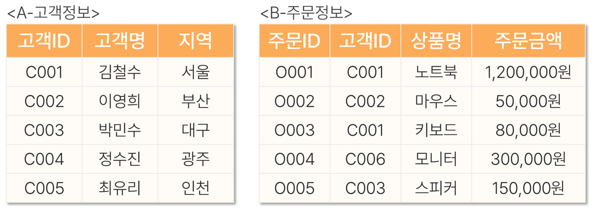
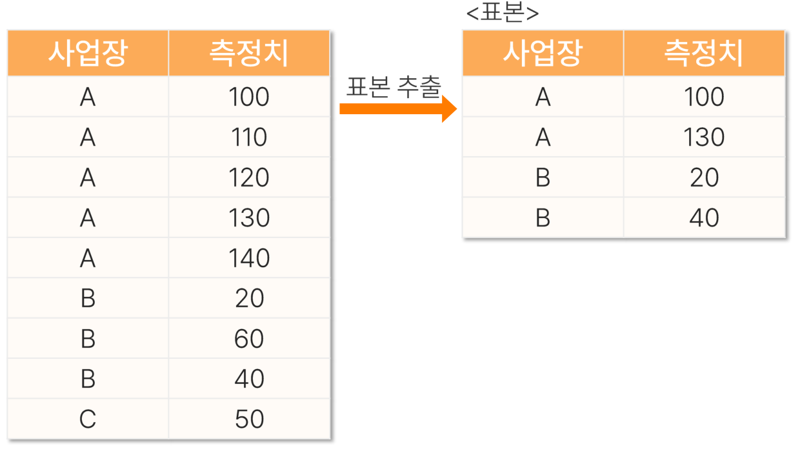

# 09. 데이터처리1

> 원본 PDF 범위: 230~260쪽 · PDF 설명 순서에 따라 재작성

## 주요 단어 먼저 보기

| 주요 단어 | 뜻 |
|---|---|
| 데이터 품질 | 분석 결과의 신뢰성을 결정하는 데이터 상태 |
| 결측치 | 값이 있어야 할 자리가 비어 있는 데이터 |
| 이상치 | 전체 패턴에서 크게 벗어난 값 |
| Join | 공통 키로 두 테이블을 결합하는 연산 |
| Inner Join | 양쪽에서 키가 일치하는 행만 유지 |
| Left Join | 왼쪽 테이블의 모든 행을 유지 |
| 표본추출 | 모집단 일부를 조사 대상으로 선택 |
| 층화추출 | 각 층에서 표본을 추출 |
| 군집추출 | 일부 군집을 뽑아 조사 |

> **단원 시작법:** 주요 단어의 뜻을 먼저 읽고, 아래 PDF 절 순서대로 학습한다.


<!-- TOC START -->
## 목차

- [1. 데이터 품질 이슈](#1-데이터-품질-이슈)
  - [데이터 품질 점검](#데이터-품질-점검)
  - [결측치](#결측치)
  - [중복과 자료형](#중복과-자료형)
  - [이상치](#이상치)
- [2. Join](#2-join)
- [3. 표본추출](#3-표본추출)
- [4. 교재 문제와 해설](#4-교재-문제와-해설)
  - [문제 바로가기](#문제-바로가기)
  - [문제 1. MNAR 결측](#문제-1-mnar-결측)
  - [문제 2. 맥락적 이상치](#문제-2-맥락적-이상치)
  - [문제 3. Left Join](#문제-3-left-join)
  - [문제 4. Cross Join](#문제-4-cross-join)
  - [문제 5. 표본추출 방법 판독](#문제-5-표본추출-방법-판독)
- [보충 학습](#보충-학습)
  - [탐색적 데이터 분석 순서](#탐색적-데이터-분석-순서)
  - [문자열과 범주 정제](#문자열과-범주-정제)
  - [이상치 처리 선택](#이상치-처리-선택)
  - [보강: 데이터 누수 방지](#보강-데이터-누수-방지)
  - [재현 가능한 처리 기록](#재현-가능한-처리-기록)
  - [체크포인트](#체크포인트)
- [시험 직전 암기](#시험-직전-암기)
<!-- TOC END -->

## 1. 데이터 품질 이슈

> **PDF 231~235쪽**

> **암기 한 줄:** 결측·이상·중복·형식 오류를 먼저 찾고, 처리 이유와 기준을 기록한다.

### 데이터 품질 점검

분석 전에 행은 관측 단위, 열은 변수라는 구조를 확인하고 데이터 사전을 만든다. 각 변수에 대해 자료형, 단위, 허용 범위, 결측 표현, 중복 기준을 기록한다.

```python
df.shape
df.head()
df.info()
df.describe(include="all")
df.nunique()
```

### 결측치

결측 메커니즘은 분석 결과의 편향을 좌우한다.
- M???AR(Missing ??? At Random)
  1. MCAR(Missing Completely At Random): 결측 여부가 어떤 변수와도 무관
  2. MAR(Missing At Random): 관측된 다른 변수로 결측을 설명 가능
  3. MNAR(Missing Not At Random): 결측값 자체나 관측되지 않은 요인과 관련

처리 방법:

- 삭제: 결측 비율이 낮고 무작위성이 타당할 때
- 단순대치: 평균·중앙값·최빈값
- 그룹별 대치: 의미 있는 범주 안에서 대표값 사용
- 모델 기반 대치: k-NN, 회귀, 다중대치
- 결측 여부 변수 추가: 결측 자체가 정보를 가질 때

### 중복과 자료형

```python
df.duplicated().sum()
df = df.drop_duplicates()
df["date"] = pd.to_datetime(df["date"], errors="coerce")
df["category"] = df["category"].astype("category")
```

동일한 행이 실제 중복인지 반복 거래인지 판단하려면 업무 키를 먼저 정의해야 한다.

### 이상치

- IQR 규칙: $[Q_1-1.5IQR,\ Q_3+1.5IQR]$ 밖의 값
- z-score: 대칭 분포에서 평균으로부터 떨어진 정도
- 도메인 규칙: 나이 < 0, 종료일 < 시작일 같은 논리 오류
- 모델 기반: Isolation Forest, LOF 등

이상치는 오류일 수도 있고 중요한 희귀 신호일 수도 있다. 발견과 제거를 같은 단계로 취급하지 않는다.

## 2. Join

> **PDF 236~243쪽**

> **암기 한 줄:** Inner는 교집합, Left/Right는 기준표 보존, Full은 합집합, Anti는 불일치 행이다.

- **핵심:** 조인은 공통 키를 기준으로 두 표의 열을 결합한다. 키가 중복되면 행 수가 예상보다 늘어날 수 있으므로 조인 전후 행 수와 키 유일성을 확인한다.
- **종류**
  - 행을 남긴다는 것은 이 행 만큼은 남기므로 최소를 의미하며 합치면서 늘어날 수 있다.
  1. Inner 양쪽 일치
  2. Left/Right는 기준 쪽 전체
  3. Full은 양쪽 전체
  4. Cross는 모든 조합
  5. Anti는 반대편에 없는 행을 남긴다.

## 3. 표본추출

> **PDF 244~250쪽**

> **암기 한 줄:** 단순무작위·층화·계통·군집의 차이는 뽑는 단위와 대표성 확보 방식이다.

- **확률표본추출:** 단순무작위는 개체를 같은 확률로, 층화는 각 층에서, 군집은 군집 자체를, 계통은 일정 간격으로 뽑는다.
- **시험 함정:** 층화는 모든 층을 반영해 정밀도를 높이고, 군집은 일부 군집만 뽑아 비용을 낮춘다.

## 4. 교재 문제와 해설

> **원문 단원 말미 문제 전체 수록**

> 먼저 문제와 보기를 풀고, **정답 및 선택지별 해설 보기**를 펼쳐 확인하세요. 일반 4지선다 문항은 ①~④를 모두 해설하며, 원문이 2지선다인 경우에는 실제 보기만 수록합니다.

### 문제 바로가기

| 문제 | 주제 | 관련 목차 | PDF |
|---:|---|---|---:|
| [1](#ch09-q1) | MNAR 결측 | [1. 데이터 품질 이슈](#1-데이터-품질-이슈) | 251쪽 |
| [2](#ch09-q2) | 맥락적 이상치 | [1. 데이터 품질 이슈](#1-데이터-품질-이슈) | 253쪽 |
| [3](#ch09-q3) | Left Join | [2. Join](#2-join) | 255쪽 |
| [4](#ch09-q4) | Cross Join | [2. Join](#2-join) | 257쪽 |
| [5](#ch09-q5) | 표본추출 방법 판독 | [3. 표본추출](#3-표본추출) | 259쪽 |

<a id="ch09-q1"></a>

### 문제 1. MNAR 결측

**출처:** PDF 251쪽  
**관련 목차:** [1. 데이터 품질 이슈](#1-데이터-품질-이슈)

MNAR(Missing Not At Random) 메커니즘에 해당하는 사례는?

1. 고소득자들이 소득 관련 질문에 의도적으로 응답하지 않는 경우
2. 설문조사에서 응답자가 무작위로 선택된 질문에 답하지 않는 경우
3. 남성 응답자들이 여성 응답자들보다 나이 질문에 더 많이 응답하지 않는 경우
4. 데이터 입력 과정의 시스템 오류로 임의의 값들이 누락되는 경우

<details>
<summary>정답 및 선택지별 해설 보기</summary>

**정답: ① 고소득자들이 소득 관련 질문에 의도적으로 응답하지 않는 경우**

- **① 정답:** 결측 여부가 관측되지 않은 실제 소득값 자체에 좌우되므로 비무작위 결측 MNAR이다.
- **② 오답:** 모든 값이 무작위로 누락되고 관측·미관측 변수와 무관하다면 MCAR에 가깝다.
- **③ 오답:** 결측 여부가 관측 가능한 성별에 의해 설명된다면 MAR로 볼 수 있다.
- **④ 오답:** 값과 무관한 임의 시스템 오류라면 MCAR 사례다.

</details>

<a id="ch09-q2"></a>

### 문제 2. 맥락적 이상치

**출처:** PDF 253쪽  
**관련 목차:** [1. 데이터 품질 이슈](#1-데이터-품질-이슈)

공연 예매 사이트의 평소 일 접속자 수는 1,000~1,500명이지만 아이돌 콘서트 예매 첫날에는 10만 명 이상이 접속했다. 다음 설명 중 틀린 것은?

1. 콘서트 예매 첫날의 접속자 수는 수치적 이상치로 볼 수 있다.
2. 콘서트 예매 첫날은 맥락적 이상치가 아닌 자연스러운 현상으로만 해석해야 한다.
3. 이상치는 통계적으로 극단적이어도 상황의 맥락에 따라 의미가 달라질 수 있다.
4. 수치적 이상치는 반드시 데이터 오류를 의미하지 않는다.

<details>
<summary>정답 및 선택지별 해설 보기</summary>

**정답: ② 콘서트 예매 첫날은 맥락적 이상치가 아닌 자연스러운 현상으로만 해석해야 한다.**

- **① 오답:** 정답이 아님. 평소 분포와 비교하면 10만 명은 극단적으로 크므로 수치적 이상치다.
- **② 정답:** 정답(틀린 설명). 예매 첫날이라는 특정 조건에서 발생했으므로 맥락을 고려한 이상치이기도 하다. 자연스러운 원인이 있다고 이상치 개념이 사라지는 것은 아니다.
- **③ 오답:** 정답이 아님. 같은 값도 이벤트·시간·장소에 따라 오류, 정상 특수상황, 중요한 신호로 해석이 달라질 수 있다.
- **④ 오답:** 정답이 아님. 이상치는 오류일 수도 있지만 프로모션·장애·사기 같은 실제 사건의 신호일 수도 있다.

</details>

<a id="ch09-q3"></a>

### 문제 3. Left Join

**출처:** PDF 255쪽  
**관련 목차:** [2. Join](#2-join)

테이블 A를 기준으로 고객ID를 키로 테이블 B를 Left Join할 때 결과에서 관측되지 않는 정보는?



1. 김철수의 노트북 주문 정보
2. 정수진의 지역 정보
3. 고객ID C005의 스피커 주문 정보
4. 김철수가 주문한 키보드의 금액

<details>
<summary>정답 및 선택지별 해설 보기</summary>

**정답: ③ 고객ID C005의 스피커 주문 정보**

- **① 오답:** A의 C001 김철수와 B의 O001 노트북 주문이 키 C001로 연결된다.
- **② 오답:** Left Join은 왼쪽 A의 모든 고객을 보존하므로 주문이 없는 정수진(C004)의 지역 광주도 남는다.
- **③ 정답:** B의 스피커 주문은 고객ID C003이고, C005에는 일치하는 주문 행이 없다. C005의 주문 열은 결측값이 된다.
- **④ 오답:** B의 고객ID C001 키보드 주문금액 80,000원이 김철수 행과 연결된다.

</details>

<a id="ch09-q4"></a>

### 문제 4. Cross Join

**출처:** PDF 257쪽  
**관련 목차:** [2. Join](#2-join)

하위 스펙이 A 테이블 20행, B 테이블 5행에 기록되어 있다. 모든 조합의 기준 테이블을 만들 때 필요한 Join 방법과 결과 행 수는?

1. Full Join; 100
2. Cross Join; 100
3. Inner Join; 5
4. Left Join; 20

<details>
<summary>정답 및 선택지별 해설 보기</summary>

**정답: ② Cross Join; 100**

- **① 오답:** Full Join은 키가 일치하는 행을 결합하고 불일치 행도 보존하지만 모든 데카르트 곱을 만들지는 않는다.
- **② 정답:** Cross Join은 A의 각 행과 B의 모든 행을 조합하므로 20×5=100행이다.
- **③ 오답:** Inner Join은 공통 키가 일치하는 행만 남기므로 모든 경우의 수를 보장하지 않는다.
- **④ 오답:** Left Join은 A의 20행을 기준으로 일치 행을 붙이는 방식이며 모든 20×5 조합이 목적일 때는 부적합하다.

</details>

<a id="ch09-q5"></a>

### 문제 5. 표본추출 방법 판독

**출처:** PDF 259쪽  
**관련 목차:** [3. 표본추출](#3-표본추출)

측정치 표본추출 결과를 보고 사용했을 수 있는 방법을 모두 고르시오.

- a. 단순 임의추출을 사용했을 수 있다.
- b. 층화 표본추출을 사용했을 수 있다.
- c. 군집 추출을 사용했을 수 있다.



1. a
2. b
3. a, b
4. a, c

<details>
<summary>정답 및 선택지별 해설 보기</summary>

**정답: ③ a, b**

- **① 오답:** 단순 임의추출 가능성은 있지만, 사업장 변수를 참고해 A·B에서 표본 수를 배분한 층화추출 가능성도 배제할 수 없으므로 a만으로는 부족하다.
- **② 오답:** 층화추출 가능성뿐 아니라 전체 행에서 우연히 A·B가 뽑힌 단순 임의추출 가능성도 있다.
- **③ 정답:** 결과만 보면 단순 임의추출도 가능하고 사업장을 층으로 사용한 층화추출도 가능하다. C가 빠져 층화 가능성은 낮지만 결과만으로 불가능하다고 단정할 수는 없다.
- **④ 오답:** 군집추출이라면 선택한 사업장 군집의 구성원을 통째로 뽑는 형태가 보통인데, 표본은 A와 B의 일부 행만 포함하므로 c의 근거가 약하다.

</details>

## 보충 학습

> 원문 절 순서를 모두 학습한 뒤 이해와 문제 적용력을 높이는 확장 내용이다.

### 탐색적 데이터 분석 순서

1. 행 수·열 수·키의 유일성을 확인한다.
2. 변수별 자료형·허용범위·단위를 확인한다.
3. 결측·중복·범주 표기 불일치를 집계한다.
4. 단변량 분포를 확인한다.
5. 목표변수와 설명변수의 관계를 확인한다.
6. 시간·집단별 데이터 품질 변화를 확인한다.

```python
quality = pd.DataFrame({
    "dtype": df.dtypes,
    "missing_n": df.isna().sum(),
    "missing_rate": df.isna().mean(),
    "unique_n": df.nunique(dropna=False),
})
```

### 문자열과 범주 정제

`"Seoul"`, `"seoul "`, `"서울"`처럼 같은 의미의 값이 여러 표기로 들어올 수 있다. 공백·대소문자·유니코드·동의어를 정규화하되 원본 열은 보존한다.

```python
s = df["city"].str.strip().str.casefold()
s = s.replace({"seoul-si": "seoul", "서울": "seoul"})
```

### 이상치 처리 선택

- 오류값: 원천 데이터로 교정하거나 결측 처리
- 유효한 극단값: 유지, 로그변환, 강건 모델·손실 사용
- 분석 범위 밖의 값: 명시적 제외 기준을 문서화
- 영향력이 큰 값: 포함·제외 민감도 분석을 함께 보고

윈저라이징은 값을 경계로 잘라내므로 분포를 인위적으로 바꾼다. 편리하다는 이유만으로 적용하지 않는다.

### 보강: 데이터 누수 방지

대치값이나 이상치 경계는 전체 데이터가 아니라 학습 데이터에서 계산하고 검증·테스트 데이터에 그대로 적용한다. 그렇지 않으면 미래 정보가 학습 과정에 섞인다.

### 재현 가능한 처리 기록

처리 전후 행 수, 제거 기준, 대치 방법, 자료형 변환을 로그로 남긴다. 원본 파일은 수정하지 않고 정제 데이터를 별도 버전으로 저장한다. 같은 입력에 같은 결과가 나오도록 코드와 난수 시드를 관리한다.

### 체크포인트

- 결측치는 원인을 검토한 뒤 처리한다.
- 중앙값 대치는 이상치에 비교적 강하다.
- 중복 제거 전에 관측 단위와 업무 키를 정의한다.

## 시험 직전 암기

- 결측·이상·중복·형식 오류를 먼저 찾고, 처리 이유와 기준을 기록한다.
- Inner는 교집합, Left/Right는 기준표 보존, Full은 합집합, Anti는 불일치 행이다.
- 단순무작위·층화·계통·군집의 차이는 뽑는 단위와 대표성 확보 방식이다.
