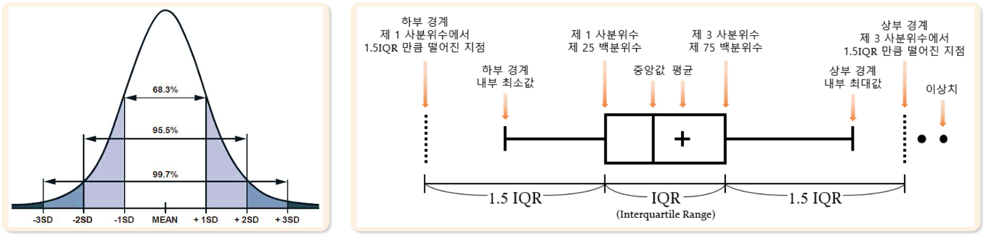
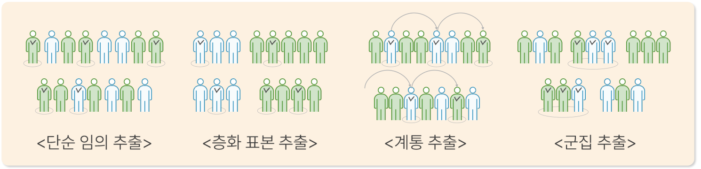

# 09. 데이터처리1

> 원본 PDF 범위: 230~260쪽 · PDF 설명 순서에 따라 재작성

## 주요 단어 먼저 보기

| 주요 단어 | 뜻 |
|---|---|
| 데이터 품질 | 분석 결과의 신뢰성을 결정하는 데이터 상태 |
| 결측치 | 값이 있어야 할 자리가 비어 있는 데이터 |
| MCAR·MAR·MNAR | 결측이 생기는 원인을 구분하는 세 가지 메커니즘 |
| 극단치 | 수치적으로 분포의 양 끝에 있는 값 |
| 이상치 | 전체 패턴에서 크게 벗어난 값 |
| Join | 공통 키로 두 테이블을 결합하는 연산 |
| Inner·Outer Join | 일치 행만 또는 기준 테이블의 불일치 행까지 남기는 결합 |
| Cross·Anti Join | 모든 행의 조합 또는 반대편에 없는 행을 구하는 결합 |
| 표본추출 | 모집단 일부를 조사 대상으로 선택 |
| 표본오차·대표성 | 표본 통계량과 모수의 차이·표본이 모집단을 닮은 정도 |
| 층화추출 | 각 층에서 표본을 추출 |
| 군집추출 | 일부 군집을 뽑아 조사 |

> **단원 시작법:** 주요 단어의 뜻을 먼저 읽고, 아래 PDF 절 순서대로 학습한다.


<!-- TOC START -->
## 목차

- [09. 데이터처리1](#09-데이터처리1)
  - [주요 단어 먼저 보기](#주요-단어-먼저-보기)
  - [목차](#목차)
  - [1. 데이터 품질 이슈](#1-데이터-품질-이슈)
    - [데이터 품질에 영향을 주는 주요 요인](#데이터-품질에-영향을-주는-주요-요인)
    - [결측치의 특징과 표기](#결측치의-특징과-표기)
    - [결측의 종류: MCAR·MAR·MNAR](#결측의-종류-mcarmarmnar)
    - [결측치 처리](#결측치-처리)
    - [이상치의 특징과 종류](#이상치의-특징과-종류)
    - [이상치 판별: 표준편차와 IQR](#이상치-판별-표준편차와-iqr)
  - [2. Join](#2-join)
    - [조인의 정의와 용어](#조인의-정의와-용어)
    - [주요 조인 연산 한눈에 비교](#주요-조인-연산-한눈에-비교)
    - [Inner Join](#inner-join)
    - [Left Join과 Right Join](#left-join과-right-join)
    - [Full Join](#full-join)
    - [Cross Join](#cross-join)
    - [Anti Join](#anti-join)
  - [3. 표본추출](#3-표본추출)
    - [표본추출의 정의와 종류](#표본추출의-정의와-종류)
    - [표본추출의 특징과 목적](#표본추출의-특징과-목적)
    - [확률표본추출의 네 가지 방법](#확률표본추출의-네-가지-방법)
  - [4. 교재 문제와 해설](#4-교재-문제와-해설)
    - [문제 바로가기](#문제-바로가기)
    - [문제 1. MNAR 결측](#문제-1-mnar-결측)
    - [문제 2. 맥락적 이상치](#문제-2-맥락적-이상치)
    - [문제 3. Left Join](#문제-3-left-join)
    - [문제 4. Cross Join](#문제-4-cross-join)
    - [문제 5. 표본추출 방법 판독](#문제-5-표본추출-방법-판독)
  - [보충 학습](#보충-학습)
    - [데이터 품질 점검 순서](#데이터-품질-점검-순서)
    - [결측·이상치 처리 선택표](#결측이상치-처리-선택표)
    - [중복·문자열·범주 정제](#중복문자열범주-정제)
    - [조인 전후 검증](#조인-전후-검증)
    - [표본추출 선택표](#표본추출-선택표)
    - [보강: 데이터 누수 방지](#보강-데이터-누수-방지)
    - [재현 가능한 처리 기록](#재현-가능한-처리-기록)
    - [체크포인트](#체크포인트)
  - [시험 직전 암기](#시험-직전-암기)
<!-- TOC END -->

## 1. 데이터 품질 이슈

> **PDF 231~235쪽**

> **암기 한 줄:** 결측은 “왜 비었나”, 이상치는 “왜 튀었나”를 확인한 뒤 처리한다.

### 데이터 품질에 영향을 주는 주요 요인

교재는 데이터 품질을 떨어뜨리는 대표 요인으로 **결측치, 극단치, 이상치**를 제시한다.

| 구분 | 의미 | 기억할 점 |
|---|---|---|
| 결측치(Missing Value) | 값이 있어야 할 자리가 비어 있음 | 빈칸뿐 아니라 `NA`, `NULL`, `X`, `-` 등도 결측 표현일 수 있음 |
| 극단치(Extreme Value) | 수치적으로 분포의 양 끝에 위치 | 극단치라는 이유만으로 잘못된 값은 아님 |
| 이상치(Outlier) | 다른 관측값과 현저히 다른 값을 가진 관측 | 수치뿐 아니라 시간·집단·변수 조합의 맥락으로도 판단 |

예를 들어 일정 간격으로 기록되는 측정치가 `9:13:45 → 110`, `9:13:47 → 빈칸`, `9:13:53 → 40`, `9:13:57 → 20`이라면, 기록 시점은 있으나 측정값이 비어 있는 `9:13:47`의 값은 결측치로 본다.

> **극단치와 이상치 구분:** 극단치는 “분포 끝에 있는 값”이라는 위치 개념이고, 이상치는 “자료의 일반 패턴과 맞지 않는 값”이라는 판단 개념이다. 정상적인 최고 매출은 극단치일 수 있지만 오류는 아니며, 한겨울의 매우 높은 기온은 전체 범위 안에 있어도 맥락적 이상치일 수 있다.

### 결측치의 특징과 표기

결측치는 기본적으로 값이 비어 있는 상태지만 실제 파일에서는 공백, `NA`(Not Available), `NULL`, `X`, `-`, `9999` 같은 약속된 코드로 저장되기도 한다. 이 표현을 실제 값으로 두면 평균·합계·비교·모델 학습 결과가 달라질 수 있으므로, 분석 전에 하나의 결측 표현으로 통일해야 한다.

```python
import numpy as np

df = df.replace(["", "NA", "NULL", "X", "-", 9999], np.nan)
df.isna().sum()
df.isna().mean()  # 변수별 결측 비율
```

### 결측의 종류: MCAR·MAR·MNAR

결측 처리법은 단순히 결측 비율만 보고 정하지 않는다. **결측이 생긴 이유**가 분석 편향을 결정한다.

| 종류 | 뜻 | 판단 기준 | 예시 | 주의점 |
|---|---|---|---|---|
| MCAR(Missing Completely At Random) | 완전 무작위 결측 | 결측 여부가 관측·미관측 변수 모두와 무관 | 장비의 순간적 통신 오류로 일부 행이 임의 누락 | 표본 수는 줄지만 삭제에 따른 체계적 편향은 비교적 작음 |
| MAR(Missing At Random) | 무작위 결측 | 결측 여부가 **관측된 다른 변수**와 관련 | 고령층에서 온라인 설문 응답 누락이 많고 나이는 관측됨 | 관련 변수를 이용한 그룹별·모델 기반 대치를 고려 |
| MNAR(Missing Not At Random) | 비무작위 결측 | 결측 여부가 결측값 자체 또는 관측하지 못한 요인과 관련 | 소득이 높은 사람이 소득 응답을 더 자주 거부 | 단순 삭제·평균 대치로 편향이 커질 수 있어 원인 가정과 민감도 분석 필요 |

> **암기:** `MCAR = 아무 변수도 관계없음`, `MAR = 보이는 변수와 관계`, `MNAR = 안 보이는 값 자체와 관계`.

### 결측치 처리

결측 처리는 데이터만 보고 자동으로 결정하기 어렵고 분석 목적, 업무 맥락, 이해관계자의 의견이 필요하다. 교재의 기본 원칙은 **MCAR이거나 결측 비율이 매우 낮으면 삭제**, 그 외에는 **대치**를 검토하는 것이다. 결측 비율이 극히 낮다면 어떤 대치값을 선택해도 전체 결과에 미치는 영향이 작을 수 있지만, 목표변수나 특정 집단에 결측이 몰려 있다면 낮은 비율이라도 편향될 수 있다.

| 처리 | 설명 | 적합한 상황 | 한계 |
|---|---|---|---|
| 행·열 삭제(Deletion) | 결측이 있는 관측 또는 변수를 제거 | MCAR, 결측 비율이 낮고 표본이 충분함 | 정보 손실, 집단 비율 변화 가능 |
| 단순 대치(Single Imputation) | 평균·중앙값·최빈값 등 하나의 값으로 채움 | 빠른 기준선, 결측이 적음 | 분산과 변수 간 관계를 과소평가할 수 있음 |
| 그룹별 대치 | 성별·지역·상품군 등 유사 집단의 대표값으로 채움 | 관측된 집단 특성이 결측과 관련됨 | 그룹 선택에 따라 결과가 달라짐 |
| 모델 기반 대치 | 회귀, k-NN 등으로 값을 예측하여 채움 | 다른 변수에 예측 정보가 충분함 | 모델 오류와 데이터 누수에 주의 |
| 다중 대치(Multiple Imputation) | 가능한 값을 여러 세트로 생성·분석한 뒤 결과를 통합 | 결측의 불확실성까지 반영해야 함 | 절차와 해석이 복잡함 |

### 이상치의 특징과 종류

이상치는 전체 분포의 형태를 왜곡하고 평균·표준편차 같은 통계량에 큰 영향을 줄 수 있다. 그러나 같은 값도 ***맥락에 따라 정상 또는 이상으로 판단***되며, 분석 목적에 따라 유지·제거·치환 여부가 달라진다.

| 분류 기준 | 종류 | 뜻 | 예시 |
|---|---|---|---|
| 발생 원인 | 자연적 이상치(Natural Outlier) | 실제 현상에서 드물게 발생한 유효한 값 | 실제 초고액 거래, 기록적 강수량 |
| 발생 원인 | 인위적 이상치(Artificial Outlier) | 입력·측정·처리 오류로 생긴 값 | 나이 250세, 센서 단위 변환 오류 |
| 분포 특성 | 단변량 이상치(Univariate Outlier) | 한 변수만 보아도 크게 벗어남 | 대부분 150~190cm인데 키 300cm |
| 분포 특성 | 다변량 이상치(Multivariate Outlier) | 각 변수는 정상 범위지만 조합이 비정상 | 키와 몸무게 각각은 정상이나 두 값의 조합이 매우 이례적 |

### 이상치 판별: 표준편차와 IQR

**표준편차 활용**은 평균과 표준편차로 평균에서 얼마나 떨어졌는지 확인하는 방법이며, 주로 정규분포를 만족하거나 대칭적인 데이터에 사용한다. 정규분포라면 평균에서 `±1σ`, `±2σ`, `±3σ` 안에 각각 약 68.3%, 95.5%, 99.7%가 포함된다. 흔히 `|z| > 3`을 후보 기준으로 쓰지만 절대 규칙은 아니다.

$$z=\frac{x-\bar{x}}{s}$$

**IQR 활용**은 상자수염그림에 쓰이는 방법이다. 제1사분위수와 제3사분위수 사이의 범위가 IQR이며, 보통 계수 1.5를 사용한다.

$$IQR=Q_3-Q_1$$

$$\text{하부 경계}=Q_1-1.5IQR,\qquad \text{상부 경계}=Q_3+1.5IQR$$

경계 밖의 값은 이상치 **후보**이고, 경계 안의 최솟값·최댓값이 상자그림의 수염 끝이 된다. 상자 안의 선은 중앙값, `+` 표시는 평균을 나타낼 수 있다.



> **시험 함정:** 이상치 판별은 삭제 명령이 아니다. 자연적 희귀값이면 유지하고 강건한 방법을 쓰며, 오류값이면 원천 데이터를 확인해 교정하거나 결측 처리한다.

## 2. Join

> **PDF 236~243쪽**

> **암기 한 줄:** `Inner=일치`, `Left/Right=기준표 보존`, `Full=양쪽 보존`, `Cross=모든 조합`, `Anti=불일치`.

### 조인의 정의와 용어

조인(Join)은 관련 있는 데이터를 하나의 결과 집합으로 만들기 위해 두 테이블을 연결하는 연산이다.

| 용어 | 뜻 |
|---|---|
| 테이블(Table) | 행(row)과 열(column)로 구성된 표 형식의 정형 데이터 |
| 행(Row) | 한 개체·사건을 나타내는 데이터 포인트 |
| 키(Key) | 행을 식별하거나 테이블 사이의 관계를 맺는 열; 보통 기본 키(Primary Key)를 지칭 |
| NULL | 데이터베이스에서 사용하는 대표적인 결측 표기 |

교재 예시에서는 직원 테이블 A의 `부서ID`와 부서 테이블 B의 `부서ID`가 매칭 키다.

| 테이블 A: 직원 |  |  | 테이블 B: 부서 |  |  |
|---:|---|---:|---:|---|---|
| ID | 이름 | 부서ID | 부서ID | 부서명 | 위치 |
| 101 | 김철수 | 10 | 10 | 개발팀 | 서울 |
| 102 | 이영희 | 20 | 20 | 디자인팀 | 부산 |
| 103 | 박민수 | 30 | 30 | 마케팅팀 | 대구 |
| 104 | 정수진 | 40 | 70 | 인사팀 | 인천 |
| 105 | 홍길동 | 50 | 80 | 총무팀 | 광주 |
| 106 | 강감찬 | 60 |  |  |  |

### 주요 조인 연산 한눈에 비교

| 조인 | 남기는 행 | 키 필요 | 조인으로 생기는 NULL | 교재 예시 결과 |
|---|---|:---:|---|---:|
| Inner Join | 양쪽 키가 일치하는 행만 | O | 없음 | 3행: 부서 10·20·30 |
| Left Join | 왼쪽 A의 모든 행 | O | B에 없는 40·50·60의 B 열 | 6행 |
| Right Join | 오른쪽 B의 모든 행 | O | A에 없는 70·80의 A 열 | 5행 |
| Full Join | 양쪽의 모든 행 | O | 어느 한쪽에만 있는 키의 반대쪽 열 | 8행 |
| Cross Join | A의 모든 행 × B의 모든 행 | X | 조인 때문에 생기지 않음 | $6\times5=30$행 |
| Left Anti Join | A에는 있고 B에는 없는 행 | O | 없음 | 3행: ID 104·105·106 |

### Inner Join

두 테이블에서 조인 조건에 일치하는 행만 남긴다. 키가 필요하고, 매칭되지 않은 행을 제거하므로 조인 자체가 새로운 결측치를 만들지는 않는다. 교재처럼 양쪽 키가 유일하면 결과 행 수는 `0`에서 `min(|A|, |B|)` 사이다.

### Left Join과 Right Join

- **Left Join:** 왼쪽 테이블 A의 모든 행을 보존한다. 오른쪽 B에서 매칭되는 행이 없으면 B의 열을 `NULL`로 채운다.
- **Right Join:** 오른쪽 테이블 B의 모든 행을 보존한다. 왼쪽 A에서 매칭되는 행이 없으면 A의 열을 `NULL`로 채운다.

교재처럼 상대 테이블의 키가 유일하면 Left 결과는 A의 행 수, Right 결과는 B의 행 수와 같다. 다만 상대 키가 중복된 일대다(1:N) 조인이면 한 행이 여러 행과 연결되어 결과가 늘어난다. 따라서 “왼쪽 행을 모두 남긴다”는 말은 **최소한 왼쪽 행이 사라지지 않는다**는 뜻이지, 결과 행 수가 언제나 왼쪽과 같다는 뜻은 아니다.

### Full Join

두 테이블의 모든 행을 포함하고, 키가 맞는 행은 결합하며 나머지는 이어 붙인다. A에만 있는 키 40·50·60은 B 열이 `NULL`, B에만 있는 키 70·80은 A 열이 `NULL`이 된다. 교재 예시는 `일치 3 + A에만 3 + B에만 2 = 8행`이다.

### Cross Join

카테시안 곱(Cartesian Product)이라고도 하며 키 없이 두 테이블의 모든 행을 서로 조합한다. 결과 행 수는 정확히 다음과 같다.

$$|A\times B|=|A|\times|B|$$

모든 조합을 만들기 때문에 결과가 매우 커질 수 있다. 예를 들어 1만 행과 2만 행을 Cross Join하면 2억 행이 되므로 실무에서는 예상 행 수를 먼저 계산한다.

### Anti Join

한 테이블에는 있지만 다른 테이블에는 없는 행만 남기는 차집합 성격의 연산이다. 기준에 따라 Left Anti Join과 Right Anti Join으로 나뉜다. Left Anti Join의 결과 행 수는 `0`에서 `|A|` 사이이며, 교재 예시에서는 B에 없는 부서ID 40·50·60의 직원만 남는다.

> **조인 행 수 핵심:** 교재의 행 수 범위는 키가 유일한 예시를 전제로 이해한다. 키가 중복되면 Inner·Left·Right·Full Join 모두 다대다 조합 때문에 예상보다 커질 수 있다.

## 3. 표본추출

> **PDF 244~250쪽**

> **암기 한 줄:** `단순=개체 랜덤`, `층화=모든 층에서`, `계통=일정 간격`, `군집=일부 집단째`.

### 표본추출의 정의와 종류

표본추출(Sampling)은 전체 집단인 **모집단(Population)**의 특성을 추정하거나 판단하기 위해 자료의 일부인 **표본(Sample)**을 수집하는 과정이다.

| 구분 | 표본을 정하는 기준 | 특징 |
|---|---|---|
| 확률표본추출(Probability Sampling) | 사전에 정한 확률에 따라 무작위 추출 | 각 구성원의 선택 확률을 알 수 있어 표본오차 추정과 통계적 일반화에 유리 |
| 비확률표본추출(Non-Probability Sampling) | 조사자의 판단·편의 등에 따라 추출 | 빠르고 편리하지만 선택 확률을 모르므로 대표성·일반화에 주의 |

### 표본추출의 특징과 목적

- 전수조사보다 빠르고 비용 효율적으로 결과를 얻을 수 있다.
- 표본은 모집단의 특성을 충분히 반영해야 하며, 이를 **대표성**이라고 한다.
- 표본에서 계산한 통계량은 모집단에서 계산한 모수와 차이가 날 수 있는데, 이를 **표본오차**라고 한다.
- 일반적으로 표본 크기가 모집단 크기에 가까워질수록 표본오차는 줄어드는 경향이 있다. 다만 표본이 커도 추출 방식이 편향되면 대표성은 좋아지지 않는다.

### 확률표본추출의 네 가지 방법

확률표본추출은 무작위(random) 추출이므로 같은 조건에서도 시행할 때마다 뽑히는 표본이 달라질 수 있다.



| 방법 | 추출 방법 | 장점 | 주의점 | 암기 질문 |
|---|---|---|---|---|
| 단순 임의 추출(Simple Random Sampling) | 모집단 모든 구성원에게 동일한 선택 기회를 주고 개체를 무작위 추출 | 가장 기본적이고 이해·적용이 쉬움, 대표성이 비교적 잘 보장됨 | 우연히 특정 범주·범위가 표본에서 빠질 수 있음 | “모든 **개체**의 확률이 같은가?” |
| 층화(=범주) 표본 추출(Stratified Random Sampling) | 모집단을 동질적인 여러 층(stratum)으로 나누고 **각 층에서** 무작위 추출 | 같은 표본 수의 단순 임의 추출보다 표본오차가 작고 대표성을 높일 수 있음 | 층을 나눌 정보와 적절한 층 기준이 필요 | “**모든 층**에서 뽑았는가?” |
| 계통(간격) 추출(Systematic Sampling) | 최초 표본을 무작위로 정한 뒤 일정한 간격 $k$마다 추출 | 단순하고 적용하기 쉬움 | 자료의 배열에 주기성이 있고 그 주기가 $k$와 겹치면 대표성이 저하됨 | “시작은 랜덤, 이후는 **일정 간격**인가?” |
| 군집 추출(Cluster Sampling) | 모집단을 여러 군집(cluster)으로 나누고 **일부 군집**을 무작위로 뽑아 조사 | 현장 접근이 쉬워 비용이 적게 듦 | 군집 안 구성원이 너무 유사하거나 군집 수가 적고 군집 간 차이가 크면 표본오차가 커짐 | “개체가 아니라 **집단째** 뽑았는가?” |

층화추출의 할당 방식은 두 가지다.

- **비례할당:** 각 층의 모집단 비율에 맞춰 표본 수를 배정한다.
- **균등할당:** 각 층에서 같은 개수의 표본을 뽑는다. 작은 층도 충분히 관찰할 수 있지만 모집단 추정 시 층별 가중치가 필요할 수 있다.

> **층화와 군집의 결정적 차이:** 층화는 **모든 층을 표본에 포함**하여 대표성을 높이고, 군집은 **일부 군집만 선택**하여 조사 비용을 낮춘다.

## 4. 교재 문제와 해설

> **원문 단원 말미 문제 전체 수록**

> 먼저 문제와 보기를 풀고, **정답 및 선택지별 해설 보기**를 펼쳐 확인하세요. 일반 4지선다 문항은 ①~④를 모두 해설하며, 원문이 2지선다인 경우에는 실제 보기만 수록합니다.

### 문제 바로가기

| 문제 | 주제 | 관련 목차 | PDF |
|---:|---|---|---:|
| [1](#ch09-q1) | MNAR 결측 | [1. 데이터 품질 이슈](#1-데이터-품질-이슈) | 251쪽 |
| [2](#ch09-q2) | 맥락적 이상치 | [1. 데이터 품질 이슈](#1-데이터-품질-이슈) | 253쪽 |
| [3](#ch09-q3) | Left Join | [2. Join](#2-join) | 255쪽 |
| [4](#ch09-q4) | Cross Join | [2. Join](#2-join) | 257쪽 |
| [5](#ch09-q5) | 표본추출 방법 판독 | [3. 표본추출](#3-표본추출) | 259쪽 |

<a id="ch09-q1"></a>

### 문제 1. MNAR 결측

**출처:** PDF 251쪽  
**관련 목차:** [1. 데이터 품질 이슈](#1-데이터-품질-이슈)

MNAR(Missing Not At Random) 메커니즘에 해당하는 사례는?

1. 고소득자들이 소득 관련 질문에 의도적으로 응답하지 않는 경우
2. 설문조사에서 응답자가 무작위로 선택된 질문에 답하지 않는 경우
3. 남성 응답자들이 여성 응답자들보다 나이 질문에 더 많이 응답하지 않는 경우
4. 데이터 입력 과정의 시스템 오류로 임의의 값들이 누락되는 경우

<details>
<summary>정답 및 선택지별 해설 보기</summary>

**정답: ① 고소득자들이 소득 관련 질문에 의도적으로 응답하지 않는 경우**

- **① 정답:** 결측 여부가 관측되지 않은 실제 소득값 자체에 좌우되므로 비무작위 결측 MNAR이다.
- **② 오답:** 모든 값이 무작위로 누락되고 관측·미관측 변수와 무관하다면 MCAR에 가깝다.
- **③ 오답:** 결측 여부가 관측 가능한 성별에 의해 설명된다면 MAR로 볼 수 있다.
- **④ 오답:** 값과 무관한 임의 시스템 오류라면 MCAR 사례다.

</details>

<a id="ch09-q2"></a>

### 문제 2. 맥락적 이상치

**출처:** PDF 253쪽  
**관련 목차:** [1. 데이터 품질 이슈](#1-데이터-품질-이슈)

공연 예매 사이트의 평소 일 접속자 수는 1,000~1,500명이지만 아이돌 콘서트 예매 첫날에는 10만 명 이상이 접속했다. 다음 설명 중 틀린 것은?

1. 콘서트 예매 첫날의 접속자 수는 수치적 이상치로 볼 수 있다.
2. 콘서트 예매 첫날은 맥락적 이상치가 아닌 자연스러운 현상으로만 해석해야 한다.
3. 이상치는 통계적으로 극단적이어도 상황의 맥락에 따라 의미가 달라질 수 있다.
4. 수치적 이상치는 반드시 데이터 오류를 의미하지 않는다.

<details>
<summary>정답 및 선택지별 해설 보기</summary>

**정답: ② 콘서트 예매 첫날은 맥락적 이상치가 아닌 자연스러운 현상으로만 해석해야 한다.**

- **① 오답:** 정답이 아님. 평소 분포와 비교하면 10만 명은 극단적으로 크므로 수치적 이상치다.
- **② 정답:** 정답(틀린 설명). 예매 첫날이라는 특정 조건에서 발생했으므로 맥락을 고려한 이상치이기도 하다. 자연스러운 원인이 있다고 이상치 개념이 사라지는 것은 아니다.
- **③ 오답:** 정답이 아님. 같은 값도 이벤트·시간·장소에 따라 오류, 정상 특수상황, 중요한 신호로 해석이 달라질 수 있다.
- **④ 오답:** 정답이 아님. 이상치는 오류일 수도 있지만 프로모션·장애·사기 같은 실제 사건의 신호일 수도 있다.

</details>

<a id="ch09-q3"></a>

### 문제 3. Left Join

**출처:** PDF 255쪽  
**관련 목차:** [2. Join](#2-join)

테이블 A를 기준으로 고객ID를 키로 테이블 B를 Left Join할 때 결과에서 관측되지 않는 정보는?


1. 김철수의 노트북 주문 정보
2. 정수진의 지역 정보
3. 고객ID C005의 스피커 주문 정보
4. 김철수가 주문한 키보드의 금액

<details>
<summary>정답 및 선택지별 해설 보기</summary>

**정답: ③ 고객ID C005의 스피커 주문 정보**

- **① 오답:** A의 C001 김철수와 B의 O001 노트북 주문이 키 C001로 연결된다.
- **② 오답:** Left Join은 왼쪽 A의 모든 고객을 보존하므로 주문이 없는 정수진(C004)의 지역 광주도 남는다.
- **③ 정답:** B의 스피커 주문은 고객ID C003이고, C005에는 일치하는 주문 행이 없다. C005의 주문 열은 결측값이 된다.
- **④ 오답:** B의 고객ID C001 키보드 주문금액 80,000원이 김철수 행과 연결된다.

</details>

<a id="ch09-q4"></a>

### 문제 4. Cross Join

**출처:** PDF 257쪽  
**관련 목차:** [2. Join](#2-join)

하위 스펙이 A 테이블 20행, B 테이블 5행에 기록되어 있다. 모든 조합의 기준 테이블을 만들 때 필요한 Join 방법과 결과 행 수는?

1. Full Join; 100
2. Cross Join; 100
3. Inner Join; 5
4. Left Join; 20

<details>
<summary>정답 및 선택지별 해설 보기</summary>

**정답: ② Cross Join; 100**

- **① 오답:** Full Join은 키가 일치하는 행을 결합하고 불일치 행도 보존하지만 모든 데카르트 곱을 만들지는 않는다.
- **② 정답:** Cross Join은 A의 각 행과 B의 모든 행을 조합하므로 20×5=100행이다.
- **③ 오답:** Inner Join은 공통 키가 일치하는 행만 남기므로 모든 경우의 수를 보장하지 않는다.
- **④ 오답:** Left Join은 A의 20행을 기준으로 일치 행을 붙이는 방식이며 모든 20×5 조합이 목적일 때는 부적합하다.

</details>

<a id="ch09-q5"></a>

### 문제 5. 표본추출 방법 판독

**출처:** PDF 259쪽  
**관련 목차:** [3. 표본추출](#3-표본추출)

측정치 표본추출 결과를 보고 사용했을 수 있는 방법을 모두 고르시오.

- a. 단순 임의추출을 사용했을 수 있다.
- b. 층화 표본추출을 사용했을 수 있다.
- c. 군집 추출을 사용했을 수 있다.


1. a
2. b
3. a, b
4. a, c

<details>
<summary>정답 및 선택지별 해설 보기</summary>

**정답: ④ a, c**

- **① 오답:** a 자체는 맞다. 전체 측정치에서 단순 임의추출을 하면 우연히 사업장 C가 빠질 수 있다. 그러나 교재 기준에서는 군집 추출 가능성 c도 있으므로 a만 고른 ①은 불완전하다.
- **② 오답:** 층화 표본추출은 사업장 A·B·C를 층으로 삼았다면 모든 층에서 표본을 뽑아 각 층을 반영해야 한다. 표본에 C가 전혀 없으므로 b로 보기 어렵다.
- **③ 오답:** a는 가능하지만 b가 포함되어 틀렸다. C층이 누락된 결과는 모든 층에서 추출하는 층화 표본추출의 특징과 맞지 않는다.
- **④ 정답:** 단순 임의추출에서는 우연히 C가 빠질 수 있다. 또한 A와 B 사업장을 선택하고 C 사업장을 제외한 군집 추출로도 해석할 수 있으므로 교재의 표시 정답은 a와 c이다.

</details>

## 보충 학습

> 원문 절 순서를 모두 학습한 뒤 이해와 문제 적용력을 높이는 확장 내용이다.

### 데이터 품질 점검 순서

시험과 실무에서는 `구조 → 결측 → 중복 → 범위·형식 → 분포·이상치 → 관계` 순서로 확인하면 빠뜨리기 어렵다.

1. **구조:** 행 수·열 수, 한 행이 뜻하는 관측 단위, 키의 유일성을 확인한다.
2. **결측:** 결측 표현을 통일하고 변수·집단·시간별 결측 비율을 본다.
3. **중복:** 전체 행 중복과 업무 키 중복을 구분한다.
4. **범위·형식:** 자료형, 단위, 허용 범위, 날짜 선후관계를 확인한다.
5. **분포·이상치:** 요약통계와 시각화로 극단치·이상치 후보를 찾는다.
6. **관계:** 목표변수와 설명변수, 변수 조합에서만 나타나는 이상을 확인한다.

```python
df.shape
df.info()
df.describe(include="all")

quality = pd.DataFrame({
    "dtype": df.dtypes,
    "missing_n": df.isna().sum(),
    "missing_rate": df.isna().mean(),
    "unique_n": df.nunique(dropna=False),
})
```

### 결측·이상치 처리 선택표

| 발견한 문제 | 우선 행동 | 가능한 처리 |
|---|---|---|
| 원천 입력 오류 | 원본·업무 규칙 대조 | 값 교정, 불가능하면 결측 처리 |
| MCAR이고 극소수 결측 | 제거 영향 확인 | 행 삭제 또는 단순 대치 |
| MAR 가능성 | 관련 관측 변수 탐색 | 그룹별·모델 기반·다중 대치 |
| MNAR 가능성 | 결측 원인 가정 명시 | 결측 표시변수, 민감도 분석, 별도 조사 |
| 유효한 극단값 | 실제 현상인지 검증 | 유지, 로그변환, 강건 통계·모델 |
| 분석 범위 밖의 값 | 제외 기준 확인 | 명시적 제외 후 처리 전후 결과 비교 |

윈저라이징(Winsorizing)은 경계를 벗어난 값을 경곗값으로 바꾸므로 분포를 인위적으로 바꾼다. 편리하다는 이유만으로 사용하지 말고 경계 선택과 결과 변화를 기록한다.

### 중복·문자열·범주 정제

동일한 행이 실제 중복인지 반복 거래인지 판단하려면 먼저 **업무 키**를 정의해야 한다. 고객 한 명이 여러 번 구매한 행은 중복이 아니지만 같은 거래번호가 두 번 기록되었다면 중복일 수 있다.

```python
df.duplicated().sum()                         # 모든 열이 같은 행
df.duplicated(subset=["transaction_id"]).sum()  # 업무 키 중복
df = df.drop_duplicates(subset=["transaction_id"])
df["date"] = pd.to_datetime(df["date"], errors="coerce")
```

`"Seoul"`, `"seoul "`, `"서울"`처럼 같은 의미의 값이 여러 표기로 들어올 수 있다. 공백·대소문자·유니코드·동의어를 정규화하되 원본 열은 보존한다.

```python
s = df["city"].str.strip().str.casefold()
s = s.replace({"seoul-si": "seoul", "서울": "seoul"})
```

### 조인 전후 검증

조인에서 가장 흔한 오류는 키 중복으로 인한 행 폭증과 불일치 키의 누락이다. 다음 네 가지를 확인한다.

1. 양쪽 키의 결측 수와 고유값 수를 확인한다.
2. 기대하는 관계가 1:1, 1:N, N:1, N:N 중 무엇인지 정한다.
3. 조인 전후 행 수와 불일치 키 수를 비교한다.
4. 중복 열 이름과 새로 생긴 결측치를 확인한다.

```python
# 부서ID가 오른쪽 테이블에서 유일한 N:1 관계인지 검증
joined = employees.merge(
    departments,
    on="부서ID",
    how="left",
    validate="many_to_one",
    indicator=True,
)
joined["_merge"].value_counts()  # both / left_only 확인
```

`indicator=True`의 `left_only`는 Left Anti Join 후보를 바로 보여 준다. `validate`가 실패하면 기대한 키 관계와 실제 데이터가 다르다는 뜻이다.

### 표본추출 선택표

| 상황 | 우선 고려 | 이유 |
|---|---|---|
| 모집단 명부가 있고 개체가 비교적 균질 | 단순 임의 추출 | 가장 단순하며 각 개체에 같은 기회 부여 |
| 성별·지역·등급별 대표성이 중요 | 층화 표본 추출 | 모든 층을 반드시 포함 |
| 정렬된 명부에서 빠르게 일정 수를 선택 | 계통 추출 | 시작점과 간격만 정하면 됨 |
| 전국 학교·병원처럼 개체별 접근 비용이 큼 | 군집 추출 | 일부 학교·병원 단위로 조사 가능 |

재현 가능한 무작위 추출에서는 난수 시드를 기록한다. 다만 같은 시드를 쓴다고 표본의 편향이 없어지는 것은 아니다.

```python
sample = df.sample(n=100, random_state=42)  # 단순 임의 추출
stratified = (
    df.groupby("grade", group_keys=False)
      .sample(frac=0.2, random_state=42)     # 층별 20% 예시
)
```

### 보강: 데이터 누수 방지

대치값이나 이상치 경계는 전체 데이터가 아니라 학습 데이터에서 계산하고 검증·테스트 데이터에 그대로 적용한다. 그렇지 않으면 미래 정보가 학습 과정에 섞인다.

### 재현 가능한 처리 기록

처리 전후 행 수, 제거 기준, 대치 방법, 자료형 변환을 로그로 남긴다. 원본 파일은 수정하지 않고 정제 데이터를 별도 버전으로 저장한다. 같은 입력에 같은 결과가 나오도록 코드와 난수 시드를 관리한다.

### 체크포인트

- 결측치는 빈칸 모양이 아니라 발생 원인까지 검토한다.
- IQR·z-score 경계 밖의 값은 제거 대상이 아니라 이상치 후보이다.
- Left Join은 왼쪽 행을 보존하지만 키 중복 시 결과 행 수가 증가할 수 있다.
- 층화는 모든 층, 군집은 일부 군집을 뽑는다.
- 중복 제거 전에 관측 단위와 업무 키를 정의한다.

## 시험 직전 암기

- **결측:** `MCAR=아무 변수`, `MAR=보이는 변수`, `MNAR=안 보이는 값`과 관련.
- **이상치:** `발견 ≠ 삭제`; 자연/인위, 단변량/다변량을 구분.
- **Join:** `Inner 일치 → Left/Right 기준표 → Full 양쪽 → Cross 곱 → Anti 차집합`.
- **표본:** `단순 개체 → 층화 모든 층 → 계통 간격 → 군집 일부 집단째`.
