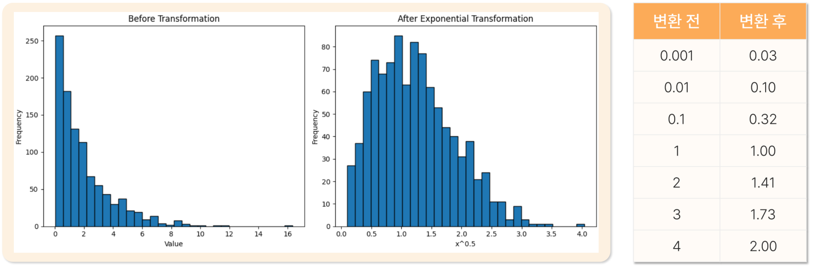
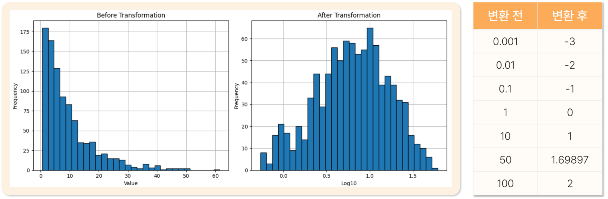
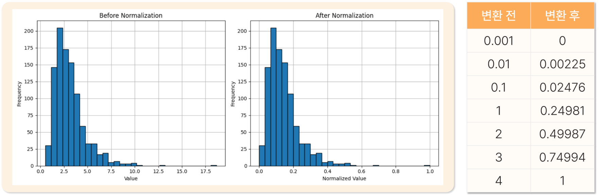
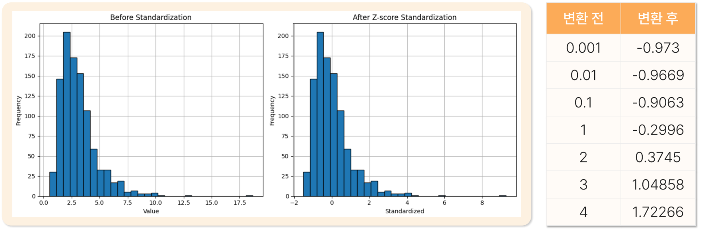
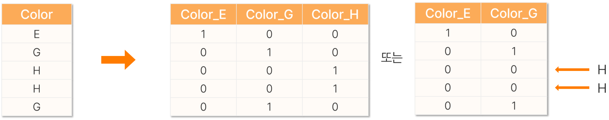

# 10. 데이터처리2

> 원본 PDF 범위: 261~285쪽 · PDF 설명 순서에 따라 재작성

## 주요 단어 먼저 보기

| 주요 단어 | 뜻 |
|---|---|
| 수치형 변환 | 수치 변수의 분포 또는 척도를 바꾸는 처리 |
| 왜도 | 분포가 한쪽으로 치우친 정도 |
| 지수(거듭제곱) 변환 | $x^p$로 분포의 치우침을 조정 |
| 로그변환 | 오른쪽으로 긴 분포와 큰 값의 영향을 완화 |
| 정규화 | 서로 다른 척도의 값을 일정 기준으로 맞추는 과정 |
| 최소–최대 정규화 | 최솟값 0·최댓값 1로 변환 |
| 표준화 | 평균 0·표준편차 1 기준으로 변환 |
| 범주형 변환 | 문자 범주를 모델이 사용할 숫자로 변환 |
| 원-핫 인코딩 | 범주마다 0/1 열을 생성 |
| 라벨 인코딩 | $n$개 범주를 0부터 $n-1$까지 숫자로 치환 |
| 순서 인코딩 | 실제 순서가 있는 범주를 숫자로 표현 |
| 데이터 누수 | 평가 데이터 정보가 학습 과정에 들어가는 문제 |

> **단원 시작법:** 주요 단어의 뜻을 먼저 읽고, 아래 PDF 절 순서대로 학습한다.


<!-- TOC START -->
## 목차

- [1. 수치형 데이터 변환](#1-수치형-데이터-변환)
  - [수치형 데이터 변환의 목적](#수치형-데이터-변환의-목적)
  - [지수 변환: 교재의 거듭제곱 변환](#지수-변환-교재의-거듭제곱-변환)
  - [로그변환](#로그변환)
- [2. 수치형 데이터 변환의 적용](#2-수치형-데이터-변환의-적용)
  - [정규화의 개요](#정규화의-개요)
  - [최소–최대 정규화(Min–Max Normalization)](#최소최대-정규화minmax-normalization)
  - [표준화(Standardization)](#표준화standardization)
  - [최소–최대와 표준화 비교](#최소최대와-표준화-비교)
- [3. 범주형 데이터 변환](#3-범주형-데이터-변환)
  - [범주형 데이터 변환의 개요](#범주형-데이터-변환의-개요)
  - [원-핫 인코딩(OHE, One-Hot Encoding)](#원-핫-인코딩ohe-one-hot-encoding)
  - [라벨 인코딩(Label Encoding)](#라벨-인코딩label-encoding)
  - [순서형 데이터의 변환](#순서형-데이터의-변환)
  - [세 방법 비교](#세-방법-비교)
- [4. 교재 문제와 해설](#4-교재-문제와-해설)
  - [문제 바로가기](#문제-바로가기)
  - [문제 1. 지수변환](#문제-1-지수변환)
  - [문제 2. 로그변환](#문제-2-로그변환)
  - [문제 3. 최소-최대 정규화](#문제-3-최소-최대-정규화)
  - [문제 4. 범주형 데이터 변환](#문제-4-범주형-데이터-변환)
  - [문제 5. 표준화](#문제-5-표준화)
- [보충 학습](#보충-학습)
  - [변환 선택 순서](#변환-선택-순서)
  - [학습·평가 데이터 분리와 누수 방지](#학습평가-데이터-분리와-누수-방지)
  - [열별 전처리](#열별-전처리)
  - [분포 변환의 추가 선택지](#분포-변환의-추가-선택지)
  - [모델별 스케일링 필요성](#모델별-스케일링-필요성)
  - [평가 상황에 맞는 분할 전략](#평가-상황에-맞는-분할-전략)
  - [불균형 데이터 처리](#불균형-데이터-처리)
  - [체크포인트](#체크포인트)
- [시험 직전 암기](#시험-직전-암기)
<!-- TOC END -->

## 1. 수치형 데이터 변환

> **PDF 262~266쪽**

> **암기 한 줄:** 양의 왜도는 `0<p<1` 또는 로그로 큰 값을 눌러 주고, 음의 왜도는 `p>1`로 큰 값을 더 벌린다.

### 수치형 데이터 변환의 목적

교재의 첫 번째 수치형 변환은 값의 단위를 맞추는 스케일링이 아니라 **분포의 모양을 바꾸는 변환**이다. 목적은 세 가지다.

1. **정규성 확보:** 정규분포를 가정하는 통계기법을 적용하기 전에 분포를 더 대칭적으로 만든다.
2. **왜도(Skewness) 보정:** 한쪽으로 치우친 분포 때문에 평균·분산 같은 기술통계량이 왜곡되는 것을 줄인다.
3. **이상치 영향 완화:** 로그변환처럼 큰 값을 압축하는 변환은 양의 왜도와 큰 값의 영향력을 줄인다.

> **주의:** 변환한다고 항상 정규분포가 되는 것은 아니다. 변환 전후 히스토그램·Q-Q plot·왜도를 확인하고 분석 목적에 맞는지 판단한다.

### 지수 변환: 교재의 거듭제곱 변환

교재에서 말하는 지수 변환은 각 값 $x$에 지수 $p$를 적용하는 **거듭제곱 변환**으로 이해하면 문제와 예시가 일치한다.

$$x'=x^p$$

| 원래 분포 | 권장 지수 $p$ | 효과 | 대표 예 |
|---|---:|---|---|
| 양의 왜도: 오른쪽 꼬리가 김 | $0<p<1$ | 큰 값을 상대적으로 더 많이 압축 | $p=0.5$, 즉 제곱근 변환 |
| 음의 왜도: 왼쪽 꼬리가 김 | $p>1$ | 큰 값 사이 간격을 확대하여 치우침을 보정 | $p=2$, 즉 제곱 변환 |
| 역변환 | $p=-1$ | 큰 값을 매우 작게 압축 | $x^{-1}=1/x$ |

교재 263쪽 그림에는 일반 지수함수 $f(x)=a^x$도 제시되어 있지만, 바로 다음 예시와 문제에서 사용하는 계산은 $x^{0.5}$ 같은 **값의 거듭제곱**이다. 시험 계산은 지수가 어디에 붙는지 확인한다.

교재의 제곱근 변환 예시는 다음과 같다.

| 변환 전 $x$ | $x^{0.5}$ 변환 후(반올림) |
|---:|---:|
| 0.001 | 0.03 |
| 0.01 | 0.10 |
| 0.1 | 0.32 |
| 1 | 1.00 |
| 2 | 1.41 |
| 3 | 1.73 |
| 4 | 2.00 |



작은 값도 커지지만 큰 값의 증가폭이 더 크게 눌리므로 오른쪽 꼬리가 짧아진다. 예를 들어 1과 4의 차이는 3이지만 제곱근 후 1과 2의 차이는 1이다.

### 로그변환

로그변환은 **0보다 큰 수치 데이터**에 적용하며 양의 왜도를 줄이는 데 효과적이다.

$$x'=\log_a x \qquad(a>0,\ a\ne1)$$

- 1을 기준으로 큰 값은 줄이고 `0 < x < 1`인 작은 값은 음수 영역으로 펼친다.
- 곱셈 관계를 덧셈 관계로 바꾸고 큰 값 사이 간격을 압축하므로 양의 왜도와 분산을 줄일 수 있다.
- $x=0$이면 로그가 정의되지 않고, 음수에는 실수 로그를 바로 적용할 수 없다. `log1p(x)=log(1+x)` 또는 다른 변환은 값의 의미를 확인한 뒤 사용한다.

교재의 상용로그($\log_{10}$) 예시는 다음과 같다.

| 변환 전 $x$ | $\log_{10}x$ |
|---:|---:|
| 0.001 | -3 |
| 0.01 | -2 |
| 0.1 | -1 |
| 1 | 0 |
| 10 | 1 |
| 50 | 1.69897 |
| 100 | 2 |



## 2. 수치형 데이터 변환의 적용

> **PDF 267~271쪽**

> **암기 한 줄:** `최소–최대 = 0~1 범위`, `표준화 = 평균 0·표준편차 1`; 둘 다 순서와 분포 형태는 유지한다.

### 정규화의 개요

교재에서 이 절의 정규화는 서로 다른 척도(scale)를 가진 수치형 데이터를 일정한 기준에 맞게 변환하는 넓은 과정이다.

- **비교 가능성 확보:** 단위나 값의 범위가 다른 변수들을 같은 선상에서 비교한다.
- **단위 영향 제거:** cm, kg, 원처럼 원래 단위가 달라서 생기는 영향 없이 변수의 상대적 위치와 분포를 비교한다.

예를 들어 연봉은 수천만 단위, 경력은 한 자릿수 단위라면 거리 기반 알고리즘은 연봉 차이에 거의 전부 좌우될 수 있다. 스케일을 맞추면 어느 변수의 단위가 큰지가 아니라 각 변수 안에서 얼마나 다른지를 반영한다.

### 최소–최대 정규화(Min–Max Normalization)

최솟값을 0, 최댓값을 1로 만들고 나머지를 그 사이의 비율로 옮긴다.

$$x'=\frac{x-\min(x)}{\max(x)-\min(x)}$$

- 변환 후에도 값의 순서와 기존 분포의 모양을 유지해 직관적이다.
- 모든 값이 $0\le x'\le1$이 되는 것은 **변환 기준 범위 안의 데이터**일 때다. 학습 범위보다 큰 새 값은 1을 넘고 작은 새 값은 0보다 작을 수 있다.
- 최솟값과 최댓값이 이상치이면 정상 값들이 좁은 구간에 몰리므로 이상치의 영향을 크게 받는다.

교재 예시는 최솟값 0.001, 최댓값 4를 사용한다.

| 변환 전 $x$ | 최소–최대 변환 후 |
|---:|---:|
| 0.001 | 0 |
| 0.01 | 0.00225 |
| 0.1 | 0.02476 |
| 1 | 0.24981 |
| 2 | 0.49987 |
| 3 | 0.74994 |
| 4 | 1 |



### 표준화(Standardization)

각 값에서 평균을 빼고 표준편차로 나누어 평균 0, 표준편차 1인 z-score로 바꾼다.

$$z=\frac{x-\mu}{\sigma}$$

여기서 $\mu$는 평균, $\sigma$는 표준편차다.

- 평균을 빼는 **중심화**와 표준편차로 나누는 **척도 조정**을 함께 한다.
- 분포의 중심과 퍼짐 정도를 고려하므로 단위가 다른 변수의 상대적 위치를 비교할 수 있다.
- 원자료가 정규분포라면 표준화 후 **표준정규분포**가 된다. 원자료가 비정규분포라면 평균과 표준편차만 바뀔 뿐 분포 모양이 정규분포로 변하지는 않는다.
- 최소–최대 정규화처럼 이상치에 영향을 받지만, 값이 반드시 0~1에 갇히지는 않는다.

교재의 변환 예시는 다음과 같다. 음수는 평균보다 작은 값, 양수는 평균보다 큰 값이며 절댓값은 평균에서 몇 표준편차 떨어졌는지를 뜻한다.

| 변환 전 $x$ | 표준화 후 $z$ |
|---:|---:|
| 0.001 | -0.973 |
| 0.01 | -0.9669 |
| 0.1 | -0.9063 |
| 1 | -0.2996 |
| 2 | 0.3745 |
| 3 | 1.04858 |
| 4 | 1.72266 |



### 최소–최대와 표준화 비교

| 항목 | 최소–최대 정규화 | 표준화 |
|---|---|---|
| 기준 | 최솟값·최댓값 | 평균·표준편차 |
| 대표 결과 | 보통 0~1 | 평균 0, 표준편차 1 |
| 분포 모양·순서 | 유지 | 유지 |
| 이상치 영향 | 매우 큼 | 큼 |
| 암기 | “양끝을 0과 1에 고정” | “평균에서 몇 표준편차?” |

## 3. 범주형 데이터 변환

> **PDF 272~275쪽**

> **암기 한 줄:** `명목형 입력=원-핫`, `목표 라벨=라벨`, `실제 서열=순서형 숫자`.

### 범주형 데이터 변환의 개요

범주형 데이터 변환은 문자나 범주(category)로 구성된 값을 분석·계산에 적합한 수치 형식으로 바꾸는 과정이다. 교재는 원-핫 인코딩, 라벨 인코딩, 순서형 데이터 변환을 제시한다.

> **가장 중요한 주의:** 숫자로 바뀐 범주를 일반 수치처럼 더하고 평균 내면 안 된다. 숫자는 범주를 표현하는 코드일 수 있으며, 수치의 크기·간격이 실제 의미를 갖는지는 별도로 판단해야 한다.

### 원-핫 인코딩(OHE, One-Hot Encoding)

하나의 **명목형 변수**를 그 변수의 범주 수만큼 새로운 가변수(dummy variable)로 바꾼다. 더미 코딩이라고도 하며, 각 가변수는 특정 범주의 존재 여부를 `0`과 `1`로 나타낸다.

예를 들어 `Color={E,G,H}`라면 `Color_E`, `Color_G`, `Color_H` 열을 만들고 E는 `(1,0,0)`, G는 `(0,1,0)`, H는 `(0,0,1)`로 표현한다.



가변수는 한 개를 제외해도 나머지가 모두 0인 경우로 제외한 범주를 알아낼 수 있다. 따라서 범주가 $k$개면 $k$개 열을 모두 쓰거나, 필요에 따라 기준 범주 하나를 제외한 $k-1$개 열을 쓸 수 있다.

- 선형·로지스틱 회귀처럼 절편이 있는 모형에서는 완전 다중공선성을 피하려고 기준 범주 하나를 제외하는 경우가 많다.
- 트리 계열 모델은 반드시 하나를 뺄 필요가 없다.
- 어떤 범주를 기준으로 뺄지는 해석 목적에 따라 정하며, 기준 범주가 계수 비교의 기준이 된다.

### 라벨 인코딩(Label Encoding)

$n$개의 범주를 0부터 $n-1$까지 연속된 정수 코드로 치환한다. 교재 예시는 `A→0, B→1, C→2, D→3, E→4, F→5, G→6`이다.

라벨 인코딩은 특히 분류의 **목표 라벨 $y$**를 숫자로 바꿀 때 자연스럽다. 그러나 순서가 없는 입력 변수 $X$에 임의 숫자를 붙이면 일부 모델이 `G > F > … > A`라는 거짓 순서와 거리를 학습할 수 있으므로 명목형 입력에는 원-핫 인코딩을 우선 고려한다.

### 순서형 데이터의 변환

순서형 데이터는 범주 사이에 실제 상대적 위치나 서열이 있으므로 그 순서를 보존하는 정수 또는 실수로 변환한다.

- **순서 정보 보존:** 범주 간 상대적 위치를 숫자로 표현한다.
- **계산 가능성 확보:** 통계분석과 수치 연산이 가능해진다.
- **간결한 표현:** 원-핫 인코딩보다 적은 차원으로 표현한다.

교재 예시는 값이 큰 항목부터 순위 1을 부여하여 다음처럼 변환한다.

| 변환 전 | 200 | 100 | 50 | 40 | 25 | 15 | 1 |
|---:|---:|---:|---:|---:|---:|---:|---:|
| 변환 후 순위 | 1 | 2 | 3 | 4 | 5 | 6 | 7 |

순서 코드 `1, 2, 3`은 서열을 뜻하지만 간격이 동일하다는 보장은 없다. 예를 들어 `낮음=1, 보통=2, 높음=3`에서 “높음이 낮음의 3배”라는 뜻은 아니다.

### 세 방법 비교

| 방법 | 적합한 대상 | 열 수 | 숫자의 순서 의미 | 대표 함정 |
|---|---|---:|:---:|---|
| 원-핫 인코딩 | 순서 없는 명목형 입력 $X$ | 범주별 여러 열 | X | 고유 범주가 많으면 차원 증가 |
| 라벨 인코딩 | 분류 목표 $y$, 단순 식별 코드 | 한 열 | 보통 X | 명목형 입력에 거짓 순서 생성 |
| 순서형 변환 | 등급·만족도처럼 실제 서열이 있는 입력 | 한 열 | O | 코드 간 간격까지 같다고 오해 |

## 4. 교재 문제와 해설

> **원문 단원 말미 문제 전체 수록**

> 먼저 문제와 보기를 풀고, **정답 및 선택지별 해설 보기**를 펼쳐 확인하세요. 일반 4지선다 문항은 ①~④를 모두 해설하며, 원문이 2지선다인 경우에는 실제 보기만 수록합니다.

### 문제 바로가기

| 문제 | 주제 | 관련 목차 | PDF |
|---:|---|---|---:|
| [1](#ch10-q1) | 지수변환 | [1. 수치형 데이터 변환](#1-수치형-데이터-변환) | 276쪽 |
| [2](#ch10-q2) | 로그변환 | [1. 수치형 데이터 변환](#1-수치형-데이터-변환) | 278쪽 |
| [3](#ch10-q3) | 최소-최대 정규화 | [2. 수치형 데이터 변환의 적용](#2-수치형-데이터-변환의-적용) | 280쪽 |
| [4](#ch10-q4) | 범주형 데이터 변환 | [3. 범주형 데이터 변환](#3-범주형-데이터-변환) | 282쪽 |
| [5](#ch10-q5) | 표준화 | [1. 수치형 데이터 변환](#1-수치형-데이터-변환) · [2. 수치형 데이터 변환의 적용](#2-수치형-데이터-변환의-적용) | 284쪽 |

<a id="ch10-q1"></a>

### 문제 1. 지수변환

**출처:** PDF 276쪽  
**관련 목차:** [1. 수치형 데이터 변환](#1-수치형-데이터-변환)

지수변환에 대한 설명으로 옳지 않은 것은?

1. 지수함수를 활용하여 왜도가 큰 데이터를 변환한다.
2. 왜도가 양수인 경우 지수값을 0.5로 하여 변환할 수 있다.
3. 왜도가 음수인 경우 1 초과의 지수를 권장한다.
4. 지수가 −1인 경우는 지수변환이 아니며 역변환이라고 한다.

<details>
<summary>정답 및 선택지별 해설 보기</summary>

**정답: ④ 지수가 −1인 경우는 지수변환이 아니며 역변환이라고 한다.**

- **① 오답:** 정답이 아님. 거듭제곱 계수를 조절해 분포의 왜도와 값 간 간격을 바꾸는 것이 지수변환이다.
- **② 오답:** 정답이 아님. 양의 왜도에서는 0과 1 사이 지수인 제곱근 변환이 큰 값을 압축할 수 있다.
- **③ 오답:** 정답이 아님. 음의 왜도에서는 1보다 큰 거듭제곱으로 큰 값 쪽 간격을 늘려 비대칭을 완화할 수 있다.
- **④ 정답:** 정답(옳지 않은 설명). x⁻¹=1/x도 거듭제곱 변환의 한 종류이며 특별히 역수변환이라고 부른다.

</details>

<a id="ch10-q2"></a>

### 문제 2. 로그변환

**출처:** PDF 278쪽  
**관련 목차:** [1. 수치형 데이터 변환](#1-수치형-데이터-변환)

다음 중 로그변환의 특징으로 옳은 것을 모두 고른 것은?

- ㄱ. 0 초과의 데이터만 변환 가능
- ㄴ. 양의 왜도 감소
- ㄷ. 분산의 증가
- ㄹ. 이상치 영향 완화

1. ㄱ, ㄴ
2. ㄱ, ㄴ, ㄹ
3. ㄱ, ㄴ, ㄷ
4. ㄱ, ㄴ, ㄷ, ㄹ

<details>
<summary>정답 및 선택지별 해설 보기</summary>

**정답: ② ㄱ, ㄴ, ㄹ**

- **① 오답:** ㄱ과 ㄴ은 맞지만 로그의 압축 효과로 큰 이상치의 영향도 줄어드므로 ㄹ을 빠뜨렸다.
- **② 정답:** 실수 로그는 양수에 적용하고, 큰 값을 압축해 양의 왜도와 이상치 영향을 줄인다. 교재의 일반적 설명에서는 분산도 감소하므로 ㄷ은 제외한다.
- **③ 오답:** 일반적인 양수 자료에서 로그변환은 큰 값 간 차이를 압축하므로 ‘분산의 증가’를 보편적 특징으로 볼 수 없다.
- **④ 오답:** ㄷ이 항상 참이 아니다. 단, 0과 1 사이의 매우 작은 값만 있는 자료에서는 로그 후 절댓값 차이가 커져 분산이 증가할 수 있다는 예외가 있다.

</details>

<a id="ch10-q3"></a>

### 문제 3. 최소-최대 정규화

**출처:** PDF 280쪽  
**관련 목차:** [2. 수치형 데이터 변환의 적용](#2-수치형-데이터-변환의-적용)

데이터 [1,3,4,6,8,9,10]을 최소-최대 정규화할 때 값 6이 변환되는 결과는?

1. 0.444
2. 0.556
3. 0.600
4. 0.667

<details>
<summary>정답 및 선택지별 해설 보기</summary>

**정답: ② 0.556**

- **① 오답:** 0.444는 분자나 범위를 잘못 잡은 값이다. 최솟값 1을 뺀 분자는 5다.
- **② 정답:** (6−1)/(10−1)=5/9≈0.556이다.
- **③ 오답:** 6/10=0.6처럼 단순히 최댓값으로 나누면 최솟값이 0으로 이동하지 않아 최소-최대 정규화가 아니다.
- **④ 오답:** (6−0)/(9−0) 같은 잘못된 최솟값·범위를 사용한 값이다. 실제 범위는 10−1=9다.

</details>

<a id="ch10-q4"></a>

### 문제 4. 범주형 데이터 변환

**출처:** PDF 282쪽  
**관련 목차:** [3. 범주형 데이터 변환](#3-범주형-데이터-변환)

범주형 데이터 변환에 대한 설명으로 옳은 것은?

1. 원-핫 인코딩에서는 모든 가변수를 분석에 포함해야 한다.
2. 라벨 인코딩은 n개의 범주를 1부터 n까지의 수치로 변환한다.
3. 순서형 데이터 변환은 범주 간 상대적 위치를 수치로 표현한다.
4. 수치형으로 변환된 범주형 데이터는 분석 편의를 위해 사칙연산을 수행해도 문제가 없다.

<details>
<summary>정답 및 선택지별 해설 보기</summary>

**정답: ③ 순서형 데이터 변환은 범주 간 상대적 위치를 수치로 표현한다.**

- **① 오답:** 절편이 있는 회귀에서 n개 더미를 모두 넣으면 완전 다중공선성이 생길 수 있어 보통 기준 범주 하나를 뺀 n−1개를 사용한다.
- **② 오답:** 라벨 인코딩은 구현에 따라 0부터 n−1까지 부호화할 수 있다. 핵심은 범주를 정수 코드로 바꾸는 것이지 반드시 1~n은 아니다.
- **③ 정답:** 순서형 인코딩은 ‘낮음<보통<높음’ 같은 상대적 순위를 보존하는 수치를 부여한다.
- **④ 오답:** 숫자 코드는 범주 이름을 바꾼 것일 수 있다. 코드 2가 코드 1의 두 배라는 산술적 의미는 자동으로 생기지 않는다.

</details>

<a id="ch10-q5"></a>

### 문제 5. 표준화

**출처:** PDF 284쪽  
**관련 목차:** [1. 수치형 데이터 변환](#1-수치형-데이터-변환) · [2. 수치형 데이터 변환의 적용](#2-수치형-데이터-변환의-적용)

표준화(Standardization)에 대한 설명으로 옳다고 보기 어려운 것은?

1. 데이터의 평균을 0, 표준편차를 1로 변환한다.
2. 정규분포를 변환할 경우 표준정규분포가 된다.
3. 양의 왜도를 가진 데이터의 왜도를 효과적으로 줄여준다.
4. 평균과 표준편차를 사용하여 계산한다.

<details>
<summary>정답 및 선택지별 해설 보기</summary>

**정답: ③ 양의 왜도를 가진 데이터의 왜도를 효과적으로 줄여준다.**

- **① 오답:** 정답이 아님. z=(x−μ)/σ로 변환하면 중심은 0, 척도는 1이 된다.
- **② 오답:** 정답이 아님. X~N(μ,σ²)이면 Z=(X−μ)/σ~N(0,1)이다.
- **③ 정답:** 정답(보기 어려운 설명). 표준화는 위치와 척도만 바꾸는 선형변환이라 분포의 모양과 왜도는 그대로다. 왜도 완화에는 로그·거듭제곱 변환을 쓴다.
- **④ 오답:** 정답이 아님. 평균을 빼고 표준편차로 나누는 계산이 표준화다.

</details>

## 보충 학습

> 원문 절 순서를 모두 학습한 뒤 이해와 문제 적용력을 높이는 확장 내용이다.

### 변환 선택 순서

수치형 변환과 범주형 변환을 한꺼번에 외우려면 다음 네 질문을 순서대로 사용한다.

1. **분포가 치우쳤는가?** → 지수(거듭제곱)·로그·Box-Cox·Yeo-Johnson 같은 분포 변환 검토
2. **변수마다 단위와 범위가 다른가?** → 최소–최대 정규화 또는 표준화 검토
3. **범주에 순서가 있는가?** → 없으면 원-핫, 있으면 순서형 변환
4. **변환 기준을 어디서 구했는가?** → 학습 데이터에서만 `fit`, 나머지는 `transform`

| 목적 | 대표 변환 | 분포 모양 | 핵심 제약 |
|---|---|---|---|
| 양의 왜도·큰 값 영향 완화 | 로그, $0<p<1$ 거듭제곱 | 바뀜 | 로그는 기본적으로 $x>0$ |
| 음의 왜도 완화 | $p>1$ 거듭제곱 | 바뀜 | 큰 값의 간격이 더 벌어짐 |
| 값을 0~1 범위에 맞춤 | MinMaxScaler | 유지 | 최솟값·최댓값과 이상치에 민감 |
| 평균 0·표준편차 1 | StandardScaler | 유지 | 평균·표준편차와 이상치에 민감 |
| 이상치에 더 강한 스케일 | RobustScaler | 유지 | 중앙값·IQR 사용 |
| 명목형을 0/1 열로 | OneHotEncoder | 해당 없음 | 범주 수가 많으면 열 수 증가 |

### 학습·평가 데이터 분리와 누수 방지

```python
X_train, X_test, y_train, y_test = train_test_split(
    X, y, test_size=0.2, random_state=123, stratify=y
)
```

`fit`은 변환에 필요한 기준을 학습한다. 예를 들어 MinMaxScaler는 최솟값·최댓값, StandardScaler는 평균·표준편차, OneHotEncoder는 범주 목록을 학습한다. 평가 데이터에서 이 기준을 다시 구하면 평가 정보가 학습 과정에 들어가는 **데이터 누수**가 발생한다.

```python
scaler = StandardScaler()
X_train_scaled = scaler.fit_transform(X_train)  # fit + transform
X_test_scaled = scaler.transform(X_test)        # transform만
```

전처리와 모델을 파이프라인으로 묶으면 교차검증의 각 학습 fold 안에서만 변환 기준을 학습하므로 누수를 줄일 수 있다.

```python
pipe = Pipeline([
    ("scale", StandardScaler()),
    ("model", LogisticRegression(max_iter=1000)),
])

pipe.fit(X_train, y_train)
y_pred = pipe.predict(X_test)
```

### 열별 전처리

수치형과 범주형에 서로 다른 처리를 적용할 때 `ColumnTransformer`를 사용한다.

```python
numeric = Pipeline([
    ("impute", SimpleImputer(strategy="median")),
    ("scale", StandardScaler()),
])
categorical = Pipeline([
    ("impute", SimpleImputer(strategy="most_frequent")),
    ("onehot", OneHotEncoder(handle_unknown="ignore", drop=None)),
])
prep = ColumnTransformer([
    ("num", numeric, numeric_cols),
    ("cat", categorical, categorical_cols),
])

model = Pipeline([
    ("prep", prep),
    ("model", LogisticRegression(max_iter=1000)),
])
model.fit(X_train, y_train)
y_pred = model.predict(X_test)
```

`handle_unknown="ignore"`는 평가 시 처음 등장한 범주 때문에 변환이 실패하는 것을 막지만, 미지 범주의 빈도와 의미는 별도로 모니터링해야 한다.

### 분포 변환의 추가 선택지

- **Box-Cox:** 양수 데이터에 여러 거듭제곱을 시험해 적합한 지수 $\lambda$를 찾는다.
- **Yeo-Johnson:** 0과 음수를 포함할 수 있는 거듭제곱 계열 변환이다.
- **`log1p(x)`:** $\log(1+x)$로 0을 포함한 비음수 데이터에 편리하다. `x`의 의미와 단위를 확인해야 한다.
- **구간화(Binning):** 연속값을 구간 범주로 바꿔 해석을 단순화하지만 경계 선택에 따라 정보가 손실된다.

분포 변환도 학습 데이터에서 변환 파라미터를 정해야 한다. 변환 전후 평균만 비교하지 말고 히스토그램, 왜도, 이상치 영향, 모델의 교차검증 성능을 함께 본다.

### 모델별 스케일링 필요성

| 모델 | 스케일링 중요도 | 이유 |
|---|---|---|
| k-NN, k-Means, SVM, PCA | 매우 높음 | 거리·분산이 큰 단위의 변수에 지배됨 |
| 선형·로지스틱 회귀 | 규제 또는 계수 비교 시 높음 | 규제 벌점과 최적화 속도가 척도에 영향받음 |
| 의사결정나무, 랜덤포레스트 | 대체로 낮음 | 임곗값 기준 분할은 단조 스케일 변화에 거의 불변 |

스케일링 중요도가 낮은 모델에서도 단위 통일, 이상치 처리, 해석의 일관성은 별도의 데이터 품질 문제다.

### 평가 상황에 맞는 분할 전략

- 불균형 분류: 목표 비율을 보존하는 층화 분할
- 동일 고객의 반복 관측: 고객 단위 그룹 분할
- 시계열: 미래가 학습 데이터로 들어오지 않도록 시간 순서 분할
- 공간 데이터: 가까운 지역이 양쪽에 섞여 성능이 부풀지 않도록 공간 블록 분할

랜덤 분할이 항상 올바른 것은 아니다. 실제 배포 상황과 같은 독립성을 재현해야 한다.

### 불균형 데이터 처리

클래스 가중치, 언더샘플링, 오버샘플링, 임계값 조정을 고려할 수 있다. SMOTE 같은 재표본화는 교차검증의 학습 fold 안에서만 수행한다.

### 체크포인트

- 지수·로그변환은 분포 모양을 바꾸고, 최소–최대·표준화는 분포 모양을 유지한다.
- 표준화는 비정규분포를 자동으로 정규분포로 만들지 않는다.
- 범주 순서의 의미가 없으면 원-핫 인코딩을 우선 고려한다.
- 모든 전처리 파라미터는 학습 세트에서만 `fit`한다.
- 스케일링의 필요성은 모델이 거리·규제·분산을 사용하는지에 따라 달라진다.

## 시험 직전 암기

- **왜도:** `양의 왜도 → 0<p<1 또는 log`, `음의 왜도 → p>1`.
- **척도:** `Min–Max → 0~1`, `Standard → 평균 0·표준편차 1`.
- **범주:** `명목형 X → 원-핫`, `분류 y → 라벨`, `실제 서열 → 순서형`.
- **누수:** `train에 fit`, `test에는 transform만`.
