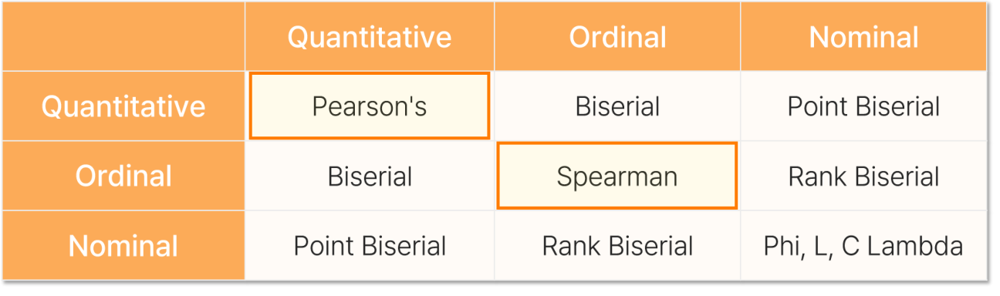
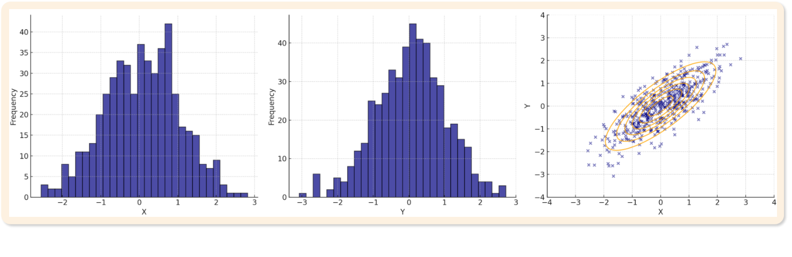
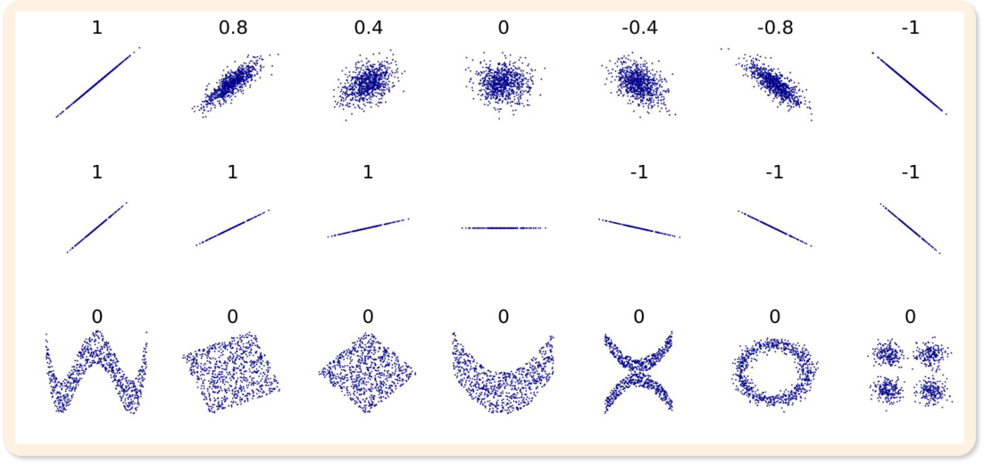
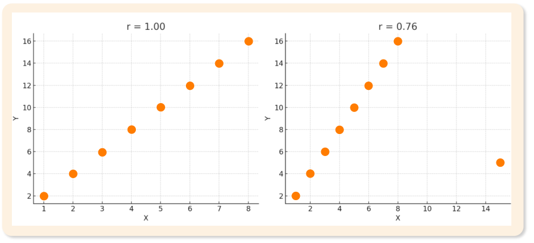
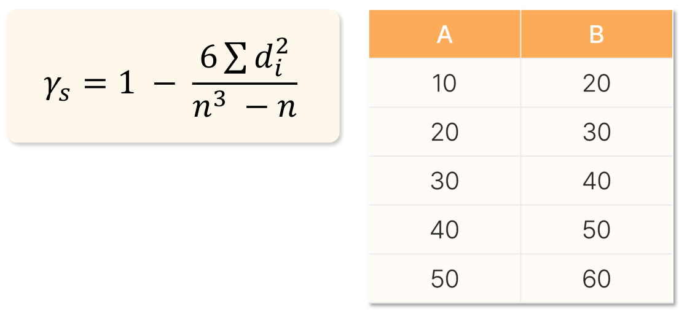
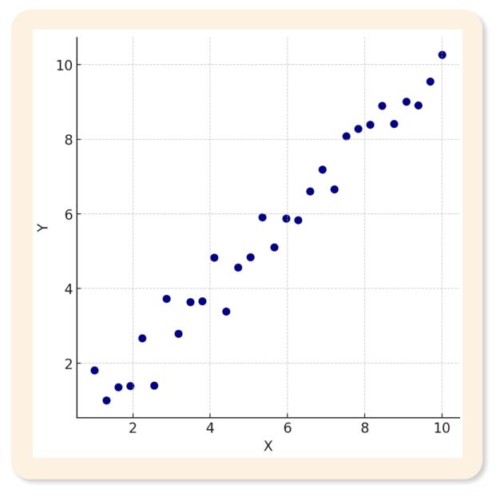

# 11. 상관분석

> 원본 PDF 범위: 286~319쪽 · PDF 설명 순서에 따라 재작성

## 주요 단어 먼저 보기

| 주요 단어 | 뜻 |
|---|---|
| 상관분석(Correlation Analysis) | 두 변수 관계의 방향과 강도를 수치로 파악하는 분석 |
| 공변(Covariation) | 두 변수가 함께 변하는 현상을 수치적으로 측정한 것 |
| 공동변화(Co-variation) | 함께 변하는 관계·방향·패턴에 초점을 둔 개념 |
| 단조관계(Monotonic Relationship) | 한 변수가 증가할 때 다른 변수가 한 방향으로 계속 증가하거나 감소하는 관계 |
| 상관계수(Correlation Coefficient) | 관계의 방향과 강도를 나타내는 $-1$~$1$ 사이의 수치 |
| 선형관계 | 산점도의 평균적인 패턴이 직선으로 표현되는 관계 |
| 피어슨 상관(Pearson) | 연속형 두 변수의 **선형관계**를 측정하는 모수적 방법 |
| 스피어만 상관(Spearman) | 순위를 이용해 두 변수의 **단조관계**를 측정하는 비모수적 방법 |
| 동순위(Tied Rank) | 같은 값들에 동일한 평균 순위를 부여한 상태 |
| 이변량 정규분포 | X와 Y가 각각 정규분포이고 결합분포도 정규성을 갖는 분포 |
| 자기상관(Autocorrelation) | 같은 변수의 현재 값과 과거 값 사이의 관련성 |
| 공분산(Covariance) | 두 변수가 함께 변하는 방향을 나타내는, 단위에 의존하는 수치 |
| 신뢰구간 | 모집단 상관계수의 가능한 범위를 표본으로 추정한 구간 |
| 허위상관(Spurious Correlation) | 실제 인과관계 없이 제3의 요인 등으로 나타난 상관 |
| 역인과관계(Reverse Causation) | 원인과 결과의 방향을 반대로 해석할 가능성 |
| 공통원인(Common Cause) | 제3의 변수가 두 변수 모두에 영향을 주어 상관이 생기는 경우 |
| 이상치(Outlier) | 상관계수를 실제보다 강하거나 약하게 바꿀 수 있는 극단적 관측값 |

> **단원 전체 암기:** `상관 = 방향 + 강도`, `피어슨 = 선형`, `스피어만 = 순위·단조`, `상관 ≠ 인과`.


<!-- TOC START -->
## 목차

- [1. 상관분석 개요](#1-상관분석-개요)
  - [공변과 공동변화](#공변과-공동변화)
  - [단조관계](#단조관계)
- [2. 상관분석의 목적과 특징](#2-상관분석의-목적과-특징)
  - [목적](#목적)
  - [특징](#특징)
- [3. 상관분석의 쓰임새](#3-상관분석의-쓰임새)
- [4. 상관분석의 종류와 가정](#4-상관분석의-종류와-가정)
  - [4.1 상관분석의 종류](#41-상관분석의-종류)
  - [4.2 피어슨 상관분석의 가정](#42-피어슨-상관분석의-가정)
  - [4.3 스피어만 상관분석의 가정](#43-스피어만-상관분석의-가정)
- [5. 이변량 정규분포](#5-이변량-정규분포)
  - [특징](#특징-1)
- [6. 자기상관](#6-자기상관)
  - [교재의 예시](#교재의-예시)
- [7. 피어슨 상관분석](#7-피어슨-상관분석)
  - [7.1 정의](#71-정의)
  - [7.2 특징](#72-특징)
  - [7.3 피어슨 상관계수 계산](#73-피어슨-상관계수-계산)
  - [7.4 교재 계산 예제](#74-교재-계산-예제)
- [8. 스피어만 상관분석](#8-스피어만-상관분석)
  - [8.1 정의](#81-정의)
  - [8.2 특징](#82-특징)
  - [8.3 스피어만 상관계수 계산](#83-스피어만-상관계수-계산)
  - [8.4 순위를 정할 때의 주의점](#84-순위를-정할-때의-주의점)
  - [8.5 교재 계산 예제](#85-교재-계산-예제)
- [9. 상관계수의 해석](#9-상관계수의-해석)
  - [9.1 부호와 절댓값](#91-부호와-절댓값)
  - [9.2 해석할 때의 주의점](#92-해석할-때의-주의점)
- [10. 공분산의 개념](#10-공분산의-개념)
  - [10.1 정의와 해석](#101-정의와-해석)
  - [10.2 계산](#102-계산)
  - [10.3 한계](#103-한계)
- [11. 상관분석 시 고려사항](#11-상관분석-시-고려사항)
  - [11.1 상관관계와 인과관계 구분](#111-상관관계와-인과관계-구분)
  - [11.2 이상치의 영향](#112-이상치의-영향)
  - [11.3 표본 크기가 부족할 때](#113-표본-크기가-부족할-때)
  - [11.4 분석 순서](#114-분석-순서)
  - [11.5 유의성·신뢰구간 보강](#115-유의성신뢰구간-보강)
- [12. 교재 문제와 해설](#12-교재-문제와-해설)
  - [문제 바로가기](#문제-바로가기)
  - [문제 1. 자기상관](#문제-1-자기상관)
  - [문제 2. 피어슨 상관계수 해석](#문제-2-피어슨-상관계수-해석)
  - [문제 3. 스피어만 순위상관계수](#문제-3-스피어만-순위상관계수)
  - [문제 4. 상관계수의 성질](#문제-4-상관계수의-성질)
  - [문제 5. 산점도 해석](#문제-5-산점도-해석)
- [시험 직전 암기](#시험-직전-암기)
<!-- TOC END -->

## 1. 상관분석 개요

> **PDF 287쪽**

상관분석은 두 변수 사이 관계의 **강도**와 **방향**을 정량적으로 측정하여 변수 사이의 연관성을 파악하는 방법이다. 두 변수가 함께 변하는 모습을 통해 선형관계 또는 단조관계를 분석한다.

### 공변과 공동변화

- **공변(Covariation):** 두 변수가 함께 변하는 현상이나 관계를 정확한 수치로 측정할 수 있다는 점에 초점을 둔다.
- **공동변화(Co-variation):** 관계 자체의 방향과 패턴에 초점을 두며 질적 관찰까지 포함하는 넓은 개념이다.

### 단조관계

한 변수가 증가할 때 다른 변수가 일관되게 증가하거나 감소하는 관계다.

- **단조증가:** X가 증가하면 Y도 계속 증가한다.
- **단조감소:** X가 증가하면 Y는 계속 감소한다.
- 반드시 직선일 필요는 없다.

선형관계는 단조관계의 일부다. 직선으로 꾸준히 증가하면 선형이면서 단조증가지만, 증가 속도가 달라지는 곡선도 계속 증가하기만 하면 단조관계다. 반대로 U자형은 중간에 방향이 바뀌므로 단조관계가 아니다.

> **암기:** `같이 한 방향으로만 움직이면 단조, 직선으로 움직이면 선형.`

## 2. 상관분석의 목적과 특징

> **PDF 288쪽**

### 목적

두 변수 관계의 강도와 방향을 수치로 측정하여 변수 간 연관성을 파악하는 것이 목적이다.

### 특징

1. 분석 결과로 **상관계수**를 산출한다.
2. 상관계수는 주로 변수 간 관계의 방향과 강도를 나타낸다.
3. 상관관계가 확인되어도 **인과관계**가 보장되지는 않는다.
4. 피어슨 상관은 선형성을 가정하므로 비선형관계를 충분히 파악하지 못할 수 있다.
5. 표준화된 계수이므로 단위가 다른 변수끼리도 관계를 비교할 수 있다.

> **시험 함정:** 상관계수가 높다고 해서 “X가 Y의 원인이다”라고 결론 내리면 안 된다.

## 3. 상관분석의 쓰임새

> **PDF 289쪽**

교재의 해당 페이지는 상관·데이터 분석의 활용을 표현한 시각자료 중심이며 새로운 정의나 수식은 제시하지 않는다. 앞의 정의를 실제 분석에 적용하면 다음과 같이 정리할 수 있다.

- 두 수치형 변수가 함께 움직이는지 탐색한다.
- 관계가 양의 방향인지 음의 방향인지 확인한다.
- 후속 회귀분석에 사용할 후보 변수를 탐색한다.
- 유사한 정보를 담은 변수들이 지나치게 중복되는지 살펴본다.

상관분석 전에 산점도를 그리면 관계의 방향·형태·이상치를 먼저 확인할 수 있다.

## 4. 상관분석의 종류와 가정

> **PDF 290~292쪽**

### 4.1 상관분석의 종류

대표적인 시험 범위는 다음 두 방법이다.

| 구분 | 피어슨 상관분석 | 스피어만 상관분석 |
|---|---|---|
| 방법 | 모수적 방법 | 비모수적 방법 |
| 핵심 관계 | 선형관계 | 단조관계 |
| 주된 자료 | 연속형 수치 | 순서형 또는 순위로 바꿀 수 있는 자료 |
| 계산 기준 | 원래 값 | 순위 |

교재는 두 변수의 자료형 조합에 따라 Pearson, Biserial, Point Biserial, Spearman, Rank Biserial, Phi, Lambda 등의 방법을 제시하며, 표에서 피어슨과 스피어만을 시험 범위로 강조한다.



*그림: 두 변수의 자료형 조합에 따른 상관분석 방법. 원문에서 표 영역만 잘라 수록.*

| 방법 | 대표적인 자료 조합 | 핵심 생각 |
|---|---|---|
| Pearson | 연속형–연속형 | 원값의 선형관계 |
| Biserial | 연속형–인위적으로 이분화한 변수 | 잠재적 연속성을 가정 |
| Point-biserial | 연속형–본래 이분형 변수 | 0·1 코딩과 Pearson의 특수형 |
| Spearman | 순서형–순서형 또는 순위변환 가능 자료 | 순위의 단조관계 |
| Rank-biserial | 순서형–이분형 | 두 집단의 순위 차이 |
| Phi | 이분형–이분형 | 2×2 분할표의 연관성 |
| Lambda | 명목형–명목형 | 한 변수가 다른 변수 예측오류를 얼마나 줄이는지 측정 |

시험의 핵심은 피어슨과 스피어만이지만, 자료형에 맞지 않는 계수를 기계적으로 적용하지 않는다는 원칙이 중요하다.

### 4.2 피어슨 상관분석의 가정

| 가정 | 의미 | 위반 시 문제 |
|---|---|---|
| 선형성 | 두 변수 관계가 직선 형태 | 곡선관계를 충분히 포착하지 못함 |
| 정규성 | 두 변수의 관계가 이변량 정규분포 | 신뢰구간과 가설검정의 정확성 저하 |
| 등분산성 | 관계 전반에서 분산이 안정적 | 상관계수 추정의 신뢰성 저하 |
| 독립성 | 관측값들이 서로 독립 | 자기상관이 있으면 표준오차가 편향될 수 있음 |
| 연속성 | 두 변수가 연속형 | 순서형·명목형에는 다른 방법이 더 적절할 수 있음 |

> **암기:** 피어슨 가정은 `선·정·등·독·연` = 선형성·정규성·등분산성·독립성·연속성.

상관계수 $r$ 자체는 정규성을 가정하지 않아도 계산할 수 있다. 이변량 정규성은 주로 모집단 상관계수에 대한 p-value와 신뢰구간을 정확히 계산할 때 중요하다. 따라서 가정 위반 시 ‘계산 불가’가 아니라 ‘추론과 해석의 신뢰성 저하’로 이해한다.

### 4.3 스피어만 상관분석의 가정

| 가정 | 의미 |
|---|---|
| 단조성 | 한 변수가 증가할 때 다른 변수도 한 방향으로 계속 변함 |
| 독립성 | 관측값들이 서로 독립 |
| 순서성 | 자료를 순위로 변환할 수 있어야 함 |

> **암기:** 스피어만 가정은 `단·독·순` = 단조성·독립성·순서성.

## 5. 이변량 정규분포

> **PDF 293쪽 · 보충**

이변량 정규분포(Bivariate Normal Distribution)는 두 변수 X와 Y가 함께 정규성을 가지는 분포다.

### 특징

1. X와 Y 각각은 단변량 정규분포를 따른다.
2. 두 변수의 결합분포도 정규성을 따른다.
3. 피어슨 상관계수 자체의 계산보다 피어슨 상관에 대한 신뢰구간·가설검정의 이론적 가정과 관련된다.



*그림: X와 Y의 주변분포와 두 변수의 결합분포. 원문에서 그래프 영역만 잘라 수록.*

> **암기:** `각자도 정규, 함께도 정규.`

## 6. 자기상관

> **PDF 294쪽 · 보충**

자기상관(Autocorrelation)은 같은 변수의 현재 값이 과거 값과 얼마나 관련되어 있는지를 측정하는 개념이다.

### 교재의 예시

- **주식가격:** 오늘 가격은 어제 가격과 유사할 수 있다.
- **기온:** 오늘 기온은 어제와 비슷하거나 조금 달라지는 경향이 있다.
- **사람의 키:** 같은 사람의 과거 키와 현재 키가 완전히 무작위로 바뀌지는 않는다.

자기상관은 서로 다른 두 변수가 아니라 **동일한 변수의 서로 다른 시점 또는 순서**를 비교한다. 이는 인과관계 분석이 아니다.

$k$시점 전 값과의 관계를 **시차 $k$(lag $k$) 자기상관**이라고 한다. 시계열에서 양의 자기상관이 있으면 비슷한 값이 연속되고, 독립성을 가정한 일반 상관·회귀의 표준오차가 실제보다 작게 계산될 수 있다.

> **암기:** `자기상관 = 같은 변수, 다른 시점.`

## 7. 피어슨 상관분석

> **PDF 295~297쪽**

### 7.1 정의

피어슨 상관분석(Pearson's Correlation Analysis)은 두 연속형 변수 사이 **선형관계의 강도와 방향**을 측정하는 모수적 통계분석 방법이다.

### 7.2 특징

- **선형관계:** 직선 형태의 관계를 측정한다.
- **연속형 변수:** 등간척도 또는 비율척도 변수에 적용한다.
- **대칭적 관계:** X와 Y의 역할이 동등하므로 순서를 바꾸어도 결과가 같다.
- **표준화된 공분산:** 공분산을 두 변수의 표준편차로 나누어 단위의 영향을 없앤다.

위치를 일정하게 이동하거나 양의 상수를 곱해 단위를 바꾸어도 피어슨 상관계수의 크기는 변하지 않는다. 한 변수에 음수를 곱하면 부호만 반대로 바뀐다. 이 때문에 cm와 m처럼 단위가 다른 변수도 상관의 강도를 비교할 수 있다.

### 7.3 피어슨 상관계수 계산

표본 피어슨 상관계수 $r$은 다음과 같다.

$$
r=\frac{\operatorname{Cov}(X,Y)}{s_Xs_Y}
=\frac{\sum_{i=1}^{n}(X_i-\bar X)(Y_i-\bar Y)}
{\sqrt{\sum_{i=1}^{n}(X_i-\bar X)^2}\sqrt{\sum_{i=1}^{n}(Y_i-\bar Y)^2}}
$$

계산 순서:

1. X와 Y의 평균을 구한다.
2. 각 관측값에서 평균을 빼 편차를 구한다.
3. 같은 행의 X 편차와 Y 편차를 곱한다.
4. 편차곱의 합을 두 편차제곱합의 제곱근으로 나눈다.

### 7.4 교재 계산 예제

교재의 원자료는 다음과 같다.

| 구분 | 1 | 2 | 3 | 4 | 5 | 6 |
|---|---:|---:|---:|---:|---:|---:|
| X | 1 | 2 | 3 | 4 | 5 | 6 |
| Y | 2 | 3 | 5 | 4 | 6 | 7 |

$$
\bar X=3.5,\qquad \bar Y=4.5
$$

$$
\sum(X_i-\bar X)(Y_i-\bar Y)=16.5
$$

$$
\sum(X_i-\bar X)^2=17.5,\qquad
\sum(Y_i-\bar Y)^2=17.5
$$

따라서

$$
r=\frac{16.5}{\sqrt{17.5}\sqrt{17.5}}=0.943
$$

0.943은 1에 가까운 양수이므로 두 변수 사이에 강한 양의 선형관계가 있다고 해석한다.

> **암기:** `피어슨 = 공분산 ÷ 두 표준편차 = 표준화된 공분산.`

## 8. 스피어만 상관분석

> **PDF 298~300쪽**

### 8.1 정의

스피어만 상관분석(Spearman's Correlation Analysis)은 두 변수 사이 **단조관계의 강도와 방향**을 측정하는 비모수적 방법이다. 원래 값 대신 순위를 이용한다.

### 8.2 특징

- 직선이 아니어도 한 방향으로 움직이는 단조관계를 측정한다.
- 순서형 자료 또는 순위로 바꿀 수 있는 자료에 사용한다.
- X와 Y의 역할이 대칭적이다.
- 특정 분포를 가정하지 않는 비모수적 방법이다.
  - 피어슨은 정규분포를 가정한다
- 순위로 변환하므로 극단값과 치우친 분포의 영향을 비교적 덜 받는다.

### 8.3 스피어만 상관계수 계산

동순위가 없을 때 다음 공식을 사용할 수 있다.

$$
\rho_s=1-\frac{6\sum_{i=1}^{n}d_i^2}{n^3-n}
$$

- $d_i=R_{Xi}-R_{Yi}$: i번째 자료쌍의 순위 차
- $n$: 자료쌍의 개수

동순위가 있으면 같은 값에 **평균 순위**를 부여한 뒤, 변환된 두 순위에 피어슨 상관계수 공식을 적용한다.

동순위가 없는 단순 공식 $1-6\sum d_i^2/(n^3-n)$은 계산이 빠르지만, 동순위가 있으면 평균순위를 부여한 두 순위열의 피어슨 상관을 계산하는 방식이 안전하다.

### 8.4 순위를 정할 때의 주의점

X와 Y 모두 같은 정렬 방향을 사용해야 한다.

- 둘 다 오름차순 또는 둘 다 내림차순: 부호가 올바르게 유지된다.
- X는 오름차순, Y는 내림차순: 상관계수 부호가 반대로 나올 수 있다.

### 8.5 교재 계산 예제

교재 예제에서는 $n=5$, $\sum d_i^2=16$이다.

$$
\rho_s
=1-\frac{6\times16}{5^3-5}
=1-\frac{96}{120}
=0.2
$$

0.2는 약한 양의 단조관계를 나타낸다.

> **암기:** `값을 순위로 → 순위 차 d → d²의 합.`

## 9. 상관계수의 해석

> **PDF 301~302쪽**

### 9.1 부호와 절댓값

상관계수의 범위는 $-1$에서 $1$ 사이다.

| 값 | 해석 |
|---|---|
| $r>0$ | 양의 상관: X가 증가할 때 Y도 증가하는 경향 |
| $r<0$ | 음의 상관: X가 증가할 때 Y는 감소하는 경향 |
| $r\approx0$ | 선형관계가 거의 없음 |
| $|r|\approx1$ | 매우 강한 선형관계 |



*그림: 같은 상관계수라도 모양이 다를 수 있고, 비선형관계는 상관계수가 0에 가까울 수 있다. 원문에서 도해 영역만 잘라 수록.*

### 9.2 해석할 때의 주의점

1. 상관계수의 절댓값은 관계의 강도를 나타내지만 **회귀선의 기울기**를 나타내지 않는다.
2. 서로 다른 기울기를 가진 두 집단도 점들이 직선에 정확히 놓이면 상관계수는 모두 1에 가까울 수 있다.
3. 상관계수가 0에 가까워도 U자형·원형 같은 비선형관계가 있을 수 있다.
4. 상관계수 부호는 관계의 방향을 나타낸다.

‘0.7 이상이면 강함’ 같은 구간은 분야별 관행일 뿐 보편적인 법칙이 아니다. 표본크기, 측정오차, 연구 맥락과 신뢰구간을 함께 해석해야 한다. 큰 표본에서는 작은 상관도 통계적으로 유의할 수 있고, 작은 표본에서는 큰 상관도 불확실할 수 있다.

> **암기:** `부호는 방향, 절댓값은 강도, 상관계수는 기울기가 아니다.`

## 10. 공분산의 개념

> **PDF 303~304쪽 · 보충**

### 10.1 정의와 해석

공분산(Covariance)은 두 변수가 어떤 방향으로 함께 변하는지를 수치로 나타낸 값이다.

| 공분산 | 의미 |
|---|---|
| $\operatorname{Cov}(X,Y)>0$ | 두 변수가 함께 증가하거나 함께 감소 |
| $\operatorname{Cov}(X,Y)<0$ | 한 변수는 증가하고 다른 변수는 감소 |
| $\operatorname{Cov}(X,Y)\approx0$ | 일정한 방향성이 거의 없음 |

### 10.2 계산

표본 공분산은 다음과 같다.

$$
\operatorname{Cov}(X,Y)
=\frac{1}{n-1}\sum_{i=1}^{n}(X_i-\bar X)(Y_i-\bar Y)
$$

두 변수의 편차를 같은 행끼리 곱하고, 그 편차곱의 평균적인 크기를 계산한다.

### 10.3 한계

- 원래 변수의 단위 영향을 받는다.
- 변수의 스케일이 다르면 공분산 크기를 직접 비교하기 어렵다.
- 이 한계를 줄이기 위해 공분산을 표준화한 값이 피어슨 상관계수다.

예를 들어 $X$의 단위를 m에서 cm로 바꾸면 공분산은 100배가 되지만 상관계수는 표준편차도 함께 100배가 되어 변하지 않는다. 따라서 공분산의 부호는 방향 해석에 유용하지만 절댓값 크기는 단위가 다른 자료 사이에서 직접 비교하기 어렵다.

> **암기:** `공분산은 방향은 알지만 크기 비교가 어렵다.`

## 11. 상관분석 시 고려사항

> **PDF 305~309쪽**

### 11.1 상관관계와 인과관계 구분

#### 허위상관

실제 인과관계가 없는데 제3의 요인 때문에 상관이 나타나는 경우다.

- 아이스크림 판매량과 익사 사고 수가 함께 증가할 수 있다.
- 두 변수의 공통원인은 여름철 높은 기온이다.
- 아이스크림이 익사 사고를 일으킨다는 뜻은 아니다.

교재는 미국 과학·우주·기술 투자액과 특정 사망 통계 사이에 약 0.998의 높은 상관이 나타난 사례도 허위상관의 예로 제시한다.

#### 역인과관계

교육 수준과 소득이 양의 상관을 보일 때 “교육이 소득을 높인다”는 방향만 가능한 것은 아니다. 부유한 가정이 더 좋은 교육 기회를 제공하는 반대 방향도 생각해야 한다.

#### 공통원인

키와 어휘력 사이에 상관이 나타나더라도 나이가 성장과 어휘 발달 모두에 영향을 준 결과일 수 있다.

> **암기:** `허위상관·역인과·공통원인을 확인한 뒤에야 인과를 논할 수 있다.`

### 11.2 이상치의 영향

피어슨 상관계수는 이상치에 민감하다. 단 하나의 이상치가 상관계수를 크게 높이거나 낮출 수 있다. 이상치가 있으면 산점도를 확인하고 스피어만 상관분석을 고려한다.

교재는 이상치 효과를 다음과 같이 설명한다.

- **마스킹 효과(Masking Effect):** 실제로는 약한 상관관계인데 강한 관계처럼 보이는 효과
- **부풀림 효과(Inflation Effect):** 실제로는 강한 상관관계인데 약한 관계처럼 보이는 효과



*그림: 완전한 선형관계에 이상치 하나가 추가되면서 상관계수가 1.00에서 0.76으로 바뀌는 예. 원문에서 도해 영역만 잘라 수록.*

> **교재 표현 주의:** 위 두 용어의 설명은 PDF 308쪽의 표기를 그대로 따른 것이다. 용어 이름만 보고 의미를 추측하지 말고 교재 문장을 기준으로 외운다.

> **보강 주의:** 일반적인 통계 용례에서는 **masking**을 기존 관계가 약하게 가려지는 현상, **inflation**을 약한 관계가 과장되는 현상으로 설명하는 경우가 많아 PDF의 두 설명과 방향이 반대다. 이 교재 시험에서는 PDF 문장을 확인하되, 실무 보고서에서는 사용한 정의를 명시하는 편이 안전하다.

### 11.3 표본 크기가 부족할 때

| 문제 | 설명 |
|---|---|
| 불안정한 추정 | 표본이 조금만 달라져도 상관계수가 크게 변함 |
| 낮은 검정력 | 실제 관계가 있어도 발견하지 못할 수 있음 |
| 넓은 신뢰구간 | 상관계수의 가능한 범위를 정확하게 좁히기 어려움 |

### 11.4 분석 순서

1. 산점도로 선형성·단조성·이상치를 확인한다.
2. 변수의 자료형을 확인한다.
3. 피어슨과 스피어만 중 적절한 방법을 선택한다.
4. 상관계수의 부호와 절댓값을 해석한다.
5. 인과관계로 과잉 해석하지 않는다.
6. 표본 크기가 충분한지 확인한다.

### 11.5 유의성·신뢰구간 보강

표본 상관계수 하나만 제시하면 표본변동을 알 수 없다. 피어슨 상관의 대표적인 검정은

$$
H_0:\rho=0,\qquad
t=r\sqrt{\frac{n-2}{1-r^2}},\quad df=n-2
$$

를 사용한다. p-value가 작아도 인과관계가 입증되는 것은 아니며, 효과의 크기와 불확실성을 보려면 모집단 상관계수 $\rho$의 신뢰구간을 함께 제시한다.

여러 변수쌍을 동시에 탐색하면 우연히 큰 상관이 발견될 가능성이 커진다. 상관행렬을 해석할 때는 사전 가설, 다중비교, 산점도와 도메인 근거를 함께 확인한다.

## 12. 교재 문제와 해설

> **원문 단원 말미 문제 전체 수록**

> 먼저 문제와 보기를 풀고, **정답 및 선택지별 해설 보기**를 펼쳐 확인하세요. 일반 4지선다 문항은 ①~④를 모두 해설하며, 원문이 2지선다인 경우에는 실제 보기만 수록합니다.

### 문제 바로가기

| 문제 | 주제 | 관련 목차 | PDF |
|---:|---|---|---:|
| [1](#ch11-q1) | 자기상관 | [6. 자기상관](#6-자기상관) | 310쪽 |
| [2](#ch11-q2) | 피어슨 상관계수 해석 | [7. 피어슨 상관분석](#7-피어슨-상관분석) · [9. 상관계수의 해석](#9-상관계수의-해석) | 312쪽 |
| [3](#ch11-q3) | 스피어만 순위상관계수 | [8. 스피어만 상관분석](#8-스피어만-상관분석) | 314쪽 |
| [4](#ch11-q4) | 상관계수의 성질 | [9. 상관계수의 해석](#9-상관계수의-해석) · [11. 상관분석 시 고려사항](#11-상관분석-시-고려사항) | 316쪽 |
| [5](#ch11-q5) | 산점도 해석 | [3. 상관분석의 쓰임새](#3-상관분석의-쓰임새) · [9. 상관계수의 해석](#9-상관계수의-해석) | 318쪽 |

<a id="ch11-q1"></a>

### 문제 1. 자기상관

**출처:** PDF 310쪽  
**관련 목차:** [6. 자기상관](#6-자기상관)

자기상관(autocorrelation)에 대한 설명으로 가장 적절한 것은?

1. 동일한 변수의 관측값들 간 시간에 따른 인과관계를 분석하는 방법이다.
2. 동일한 변수 내에서 서로 다른 시점·위치의 값들 간 상관 정도를 나타낸다.
3. 서로 다른 두 변수 간의 선형적 관계를 분석하는 통계적 기법이다.
4. 변수 간 평균 차이 검정에 사용하는 분석 방법이다.

<details>
<summary>정답 및 선택지별 해설 보기</summary>

**정답: ② 동일한 변수 내에서 서로 다른 시점·위치의 값들 간 상관 정도를 나타낸다.**

- **① 오답:** 자기상관은 같은 변수의 시차 값 사이 연관성을 측정할 뿐 인과관계를 증명하지 않는다.
- **② 정답:** 시계열의 Xₜ와 Xₜ₋ₖ처럼 동일 변수의 서로 다른 관측값이 얼마나 함께 움직이는지 나타낸다.
- **③ 오답:** 서로 다른 두 변수의 선형관계는 일반적인 피어슨 상관분석의 대상이다.
- **④ 오답:** 평균 차이는 t검정·분산분석의 대상이며 상관분석의 목적이 아니다.

</details>

<a id="ch11-q2"></a>

### 문제 2. 피어슨 상관계수 해석

**출처:** PDF 312쪽  
**관련 목차:** [7. 피어슨 상관분석](#7-피어슨-상관분석) · [9. 상관계수의 해석](#9-상관계수의-해석)

두 변수 X와 Y의 피어슨 상관계수가 −0.85일 때 가장 적절한 해석은?

1. X와 Y는 강한 양의 선형관계를 가진다.
2. X와 Y는 서로 독립적인 관계이다.
3. X와 Y는 강한 음의 선형관계를 나타낸다.
4. X가 증가할수록 Y도 증가하는 경향을 보인다.

<details>
<summary>정답 및 선택지별 해설 보기</summary>

**정답: ③ X와 Y는 강한 음의 선형관계를 나타낸다.**

- **① 오답:** 양의 관계라면 r>0이어야 한다. −0.85의 음수 부호는 반대 방향을 뜻한다.
- **② 오답:** 상관 0도 독립을 보장하지 않으며, |r|=0.85처럼 큰 값은 강한 선형 연관을 보여 독립이라고 볼 수 없다.
- **③ 정답:** r이 −1에 가까우므로 X가 증가할 때 Y가 감소하는 강한 음의 선형관계다.
- **④ 오답:** 두 변수가 함께 증가하면 양의 상관이다. −0.85에서는 한 변수가 커질수록 다른 변수가 작아지는 경향이 강하다.

</details>

<a id="ch11-q3"></a>

### 문제 3. 스피어만 순위상관계수

**출처:** PDF 314쪽  
**관련 목차:** [8. 스피어만 상관분석](#8-스피어만-상관분석)

변수 A={10,20,30,40,50}, B={20,30,40,50,60}일 때 스피어만 순위상관계수는?



1. −1
2. 0
3. 0.5
4. 1

<details>
<summary>정답 및 선택지별 해설 보기</summary>

**정답: ④ 1**

- **① 오답:** −1은 한 변수의 순위가 오를 때 다른 변수의 순위가 정확히 역순으로 내려가는 경우다.
- **② 오답:** 두 변수의 순위가 모두 1,2,3,4,5로 같으므로 순위 연관이 없는 0이 아니다.
- **③ 오답:** 각 순위 차 dᵢ가 모두 0이라 완전한 단조증가 관계이며 중간 정도인 0.5가 아니다.
- **④ 정답:** 모든 dᵢ=0이므로 ρ=1−6Σdᵢ²/(n³−n)=1이다.

</details>

<a id="ch11-q4"></a>

### 문제 4. 상관계수의 성질

**출처:** PDF 316쪽  
**관련 목차:** [9. 상관계수의 해석](#9-상관계수의-해석) · [11. 상관분석 시 고려사항](#11-상관분석-시-고려사항)

상관계수의 일반적인 성질에 대한 설명으로 옳지 않은 것은?

1. 상관계수는 두 변수 간 선형관계의 방향과 강도를 나타낸다.
2. 상관계수의 값은 항상 −1과 1 사이이다.
3. 상관계수의 절댓값이 클수록 두 변수의 선형관계는 강하다.
4. 상관계수가 0이면 두 변수는 서로 아무런 관계가 없다.

<details>
<summary>정답 및 선택지별 해설 보기</summary>

**정답: ④ 상관계수가 0이면 두 변수는 서로 아무런 관계가 없다.**

- **① 오답:** 정답이 아님. 부호는 방향을, 절댓값은 선형관계의 강도를 나타낸다.
- **② 오답:** 정답이 아님. 피어슨·스피어만 상관계수는 −1≤r≤1 범위를 가진다.
- **③ 오답:** 정답이 아님. |r|이 1에 가까울수록 점들이 단조·선형 패턴에 더 가깝다.
- **④ 정답:** 정답(옳지 않은 설명). r=0은 선형관계가 없다는 뜻일 뿐 U자형 같은 비선형관계가 존재할 수 있다.

</details>

<a id="ch11-q5"></a>

### 문제 5. 산점도 해석

**출처:** PDF 318쪽  
**관련 목차:** [3. 상관분석의 쓰임새](#3-상관분석의-쓰임새) · [9. 상관계수의 해석](#9-상관계수의-해석)

다음 산점도에 대한 설명으로 가장 적절한 것은?



1. 두 변수는 강한 양의 선형관계를 가진다.
2. 두 변수는 약한 양의 선형관계를 가진다.
3. 두 변수는 비선형적인 관계를 가진다.
4. 두 변수는 강한 음의 선형관계를 가진다.

<details>
<summary>정답 및 선택지별 해설 보기</summary>

**정답: ① 두 변수는 강한 양의 선형관계를 가진다.**

- **① 정답:** 점들이 우상향 직선 주위에 촘촘히 모여 있어 강한 양의 선형관계다.
- **② 오답:** 우상향 방향은 맞지만 직선 주변의 산포가 작으므로 ‘약한’ 관계가 아니다.
- **③ 오답:** 곡선 형태보다 직선형 증가 패턴이 뚜렷하다.
- **④ 오답:** 음의 관계라면 X가 증가할수록 Y가 감소하는 우하향 패턴이어야 한다.

</details>

## 시험 직전 암기

```text
상관 = 방향 + 강도, 인과는 아님

피어슨 = 연속형 + 선형 + 모수
가정 = 선·정·등·독·연

스피어만 = 순위 + 단조 + 비모수
가정 = 단·독·순

부호 = 방향
절댓값 = 강도
0 = 선형관계가 거의 없음
1 또는 -1 = 완전한 선형관계

공분산 = 방향은 알 수 있지만 단위에 의존
피어슨 r = 표준화된 공분산

같은 변수의 다른 시점 = 자기상관
상관 해석 전 = 허위상관·역인과·공통원인·이상치 확인
```
