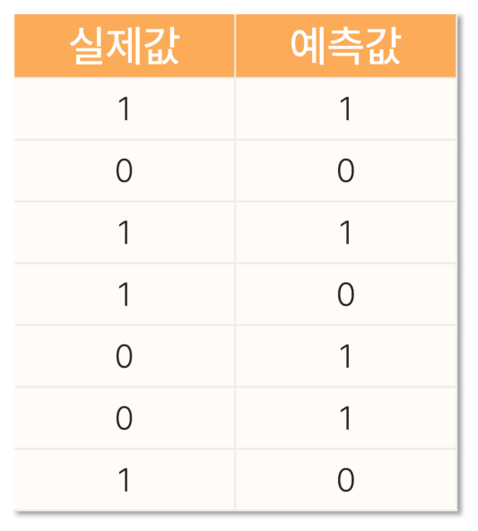

# 12. 머신러닝개요1

> 원본 PDF 범위: 320~345쪽 · PDF 설명 순서에 따라 재작성

## 주요 단어 먼저 보기

| 주요 단어 | 뜻 |
|---|---|
| 머신러닝 | 데이터에서 규칙을 학습해 새 결과를 예측 |
| 지도학습 | 정답 y가 있는 데이터로 학습 |
| 비지도학습 | 정답 없이 데이터 구조를 학습 |
| 회귀 | 연속형 수치를 예측 |
| 분류 | 범주를 예측 |
| 독립변수 X | 예측에 사용하는 입력 특성 |
| 종속변수 y | 예측하려는 정답 |
| 평가지표 | 모델 예측의 품질을 수치화 |
| 혼동행렬 | 실제·예측 클래스 조합의 개수표 |

> **단원 시작법:** 주요 단어의 뜻을 먼저 읽고, 아래 PDF 절 순서대로 학습한다.

<!-- TOC START -->
## 목차

- [1. 머신러닝의 개념](#1-머신러닝의-개념)
  - [머신러닝의 개념과 용어](#머신러닝의-개념과-용어)
- [2. 머신러닝의 분류](#2-머신러닝의-분류)
  - [머신러닝 문제 유형](#머신러닝-문제-유형)
- [3. 종속변수와 독립변수](#3-종속변수와-독립변수)
  - [독립변수와 종속변수](#독립변수와-종속변수)
- [4. 종속변수 평가지표](#4-종속변수-평가지표)
  - [회귀 평가지표](#회귀-평가지표)
  - [분류 평가지표와 혼동행렬](#분류-평가지표와-혼동행렬)
- [5. 교재 문제와 해설](#5-교재-문제와-해설)
  - [문제 바로가기](#문제-바로가기)
  - [문제 1. 지도학습과 비지도학습](#문제-1-지도학습과-비지도학습)
  - [문제 2. 비지도학습](#문제-2-비지도학습)
  - [문제 3. RMSE](#문제-3-rmse)
  - [문제 4. 정밀도와 재현율](#문제-4-정밀도와-재현율)
  - [문제 5. F1-Score 계산](#문제-5-f1-score-계산)
- [보충 학습](#보충-학습)
  - [일반화](#일반화)
  - [모델의 구성요소](#모델의-구성요소)
  - [데이터 분할](#데이터-분할)
  - [교차검증 변형](#교차검증-변형)
  - [데이터셋 이동](#데이터셋-이동)
  - [학습 파이프라인](#학습-파이프라인)
  - [보강: 기준선부터 만들기](#보강-기준선부터-만들기)
  - [체크포인트](#체크포인트)
- [시험 직전 암기](#시험-직전-암기)
<!-- TOC END -->

## 1. 머신러닝의 개념

> **PDF 323쪽**

> **암기 한 줄:** 머신러닝은 데이터에서 규칙을 학습해 새 데이터의 결과를 예측한다.

### 머신러닝의 개념과 용어

머신러닝(기계학습)은 컴퓨터가 데이터로부터 학습하도록 하는 알고리즘과 기술을 개발하는 분야다. 교재는 추정·추론에 무게를 두는 전통 통계와 대비해 머신러닝이 예측에 주로 초점을 맞춘다고 설명한다. 데이터에서 비교적 일반화된 수식이나 규칙을 가진 모델을 만들고 평가지표로 성능을 확인한다.

- 모델: 현상을 설명하거나 예측하기 위한 수식 또는 규칙.
- 모델 튜닝: 모델의 성능 향상이나 해석을 위해 취하는 일련의 조치.
- 하이퍼파라미터: 모델의 성능이나 동작 원리에 큰 영향을 미치는 사전 설정값.

교재의 에어프라이어 비유에서 ‘호빵의 맛’은 평가 기준, ‘조리법’은 모델, ‘조리 온도와 시간’은 하이퍼파라미터다.

## 2. 머신러닝의 분류

> **PDF 324~326쪽**

> **암기 한 줄:** 정답이 있으면 지도, 없으면 비지도, 보상으로 배우면 강화학습이다.

### 머신러닝 문제 유형

- 지도학습: 입력 $X$와 정답 $y$로 함수 관계를 학습
  - 회귀: 연속형 값을 예측
  - 분류: 범주를 예측
- 비지도학습: 정답 없이 구조를 발견
  - 군집, 차원축소, 이상탐지
- 강화학습: 행동과 보상의 상호작용으로 정책을 학습

지도학습은 입력과 정답 레이블의 관계를 학습하므로 객관적인 성능평가가 가능하다. 종속변수가 연속형이면 회귀, 범주형이면 분류를 사용한다. 비지도학습은 레이블 없이 데이터의 관계와 구조를 탐색하므로 평가와 해석이 상대적으로 주관적일 수 있으며 대표 예가 군집분석이다.

## 3. 종속변수와 독립변수

> **PDF 327~329쪽**

> **암기 한 줄:** X는 입력 특성, y는 예측하려는 정답이다.

### 독립변수와 종속변수

- 종속변수 $Y$: 측정·예측하려는 결과(outcome, target). 지도학습 데이터에는 종속변수가 필요하고 학습 레이블의 결측을 처리해야 한다.
- 독립변수 $X$: 예측에 사용하는 입력(feature, explanatory variable). 범주형이면 원-핫 인코딩 등이 필요하고 결측·이상치도 모델링 전에 처리한다.

‘오늘 치킨을 주문할지’를 예측한다면 주문 여부가 종속변수이고, 광고 노출 횟수와 마지막 주문 후 경과일 등이 독립변수다. 관측 데이터의 독립변수를 곧바로 인과변수라고 단정해서는 안 된다.

## 4. 종속변수 평가지표

> **PDF 330~335쪽**

> **암기 한 줄:** 회귀는 오차 크기, 분류는 혼동행렬에서 목적에 맞는 지표를 고른다.

### 회귀 평가지표

실제값 $y_i$와 예측값 $\hat y_i$의 오차를 사용하는 MSE, MAE, RMSE, MAPE는 일반적으로 작을수록 좋다.

$$
MSE=\frac1n\sum(y_i-\hat y_i)^2,\quad RMSE=\sqrt{MSE},\quad MAE=\frac1n\sum|y_i-\hat y_i|
$$

$$MAPE=\frac{100}{n}\sum\left|\frac{y_i-\hat y_i}{y_i}\right|$$

MSE와 RMSE는 큰 오차에 민감하고, RMSE는 목표변수와 단위가 같다. MAE는 큰 오차에 상대적으로 덜 민감하다. MAPE는 실제값이 0이면 정의되지 않고 0에 가까우면 과도하게 커진다.
  - S(Square=제곱) 하니 오차가 뻥튀기 되어서 큰 오차에 민감하다.

### 분류 평가지표와 혼동행렬

| 실제/예측 | 양성 예측 | 음성 예측 |
|---|---:|---:|
| 실제 양성 | TP | FN(2종 오류) |
| 실제 음성 | FP(1종 오류) | TN |

$$Accuracy=\frac{TP+TN}{TP+TN+FP+FN}$$

$$Precision=\frac{TP}{TP+FP},\quad Recall=\frac{TP}{TP+FN}$$

$$Specificity=\frac{TN}{TN+FP},\quad F1=2\frac{Precision\cdot Recall}{Precision+Recall}$$

정밀도는 ‘양성 예측 중 실제 양성’, 재현율(민감도)은 ‘실제 양성 중 찾아낸 비율’이다. 음성예측도는 $TN/(TN+FN)$이다. 불균형 자료에서는 정확도만 보지 않고 정밀도·재현율·F1을 함께 확인한다.

## 5. 교재 문제와 해설

> **원문 단원 말미 문제 전체 수록**

> 먼저 문제와 보기를 풀고, **정답 및 선택지별 해설 보기**를 펼쳐 확인하세요. 일반 4지선다 문항은 ①~④를 모두 해설하며, 원문이 2지선다인 경우에는 실제 보기만 수록합니다.

### 문제 바로가기

| 문제 | 주제 | 관련 목차 | PDF |
|---:|---|---|---:|
| [1](#ch12-q1) | 지도학습과 비지도학습 | [2. 머신러닝의 분류](#2-머신러닝의-분류) · [3. 종속변수와 독립변수](#3-종속변수와-독립변수) | 336쪽 |
| [2](#ch12-q2) | 비지도학습 | [2. 머신러닝의 분류](#2-머신러닝의-분류) | 338쪽 |
| [3](#ch12-q3) | RMSE | [4. 종속변수 평가지표](#4-종속변수-평가지표) | 340쪽 |
| [4](#ch12-q4) | 정밀도와 재현율 | [4. 종속변수 평가지표](#4-종속변수-평가지표) | 342쪽 |
| [5](#ch12-q5) | F1-Score 계산 | [4. 종속변수 평가지표](#4-종속변수-평가지표) | 344쪽 |

### 문제 1. 지도학습과 비지도학습

**출처:** PDF 336쪽  
**관련 목차:** [2. 머신러닝의 분류](#2-머신러닝의-분류) · [3. 종속변수와 독립변수](#3-종속변수와-독립변수)

지도학습과 비지도학습을 구분하는 핵심 기준으로 가장 적절한 것은?

1. 사용하는 데이터의 크기와 복잡성
2. 학습에 사용하는 알고리즘의 종류
3. 학습 데이터에 정답 레이블의 존재 여부
4. 모델의 예측 정확도와 성능

정답 및 선택지별 해설 보기

**정답: ③ 학습 데이터에 정답 레이블의 존재 여부**

- **① 오답:** 데이터가 크거나 복잡해도 레이블이 있으면 지도학습, 없으면 비지도학습일 수 있다.
- **② 오답:** 알고리즘 이름보다 학습에 정답 신호를 제공하는지가 분류 기준이다.
- **③ 정답:** 목표값 y가 주어진 데이터로 입력-정답 관계를 배우면 지도학습이고, y 없이 구조를 찾으면 비지도학습이다.
- **④ 오답:** 정확도는 학습 후 평가 결과이며 학습 유형을 정의하는 기준이 아니다.

### 문제 2. 비지도학습

**출처:** PDF 338쪽  
**관련 목차:** [2. 머신러닝의 분류](#2-머신러닝의-분류)

비지도학습에 대한 설명으로 가장 적절한 것은?

1. 입력 데이터와 정답 레이블이 모두 주어진 상태에서 학습하는 방법
2. 정답 레이블 없이 데이터의 숨겨진 패턴이나 구조를 찾는 학습 방법
3. 행동에 따른 보상을 통해 최적 전략을 학습하는 방법
4. 예측오차를 최소화하여 연속 수치값을 예측하는 방법

정답 및 선택지별 해설 보기

**정답: ② 정답 레이블 없이 데이터의 숨겨진 패턴이나 구조를 찾는 학습 방법**

- **① 오답:** 입력과 정답 쌍으로 학습하는 것은 지도학습이다.
- **② 정답:** 군집·차원축소처럼 레이블 없이 데이터 내부의 그룹이나 잠재 구조를 발견한다.
- **③ 오답:** 상태·행동·보상을 통해 정책을 배우는 것은 강화학습이다.
- **④ 오답:** 연속 목표값을 예측하는 회귀는 지도학습이다.

### 문제 3. RMSE

**출처:** PDF 340쪽  
**관련 목차:** [4. 종속변수 평가지표](#4-종속변수-평가지표)

회귀 모델 평가지표 중 평균제곱근오차(RMSE)의 설명으로 옳은 것은?

1. 예측값과 실제값 차이의 절댓값을 평균낸 지표
2. 예측값과 실제값의 차이를 제곱해 평균한 뒤 제곱근을 취한 지표
3. 모델이 설명하는 분산의 비율을 나타내는 지표
4. 예측오차의 분산을 표준편차로 나눈 지표

정답 및 선택지별 해설 보기

**정답: ② 예측값과 실제값의 차이를 제곱해 평균한 뒤 제곱근을 취한 지표**

- **① 오답:** 절대오차의 평균은 MAE다.
- **② 정답:** RMSE=√[(1/n)Σ(yᵢ−ŷᵢ)²]로 큰 오차에 더 큰 벌점을 주고 원래 목표변수 단위를 유지한다.
- **③ 오답:** 설명된 분산의 비율은 결정계수 R²다.
- **④ 오답:** RMSE는 오차 제곱의 평균에 제곱근을 취하며 별도로 표준편차로 나누지 않는다.

### 문제 4. 정밀도와 재현율

**출처:** PDF 342쪽  
**관련 목차:** [4. 종속변수 평가지표](#4-종속변수-평가지표)

이진 분류에서 정밀도(Precision)와 재현율(Recall)에 대한 설명으로 옳은 것은?

1. 정밀도는 특이도와 같은 개념이고, 재현율은 민감도와 다른 개념이다.
2. 정밀도와 재현율은 모두 전체 예측 중 올바르게 예측한 비율이다.
3. 정밀도는 실제 양성 중 양성 예측 비율이고, 재현율은 양성 예측 중 실제 양성 비율이다.
4. 정밀도는 양성으로 예측한 것 중 실제 양성 비율이고, 재현율은 실제 양성 중 양성으로 예측한 비율이다.

정답 및 선택지별 해설 보기

**정답: ④ 정밀도는 양성으로 예측한 것 중 실제 양성 비율이고, 재현율은 실제 양성 중 양성으로 예측한 비율이다.**

- **① 오답:** 정밀도=TP/(TP+FP), 특이도=TN/(TN+FP)로 분모가 다르다. 재현율은 민감도와 같은 개념이다.
- **② 오답:** 전체 예측 중 정답 비율은 정확도다. 정밀도와 재현율은 양성 클래스에 초점을 둔다.
- **③ 오답:** 정밀도와 재현율의 정의를 서로 바꿔 썼다.
- **④ 정답:** Precision=TP/(TP+FP), Recall=TP/(TP+FN)이다. ‘예측 양성 중 진짜’와 ‘실제 양성 중 찾아낸 것’으로 외운다.

### 문제 5. F1-Score 계산

**출처:** PDF 344쪽  
**관련 목차:** [4. 종속변수 평가지표](#4-종속변수-평가지표)

제시된 실제값·예측값으로 계산한 F1-Score는?

1. 0.5
2. 0.6
3. 0.7
4. 0.8

정답 및 선택지별 해설 보기

**정답: ① 0.5**

- **① 정답:** TP=2, FP=2, FN=2이므로 정밀도=2/4=0.5, 재현율=2/4=0.5, F1=2PR/(P+R)=0.5다.
- **② 오답:** 0.6은 정밀도와 재현율의 조화평균 계산 결과가 아니다. 두 값이 모두 0.5면 조화평균도 0.5다.
- **③ 오답:** 전체 7개 중 정답 3개라는 정확도와도 다르며, F1은 TN을 직접 사용하지 않는다.
- **④ 오답:** FP와 FN이 각각 2개라 양성 예측 품질이 0.8까지 높을 수 없다.

## 보충 학습

> 원문 절 순서를 모두 학습한 뒤 이해와 문제 적용력을 높이는 확장 내용이다.

### 일반화

목표는 학습 데이터를 외우는 것이 아니라 보지 못한 데이터에서 잘 작동하는 모델을 만드는 것이다.

- 과소적합: 모델이 너무 단순해 학습·평가 성능 모두 낮음
- 과적합: 학습 성능은 높지만 평가 성능이 크게 낮음
- 편향: 모델 가정이 지나치게 단순해 생기는 체계적 오차
- 분산: 학습 데이터 변화에 예측이 민감하게 바뀌는 정도

### 모델의 구성요소

- 가설함수 $f_\theta(X)$: 입력을 예측으로 바꾸는 함수
- 파라미터 $\theta$: 데이터에서 학습되는 계수·구조
- 하이퍼파라미터: 학습 전에 설정하는 복잡도·규제 값
- 손실함수: 한 관측치 예측의 나쁨을 수치화
- 목적함수: 평균 손실에 규제항 등을 더한 학습 기준

$$
\hat\theta=\arg\min_\theta\left[\frac1n\sum_{i=1}^nL(y_i,f_\theta(x_i))+\lambda\Omega(\theta)\right]
$$

규제강도 $\lambda$가 커지면 일반적으로 모델 복잡도는 낮아진다.

### 데이터 분할

- 학습 세트(train): 모델 파라미터 학습
- 검증 세트(validation): 최종평가 전에 학습 상태를 점검하고 하이퍼파라미터를 선택
- 평가·테스트 세트(test): 최종 일반화 성능의 한 번성 평가

k-fold 교차검증은 데이터를 k개 폴드로 나누고 검증 폴드를 바꿔가며 성능을 평균한다.

각 관측치는 한 번씩 검증에 사용된다. 시계열처럼 순서가 중요한 데이터에는 무작위 k-fold 대신 시간 순서를 보존하는 분할을 사용한다.

### 교차검증 변형

- StratifiedKFold: 분류 클래스 비율 보존
- GroupKFold: 동일 개체가 학습·검증에 동시에 들어가지 않음
- TimeSeriesSplit: 과거로 학습하고 이후 구간으로 검증
- Nested CV: 바깥 루프에서 성능평가, 안쪽 루프에서 튜닝

하이퍼파라미터 탐색을 수행한 동일 검증점수는 선택 편향 때문에 낙관적일 수 있다. 엄격한 성능 추정에는 독립 테스트 또는 nested CV를 사용한다.

### 데이터셋 이동

학습과 배포 환경의 분포가 달라지면 성능이 하락한다.

- 공변량 이동: $P(X)$ 변화
- 사전확률 이동: $P(Y)$ 변화
- 개념 이동: $P(Y\mid X)$ 변화

배포 후에는 입력 분포, 예측확률, 실제 성능을 시간에 따라 모니터링한다.

### 학습 파이프라인

1. 문제·평가지표 정의
2. 데이터 품질 점검
3. 학습·검증·테스트 분리
4. 전처리와 특성 생성
5. 기준 모델 구축
6. 교차검증과 튜닝
7. 테스트 평가와 오류분석

### 보강: 기준선부터 만들기

- 회귀: 평균 또는 중앙값 예측
- 분류: 최빈 클래스 또는 층화 무작위 예측

복잡한 모델이 기준선을 이기지 못한다면 데이터·지표·분할 설계를 먼저 점검한다.

### 체크포인트

- 테스트 세트는 모델 선택에 반복 사용하지 않는다.
- 교차검증 전처리는 각 fold의 학습 부분에서만 적합한다.
- 목표변수 유형이 회귀·분류 선택의 출발점이다.

## 시험 직전 암기

- 머신러닝은 데이터에서 규칙을 학습해 새 데이터의 결과를 예측한다.
- 정답이 있으면 지도, 없으면 비지도, 보상으로 배우면 강화학습이다.
- X는 입력 특성, y는 예측하려는 정답이다.
- 회귀는 오차 크기, 분류는 혼동행렬에서 목적에 맞는 지표를 고른다.
