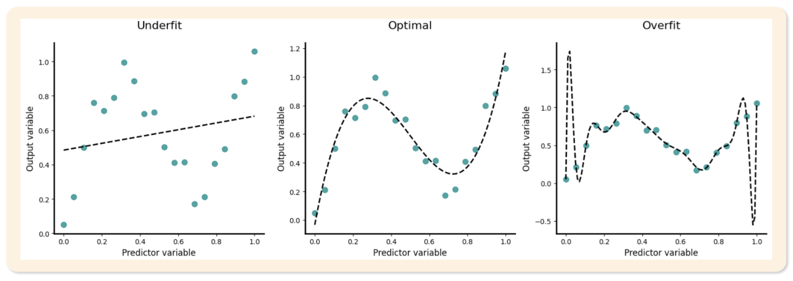
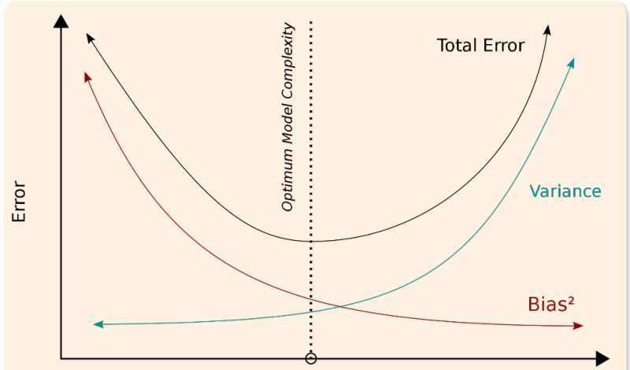
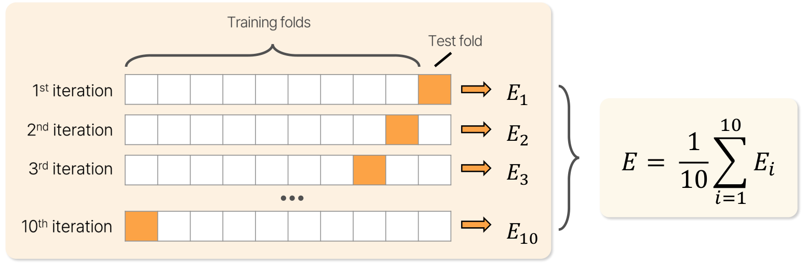
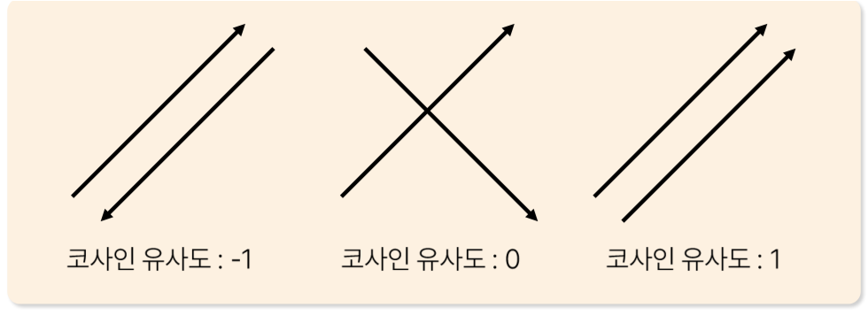
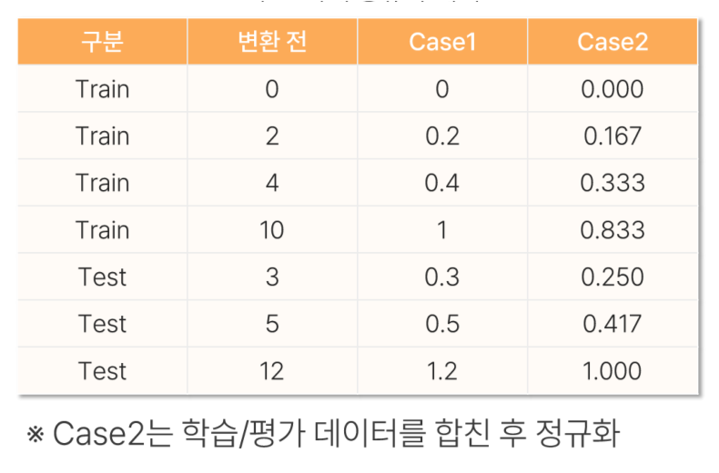
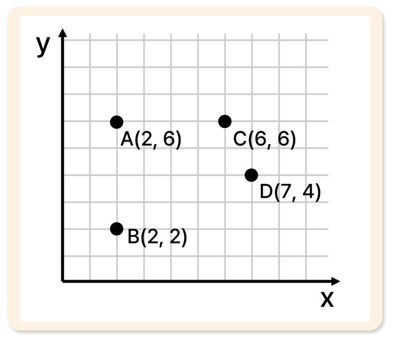

# 13. 머신러닝개요2

> 원본 PDF 범위: 346~370쪽 · PDF 설명 순서에 따라 재작성

## 주요 단어 먼저 보기

| 주요 단어 | 뜻 |
|---|---|
| 과적합 | 학습 데이터에는 좋지만 새 데이터에 약한 상태 |
| 과소적합 | 모델이 단순해 학습 데이터 패턴도 못 잡는 상태 |
| 일반화 | 새 데이터에서도 성능을 유지하는 능력 |
| 편향 | 지나치게 단순한 모델에서 생기는 체계적인 오차 |
| 분산 | 학습 데이터가 바뀔 때 모델 결과가 흔들리는 정도 |
| 홀드아웃 | 데이터를 한 번 학습·검증·평가 세트로 분할하는 방법 |
| 교차검증 | 평가 폴드를 바꾸며 여러 번 학습·평가하는 방법 |
| 학습세트 | 모델을 적합하는 데이터 |
| 검증세트 | 모델·파라미터를 선택하는 데이터 |
| 시험세트 | 최종 성능을 한 번 평가하는 데이터 |
| 거리 | 두 관측값이 얼마나 떨어져 있는지 나타낸 수치 |
| 유사도 | 두 관측값이 얼마나 닮았는지 나타낸 수치 |
| 민코프스키 거리 | 맨해튼·유클리드 거리를 하나의 차수로 일반화한 거리 |
| 마할라노비스 거리 | 변수의 분산과 상관관계를 보정한 거리 |
| 코사인 유사도 | 벡터 크기보다 방향의 유사성을 보는 지표 |
| 자카드 유사도 | 두 집합의 합집합 중 교집합 비율 |
| 정규화 | 변수 척도 차이를 줄이는 변환 |
| 데이터 누출 | 평가 데이터의 정보가 학습 과정에 들어가는 문제 |

> **단원 시작법:** 주요 단어의 뜻을 먼저 읽고, 아래 PDF 절 순서대로 학습한다.

<!-- TOC START -->
## 목차

- [1. 과적합과 과소적합](#1-과적합과-과소적합)
  - [과적합·과소적합·적정 적합](#과적합과소적합적정-적합)
  - [편향-분산 균형](#편향-분산-균형)
- [2. 모델링 데이터의 분할과 평가](#2-모델링-데이터의-분할과-평가)
  - [홀드아웃](#홀드아웃)
  - [k-fold 교차검증](#k-fold-교차검증)
- [3. 거리 및 유사도 계산](#3-거리-및-유사도-계산)
  - [맨해튼 거리](#맨해튼-거리)
  - [유클리드 거리](#유클리드-거리)
  - [민코프스키 거리](#민코프스키-거리)
  - [마할라노비스 거리](#마할라노비스-거리)
  - [코사인 유사도](#코사인-유사도)
  - [자카드 유사도](#자카드-유사도)
- [4. 머신러닝에서의 정규화](#4-머신러닝에서의-정규화)
- [5. 교재 문제와 해설](#5-교재-문제와-해설)
  - [문제 바로가기](#문제-바로가기)
  - [문제 1. 편향-분산 균형](#문제-1-편향-분산-균형)
  - [문제 2. 교차검증](#문제-2-교차검증)
  - [문제 3. 코사인 유사도](#문제-3-코사인-유사도)
  - [문제 4. 코사인 유사도 비교](#문제-4-코사인-유사도-비교)
  - [문제 5. 정규화와 데이터 누출](#문제-5-정규화와-데이터-누출)
- [보충 학습](#보충-학습)
  - [7. 보강 내용](#7-보강-내용)
  - [8. 핵심 점검](#8-핵심-점검)
- [시험 직전 암기](#시험-직전-암기)
<!-- TOC END -->

## 1. 과적합과 과소적합

> **PDF 347~348쪽**

> **암기 한 줄:** 훈련도 못 맞추면 과소적합, 훈련만 잘 맞추면 과적합이다.

### 과적합·과소적합·적정 적합

- 과소적합(underfitting): 모델이 지나치게 단순해 학습 데이터의 구조도 충분히 배우지 못한 상태. 학습·평가 성능이 모두 좋지 않다.
- 과적합(overfitting): 모델이 학습 데이터에 지나치게 맞춰져 새 데이터에서 성능이 낮아지는 상태. 학습 성능과 평가 성능의 격차가 크다.
- 적정 적합: 필요한 패턴은 학습하되 표본의 우연한 잡음까지 외우지 않아 일반화 성능이 좋은 상태다.

*그림: 지나치게 단순한 모델, 일반화되는 모델, 학습자료의 잡음까지 따라가는 모델 — 원문 슬라이드의 비교 그래프만 잘라 수록.*

| 상태 | 모델 복잡도 | 학습오차 | 검증·평가오차 | 핵심 문제 |
|---|---|---|---|---|
| 과소적합 | 너무 낮음 | 큼 | 큼 | 패턴을 배우지 못함 |
| 적정 적합 | 적절함 | 적절히 작음 | 가장 작음 | 일반화가 좋음 |
| 과적합 | 너무 높음 | 매우 작음 | 커짐 | 잡음까지 외움 |

### 편향-분산 균형

- 편향(bias): 지나치게 단순한 가정 때문에 생기는 체계적 오차로 과소적합과 연결된다.
- 분산(variance): 학습 데이터가 조금 바뀔 때 모델 결과가 크게 달라지는 정도로, 복잡한 모델의 과적합과 연결된다.
- 불가피한 오차(irreducible error): 관측 잡음 등 모델이 줄일 수 없는 부분이다.

예측오차는 개념적으로 다음과 같이 나뉜다.

$$
\operatorname{E}[\text{예측오차}]
=\text{편향}^2+\text{분산}+\text{불가피한 오차}
$$

복잡도를 높이면 대체로 편향은 감소하지만 분산은 증가한다. 두 값을 동시에 0으로 만들기 어렵기 때문에 검증오차가 가장 작은 타협점을 찾는다.

*그림: 복잡도가 증가할수록 편향은 감소하고 분산은 증가하며 총오차는 중간에서 최소가 됨 — 원문 슬라이드의 곡선만 잘라 수록.*

> **암기:** `단순→고편향→과소적합`, `복잡→고분산→과적합`.
 
## 2. 모델링 데이터의 분할과 평가

> **PDF 349~351쪽**

> **암기 한 줄:** 학습은 적합, 검증은 선택, 시험은 마지막 일반화 평가에 한 번 쓴다.

### 홀드아웃

데이터를 서로 겹치지 않는 학습·평가 세트로 한 번 나누는 방법이다. 교재는 두 세트일 때 7:3 또는 8:2, 세 세트일 때 학습:검증:평가를 5:3:2로 나누는 예를 들지만 비율에 절대적인 정답은 없다. 검증 세트는 반복적인 모델 튜닝에, 평가 세트는 최종평가에 사용한다.

| 분할 | 교재의 대표 비율 | 각 데이터의 역할 |
|---|---|---|
| 학습·평가 2분할 | 7:3 또는 8:2 | 학습 후 미사용 자료로 평가 |
| 학습·검증·평가 3분할 | 5:3:2 | 학습, 반복 튜닝, 최종평가 |

분할비율에는 정답이 없으며 전체 데이터 크기, 클래스 비율, 튜닝 필요성에 따라 정한다.

### k-fold 교차검증

데이터를 보통 5개 또는 10개의 중복 없는 fold로 나누고, 한 fold를 평가용으로 두며 나머지로 학습한다. 평가 fold를 바꾸어 k번 반복하고 지표를 평균해 모델의 평균적인 성능을 추정한다.

같은 설정의 성능 변동을 재려면 각 fold에서 모델·하이퍼파라미터·독립/종속변수는 고정하고 학습·평가 데이터만 바꾼다. 하이퍼파라미터 후보를 비교할 때는 후보마다 동일한 교차검증 절차를 적용한다.

*그림: 한 폴드씩 검증용으로 바꾸어 모든 관측이 한 번씩 검증에 쓰이는 구조.*

교재의 10-fold 예에서는 각 반복의 평가지표를 $E_1,\ldots,E_{10}$이라 하고 평균을

$$
E=\frac{1}{10}\sum_{i=1}^{10}E_i
$$

로 집계한다. 데이터는 기본적으로 폴드끼리 겹치지 않도록 비복원 방식으로 나눈다.

> **주의:** 교차검증 중 데이터 폴드만 바꾸고 비교하려는 모델 설정은 고정해야 성능 차이가 표본분할 때문인지 판단할 수 있다.

## 3. 거리 및 유사도 계산

> **PDF 352~359쪽**

> **암기 한 줄:** 거리는 작을수록 가깝고, 유사도는 클수록 닮았다.

### 맨해튼 거리

City Block 또는 Taxicab 거리라고도 하며 좌표별 절댓값 차이를 더한다.

$$d(\mathbf p,\mathbf q)=\sum_{i=1}^{n}|p_i-q_i|$$

### 유클리드 거리

n차원 공간 두 점 사이의 직선 최단거리다.

$$d(\mathbf p,\mathbf q)=\sqrt{\sum_{i=1}^{n}(p_i-q_i)^2}$$

교재 예시에서 `(나이, 연소득, 경력)`이 `(28,5000,5)`와 `(40,13000,9)`라면 맨해튼 거리는 8016, 유클리드 거리는 약 8000.01이다. 연소득의 큰 단위가 거리를 사실상 지배하므로 정규화가 필요하다는 점도 읽어야 한다.

$$
d_1=|28-40|+|5000-13000|+|5-9|=12+8000+4=8016
$$

$$
d_2=\sqrt{(28-40)^2+(5000-13000)^2+(5-9)^2}
\approx8000.01
$$

### 민코프스키 거리

$$d_r(\mathbf x,\mathbf y)=\left(\sum_j|x_j-y_j|^r\right)^{1/r}$$

$r=1$이면 맨해튼, $r=2$이면 유클리드 거리이며, $r\to\infty$이면 좌표별 차이의 최댓값인 체비쇼프 거리로 수렴한다.

### 마할라노비스 거리

$$d_M(\mathbf a,\mathbf b)=\sqrt{(\mathbf a-\mathbf b)^T\Sigma^{-1}(\mathbf a-\mathbf b)}$$

공분산행렬 $\Sigma$로 변수의 분산과 상관관계를 보정한다. 단위나 스케일의 영향이 줄고, 공분산 기준으로 표준화된 공간에서는 유클리드 거리처럼 해석할 수 있다.

### 코사인 유사도

$$similarity(\mathbf A,\mathbf B)=\frac{\mathbf A\cdot\mathbf B}{\|\mathbf A\|\|\mathbf B\|}=\cos\theta$$

벡터 크기보다 방향의 유사성을 측정한다. 같은 방향이면 1, 직교하면 0, 완전히 반대 방향이면 -1이다. 거리라기보다 유사도다.

*그림: 반대 방향은 -1, 직교는 0, 같은 방향은 1 — 원문 슬라이드의 방향 도식만 잘라 수록.*

각 벡터를 길이 1의 단위벡터로 바꾼 뒤 내적한 값과 같으므로 문서의 단어 빈도처럼 크기보다 구성 방향이 중요한 자료에 유용하다.

### 자카드 유사도

$$J(A,B)=\frac{|A\cap B|}{|A\cup B|}=\frac{|A\cap B|}{|A|+|B|-|A\cap B|}$$

두 집합의 합집합에서 교집합이 차지하는 비율이다. 교집합이 없으면 0, 두 집합이 같으면 1이다.

## 4. 머신러닝에서의 정규화

> **PDF 360쪽**

> **암기 한 줄:** 거리·경사 기반 모델은 변수 스케일 차이에 특히 민감하다.

거리 기반 알고리즘은 단위가 큰 변수가 결과를 지배할 수 있으므로 정규화나 표준화가 중요하다. 최소-최대 정규화는 ***학습 데이터의 최솟값과 최댓값***으로

$$x'=\frac{x-x_{min,train}}{x_{max,train}-x_{min,train}}$$

를 계산한다. ***평가 데이터도 반드시 학습 데이터에서 구한 규칙으로 변환***한다. 학습·평가 데이터를 합쳐 최솟값과 최댓값을 구하면 평가 정보가 학습 과정에 들어가는 데이터 누출이다. 평가값이 학습 범위를 벗어나면 변환 결과가 0 미만 또는 1 초과가 될 수 있으며 이는 오류가 아니다.

*그림: Case1은 학습 최솟값 0·최댓값 10만 사용하고, Case2는 평가값 12까지 합쳐 정규화한 잘못된 사례 — 원문 슬라이드의 표만 잘라 수록.*

| 원값 | 구분 | Case1: 학습 기준 | Case2: 전체 합산 기준 |
|---:|---|---:|---:|
| 0 | Train | 0.0 | 0.000 |
| 2 | Train | 0.2 | 0.167 |
| 4 | Train | 0.4 | 0.333 |
| 10 | Train | 1.0 | 0.833 |
| 3 | Test | 0.3 | 0.250 |
| 5 | Test | 0.5 | 0.417 |
| 12 | Test | 1.2 | 1.000 |

Case1에서 테스트값 12가 1.2가 되는 것은 정상이다. Case2처럼 테스트 최대값 12를 미리 사용하면 평가정보가 변환 규칙에 들어가므로 데이터 누출이다.

## 5. 교재 문제와 해설

> **원문 단원 말미 문제 전체 수록**

> 먼저 문제와 보기를 풀고, **정답 및 선택지별 해설 보기**를 펼쳐 확인하세요. 일반 4지선다 문항은 ①~④를 모두 해설하며, 원문이 2지선다인 경우에는 실제 보기만 수록합니다.

### 문제 바로가기

| 문제 | 주제 | 관련 목차 | PDF |
|---:|---|---|---:|
| [1](#ch13-q1) | 편향-분산 균형 | [1. 과적합과 과소적합](#1-과적합과-과소적합) | 361쪽 |
| [2](#ch13-q2) | 교차검증 | [2. 모델링 데이터의 분할과 평가](#2-모델링-데이터의-분할과-평가) | 363쪽 |
| [3](#ch13-q3) | 코사인 유사도 | [3. 거리 및 유사도 계산](#3-거리-및-유사도-계산) | 365쪽 |
| [4](#ch13-q4) | 코사인 유사도 비교 | [3. 거리 및 유사도 계산](#3-거리-및-유사도-계산) | 367쪽 |
| [5](#ch13-q5) | 정규화와 데이터 누출 | [4. 머신러닝에서의 정규화](#4-머신러닝에서의-정규화) | 369쪽 |

### 문제 1. 편향-분산 균형

**출처:** PDF 361쪽  
**관련 목차:** [1. 과적합과 과소적합](#1-과적합과-과소적합)

편향-분산 균형(Bias-Variance Tradeoff)에 대한 설명으로 올바른 것은?

1. 편향이 클수록 과대적합이 발생한다.
2. 분산이 클수록 과소적합이 발생한다.
3. 편향과 분산을 동시에 극단적으로 줄일 수 없다.
4. 분산이 낮은 상태는 모델이 데이터 변화에 매우 민감한 상태이다.

정답 및 선택지별 해설 보기

**정답: ③ 편향과 분산을 동시에 극단적으로 줄일 수 없다.**

- **① 오답:** 큰 편향은 모델이 지나치게 단순한 과소적합과 연결된다.
- **② 오답:** 큰 분산은 훈련 자료 변화에 민감해지는 과대적합과 연결된다.
- **③ 정답:** 일반적으로 복잡도를 높여 편향을 줄이면 분산이 커지고, 단순화해 분산을 줄이면 편향이 커지는 상충관계가 있다.
- **④ 오답:** 데이터 변화에 민감한 상태는 분산이 높은 상태다.

### 문제 2. 교차검증

**출처:** PDF 363쪽  
**관련 목차:** [2. 모델링 데이터의 분할과 평가](#2-모델링-데이터의-분할과-평가)

교차검증(Cross Validation)에 대한 설명으로 틀린 것은?

1. 교차검증 수행 시 하이퍼파라미터를 매번 변경해야 한다.
2. 데이터 분할은 기본적으로 비복원 추출을 실시한다.
3. 학습·평가 데이터를 바꾸어 여러 번 모델 성능을 평가한다.
4. 분할한 데이터 그룹 중 하나는 평가, 나머지는 학습에 사용한다.

정답 및 선택지별 해설 보기

**정답: ① 교차검증 수행 시 하이퍼파라미터를 매번 변경해야 한다.**

- **① 정답:** 정답(틀린 설명). 한 하이퍼파라미터 조합의 성능을 비교할 때는 폴드만 바꾸고 설정은 고정한다. 튜닝은 별도의 후보 조합 간 검증이다.
- **② 오답:** 정답이 아님. 한 회차에서 관측값은 중복 없이 하나의 폴드에 속한다.
- **③ 오답:** 정답이 아님. 평가 폴드를 순환시켜 데이터 분할 우연성에 덜 의존하는 평균 성능을 얻는다.
- **④ 오답:** 정답이 아님. k-fold에서는 매 회 k−1개 폴드를 학습, 남은 1개를 검증에 사용한다.

### 문제 3. 코사인 유사도

**출처:** PDF 365쪽  
**관련 목차:** [3. 거리 및 유사도 계산](#3-거리-및-유사도-계산)

코사인 유사도(Cosine Similarity)에 대한 설명으로 올바른 것은?

1. 벡터의 크기를 고려하여 유사도를 측정한다.
2. 두 벡터가 완전히 같은 방향일 때 0의 값을 가진다.
3. 벡터 간의 유클리드 거리를 측정하는 방법이다.
4. 두 벡터가 90°의 각을 이룰 때 0의 값을 가진다.

정답 및 선택지별 해설 보기

**정답: ④ 두 벡터가 90°의 각을 이룰 때 0의 값을 가진다.**

- **① 오답:** 각 벡터의 크기로 내적을 나누므로 크기보다 방향을 비교한다.
- **② 오답:** 같은 방향이면 cos0°=1이다.
- **③ 오답:** 코사인 유사도는 두 벡터 사이 각도의 코사인값이며 직선거리 자체가 아니다.
- **④ 정답:** 직교하면 내적이 0이고 cos90°=0이다.

### 문제 4. 코사인 유사도 비교

**출처:** PDF 367쪽  
**관련 목차:** [3. 거리 및 유사도 계산](#3-거리-및-유사도-계산)

그림의 점 A(2,6), B(2,2), C(6,6), D(7,4)로 만든 두 벡터 쌍 중 코사인 유사도가 가장 큰 것은?

1. 벡터 AB, AC
2. 벡터 AC, BD
3. 벡터 DB, AB
4. 벡터 DC, CD

정답 및 선택지별 해설 보기

**정답: ② 벡터 AC, BD**

- **① 오답:** AB=(0,−4), AC=(4,0)은 서로 직교해 코사인 유사도가 0이다.
- **② 정답:** AC=(4,0), BD=(5,2)는 방향이 가장 비슷해 cos≈20/(4√29)≈0.9285로 가장 크다.
- **③ 오답:** DB=(−5,−2)와 AB=(0,−4)는 일부 방향만 같아 ②보다 유사도가 작다.
- **④ 오답:** DC=(−1,2)와 CD=(1,−2)는 정반대 방향이라 코사인 유사도가 −1이다.

### 문제 5. 정규화와 데이터 누출

**출처:** PDF 369쪽  
**관련 목차:** [4. 머신러닝에서의 정규화](#4-머신러닝에서의-정규화)

데이터 정규화 시 데이터 누출(Data Leakage)을 예방하는 올바른 방법은?

1. 학습 데이터와 평가 데이터를 각각 별도로 정규화한다.
2. 학습 데이터로 학습한 정규화 규칙을 평가 데이터에 적용한다.
3. 평가 데이터만으로 정규화 규칙을 만든다.
4. 학습 데이터와 평가 데이터를 합친 후 정규화한다.

정답 및 선택지별 해설 보기

**정답: ② 학습 데이터로 학습한 정규화 규칙을 평가 데이터에 적용한다.**

- **① 오답:** 평가 세트에서 별도 평균·표준편차를 구하면 훈련 때와 다른 좌표계가 되고 평가 분포 정보를 사용하게 된다.
- **② 정답:** scaler.fit은 X_train에만 수행하고 X_train과 X_test에는 같은 scaler.transform을 적용한다.
- **③ 오답:** 평가 데이터는 최종 일반화 성능 측정용이므로 전처리 규칙 학습에 쓰면 안 된다.
- **④ 오답:** 합쳐서 평균·범위를 구하면 평가 데이터 정보가 학습 파이프라인에 새어 들어간다.

## 보충 학습

> 원문 절 순서를 모두 학습한 뒤 이해와 문제 적용력을 높이는 확장 내용이다.

### 7. 보강 내용

- 이상치가 많으면 유클리드 거리보다 맨해튼 거리가 덜 민감할 수 있다.
- 텍스트의 단어 빈도처럼 크기보다 구성 방향이 중요한 희소 벡터에는 코사인 유사도가 자주 쓰인다.
- 이진 특성 집합에서는 공동 부재를 무시하는 자카드 유사도가 유용하다.
- 표준화기, 결측치 대치기, 인코더는 모두 교차검증 fold의 학습 부분에서만 적합해야 한다. 파이프라인을 사용하면 누출을 예방하기 쉽다.
- 시계열과 동일 사용자의 반복 관측은 무작위 k-fold 대신 시간 분할이나 그룹 분할을 사용한다.

### 8. 핵심 점검

- 과적합 여부는 학습 성능 하나가 아니라 학습·검증 성능의 격차로 판단한다.
- 홀드아웃 비율은 데이터 크기와 목적에 따라 정한다.
- 거리 척도는 데이터 의미와 스케일에 맞게 선택한다.
- 전처리 규칙은 학습 데이터에서만 학습한다.

## 시험 직전 암기

- 훈련도 못 맞추면 과소적합, 훈련만 잘 맞추면 과적합이다.
- 학습은 적합, 검증은 선택, 시험은 마지막 일반화 평가에 한 번 쓴다.
- 거리는 작을수록 가깝고, 유사도는 클수록 닮았다.
- 거리·경사 기반 모델은 변수 스케일 차이에 특히 민감하다.
