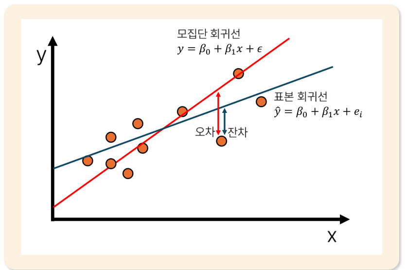
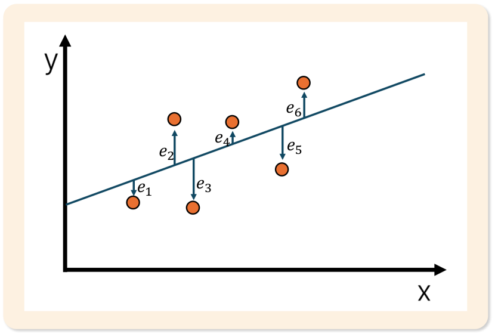
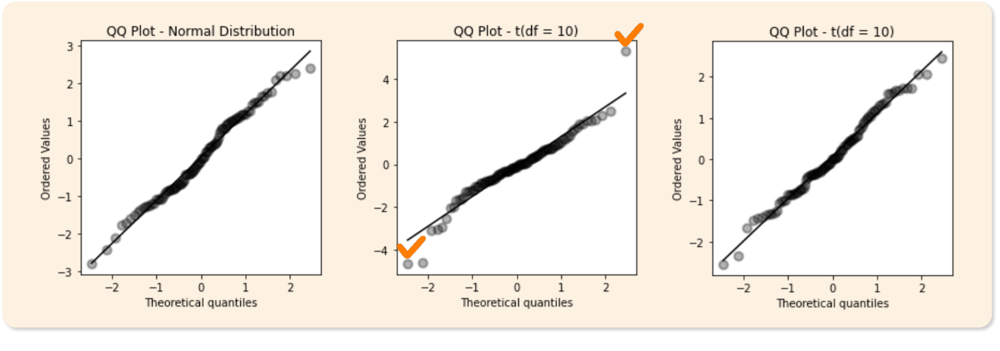

# 14. 선형회귀분석1

> 원본 PDF 범위: 371~398쪽 · PDF 설명 순서에 따라 재작성

## 주요 단어 먼저 보기

| 주요 단어 | 뜻 |
|---|---|
| 선형회귀 | 독립변수의 선형결합으로 연속형 y를 설명·예측 |
| 단순·다중선형회귀 | 독립변수가 각각 1개인 회귀와 2개 이상인 회귀 |
| 회귀계수 | X가 1 증가할 때 평균 Y의 변화량 |
| 절편 | 모든 X가 0일 때 예측값 |
| 오차항 | 모집단의 실제값과 이론적 회귀선 사이의 관측 불가능한 확률변수 |
| 잔차 | 관측값과 예측값의 차이 |
| 최소제곱법 | 잔차제곱합을 최소화하는 계수 추정법 |
| 표준오차 | 계수 추정값의 불확실성 |
| 신뢰구간 | 모집단 회귀계수가 있을 것으로 추정하는 범위 |
| 선형성 | X와 평균 Y의 관계가 선형 |
| 등분산성 | 잔차의 분산이 일정 |
| 독립성 | 서로 다른 관측값의 오차가 상관되지 않는 성질 |
| 정규성 | 조건부 오차분포가 정규분포를 따르는 성질 |
| Q-Q plot | 잔차 정규성을 시각적으로 점검하는 그래프 |

> **단원 시작법:** 주요 단어의 뜻을 먼저 읽고, 아래 PDF 절 순서대로 학습한다.

<!-- TOC START -->
## 목차

- [1. 선형회귀분석 개요](#1-선형회귀분석-개요)
  - [선형회귀의 종류](#선형회귀의-종류)
- [2. 목적과 특징](#2-목적과-특징)
  - [목적](#목적)
  - [특징](#특징)
- [3. 쓰임새](#3-쓰임새)
- [4. 선형회귀식의 구성요소](#4-선형회귀식의-구성요소)
  - [단순선형회귀식](#단순선형회귀식)
  - [다중선형회귀식](#다중선형회귀식)
- [5. 선형회귀분석 상세](#5-선형회귀분석-상세)
  - [오차항과 잔차](#오차항과-잔차)
  - [최소제곱법(OLS)](#최소제곱법ols)
- [6. 회귀계수의 추론](#6-회귀계수의-추론)
  - [단순회귀계수 계산](#단순회귀계수-계산)
  - [회귀계수의 분산과 표준오차](#회귀계수의-분산과-표준오차)
  - [회귀계수의 신뢰구간](#회귀계수의-신뢰구간)
- [7. 선형회귀분석의 가정](#7-선형회귀분석의-가정)
  - [선형성](#선형성)
  - [등분산성](#등분산성)
  - [독립성](#독립성)
  - [정규성](#정규성)
- [8. 정규성의 판단](#8-정규성의-판단)
- [9. 교재 문제와 해설](#9-교재-문제와-해설)
  - [문제 바로가기](#문제-바로가기)
  - [문제 1. 선형회귀의 목적](#문제-1-선형회귀의-목적)
  - [문제 2. 최소제곱 회귀계수](#문제-2-최소제곱-회귀계수)
  - [문제 3. 회귀계수의 분산](#문제-3-회귀계수의-분산)
  - [문제 4. 회귀계수 신뢰구간](#문제-4-회귀계수-신뢰구간)
  - [문제 5. 선형회귀의 특징](#문제-5-선형회귀의-특징)
- [보충 학습](#보충-학습)
  - [회귀 분산분해와 결정계수](#회귀-분산분해와-결정계수)
  - [평균반응의 신뢰구간과 개별 예측구간](#평균반응의-신뢰구간과-개별-예측구간)
  - [보강: 외삽 주의](#보강-외삽-주의)
  - [체크포인트](#체크포인트)
- [시험 직전 암기](#시험-직전-암기)
<!-- TOC END -->

## 1. 선형회귀분석 개요

> **PDF 372쪽**

> **암기 한 줄:** 선형회귀는 설명변수의 선형 결합으로 연속형 반응변수의 평균을 설명한다.

선형회귀분석은 종속변수와 독립변수 사이의 선형관계를 모델링해 그 관계를 설명하거나 예측하는 기법이다. 교재는 일반화선형모형(GLM, Generalized Linear Model)의 하나로 소개한다.

### 선형회귀의 종류

| 종류 | 독립변수 개수 | 식 |
|---|---:|---|
| 단순선형회귀 | 1개 | $y=\beta_0+\beta_1x_1+\epsilon$ |
| 다중선형회귀 | 2개 이상 | $y=\beta_0+\beta_1x_1+\cdots+\beta_px_p+\epsilon$ |

다중선형회귀식의 오차항을 제외한 $\beta_0+\beta_1x_1+\cdots+\beta_px_p$ 부분을 **선형예측자(linear predictor)**라고 한다. 여기서 ‘선형’은 변수 자체가 반드시 직선 형태라는 뜻보다 계수 $\beta_j$가 선형으로 결합된다는 뜻이다.

## 2. 목적과 특징

> **PDF 373쪽**

> **암기 한 줄:** 계수로 영향 방향과 크기를 해석하고 연속값을 예측한다.

### 목적

- **설명(explanation):** 독립변수가 종속변수에 미치는 관계의 방향과 크기를 정량화한다.
- **예측(prediction):** 독립변수 값이 주어졌을 때 종속변수 값을 추정한다.
- **통제(control):** 다른 독립변수의 영향을 통제한 상태에서 특정 변수의 조건부 관계를 분석한다.

### 특징

1. 종속변수 $Y$와 독립변수 $X$ 사이 평균 관계가 선형이라고 가정한다.
2. 모델이 단순하고 회귀계수의 해석이 비교적 쉽다.
3. 이상치와 다중공선성에 민감하다.
4. 예측뿐 아니라 설명 목적에도 적합하다.

설명 목적에서는 계수·신뢰구간·가정을, 예측 목적에서는 새 데이터 오차와 예측구간을 더 중점적으로 본다. 관측자료의 ‘통제’는 같은 모형에 변수를 포함했다는 뜻이지 자동으로 인과효과를 보장한다는 뜻은 아니다.

## 3. 쓰임새

> **PDF 374쪽**

> **암기 한 줄:** 설명과 예측 모두 가능하지만 인과 해석에는 별도 가정이 필요하다.

교재의 분야별 활용 예시는 다음과 같다.

| 분야 | 활용 사례 |
|---|---|
| 경제학 | 수요와 공급, 소득과 소비의 관계 |
| 마케팅 | 광고비와 매출, 가격과 수요의 관계 |
| 사회과학 | 교육수준과 소득, 사회복지와 범죄율의 관계 |
| 공학 | 온도와 강도, 압력과 유량의 관계 |

종속변수가 연속형인지 먼저 확인한다. 결과가 0/1이면 일반 선형회귀보다 이항 로지스틱회귀가 적절하다. 또한 관측자료의 계수는 조건부 연관성을 나타낼 뿐 실험설계나 충분한 교란 통제가 없으면 인과효과로 확정할 수 없다.

## 4. 선형회귀식의 구성요소

> **PDF 375~376쪽**

> **암기 한 줄:** 관측값 = 절편 + 기울기×설명변수 + 오차다.

### 단순선형회귀식

$$
y_i=\beta_0+\beta_1x_i+\epsilon_i
$$

| 기호 | 의미 |
|---|---|
| $y_i$ | 종속변수의 실제 관측값 |
| $x_i$ | 독립변수의 관측값 |
| $\beta_0$ | 회귀절편: $x=0$일 때 평균반응 |
| $\beta_1$ | 회귀계수: $x$가 1 증가할 때 평균 $y$의 변화량 |
| $\epsilon_i$ | 모형에 설명되지 않은 모집단 오차항 |

### 다중선형회귀식

$$
y_i=\beta_0+\beta_1x_{i1}+\beta_2x_{i2}+\cdots+\beta_px_{ip}+\epsilon_i
$$

다중회귀의 $\beta_j$는 **다른 독립변수들이 일정할 때** $x_j$가 1 증가하면 평균 $y$가 얼마나 변하는지를 나타낸다.

## 5. 선형회귀분석 상세

> **PDF 377~378쪽**

> **암기 한 줄:** 오차항은 모집단의 미지 값, 잔차는 표본에서 계산하며 OLS는 잔차제곱합을 최소화한다.

### 오차항과 잔차

- **오차항(error term, $\epsilon_i$):** 모집단의 실제값과 이론적 회귀선 사이 차이를 나타내는 관측 불가능한 확률변수다.
- **잔차(residual, $e_i$):** 표본 관측값과 적합된 표본 회귀선의 예측값 사이에서 실제로 계산한 차이다.

$$
\epsilon_i=y_i-(\beta_0+\beta_1x_i),\qquad
e_i=y_i-\hat y_i
$$

*그림: 모집단 회귀선의 오차항과 표본 회귀선의 잔차 — 원문 슬라이드의 도식만 잘라 수록.*

### 최소제곱법(OLS)

최소제곱법(Ordinary Least Squares)은 관측값과 회귀직선 사이의 잔차를 제곱해 모두 더한 값을 최소화하는 계수를 찾는다.

$$
SSE=\sum_{i=1}^{n}(y_i-\hat y_i)^2
=\sum_{i=1}^{n}\{y_i-(\beta_0+\beta_1x_i)\}^2
$$

*그림: 잔차 $e_1,\ldots,e_6$의 제곱합을 최소로 하는 직선 — 원문 슬라이드의 도식만 잘라 수록.*

잔차를 그냥 합하면 양수와 음수가 상쇄되므로 제곱한다. 제곱은 큰 오차에 더 큰 벌점을 주기 때문에 OLS가 이상치에 민감한 이유이기도 하다.

## 6. 회귀계수의 추론

> **PDF 379~383쪽**

> **암기 한 줄:** 계수 추론은 추정값÷표준오차로 검정하며 신뢰구간도 함께 본다.

### 단순회귀계수 계산

기울기는 독립변수가 한 단위 변할 때 종속변수가 평균적으로 얼마나 변하는지 나타낸다.

$$
\hat\beta_1=
\frac{\sum_{i=1}^{n}(x_i-\bar x)(y_i-\bar y)}
{\sum_{i=1}^{n}(x_i-\bar x)^2},\qquad
\hat\beta_0=\bar y-\hat\beta_1\bar x
$$

교재 예제의 자료는 $(1,2),(2,3),(3,5),(4,4),(5,6)$이고 $\bar x=3$, $\bar y=4$다.

$$
\sum(x_i-\bar x)(y_i-\bar y)=9,\qquad
\sum(x_i-\bar x)^2=10
$$

따라서 $\hat\beta_1=9/10=0.9$, $\hat\beta_0=4-0.9(3)=1.3$이고 표본 회귀식은 $\hat y=1.3+0.9x$다.

### 회귀계수의 분산과 표준오차

$$
Var(\hat\beta_1)=\frac{\sigma^2}{\sum_i(x_i-\bar x)^2},\qquad
SE(\hat\beta_1)=\sqrt{Var(\hat\beta_1)}
$$

오차분산 $\sigma^2$이 클수록 기울기 추정이 흔들리고, $x$값이 넓게 퍼질수록 분모가 커져 기울기를 더 정확히 추정한다.

### 회귀계수의 신뢰구간

$$
CI(\beta_1)=\hat\beta_1\pm t_{\alpha/2,n-2}SE(\hat\beta_1)
$$

단순회귀는 절편과 기울기 두 개를 추정하므로 자유도는 $n-2$다. 교재 t표에서 95% 양측구간, 자유도 3의 임계값은 $t_{0.025,3}=3.182$다.

| 요인 | 커질 때 신뢰구간 폭 |
|---|---|
| 표본크기 | 좁아짐 |
| 신뢰수준 | 넓어짐 |
| 오차분산 | 넓어짐 |
| 독립변수의 변동성 | 좁아짐 |

## 7. 선형회귀분석의 가정

> **PDF 384~387쪽**

> **암기 한 줄:** 선형성·독립성·등분산성·오차 정규성을 잔차로 점검한다.

### 선형성

오차항의 조건부 평균이 독립변수 값과 관계없이 0이라는 가정이다.

$$E(\epsilon\mid X)=0$$

모형에 체계적인 편향이 없고 독립변수와 오차항이 상관되지 않아야 한다. 주요 위반 원인은 중요한 설명변수 누락, 실제 비선형관계에 선형식을 사용, 독립변수의 측정오차다.

### 등분산성

$$Var(\epsilon\mid X)=\sigma^2$$

오차항의 분산이 독립변수 값과 관계없이 일정해야 한다. 매출·소득처럼 범위가 넓은 변수, 집단별로 다른 변동성, 지수관계에 선형식을 적용하는 잘못된 함수형태가 이분산을 만들 수 있다.

### 독립성

서로 다른 관측값의 오차항이 상관되지 않아야 한다. 계절성·추세·순환이 있는 시계열, 지리적으로 인접한 자료, 같은 집단 안에 묶인 군집자료, 중요한 설명변수 누락은 독립성을 위반할 수 있다.

### 정규성

$$
Y\mid X\sim N(\beta_0+\beta_1x,\sigma^2)
$$

조건부 오차항이 정규분포를 따른다는 가정이다. 극단적 잔차, 과도한 왜도·첨도, 서로 다른 집단이 섞여 생긴 다봉분포가 정규성을 깨뜨릴 수 있다. 정규성은 OLS 계수 계산 자체보다 작은 표본의 t검정과 신뢰구간에 중요하다.

> **암기:** `선·등·독·정` = 선형성, 등분산성, 독립성, 정규성.

## 8. 정규성의 판단

> **PDF 388쪽**

> **암기 한 줄:** Q-Q 점들이 직선에 가까우면 오차 정규성이 대체로 타당하다.

Q-Q plot(Quantile–Quantile plot)은 오름차순으로 정렬한 데이터의 분위수와 정규분포의 이론적 분위수를 비교한다.

*그림: 점들이 대각선에 밀접하면 정규분포에 가깝고, 꼬리 점이 크게 벗어나면 차이가 큼 — 원문 슬라이드의 Q-Q 그래프만 잘라 수록.*

- 점들이 대각선에 가깝다: 정규성에 대체로 부합한다.
- 양쪽 꼬리가 대각선에서 크게 벗어난다: 두꺼운 꼬리 또는 이상치를 의심한다.
- 전체적으로 곡선을 이룬다: 왜도 또는 분포 형태 차이를 의심한다.

회귀에서는 원자료 $Y$ 전체보다 **잔차**의 정규성을 점검한다. Q-Q plot 하나만으로 확정하지 않고 잔차 히스토그램과 함께 본다.

## 9. 교재 문제와 해설

> **원문 단원 말미 문제 전체 수록**

> 먼저 문제와 보기를 풀고, **정답 및 선택지별 해설 보기**를 펼쳐 확인하세요. 일반 4지선다 문항은 ①~④를 모두 해설하며, 원문이 2지선다인 경우에는 실제 보기만 수록합니다.

### 문제 바로가기

| 문제 | 주제 | 관련 목차 | PDF |
|---:|---|---|---:|
| [1](#ch14-q1) | 선형회귀의 목적 | [2. 목적과 특징](#2-목적과-특징) · [3. 쓰임새](#3-쓰임새) | 389쪽 |
| [2](#ch14-q2) | 최소제곱 회귀계수 | [5. 선형회귀분석 상세](#5-선형회귀분석-상세) | 391쪽 |
| [3](#ch14-q3) | 회귀계수의 분산 | [6. 회귀계수의 추론](#6-회귀계수의-추론) | 393쪽 |
| [4](#ch14-q4) | 회귀계수 신뢰구간 | [6. 회귀계수의 추론](#6-회귀계수의-추론) | 395쪽 |
| [5](#ch14-q5) | 선형회귀의 특징 | [2. 목적과 특징](#2-목적과-특징) · [7. 선형회귀분석의 가정](#7-선형회귀분석의-가정) | 397쪽 |

### 문제 1. 선형회귀의 목적

**출처:** PDF 389쪽  
**관련 목차:** [2. 목적과 특징](#2-목적과-특징) · [3. 쓰임새](#3-쓰임새)

다음 중 선형회귀분석의 목적으로 가장 적절하지 않은 것은?

1. 독립변수가 종속변수에 미치는 영향의 방향과 크기를 정량적으로 분석
2. 독립변수 값이 주어졌을 때 종속변수 값을 추정
3. 다른 변수의 영향을 통제한 상태에서 특정 변수의 순수한 효과를 분석
4. 범주형 종속변수에 대한 분류 문제를 해결

정답 및 선택지별 해설 보기

**정답: ④ 범주형 종속변수에 대한 분류 문제를 해결**

- **① 오답:** 정답이 아님. 회귀계수의 부호와 크기로 설명변수와 연속형 결과의 관계를 정량화한다.
- **② 오답:** 정답이 아님. 학습된 회귀식에 새 X를 대입해 연속형 ŷ를 예측한다.
- **③ 오답:** 정답이 아님. 다중회귀 계수는 다른 변수를 고정했을 때 해당 변수의 조건부 변화를 해석하는 데 쓴다.
- **④ 정답:** 정답(적절하지 않은 목적). 범주형 종속변수 분류에는 로지스틱 회귀·트리 같은 분류모델을 사용한다.

### 문제 2. 최소제곱 회귀계수

**출처:** PDF 391쪽  
**관련 목차:** [5. 선형회귀분석 상세](#5-선형회귀분석-상세)

최소제곱법으로 단순선형회귀의 기울기 회귀계수를 추정하는 설명으로 올바른 것은?

1. 종속변수와 독립변수의 공분산을 종속변수의 분산으로 나눈다.
2. 독립변수와 종속변수의 공분산을 독립변수의 분산으로 나눈다.
3. 관측 데이터와 회귀직선 차이의 절댓값 합을 최소화한다.
4. 독립변수 평균과 종속변수 평균을 더해 표본 크기로 나눈다.

정답 및 선택지별 해설 보기

**정답: ② 독립변수와 종속변수의 공분산을 독립변수의 분산으로 나눈다.**

- **① 오답:** 분모는 종속변수 분산이 아니라 설명변수 X의 편차제곱합·분산이다.
- **② 정답:** 기울기 b₁=Cov(X,Y)/Var(X)이며 잔차제곱합을 최소화해 얻는다.
- **③ 오답:** 최소제곱법은 절댓값 합이 아니라 잔차의 제곱합 Σ(yᵢ−ŷᵢ)²을 최소화한다.
- **④ 오답:** 평균은 절편 b₀=ȳ−b₁x̄ 계산에 쓰이지만 단순 합을 n으로 나눈 값은 기울기가 아니다.

### 문제 3. 회귀계수의 분산

**출처:** PDF 393쪽  
**관련 목차:** [6. 회귀계수의 추론](#6-회귀계수의-추론)

단순선형회귀에서 기울기 회귀계수의 분산에 대한 해석으로 틀린 것은?

1. 오차분산이 클수록 회귀계수의 분산이 증가한다.
2. 독립변수의 변동성이 클수록 회귀계수의 분산이 감소한다.
3. 독립변수의 평균값이 클수록 회귀계수의 분산이 증가한다.
4. 표본 크기가 클수록 회귀계수의 분산이 감소한다.

정답 및 선택지별 해설 보기

**정답: ③ 독립변수의 평균값이 클수록 회귀계수의 분산이 증가한다.**

- **① 오답:** 정답이 아님. Var(b₁)=σ²/Σ(xᵢ−x̄)²이므로 오차분산 σ²가 크면 증가한다.
- **② 오답:** 정답이 아님. X의 편차제곱합이 커지면 분모가 커져 기울기 추정이 더 정밀해진다.
- **③ 정답:** 정답(틀린 설명). 평균을 중심으로 한 변동성 Σ(xᵢ−x̄)²이 중요하며 X 전체에 상수를 더해 평균만 바꿔도 기울기 분산은 변하지 않는다.
- **④ 오답:** 정답이 아님. 보통 표본이 늘면 X의 정보량과 편차제곱합이 커져 회귀계수 분산이 줄어든다.

### 문제 4. 회귀계수 신뢰구간

**출처:** PDF 395쪽  
**관련 목차:** [6. 회귀계수의 추론](#6-회귀계수의-추론)

단순선형회귀에서 회귀계수의 신뢰구간에 영향을 미치는 요인에 대한 설명으로 틀린 것은?

1. 표본 크기가 클수록 신뢰구간이 좁아진다.
2. 신뢰수준이 높을수록 신뢰구간이 넓어진다.
3. 오차분산이 클수록 신뢰구간이 넓어진다.
4. 독립변수의 변동성이 작을수록 신뢰구간이 좁아진다.

정답 및 선택지별 해설 보기

**정답: ④ 독립변수의 변동성이 작을수록 신뢰구간이 좁아진다.**

- **① 오답:** 정답이 아님. 표본이 많아지면 표준오차가 작아져 구간이 좁아지는 경향이 있다.
- **② 오답:** 정답이 아님. 더 높은 신뢰수준은 더 큰 임계값을 사용하므로 구간이 넓어진다.
- **③ 오답:** 정답이 아님. 오차분산이 크면 회귀계수 표준오차가 커져 구간이 넓어진다.
- **④ 정답:** 정답(틀린 설명). X 변동성이 클수록 분모 Σ(xᵢ−x̄)²가 커져 표준오차와 신뢰구간이 작아진다. 진술의 방향이 반대다.

### 문제 5. 선형회귀의 특징

**출처:** PDF 397쪽  
**관련 목차:** [2. 목적과 특징](#2-목적과-특징) · [7. 선형회귀분석의 가정](#7-선형회귀분석의-가정)

선형회귀분석의 특징에 대한 설명으로 올바른 것은?

1. 모델이 단순하고 해석 가능해 예측뿐 아니라 설명 목적에도 적합하다.
2. 독립변수 개수가 표본 크기보다 많아도 회귀계수를 정상적으로 추정할 수 있다.
3. 이상치에 강건하여 이상치 영향을 거의 받지 않는다.
4. 독립변수와 종속변수 관계가 비선형이어도 그대로 적용할 수 있다.

정답 및 선택지별 해설 보기

**정답: ① 모델이 단순하고 해석 가능해 예측뿐 아니라 설명 목적에도 적합하다.**

- **① 정답:** 각 계수의 방향·크기를 해석할 수 있고 계산이 단순해 설명과 기준 예측모델에 유용하다.
- **② 오답:** p≥n이면 설계행렬이 특이해질 수 있어 고유한 최소제곱 추정이 불가능하거나 불안정하다. 규제가 필요할 수 있다.
- **③ 오답:** 잔차제곱을 최소화하므로 큰 잔차를 가진 이상치와 영향점에 민감하다.
- **④ 오답:** 기본 선형회귀는 모수에 선형인 관계를 가정한다. 비선형이면 변환·다항항·다른 모델이 필요하다.

## 보충 학습

> 원문 절 순서를 모두 학습한 뒤 이해와 문제 적용력을 높이는 확장 내용이다.

### 회귀 분산분해와 결정계수

$$
SST=SSR+SSE,\qquad R^2=\frac{SSR}{SST}=1-\frac{SSE}{SST}
$$

절편이 있는 학습자료 회귀에서는 전체변동을 설명된 변동과 설명되지 않은 변동으로 나눌 수 있다. 결정계수의 자세한 해석은 15단원에서 다룬다.

### 평균반응의 신뢰구간과 개별 예측구간

- 신뢰구간: 특정 $x_0$에서 평균 $E[Y\mid X=x_0]$의 불확실성
- 예측구간: 새로운 개별 관측값 $Y_{new}$의 불확실성

예측구간은 개별 오차분산까지 포함하므로 평균반응 신뢰구간보다 넓다.

### 보강: 외삽 주의

학습된 $x$ 범위 밖에서 직선관계가 유지된다는 보장은 없다. 계수의 의미도 관측 범위와 단위 안에서 해석한다.

### 체크포인트

- 잔차는 양수·음수 모두 가능하다.
- 절편을 포함한 최소제곱 회귀에서는 잔차 합이 0이다.
- 상관관계가 강해도 회귀 가정이 자동으로 충족되는 것은 아니다.

## 시험 직전 암기

- 선형회귀는 설명변수의 선형 결합으로 연속형 반응변수의 평균을 설명한다.
- 계수로 영향 방향과 크기를 해석하고 연속값을 예측한다.
- 설명과 예측 모두 가능하지만 인과 해석에는 별도 가정이 필요하다.
- 관측값 = 절편 + 기울기×설명변수 + 오차다.
- 최소제곱법은 잔차제곱합을 가장 작게 하는 계수를 찾는다.
- 계수 추론은 추정값÷표준오차로 검정하며 신뢰구간도 함께 본다.
- 선형성·독립성·등분산성·오차 정규성을 잔차로 점검한다.
- Q-Q 점들이 직선에 가까우면 오차 정규성이 대체로 타당하다.
