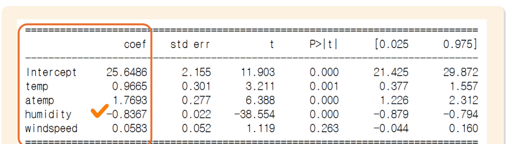
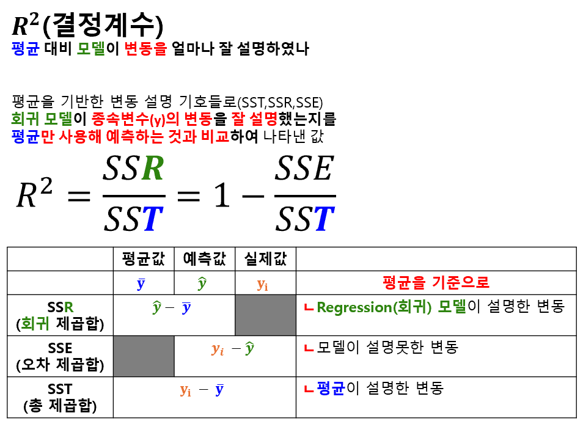
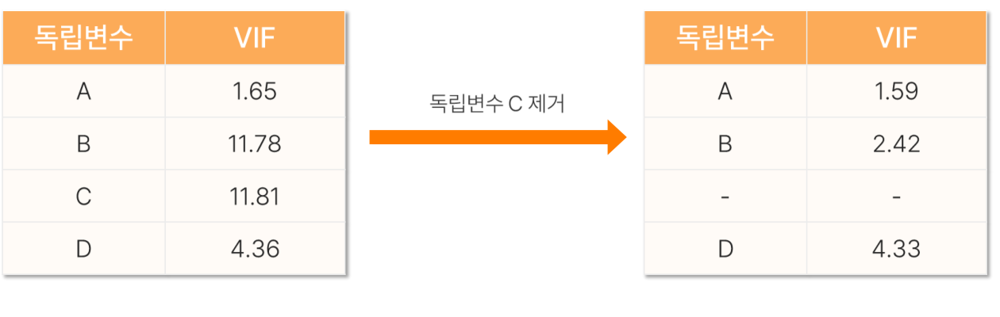
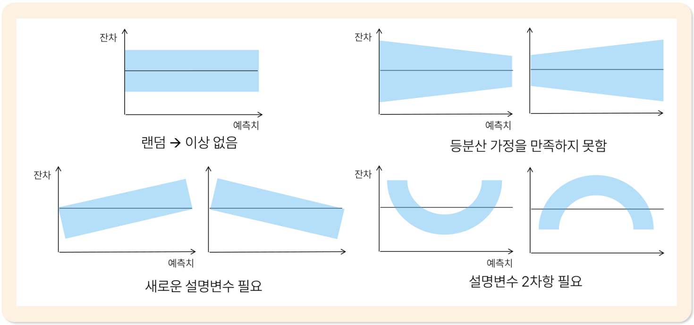

# 15. 선형회귀분석2

> 원본 PDF 범위: 399~426쪽 · PDF 설명 순서에 따라 재작성

## 주요 단어 먼저 보기

| 주요 단어 | 뜻 |
|---|---|
| 다중선형회귀 | 여러 독립변수로 연속형 y를 설명·예측 |
| 회귀절편 | 모든 독립변수가 0일 때의 예측값 |
| 회귀계수 | 다른 변수를 고정했을 때 해당 X가 1 증가할 때의 평균 Y 변화량 |
| 결정계수 R² | 전체 변동 중 모형이 설명한 비율 |
| SST·SSR·SSE | 전체변동·설명된 변동·설명되지 않은 오차변동 |
| 수정 R² | 변수 수를 고려해 R²를 보정 |
| 다중공선성 | 독립변수끼리 강하게 겹치는 현상 |
| VIF | 다중공선성의 정도를 나타내는 지표 |
| 예측값 | 회귀식에 새 X를 넣어 계산한 y |
| AIC | 적합도와 모형 복잡성을 함께 평가 |
| BIC | 표본크기 기반 복잡성 벌점을 주는 기준 |
| 잔차분석 | 예측값에 따른 잔차 패턴으로 모형 가정을 진단 |
| 외삽 | 학습한 X 범위 밖을 예측 |

> **단원 시작법:** 주요 단어의 뜻을 먼저 읽고, 아래 PDF 절 순서대로 학습한다.

<!-- TOC START -->
## 목차

- [15. 선형회귀분석2](#15-선형회귀분석2)
  - [주요 단어 먼저 보기](#주요-단어-먼저-보기)
  - [목차](#목차)
  - [1. 선형회귀분석의 해석](#1-선형회귀분석의-해석)
    - [절편과 회귀계수](#절편과-회귀계수)
    - [교재 단순회귀 예시](#교재-단순회귀-예시)
    - [다중선형회귀 결과표 읽기](#다중선형회귀-결과표-읽기)
  - [2. 결정계수](#2-결정계수)
    - [변동의 분해](#변동의-분해)
    - [결정계수 계산과 성질](#결정계수-계산과-성질)
    - [수정 결정계수](#수정-결정계수)
  - [3. 다중공선성](#3-다중공선성)
      - [다중공선성이 생기면 나타나는 현상](#다중공선성이-생기면-나타나는-현상)
    - [VIF 진단](#vif-진단)
    - [해결 방법과 교재 예시](#해결-방법과-교재-예시)
  - [4. 예측값 산출](#4-예측값-산출)
  - [5. 선형회귀분석의 평가](#5-선형회귀분석의-평가)
    - [오차 기반 평가](#오차-기반-평가)
    - [결정계수로 평가](#결정계수로-평가)
    - [정보량 기준](#정보량-기준)
      - [AIC와 BIC의 차이](#aic와-bic의-차이)
      - [숫자로 비교하기](#숫자로-비교하기)
      - [사용할 때 주의할 점](#사용할-때-주의할-점)
  - [6. 수행 시 고려사항](#6-수행-시-고려사항)
    - [결정계수와 독립변수 수](#결정계수와-독립변수-수)
    - [잔차분석](#잔차분석)
      - [잔차분석이 필요한 이유](#잔차분석이-필요한-이유)
      - [잔차도 읽는 방법](#잔차도-읽는-방법)
      - [잔차도만으로 확인하기 어려운 것](#잔차도만으로-확인하기-어려운-것)
  - [7. 교재 문제와 해설](#7-교재-문제와-해설)
    - [문제 바로가기](#문제-바로가기)
    - [문제 1. 결정계수](#문제-1-결정계수)
    - [문제 2. 분산팽창인자](#문제-2-분산팽창인자)
    - [문제 3. 수정 결정계수](#문제-3-수정-결정계수)
    - [문제 4. 다중회귀 예측값](#문제-4-다중회귀-예측값)
    - [문제 5. 잔차 패턴](#문제-5-잔차-패턴)
  - [보충 학습](#보충-학습)
    - [전체 모형과 개별 계수 검정](#전체-모형과-개별-계수-검정)
    - [규제 회귀](#규제-회귀)
    - [범주형 변수와 상호작용 해석 예시](#범주형-변수와-상호작용-해석-예시)
    - [변수선택의 위험](#변수선택의-위험)
    - [보강: 계수 해석과 인과](#보강-계수-해석과-인과)
    - [체크포인트](#체크포인트)
  - [시험 직전 암기](#시험-직전-암기)
<!-- TOC END -->

## 1. 선형회귀분석의 해석

> **PDF 400~403쪽**

> **암기 한 줄:** 다른 변수를 고정할 때 X가 1 증가하면 평균 Y가 계수만큼 변한다.

### 절편과 회귀계수

단순선형회귀의 모집단식과 예측식은

$$
y=\beta_0+\beta_1x+\epsilon,\qquad
\hat y=\hat\beta_0+\hat\beta_1x
$$

이다.

- **절편 $\beta_0$:** 독립변수 $x=0$일 때 종속변수의 평균 예측값이다. $\hat\beta_0=\bar y-\hat\beta_1\bar x$로 계산한다.
- **기울기 $\beta_1$:** $x$가 한 단위 증가할 때 평균 $y$의 변화량이다.
- $\beta_1>0$이면 양의 관계, $\beta_1<0$이면 음의 관계, $\beta_1=0$이면 선형관계가 없음을 뜻한다.

절편의 $x=0$이 관측범위 밖이거나 현실적으로 불가능하면 계산상 기준점일 뿐 실질적 해석은 제한한다.

### 교재 단순회귀 예시

$$
\hat y_{sales}=4000+2500x_{customer}
$$

손님이 한 명 늘 때 매출은 평균 2,500 증가한다. 손님이 2명이면 $4000+2500(2)=9000$을 예측하며 기울기가 양수이므로 손님 수와 매출은 양의 관계다.

### 다중선형회귀 결과표 읽기

다중회귀에서 $\beta_j$는 **다른 독립변수를 일정하게 유지했을 때** $x_j$가 1 증가하면 평균 $y$가 얼마나 변하는지를 뜻한다.

*그림: `coef`, `std err`, t, p-value, 95% 신뢰구간이 포함된 원문 회귀 출력표 — 표 영역만 잘라 수록.*

교재 결과표에서 회귀식은

$$
\hat y=25.6486+0.9665x_{temp}+1.7693x_{atemp}
-0.8367x_{humidity}+0.0583x_{windspeed}
$$

이다. 예를 들어 다른 변수가 같을 때 습도가 1 증가하면 평균 반응은 0.8367 감소한다. 풍속의 p-value는 0.263이고 95% 신뢰구간 $[-0.044,0.160]$이 0을 포함하므로 통상적인 5% 기준에서는 유의하지 않다.

## 2. 결정계수

> **PDF 404~407쪽**

> **암기 한 줄:** 전체 문제의 크기(SST)는 모델이 설명한 부분(SSR)과 설명하지 못한 부분(SSE)으로 나뉘며, $R^2$는 그중 설명한 비율이다.

결정계수(coefficient of determination) $R^2$는 **평균만 사용해 예측하는 것과 비교했을 때, 회귀모델이 종속변수의 변동을 얼마나 설명했는지** 나타내는 값이다. 예를 들어 공부 시간으로 시험 점수를 예측한다면 다음 두 방법을 비교한다.
  - "평균"이라는 모델 사용의 예측에 비해, 회귀모델 사용의 예측이 얼마나 더 잘 표현해내는지를 보는게 결정계수!
    - 모델을 사용하지 않을 때: 모든 학생의 점수를 전체 평균으로 예측한다.
    - 모델을 사용할 때: 학생마다 공부 시간을 이용해 점수를 예측한다.

모델이 평균 예측보다 오차를 많이 줄일수록 $R^2$가 커진다. 따라서 $R^2=0.8$은 **예측이 80% 정확하다**는 뜻이 아니라, **시험 점수의 전체 변동 중 80%를 모델이 설명했다**는 뜻이다.
  - $R^2=n$ : 모델이 변동의 n%를 설명했다.
### 변동의 분해

한 학생의 실제 점수가 80점, 전체 평균이 70점, 모델의 예측값이 76점이라고 해 보자.

$$
70\;(\text{평균})
\quad\longrightarrow\quad
76\;(\text{예측값})
\quad\longrightarrow\quad
80\;(\text{실제값})
$$

- 평균 70점에서 실제 80점까지의 차이: 데이터가 가진 **전체 변동**
- 평균 70점에서 예측값 76점까지의 차이: 모델이 **설명한 변동**
- 예측값 76점에서 실제 80점까지의 차이: 모델이 **설명하지 못한 오차**

이 생각을 모든 관측값에 적용하고, 양수와 음수가 상쇄되지 않도록 차이를 제곱하여 더한 것이 SST, SSR, SSE다.

$$
SST=\sum_{i=1}^{n}(y_i-\bar y)^2
$$

$$
SSR=\sum_{i=1}^{n}(\hat y_i-\bar y)^2,\qquad
SSE=\sum_{i=1}^{n}(y_i-\hat y_i)^2
$$

| 기호 | 명칭 | 의미 |
|---|---|---|
| SST | 총제곱합 | 실제값과 평균의 차이를 제곱해 더한 값 → **전체 문제의 크기** |
| SSR | 회귀제곱합 | 예측값과 평균의 차이를 제곱해 더한 값 → **모델이 설명한 부분** |
| SSE | 오차제곱합 | 실제값과 예측값의 차이를 제곱해 더한 값 → **모델이 못 설명한 부분** |

여기서 $y_i$는 실제값, $\hat y_i$는 모델의 예측값, $\bar y$는 실제값들의 평균이다. 절편을 포함한 최소제곱 회귀모델을 학습자료에 적합하면 다음 관계가 성립한다.

$$
\boxed{SST=SSR+SSE}
$$

즉, **전체 변동 = 모델이 설명한 변동 + 모델이 설명하지 못한 변동**이다.

> **용어 주의:** 이 문서에서는 일반적인 표기인 `SSR=회귀제곱합`, `SSE=오차제곱합`을 사용한다. 교재에 따라 SSR을 잔차제곱합으로 쓰기도 하므로 반드시 해당 교재의 기호 정의를 확인한다.

### 결정계수 계산과 성질

$$
\boxed{R^2=\frac{SSR}{SST}=1-\frac{SSE}{SST}}
$$

예를 들어 전체 변동 $SST=100$ 중 모델이 $SSR=80$을 설명하고 $SSE=20$을 설명하지 못했다면

$$
R^2=\frac{80}{100}=1-\frac{20}{100}=0.8
$$

이다. 전체 변동의 80%를 설명했고 20%가 오차로 남았다는 의미다.

| $R^2$ | 쉬운 해석 |
|---:|---|
| 1 | 학습자료의 실제값을 완벽하게 설명 |
| 0.8 | 전체 변동의 80%를 설명 |
| 0 | 평균으로만 예측하는 것과 같은 수준 |
| 음수 | 평균으로 예측하는 것보다도 못할 수 있음 |

- 절편이 있는 최소제곱 회귀모델을 학습자료에서 평가하면 보통 0과 1 사이이며, 클수록 학습자료 설명력이 높다.
- 단순선형회귀에서는 $R^2$가 종속변수와 독립변수의 피어슨 상관계수 제곱과 같다.
- ⭐ 독립변수를 추가하면 학습자료의 $R^2$는 감소하지 않는다. 도움이 없는 변수라도 유지되거나 조금 증가할 수 있다.
- 절편이 없는 모형이나 새로운 평가 데이터에서 평균 예측보다 성능이 나쁘면 $R^2$가 음수가 될 수 있다.
- 높은 $R^2$가 인과관계, 좋은 잔차 패턴, 새로운 데이터에서의 높은 🌟예측성능을 보장하지는 않는다.

### 수정 결정계수

일반 $R^2$는 독립변수를 추가할 때 감소하지 않는다. 따라서 관련 없는 변수를 많이 넣어도 값이 올라가 모델이 실제보다 좋아 보일 수 있다. **수정 결정계수\(adjusted $R^2$)**는 독립변수 수가 늘어날수록 벌점을 주어 이 문제를 보완한다.

$n$을 관측치 수, $p$를 절편을 제외한 독립변수 수라 하면

$$
\boxed{R^2_{adj}
=1-\frac{SSE/(n-p-1)}{SST/(n-1)}
=1-(1-R^2)\frac{n-1}{n-1-p}}
$$

예를 들어 관측치가 20개이고 독립변수가 3개인 모델의 $R^2=0.8$이라면

$$
R^2_{adj}
=1-(1-0.8)\frac{20-1}{20-3-1}
=0.7625
$$

이다. 일반 $R^2$보다 낮아진 이유는 독립변수 3개를 사용한 복잡성에 벌점을 주었기 때문이다.

| 구분 | 일반 $R^2$ | 수정 $R^2$ |
|---|---|---|
| 변수 추가 시 | 감소하지 않음 | 새 변수가 충분히 도움 되지 않으면 감소 가능 |
| 변수 수 반영 | 하지 않음 | 자유도로 보정하여 반영 |
| 주요 용도 | 한 모델의 설명력 파악 | 🌟같은 데이터·종속변수로 만든, 변수 수가 다른 회귀모델 비교 |

- 새 변수가 오차를 충분히 줄이면 수정 $R^2$도 증가한다.
- 새 변수가 거의 도움이 되지 않으면 변수 수에 대한 벌점 때문에 수정 $R^2$는 감소한다.
- 동일한 자료에서 절편을 포함한 모델이라면 일반적으로 $R^2_{adj}\le R^2$이며, 설명력이 매우 낮으면 음수가 될 수도 있다.
- 수정 $R^2$도 새 데이터의 예측성능을 직접 검증하는 지표는 아니므로 RMSE, 검증자료 성능, 잔차분석 등을 함께 확인한다.

> **최종 암기:** `SST=전체, SSR=설명, SSE=오차`, `R²=전체 중 설명한 비율`, `수정 R²=변수 수까지 고려한 설명력`.

## 3. 다중공선성

> **PDF 408~410쪽**

> **암기 한 줄:** 독립변수끼리 비슷한 정보를 많이 가지면 모델은 각 변수의 효과를 구분하기 어려워진다.

다중공선성(multicollinearity)은 **두 개 이상의 독립변수가 서로 비슷한 정보를 많이 가지고 있는 상태**다.

예를 들어 기온과 체감온도로 아이스크림 판매량을 설명한다고 해 보자.

- 기온이 높아지면 체감온도도 대체로 높아진다.
- 두 변수 모두 더운 정도라는 비슷한 정보를 담고 있다.
- 판매량이 늘었을 때 모델은 그것이 기온 때문인지 체감온도 때문인지 나누기 어려워진다.

두 사람이 거의 같은 일을 한 뒤 각자 얼마나 기여했는지 따지는 상황과 비슷하다. **두 변수를 합한 전체 설명력은 높을 수 있지만, 각 변수의 몫은 불분명해진다.**

수식으로는 🌟***어떤 독립변수가 다른 독립변수들의 선형결합으로 잘 설명되는 상태***를 말한다. 예를 들어 $x_2\approx 2x_1$이라면 두 변수의 정보가 크게 겹친다. $x_2=2x_1$처럼 관계가 완벽하면 **완전 다중공선성**이며, 각 회귀계수를 하나로 정할 수 없어 모델을 그대로 계산할 수 없다.

#### 다중공선성이 생기면 나타나는 현상

- 회귀계수의 표준오차와 신뢰구간이 커진다.
- 표본이 조금만 달라져도 계수의 크기나 부호가 크게 바뀔 수 있다.
- 실제로 중요한 변수인데도 p-value가 커져 유의하지 않게 나올 수 있다.
- 전체 $R^2$나 예측성능은 여전히 높을 수 있다.

따라서 다중공선성은 특히 **각 독립변수의 효과를 따로 해석할 때** 문제가 된다. 🌟다중공선성이 있다고 해서 회귀모델 전체가 무조건 쓸모없거나 회귀계수가 반드시 편향되는 것은 아니다.

### VIF 진단

VIF(variance inflation factor, 분산팽창인자)는 한 독립변수가 나머지 독립변수들과 얼마나 겹치는지를 나타내는 **정보 중복 점수**처럼 생각할 수 있다.

$$
VIF_j=\frac{1}{1-R_j^2}
$$

여기서 🌟$R_j^2$는 확인하려는 독립변수 $x_j$를 종속변수로 놓고, 나머지 독립변수들로 회귀했을 때의 결정계수다.

예를 들어 기온을 나머지 변수들로 설명했더니 $R_j^2=0.9$라면

$$
VIF=\frac{1}{1-0.9}=10
$$

이다. 기온 정보의 90%가 다른 독립변수들과 겹치므로 기온 계수의 분산이, 겹침이 없을 때보다 10배로 커졌다는 의미다.

| VIF | 쉬운 해석 |
|---:|---|
| 1 | 다른 독립변수와 겹치는 선형정보가 없음 |
| 1~5 | 어느 정도 겹치지만 상황과 분석 목적을 함께 판단 |
| 5 이상 | 다중공선성을 주의 깊게 점검 |
| 10 이상 | 심한 다중공선성을 의심하는 전통적인 기준 |

VIF의 최솟값은 1이다. 교재는 일반적으로 10을 기준으로 제시하지만 5 또는 그보다 엄격한 기준을 쓰기도 한다. VIF 기준은 절대적인 합격·불합격선이 아니므로 표본크기, 분석 목적, 변수의 필요성을 함께 본다.

상관계수 행렬도 먼저 확인할 수 있지만, 변수 여러 개가 결합되어 생긴 다중공선성은 두 변수씩 보는 상관계수만으로 발견하지 못할 수 있다. 따라서 보통 🌟***상관계수와 VIF를 함께 확인***한다.

### 해결 방법과 교재 예시

아래 그림에서는 B와 C의 VIF가 각각 11.78과 11.81로 높다. 서로 중복된 정보를 가진 것으로 판단하여 C를 제거하자 B의 VIF가 2.42로 크게 감소했다.

*그림: C를 제거하자 B의 VIF가 11.78에서 2.42로 감소하는 원문 사례 — 표 영역만 잘라 수록.*

| 변수 | 제거 전 VIF | C 제거 후 VIF |
|---|---:|---:|
| A | 1.65 | 1.59 |
| B | 11.78 | 2.42 |
| C | 11.81 | 제거 |
| D | 4.36 | 4.33 |

이 사례처럼 가장 단순한 해결 방법은 의미가 비슷한 변수 중 하나를 제거하고 VIF를 다시 계산하는 것이다. 다만 VIF 숫자만 보고 변수를 자동으로 삭제하면 중요한 정보를 잃을 수 있다. 다음 순서로 판단한다.

1. 어떤 변수끼리 정보가 겹치는지 확인한다.
2. 분석 목적이 개별 계수의 해석인지, 새로운 값의 예측인지 확인한다.
3. 이론이나 업무상 더 중요한 변수는 남긴다.
4. 변수 하나를 제거하거나 결합한 뒤 VIF와 모델 성능을 다시 확인한다.

상황에 따라 다음 방법도 사용할 수 있다.

- **변수 제거:** 기온과 체감온도처럼 의미가 비슷하면 목적에 더 적합한 하나를 선택한다.
- **변수 결합:** 비슷한 변수들을 평균이나 지수 등 하나의 대표 변수로 만든다.
- **표본 추가:** 데이터가 더 많아지면 계수 추정의 불안정성이 줄어들 수 있다.
- **주성분 회귀:** 서로 겹치는 변수들을 소수의 새로운 성분으로 압축한다.
- **Ridge·Lasso:** 계수에 제약을 주어 예측모델을 안정화한다.

> **주의:** 평균중심화는 다항항이나 상호작용항 때문에 생긴 비필수적 공선성을 줄이는 데 도움 될 수 있지만, 원래부터 비슷한 두 변수의 정보 중복 자체를 없애지는 못한다.

> **최종 암기:** `다중공선성=독립변수끼리 정보 중복`, `결과=개별 계수 불안정`, `진단=VIF`, `대응=의미를 고려해 제거·결합·규제`.

## 4. 예측값 산출

> **PDF 411쪽**

> **암기 한 줄:** 회귀식에 모든 X를 대입하고, 학습 때 쓴 전처리를 새 데이터에도 똑같이 적용한다.

회귀식이 정해진 뒤 새 관측치의 각 독립변수 값을 대입하면 예측값을 산출할 수 있다.

교재 예제의 회귀식이

$$
\hat y=2+3x_A+5x_B
$$

이면 다음과 같다.

| $x_A$ | $x_B$ | 계산 | $\hat y$ |
|---:|---:|---|---:|
| 1 | 1 | $2+3(1)+5(1)$ | 10 |
| 1 | 2 | $2+3(1)+5(2)$ | 15 |
| -1 | 3 | $2+3(-1)+5(3)$ | 14 |

예측 전에 다음을 확인한다.

- 학습데이터를 정규화했다면 학습데이터에서 구한 같은 규칙으로 새 데이터도 정규화한다.
- 범주형 변수를 레이블·원-핫 인코딩했다면 같은 열과 같은 매핑을 적용한다.
- 모든 회귀식 독립변수가 새 데이터에 있어야 한다.
- 학습 범위 밖의 외삽인지 확인한다.

## 5. 선형회귀분석의 평가

> **PDF 412~414쪽**

> **암기 한 줄:** 예측오차는 작게, $R^2$는 크게, AIC·BIC는 작게 본다.

### 오차 기반 평가

선형회귀는 MSE, RMSE, MAE, MAPE를 사용할 수 있다.

$$
MSE=\frac1n\sum(y_i-\hat y_i)^2,\qquad RMSE=\sqrt{MSE}
$$

$$
MAE=\frac1n\sum|y_i-\hat y_i|,\qquad
MAPE=\frac{100}{n}\sum\left|\frac{y_i-\hat y_i}{y_i}\right|
$$

오차지표는 작을수록 좋고, MAPE는 실제값이 0 또는 0에 가까울 때 주의한다.

### 결정계수로 평가

$R^2=0.75$이면 독립변수들이 종속변수의 **학습자료 변동 75%**를 설명한다는 뜻이다. 평가 데이터에서 $R^2<0$이면 단순히 학습자료 평균을 예측값으로 쓰는 기준선보다 성능이 나쁠 수 있다.

🌟높은 $R^2$는 학습자료 설명력이지 특정 변수의 인과효과나 새 데이터 예측력을 자동으로 뜻하지 않는다.
  - 이미 있는 것을 잘 평가하는 것이 새로 들어온 것도 잘 예측한다고 볼 수 없으니까.

### 정보량 기준

AIC와 BIC는 여러 후보 모델 중에서 **데이터를 잘 설명하면서도 지나치게 복잡하지 않은 모델**을 고르는 기준이다.

독립변수를 계속 추가하면 학습자료의 오차는 대체로 줄어든다. 하지만 관련 없는 변수까지 많이 넣으면 학습자료에만 지나치게 맞는 과적합이 생길 수 있다. AIC와 BIC는 이 문제를 막기 위해 다음 두 요소를 함께 계산한다.

$$
\boxed{\text{정보량 기준}=\text{적합도 손실}+\text{복잡성 벌점}}
$$

- **적합도 손실:** 모델이 데이터를 잘 설명할수록 작아진다.
- **복잡성 벌점:** 추정하는 파라미터가 많을수록 커진다.
  - 복잡하다 = 파라미터 추가가 많다.

시험 성적에 비유하면 적합도 손실은 틀린 문제에 대한 감점이고, 복잡성 벌점은 불필요하게 많은 힌트를 사용한 것에 대한 감점이다. 두 감점을 합한 값이 가장 작은 모델을 선택한다.

$$
\boxed{AIC=-2\log(\hat L)+2p}
$$

$$
\boxed{BIC=-2\log(\hat L)+p\log(n)}
$$

- $\hat L$: 추정된 모델에서 현재 데이터가 관측될 가능성을 나타내는 최대우도
- $-2\log(\hat L)$: 적합도 손실이며 작을수록 데이터를 잘 설명함
- $p$: 회귀계수 등 추정한 파라미터 수
- $n$: 관측치 수

우도와 로그 계산을 직접 하기보다는 통계 프로그램이 출력한 AIC·BIC를 이용하는 경우가 많다. 핵심은 🌟**AIC와 BIC 모두 작을수록 좋다**는 것이다.

#### AIC와 BIC의 차이

| 구분 | AIC | BIC |
|---|---|---|
| 복잡성 벌점 | $2p$ | $p\log(n)$ |
| 일반적 경향 | 적합도와 예측력을 더 중시 | 표본이 커질수록 복잡성에 더 강한 벌점 |
| 선택 경향 | 상대적으로 복잡한 모델도 선택 가능 | 상대적으로 단순한 모델을 선택하는 경향 |
| 공통점 | 같은 후보 모델끼리 비교하며 값이 작을수록 선호 | 같은 후보 모델끼리 비교하며 값이 작을수록 선호 |

$n>e^2\approx7.39$이면 $\log(n)>2$이므로 BIC의 파라미터당 벌점이 AIC보다 크다. 실제 회귀분석에서는 표본이 이보다 큰 경우가 많아 BIC가 더 단순한 모델을 선택하는 경향이 있다.

#### 숫자로 비교하기

관측치가 100개인 동일한 데이터에 단순 모델 A와 복잡한 모델 B를 적합했다고 하자. 아래의 적합도 손실과 파라미터 수는 설명을 위한 가상 값이다.

| 모델 | 적합도 손실 $-2\log(\hat L)$ | 파라미터 수 $p$ | AIC | BIC |
|---|---:|---:|---:|---:|
| 모델 A: 단순 | 120 | 3 | $120+2(3)=126$ | $120+3\log(100)\approx133.8$ |
| 모델 B: 복잡 | 109 | 8 | $109+2(8)=125$ | $109+8\log(100)\approx145.8$ |

- **AIC 선택:** 모델 B의 125가 모델 A의 126보다 작으므로 모델 B를 선택한다.
- **BIC 선택:** 모델 A의 133.8이 모델 B의 145.8보다 작으므로 모델 A를 선택한다.

모델 B가 데이터를 더 잘 설명하여 적합도 손실은 작지만, BIC는 늘어난 파라미터에 더 큰 벌점을 주어 단순한 모델 A를 선택한 것이다. 🌟이처럼 AIC와 BIC의 선택이 다를 수 있으며, 어느 하나가 항상 정답인 것은 아니다.

#### 사용할 때 주의할 점

- 같은 데이터, 같은 종속변수, 같은 확률모형으로 적합한 후보 모델끼리 비교한다.
- AIC끼리 또는 BIC끼리 비교한다. AIC 값과 BIC 값을 서로 직접 비교하지 않는다.
- 값 자체에 합격 기준은 없으며 후보 모델 사이의 **상대적인 크기**가 중요하다. 음수가 나와도 더 작은 값을 선택한다.
- AIC와 BIC가 작다고 회귀 가정이나 새 데이터 예측성능이 자동으로 보장되지는 않는다. 잔차분석과 검증자료 또는 교차검증 결과도 함께 본다.
- 소프트웨어마다 $p$에 절편이나 오차분산을 포함하는 방식이 다를 수 있으므로 서로 다른 프로그램의 출력값을 비교할 때는 정의를 확인한다.

> 🌟**결정계수와 비교:** $R^2$는 클수록 좋지만 변수 추가에 관대하다. AIC·BIC는 복잡성에 벌점을 주며 **작을수록 좋다**.

> **최종 암기:** `AIC·BIC=적합도 손실+복잡성 벌점`, `둘 다 작을수록 좋음`, `BIC가 일반적으로 복잡성에 더 엄격`.

> **교재 식 주의:** PDF 414쪽에는 AIC 식 옆에 $\hat L=SSR/n$이 함께 표시되어 있지만, 엄밀히 $\hat L$은 **최대우도**이며 SSR을 $n$으로 나눈 값과 동일하지 않다. 정규오차 회귀에서는 잔차분산과 우도 사이의 관계를 통해 계산한다.

## 6. 수행 시 고려사항

> **PDF 415~416쪽**

> **암기 한 줄:** 높은 $R^2$만 보지 말고 변수 수와 잔차 패턴을 반드시 확인한다.

### 결정계수와 독립변수 수

- 🌟독립변수가 지나치게 많으면 $R^2$가 높아도 예측력이 좋지 않을 수 있다.
- 종속변수와 관련 없는 독립변수도 우연히 높은 $R^2$를 만들 수 있다.
- 높은 $R^2$는 낮은 예측오차·안정성·가정 충족을 보장하지 않는다.

### 잔차분석

잔차(residual)는 **실제값과 모델의 예측값 사이에 남은 차이**, 즉 모델이 각 관측값에서 낸 실수다.

$$
\boxed{e_i=y_i-\hat y_i}
$$

- $e_i>0$: 실제값이 예측값보다 큼 → 모델이 **작게 예측**함
- $e_i<0$: 실제값이 예측값보다 작음 → 모델이 **크게 예측**함
- $e_i=0$: 실제값과 예측값이 같음

예를 들어 실제 시험점수와 예측점수를 비교하면 다음과 같다.

| 실제값 $y_i$ | 예측값 $\hat y_i$ | 잔차 $y_i-\hat y_i$ | 해석 |
|---:|---:|---:|---|
| 80 | 76 | 4 | 모델이 4점 작게 예측 |
| 70 | 75 | -5 | 모델이 5점 크게 예측 |
| 90 | 90 | 0 | 정확하게 예측 |

잔차의 양수와 음수는 서로 상쇄될 수 있으므로 모델의 전체 오차를 계산할 때는 잔차를 제곱해 더한다. 이것이 앞에서 배운 오차제곱합 SSE다.

$$
\boxed{SSE=\sum_{i=1}^{n}e_i^2
=\sum_{i=1}^{n}(y_i-\hat y_i)^2}
$$

#### 잔차분석이 필요한 이유

🌟$R^2$나 RMSE 같은 숫자는 모델의 성능을 하나의 값으로 요약하지만, **모델이 어떤 방식으로 틀리는지**는 보여주지 못한다. 잔차분석은 잔차에 남아 있는 규칙을 찾아 다음과 같은 문제를 진단하는 과정이다.

- 직선으로 설명하기 어려운 비선형관계가 있는가?
- 예측값에 따라 오차의 크기가 달라지는가?
- 빠진 설명변수나 상호작용이 있는가?
- 유난히 큰 잔차를 가진 이상치가 있는가?
- 시간 순서에 따라 잔차가 이어지는 자기상관이 있는가?

좋은 모델이라면 설명할 수 있는 규칙은 모델이 이미 설명했어야 한다. 따라서 ***모델이 설명하고 남은 잔차에는 뚜렷한 모양이 없어야 한다.***

#### 잔차도 읽는 방법

잔차도(residual plot)는 일반적으로 가로축에 예측값 $\hat y_i$, 세로축에 잔차 $e_i$를 놓는다. 아래 그림의 가운데 가로선은 잔차가 0인 위치다.

*그림: 예측값에 따른 잔차 패턴으로 모델 문제를 진단하는 원문 사례 — 도식 영역만 잘라 수록.*

잔차도는 다음 순서로 읽으면 쉽다.

1. **중심:** 잔차가 0을 중심으로 위아래에 분포하는지 본다.
2. **모양:** 직선이나 곡선처럼 반복되는 모양이 있는지 본다.
3. **폭:** 가로축 위치에 따라 잔차가 퍼진 폭이 달라지는지 본다.
4. **특이점:** 다른 점들에서 멀리 떨어진 큰 잔차가 있는지 본다.

| 잔차 패턴 | 쉬운 해석 | 의심할 문제 | 개선 방향 |
|---|---|---|---|
| 0 주변에 일정한 폭으로 무작위 | 특별한 규칙 없이 틀림 | 뚜렷한 이상 없음 | 다른 진단도 확인한 뒤 유지 |
| 부채꼴·깔때기 모양 | 예측값에 따라 실수의 크기가 달라짐 | 이분산성 | 변수변환·가중회귀·강건 표준오차 검토 |
| 상승·하락하는 추세 | 특정 구간에서 계속 작거나 크게 예측 | 누락변수·잘못된 함수형태·상호작용 | 새 설명변수나 상호작용 추가 검토 |
| U자·∩자 곡선 | 가운데와 양 끝에서 틀리는 방향이 다름 | 비선형관계를 직선으로 적합 | 설명변수의 2차항·변환·비선형모델 검토 |
| 한두 점이 매우 멀리 떨어짐 | 일부 관측값에서 유난히 크게 틀림 | 이상치·입력 오류·영향점 | 원자료 확인 후 영향력 진단 |

예를 들어 U자 모양은 모델이 양 끝에서는 작게 예측하고 가운데에서는 크게 예측하는 규칙이 남아 있다는 뜻이다. 직선 하나로는 곡선관계를 충분히 설명하지 못했으므로 $x^2$ 같은 2차항을 검토할 수 있다.

#### 잔차도만으로 확인하기 어려운 것

🌟잔차가 0 주변에 무작위로 보인다고 해서 모든 회귀 가정이 자동으로 충족되는 것은 아니다. 목적에 따라 다음 진단도 함께 사용한다.

| 확인할 내용 | 주로 사용하는 방법 |
|---|---|
| 잔차의 정규성 | 히스토그램, Q-Q plot |
| 시간에 따른 독립성 | 관측 순서별 잔차도, Durbin-Watson 검정 |
| 이상치 | 표준화 잔차·학생화 잔차 |
| 모델에 큰 영향을 주는 관측값 | 레버리지, Cook 거리 |

잔차가 큰 점은 모델이 잘 맞히지 못한 **이상치 후보**이고, 레버리지가 큰 점은 독립변수 값이 다른 관측값들과 멀리 떨어진 점이다. 두 성질이 함께 나타나면 회귀식에 큰 영향을 줄 수 있다. 이런 점을 발견해도 바로 삭제하지 말고 입력 오류인지, 실제로 중요한 사례인지 먼저 확인한다.

통계모형의 오차 $\epsilon_i$는 직접 관측할 수 없는 모집단의 값이고, 잔차 $e_i$는 표본에서 계산한 오차의 추정값이라는 차이도 기억한다.

> **최종 암기:** `잔차=실제값-예측값`, `좋은 잔차도=0 주변에 일정한 폭으로 무작위`, `모양이 남으면 모델이 놓친 규칙이 있다는 신호`.

## 7. 교재 문제와 해설

> **원문 단원 말미 문제 전체 수록**

> 먼저 문제와 보기를 풀고, **정답 및 선택지별 해설 보기**를 펼쳐 확인하세요. 일반 4지선다 문항은 ①~④를 모두 해설하며, 원문이 2지선다인 경우에는 실제 보기만 수록합니다.

### 문제 바로가기

| 문제 | 주제 | 관련 목차 | PDF |
|---:|---|---|---:|
| [1](#ch15-q1) | 결정계수 | [2. 결정계수](#2-결정계수) | 417쪽 |
| [2](#ch15-q2) | 분산팽창인자 | [3. 다중공선성](#3-다중공선성) | 419쪽 |
| [3](#ch15-q3) | 수정 결정계수 | [2. 결정계수](#2-결정계수) | 421쪽 |
| [4](#ch15-q4) | 다중회귀 예측값 | [4. 예측값 산출](#4-예측값-산출) | 423쪽 |
| [5](#ch15-q5) | 잔차 패턴 | [5. 선형회귀분석의 평가](#5-선형회귀분석의-평가) · [6. 수행 시 고려사항](#6-수행-시-고려사항) | 425쪽 |

### 문제 1. 결정계수

**출처:** PDF 417쪽  
**관련 목차:** [2. 결정계수](#2-결정계수)

다음 중 결정계수 R²에 대한 설명으로 옳지 않은 것은?

1. R²=0.8은 독립변수들이 종속변수 변동의 80%를 설명한다는 의미이다.
2. R²=0은 회귀모델이 종속변수 평균을 사용하는 기준예측과 같은 수준이라는 의미이다.
3. R²=0.3은 예측에 중요한 독립변수가 빠졌을 가능성을 시사한다.
4. R²가 높을수록 항상 좋은 모델이며 예측성능도 우수하다.

정답 및 선택지별 해설 보기

**정답: ④ R²가 높을수록 항상 좋은 모델이며 예측성능도 우수하다.**

- **① 오답:** 정답이 아님. 절편이 있는 동일 데이터 내 해석에서 R²는 종속변수 총변동 중 모델이 설명한 비율이다.
- **② 오답:** 정답이 아님. R²=0이면 SSE=SST로, 평균만 예측한 기준과 설명력이 같다.
- **③ 오답:** 정답이 아님. 낮은 R²는 누락 변수·비선형성·큰 잡음 가능성을 점검하라는 신호가 될 수 있다. 단, 분야 맥락도 함께 봐야 한다.
- **④ 정답:** 정답(옳지 않은 설명). 불필요한 변수를 늘리거나 과적합해도 학습 R²는 높아질 수 있다. 검증오차·잔차·수정 R²를 함께 봐야 한다.

### 문제 2. 분산팽창인자

**출처:** PDF 419쪽  
**관련 목차:** [3. 다중공선성](#3-다중공선성)

분산팽창인자(VIF)에 대한 설명으로 옳은 것은?

1. VIF가 0.5이면 다중공선성이 심각한 상태이다.
2. VIF는 일반적으로 10을 기준으로 판단하며 10 이상이면 다중공선성 문제를 의심한다.
3. VIF가 1보다 작으면 독립변수들이 완전히 독립임을 의미한다.
4. 다중공선성은 예측성능에 전혀 영향을 주지 않는다.

정답 및 선택지별 해설 보기

**정답: ② VIF는 일반적으로 10을 기준으로 판단하며 10 이상이면 다중공선성 문제를 의심한다.**

- **① 오답:** VIF=1/(1−Rⱼ²)이므로 최소값은 1이다. 0.5는 정의상 나올 수 없다.
- **② 정답:** 흔히 VIF≥10을 심각한 다중공선성의 경험적 기준으로 보며, 상황에 따라 5 이상도 주의한다.
- **③ 오답:** VIF는 1보다 작을 수 없다. VIF=1이면 해당 변수가 다른 설명변수로 전혀 설명되지 않는 상태다.
- **④ 오답:** 다중공선성은 계수 분산과 해석 안정성을 크게 해치며, 데이터 변화에 따른 예측 불안정도 유발할 수 있다.

### 문제 3. 수정 결정계수

**출처:** PDF 421쪽  
**관련 목차:** [2. 결정계수](#2-결정계수)

수정 결정계수에 대한 설명으로 옳지 않은 것은?

1. 0.02는 산출될 수 있는 값이다.
2. 독립변수 개수가 많을수록 일반 결정계수와의 차이가 커질 수 있다.
3. 표본 크기가 매우 클 때는 일반 결정계수와의 차이가 작아진다.
4. 독립변수를 추가할수록 수정 결정계수는 단조 증가한다.

정답 및 선택지별 해설 보기

**정답: ④ 독립변수를 추가할수록 수정 결정계수는 단조 증가한다.**

- **① 오답:** 정답이 아님. 수정 R²는 0.02뿐 아니라 모델이 나쁘면 음수도 가능하다.
- **② 오답:** 정답이 아님. 변수 수 k에 자유도 페널티를 주므로 k가 커지면 일반 R²와 차이가 커질 수 있다.
- **③ 오답:** 정답이 아님. n이 k에 비해 매우 크면 자유도 보정 효과가 상대적으로 작아진다.
- **④ 정답:** 정답(옳지 않은 설명). 새 변수가 충분한 설명력을 주지 못하면 페널티 때문에 수정 R²가 감소할 수 있다. 단조 증가하는 것은 일반 R²다.

### 문제 4. 다중회귀 예측값

**출처:** PDF 423쪽  
**관련 목차:** [4. 예측값 산출](#4-예측값-산출)

회귀식 ŷ=4+2x_A+5x_B−3x_C에서 x_A=3, x_B=2, x_C=1일 때 예측값은?

1. 13
2. 15
3. 17
4. 19

정답 및 선택지별 해설 보기

**정답: ③ 17**

- **① 오답:** 절편과 각 계수를 모두 반영하면 13이 아니다. 특히 x_B의 기여는 5×2=10이다.
- **② 오답:** x_C 항은 −3×1로 빼야 하고, 전체 합 4+6+10−3은 15가 아니다.
- **③ 정답:** 4+2×3+5×2−3×1=4+6+10−3=17이다.
- **④ 오답:** x_C의 음의 계수를 +3으로 잘못 더하면 23이 되며, 19도 주어진 식의 대입 결과가 아니다.

### 문제 5. 잔차 패턴

**출처:** PDF 425쪽  
**관련 목차:** [5. 선형회귀분석의 평가](#5-선형회귀분석의-평가) · [6. 수행 시 고려사항](#6-수행-시-고려사항)

잔차분석에서 ‘이상 없음’을 나타내는 패턴은?

1. 예측값이 증가할수록 잔차 분산이 증가하는 패턴
2. 잔차가 예측값에 대해 무작위로 분포하는 패턴
3. 잔차가 예측값에 대해 U자 형태로 분포하는 패턴
4. 잔차가 예측값에 대해 일정한 추세를 보이는 패턴

정답 및 선택지별 해설 보기

**정답: ② 잔차가 예측값에 대해 무작위로 분포하는 패턴**

- **① 오답:** 깔때기 모양은 오차분산이 일정하지 않은 이분산성 신호다.
- **② 정답:** 잔차가 0을 중심으로 일정한 폭에서 규칙 없이 흩어지면 선형성·등분산성 가정이 대체로 만족된다.
- **③ 오답:** U자형은 모델이 곡선 관계를 설명하지 못한 비선형성 신호다.
- **④ 오답:** 상승·하락 같은 추세는 체계적 구조가 잔차에 남아 있다는 뜻으로 독립성 또는 모형 지정 문제를 의심한다.

## 보충 학습

> 원문 절 순서를 모두 학습한 뒤 이해와 문제 적용력을 높이는 확장 내용이다.

### 전체 모형과 개별 계수 검정

전체 F검정은 절편을 제외한 모든 기울기가 0이라는 귀무가설을 검정한다.

$$
F=\frac{SSR/p}{SSE/(n-p-1)}
$$

개별 t검정은 다른 변수를 통제한 특정 계수가 0인지 검정한다. 전체 F검정은 유의하지만 개별 계수가 유의하지 않으면 다중공선성이나 여러 변수로 분산된 효과를 점검한다.

### 규제 회귀

- Ridge: $L_2$ 벌점, 계수를 0에 가깝게 축소
- Lasso: $L_1$ 벌점, 일부 계수를 정확히 0으로 만들어 변수선택 가능
- Elastic Net: $L_1$과 $L_2$ 결합

규제 전에는 변수 스케일을 맞춰야 벌점이 공정하게 적용된다.

### 범주형 변수와 상호작용 해석 예시

$$
y=\beta_0+\beta_1x+\beta_2G+\beta_3xG
$$

$G=0$ 집단의 절편·기울기는 $\beta_0,\beta_1$이고, $G=1$ 집단은 $\beta_0+\beta_2,\beta_1+\beta_3$다. 상호작용이 있으면 주효과 계수를 전체 평균효과처럼 해석하지 않는다.

### 변수선택의 위험

p-value 기반 단계적 선택은 선택 편향, 불안정한 변수집합, 과도하게 낙관적인 계수·성능을 만들 수 있다. 예측 목적이라면 교차검증과 규제를, 설명 목적이라면 사전 가설과 도메인 지식을 우선한다.

### 보강: 계수 해석과 인과

회귀계수는 조건부 연관성을 나타낸다. 누락변수, 역인과, 선택편향이 있으면 인과효과로 해석할 수 없다.

### 체크포인트

- 더미변수는 기준범주와 비교해 해석한다.
- 다중공선성은 계수 안정성과 해석을 해친다.
- 변수 수가 다른 모델 비교에는 수정 $R^2$나 교차검증을 활용한다.

## 시험 직전 암기

- 다른 변수를 고정할 때 X가 1 증가하면 평균 Y가 계수만큼 변한다.
- R²는 설명된 변동 비율이며 변수를 늘리면 감소하지 않는다는 함정이 있다.
- 설명변수끼리 강하게 겹치면 계수 표준오차가 커지고 해석이 불안정해진다.
- 새 X를 회귀식에 대입하되 외삽 여부와 예측구간을 확인한다.
- 오차·적합도·복잡도를 함께 보며 목적이 설명인지 예측인지 구분한다.
- 누락변수·이상치·비선형성·데이터 누수는 좋은 R²로도 숨을 수 있다.
