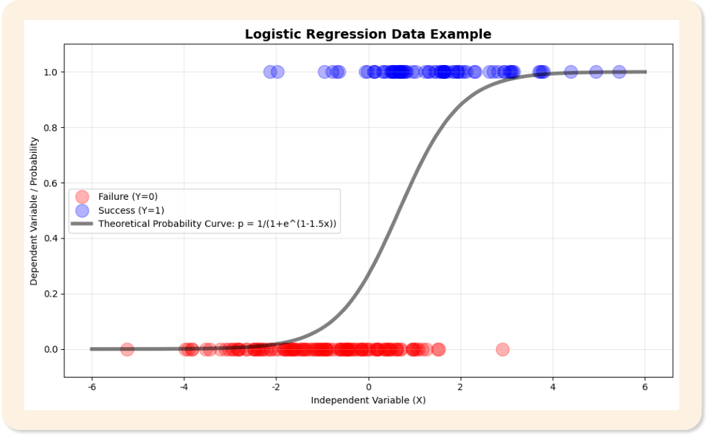

# 16. 이항로지스틱회귀분석

> 원본 PDF 범위: 427~453쪽 · PDF 설명 순서에 따라 재작성

## 주요 단어 먼저 보기

| 주요 단어 | 뜻 |
|---|---|
| 이항 로지스틱 회귀 | 결과가 0/1인 확률을 설명·예측 |
| 베르누이 시행 | 결과가 성공·실패 두 가지인 시행 |
| 로지스틱 함수 | 실수를 0~1 확률로 변환하는 S자 함수 |
| 오즈 | 성공확률을 실패확률로 나눈 값 |
| 로짓 | 오즈에 자연로그를 취한 값 |
| 최대우도추정 | 관측 결과가 가장 그럴듯한 계수를 찾는 방법 |
| 오즈비 | X 1단위 증가 전후 오즈의 비 |
| 임계값 | 예측확률을 클래스로 바꾸는 기준 |
| ROC-AUC | 여러 임계값에서 분류 순위 성능을 평가 |

> **단원 시작법:** 주요 단어의 뜻을 먼저 읽고, 아래 PDF 절 순서대로 학습한다.


<!-- TOC START -->
## 목차

- [1. 이항 로지스틱 회귀분석 개요](#1-이항-로지스틱-회귀분석-개요)
  - [모델](#모델)
- [2. 목적과 특징](#2-목적과-특징)
  - [오즈와 로짓](#오즈와-로짓)
- [3. 쓰임새](#3-쓰임새)
- [4. 베르누이 시행](#4-베르누이-시행)
- [5. 로지스틱 함수](#5-로지스틱-함수)
- [6. 최대우도추정](#6-최대우도추정)
  - [추정](#추정)
- [7. 가정](#7-가정)
  - [가정과 진단](#가정과-진단)
  - [완전분리](#완전분리)
- [8. 해석](#8-해석)
  - [계수 검정과 신뢰구간](#계수-검정과-신뢰구간)
- [9. 예측값 산출](#9-예측값-산출)
- [10. 평가](#10-평가)
  - [분류와 평가](#분류와-평가)
- [11. 수행 시 고려사항](#11-수행-시-고려사항)
- [12. 교재 문제와 해설](#12-교재-문제와-해설)
  - [문제 바로가기](#문제-바로가기)
  - [문제 1. 로지스틱 함수와 로짓함수](#문제-1-로지스틱-함수와-로짓함수)
  - [문제 2. 오즈비 해석](#문제-2-오즈비-해석)
  - [문제 3. 경계값과 재현율](#문제-3-경계값과-재현율)
  - [문제 4. 로지스틱 회귀 가정](#문제-4-로지스틱-회귀-가정)
  - [문제 5. ROC와 AUC](#문제-5-roc와-auc)
- [보충 학습](#보충-학습)
  - [규제 로지스틱 회귀](#규제-로지스틱-회귀)
  - [보강: 확률 보정](#보강-확률-보정)
  - [체크포인트](#체크포인트)
- [시험 직전 암기](#시험-직전-암기)
<!-- TOC END -->

## 1. 이항 로지스틱 회귀분석 개요

> **PDF 428쪽**

> **암기 한 줄:** 이진 결과의 확률을 로짓의 선형식으로 모델링한다.

### 모델

목표변수 $Y\in\{0,1\}$의 성공확률 $p=P(Y=1\mid X)$를 모델링한다.

$$
p=\frac{1}{1+e^{-\eta}},\qquad
\eta=\beta_0+\beta_1x_1+\cdots+\beta_px_p
$$

시그모이드 함수는 모든 실수를 0과 1 사이로 변환한다. 입력이 0이면 출력은 0.5다.



## 2. 목적과 특징

> **PDF 429쪽**

> **암기 한 줄:** 계수는 로그오즈 변화이고 exp(계수)는 오즈비다.

### 오즈와 로짓

$$
odds=\frac{p}{1-p},\qquad
logit(p)=\log\frac{p}{1-p}=\eta
$$

$x_j$가 1 증가할 때 오즈는 $e^{\beta_j}$배가 된다. 예를 들어 $\beta_j=0.693$이면 오즈비는 약 2다.

## 3. 쓰임새

> **PDF 430쪽**

> **암기 한 줄:** 질병·이탈·부도처럼 결과가 두 범주인 분류와 요인 해석에 쓴다.

- 질병 유무, 이탈 여부, 합격 여부처럼 결과가 두 범주일 때 확률 예측과 요인 해석에 사용한다.

대표적인 적용:

- 환자의 질병 발생 여부 예측
- 고객 이탈·잔존 분류
- 대출 부도·정상 상환 분류
- 광고 클릭·미클릭 예측

로지스틱 회귀는 최종 클래스뿐 아니라 $P(Y=1\mid X)$를 출력한다. 따라서 분류가 목적이면 임계값과 평가지표를 정하고, 설명이 목적이면 계수·오즈비·신뢰구간을 해석한다.

## 4. 베르누이 시행

> **PDF 431쪽**

> **암기 한 줄:** 각 관측의 결과는 0/1이고 성공확률 p를 가진다.

- $Y\in\{0,1\}$, $P(Y=1)=p$, $E(Y)=p$, $Var(Y)=p(1-p)$다. 로지스틱 회귀는 관측마다 다른 $p_i$를 설명한다.

## 5. 로지스틱 함수

> **PDF 432~433쪽**

> **암기 한 줄:** 시그모이드는 모든 실수를 0과 1 사이 확률로 바꾼다.

- $p=1/(1+e^{-z})$이며 $z=\beta_0+\beta^T x$다. 역변환하면 $\log[p/(1-p)]=z$가 된다.

$$
p=\frac{e^z}{1+e^z},\qquad 1-p=\frac{1}{1+e^z}
$$

- $z\to\infty$이면 $p\to1$
- $z\to-\infty$이면 $p\to0$
- $z=0$이면 $p=0.5$

선형식 $z$는 범위 제한이 없지만 로지스틱 함수를 통과한 예측확률은 항상 0과 1 사이가 된다. 이 때문에 0/1 결과에 선형회귀를 직접 적용할 때 생기는 범위 문제를 피할 수 있다.

## 6. 최대우도추정

> **PDF 434쪽**

> **암기 한 줄:** 관측된 0/1 결과가 가장 그럴듯해지는 계수를 찾는다.

### 추정

선형회귀처럼 최소제곱법을 쓰지 않고 관측된 0·1 결과의 우도를 최대화한다. 실무 구현에서는 음의 로그우도인 log loss를 최소화한다.

관측치 $i$의 베르누이 우도는 다음과 같다.

$$
L(\beta)=\prod_i p_i^{y_i}(1-p_i)^{1-y_i}
$$

로그우도는 곱을 합으로 바꾸며, 경사하강법·Newton 방법·준Newton 방법 등으로 최적화한다.

## 7. 가정

> **PDF 435쪽**

> **암기 한 줄:** 독립성, 로짓 선형성, 심한 다중공선성 부재를 확인한다.

### 가정과 진단

- 관측치 독립
- 연속형 설명변수와 로그오즈 사이의 선형성
- 완전분리 또는 준완전분리가 없음
- 심각한 다중공선성이 없음
- 충분한 사건 수

선형회귀의 잔차 정규성과 등분산성은 요구하지 않는다.

### 완전분리

한 설명변수 또는 조합이 0과 1을 완벽히 구분하면 최대우도 계수가 무한대로 발산한다. 데이터·범주를 점검하고 L2 규제, Firth 보정, 베이지안 사전분포 등을 고려한다.

## 8. 해석

> **PDF 436~439쪽**

> **암기 한 줄:** 오즈비 1은 변화 없음, 1보다 크면 오즈 증가, 작으면 감소다.

### 계수 검정과 신뢰구간

계수의 Wald 검정은 $z=\hat\beta_j/SE(\hat\beta_j)$를 사용한다. 오즈비의 신뢰구간은 계수 구간을 지수변환한다.

$$
CI(OR_j)=\left(e^{\hat\beta_j-z_{\alpha/2}SE},\ e^{\hat\beta_j+z_{\alpha/2}SE}\right)
$$

표본이 작거나 완전분리에 가까우면 Wald 근사가 불안정할 수 있어 우도비 검정이나 규제 방법을 고려한다.

## 9. 예측값 산출

> **PDF 440쪽**

> **암기 한 줄:** 예측확률을 임계값과 비교해 분류하며 임계값은 비용에 맞춰 정한다.

- 먼저 확률을 계산하고 임계값 이상이면 1로 분류한다. 임계값을 낮추면 일반적으로 재현율은 오르고 특이도는 내려간다.

예측은 두 단계로 수행한다.

1. 회귀식으로 로짓 $z$를 계산하고 로지스틱 함수로 확률 $\hat p$를 구한다.
2. $\hat p$를 임계값과 비교해 0 또는 1로 분류한다.

```text
임계값을 낮춤 → 1로 예측하는 사례 증가 → 재현율 증가 가능, 거짓양성 증가 가능
임계값을 높임 → 1로 예측하는 사례 감소 → 정밀도·특이도 증가 가능, 거짓음성 증가 가능
```

기본 임계값 0.5가 항상 최선은 아니다. 질병 누락 비용, 마케팅 연락 비용처럼 오류 비용에 따라 임계값을 선택한다.

## 10. 평가

> **PDF 441~442쪽**

> **암기 한 줄:** 혼동행렬·ROC-AUC·정밀도·재현율·보정을 목적에 맞게 본다.

### 분류와 평가

예측확률을 임계값과 비교해 클래스로 바꾼다. 정확도, 정밀도, 재현율, F1, ROC-AUC, PR-AUC를 목적에 맞게 선택한다.

임계값을 낮추면 일반적으로 재현율은 올라가고 정밀도는 내려간다. 비용함수 $C_{FP}FP+C_{FN}FN$ 또는 업무 처리량을 기준으로 임계값을 선택한다.

## 11. 수행 시 고려사항

> **PDF 443쪽**

> **암기 한 줄:** 불균형·완전분리·비선형성·임계값 선택을 점검한다.

- 완전분리, 불균형, 비선형 로짓, 다중공선성, 영향점과 확률 보정을 확인한다.

- **완전분리:** 어떤 변수 조합이 클래스를 완전히 나누면 계수 추정값이 매우 커질 수 있다.
- **클래스 불균형:** 정확도만 보면 소수 클래스를 놓칠 수 있어 정밀도·재현율·F1을 함께 본다.
- **로짓 선형성:** 연속형 X와 확률 p가 아니라 X와 `logit(p)`의 관계가 선형이어야 한다.
- **다중공선성:** 계수와 오즈비의 표준오차가 커지고 해석이 불안정해질 수 있다.
- **영향점:** 소수 관측값이 계수를 크게 바꾸는지 확인한다.
- **확률 보정:** 예측확률 0.8인 사례 중 실제 약 80%가 양성인지 점검한다.

> **시험 순서:** `가정 확인 → 확률 산출 → 임계값 분류 → 혼동행렬 기반 평가`.

## 12. 교재 문제와 해설

> **원문 단원 말미 문제 전체 수록**

> 먼저 문제와 보기를 풀고, **정답 및 선택지별 해설 보기**를 펼쳐 확인하세요. 일반 4지선다 문항은 ①~④를 모두 해설하며, 원문이 2지선다인 경우에는 실제 보기만 수록합니다.

### 문제 바로가기

| 문제 | 주제 | 관련 목차 | PDF |
|---:|---|---|---:|
| [1](#ch16-q1) | 로지스틱 함수와 로짓함수 | [5. 로지스틱 함수](#5-로지스틱-함수) | 444쪽 |
| [2](#ch16-q2) | 오즈비 해석 | [8. 해석](#8-해석) | 446쪽 |
| [3](#ch16-q3) | 경계값과 재현율 | [9. 예측값 산출](#9-예측값-산출) · [10. 평가](#10-평가) | 448쪽 |
| [4](#ch16-q4) | 로지스틱 회귀 가정 | [7. 가정](#7-가정) | 450쪽 |
| [5](#ch16-q5) | ROC와 AUC | [10. 평가](#10-평가) | 452쪽 |

<a id="ch16-q1"></a>

### 문제 1. 로지스틱 함수와 로짓함수

**출처:** PDF 444쪽  
**관련 목차:** [5. 로지스틱 함수](#5-로지스틱-함수)

로지스틱 함수와 로짓함수의 관계에 대한 설명으로 가장 적절한 것은?

1. 두 함수는 동일한 함수이다.
2. 로지스틱 함수는 확률을 선형예측자로, 로짓함수는 선형예측자를 확률로 변환한다.
3. 로지스틱 함수는 선형예측자를 확률로, 로짓함수는 확률을 선형예측자로 변환한다.
4. 두 함수는 서로 독립적이며 관련이 없다.

<details>
<summary>정답 및 선택지별 해설 보기</summary>

**정답: ③ 로지스틱 함수는 선형예측자를 확률로, 로짓함수는 확률을 선형예측자로 변환한다.**

- **① 오답:** 두 함수는 같은 식이 아니라 서로 반대 방향으로 변환하는 역함수다.
- **② 오답:** 변환 방향을 거꾸로 설명했다. sigmoid가 η→p, logit이 p→η다.
- **③ 정답:** p=1/(1+e⁻η)는 실수 η를 0~1 확률로, log[p/(1−p)]는 확률을 실수 선형예측자로 바꾼다.
- **④ 오답:** logit(sigmoid(η))=η인 역함수 관계이므로 밀접하게 연결된다.

</details>

<a id="ch16-q2"></a>

### 문제 2. 오즈비 해석

**출처:** PDF 446쪽  
**관련 목차:** [8. 해석](#8-해석)

오즈비(OR)가 0.6일 때의 해석으로 옳은 것은?

> **문항 주의:** 교재는 ④를 정답으로 표시하지만, 오즈비의 정확한 해석은 ②입니다. 시험 답안은 교재 표시를 확인하되 개념은 ‘오즈 40% 감소’로 외우세요.

1. 해당 변수가 성공확률을 60% 증가시킨다.
2. 해당 변수가 성공 오즈를 40% 감소시킨다.
3. 해당 변수가 결과에 영향이 없다.
4. 해당 변수가 성공확률을 40% 감소시킨다.

<details>
<summary>정답 및 선택지별 해설 보기</summary>

**정답: ④ 해당 변수가 성공확률을 40% 감소시킨다.**

- **① 오답:** OR<1은 증가가 아니라 오즈 감소 방향이며 0.6은 60% 증가를 뜻하지 않는다.
- **② 오답:** 개념상 옳은 설명. 오즈가 기준의 0.6배이므로 성공 오즈는 1−0.6=40% 감소한다. 엄밀한 통계 해석에서는 ②가 맞다.
- **③ 오답:** 영향이 없다는 기준은 OR=1이다.
- **④ 정답:** 교재 표시 정답이지만 엄밀히는 부정확하다. 오즈비는 확률비가 아니므로 기준확률을 모르면 성공확률이 정확히 40% 감소한다고 말할 수 없다. 교재는 ‘오즈’를 ‘확률’로 단순화했다.

</details>

<a id="ch16-q3"></a>

### 문제 3. 경계값과 재현율

**출처:** PDF 448쪽  
**관련 목차:** [9. 예측값 산출](#9-예측값-산출) · [10. 평가](#10-평가)

이항 로지스틱 회귀분석에서 경계값(cut-off)을 0.5에서 0.8로 높였을 때 예상되는 결과로 옳은 것은?

1. 재현율(Recall)은 감소한다.
2. 재현율은 증가한다.
3. 정밀도와 재현율이 모두 증가한다.
4. 정밀도와 재현율이 모두 감소한다.

<details>
<summary>정답 및 선택지별 해설 보기</summary>

**정답: ① 재현율(Recall)은 감소한다.**

- **① 정답:** 양성 판정 기준이 엄격해져 TP가 줄고 FN이 늘 수 있으므로 Recall=TP/(TP+FN)은 감소하거나 같아진다.
- **② 오답:** 더 높은 경계값은 양성으로 잡는 범위를 줄이므로 재현율이 증가하는 방향이 아니다.
- **③ 오답:** 재현율은 감소한다. 정밀도는 FP와 TP 감소 비율에 따라 보통 좋아질 수 있지만 반드시 증가한다고 단정할 수 없다.
- **④ 오답:** 재현율 감소는 예상되지만 정밀도는 데이터에 따라 증가·감소할 수 있어 둘 다 감소한다고 보장할 수 없다.

</details>

<a id="ch16-q4"></a>

### 문제 4. 로지스틱 회귀 가정

**출처:** PDF 450쪽  
**관련 목차:** [7. 가정](#7-가정)

이항 로지스틱 회귀분석의 가정으로 옳지 않은 것은?

1. 관측치들이 서로 독립적이어야 한다.
2. 연속 독립변수와 로짓 간 선형관계가 성립해야 한다.
3. 종속변수가 정규분포를 따라야 한다.
4. 독립변수들 간 높은 상관관계가 없어야 한다.

<details>
<summary>정답 및 선택지별 해설 보기</summary>

**정답: ③ 종속변수가 정규분포를 따라야 한다.**

- **① 오답:** 정답이 아님. 독립 관측 가정이 깨지면 표준오차와 추론이 왜곡될 수 있다.
- **② 오답:** 정답이 아님. 원래 확률 p가 아니라 연속 예측변수와 logit(p)의 선형성을 가정한다.
- **③ 정답:** 정답(옳지 않은 설명). 이진 종속변수는 베르누이분포, 성공횟수는 이항분포를 따른다. 정규성은 요구하지 않는다.
- **④ 오답:** 정답이 아님. 심한 다중공선성은 계수 추정의 분산과 해석 안정성을 해치므로 피해야 한다.

</details>

<a id="ch16-q5"></a>

### 문제 5. ROC와 AUC

**출처:** PDF 452쪽  
**관련 목차:** [10. 평가](#10-평가)

ROC 커브와 AUC에 대한 설명 중 옳은 것을 모두 고른 것은?

- ㄱ. ROC 커브의 x축은 거짓양성률(FPR), y축은 참양성률(TPR)이다.
- ㄴ. AUC가 0.5에 가까울수록 분류성능이 우수하다.
- ㄷ. ROC 커브가 대각선에 가까울수록 랜덤 분류기와 유사한 성능이다.
- ㄹ. 경계값이 증가하면 AUC도 증가한다.

1. ㄱ, ㄴ
2. ㄱ, ㄷ
3. ㄷ, ㄹ
4. ㄱ, ㄴ, ㄷ

<details>
<summary>정답 및 선택지별 해설 보기</summary>

**정답: ② ㄱ, ㄷ**

- **① 오답:** ㄱ은 맞지만 AUC=0.5는 무작위 수준이므로 ㄴ이 틀리다.
- **② 정답:** ROC는 여러 경계값의 (FPR,TPR)을 그리고 대각선은 무작위 성능을 뜻한다.
- **③ 오답:** ㄷ은 맞지만 AUC는 전체 경계값을 훑은 곡선의 면적이므로 특정 cut-off를 올린다고 함께 증가하지 않는다.
- **④ 오답:** ㄴ이 틀리다. AUC는 1에 가까울수록 순위 분리 성능이 좋다.

</details>

## 보충 학습

> 원문 절 순서를 모두 학습한 뒤 이해와 문제 적용력을 높이는 확장 내용이다.

### 규제 로지스틱 회귀

- L2: 계수를 부드럽게 축소해 공선성과 과적합을 완화
- L1: 일부 계수를 0으로 만들어 희소한 모델 생성

규제강도는 교차검증으로 정하고, 규제 모델의 계수 검정은 일반 최대우도 결과와 동일하게 해석하지 않는다.

### 보강: 확률 보정

좋은 AUC가 좋은 확률을 보장하지 않는다. 위험도 자체를 의사결정에 사용한다면 calibration curve와 Brier score로 확률 보정을 확인한다.

오즈비가 2라는 것은 확률이 2배라는 뜻이 아니다. 기준확률이 0.1이면 오즈는 0.111이고 두 배 오즈 0.222는 확률 약 0.182에 해당한다.

### 체크포인트

- 계수는 확률 변화가 아니라 로그오즈 변화다.
- 오즈비는 $e^\beta$다.
- 임계값 0.5는 업무 비용을 반영해 바꿀 수 있다.

## 시험 직전 암기

- 이진 결과의 확률을 로짓의 선형식으로 모델링한다.
- 계수는 로그오즈 변화이고 exp(계수)는 오즈비다.
- 질병·이탈·부도처럼 결과가 두 범주인 분류와 요인 해석에 쓴다.
- 각 관측의 결과는 0/1이고 성공확률 p를 가진다.
- 시그모이드는 모든 실수를 0과 1 사이 확률로 바꾼다.
- 관측된 0/1 결과가 가장 그럴듯해지는 계수를 찾는다.
- 독립성, 로짓 선형성, 심한 다중공선성 부재를 확인한다.
- 오즈비 1은 변화 없음, 1보다 크면 오즈 증가, 작으면 감소다.
- 예측확률을 임계값과 비교해 분류하며 임계값은 비용에 맞춰 정한다.
- 혼동행렬·ROC-AUC·정밀도·재현율·보정을 목적에 맞게 본다.
- 불균형·완전분리·비선형성·임계값 선택을 점검한다.
