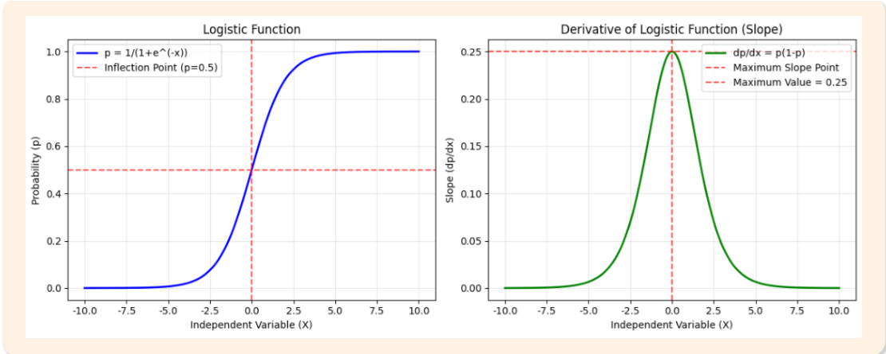
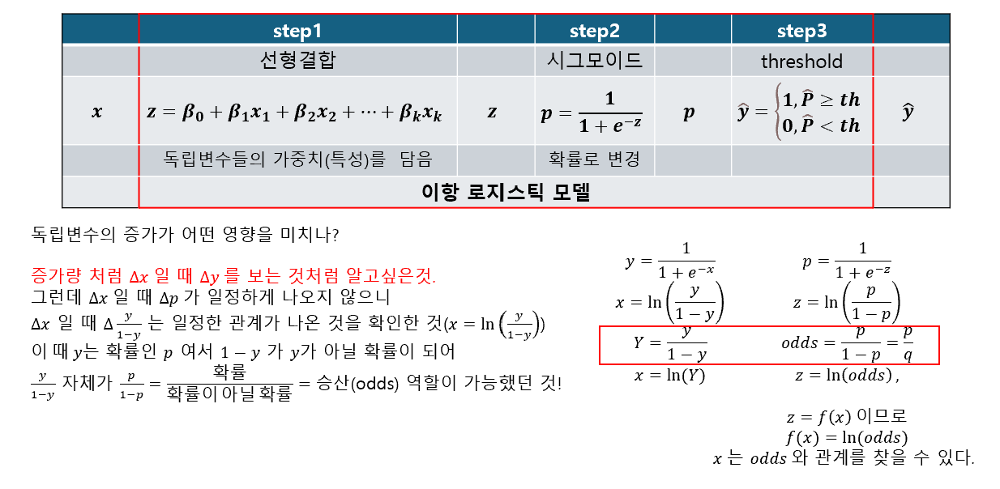
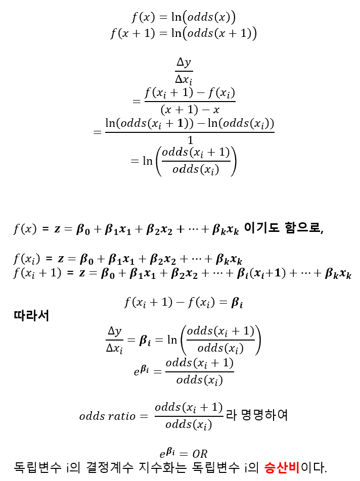
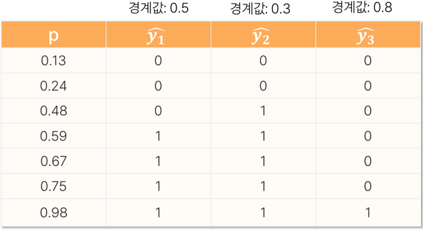
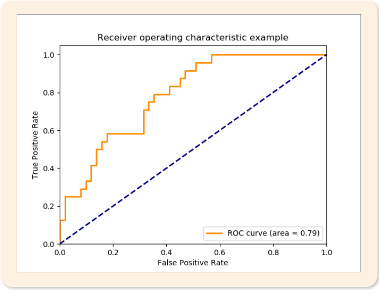

# 16. 이항로지스틱회귀분석

> 원본 PDF 범위: 427~453쪽 · PDF 설명 순서에 따라 재작성

## 주요 단어 먼저 보기

| 주요 단어 | 뜻 |
|---|---|
| 이항 로지스틱 회귀 | 결과가 0/1인 확률을 설명·예측 |
| 베르누이 시행 | 결과가 성공·실패 두 가지인 시행 |
| 로지스틱 함수 | 실수를 0~1 확률로 변환하는 S자 함수 |
| 오즈 | 성공확률을 실패확률로 나눈 값 |
| 로짓 | 오즈에 자연로그를 취한 값 |
| 최대우도추정 | 관측 결과가 가장 그럴듯한 계수를 찾는 방법 |
| 오즈비 | X 1단위 증가 전후 오즈의 비 |
| 임계값 | 예측확률을 클래스로 바꾸는 기준 |
| ROC-AUC | 여러 임계값에서 분류 순위 성능을 평가 |
| 일반화선형모형(GLM) | 선형예측자와 연결함수로 다양한 분포의 평균을 모델링 |
| 로짓 연결함수 | 확률을 범위 제한이 없는 로그오즈로 연결 |
| 완전분리 | 독립변수가 0과 1을 완벽히 구분해 계수가 발산하는 현상 |
| 사건 수(EPV) | 독립변수 하나당 확보된 관심 사건의 수 |

> **단원 시작법:** 주요 단어의 뜻을 먼저 읽고, 아래 PDF 절 순서대로 학습한다.


<!-- TOC START -->
## 목차

- [16. 이항로지스틱회귀분석](#16-이항로지스틱회귀분석)
  - [주요 단어 먼저 보기](#주요-단어-먼저-보기)
  - [목차](#목차)
  - [1. 이항 로지스틱 회귀분석 개요](#1-이항-로지스틱-회귀분석-개요)
    - [모델](#모델)
  - [2. 목적과 특징](#2-목적과-특징)
  - [3. 쓰임새](#3-쓰임새)
  - [4. 베르누이 시행](#4-베르누이-시행)
  - [5. 로지스틱 함수](#5-로지스틱-함수)
  - [6. 최대우도추정](#6-최대우도추정)
    - [추정](#추정)
  - [7. 가정](#7-가정)
    - [가정과 진단](#가정과-진단)
    - [완전분리](#완전분리)
  - [8. 해석](#8-해석)
    - [전체 흐름: 입력에서 분류까지](#전체-흐름-입력에서-분류까지)
    - [오즈와 로짓](#오즈와-로짓)
      - [확률과 오즈의 차이](#확률과-오즈의-차이)
      - [오즈·로그오즈·시그모이드의 관계](#오즈로그오즈시그모이드의-관계)
    - [회귀계수와 오즈비](#회귀계수와-오즈비)
      - [왜 계수를 오즈비로 바꾸는가?](#왜-계수를-오즈비로-바꾸는가)
      - [연속형 독립변수 해석](#연속형-독립변수-해석)
      - [범주형 독립변수 해석](#범주형-독립변수-해석)
      - [절편 해석](#절편-해석)
      - [🌟가장 중요한 함정: 오즈비는 확률비가 아니다](#가장-중요한-함정-오즈비는-확률비가-아니다)
      - [여러 변수가 있는 모델의 해석](#여러-변수가-있는-모델의-해석)
    - [계수 검정과 신뢰구간](#계수-검정과-신뢰구간)
  - [9. 예측값 산출](#9-예측값-산출)
  - [10. 평가](#10-평가)
    - [분류와 평가](#분류와-평가)
  - [11. 수행 시 고려사항](#11-수행-시-고려사항)
  - [12. 교재 문제와 해설](#12-교재-문제와-해설)
    - [문제 바로가기](#문제-바로가기)
    - [문제 1. 로지스틱 함수와 로짓함수](#문제-1-로지스틱-함수와-로짓함수)
    - [문제 2. 오즈비 해석](#문제-2-오즈비-해석)
    - [문제 3. 경계값과 재현율](#문제-3-경계값과-재현율)
    - [문제 4. 로지스틱 회귀 가정](#문제-4-로지스틱-회귀-가정)
    - [문제 5. ROC와 AUC](#문제-5-roc와-auc)
  - [보충 학습](#보충-학습)
    - [규제 로지스틱 회귀](#규제-로지스틱-회귀)
    - [보강: 확률 보정](#보강-확률-보정)
    - [체크포인트](#체크포인트)
  - [시험 직전 암기](#시험-직전-암기)
<!-- TOC END -->

## 1. 이항 로지스틱 회귀분석 개요

> **PDF 428쪽**

> **암기 한 줄:** 이진 결과의 확률을 로짓의 선형식으로 모델링한다.

### 모델

목표변수 $Y\in\{0,1\}$의 성공확률 $p=P(Y=1\mid X)$를 모델링한다.

$$
p=\frac{1}{1+e^{-\eta}},\qquad
\eta=\beta_0+\beta_1x_1+\cdots+\beta_px_p
$$

시그모이드 함수는 모든 실수를 0과 1 사이로 변환한다. 입력이 0이면 출력은 0.5다.


교재의 관련 용어를 서로 연결하면 다음과 같다.

| 용어 | 교재의 핵심 의미 | 이 단원에서의 역할 |
|---|---|---|
| 일반화선형모형(GLM) | 종속변수와 독립변수 관계를 선형예측자로 표현 | $\eta=X\beta$를 만든다 |
| 로짓 연결함수 | 확률 $p$와 선형예측자 $\eta$를 연결 | $\ln\{p/(1-p)\}=\eta$ |
| 베르누이 시행 | 성공·실패 중 하나가 나오는 단일 실험 | 개별 관측값 $Y_i$의 분포 |
| 최대우도추정(MLE) | 관측 데이터가 나타날 가능성을 가장 크게 하는 모수 추정 | 회귀계수 $\beta$를 추정 |

> **선형회귀와 구분:** 선형회귀는 $Y$의 평균을 직접 선형식으로 설명하지만, 로지스틱 회귀는 **성공확률의 로짓**을 선형식으로 설명한다.

## 2. 목적과 특징

> **PDF 429쪽**

> **암기 한 줄:** 계수는 로그오즈 변화이고 exp(계수)는 오즈비다.

교재가 제시한 목적은 세 가지다.

1. 정상·고장, 성공·실패와 같은 **이진 결과를 예측**한다.
2. 독립변수가 사건 발생확률에 미치는 영향을 **정량적으로 측정**한다.
3. 분류 문제를 해결하는 예측모델을 만든다.

주요 특징은 다음과 같다.

- 개별 관측값은 베르누이분포, 동일 조건의 성공 횟수처럼 묶인 자료는 이항분포로 다룰 수 있다.
- 예측값은 $0<p<1$인 확률이다.
- 독립변수와 성공확률의 관계는 직선이 아니라 S자형 시그모이드 곡선이다.
- 최소제곱법이 아니라 최대우도추정법으로 모수를 추정한다.

## 3. 쓰임새

> **PDF 430쪽**

> **암기 한 줄:** 질병·이탈·부도처럼 결과가 두 범주인 분류와 요인 해석에 쓴다.

- 질병 유무, 이탈 여부, 합격 여부처럼 결과가 두 범주일 때 확률 예측과 요인 해석에 사용한다.

대표적인 적용:

- **의학·보건학:** 질병 진단 예측, 치료법 효과 분석, 위험요인 식별
- **마케팅·비즈니스:** 고객 구매의사 예측, 이탈고객 분석, 캠페인 반응 예측
- **금융:** 신용평가·대출승인, 부도위험 예측, 보험청구 분석
- **공학·기술:** 제품 품질 판정, 시스템 고장 예측, 품질관리 분석
- **인사관리:** 채용 의사결정 지원, 승진 가능성 예측, 직원 만족도 분석
- **교육:** 학습자 성취도 예측, 진로선택 분석, 교육프로그램 효과 평가

로지스틱 회귀는 최종 클래스뿐 아니라 $P(Y=1\mid X)$를 출력한다. 따라서 분류가 목적이면 임계값과 평가지표를 정하고, 설명이 목적이면 계수·오즈비·신뢰구간을 해석한다.

## 4. 베르누이 시행

> **PDF 431쪽**

> **암기 한 줄:** 각 관측의 결과는 0/1이고 성공확률 p를 가진다.

- $Y\in\{0,1\}$, $P(Y=1)=p$, $E(Y)=p$, $Var(Y)=p(1-p)$다. 로지스틱 회귀는 관측마다 다른 $p_i$를 설명한다.

교재가 정리한 베르누이 시행의 조건은 다음과 같다.

- **이항성:** 결과는 반드시 성공과 실패 두 가지 중 하나다.
- **확률의 합:** 성공확률이 $p$이면 실패확률은 $1-p$이고 둘의 합은 1이다.
- **독립성:** 반복 시행의 결과가 서로 영향을 주지 않는다.
- **일정성:** 동일한 조건 아래 반복할 때 성공확률 $p$가 일정하다.

로지스틱 회귀에서는 관측치의 조건 $X_i$가 다르면 성공확률도 $p_i$로 달라진다. 따라서 ‘확률 일정’은 **같은 설명변수 조건에서의 반복 시행**으로 이해해야 한다.

## 5. 로지스틱 함수

> **PDF 432~433쪽**

> **암기 한 줄:** 시그모이드는 모든 실수를 0과 1 사이 확률로 바꾼다.

- $p=1/(1+e^{-z})$이며 $z=\beta_0+\beta^T x$다. 역변환하면 $\ln[p/(1-p)]=z$가 된다.

$$
p=\frac{e^z}{1+e^z},\qquad 1-p=\frac{1}{1+e^z}
$$

- $z\to\infty$이면 $p\to1$
- $z\to-\infty$이면 $p\to0$
- $z=0$이면 $p=0.5$

선형식 $z$는 범위 제한이 없지만 로지스틱 함수를 통과한 예측확률은 항상 0과 1 사이가 된다. 이 때문에 0/1 결과에 선형회귀를 직접 적용할 때 생기는 범위 문제를 피할 수 있다.

교재의 함수 특징을 빠짐없이 정리하면 다음과 같다.

- 정의역은 $(-\infty,+\infty)$, 치역은 $(0,1)$이다.
- $p=0.5$인 지점이 변곡점이며 이 지점을 중심으로 점대칭이다.
- 미분값은 $dp/dz=p(1-p)$이고 $p=0.5$에서 최대 $0.25$다.
- $p$가 0이나 1에 가까워질수록 기울기가 작아져 확률 변화가 둔화된다.



*그림: 확률곡선의 변곡점과 도함수의 최대값 0.25 — 원문 슬라이드의 그래프만 잘라 수록.*

## 6. 최대우도추정

> **PDF 434쪽**

> **암기 한 줄:** 관측된 0/1 결과가 가장 그럴듯해지는 계수를 찾는다.

### 추정

선형회귀처럼 최소제곱법을 쓰지 않고 관측된 0·1 결과의 우도를 최대화한다. 실무 구현에서는 음의 로그우도인 log loss를 최소화한다.

관측치 $i$의 베르누이 우도는 다음과 같다.

$$
L(\beta)=\prod_i p_i^{y_i}(1-p_i)^{1-y_i}
$$

로그우도는 곱을 합으로 바꾸며, 경사하강법·Newton 방법·준Newton 방법 등으로 최적화한다.

일반적인 확률밀도 또는 확률질량함수가 $f(x;\theta)$일 때 교재의 최대우도추정은 다음 흐름이다.

$$
L(\theta)=\prod_{i=1}^{n}f(x_i\mid\theta),\qquad
\ell(\theta)=\ln L(\theta)=\sum_{i=1}^{n}\ln f(x_i\mid\theta)
$$

$$
\hat\theta_{MLE}=\arg\max_\theta \ell(\theta)
$$

로지스틱 회귀의 음의 평균 로그우도는 이진 교차엔트로피와 같은 형태다.

$$
LogLoss=-\frac1n\sum_{i=1}^{n}
\left[y_i\ln p_i+(1-y_i)\ln(1-p_i)\right]
$$

> **암기:** 최대우도는 **관측된 답에 높은 확률을 주는 계수**를 찾는다.

## 7. 가정

> **PDF 435쪽**

> **암기 한 줄:** 독립성, 로짓 선형성, 심한 다중공선성 부재를 확인한다.

### 가정과 진단

- 관측치 독립
- 연속형 설명변수와 로그오즈 사이의 선형성
- 완전분리 또는 준완전분리가 없음
- 심각한 다중공선성이 없음
- 충분한 사건 수

선형회귀의 잔차 정규성과 등분산성은 요구하지 않는다.

### 완전분리

한 설명변수 또는 조합이 0과 1을 완벽히 구분하면 최대우도 계수가 무한대로 발산한다. 데이터·범주를 점검하고 L2 규제, Firth 보정, 베이지안 사전분포 등을 고려한다.

교재의 표를 정리하면 왼쪽 자료는 $Y=0$의 최대 $X$가 57이고 $Y=1$의 최소 $X$가 68이므로 두 집단 사이에 완벽한 경계가 존재한다. 오른쪽 자료는 $Y=0$에 $X=90$, $Y=1$에 $X=25$가 있어 값이 겹치므로 완전분리가 아니다.

| 완전분리 자료 | $X$ 값 |
|---|---|
| $Y=0$ | 24, 33, 53, 57 |
| $Y=1$ | 68, 72, 82 |

| 분리되지 않은 자료 | $X$ 값 |
|---|---|
| $Y=0$ | 34, 52, 58, 90 |
| $Y=1$ | 25, 75, 80 |

큰 표본이 필요한 이유는 최대우도추정량과 Wald 검정의 근사가 표본이 작을 때 불안정할 수 있기 때문이다. 단순히 전체 표본 수만 볼 것이 아니라 더 적은 범주의 **사건 수**를 확인한다.

## 8. 해석

> **PDF 436~439쪽**

> **암기 한 줄:** $X$로 점수 $z$를 만들고, 시그모이드로 확률을 구한 뒤, 필요하면 임계값으로 분류한다. 계수의 영향은 $OR=e^\beta$로 해석한다.



  - 이항 로지스틱 회귀
    - 이항 = threshold 로 True,False 를 구분하겠다.
    - 로지스틱 = 독립변수의 영향력을 확률로 표현하겠다.
      - 모델
        - 독립변수의 영향력 = 결정계수들의 선형 함수
        - 확률로 표현 = 시그모이드 함수
### 전체 흐름: 입력에서 분류까지

먼저 기호의 역할을 구분한다.

| 기호 | 역할 | 합격 예측 예시 |
|---|---|---|
| $X$ | 모델에 넣는 독립변수 | 공부 시간, 출석률 |
| $z$ | 독립변수로 계산한 선형점수 | 합격 경향 점수 1.2 |
| $\hat p$ | 모델이 예측한 $Y=1$의 확률 | 합격확률 0.768 |
| $y$ | 실제로 관측한 정답 | 실제 합격 1 또는 불합격 0 |
| $\hat y$ | 임계값으로 결정한 예측분류 | 합격 1 또는 불합격 0 |

로지스틱 회귀는 먼저 독립변수들의 영향을 하나의 점수로 합친다.

$$
\boxed{z=\beta_0+\beta_1x_1+\cdots+\beta_kx_k}
$$

$z$는 새로 관측한 종속변수가 아니라 모델이 계산한 **중간 점수**다. 긴 선형식을 반복해서 쓰지 않기 위해 $z$라는 이름을 붙인 것이다. 이 점수는 음수나 1보다 큰 값도 가질 수 있으므로 확률 자체는 아니다.

확률을 $p=\beta_0+\beta_1x$처럼 직선으로 직접 계산하면 음수나 1보다 큰 잘못된 확률이 나올 수 있다. 그래서 범위 제한이 없는 $z$를 먼저 계산하고, 시그모이드 함수로 0과 1 사이의 예측확률로 바꾼다.

$$
\boxed{\hat p=\frac{1}{1+e^{-z}}}
$$

분류가 필요하면 예측확률을 임계값 $c$와 비교한다.

$$
\boxed{
\hat y=
\begin{cases}
1,&\hat p\ge c\\
0,&\hat p<c
\end{cases}}
$$

전체 예측 과정은 다음과 같다.

$$
\boxed{
X
\;\longrightarrow\;
z=X\beta
\;\xrightarrow{\text{시그모이드}}\;
\hat p
\;\xrightarrow{\text{임계값}}\;
\hat y}
$$

실제 종속변수 $y$가 다시 시그모이드의 입력으로 들어가는 것은 아니다. 학습할 때는 $\hat p$와 실제 정답 $y$를 비교해 손실을 계산하고 계수 $\beta$를 조정한다. 학습이 끝난 뒤 새로운 자료를 예측할 때는 $X\rightarrow z\rightarrow\hat p\rightarrow\hat y$만 계산한다.

> **시그모이드와 임계값의 역할:** 시그모이드는 점수 $z$를 확률 $\hat p$로 바꾸고, 임계값은 그 확률을 최종 범주 $\hat y$로 바꾼다. 확률 예측만 필요하면 임계값을 적용하지 않아도 된다.

기본 모델은 선택한 특성들의 선형결합으로 $z$를 만든다. 하지만 $x^2$, $\ln x$, 범주형 더미변수, $x_1x_2$ 같은 상호작용항을 특성으로 추가할 수 있으므로 원래 독립변수와 확률 사이의 더 복잡한 관계도 표현할 수 있다.

해석을 시작하기 전에는 **어떤 결과를 1로 정했는지** 반드시 확인한다. 모델의 $p$는 $P(Y=1)$이기 때문이다. 합격=1이면 양의 계수는 합격 오즈 증가를, 불합격=1이면 같은 양의 계수도 불합격 오즈 증가를 뜻한다.

### 오즈와 로짓

#### 확률과 오즈의 차이

확률은 전체 중 사건이 발생할 몫이고, 오즈(odds)는 **사건이 발생할 가능성과 발생하지 않을 가능성의 비**다.

$$
\boxed{Odds=\frac{P(Y=1)}{P(Y=0)}=\frac{p}{1-p}}
$$

예를 들어 합격확률이 0.8이라면 불합격확률은 0.2이고, 합격 오즈는 $0.8/0.2=4$다. 이는 **합격 가능성과 불합격 가능성의 비가 4:1**이라는 뜻이다.

| 확률 $p$ | 오즈 $p/(1-p)$ | 비로 읽기 | 의미 |
|---:|---:|---:|---|
| 0.2 | 0.25 | 1:4 | 사건 발생 가능성이 미발생의 1/4 |
| 0.5 | 1 | 1:1 | 발생과 미발생 가능성이 같음 |
| 0.8 | 4 | 4:1 | 사건 발생 가능성이 미발생의 4배 |

$Odds=1.6$은 사건 발생 가능성이 미발생 가능성의 1.6배라는 뜻이다. 확률이 1.6배라는 뜻은 아니며, 이때 사건 발생확률은 $1.6/(1+1.6)\approx0.615$다. 또한 $Odds=0.4$라면 미발생 가능성은 발생 가능성의 $1/0.4=2.5$배이지, $1-0.4=0.6$배가 아니다.

오즈를 확률로 되돌릴 때는 다음 식을 사용한다.

$$
\boxed{p=\frac{Odds}{1+Odds}}
$$

따라서 확률과 오즈는 같은 숫자가 아니다. 확률은 0과 1 사이지만 오즈는 0부터 무한대까지 가능하다.

#### 오즈·로그오즈·시그모이드의 관계

로짓은 오즈에 자연로그 $\ln$을 취한 값이다. 자연로그는 밑이 $e$인 로그이며, 역함수는 $e^{(\cdot)}$다.

$$
\boxed{
\operatorname{logit}(p)
=\ln(Odds)
=\ln\frac{p}{1-p}
=z
=\beta_0+\beta_1X_1+\cdots+\beta_kX_k}
$$

| 확률 $p$ | 오즈 | 로짓 $\ln(Odds)$ |
|---:|---:|---:|
| 0.2 | 0.25 | 약 -1.386 |
| 0.5 | 1 | 0 |
| 0.8 | 4 | 약 1.386 |

- $p<0.5$이면 오즈가 1보다 작으므로 로짓은 음수다.
- $p=0.5$이면 오즈가 1이고 $\ln(1)=0$이므로 로짓은 0이다.
- $p>0.5$이면 오즈가 1보다 크므로 로짓은 양수다.

확률을 로짓으로 바꾸면 값의 범위가 $(-\infty,+\infty)$가 되어 선형점수 $z$와 연결할 수 있다. 반대로 로그오즈 식을 확률에 대해 풀면 시그모이드 함수가 나온다.

$$
\begin{aligned}
\ln\frac{p}{1-p}&=z\\
\frac{p}{1-p}&=e^z\\
p&=e^z(1-p)\\
p(1+e^z)&=e^z\\
p&=\frac{e^z}{1+e^z}
=\frac{1}{1+e^{-z}}
\end{aligned}
$$

따라서 로짓과 시그모이드는 서로 반대 방향으로 변환하는 역함수다.

$$
\boxed{
z
\;\xrightarrow{\text{시그모이드}}\;
p,\qquad
p
\;\xrightarrow{\text{로그오즈}}\;
z}
$$

오즈와 로그오즈는 시그모이드를 사후에 설명하기 위해 붙인 개념만이 아니다. 로지스틱 회귀가 **로그오즈를 독립변수의 선형식으로 모델링한다**고 정의했기 때문에, 그 식을 확률에 대해 풀었을 때 시그모이드가 나타나는 것이다.

예를 들어 $z=x-3$인 모델은 다음과 같이 작동한다.

| 공부 시간 $x$ | 선형점수 $z$ | 예측확률 $\hat p$ |
|---:|---:|---:|
| 1 | -2 | 약 0.119 |
| 2 | -1 | 약 0.269 |
| 3 | 0 | 0.500 |
| 4 | 1 | 약 0.731 |
| 5 | 2 | 약 0.881 |

$x$가 1 증가할 때 $z$는 항상 1씩 증가하지만 확률은 각각 약 15.0%p, 23.1%p, 23.1%p, 15.0%p 증가한다. [로지스틱 함수 그림](#5-로지스틱-함수)처럼 확률은 S자 곡선이므로 같은 $x$ 증가에도 확률 증가량이 위치에 따라 달라진다.

### 회귀계수와 오즈비

#### 왜 계수를 오즈비로 바꾸는가?

확률의 증가량은 S자 곡선의 위치에 따라 달라져 하나의 일정한 값으로 말하기 어렵다. 반면 로그오즈의 증가량과 오즈의 증가 **비율**은 일정하다. 이를 한 단계씩 유도해 보자.

설명을 단순하게 하기 위해 독립변수가 하나인 모델을 사용한다.

$$
z(x)=\beta_0+\beta_1x
=\ln(Odds(x))
$$

$x$가 1 증가했을 때는

$$
\begin{aligned}
z(x+1)
&=\beta_0+\beta_1(x+1)\\
&=\beta_0+\beta_1x+\beta_1
\end{aligned}
$$

이므로 두 점수의 차이는

$$
\begin{aligned}
z(x+1)-z(x)
&=\{\beta_0+\beta_1x+\beta_1\}
-\{\beta_0+\beta_1x\}\\
&=\beta_1
\end{aligned}
$$

이다. 즉, $x$가 1 증가할 때 로그오즈가 항상 $\beta_1$만큼 증가한다. $z(x)=\ln(Odds(x))$를 대입하면

$$
\ln(Odds(x+1))-\ln(Odds(x))=\beta_1
$$

이다. 자연로그의 성질

$$
\ln A-\ln B=\ln\left(\frac{A}{B}\right)
$$

을 사용하면

$$
\ln\left(
\frac{Odds(x+1)}{Odds(x)}
\right)=\beta_1
$$

이 된다. 양변에 자연로그의 역함수인 지수함수 $e^{(\cdot)}$를 적용하면

$$
e^{
\ln\left(
\frac{Odds(x+1)}{Odds(x)}
\right)
}
=e^{\beta_1}
$$

이고, $e^{\ln A}=A$이므로

$$
\boxed{
\frac{Odds(x+1)}{Odds(x)}=e^{\beta_1}}
$$

을 얻는다. 왼쪽은 $x$가 1 증가하기 전후의 오즈를 나눈 **오즈비**다.

$$
\boxed{
OR=e^{\beta_1},\qquad
Odds(x+1)=Odds(x)\times e^{\beta_1}}
$$

정리하면 자연로그의 세계에서는 $\beta_1$을 **더하고**, 원래 오즈의 세계에서는 $e^{\beta_1}$을 **곱한다**.

$$
\boxed{
\begin{aligned}
x\text{가 1 증가}
&\Rightarrow z\text{가 }\beta_1\text{만큼 증가}\\
&\Rightarrow \ln(Odds)\text{가 }\beta_1\text{만큼 증가}\\
&\Rightarrow Odds\text{가 }e^{\beta_1}\text{배}\\
&\Rightarrow OR=e^{\beta_1}
\end{aligned}}
$$

다른 독립변수들이 있는 모델에서도 그 변수들을 고정하면 같은 방식으로 해석한다.

- $\beta_j>0$: 사건 발생 로그오즈와 오즈가 증가한다.
- $\beta_j<0$: 사건 발생 로그오즈와 오즈가 감소한다.
- $\beta_j=0$: 사건 발생 오즈가 변하지 않는다.

| 오즈비 | 해석 방법 | 예시 |
|---:|---|---|
| $OR=1$ | 오즈 변화 없음 | $1.0$배 |
| $OR>1$ | 오즈 증가율=$(OR-1)\times100\%$ | $OR=1.5$이면 오즈 50% 증가 |
| $OR<1$ | 오즈 감소율=$(1-OR)\times100\%$ | $OR=0.7$이면 오즈 30% 감소 |

#### 연속형 독립변수 해석

공부 시간의 계수가 $\beta=\ln(1.5)\approx0.405$라면 $e^{0.405}\approx1.5$다. 다른 변수가 같을 때 공부 시간이 1시간 증가할 때마다 합격 오즈가 1.5배, 즉 50% 증가한다고 해석한다.

1단위가 아니라 $d$단위 증가할 때의 오즈비는 $e^{d\beta}$다. 위 예에서 공부 시간이 2시간 증가하면 오즈비는

$$
e^{2(0.405)}=(e^{0.405})^2\approx1.5^2=2.25
$$

이므로 합격 오즈가 약 2.25배가 된다. 따라서 변수의 단위가 1원, 1년, 10kg 중 무엇인지 반드시 함께 적는다.

일반적으로 $x$가 $d$단위 증가할 때는

$$
\boxed{
\frac{Odds(x+d)}{Odds(x)}=e^{d\beta_1}}
$$

이다.

#### 범주형 독립변수 해석

범주형 변수는 **기준범주와 비교**한다. 교육프로그램 참여 여부에서 미참여가 기준이고 참여의 $OR=2$라면, 다른 변수가 같을 때 참여자의 합격 오즈가 미참여자의 2배라는 뜻이다.

범주가 세 개 이상이면 각 더미변수의 오즈비를 생략된 기준범주와 비교한다. 예를 들어 교육방법 A가 기준이면 B의 오즈비는 B와 A의 차이이며, B와 C의 직접 비교가 아니다.

#### 절편 해석

절편 $\beta_0$는 모든 연속형 독립변수가 0이고 범주형 변수가 모두 기준범주일 때의 로그오즈다.

$$
Odds_0=e^{\beta_0},\qquad
p_0=\frac{e^{\beta_0}}{1+e^{\beta_0}}
$$

독립변수의 0이 현실적으로 의미가 없거나 관측범위 밖이라면 절편도 계산상 기준점일 뿐 실질적인 해석은 제한한다.

#### 🌟가장 중요한 함정: 오즈비는 확률비가 아니다

$OR=1.5$는 **오즈가 1.5배**라는 뜻이지 확률이 1.5배 또는 50%p 증가한다는 뜻이 아니다. 오즈비가 같아도 확률의 변화량은 시작확률에 따라 달라진다.

예를 들어 오즈비가 2일 때 기준확률별 변화는 다음과 같다.

| 기준확률 | 기준오즈 | 2배가 된 오즈 | 새로운 확률 | 확률 변화 |
|---:|---:|---:|---:|---:|
| 0.10 | 0.111 | 0.222 | 약 0.182 | 약 +8.2%p |
| 0.50 | 1 | 2 | 약 0.667 | 약 +16.7%p |
| 0.80 | 4 | 8 | 약 0.889 | 약 +8.9%p |

모두 오즈는 똑같이 2배가 되었지만 확률의 증가폭은 서로 다르다. 정확한 확률 변화를 알고 싶으면 특정 관측값의 다른 독립변수 값까지 회귀식에 넣어 변화 전후의 예측확률을 각각 계산한다.

> **표현 주의:** $OR=0.7$은 `확률 30% 감소`가 아니라 `오즈 30% 감소`라고 써야 한다.

#### 여러 변수가 있는 모델의 해석

다중 로지스틱 회귀의 오즈비는 **나머지 독립변수를 고정했을 때**의 조건부 관계다. 또한 관찰자료의 오즈비가 인과효과를 자동으로 뜻하지 않는다. 누락변수, 역인과, 선택편향 등을 별도로 고려해야 한다.

상호작용항이 있으면 한 변수의 오즈비가 다른 변수의 값에 따라 달라진다. 이때 주효과의 $e^{\beta_j}$를 모든 관측값에 공통인 효과로 해석하면 안 된다.

### 계수 검정과 신뢰구간

회귀계수의 효과가 없다는 기준은 $\beta_j=0$이고, 이를 지수변환한 오즈비의 효과 없음 기준은 $e^0=1$이다.

- 계수 신뢰구간에 **0이 포함**되면 효과 방향이 불확실하다.
- 오즈비 신뢰구간에 **1이 포함**되면 오즈 증가·감소를 명확히 판단하기 어렵다.

예를 들어 $OR=1.5$이고 95% 신뢰구간이 $[1.1,2.0]$이면 구간 전체가 1보다 크므로 오즈 증가 방향을 지지한다. 반면 $OR=1.1$이고 신뢰구간이 $[0.8,1.5]$이면 1을 포함하므로 증가한다고 단정하기 어렵다.

계수의 Wald 검정은 다음 통계량을 사용한다. 선형점수 $z$와 혼동하지 않도록 여기서는 $z_{Wald}$로 표시한다.

$$
z_{Wald}=\frac{\hat\beta_j}{SE(\hat\beta_j)}
$$

오즈비의 신뢰구간은 계수의 신뢰구간을 지수변환한다.

$$
\boxed{CI(OR_j)=
\left(e^{\hat\beta_j-z_{\alpha/2}SE},\
e^{\hat\beta_j+z_{\alpha/2}SE}\right)}
$$

p-value는 효과의 존재에 관한 통계적 증거이지 효과의 크기나 실무적 중요성을 나타내지 않는다. 따라서 오즈비의 크기와 신뢰구간을 함께 해석한다. 표본이 작거나 완전분리에 가까우면 Wald 근사가 불안정할 수 있어 우도비 검정, Firth 보정 또는 규제 방법을 고려한다.

> **최종 암기:** `Y=1 확인 → 계수 부호 확인 → OR=e^β 계산 → 1과 비교 → 신뢰구간이 1을 포함하는지 확인`, 그리고 `오즈비는 확률비가 아니다`.

## 9. 예측값 산출

> **PDF 440쪽**

> **암기 한 줄:** 예측확률을 임계값과 비교해 분류하며 임계값은 비용에 맞춰 정한다.

- 먼저 확률을 계산하고 임계값 이상이면 1로 분류한다. 임계값을 낮추면 일반적으로 재현율은 오르고 특이도는 내려간다.

예측은 두 단계로 수행한다.

1. 회귀식으로 로짓 $z$를 계산하고 로지스틱 함수로 확률 $\hat p$를 구한다.
2. $\hat p$를 임계값과 비교해 0 또는 1로 분류한다.

```text
임계값을 낮춤 → 1로 예측하는 사례 증가 → 재현율 증가 가능, 거짓양성 증가 가능
임계값을 높임 → 1로 예측하는 사례 감소 → 정밀도·특이도 증가 가능, 거짓음성 증가 가능
```

기본 임계값 0.5가 항상 최선은 아니다. 질병 누락 비용, 마케팅 연락 비용처럼 오류 비용에 따라 임계값을 선택한다.

교재의 일곱 예측확률을 임계값 0.5, 0.3, 0.8로 분류한 결과는 다음 그림과 같다.



*그림: 임계값을 낮추면 1로 분류되는 관측값이 늘고, 높이면 줄어듦 — 원문 표만 잘라 수록.*

## 10. 평가

> **PDF 441~442쪽**

> **암기 한 줄:** 혼동행렬·ROC-AUC·정밀도·재현율·보정을 목적에 맞게 본다.

### 분류와 평가

예측확률을 임계값과 비교해 클래스로 바꾼다. 정확도, 정밀도, 재현율, F1, ROC-AUC, PR-AUC를 목적에 맞게 선택한다.

임계값을 낮추면 일반적으로 재현율은 올라가고 정밀도는 내려간다. 비용함수 $C_{FP}FP+C_{FN}FN$ 또는 업무 처리량을 기준으로 임계값을 선택한다.

교재가 제시한 혼동행렬 기반 지표는 다음과 같다.

$$
Accuracy=\frac{TP+TN}{TP+TN+FP+FN}
$$

$$
Precision=\frac{TP}{TP+FP},\qquad
Recall=\frac{TP}{TP+FN}
$$

$$
F1=2\frac{Precision\times Recall}{Precision+Recall}
$$

ROC 곡선은 모든 임계값에서 가로축에 거짓양성률(FPR), 세로축에 참양성률(TPR)을 표시한다.

$$
TPR=\frac{TP}{TP+FN},\qquad
FPR=\frac{FP}{FP+TN}
$$



*그림: 교재 예시의 AUC는 0.79이며 대각선은 무작위 순위 수준 — 원문 그래프만 잘라 수록.*

AUC의 최대값은 1이다. AUC는 임의로 고른 양성 관측치가 임의의 음성 관측치보다 더 높은 점수를 받을 확률로도 해석할 수 있다. 다만 클래스가 매우 불균형하면 PR-AUC도 함께 본다.

## 11. 수행 시 고려사항

> **PDF 443쪽**

> **암기 한 줄:** 불균형·완전분리·비선형성·임계값 선택을 점검한다.

- 완전분리, 불균형, 비선형 로짓, 다중공선성, 영향점과 확률 보정을 확인한다.

- **완전분리:** 어떤 변수 조합이 클래스를 완전히 나누면 계수 추정값이 매우 커질 수 있다.
- **클래스 불균형:** 정확도만 보면 소수 클래스를 놓칠 수 있어 정밀도·재현율·F1을 함께 본다.
- **로짓 선형성:** 연속형 X와 확률 p가 아니라 X와 `logit(p)`의 관계가 선형이어야 한다.
- **다중공선성:** 계수와 오즈비의 표준오차가 커지고 해석이 불안정해질 수 있다.
- **영향점:** 소수 관측값이 계수를 크게 바꾸는지 확인한다.
- **확률 보정:** 예측확률 0.8인 사례 중 실제 약 80%가 양성인지 점검한다.

교재는 독립변수 하나당 최소 **10~15개의 사건(event)**을 확보하는 경험적 기준을 제시한다. 이는 절대 법칙이 아니라 표본의 희소성, 분리, 규제 여부에 따라 달라지는 점검 기준이다.

이상탐지처럼 정상 99% 이상, 이상 1% 미만인 문제에서는 모두 정상으로 예측해도 정확도가 매우 높아질 수 있다. 이때는 소수 클래스의 재현율·정밀도·F1, PR-AUC와 오류 비용을 중심으로 평가한다.

> **시험 순서:** `가정 확인 → 확률 산출 → 임계값 분류 → 혼동행렬 기반 평가`.

## 12. 교재 문제와 해설

> **원문 단원 말미 문제 전체 수록**

> 먼저 문제와 보기를 풀고, **정답 및 선택지별 해설 보기**를 펼쳐 확인하세요. 일반 4지선다 문항은 ①~④를 모두 해설하며, 원문이 2지선다인 경우에는 실제 보기만 수록합니다.

### 문제 바로가기

| 문제 | 주제 | 관련 목차 | PDF |
|---:|---|---|---:|
| [1](#ch16-q1) | 로지스틱 함수와 로짓함수 | [5. 로지스틱 함수](#5-로지스틱-함수) | 444쪽 |
| [2](#ch16-q2) | 오즈비 해석 | [8. 해석](#8-해석) | 446쪽 |
| [3](#ch16-q3) | 경계값과 재현율 | [9. 예측값 산출](#9-예측값-산출) · [10. 평가](#10-평가) | 448쪽 |
| [4](#ch16-q4) | 로지스틱 회귀 가정 | [7. 가정](#7-가정) | 450쪽 |
| [5](#ch16-q5) | ROC와 AUC | [10. 평가](#10-평가) | 452쪽 |

<a id="ch16-q1"></a>

### 문제 1. 로지스틱 함수와 로짓함수

**출처:** PDF 444쪽  
**관련 목차:** [5. 로지스틱 함수](#5-로지스틱-함수)

로지스틱 함수와 로짓함수의 관계에 대한 설명으로 가장 적절한 것은?

1. 두 함수는 동일한 함수이다.
2. 로지스틱 함수는 확률을 선형예측자로, 로짓함수는 선형예측자를 확률로 변환한다.
3. 로지스틱 함수는 선형예측자를 확률로, 로짓함수는 확률을 선형예측자로 변환한다.
4. 두 함수는 서로 독립적이며 관련이 없다.

<details>
<summary>정답 및 선택지별 해설 보기</summary>

**정답: ③ 로지스틱 함수는 선형예측자를 확률로, 로짓함수는 확률을 선형예측자로 변환한다.**

- **① 오답:** 두 함수는 같은 식이 아니라 서로 반대 방향으로 변환하는 역함수다.
- **② 오답:** 변환 방향을 거꾸로 설명했다. sigmoid가 η→p, logit이 p→η다.
- **③ 정답:** p=1/(1+e⁻η)는 실수 η를 0~1 확률로, log[p/(1−p)]는 확률을 실수 선형예측자로 바꾼다.
- **④ 오답:** logit(sigmoid(η))=η인 역함수 관계이므로 밀접하게 연결된다.

</details>

<a id="ch16-q2"></a>

### 문제 2. 오즈비 해석

**출처:** PDF 446쪽  
**관련 목차:** [8. 해석](#8-해석)

오즈비(OR)가 0.6일 때의 해석으로 옳은 것은?

> **문항 주의:** 교재는 ④를 정답으로 표시하지만, 오즈비의 정확한 해석은 ②입니다. 시험 답안은 교재 표시를 확인하되 개념은 ‘오즈 40% 감소’로 외우세요.

1. 해당 변수가 성공확률을 60% 증가시킨다.
2. 해당 변수가 성공 오즈를 40% 감소시킨다.
3. 해당 변수가 결과에 영향이 없다.
4. 해당 변수가 성공확률을 40% 감소시킨다.

<details>
<summary>정답 및 선택지별 해설 보기</summary>

**정답: ④ 해당 변수가 성공확률을 40% 감소시킨다.**

- **① 오답:** OR<1은 증가가 아니라 오즈 감소 방향이며 0.6은 60% 증가를 뜻하지 않는다.
- **② 오답:** 개념상 옳은 설명. 오즈가 기준의 0.6배이므로 성공 오즈는 1−0.6=40% 감소한다. 엄밀한 통계 해석에서는 ②가 맞다.
- **③ 오답:** 영향이 없다는 기준은 OR=1이다.
- **④ 정답:** 교재 표시 정답이지만 엄밀히는 부정확하다. 오즈비는 확률비가 아니므로 기준확률을 모르면 성공확률이 정확히 40% 감소한다고 말할 수 없다. 교재는 ‘오즈’를 ‘확률’로 단순화했다.

</details>

<a id="ch16-q3"></a>

### 문제 3. 경계값과 재현율

**출처:** PDF 448쪽  
**관련 목차:** [9. 예측값 산출](#9-예측값-산출) · [10. 평가](#10-평가)

이항 로지스틱 회귀분석에서 경계값(cut-off)을 0.5에서 0.8로 높였을 때 예상되는 결과로 옳은 것은?

1. 재현율(Recall)은 감소한다.
2. 재현율은 증가한다.
3. 정밀도와 재현율이 모두 증가한다.
4. 정밀도와 재현율이 모두 감소한다.

<details>
<summary>정답 및 선택지별 해설 보기</summary>

**정답: ① 재현율(Recall)은 감소한다.**

- **① 정답:** 양성 판정 기준이 엄격해져 TP가 줄고 FN이 늘 수 있으므로 Recall=TP/(TP+FN)은 감소하거나 같아진다.
- **② 오답:** 더 높은 경계값은 양성으로 잡는 범위를 줄이므로 재현율이 증가하는 방향이 아니다.
- **③ 오답:** 재현율은 감소한다. 정밀도는 FP와 TP 감소 비율에 따라 보통 좋아질 수 있지만 반드시 증가한다고 단정할 수 없다.
- **④ 오답:** 재현율 감소는 예상되지만 정밀도는 데이터에 따라 증가·감소할 수 있어 둘 다 감소한다고 보장할 수 없다.

</details>

<a id="ch16-q4"></a>

### 문제 4. 로지스틱 회귀 가정

**출처:** PDF 450쪽  
**관련 목차:** [7. 가정](#7-가정)

이항 로지스틱 회귀분석의 가정으로 옳지 않은 것은?

1. 관측치들이 서로 독립적이어야 한다.
2. 연속 독립변수와 로짓 간 선형관계가 성립해야 한다.
3. 종속변수가 정규분포를 따라야 한다.
4. 독립변수들 간 높은 상관관계가 없어야 한다.

<details>
<summary>정답 및 선택지별 해설 보기</summary>

**정답: ③ 종속변수가 정규분포를 따라야 한다.**

- **① 오답:** 정답이 아님. 독립 관측 가정이 깨지면 표준오차와 추론이 왜곡될 수 있다.
- **② 오답:** 정답이 아님. 원래 확률 p가 아니라 연속 예측변수와 logit(p)의 선형성을 가정한다.
- **③ 정답:** 정답(옳지 않은 설명). 이진 종속변수는 베르누이분포, 성공횟수는 이항분포를 따른다. 정규성은 요구하지 않는다.
- **④ 오답:** 정답이 아님. 심한 다중공선성은 계수 추정의 분산과 해석 안정성을 해치므로 피해야 한다.

</details>

<a id="ch16-q5"></a>

### 문제 5. ROC와 AUC

**출처:** PDF 452쪽  
**관련 목차:** [10. 평가](#10-평가)

ROC 커브와 AUC에 대한 설명 중 옳은 것을 모두 고른 것은?

- ㄱ. ROC 커브의 x축은 거짓양성률(FPR), y축은 참양성률(TPR)이다.
- ㄴ. AUC가 0.5에 가까울수록 분류성능이 우수하다.
- ㄷ. ROC 커브가 대각선에 가까울수록 랜덤 분류기와 유사한 성능이다.
- ㄹ. 경계값이 증가하면 AUC도 증가한다.

1. ㄱ, ㄴ
2. ㄱ, ㄷ
3. ㄷ, ㄹ
4. ㄱ, ㄴ, ㄷ

<details>
<summary>정답 및 선택지별 해설 보기</summary>

**정답: ② ㄱ, ㄷ**

- **① 오답:** ㄱ은 맞지만 AUC=0.5는 무작위 수준이므로 ㄴ이 틀리다.
- **② 정답:** ROC는 여러 경계값의 (FPR,TPR)을 그리고 대각선은 무작위 성능을 뜻한다.
- **③ 오답:** ㄷ은 맞지만 AUC는 전체 경계값을 훑은 곡선의 면적이므로 특정 cut-off를 올린다고 함께 증가하지 않는다.
- **④ 오답:** ㄴ이 틀리다. AUC는 1에 가까울수록 순위 분리 성능이 좋다.

</details>

## 보충 학습

> 원문 절 순서를 모두 학습한 뒤 이해와 문제 적용력을 높이는 확장 내용이다.

### 규제 로지스틱 회귀

- L2: 계수를 부드럽게 축소해 공선성과 과적합을 완화
- L1: 일부 계수를 0으로 만들어 희소한 모델 생성

규제강도는 교차검증으로 정하고, 규제 모델의 계수 검정은 일반 최대우도 결과와 동일하게 해석하지 않는다.

### 보강: 확률 보정

좋은 AUC가 좋은 확률을 보장하지 않는다. 위험도 자체를 의사결정에 사용한다면 calibration curve와 Brier score로 확률 보정을 확인한다.

오즈비가 2라는 것은 확률이 2배라는 뜻이 아니다. 기준확률이 0.1이면 오즈는 0.111이고 두 배 오즈 0.222는 확률 약 0.182에 해당한다.

### 체크포인트

- 계수는 확률 변화가 아니라 로그오즈 변화다.
- 오즈비는 $e^\beta$다.
- 임계값 0.5는 업무 비용을 반영해 바꿀 수 있다.

## 시험 직전 암기

- 이진 결과의 확률을 로짓의 선형식으로 모델링한다.
- 계수는 로그오즈 변화이고 exp(계수)는 오즈비다.
- 질병·이탈·부도처럼 결과가 두 범주인 분류와 요인 해석에 쓴다.
- 각 관측의 결과는 0/1이고 성공확률 p를 가진다.
- 시그모이드는 모든 실수를 0과 1 사이 확률로 바꾼다.
- 관측된 0/1 결과가 가장 그럴듯해지는 계수를 찾는다.
- 독립성, 로짓 선형성, 심한 다중공선성 부재를 확인한다.
- 오즈비 1은 변화 없음, 1보다 크면 오즈 증가, 작으면 감소다.
- 예측확률을 임계값과 비교해 분류하며 임계값은 비용에 맞춰 정한다.
- 혼동행렬·ROC-AUC·정밀도·재현율·보정을 목적에 맞게 본다.
- 불균형·완전분리·비선형성·임계값 선택을 점검한다.
