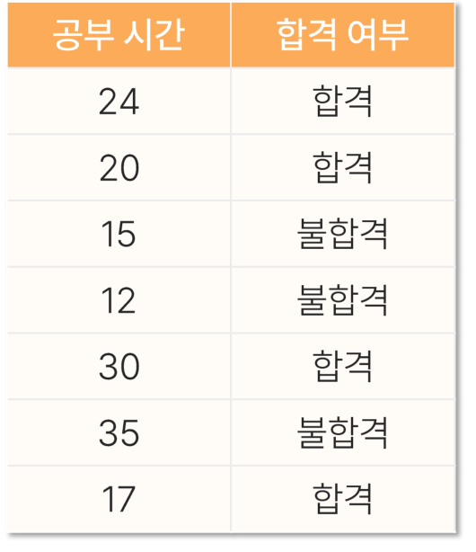

# 17. k-NN

> 원본 PDF 범위: 454~474쪽 · PDF 설명 순서에 따라 재작성

## 주요 단어 먼저 보기

| 주요 단어 | 뜻 |
|---|---|
| k-NN | 가까운 k개 관측값으로 예측하는 알고리즘 |
| 인스턴스 기반 학습 | 학습식을 만들기보다 사례를 저장해 예측 |
| 지연학습 | 예측 시점에 이웃을 계산 |
| 유클리드 거리 | 좌표 차이 제곱합의 제곱근 |
| 맨해튼 거리 | 좌표 차이 절댓값의 합 |
| k | 예측에 사용할 이웃 수 |
| 거리 가중 | 가까운 이웃에 더 큰 영향 부여 |
| 차원의 저주 | 특성이 많아질수록 거리 구분력이 약해지는 현상 |
| 스케일링 | 변수 크기 차이가 거리를 지배하지 않게 조정 |

> **단원 시작법:** 주요 단어의 뜻을 먼저 읽고, 아래 PDF 절 순서대로 학습한다.

<!-- TOC START -->
## 목차

- [1. K-NN 개요](#1-k-nn-개요)
  - [원리](#원리)
- [2. 목적과 특징](#2-목적과-특징)
- [3. 쓰임새](#3-쓰임새)
- [4. 인스턴스 기반 학습](#4-인스턴스-기반-학습)
  - [계산 복잡도](#계산-복잡도)
- [5. 거리 계산](#5-거리-계산)
  - [거리](#거리)
  - [전처리](#전처리)
- [6. 예측값 산출](#6-예측값-산출)
  - [k 선택](#k-선택)
- [7. 평가](#7-평가)
- [8. 수행 시 고려사항](#8-수행-시-고려사항)
- [9. 교재 문제와 해설](#9-교재-문제와-해설)
  - [문제 바로가기](#문제-바로가기)
  - [문제 1. K-NN 특성](#문제-1-k-nn-특성)
  - [문제 2. K값 선택](#문제-2-k값-선택)
  - [문제 3. K-NN 회귀 예측](#문제-3-k-nn-회귀-예측)
  - [문제 4. K-NN 분류 계산](#문제-4-k-nn-분류-계산)
  - [문제 5. K-NN 전처리](#문제-5-k-nn-전처리)
- [보충 학습](#보충-학습)
  - [보강: 차원의 저주](#보강-차원의-저주)
  - [해석](#해석)
  - [체크포인트](#체크포인트)
- [시험 직전 암기](#시험-직전-암기)
<!-- TOC END -->

## 1. K-NN 개요

> **PDF 455쪽**

> **암기 한 줄:** 새 점 주변 k개의 이웃이 투표하거나 평균내어 예측한다.

### 원리

k-최근접이웃(k-NN)은 새로운 관측치와 가까운 k개 학습 관측치를 찾아 예측한다.

- 분류: 이웃의 다수결 또는 거리 가중 투표
- 회귀: 이웃 목표값의 평균 또는 거리 가중 평균

거리 가중 방식은 가까운 이웃에 더 큰 영향을 준다.

$$
w_i=\frac{1}{(d_i+\epsilon)^q},\qquad
\hat y=\frac{\sum_{i\in N_k}w_iy_i}{\sum_{i\in N_k}w_i}
$$

$\epsilon$은 거리가 0일 때 나눗셈 문제를 막는다.

별도의 모수적 함수를 학습하지 않고 데이터를 저장해 예측 시 계산하는 게으른 학습(lazy learning) 방식이다.

## 2. 목적과 특징

> **PDF 456쪽**

> **암기 한 줄:** 학습식 없이 데이터를 저장하는 지연학습이며 지역 패턴을 이용한다.

- 모수식 없이 주변 사례를 직접 참조한다. 복잡한 국소 경계를 표현하지만 예측 비용과 메모리 사용이 크다.

k-NN의 주요 특징:

- **비모수적:** 특정 함수식이나 분포를 미리 가정하지 않는다.
- **인스턴스 기반:** 학습 데이터 자체를 저장하고 새 관측값과 비교한다.
- **지연학습:** 모델 적합은 가볍지만 예측할 때 거리 계산이 집중된다.
- **국소학습:** 전체 데이터의 하나의 식보다 새 관측값 주변의 패턴을 이용한다.

$k$가 작으면 복잡한 경계를 만들 수 있지만 잡음에 민감하고, $k$가 크면 경계가 부드러워지지만 소수 집단의 패턴을 놓칠 수 있다.

## 3. 쓰임새

> **PDF 457쪽**

> **암기 한 줄:** 분류와 회귀 모두 가능하고 국소적으로 복잡한 경계를 만들 수 있다.

- 분류는 다수결, 회귀는 이웃 반응값 평균으로 예측한다. 비슷한 사례가 비슷한 답을 가진다는 가정이 핵심이다.

- **분류:** 가까운 이웃들의 클래스 중 가장 많은 클래스를 선택한다.
- **회귀:** 가까운 이웃들의 연속형 목표값을 평균한다.
- **이상탐지 보조:** 주변 이웃까지의 거리가 지나치게 큰 관측값을 확인한다.
- **유사사례 검색:** 새 사례와 가장 가까운 기존 사례를 제시한다.

데이터의 국소 구조가 중요하고 변수 수가 너무 많지 않을 때 유용하다. 반대로 특성이 많아 모든 관측값 사이 거리가 비슷해지면 이웃의 의미가 약해진다.

## 4. 인스턴스 기반 학습

> **PDF 458쪽**

> **암기 한 줄:** 훈련은 가볍지만 예측 때 전체 이웃 탐색 비용이 든다.

### 계산 복잡도

학습은 빠르지만 예측마다 전체 학습 데이터와 거리를 계산하면 느리다. KD-tree, Ball tree, 근사 최근접 탐색을 고려할 수 있다.

KD-tree는 차원이 낮을 때 효과적이지만 고차원에서는 이점이 줄어든다. 대규모 임베딩 검색에는 HNSW, product quantization 같은 근사 검색이 실용적이다.

## 5. 거리 계산

> **PDF 459쪽**

> **암기 한 줄:** 스케일이 큰 변수가 거리를 지배하므로 거리 계산 전 표준화한다.

### 거리

유클리드 거리:

$$
d(x,z)=\sqrt{\sum_j(x_j-z_j)^2}
$$

맨해튼 거리:

$$
d(x,z)=\sum_j|x_j-z_j|
$$

범위가 큰 특성이 거리를 지배하므로 표준화나 정규화가 핵심이다.

민코프스키 거리 $d_p=(\sum|x_j-z_j|^p)^{1/p}$에서 $p=1$은 맨해튼, $p=2$는 유클리드 거리다. 희소 텍스트에는 각도 중심의 코사인 거리가 더 적합할 수 있다.

### 전처리

- 결측치를 처리한다.
- 명목형은 원-핫 인코딩한다.
- 연속형은 스케일링한다.
- 불필요한 차원을 제거한다.

결측값을 평균으로 채울 경우 스케일링 전 학습 데이터에서 대치값을 계산한다. 원-핫 인코딩 후 범주 블록이 지나치게 많은 차원을 차지하면 거리의 의미가 달라질 수 있다.

## 6. 예측값 산출

> **PDF 460~461쪽**

> **암기 한 줄:** k가 작으면 분산이 크고, 크면 경계가 매끈해져 편향이 커진다.

### k 선택

- 작은 k: 복잡한 경계, 낮은 편향·높은 분산, 잡음에 민감
- 큰 k: 부드러운 경계, 높은 편향·낮은 분산

교차검증으로 k와 거리 척도, 가중 방식을 함께 선택한다. 이진분류에서는 동률을 피하려고 홀수 k를 후보로 두기도 한다.

분류에서 클래스 수가 크게 불균형하면 가까운 영역에서도 다수 클래스가 투표를 지배한다. 거리 가중, 클래스 가중, 재표본화, 임계값·지표 변경을 검토한다.

## 7. 평가

> **PDF 462~463쪽**

> **암기 한 줄:** 검증 데이터로 k와 거리척도를 고르고 시험 데이터로 최종 평가한다.

- 교차검증으로 $k$, 거리척도, 가중방식을 함께 선택한다. 시험 데이터는 선택이 끝난 뒤 한 번만 평가한다.

평가 과정:

1. 학습 데이터로 여러 $k$ 후보를 적합한다.
2. 검증 또는 교차검증 성능을 비교한다.
3. 분류는 정확도·F1·ROC-AUC, 회귀는 MAE·RMSE 등을 사용한다.
4. 가장 좋은 $k$와 거리척도·가중방식을 선택한다.
5. 최종 시험 데이터는 선택이 끝난 뒤 한 번 평가한다.

> **선택 방향:** 회귀 RMSE는 가장 작은 설정, 분류 점수는 가장 큰 설정을 선택한다.

## 8. 수행 시 고려사항

> **PDF 464쪽**

> **암기 한 줄:** 차원·스케일·불균형·동률·검색비용을 확인한다.

- 표준화, 결측치, 범주형 변수의 거리 정의, 차원의 저주, 클래스 불균형과 동률 처리 규칙을 정한다.

- 변수 단위가 다르면 큰 단위의 변수가 거리를 지배하므로 정규화·표준화한다.
- 결측치가 있으면 거리를 계산할 수 없으므로 먼저 대치·제거한다.
- 범주형 변수에는 단순 유클리드 거리가 적절하지 않을 수 있다.
- 클래스가 불균형하면 다수 클래스가 이웃 투표를 지배할 수 있다.
- 짝수 $k$에서는 동률 가능성이 커지므로 분류에서는 홀수 $k$를 자주 고려한다.
- 데이터가 크면 모든 학습점과 거리를 계산하는 예측 비용이 커진다.

> **암기:** `k-NN 전처리 핵심 = 결측 처리 → 인코딩 → 스케일링 → k 검증`.

## 9. 교재 문제와 해설

> **원문 단원 말미 문제 전체 수록**

> 먼저 문제와 보기를 풀고, **정답 및 선택지별 해설 보기**를 펼쳐 확인하세요. 일반 4지선다 문항은 ①~④를 모두 해설하며, 원문이 2지선다인 경우에는 실제 보기만 수록합니다.

### 문제 바로가기

| 문제 | 주제 | 관련 목차 | PDF |
|---:|---|---|---:|
| [1](#ch17-q1) | K-NN 특성 | [1. K-NN 개요](#1-k-nn-개요) · [4. 인스턴스 기반 학습](#4-인스턴스-기반-학습) | 465쪽 |
| [2](#ch17-q2) | K값 선택 | [6. 예측값 산출](#6-예측값-산출) · [8. 수행 시 고려사항](#8-수행-시-고려사항) | 467쪽 |
| [3](#ch17-q3) | K-NN 회귀 예측 | [6. 예측값 산출](#6-예측값-산출) | 469쪽 |
| [4](#ch17-q4) | K-NN 분류 계산 | [5. 거리 계산](#5-거리-계산) · [6. 예측값 산출](#6-예측값-산출) | 471쪽 |
| [5](#ch17-q5) | K-NN 전처리 | [5. 거리 계산](#5-거리-계산) · [8. 수행 시 고려사항](#8-수행-시-고려사항) | 473쪽 |

### 문제 1. K-NN 특성

**출처:** PDF 465쪽  
**관련 목차:** [1. K-NN 개요](#1-k-nn-개요) · [4. 인스턴스 기반 학습](#4-인스턴스-기반-학습)

K-NN의 특성에 대한 설명으로 가장 적절하지 않은 것은?

1. 인스턴스 기반 학습에 속한다.
2. 회귀모델과 분류모델이 존재한다.
3. 훈련 단계에서 명시적인 모델을 학습한다.
4. 비모수적 접근을 사용한다.

정답 및 선택지별 해설 보기

**정답: ③ 훈련 단계에서 명시적인 모델을 학습한다.**

- **① 오답:** 정답이 아님. 훈련 사례를 저장하고 새 사례 주변의 인스턴스로 예측한다.
- **② 오답:** 정답이 아님. 이웃의 다수결로 분류하고 평균·가중평균으로 연속값을 예측할 수 있다.
- **③ 정답:** 정답(적절하지 않은 설명). fit 단계에서 계수나 트리 구조를 추정하지 않고 훈련 데이터를 저장하는 게으른 학습이다.
- **④ 오답:** 정답이 아님. 데이터 분포의 특정 모수 형태를 가정하지 않는 비모수 모델이다.

### 문제 2. K값 선택

**출처:** PDF 467쪽  
**관련 목차:** [6. 예측값 산출](#6-예측값-산출) · [8. 수행 시 고려사항](#8-수행-시-고려사항)

K값 선택에 따른 영향에 대한 설명으로 가장 적절한 것은?

1. K가 클수록 노이즈에 더 민감해진다.
2. K가 작을수록 과적합이 발생하기 쉽다.
3. K가 클수록 지역적 패턴을 더 잘 포착한다.
4. K는 일반적으로 짝수로 설정하는 것이 좋다.

정답 및 선택지별 해설 보기

**정답: ② K가 작을수록 과적합이 발생하기 쉽다.**

- **① 오답:** 큰 K는 많은 이웃을 평균내므로 개별 노이즈 영향은 줄지만 경계가 지나치게 매끄러워질 수 있다.
- **② 정답:** 작은 K는 소수 사례와 이상치에 민감해 훈련 데이터의 세부 잡음까지 따라가는 고분산 모델이 된다.
- **③ 오답:** 지역적 패턴은 작은 K가 더 민감하게 포착하고, 큰 K는 전역적 평균에 가까워진다.
- **④ 오답:** 이진분류에서는 동률을 피하려고 홀수를 자주 쓰며, 최적 K는 검증으로 고른다.

### 문제 3. K-NN 회귀 예측

**출처:** PDF 469쪽  
**관련 목차:** [6. 예측값 산출](#6-예측값-산출)

K-NN 회귀에서 예측값을 계산하는 방법으로 보기 어려운 것은?

1. K개 이웃 종속변수의 산술평균
2. K개 이웃 종속변수의 거리 가중평균
3. K개 이웃 종속변수의 중앙값
4. K개 이웃 종속변수의 최빈값

정답 및 선택지별 해설 보기

**정답: ④ K개 이웃 종속변수의 최빈값**

- **① 오답:** 정답이 아님. 가장 기본적인 K-NN 회귀는 이웃 y의 평균을 예측값으로 쓴다.
- **② 오답:** 정답이 아님. 가까운 이웃에 더 큰 가중치를 주는 거리 가중평균도 흔한 회귀 방식이다.
- **③ 오답:** 정답이 아님. 이상치에 강건한 변형으로 중앙값을 사용할 수 있다.
- **④ 정답:** 정답(보기 어려운 방법). 최빈값은 범주 다수결에 적합하고 연속형 값에서는 중복값이 드물어 회귀 예측에 부적절하다.

### 문제 4. K-NN 분류 계산

**출처:** PDF 471쪽  
**관련 목차:** [5. 거리 계산](#5-거리-계산) · [6. 예측값 산출](#6-예측값-산출)

K=3, 맨해튼 거리를 사용하는 K-NN 분류에서 공부시간이 19시간인 학생의 합격 여부는?

1. 합격
2. 불합격

정답 및 선택지별 해설 보기

**정답: ① 합격**

- **① 정답:** 19와 가장 가까운 3개는 20(합격), 17(합격), 15(불합격)이고 다수결 2:1로 합격이다.
- **② 오답:** 가장 가까운 세 이웃 중 불합격은 15시간 한 명뿐이고 합격이 두 명이라 최빈 클래스가 불합격이 아니다.

### 문제 5. K-NN 전처리

**출처:** PDF 473쪽  
**관련 목차:** [5. 거리 계산](#5-거리-계산) · [8. 수행 시 고려사항](#8-수행-시-고려사항)

K-NN에서 데이터 전처리의 중요성에 대한 설명으로 가장 적절한 것은?

1. 범주형 변수는 단순히 1,2,3 같은 숫자로 바꾸면 된다.
2. 결측 특성을 평균으로 대체하면 모든 문제가 해결된다.
3. 정규화 같은 특성 스케일링은 K-NN 성능에 큰 영향을 주지 않는다.
4. 특정 독립변수의 값 범위가 크면 거리 계산을 지배할 수 있어 정규화가 필요하다.

정답 및 선택지별 해설 보기

**정답: ④ 특정 독립변수의 값 범위가 크면 거리 계산을 지배할 수 있어 정규화가 필요하다.**

- **① 오답:** 명목 범주에 임의 정수를 주면 1과 2가 1만큼 가깝다는 거짓 순서·거리가 생긴다. 원-핫 인코딩 등을 검토한다.
- **② 오답:** 평균대치는 지역 구조를 흐리고 결측 원인을 해결하지 못한다. 변수·결측 메커니즘에 맞는 처리가 필요하다.
- **③ 오답:** K-NN은 거리 기반이므로 스케일 차이에 매우 민감하다.
- **④ 정답:** 범위가 큰 특성이 거리합을 지배하지 않도록 표준화·최소-최대 정규화를 적용하고, 규칙은 훈련 데이터에서 학습한다.

## 보충 학습

> 원문 절 순서를 모두 학습한 뒤 이해와 문제 적용력을 높이는 확장 내용이다.

### 보강: 차원의 저주

차원이 커지면 모든 점 사이 거리가 비슷해져 '가까운 이웃'의 의미가 약해진다. 특성선택, PCA, 더 많은 데이터가 필요하다.

### 해석

예측과 함께 선택된 이웃, 거리, 이웃의 목표값을 보여주면 지역적 근거를 설명할 수 있다. 다만 이웃은 인과적으로 유사한 사례가 아니라 선택한 특성공간과 거리에서 가까운 사례일 뿐이다.

### 체크포인트

- k-NN은 거리 기반이므로 스케일링이 중요하다.
- 범주형을 임의 숫자로 바꾸면 거짓 거리가 생긴다.
- k는 학습 성능이 아니라 교차검증으로 정한다.

## 시험 직전 암기

- 새 점 주변 k개의 이웃이 투표하거나 평균내어 예측한다.
- 학습식 없이 데이터를 저장하는 지연학습이며 지역 패턴을 이용한다.
- 분류와 회귀 모두 가능하고 국소적으로 복잡한 경계를 만들 수 있다.
- 훈련은 가볍지만 예측 때 전체 이웃 탐색 비용이 든다.
- 스케일이 큰 변수가 거리를 지배하므로 거리 계산 전 표준화한다.
- k가 작으면 분산이 크고, 크면 경계가 매끈해져 편향이 커진다.
- 검증 데이터로 k와 거리척도를 고르고 시험 데이터로 최종 평가한다.
- 차원·스케일·불균형·동률·검색비용을 확인한다.
