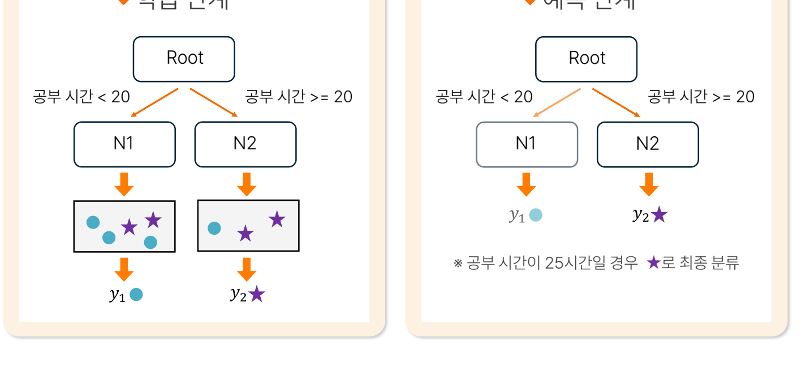
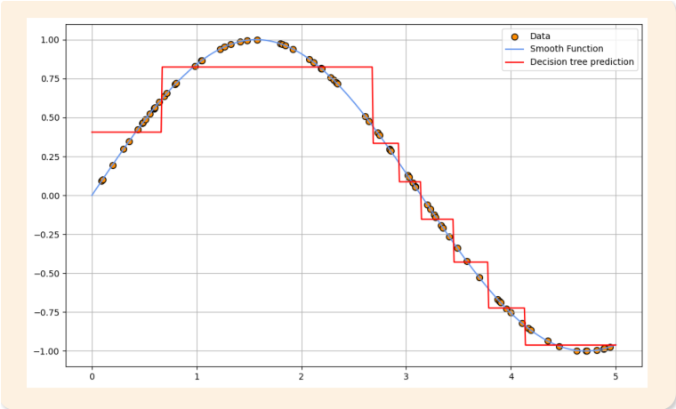
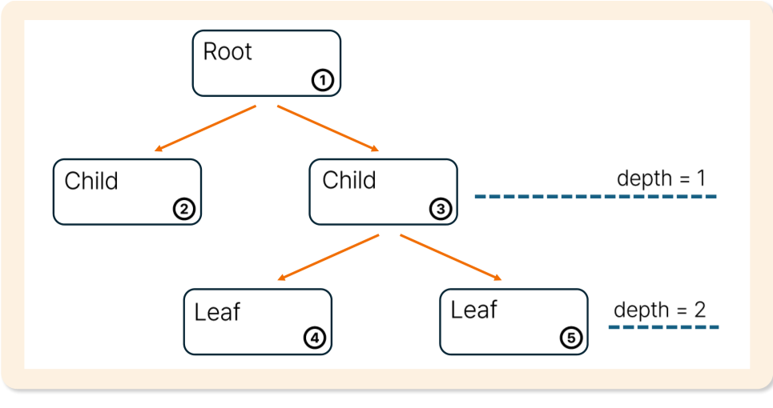
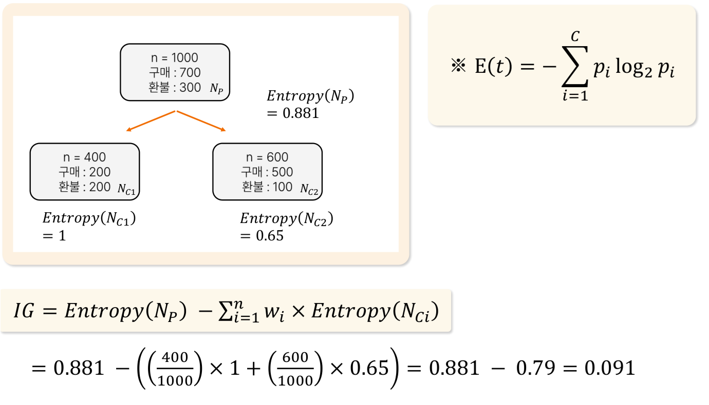
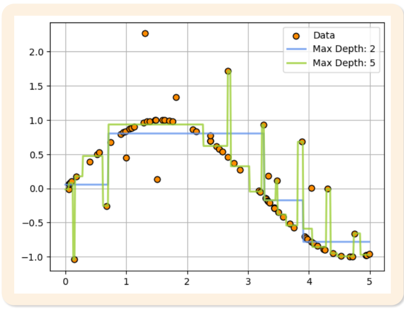
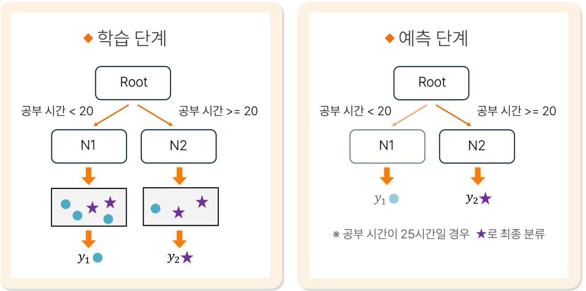
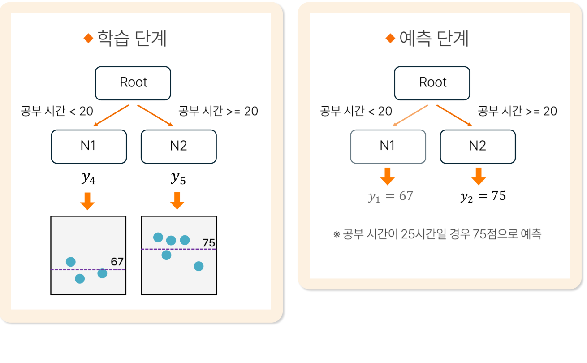
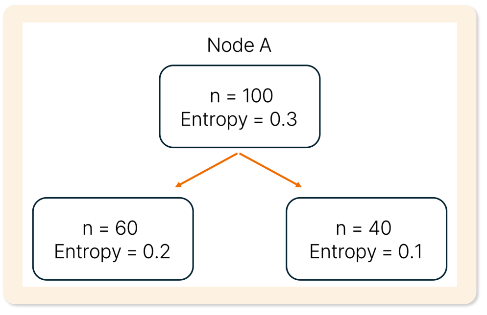

# 18. 의사결정나무

> 원본 PDF 범위: 475~505쪽 · PDF 설명 순서에 따라 재작성

## 주요 단어 먼저 보기

| 주요 단어 | 뜻 |
|---|---|
| 의사결정나무 | 조건 분할을 따라 잎에서 예측하는 모델 |
| 루트 노드 | 첫 번째 분할이 시작되는 노드 |
| 내부 노드 | 추가 조건으로 분할되는 노드 |
| 리프 노드 | 최종 예측을 내는 노드 |
| 불순도 | 노드 안 클래스가 섞인 정도 |
| 지니지수 | 분류노드 불순도 지표 |
| 정보이득 | 분할 전후 엔트로피 감소량 |
| 가지치기 | 불필요한 분기를 줄여 과적합을 완화 |
| 최대깊이 | 루트에서 리프까지 허용하는 최대 단계 |
| 부모·자식 노드 | 분할 전 상위 노드와 분할 후 하위 노드 |
| 분류나무 | 리프의 최빈 범주를 반환하는 나무 |
| 회귀나무 | 리프 목표값의 평균을 반환하는 나무 |
| 엔트로피 | 클래스 비율의 불확실성을 나타내는 불순도 |
| 카디널리티 | 범주형 변수에 존재하는 고유값의 개수 |

> **단원 시작법:** 주요 단어의 뜻을 먼저 읽고, 아래 PDF 절 순서대로 학습한다.

<!-- TOC START -->
## 목차

- [1. 의사결정나무 개요](#1-의사결정나무-개요)
  - [구조](#구조)
- [2. 목적과 특징](#2-목적과-특징)
  - [장단점](#장단점)
  - [나무의 구조와 깊이](#나무의-구조와-깊이)
  - [분류나무와 회귀나무](#분류나무와-회귀나무)
- [3. 쓰임새](#3-쓰임새)
- [4. 노드 분할과 나무 성장](#4-노드-분할과-나무-성장)
  - [분류 불순도](#분류-불순도)
- [5. 과적합 예방 조치](#5-과적합-예방-조치)
  - [가지치기 개요](#가지치기-개요)
  - [사전 가지치기의 활용](#사전-가지치기의-활용)
- [6. 해석](#6-해석)
  - [나무 규칙 읽기](#나무-규칙-읽기)
- [7. 분류 예측값 산출](#7-분류-예측값-산출)
- [8. 회귀 예측값 산출](#8-회귀-예측값-산출)
- [9. 평가](#9-평가)
- [10. 수행 시 고려사항](#10-수행-시-고려사항)
  - [결측·범주형 변수](#결측범주형-변수)
  - [불균형 분류](#불균형-분류)
- [11. 교재 문제와 해설](#11-교재-문제와-해설)
  - [문제 바로가기](#문제-바로가기)
  - [문제 1. 회귀나무 예측값](#문제-1-회귀나무-예측값)
  - [문제 2. 분할 방식](#문제-2-분할-방식)
  - [문제 3. 의사결정나무 과적합](#문제-3-의사결정나무-과적합)
  - [문제 4. 정보이득 계산](#문제-4-정보이득-계산)
  - [문제 5. 불균형 분류 평가](#문제-5-불균형-분류-평가)
- [보충 학습](#보충-학습)
  - [보강: 특성 중요도 주의](#보강-특성-중요도-주의)
  - [체크포인트](#체크포인트)
- [시험 직전 암기](#시험-직전-암기)
<!-- TOC END -->

## 1. 의사결정나무 개요

> **PDF 476쪽**

> **암기 한 줄:** 조건을 따라 내려가 잎 노드의 값으로 예측한다.

### 구조

- 루트 노드: 전체 데이터가 시작하는 노드
- 내부 노드: 변수와 기준으로 분할
- 가지: 분할 결과
- 잎 노드: 최종 예측

의사결정나무는 비모수적 지도학습 모델이며 분류와 회귀에 모두 사용할 수 있다.

교재의 용어를 더 정확히 연결하면 다음과 같다.

- **노드(node):** 데이터를 담는 상자 또는 주머니
- **링크(link)·가지(branch):** 노드와 노드를 연결하는 선분
- **의사결정규칙:** 노드 데이터를 나누는 if–then 형식의 조건
- **불순도(impurity):** 노드 안에서 여러 범주가 섞인 정도

학습 전에 규칙을 모두 정해 두는 것이 아니라, 훈련 데이터에서 불순도를 가장 잘 줄이는 조건을 반복해서 찾는 **열성적 학습(eager learning)** 방식이다.

## 2. 목적과 특징

> **PDF 477~481쪽**

> **암기 한 줄:** 비선형·상호작용을 자동 포착하고 규칙 해석이 쉽다.

의사결정나무의 목적은 새로운 데이터의 분류·회귀값을 예측하고, 데이터 안에 숨어 있는 의사결정 규칙과 패턴을 탐지하는 것이다.

### 장단점

장점: 비선형·상호작용 포착, 스케일링 불필요, 설명이 직관적이다.

단점: 데이터 변화에 구조가 크게 바뀌고, 깊은 나무는 과적합되며, 탐욕적 분할이 전역 최적을 보장하지 않는다.

교재의 특징을 빠짐없이 정리하면 다음과 같다.

- 수치형 종속변수는 회귀나무, 범주형 종속변수는 분류나무를 사용한다.
- 노드와 링크로 규칙을 표현해 해석하기 쉽다.
- 변수 스케일링과 정규화가 필요하지 않다.
- 데이터 분포에 대한 사전 가정이 없는 비모수적 모델이다.
- 회귀나무는 리프마다 일정한 값을 내므로 매끄러운 곡선을 계단함수로 근사한다.

*그림: 같은 리프에 속한 구간은 같은 예측값을 받아 계단 모양이 됨 — 원문 그래프만 잘라 수록.*

### 나무의 구조와 깊이

가장 위는 루트(root), 말단은 리프(leaf), 상위는 부모(parent), 바로 아래는 자식(child) 노드다. 교재는 첫 자식의 **깊이(depth)를 1**, 화면상의 **단계(level)를 2**로 설명한다.

*그림: 루트 아래 첫 자식의 깊이는 1, 다음 리프의 깊이는 2 — 원문 도식만 잘라 수록.*

최대 깊이가 커질수록 표현 가능한 규칙은 많아지지만 과적합 위험도 함께 커진다.

### 분류나무와 회귀나무

| 구분 | 종속변수 | 대표 분할 기준 | 리프의 반환값 |
|---|---|---|---|
| 분류나무 | 범주형 | 지니, 엔트로피, 카이제곱 | 최빈 범주·범주 비율 |
| 회귀나무 | 수치형 | SSE·MSE·분산 감소 | 목표값의 산술평균 |

- **CART:** 분류와 회귀를 모두 지원하며 이진 분할을 사용한다. 분류에는 주로 지니지수, 회귀에는 제곱오차 감소를 사용한다.
- **C4.5·C5.0:** 정보이득 계열 기준을 활용하며 다중 분할이 가능하다.
- **CHAID:** 카이제곱 통계량을 활용해 범주를 분할한다.

> **교재 표현 보완:** 교재는 회귀나무에서도 CART를 사용한다고 설명한다. CART는 맞지만, 회귀나무의 불순도는 지니지수가 아니라 일반적으로 SSE·MSE로 계산한다.

## 3. 쓰임새

> **PDF 482쪽**

> **암기 한 줄:** 분류·회귀·규칙 추출과 변수 선별에 활용한다.

- 분류·회귀뿐 아니라 사람이 읽을 수 있는 규칙 추출과 변수 상호작용 탐색에 활용한다.

대표적인 쓰임새:

- 고객 이탈·부도·질병 여부 같은 분류
- 가격·수요·매출 같은 연속값 회귀
- `조건 A AND 조건 B → 결과` 형태의 의사결정 규칙 생성
- 비선형 임계값과 변수 간 상호작용 탐색

교재의 분야별 활용은 다음과 같다.

- **제조:** 웨이퍼 품질 판정에 의사결정나무 규칙 활용
- **금융:** 신용대출 거부 시 신용평가 규칙을 근거로 제시
- **일반 업무:** 경험으로만 알고 있던 암묵지(tacit knowledge)를 명시지(explicit knowledge) 형태의 규칙으로 변환

나무는 수치형·범주형 변수의 조건을 단계적으로 나누므로 결과를 설명하기 쉽다. 다만 한 나무의 구조는 데이터의 작은 변화에도 달라질 수 있으므로 안정성이 필요하면 랜덤포레스트 같은 앙상블을 고려한다.

## 4. 노드 분할과 나무 성장

> **PDF 483~487쪽**

> **암기 한 줄:** 불순도 감소가 가장 큰 분할을 재귀적으로 선택한다.

### 분류 불순도

노드에 범주가 두 종류 이상 섞여 있으면 더 순수한 자식 노드로 나눌 필요가 있다. 교재는 이 혼재 정도를 수치화하는 기준으로 엔트로피와 지니지수를 사용한다.

지니 불순도:

$$
Gini=1-\sum_kp_k^2
$$

엔트로피:

$$
H=-\sum_kp_k\log_2p_k
$$

분할 전후의 불순도 감소량이 큰 후보를 선택한다. 회귀나무는 보통 MSE나 분산 감소를 사용한다.

가중 불순도 감소는 다음과 같다.

$$
\Delta I=I(parent)-\frac{n_L}{n}I(left)-\frac{n_R}{n}I(right)
$$

한쪽 노드만 순수하게 만드는 분할이 아니라 두 자식의 크기까지 고려한다.

#### 엔트로피 계산

이진분류의 엔트로피는 최소 0, 최대 1이며 작을수록 순수하다.

| 클래스 구성 | 계산 | 엔트로피 |
|---|---|---:|
| $(3/3,0/3)$ | $-1\log_2 1-0\log_2 0$ | 0 |
| $(2/4,2/4)$ | $-0.5\log_2 0.5-0.5\log_2 0.5$ | 1 |
| $(2/3,1/3)$ | $-\frac23\log_2\frac23-\frac13\log_2\frac13$ | 0.91829 |

$0\log 0$은 극한값 0으로 처리한다.

#### 지니지수 계산

이진분류의 지니지수는 최소 0, 최대 0.5이며 역시 작을수록 순수하다.

| 클래스 구성 | 계산 | 지니지수 |
|---|---|---:|
| $(3/3,0/3)$ | $1-1^2-0^2$ | 0 |
| $(2/4,2/4)$ | $1-0.5^2-0.5^2$ | 0.5 |
| $(2/3,1/3)$ | $1-(2/3)^2-(1/3)^2$ | $4/9\approx0.444$ |

#### 정보이득

정보이득은 부모 노드 불순도에서 자식 노드 불순도의 가중평균을 뺀 값이다.

$$
IG=I(N_P)-\sum_{i=1}^{m}\frac{n_i}{n}I(N_{Ci})
$$

값이 클수록 분할 후 불순도가 효과적으로 줄었다는 뜻이다. 자식 노드의 표본 수 비율을 반드시 가중치로 사용해야 한다.

교재 예제에서 부모는 구매 700·환불 300으로 엔트로피 0.881이다. 첫 자식은 400명 중 구매·환불이 200명씩이라 엔트로피 1, 둘째 자식은 구매 500·환불 100으로 엔트로피 0.65다.

$$
IG=0.881-\left(\frac{400}{1000}\times1+
\frac{600}{1000}\times0.65\right)
=0.881-0.79=0.091
$$

*그림: 부모와 두 자식의 구성비를 이용한 가중 엔트로피 계산 — 원문 계산 도식만 잘라 수록.*

## 5. 과적합 예방 조치

> **PDF 488~489쪽**

> **암기 한 줄:** 깊이·최소 표본·가지치기로 복잡도를 제한한다.

### 가지치기 개요

교재는 가지치기를 두 방식으로 구분한다.

- **사전 가지치기(pre-pruning):** 모델링 전에 성장 제한값을 정해 완전 성장을 막는다.
- **사후 가지치기(post-pruning):** 충분히 성장시킨 뒤 특정 지표에 따라 일부 가지를 제거한다.

*그림: 깊이 5인 나무는 이상치까지 따라가지만 깊이 2인 나무는 더 단순하게 근사 — 원문 그래프만 잘라 수록.*

- `max_depth`: 최대 깊이
- `min_samples_split`: 분할에 필요한 최소 표본 수
- `min_samples_leaf`: 잎의 최소 표본 수
- `max_leaf_nodes`: 잎 수 제한
- 가지치기: 성장한 나무의 불필요한 분기 제거

### 사전 가지치기의 활용

사전 가지치기의 교재 항목은 다음과 같다.

| 제한 대상 | 대표 설정 |
|---|---|
| 최소 표본 수 | 분할에 필요한 최소 표본 수, 리프의 최소 표본 수 |
| 깊이·크기 | 최대 깊이, 최대 리프 노드 수 |
| 불순도 감소 | 분할에 필요한 최소 불순도 감소량 |

#### 비용복잡도 가지치기(보강)

$$
R_\alpha(T)=R(T)+\alpha|T|
$$

오차 $R(T)$와 잎 수 $|T|$ 사이의 균형을 조절한다. $\alpha$는 교차검증으로 선택한다.

## 6. 해석

> **PDF 490쪽**

> **암기 한 줄:** 루트에서 잎까지의 조건을 AND로 연결하면 한 예측 규칙이다.

### 나무 규칙 읽기

루트에서 잎까지의 조건을 AND로 연결하면 하나의 규칙이 된다. 잎의 예측확률은 그 잎 안 클래스 비율이지만 표본이 적으면 극단적이고 불안정할 수 있다.

교재의 분류나무 예시는 루트에서 ‘공부시간’을 20시간 기준으로 나눈다.

- 공부시간이 20시간 미만이면 N1의 다수 범주를 반환한다.
- 공부시간이 20시간 이상이면 N2로 이동해 별표 범주를 반환한다.

## 7. 분류 예측값 산출

> **PDF 491쪽**

> **암기 한 줄:** 잎의 다수 클래스 또는 클래스 비율로 예측한다.

- 새 관측치가 도달한 잎의 최빈 클래스 또는 클래스 비율을 사용한다. 비율은 확률처럼 쓰지만 보정 여부를 확인한다.

예측 순서:

1. 새 관측치를 루트 노드의 조건과 비교한다.
2. 조건 결과에 따라 왼쪽 또는 오른쪽 자식 노드로 이동한다.
3. 리프 노드에 도달할 때까지 반복한다.
4. 리프의 다수 클래스를 예측 클래스로 사용한다.

리프에 클래스 0이 20개, 클래스 1이 80개라면 클래스 1을 예측하고 경험적 확률은 0.8로 볼 수 있다. 단, 깊은 나무의 작은 리프 비율은 과도하게 확신할 수 있어 별도 확률 보정을 고려한다.

*그림: 공부시간 25는 20 이상이므로 N2에 도달하고 별표 범주를 반환 — 원문 도식만 잘라 수록.*

## 8. 회귀 예측값 산출

> **PDF 492쪽**

> **암기 한 줄:** 잎에 속한 훈련 반응값의 평균으로 예측한다.

- 새 관측치가 도달한 잎에 속한 학습 반응값의 평균을 예측값으로 쓴다.

예를 들어 새 관측치가 도달한 리프의 학습 목표값이 10, 12, 14라면 회귀 예측값은 $(10+12+14)/3=12$다. 같은 리프에 들어가는 모든 관측값은 같은 예측값을 받으므로 회귀나무의 예측함수는 계단 모양이다.

교재 예제에서는 공부시간 20시간 미만 리프의 평균이 67점, 20시간 이상 리프의 평균이 75점이다. 새 관측값의 공부시간이 25시간이면 오른쪽 리프에 도달하여 **75점**을 예측한다.

*그림: 분류나무와 경로 선택은 같지만 회귀나무는 리프의 평균을 반환 — 원문 도식만 잘라 수록.*

> **시험 비교:** 분류나무 리프는 `다수 클래스·클래스 비율`, 회귀나무 리프는 `목표값 평균`.

## 9. 평가

> **PDF 493~494쪽**

> **암기 한 줄:** 분류·회귀 목적에 맞는 검증지표와 가지치기 성능을 본다.

- 분류는 혼동행렬·AUC, 회귀는 MAE·RMSE 등을 쓰며 가지치기 전후 검증성능을 비교한다.

| 나무 유형 | 대표 평가 |
|---|---|
| 분류나무 | Accuracy, Precision, Recall, F1, ROC-AUC |
| 회귀나무 | MAE, MSE, RMSE, $R^2$ |

학습 성능이 매우 좋고 검증 성능이 낮으면 깊이가 지나쳐 과적합된 것이다. `max_depth`, `min_samples_split`, `min_samples_leaf` 또는 비용복잡도 가지치기를 검증 데이터로 선택한다.

교재의 평가 공식을 함께 적으면 다음과 같다.

$$
Accuracy=\frac{TP+TN}{TP+TN+FP+FN},\qquad
Precision=\frac{TP}{TP+FP},\qquad
Recall=\frac{TP}{TP+FN}
$$

$$
F1=2\frac{Precision\times Recall}{Precision+Recall}
$$

$$
MSE=\frac1n\sum(y_i-\hat y_i)^2,\qquad
RMSE=\sqrt{MSE}
$$

$$
MAE=\frac1n\sum|y_i-\hat y_i|,\qquad
MAPE=\frac{100}{n}\sum\left|\frac{y_i-\hat y_i}{y_i}\right|
$$

분류나무에서는 범주 불균형을 고려해 정확도만 보지 않고 정밀도·재현율·F1을 함께 본다. 회귀나무의 MAPE는 실제값이 0이거나 0에 가까울 때 부적절할 수 있다.

## 10. 수행 시 고려사항

> **PDF 495쪽**

> **암기 한 줄:** 작은 데이터 변화로 나무가 바뀔 수 있고 불순도 중요도는 편향될 수 있다.

교재가 이 절에서 직접 강조한 대상은 **카디널리티가 높은 범주형 변수**다. 카디널리티는 중복되지 않는 고유값의 개수다.

- 빈도가 매우 작은 범주는 ‘기타’ 등으로 합치면 나무가 간결해지고 해석이 쉬워진다.
- 범주 사이의 계층·유사성을 고려해 의미가 가까운 범주를 통합한다.
- 범주 통합 기준은 학습 데이터에서 정하고, 종속변수 정보를 직접 사용한 통합은 교차검증 안에서 수행해 누출을 막는다.

### 결측·범주형 변수

구현체에 따라 결측의 기본 방향, 대리 분할, 결측을 별도 범주로 처리하는 방식이 다르다. 범주형을 숫자 순서로 임의 변환하면 의미 없는 임계값 분할이 생기므로 모델 구현의 범주 지원 여부를 확인한다.

### 불균형 분류

정확도 불순도만 따르면 작은 양성 집단을 무시할 수 있다. 클래스 가중치, 최소 잎 크기, 양성 중심 평가지표, 임계값 조정을 함께 사용한다.

## 11. 교재 문제와 해설

> **원문 단원 말미 문제 전체 수록**

> 먼저 문제와 보기를 풀고, **정답 및 선택지별 해설 보기**를 펼쳐 확인하세요. 일반 4지선다 문항은 ①~④를 모두 해설하며, 원문이 2지선다인 경우에는 실제 보기만 수록합니다.

### 문제 바로가기

| 문제 | 주제 | 관련 목차 | PDF |
|---:|---|---|---:|
| [1](#ch18-q1) | 회귀나무 예측값 | [8. 회귀 예측값 산출](#8-회귀-예측값-산출) | 496쪽 |
| [2](#ch18-q2) | 분할 방식 | [4. 노드 분할과 나무 성장](#4-노드-분할과-나무-성장) | 498쪽 |
| [3](#ch18-q3) | 의사결정나무 과적합 | [5. 과적합 예방 조치](#5-과적합-예방-조치) · [9. 평가](#9-평가) | 500쪽 |
| [4](#ch18-q4) | 정보이득 계산 | [4. 노드 분할과 나무 성장](#4-노드-분할과-나무-성장) | 502쪽 |
| [5](#ch18-q5) | 불균형 분류 평가 | [9. 평가](#9-평가) | 504쪽 |

### 문제 1. 회귀나무 예측값

**출처:** PDF 496쪽  
**관련 목차:** [8. 회귀 예측값 산출](#8-회귀-예측값-산출)

회귀나무에서 새로운 입력 데이터의 예측값 산출 방법으로 가장 적절한 것은?

1. 도달한 말단 노드 학습표본의 중앙값
2. 말단 노드 학습표본의 최빈값
3. 말단 노드 학습표본의 평균값
4. 말단 노드에서 가장 가까운 단일 학습표본의 값

정답 및 선택지별 해설 보기

**정답: ③ 말단 노드 학습표본의 평균값**

- **① 오답:** 강건한 변형에서는 중앙값을 쓸 수 있지만 표준 회귀나무의 기본 예측은 평균이다.
- **② 오답:** 최빈 클래스는 분류나무의 범주 예측에 사용한다.
- **③ 정답:** 입력이 도달한 잎에 속한 훈련표본의 연속 목표값 평균을 ŷ로 반환한다.
- **④ 오답:** 가장 가까운 한 사례를 쓰는 방식은 1-NN에 가깝고 회귀나무의 잎 예측 규칙이 아니다.

### 문제 2. 분할 방식

**출처:** PDF 498쪽  
**관련 목차:** [4. 노드 분할과 나무 성장](#4-노드-분할과-나무-성장)

다음 설명 중 올바른 것은?

1. 회귀나무는 목표변수가 연속형이므로 이진분류만 가능하다.
2. CART는 이진분할을 사용하고 C4.5는 다중분할을 사용할 수 있다.
3. 범주형 독립변수를 사용하는 회귀나무에서는 다중분할이 불가능하다.
4. 분할기준(지니·엔트로피)과 분할방식(이진·다중)은 항상 연동된다.

정답 및 선택지별 해설 보기

**정답: ② CART는 이진분할을 사용하고 C4.5는 다중분할을 사용할 수 있다.**

- **① 오답:** 회귀나무는 연속형 목표값을 예측하는 회귀 모델이며 ‘이진분류’와 모순된다.
- **② 정답:** CART는 각 노드를 두 자식으로 나누고, C4.5는 범주 값에 따라 여러 갈래 분할을 허용할 수 있다.
- **③ 오답:** 알고리즘에 따라 범주형 특성의 여러 범주를 다중분할할 수 있다.
- **④ 오답:** 불순도 기준과 자식 노드 수는 별개의 설계 선택이다.

### 문제 3. 의사결정나무 과적합

**출처:** PDF 500쪽  
**관련 목차:** [5. 과적합 예방 조치](#5-과적합-예방-조치) · [9. 평가](#9-평가)

의사결정나무에서 과적합이 발생했음을 나타내는 가장 명확한 징후는?

1. 트리 깊이가 10을 초과한다.
2. 훈련 정확도가 95%를 넘는다.
3. 훈련 성능과 검증 성능 사이에 현저한 격차가 있다.
4. 말단 노드 수가 전체 표본 수의 10%를 초과한다.

정답 및 선택지별 해설 보기

**정답: ③ 훈련 성능과 검증 성능 사이에 현저한 격차가 있다.**

- **① 오답:** 적절한 깊이는 데이터 복잡도와 표본 수에 따라 달라 10이라는 절대 기준은 없다.
- **② 오답:** 실제 규칙이 명확하면 높은 훈련 정확도 자체는 문제가 아니다.
- **③ 정답:** 훈련 데이터에는 매우 잘 맞지만 보지 않은 검증 데이터에서 성능이 크게 떨어지는 일반화 격차가 과적합의 직접 신호다.
- **④ 오답:** 잎 수 비율도 데이터에 따라 다르며 단독으로 과적합을 확정할 수 없다.

### 문제 4. 정보이득 계산

**출처:** PDF 502쪽  
**관련 목차:** [4. 노드 분할과 나무 성장](#4-노드-분할과-나무-성장)

표본 100개, 엔트로피 0.3인 부모 노드를 A로 분할했더니 자식이 n=60·Entropy=0.2와 n=40·Entropy=0.1이 되었다. 정보이득은?

1. 0
2. 0.16
3. 0.15
4. 0.14

정답 및 선택지별 해설 보기

**정답: ④ 0.14**

- **① 오답:** 자식의 가중 엔트로피가 부모보다 작으므로 불순도가 감소해 정보이득은 0이 아니다.
- **② 오답:** 0.16은 가중치를 잘못 적용한 값이다. 자식 엔트로피를 표본비 0.6과 0.4로 가중해야 한다.
- **③ 오답:** 단순 평균 (0.2+0.1)/2=0.15는 자식 크기 60:40을 무시한 값이며 정보이득 자체도 아니다.
- **④ 정답:** IG=0.3−[(60/100)0.2+(40/100)0.1]=0.3−0.16=0.14다.

### 문제 5. 불균형 분류 평가

**출처:** PDF 504쪽  
**관련 목차:** [9. 평가](#9-평가)

양성 5%, 음성 95%인 불균형 이진분류에서 의사결정나무 성능평가에 가장 부적절한 지표는?

1. 정확도(Accuracy)
2. 정밀도(Precision)
3. 재현율(Recall)
4. F1-Score

정답 및 선택지별 해설 보기

**정답: ① 정확도(Accuracy)**

- **① 정답:** 모두 음성으로 예측해도 95% 정확도가 나와 소수 양성을 하나도 못 찾는 모델을 좋게 평가할 수 있다.
- **② 오답:** 정밀도는 양성 예측 중 실제 양성 비율을 보므로 FP 문제를 확인하는 데 유용하다.
- **③ 오답:** 재현율은 실제 양성 중 찾아낸 비율로 소수 양성 누락을 직접 측정한다.
- **④ 오답:** F1은 정밀도와 재현율의 조화평균이라 불균형 자료에서 양성 성능을 균형 있게 본다.

## 보충 학습

> 원문 절 순서를 모두 학습한 뒤 이해와 문제 적용력을 높이는 확장 내용이다.

### 보강: 특성 중요도 주의

불순도 기반 중요도는 선택 가능한 분할점이 많은 연속형·고카디널리티 변수에 편향될 수 있다. permutation importance와 함께 확인한다.

### 체크포인트

- 의사결정나무는 스케일링이 필수 아니다.
- 분류는 지니·엔트로피, 회귀는 MSE 등을 사용한다.
- 단일 깊은 나무보다 가지치기 또는 앙상블이 일반화에 유리하다.

## 시험 직전 암기

- 조건을 따라 내려가 잎 노드의 값으로 예측한다.
- 비선형·상호작용을 자동 포착하고 규칙 해석이 쉽다.
- 분류·회귀·규칙 추출과 변수 선별에 활용한다.
- 불순도 감소가 가장 큰 분할을 재귀적으로 선택한다.
- 깊이·최소 표본·가지치기로 복잡도를 제한한다.
- 루트에서 잎까지의 조건을 AND로 연결하면 한 예측 규칙이다.
- 잎의 다수 클래스 또는 클래스 비율로 예측한다.
- 잎에 속한 훈련 반응값의 평균으로 예측한다.
- 분류·회귀 목적에 맞는 검증지표와 가지치기 성능을 본다.
- 작은 데이터 변화로 나무가 바뀔 수 있고 불순도 중요도는 편향될 수 있다.
