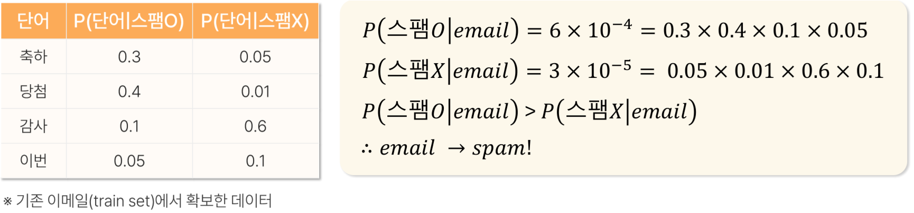

# 19. 나이브베이즈

> 원본 PDF 범위: 506~527쪽 · PDF 설명 순서에 따라 재작성

## 주요 단어 먼저 보기

| 주요 단어 | 뜻 |
|---|---|
| 나이브베이즈 | 베이즈 정리와 조건부 독립을 이용하는 분류기 |
| 사전확률 | 특성을 보기 전 클래스 확률 |
| 우도 | 클래스가 주어졌을 때 특성의 확률 |
| 사후확률 | 특성을 본 뒤 갱신된 클래스 확률 |
| 조건부 독립 | 클래스가 주어지면 특성들이 서로 독립이라는 가정 |
| Gaussian NB | 연속형 특성에 정규분포를 가정 |
| Multinomial NB | 빈도·횟수 데이터에 사용 |
| Bernoulli NB | 0/1 특성에 사용 |
| 라플라스 스무딩 | 관측되지 않은 범주의 확률이 0이 되는 것을 방지 |
| 주변확률 | 관심 없는 변수를 합해 제거한 전체 증거의 확률 |
| MAP 분류 | 사후확률이 가장 큰 클래스를 선택하는 규칙 |
| 조건부 우도 | 특정 클래스에서 특성·단어가 나타날 확률 |
| 0도수 문제 | 한 우도가 0이면 전체 곱도 0이 되는 문제 |
| 과신 | 중복 증거를 독립으로 곱해 확률이 지나치게 극단화되는 현상 |

> **단원 시작법:** 주요 단어의 뜻을 먼저 읽고, 아래 PDF 절 순서대로 학습한다.

<!-- TOC START -->
## 목차

- [1. 나이브베이즈 개요](#1-나이브베이즈-개요)
  - [베이즈 분류](#베이즈-분류)
- [2. 목적과 특징](#2-목적과-특징)
  - [조건부 독립성 위반](#조건부-독립성-위반)
- [3. 쓰임새](#3-쓰임새)
  - [보강: 언제 유용한가](#보강-언제-유용한가)
- [4. 베이즈 정리](#4-베이즈-정리)
- [5. 분류기 연산 예시](#5-분류기-연산-예시)
  - [교재 예시: 뉴스 기사 분류](#교재-예시-뉴스-기사-분류)
  - [간단한 보강 계산](#간단한-보강-계산)
  - [로그 확률](#로그-확률)
- [6. 존재하지 않는 원소 처리](#6-존재하지-않는-원소-처리)
  - [라플라스 스무딩](#라플라스-스무딩)
- [7. 예측값 산출](#7-예측값-산출)
  - [변형](#변형)
- [8. 평가](#8-평가)
- [9. 수행 시 고려사항](#9-수행-시-고려사항)
- [10. 교재 문제와 해설](#10-교재-문제와-해설)
  - [문제 바로가기](#문제-바로가기)
  - [문제 1. 조건부 독립성 위반](#문제-1-조건부-독립성-위반)
  - [문제 2. 나이브베이즈 사후확률](#문제-2-나이브베이즈-사후확률)
  - [문제 3. 나이브베이즈 평가지표](#문제-3-나이브베이즈-평가지표)
  - [문제 4. 독립성 위반 특성 조합](#문제-4-독립성-위반-특성-조합)
  - [문제 5. 베이즈 정리의 항](#문제-5-베이즈-정리의-항)
- [보충 학습](#보충-학습)
  - [체크포인트](#체크포인트)
- [시험 직전 암기](#시험-직전-암기)
<!-- TOC END -->

## 1. 나이브베이즈 개요

> **PDF 507쪽**

> **암기 한 줄:** 사후확률은 사전확률×각 특성의 우도를 비교해 가장 큰 클래스를 고른다.

### 베이즈 분류

$$
P(C_k\mid x)=\frac{P(x\mid C_k)P(C_k)}{P(x)}
$$

분류에서는 모든 클래스에 공통인 $P(x)$를 생략하고 다음 점수가 가장 큰 클래스를 고른다.

$$
\hat C=\arg\max_k P(C_k)\prod_jP(x_j\mid C_k)
$$

특성들이 클래스가 주어졌을 때 서로 독립이라는 강한 가정 때문에 '나이브'라는 이름이 붙는다.

교재의 관련 용어를 구분하면 다음과 같다.

| 용어 | 의미 |
|---|---|
| 베이즈 정리 | 사전확률과 우도로 사후확률을 갱신하는 정리 |
| 사전확률 $P(C)$ | 특성을 보기 전 각 클래스가 나타날 확률 |
| 우도 $P(x\mid C)$ | 클래스가 주어졌을 때 관측 특성이 나타날 확률 |
| 사후확률 $P(C\mid x)$ | 특성을 관측한 뒤 해당 클래스일 확률 |
| 주변확률 $P(x)$ | 다른 변수를 합해 제거하고 얻은 증거 전체의 확률 |

주변화(marginalization)는 결합확률에서 관심 없는 변수의 가능한 값을 모두 합하여 제거하는 과정이다.

## 2. 목적과 특징

> **PDF 508~509쪽**

> **암기 한 줄:** 클래스가 주어지면 특성들이 독립이라고 단순화해 계산이 매우 빠르다.

교재는 입력자료의 형태에 따라 세 분류기를 제시한다.

| 유형 | 분포 가정·입력 | 대표 사례 |
|---|---|---|
| Gaussian NB | 연속형 특성이 클래스별 정규분포 | 측정값·센서값 |
| Multinomial NB | 음수가 아닌 빈도·횟수 | 문서의 단어 빈도 |
| Bernoulli NB | 특성의 존재·부재인 0/1 | 단어 포함 여부 |

장점은 비교적 적은 학습 데이터로도 좋은 성능을 낼 수 있고 확률적 출력을 제공한다는 점이다. 한계는 실제로 상관된 특성을 독립으로 취급하며, 이상치가 클래스별 확률분포 추정을 왜곡할 수 있다는 점이다.

### 조건부 독립성 위반

강하게 상관된 특성은 같은 증거를 중복 반영해 과도하게 확신하는 예측을 만들 수 있다. 특성 선택·결합 또는 다른 모델을 고려한다.

사전확률은 클래스 빈도에서 추정하지만 배포 환경의 클래스 비율이 바뀌면 갱신이 필요하다. 조건부 독립성 위반과 사전확률 이동은 서로 다른 문제다.

## 3. 쓰임새

> **PDF 510쪽**

> **암기 한 줄:** 고차원 희소 텍스트와 빠른 기준모델에 특히 유용하다.

교재의 분야별 활용:

- **자연어처리:** 스팸메일 필터링, 감정분석
- **의료:** 증상 데이터를 기반으로 한 질병 예측
- **금융:** 금융거래의 이상 패턴 분석

### 보강: 언제 유용한가

고차원 희소 텍스트에서 매우 빠르고 강한 기준 모델이다. 데이터가 적어도 안정적인 편이지만 확률 자체는 잘 보정되지 않을 수 있다.

Multinomial NB의 입력은 일반적으로 음수가 아닌 카운트·TF-IDF다. 표준화로 음수를 만들면 분포 가정과 구현 요구를 위반할 수 있다.

## 4. 베이즈 정리

> **PDF 511쪽**

> **암기 한 줄:** 분모는 클래스 비교에서 공통이므로 분자 점수만 비교할 수 있다.

- $P(C|x)\propto P(C)P(x|C)$. 나이브 가정 아래 $P(x|C)=\prod_j P(x_j|C)$로 분해한다.

$$
P(C_k\mid x_1,\ldots,x_p)
=\frac{P(C_k)P(x_1,\ldots,x_p\mid C_k)}{P(x_1,\ldots,x_p)}
$$

조건부 독립을 가정하면

$$
P(C_k\mid x)\propto P(C_k)\prod_{j=1}^{p}P(x_j\mid C_k)
$$

가 된다. 모든 클래스에 분모 $P(x)$가 공통이므로 분류할 때는 `사전확률 × 특성별 우도`가 가장 큰 클래스를 선택하면 된다.

> **계산 순서:** `클래스 사전확률 → 각 특성 우도 → 모두 곱함 → 클래스별 점수 비교`.

베이즈 정리의 네 항은 다음 질문에 대응한다.

- $P(H\mid E)$ 사후확률: 증거 $E$를 본 뒤 가설 $H$가 참일 확률, 최종적으로 구할 값
- $P(E\mid H)$ 우도: 가설 $H$가 참일 때 증거 $E$가 관측될 확률
- $P(H)$ 사전확률: 증거를 보기 전 가설에 대한 초기 확률
- $P(E)$ 주변확률: 증거 자체가 관측될 전체 확률

$$
P(E)=\sum_kP(E\mid H_k)P(H_k)
$$

> **자주 틀리는 구분:** $P(E\mid H)$와 $P(H\mid E)$는 조건의 방향이 반대이므로 같은 값이 아니다.

## 5. 분류기 연산 예시

> **PDF 512~513쪽**

> **암기 한 줄:** 작은 확률의 곱은 언더플로를 막기 위해 로그합으로 계산한다.

### 교재 예시: 뉴스 기사 분류

새 뉴스 문서 $docu.$를 과학 $c_1$, 문화 $c_2$, 경제 $c_3$ 중 하나로 분류한다고 하자.

$$
P(c_i\mid docu.)
=\frac{P(docu.\mid c_i)P(c_i)}{P(docu.)}
$$

MAP 분류는 사후확률이 최대가 되는 클래스를 반환한다.

$$
C_{MAP}=\arg\max_{c\in C}P(c\mid docu.)
$$

교재 예시의 클래스별 사후확률은 과학 0.86, 문화 0.23, 경제 0.45이므로 최대값 0.86을 갖는 **과학**으로 분류한다.

| 클래스 | 과학 | 문화 | 경제 |
|---|---:|---:|---:|
| 사후확률 | **0.86** | 0.23 | 0.45 |

다항 나이브베이즈에서는 문서를 단어 $w_1,\ldots,w_n$의 모음으로 보고, 등장 순서를 무시한 채 각 단어 우도를 곱한다.

$$
P(docu.\mid c_k)=\prod_{i=1}^{n}P(w_i\mid c_k)
$$

이는 실제 문법·사용 맥락과 달리 단어들이 조건부 독립이라고 보는 단순화다.

### 간단한 보강 계산

스팸 사전확률이 0.2이고, ‘무료’라는 단어가 스팸에서 나타날 확률이 0.6, 정상 메일에서 0.05라면

$$
P(spam\mid free)=\frac{0.6\times0.2}{0.6\times0.2+0.05\times0.8}=0.75
$$

이다. 가능도비 $0.6/0.05=12$가 사전 오즈를 크게 높인다.

### 로그 확률

많은 작은 확률을 곱하면 언더플로가 생긴다. 실제 계산에서는 로그를 취해 곱을 합으로 바꾼다.

$$
\log P(C_k)+\sum_j\log P(x_j\mid C_k)
$$

## 6. 존재하지 않는 원소 처리

> **PDF 514쪽**

> **암기 한 줄:** 한 번도 안 나온 범주 때문에 전체 확률이 0이 되지 않게 가상 빈도를 더한다.

### 라플라스 스무딩

학습 데이터에서 한 번도 나타나지 않은 조합의 확률이 0이 되지 않도록 카운트에 작은 값을 더한다.

범주 수가 $K$이고 관측 카운트가 $N_{jk}$이면 add-$\alpha$ 스무딩은

$$
P(x_j=k\mid C)=\frac{N_{jk}+\alpha}{N_C+\alpha K}
$$

로 계산한다. $\alpha=1$이 라플라스, $0<\alpha<1$은 Lidstone 스무딩이다.

교재의 단어 빈도 표기로 쓰면, 클래스 $c_i$에서 단어 $w_i$의 확률은 다음과 같다.

$$
P(w_i\mid c_i)
=\frac{count(w_i,c_i)+1}
{\sum_j count(w_j,c_i)+|V|}
$$

$V$는 전체 단어 집합(vocabulary), $|V|$는 고유 단어 수다. 분자에 1을 더한 만큼 분모에는 가능한 단어 수 $|V|$를 더해야 전체 확률 합이 1로 유지된다.

## 7. 예측값 산출

> **PDF 515쪽**

> **암기 한 줄:** 자료형에 맞춰 Gaussian·Multinomial·Bernoulli NB를 선택한다.

교재는 “안녕하세요 이번 감사 이벤트 당첨 축하드립니다”라는 메일을 스팸·정상으로 분류한다. 두 클래스의 사전확률은 각각 0.5로 가정한다.

| 단어 | $P(\text{단어}\mid 스팸)$ | $P(\text{단어}\mid 정상)$ |
|---|---:|---:|
| 축하 | 0.30 | 0.05 |
| 당첨 | 0.40 | 0.01 |
| 감사 | 0.10 | 0.60 |
| 이번 | 0.05 | 0.10 |

조건부 독립을 가정하면 클래스 점수는 다음과 같다.

$$
Score(스팸)=0.5\times0.30\times0.40\times0.10\times0.05
=0.5\times6\times10^{-4}
$$

$$
Score(정상)=0.5\times0.05\times0.01\times0.60\times0.10
=0.5\times3\times10^{-5}
$$

공통 사전확률 0.5와 주변확률은 클래스 비교에서 상쇄된다. 따라서 $6\times10^{-4}>3\times10^{-5}$이므로 이 메일을 **스팸**으로 예측한다.

*그림: ‘축하·당첨·감사·이번’의 우도곱을 비교해 스팸으로 분류 — 원문 표와 계산식만 잘라 수록.*

### 변형

- Gaussian NB: 연속형 특성이 클래스별 정규분포를 따른다고 가정
- Multinomial NB: 단어 빈도·카운트 데이터
- Bernoulli NB: 특성의 존재·부재
- Categorical NB: 범주형 특성

## 8. 평가

> **PDF 516쪽**

> **암기 한 줄:** 정확도뿐 아니라 불균형 지표와 확률 보정도 확인한다.

- 클래스 예측은 혼동행렬 기반 지표로, 확률 출력은 로그손실과 보정곡선으로 평가한다.

- 클래스가 균형이면 정확도를 기본적으로 확인할 수 있다.
- 불균형이면 정밀도·재현율·F1과 클래스별 성능을 본다.
- 확률의 품질은 로그손실과 보정곡선으로 확인한다.
- 교차검증으로 스무딩 강도와 특성 표현 방법을 선택한다.

나이브베이즈는 클래스 순위는 잘 맞혀도 조건부 독립 가정 때문에 확률을 지나치게 0이나 1에 가깝게 낼 수 있다. 따라서 분류 정확성과 확률 보정은 별개로 평가한다.

교재가 제시한 지표 공식은 다음과 같다.

$$
Accuracy=\frac{TP+TN}{TP+TN+FP+FN}
$$

$$
Precision=\frac{TP}{TP+FP},\qquad
Recall=\frac{TP}{TP+FN}
$$

$$
F1=2\frac{Precision\times Recall}{Precision+Recall}
$$

## 9. 수행 시 고려사항

> **PDF 517쪽**

> **암기 한 줄:** 강한 특성 의존은 같은 증거를 중복 계산하게 만들어 확률을 과신시킬 수 있다.

- 특성 분포에 맞는 변형 선택, 0도수 스무딩, 강한 특성 의존, 사전확률과 확률 과신을 확인한다.

1. 연속형·빈도형·이진형 중 입력 자료에 맞는 나이브베이즈 변형을 고른다.
2. 학습 데이터에 없던 범주가 나타날 때 0 확률이 되지 않도록 스무딩한다.
3. 서로 강하게 중복된 특성은 같은 증거를 여러 번 반영할 수 있다.
4. 배포 환경의 클래스 비율이 바뀌면 사전확률도 다시 검토한다.
5. 작은 확률의 연속 곱은 언더플로를 일으킬 수 있어 로그확률 합으로 계산한다.

교재의 전처리 고려사항을 구체화하면 다음과 같다.

- 확률분포 추정을 왜곡하는 이상치와 결측치를 적절히 처리한다.
- 연소득·월소득·일소득처럼 거의 같은 정보를 반복하는 변수는 대표 변수 하나만 남기는 등 중복을 줄인다.
- 강하게 상관된 독립변수는 같은 증거를 여러 번 곱하게 해 과신(overconfidence)을 만들 수 있다.
- 이상치·결측치 처리기와 특성 선택 규칙은 학습 데이터에서만 정해 데이터 누출을 막는다.

> **암기:** `분포 선택 → 스무딩 → 로그계산 → 확률 과신 확인`.

## 10. 교재 문제와 해설

> **원문 단원 말미 문제 전체 수록**

> 먼저 문제와 보기를 풀고, **정답 및 선택지별 해설 보기**를 펼쳐 확인하세요. 일반 4지선다 문항은 ①~④를 모두 해설하며, 원문이 2지선다인 경우에는 실제 보기만 수록합니다.

### 문제 바로가기

| 문제 | 주제 | 관련 목차 | PDF |
|---:|---|---|---:|
| [1](#ch19-q1) | 조건부 독립성 위반 | [2. 목적과 특징](#2-목적과-특징) · [9. 수행 시 고려사항](#9-수행-시-고려사항) | 518쪽 |
| [2](#ch19-q2) | 나이브베이즈 사후확률 | [4. 베이즈 정리](#4-베이즈-정리) · [5. 분류기 연산 예시](#5-분류기-연산-예시) | 520쪽 |
| [3](#ch19-q3) | 나이브베이즈 평가지표 | [8. 평가](#8-평가) | 522쪽 |
| [4](#ch19-q4) | 독립성 위반 특성 조합 | [9. 수행 시 고려사항](#9-수행-시-고려사항) | 524쪽 |
| [5](#ch19-q5) | 베이즈 정리의 항 | [4. 베이즈 정리](#4-베이즈-정리) | 526쪽 |

### 문제 1. 조건부 독립성 위반

**출처:** PDF 518쪽  
**관련 목차:** [2. 목적과 특징](#2-목적과-특징) · [9. 수행 시 고려사항](#9-수행-시-고려사항)

나이브베이즈 분류기에서 조건부 독립성 가정이 위반될 때 발생할 수 있는 문제로 가장 적절하지 않은 것은?

1. 상관이 높은 특성이 중복 정보를 제공해 확률 계산이 왜곡된다.
2. 예측확률에 대해 과도하게 확신하는 현상이 나타난다.
3. 특성 간 상호작용을 무시해 실제 패턴을 놓친다.
4. 사전확률을 부정확하게 수정해 범주별 기본 발생빈도를 잘못 계산한다.

정답 및 선택지별 해설 보기

**정답: ④ 사전확률을 부정확하게 수정해 범주별 기본 발생빈도를 잘못 계산한다.**

- **① 오답:** 정답이 아님. 같은 정보를 담은 상관 특성의 우도를 곱하면 증거를 여러 번 센 것처럼 왜곡된다.
- **② 오답:** 정답이 아님. 중복 증거의 곱은 특정 클래스 사후확률을 지나치게 극단적으로 만들 수 있다.
- **③ 오답:** 정답이 아님. 단순 우도 곱은 ‘A와 B가 함께 있을 때만’ 생기는 상호작용을 직접 표현하지 못한다.
- **④ 정답:** 정답(적절하지 않은 설명). 사전확률은 클래스 빈도에서 계산하며 특성 간 조건부 독립 가정과 별개다.

### 문제 2. 나이브베이즈 사후확률

**출처:** PDF 520쪽  
**관련 목차:** [4. 베이즈 정리](#4-베이즈-정리) · [5. 분류기 연산 예시](#5-분류기-연산-예시)

P(불량)=0.1, P(정상)=0.9이고, P(온도 높음|불량)=0.8, P(온도 높음|정상)=0.2, P(압력 높음|불량)=0.7, P(압력 높음|정상)=0.3이다. 온도와 압력이 모두 높을 때 불량 사후확률은?

1. 0.16
2. 0.51
3. 0.30
4. 0.84

정답 및 선택지별 해설 보기

**정답: ② 0.51**

- **① 오답:** 불량의 비정규화 점수는 0.1×0.8×0.7=0.056이며 0.16이 아니다. 사후확률에는 정상 점수도 필요하다.
- **② 정답:** 불량 점수=0.056, 정상 점수=0.9×0.2×0.3=0.054, 따라서 0.056/(0.056+0.054)=0.509≈0.51이다.
- **③ 오답:** 0.30은 압력이 높을 정상 조건부확률일 뿐 두 특성과 사전확률을 결합한 사후확률이 아니다.
- **④ 오답:** 0.84는 두 조건부확률을 단순히 결합한 값에 가까우며 정상 클래스의 증거확률로 정규화하지 않았다.

### 문제 3. 나이브베이즈 평가지표

**출처:** PDF 522쪽  
**관련 목차:** [8. 평가](#8-평가)

클래스 불균형 데이터에서 나이브베이즈 분류기의 성능을 평가할 때 가장 부적절한 지표는?

1. Accuracy
2. F1-Score
3. AUC-ROC
4. RMSE

정답 및 선택지별 해설 보기

**정답: ④ RMSE**

- **① 오답:** 불균형에서 정확도만 쓰는 것은 위험하지만 분류 성능지표이므로 문항의 ‘가장 부적절’한 회귀지표 RMSE보다는 관련이 있다.
- **② 오답:** F1은 정밀도·재현율을 결합해 소수 클래스 성능 평가에 적합하다.
- **③ 오답:** AUC-ROC는 여러 경계값에서 양성과 음성 순위 분리 능력을 평가하는 분류지표다.
- **④ 정답:** RMSE는 연속형 예측오차를 재는 회귀지표로 클래스 분류 성능의 대표 평가에 맞지 않는다.

### 문제 4. 독립성 위반 특성 조합

**출처:** PDF 524쪽  
**관련 목차:** [9. 수행 시 고려사항](#9-수행-시-고려사항)

제조공정 나이브베이즈에서 조건부 독립성 가정을 가장 심각하게 위반할 것으로 보이는 특성 조합은?

1. 작업자ID, 작업시간대, 생산라인번호
2. 생산품 지름, 생산품 부피, 생산품 높이
3. 재료종류, 열처리온도, 냉각시간
4. 검사일자, 검사자, 품질등급

정답 및 선택지별 해설 보기

**정답: ② 생산품 지름, 생산품 부피, 생산품 높이**

- **① 오답:** 연관 가능성은 있지만 한 변수가 다른 변수들로 수학적으로 거의 결정되는 조합은 아니다.
- **② 정답:** 원기둥형 제품이라면 부피가 지름²×높이에 의해 결정되어 세 특성이 강하게 종속된다.
- **③ 오답:** 공정상 관련될 수 있으나 부피-지름-높이처럼 결정적 기하관계라고 단정하기 어렵다.
- **④ 오답:** 품질등급이 목표값이라면 특성 누출을 별도로 주의해야 하지만 조건부 독립성의 가장 명백한 위반 조합은 ②다.

### 문제 5. 베이즈 정리의 항

**출처:** PDF 526쪽  
**관련 목차:** [4. 베이즈 정리](#4-베이즈-정리)

베이즈 정리 P(H|E)=P(E|H)P(H)/P(E)의 각 항에 대한 설명으로 옳은 것은?

1. P(H)는 우도로, 가설 H 아래에서 증거 E가 관측될 확률이다.
2. P(E|H)는 사전확률로, 증거를 보기 전 가설에 대한 믿음이다.
3. P(E)는 주변확률로, 가능한 가설들에 대한 가중평균 증거확률이다.
4. P(H|E)는 항상 0.5가 되도록 보장한다.

정답 및 선택지별 해설 보기

**정답: ③ P(E)는 주변확률로, 가능한 가설들에 대한 가중평균 증거확률이다.**

- **① 오답:** P(H)는 사전확률이고, 우도는 P(E|H)다.
- **② 오답:** P(E|H)는 가설이 참일 때 증거가 나타날 우도이며 사전확률은 P(H)다.
- **③ 정답:** P(E)=ΣⱼP(E|Hⱼ)P(Hⱼ)로 모든 가능한 가설 경로의 증거확률을 합한 정규화 상수다.
- **④ 오답:** 사후확률은 데이터와 사전확률에 따라 0~1 사이 어디든 될 수 있다.

## 보충 학습

> 원문 절 순서를 모두 학습한 뒤 이해와 문제 적용력을 높이는 확장 내용이다.

### 체크포인트

- 독립은 무조건부가 아니라 클래스 조건부 독립이다.
- 텍스트 카운트에는 Multinomial NB가 자주 쓰인다.
- 라플라스 스무딩은 0확률 문제를 완화한다.

## 시험 직전 암기

- 사후확률은 사전확률×각 특성의 우도를 비교해 가장 큰 클래스를 고른다.
- 클래스가 주어지면 특성들이 독립이라고 단순화해 계산이 매우 빠르다.
- 고차원 희소 텍스트와 빠른 기준모델에 특히 유용하다.
- 분모는 클래스 비교에서 공통이므로 분자 점수만 비교할 수 있다.
- 작은 확률의 곱은 언더플로를 막기 위해 로그합으로 계산한다.
- 한 번도 안 나온 범주 때문에 전체 확률이 0이 되지 않게 가상 빈도를 더한다.
- 자료형에 맞춰 Gaussian·Multinomial·Bernoulli NB를 선택한다.
- 정확도뿐 아니라 불균형 지표와 확률 보정도 확인한다.
- 강한 특성 의존은 같은 증거를 중복 계산하게 만들어 확률을 과신시킬 수 있다.
