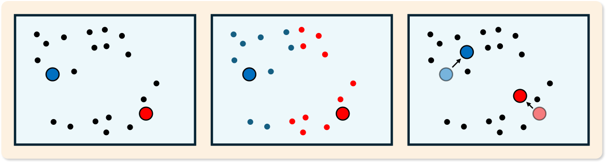
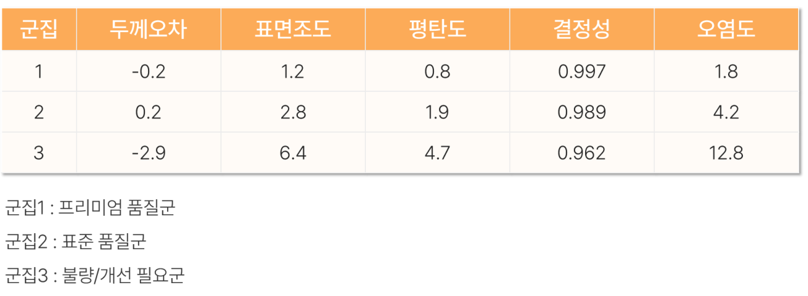
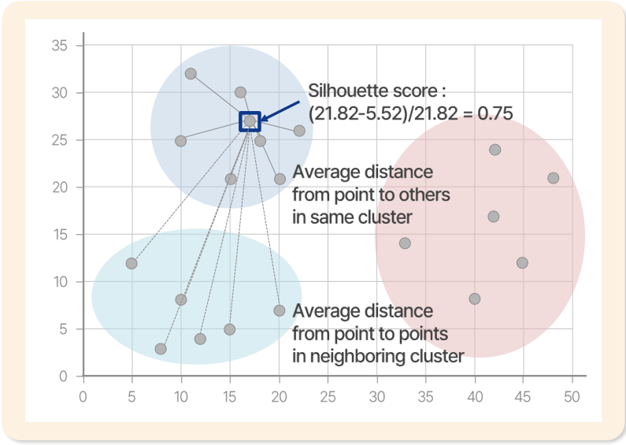

# 20. k-Means 군집분석

> 원본 PDF 범위: 528~547쪽 · PDF 설명 순서에 따라 재작성

## 주요 단어 먼저 보기

| 주요 단어 | 뜻 |
|---|---|
| K-Means | 중심과의 거리를 이용해 k개 군집을 만드는 알고리즘 |
| 군집 | 서로 비슷한 관측값의 집합 |
| 중심점 | 군집에 속한 관측값들의 평균 위치 |
| 할당 | 각 관측값을 가장 가까운 중심에 배정 |
| 갱신 | 할당된 관측값 평균으로 중심을 다시 계산 |
| 관성 | 군집 내 제곱거리 합 |
| 엘보 방법 | 관성 감소가 완만해지는 k를 찾는 방법 |
| 실루엣 계수 | 군집 내 응집도와 군집 간 분리도를 함께 평가 |
| 초기값 민감성 | 시작 중심에 따라 결과가 달라질 수 있음 |

> **단원 시작법:** 주요 단어의 뜻을 먼저 읽고, 아래 PDF 절 순서대로 학습한다.

<!-- TOC START -->
## 목차

- [1. K-Means 군집분석 개요](#1-k-means-군집분석-개요)
  - [목적함수](#목적함수)
- [2. 목적과 특징](#2-목적과-특징)
  - [목적](#목적)
  - [특징](#특징)
- [3. 쓰임새](#3-쓰임새)
- [4. 동작](#4-동작)
  - [알고리즘](#알고리즘)
- [5. 해석](#5-해석)
  - [중심점 좌표 기반 해석](#중심점-좌표-기반-해석)
  - [군집 타당성 지표](#군집-타당성-지표)
  - [실루엣 점수](#실루엣-점수)
  - [Dunn Index](#dunn-index)
  - [k 선택과 평가](#k-선택과-평가)
- [6. 수행 시 고려사항](#6-수행-시-고려사항)
  - [데이터 전처리](#데이터-전처리)
  - [가정과 한계](#가정과-한계)
  - [파라미터 설정과 최종 해석](#파라미터-설정과-최종-해석)
- [7. 교재 문제와 해설](#7-교재-문제와-해설)
  - [문제 바로가기](#문제-바로가기)
  - [문제 1. K-Means 연산 횟수](#문제-1-k-means-연산-횟수)
  - [문제 2. 중심점 계산](#문제-2-중심점-계산)
  - [문제 3. K-Means 전처리](#문제-3-k-means-전처리)
  - [문제 4. 실루엣 점수](#문제-4-실루엣-점수)
  - [문제 5. K-Means 한계](#문제-5-k-means-한계)
- [보충 학습](#보충-학습)
  - [다른 군집 알고리즘과 선택](#다른-군집-알고리즘과-선택)
  - [보강: 군집의 의미 검증](#보강-군집의-의미-검증)
  - [체크포인트](#체크포인트)
- [시험 직전 암기](#시험-직전-암기)
<!-- TOC END -->

## 1. K-Means 군집분석 개요

> **PDF 529쪽**

> **암기 한 줄:** 라벨이 없는 데이터를 미리 정한 $k$개 군집으로 나누고, 각 점을 가장 가까운 중심점에 할당한다.

K-Means는 **비지도학습**에 속하는 **분할 기반 군집분석** 알고리즘이다. 전체 데이터를 사전에 정한 $k$개 군집으로 나누며, 각 데이터 포인트는 거리가 가장 가까운 중심점(centroid)에 속한다.

| 교재 용어 | 정확한 뜻 | 시험 포인트 |
|---|---|---|
| 군집분석(Cluster Analysis) | 정답 라벨이 없는 데이터에서 비슷한 특성을 가진 관측값을 묶는 비지도학습 | `y 없이 유사한 것끼리 묶기` |
| 중심점(Centroid) | 한 군집에 속한 모든 관측값의 **특성별 산술평균 좌표** | 실제 관측값일 필요가 없음 |
| 분할 기반 군집화(Partitioning-based Clustering) | 전체 관측값을 겹치지 않는 $k$개 군집으로 분할 | $k$를 먼저 정함 |
| 할당(Assignment) | 각 관측값을 가장 가까운 중심점의 군집에 배정 | 거리 계산 단계 |
| 갱신(Update) | 배정된 관측값의 평균으로 중심점을 다시 계산 | 평균 계산 단계 |

### 목적함수

K-Means는 보통 유클리드 거리의 제곱을 사용하여 **군집 내 제곱거리 합**(WCSS, inertia)을 최소화한다.

$$
J=\sum_{j=1}^{K}\sum_{x_i\in C_j}\|x_i-\mu_j\|^2
$$

- $C_j$: $j$번째 군집
- $\mu_j$: $j$번째 군집의 중심점
- $x_i$: 관측값
- $J$가 작다는 뜻: 각 관측값이 자기 군집의 중심과 가깝다는 뜻

> **주의:** $J$는 $k$를 늘릴수록 감소하므로, 값이 가장 작은 $k$를 무조건 고르면 안 된다.

## 2. 목적과 특징

> **PDF 530쪽**

> **암기 한 줄:** `숨은 구조 발견 → 유사한 것끼리 해석 → 후속 분석에 활용`, 단 $k$와 초기 중심이 필요하다.

### 목적

1. 데이터에 숨어 있는 구조와 패턴을 발견하여 본질적인 특성을 파악한다.
2. 유사한 관측값을 묶고 도메인 지식으로 군집을 해석한다. 예: 품질 세분화.
3. 후속 분석을 위해 데이터를 그룹화하고 정리한다. 예: 군집별 전략 수립, 군집 라벨을 추가 특성으로 사용.

### 특징

- 모델링 전에 군집 수 $k$를 지정해야 한다.
- 중심점 계산에 산술평균을 사용하므로 이상치에 민감하다.
- 최초 중심점은 임의로 정해질 수 있어 실행마다 결과가 달라질 수 있다.
- **할당 → 갱신**을 반복하며 목적함수를 줄이는 방식으로 최적화한다.
- 계산이 비교적 단순하고 대용량 연속형 데이터에도 빠르게 적용할 수 있다.

초기 중심이 다르면 서로 다른 **지역 최적해**에 도달할 수 있다. 실무에서는 `k-means++` 초기화와 여러 번의 초기화(`n_init`) 중 목적함수가 가장 작은 결과를 사용한다.

## 3. 쓰임새

> **PDF 531쪽**

> **암기 한 줄:** `제조-품질, 마케팅-고객, 교통-배송, 환경-소비 패턴`으로 연결한다.

| 분야 | 교재의 활용 예 | 해석 예시 |
|---|---|---|
| 제조업·품질관리 | 불량품 분류, 예측정비 | 공정 측정값이 비슷한 제품군을 묶어 불량·정상·개선군으로 해석 |
| 마케팅·고객분석 | 고객 세분화, 시장 세분화, 추천시스템 | 구매 빈도·금액·선호가 비슷한 고객군별 전략 수립 |
| 교통·물류 | 교통 패턴 분석, 배송 최적화 | 시간대별 교통량이나 배송지 특성이 비슷한 구간을 묶음 |
| 에너지·환경 | 에너지 소비 패턴, 환경 모니터링 | 전력 사용 곡선이나 환경 센서 패턴이 비슷한 지역을 묶음 |

**추가 활용:** 이미지 대표색 압축, 문서·상품 묶기, 군집 중심에서 먼 관측값을 이상치 **후보**로 찾기.

군집 번호 자체에는 크기나 우열의 의미가 없다. `군집 0`, `군집 1`은 단순 식별자이므로 원자료의 변수 평균·분포를 비교해 업무 의미를 붙여야 한다.

## 4. 동작

> **PDF 532쪽**

> **암기 한 줄:** 할당→중심 갱신을 더 이상 크게 변하지 않을 때까지 반복한다.

### 알고리즘

1. **초기화:** 임의의 $k$개 중심점 위치를 정한다.
2. **할당:** 모든 관측값과 중심점 사이의 거리를 계산하고, 가장 가까운 중심점의 군집에 배정한다.
3. **업데이트:** 각 군집에 할당된 관측값의 특성별 평균을 새 중심점으로 계산한다.
4. **수렴 확인:** 중심점 변화가 임계값 이하이거나 최대 반복 횟수에 도달하면 종료한다. 아니면 2번으로 돌아간다.

> **순서 암기:** `초-할-업-수` = 초기화 → 할당 → 업데이트 → 수렴 확인.

k-means++는 서로 떨어진 초기 중심을 선택해 불안정성을 줄인다.

각 할당 단계는 고정된 중심에서 목적함수를 최소화하고, 각 갱신 단계는 고정된 할당에서 목적함수를 최소화한다. 따라서 목적함수는 반복할수록 증가하지 않지만 **전역 최적해**를 보장하지는 않는다.

한 번 반복할 때 핵심 계산량은 대략 `관측값 수 n × 군집 수 k × 특성 수 p`에 비례한다. 교재 문제처럼 특성 수를 생략한 단순 계산에서는 거리 계산 $n\times k$와 중심 갱신 $k$를 합쳐 반복 횟수를 곱한다.

## 5. 해석

> **PDF 533~536쪽**

> **암기 한 줄:** `중심 좌표로 이름 붙이기 → 응집도와 분리도로 군집 타당성 확인`.

### 중심점 좌표 기반 해석

중심점의 각 좌표는 해당 군집의 평균 특성을 뜻한다. 한 군집의 절댓값만 보지 말고 다른 군집의 좌표와 **상대 비교**한 뒤, 도메인 지식으로 군집 이름이나 설명을 붙인다.

교재 예시를 읽는 순서는 다음과 같다.

1. 각 열에서 세 군집의 값을 비교한다.
2. 품질에 유리한 방향과 불리한 방향을 도메인 지식으로 판단한다.
3. 군집 1은 `프리미엄 품질군`, 군집 2는 `표준 품질군`, 군집 3은 `불량/개선 필요군`처럼 이름을 붙인다.

> **주의:** 중심 좌표만으로 좋고 나쁨이 자동 결정되는 것은 아니다. 예를 들어 표면조도나 오염도는 작을수록 좋다고 해석할 수 있지만, 모든 변수의 바람직한 방향은 업무 지식으로 확인해야 한다.

### 군집 타당성 지표

군집 타당성 지표(Clustering Validity Index)는 **최적 군집 수 선택**과 **군집화 방법 비교**에 쓰는 객관적 기준이다.

- 군집 내 응집도(intra-cluster cohesion): 같은 군집의 점들이 서로 가까운가?
- 군집 간 분리도(inter-cluster separation): 서로 다른 군집들이 충분히 떨어져 있는가?

좋은 군집은 `군집 안은 가깝고, 군집 사이는 멀다`.

### 실루엣 점수

점 $i$에 대해 $a(i)$는 같은 군집의 다른 점들과의 평균 거리, $b(i)$는 다른 각 군집까지의 평균 거리 중 가장 작은 값이다.

$$
s(i)=\frac{b(i)-a(i)}{\max\{a(i),b(i)\}}
$$

그림에서는 $a(i)=5.52$, $b(i)=21.82$이므로

$$
s(i)=\frac{21.82-5.52}{21.82}\approx0.75
$$

이다. 실루엣 **계수**는 관측값마다 계산하고, 실루엣 **점수**는 모든 계수의 산술평균이다.

| 값 | 해석 |
|---:|---|
| $1$에 가까움 | 자기 군집에는 가깝고 다른 군집과는 멀어 잘 분리됨 |
| $0$에 가까움 | 군집 경계에 위치 |
| $-1$에 가까움 | 다른 군집에 더 가까워 잘못 할당됐을 가능성 |

### Dunn Index

Dunn Index는 **가장 가까운 두 군집 사이 거리**를 **가장 넓게 퍼진 군집의 내부 거리**로 나눈다.

$$
D=\frac{\min_{i\ne j} d(C_i,C_j)}{\max_{1\le l\le k}\Delta(C_l)}
$$

- 분자 $d(C_i,C_j)$: 군집 간 거리
- 분모 $\Delta(C_l)$: 군집 내부의 최대 거리(군집 지름)
- 범위: 최소 $0$, 이론상 최대는 무한대
- 해석: **클수록** 군집 간 분리는 크고 군집 내 퍼짐은 작아 좋은 군집

> **구분 암기:** 실루엣은 `각 점`에서 시작해 평균하고, Dunn은 `가장 가까운 군집 간 거리 ÷ 가장 큰 군집 내 거리`이다.

### k 선택과 평가

교재의 실루엣과 Dunn Index 외에도 다음을 함께 보면 $k$ 선택이 더 안정적이다.

- **Elbow:** $k$ 증가에 따른 inertia 감소가 갑자기 완만해지는 지점
- **Gap statistic:** 실제 데이터의 군집 응집도와 기준 무작위 데이터의 응집도를 비교
- **안정성:** 초기값이나 표본을 바꿔도 비슷한 군집이 재현되는지 확인

지표가 추천하는 $k$가 서로 다를 수 있다. 최종 $k$는 수학적 지표뿐 아니라 군집 크기, 재현성, 업무에서 해석하고 활용할 수 있는지도 함께 판단한다.

## 6. 수행 시 고려사항

> **PDF 537쪽**

> **암기 한 줄:** `스케일 맞춤 → 범주형 처리 → 비슷한 군집은 합침 → 도메인으로 최종 해석`.

### 데이터 전처리

- **특성 스케일링:** 거리 계산을 사용하므로 표준화 또는 정규화를 권장한다. 단위가 큰 변수가 거리를 지배하기 때문이다.
- **범주형 변수:** 교재는 숫자 크기에 가짜 순서를 만드는 Label Encoding보다 One-Hot Encoding을 권장한다.
- **이상치:** 평균 중심을 크게 끌어당기므로 탐지 후 원인을 확인하고, 필요하면 제거·절단·강건 변환을 적용한다.
- **중복 정보:** 강하게 상관된 변수를 모두 넣으면 같은 개념이 거리에서 여러 번 반영될 수 있다.

### 가정과 한계

- 구형이고 크기와 밀도가 비슷한 군집에 잘 맞는다.
- 길게 휘어진 비볼록 군집, 크기·밀도가 매우 다른 군집은 잘 나누지 못할 수 있다.
- $k$를 사전에 정해야 하며 초기 중심과 이상치에 민감하다.
- 산술평균 중심과 유클리드 거리를 사용하므로 기본적으로 연속형 변수에 적합하다.

inertia는 k가 늘면 항상 감소하므로 최솟값 자체로 k를 고를 수 없다. 실루엣도 작은 군집이나 복잡한 형태를 과도하게 벌점 줄 수 있다.

### 파라미터 설정과 최종 해석

- 둘 이상의 군집 해석이 거의 같다면 군집 수를 줄이는 방안을 검토한다.
- 군집 타당성 지표는 수학적 평가일 뿐이다. 최종 명칭과 활용 여부는 도메인 지식으로 결정한다.
- 여러 초기화 결과를 비교하고, 군집별 표본 수가 지나치게 작지 않은지 확인한다.

> **보강 주의:** One-Hot Encoding을 해도 유클리드 거리가 범주형 자료에 항상 적합해지는 것은 아니다. 범주형 비중이 크면 k-modes, 수치형·범주형이 섞이면 k-prototypes도 고려한다.

## 7. 교재 문제와 해설

> **원문 단원 말미 문제 전체 수록**

> 먼저 문제와 보기를 풀고, **정답 및 선택지별 해설 보기**를 펼쳐 확인하세요. 일반 4지선다 문항은 ①~④를 모두 해설하며, 원문이 2지선다인 경우에는 실제 보기만 수록합니다.

### 문제 바로가기

| 문제 | 주제 | 관련 목차 | PDF |
|---:|---|---|---:|
| [1](#ch20-q1) | K-Means 연산 횟수 | [4. 동작](#4-동작) | 538쪽 |
| [2](#ch20-q2) | 중심점 계산 | [4. 동작](#4-동작) | 540쪽 |
| [3](#ch20-q3) | K-Means 전처리 | [6. 수행 시 고려사항](#6-수행-시-고려사항) | 542쪽 |
| [4](#ch20-q4) | 실루엣 점수 | [5. 해석](#5-해석) | 544쪽 |
| [5](#ch20-q5) | K-Means 한계 | [6. 수행 시 고려사항](#6-수행-시-고려사항) | 546쪽 |

### 문제 1. K-Means 연산 횟수

**출처:** PDF 538쪽  
**관련 목차:** [4. 동작](#4-동작)

데이터 19개, 군집 3개, 반복 5회인 K-Means에서 교재 기준 총 수치연산 횟수는?

1. 30
2. 300
3. 3000
4. 30000

정답 및 선택지별 해설 보기

**정답: ② 300**

- **① 오답:** 30은 반복 횟수와 데이터-중심 거리계산 전체를 반영하지 못한다.
- **② 정답:** 교재 계산은 매 반복 n×k 거리연산과 k개 중심 갱신을 합쳐 (19×3+3)×5=60×5=300이다.
- **③ 오답:** 300에 불필요한 10배를 적용한 값이다. 주어진 반복은 5회다.
- **④ 오답:** 데이터 수·군집 수·반복 수의 자릿수를 과도하게 곱한 값으로 교재의 (n×k+k)×iter와 맞지 않는다.

### 문제 2. 중심점 계산

**출처:** PDF 540쪽  
**관련 목차:** [4. 동작](#4-동작)

K-Means 알고리즘의 중심점 계산에 대한 설명으로 가장 적절한 것은?

1. 각 군집에서 가장 빈번한 데이터 포인트를 선택한다.
2. 각 군집에 속한 모든 데이터 포인트의 특성별 평균으로 계산한다.
3. 각 군집에서 다른 모든 점과의 거리합이 최소인 실제 점을 선택한다.
4. 각 군집 경계에서 가장 가까운 점들의 중점으로 계산한다.

정답 및 선택지별 해설 보기

**정답: ② 각 군집에 속한 모든 데이터 포인트의 특성별 평균으로 계산한다.**

- **① 오답:** 최빈값은 범주 자료 요약에 가깝고 K-Means의 centroid 정의가 아니다.
- **② 정답:** 각 차원별 산술평균 벡터가 새로운 중심점이며 실제 데이터 포인트일 필요는 없다.
- **③ 오답:** 실제 관측점 중 거리합 최소점을 택하는 것은 K-Medoids의 medoid 개념이다.
- **④ 오답:** 경계점만 사용하지 않고 군집 안 모든 점을 평균한다.

### 문제 3. K-Means 전처리

**출처:** PDF 542쪽  
**관련 목차:** [6. 수행 시 고려사항](#6-수행-시-고려사항)

제조공정에서 K-Means를 활용한 불량품 군집화 시 고려사항으로 가장 부적절한 것은?

1. 측정변수 단위가 다르므로 표준화 또는 정규화를 한다.
2. 측정오류·장비이상으로 인한 이상치를 사전 탐지·처리한다.
3. 공정조건과 품질지표 간 강한 상관관계가 있는 변수들을 모두 포함한다.
4. 최적 K 선택을 위해 실루엣 분석을 활용한다.

정답 및 선택지별 해설 보기

**정답: ③ 공정조건과 품질지표 간 강한 상관관계가 있는 변수들을 모두 포함한다.**

- **① 오답:** 정답이 아님. 유클리드 거리에서 큰 단위 변수가 지배하지 않도록 스케일을 맞춰야 한다.
- **② 오답:** 정답이 아님. 평균 중심은 이상치에 민감하므로 원인 확인과 적절한 처리가 중요하다.
- **③ 정답:** 정답(부적절한 고려). 강하게 중복된 변수를 모두 넣으면 같은 정보가 거리에서 여러 번 반영되어 특정 축면이 과도하게 강조된다.
- **④ 오답:** 정답이 아님. 평균 실루엣 점수로 군집 내 응집도와 군집 간 분리를 비교해 K 후보를 평가할 수 있다.

### 문제 4. 실루엣 점수

**출처:** PDF 544쪽  
**관련 목차:** [5. 해석](#5-해석)

실루엣 점수에 대한 설명으로 가장 적절한 것은?

1. 1에 가까울수록 해당 포인트가 잘못된 군집에 할당되었음을 의미한다.
2. 값은 항상 0과 1 사이여서 음수가 될 수 없다.
3. −1에 가까울수록 완벽하게 군집에 할당되었음을 의미한다.
4. 개별 실루엣 계수를 산술평균하여 전체 점수를 산출한다.

정답 및 선택지별 해설 보기

**정답: ④ 개별 실루엣 계수를 산술평균하여 전체 점수를 산출한다.**

- **① 오답:** 1에 가까우면 자기 군집에는 가깝고 다른 군집에는 멀어 잘 군집화된 상태다.
- **② 오답:** 실루엣 계수 범위는 −1~1이며 음수는 다른 군집에 더 가까울 가능성을 뜻한다.
- **③ 오답:** −1에 가까운 값은 잘못된 군집 할당 가능성이 큰 상태다.
- **④ 정답:** 데이터별 s(i)=(b(i)−a(i))/max(a(i),b(i))를 구한 뒤 평균해 전체 실루엣 점수를 얻는다.

### 문제 5. K-Means 한계

**출처:** PDF 546쪽  
**관련 목차:** [6. 수행 시 고려사항](#6-수행-시-고려사항)

K-Means 알고리즘의 한계점으로 가장 적절하지 않은 것은?

1. 구형이 아닌 복잡한 모양의 군집을 탐지하기 어렵다.
2. 초기 중심점에 따라 최종 결과가 달라질 수 있다.
3. 군집 수 K를 사전에 결정해야 한다.
4. 범주형 변수와 연속형 변수를 동시에 처리할 수 없다.

정답 및 선택지별 해설 보기

**정답: ④ 범주형 변수와 연속형 변수를 동시에 처리할 수 없다.**

- **① 오답:** 정답이 아님. 평균과 유클리드 거리를 써 볼록하고 크기가 비슷한 군집에 유리하며 비구형 군집에 약하다.
- **② 오답:** 정답이 아님. 초기값에 따라 지역 최적점이 달라질 수 있어 k-means++와 여러 초기화를 사용한다.
- **③ 오답:** 정답이 아님. K를 입력해야 하므로 엘보·실루엣·도메인지식으로 후보를 고른다.
- **④ 정답:** 정답(적절하지 않은 한계). 범주를 원-핫 인코딩하고 수치를 스케일링하면 함께 입력할 수는 있다. 다만 유클리드 평균의 의미와 가중치 왜곡을 반드시 점검해야 한다.

## 보충 학습

> 원문 절 순서를 모두 학습한 뒤 이해와 문제 적용력을 높이는 확장 내용이다.

### 다른 군집 알고리즘과 선택

| 상황 | 대안 |
|---|---|
| 비구형·임의 모양, 잡음 존재 | DBSCAN/HDBSCAN |
| 계층 구조를 보고 싶음 | 계층적 군집 |
| 타원형 군집·확률적 소속 | Gaussian Mixture |
| 매우 큰 데이터 | MiniBatch k-Means |

DBSCAN은 k를 정하지 않지만 거리반경과 최소 이웃 수가 필요하고 밀도가 다른 군집에는 어려움이 있다.

### 보강: 군집의 의미 검증

실루엣 점수가 높아도 업무적으로 의미 없는 군집일 수 있다. 군집별 크기·대표 특성·시간 안정성·새 데이터 재현성을 함께 검토한다.

중심 좌표는 스케일링 공간이 아니라 원래 단위로 역변환해 해석한다. 군집 이름은 중심 차이뿐 아니라 분포와 대표 사례를 확인한 뒤 붙인다.

### 체크포인트

- 중심은 군집 좌표의 평균이다.
- 실루엣 계수는 각 관측치에 계산하고 평균해 전체 점수를 얻는다.
- 목적함수는 국소 최적해에 수렴하므로 여러 초기화를 사용한다.

## 시험 직전 암기

- 군집 내 제곱거리 합을 최소화하도록 데이터를 k개 그룹으로 나눈다.
- 중심 기반의 빠른 비지도학습이지만 k를 미리 정해야 한다.
- 고객 세분화·문서 묶기·대표점 압축·이상치 탐색에 활용한다.
- 할당→중심 갱신을 더 이상 크게 변하지 않을 때까지 반복한다.
- 엘보·실루엣과 함께 각 군집의 실제 의미와 안정성을 확인한다.
- 스케일·초기값·이상치·비구형 군집에 민감하다.
