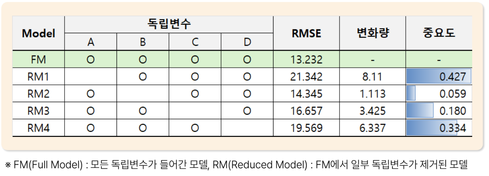
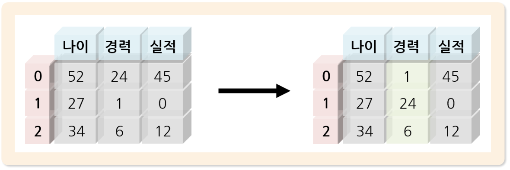

# 21. 특성공학

> 원본 PDF 범위: 548~566쪽 · PDF 설명 순서에 따라 재작성

## 주요 단어 먼저 보기

| 주요 단어 | 뜻 |
|---|---|
| 특성공학 | 원자료를 모델이 학습하기 좋은 특성으로 만드는 과정 |
| Feature Creation | 기존 변수로 새로운 변수를 생성 |
| Feature Selection | 유용한 변수만 선택 |
| Feature Transformation | 변수의 값·분포·표현을 변환 |
| 필터 방법 | 모델과 독립적인 통계기준으로 특성 선택 |
| 래퍼 방법 | 특성 조합별 모델 성능으로 선택 |
| 임베디드 방법 | 모델 학습 과정에서 특성 선택 |
| 데이터 누수 | 미래·평가 정보로 특성을 만들어 성능이 부풀려지는 문제 |

> **단원 시작법:** 주요 단어의 뜻을 먼저 읽고, 아래 PDF 절 순서대로 학습한다.

<!-- TOC START -->
## 목차

- [1. 특성공학 개요](#1-특성공학-개요)
  - [목적](#목적)
- [2. 목적과 특징](#2-목적과-특징)
  - [특성공학의 목적](#특성공학의-목적)
  - [특성공학의 특징](#특성공학의-특징)
  - [주요 방법](#주요-방법)
- [3. Feature Creation](#3-feature-creation)
  - [Feature Interaction](#feature-interaction)
  - [Pattern Mining](#pattern-mining)
  - [보강: 안전한 특성 생성](#보강-안전한-특성-생성)
- [4. Feature Selection](#4-feature-selection)
  - [특성 선택](#특성-선택)
  - [Drop Column Importance](#drop-column-importance)
  - [Permutation Importance](#permutation-importance)
  - [두 중요도 비교](#두-중요도-비교)
- [5. Feature Transformation](#5-feature-transformation)
  - [수치형 데이터](#수치형-데이터)
  - [범주형 데이터](#범주형-데이터)
- [6. 교재 문제와 해설](#6-교재-문제와-해설)
  - [문제 바로가기](#문제-바로가기)
  - [문제 1. Drop Column Importance](#문제-1-drop-column-importance)
  - [문제 2. Permutation Importance](#문제-2-permutation-importance)
  - [문제 3. 특성 생성](#문제-3-특성-생성)
  - [문제 4. 특성공학 우선 원칙](#문제-4-특성공학-우선-원칙)
  - [문제 5. 고차 특성](#문제-5-고차-특성)
- [보충 학습](#보충-학습)
  - [데이터 누수](#데이터-누수)
  - [보강: 시간의 주기성](#보강-시간의-주기성)
  - [텍스트 특성](#텍스트-특성)
  - [설명값의 주의점](#설명값의-주의점)
  - [특성 저장과 일관성](#특성-저장과-일관성)
  - [체크포인트](#체크포인트)
- [시험 직전 암기](#시험-직전-암기)
<!-- TOC END -->

## 1. 특성공학 개요

> **PDF 549쪽**

> **암기 한 줄:** 원시 데이터에서 모델에 맞는 특성을 `생성하고, 선택하고, 변환`한다.

### 목적

특성공학(Feature Engineering)은 **원시 데이터로부터 머신러닝 알고리즘에 적합한 특성을 생성·선택·변환하는 과정**이다. 같은 모델이라도 문제의 구조를 잘 드러내는 특성을 주면 더 쉽게 패턴을 학습할 수 있다.

| 갈래 | 하는 일 | 짧은 예 |
|---|---|---|
| Feature Creation | 기존 특성을 조합하거나 패턴을 추출해 새 특성을 만듦 | 가격×할인율=할인금액 |
| Feature Selection | 예측에 유용한 특성만 선별 | 성능 변화가 작은 변수 제거 |
| Feature Transformation | 특성의 스케일·분포·표현을 바꿈 | 정규화, 로그변환, 원-핫 인코딩 |

> **순서 암기:** `만-고-바` = 새로 **만**들고(Creation), 필요한 것을 **고**르고(Selection), 형태를 **바**꾼다(Transformation).

## 2. 목적과 특징

> **PDF 550쪽**

> **암기 한 줄:** `성능 향상, 간결·해석, 도메인 의미`가 목적이고 `계층·반복·도메인 의존`이 특징이다.

### 특성공학의 목적

1. 모델이 학습할 수 있는 **의미 있는 패턴**을 제공하여 성능 향상을 기대한다.
2. 기존 변수를 결합하거나 불필요한 변수를 제거해 더 간결하고 해석하기 쉬운 모델을 만든다.
3. 도메인 지식으로 비즈니스 의미가 있고 설명 가능한 특성을 만든다.

### 특성공학의 특징

- **계층적 접근:** `원시 데이터 → 기본 특성 → 고차 특성`으로 발전시킨다.
- **반복적 개선:** 특성을 한꺼번에 확정하지 않고 추가·제거한 뒤 검증 성능을 비교한다.
- **도메인 의존성:** 좋은 특성의 정의는 문제 영역에 따라 달라진다.

예를 들어 거래 원시 데이터에서 `거래일·금액`을 얻고, 기본 특성인 `최근 구매일·총 구매액`을 만든 뒤, 고차 특성인 `최근성·구매주기·고객가치`를 만든다.

### 주요 방법

- 수치형: 로그·제곱근·다항항·비율·차이·구간화
- 범주형: 원-핫·순서·빈도·타깃 인코딩
- 시간: 연·월·요일·시간대·경과시간·주기형 변환
- 텍스트: Bag-of-Words, TF-IDF, 임베딩
- 집계: 고객별 최근성·빈도·금액, 이동평균, 누적값

이 목록은 교재 내용의 확장 예시다. 어떤 방법이든 새 특성이 실제 검증 성능과 해석성을 개선하는지 확인해야 한다.

## 3. Feature Creation

> **PDF 551쪽**

> **암기 한 줄:** `상호작용은 결합`, `패턴 마이닝은 최빈·최소·최대 추출`.

### Feature Interaction

둘 이상의 특성을 결합하여 한 특성만으로는 보이지 않는 **상호작용 효과**를 표현한다.

- 곱셈: `가격 × 할인율 = 할인금액`
- 비율: `수익 ÷ 매출 = 수익률`

가격과 할인율을 따로 줄 때보다 할인금액을 함께 주면 모델이 실제 할인 규모를 직접 이용할 수 있다. 수익률은 회사 규모가 다른 경우에도 수익성을 비교하기 쉽다.

### Pattern Mining

한 변수 또는 여러 기록에서 반복되는 패턴이나 대표값을 뽑아 새 특성을 만든다.

- 최빈값: 고객의 방문 지점 기록 → `주 방문 지점`
- 최솟값: 배송시간 기록 → `최소 배송시간`
- 최댓값: 생산시간 기록 → `최대 생산시간`

최빈값은 가장 자주 나타난 범주를, 최소·최대는 관측 기간의 극단적 경험을 요약한다. 반드시 집계 대상과 기간을 명확히 해야 한다.

### 보강: 안전한 특성 생성

- 비율의 분모가 0이거나 매우 작으면 값이 폭발한다. 0 여부를 별도 특성으로 두거나 안정화 상수·절단을 검토한다.
- 미래 정보를 사용한 집계는 데이터 누수다. 예측 시점 이전 데이터만 사용한다.
- 다항항 $x^2$, $x^3$이나 변수 간 곱은 비선형성을 표현하지만 특성 수와 공선성을 크게 늘릴 수 있다.
- 고객 ID 같은 단순 식별 숫자는 크기 자체에 의미가 없으므로 보통 수치형 특성으로 직접 사용하지 않는다.

> **시험 판단법:** 새 특성이 `예측 시점에 알 수 있고`, `업무 의미가 있으며`, `단순 식별자가 아닌지` 확인한다.

## 4. Feature Selection

> **PDF 552~555쪽**

> **암기 한 줄:** `Filter=통계`, `Embedded=모델 내부`, `Wrapper=모델 성능 반복`.

### 특성 선택

| 접근 | 선택 기준 | 장점 | 주의점·예 |
|---|---|---|---|
| Filter Methods | 특성과 타깃의 통계적 관계 | 빠르고 모델 학습 전 적용 가능 | 상관계수, 카이제곱, 상호정보량; 상호작용을 놓칠 수 있음 |
| Embedded Methods | 모델 내부 알고리즘 | 학습과 선택이 함께 이루어짐 | 의사결정나무 중요도, Lasso; 모델 종류에 의존 |
| Wrapper Methods | 특성 부분집합별 모델 성능 | 실제 모델 성능을 직접 비교 | 계산량이 큼; 전진선택, 후진제거, RFE |

교재는 지도학습 모델에서 독립변수의 중요도를 비교해 **상대적으로 덜 중요한 변수**를 제거할 수 있다고 설명한다. Drop Column Importance와 Permutation Importance는 특정 모델 구조에 묶이지 않는 model-agnostic 방법이고, 의사결정나무 등 일부 모델은 자체 중요도 지표도 제공한다.

> **중요:** 특성선택은 학습 데이터 또는 교차검증 fold 안에서 수행한다. 전체 데이터로 먼저 선택하면 검증 데이터 정보가 들어가 성능이 부풀려질 수 있다.

### Drop Column Importance

특성 하나를 완전히 제거한 모델(Reduced Model)을 **다시 학습·평가**하고, 전체 특성을 사용한 모델(Full Model)과 평가점수 차이를 비교한다.

오차 지표인 RMSE에서는 다음처럼 계산할 수 있다.

$$
\Delta_j=\operatorname{RMSE}_{-j}-\operatorname{RMSE}_{\text{full}}
$$

$\Delta_j$가 클수록 그 특성을 제거했을 때 오차가 크게 증가했으므로 중요하다.

교재 표의 계산은 다음과 같다.

| 제거 특성 | 축소 모델 RMSE | 변화량 | 정규화 중요도 |
|---|---:|---:|---:|
| A | 21.342 | $21.342-13.232=8.110$ | 0.427 |
| B | 14.345 | $14.345-13.232=1.113$ | 0.059 |
| C | 16.657 | $16.657-13.232=3.425$ | 0.180 |
| D | 19.569 | $19.569-13.232=6.337$ | 0.334 |

변화량 합 $18.985$로 각 변화량을 나누면 중요도의 합은 1이 된다. 따라서 중요도 순서는 `A > D > C > B`다.

- 장점: 원리가 단순하고 결과 해석이 명확하다.
- 단점: 특성마다 모델을 다시 학습해야 하므로 계산량이 크다.
- 상관 특성이 있으면 하나를 빼도 다른 특성이 대신 설명하여 중요도가 낮게 나올 수 있다.

### Permutation Importance

이미 학습된 모델을 고정하고, **평가 데이터**에서 한 특성 열의 값만 무작위로 섞는다. 그러면 그 열의 주변분포는 유지되지만 다른 열 및 타깃과의 행 단위 관계는 끊어진다. 섞기 전후의 성능 차이가 크면 중요한 특성이다.

오차 지표에서는 다음과 같이 계산한다.

$$
PI_j=\operatorname{Error}(X_{\text{perm}(j)})-\operatorname{Error}(X)
$$

정확도처럼 클수록 좋은 지표라면 부호를 반대로 하여 `원래 점수 − 섞은 뒤 점수`로 계산한다.

- 장점: 모델을 다시 학습하지 않아 Drop Column보다 효율적이고, 다양한 지도학습 모델에 적용할 수 있다.
- 무작위 결과이므로 우연히 원래 배열과 비슷해질 수 있다. 여러 번 섞어 평균과 표준편차를 구한다.
- 각 특성을 개별적으로 섞으므로 특성 간 상호작용을 온전히 분리하지 못한다.
- 상관된 특성은 서로 대체할 수 있어 둘 다 낮게 평가될 수 있다.
- 예측 중요도이지 인과적 영향의 크기가 아니다.

### 두 중요도 비교

| 구분 | Drop Column Importance | Permutation Importance |
|---|---|---|
| 무엇을 바꾸나 | 특성 열을 제거 | 평가 데이터의 한 열 값을 섞음 |
| 재학습 | 필요 | 불필요 |
| 계산비용 | 큼 | 상대적으로 작음 |
| 공통점 | 모델에 독립적으로 사용 가능, 성능 변화를 중요도로 사용 | 모델에 독립적으로 사용 가능, 성능 변화를 중요도로 사용 |

> **구분 암기:** `Drop=열 삭제+재학습`, `Permutation=값 섞기+재평가`.

## 5. Feature Transformation

> **PDF 556쪽**

> **암기 한 줄:** 수치형은 `정규화·지수·로그`, 범주형은 `라벨·원-핫`.

특성 변환은 원래 의미를 유지하면서 모델이 다루기 쉬운 스케일·분포·표현으로 바꾸는 작업이다.

### 수치형 데이터

- **정규화:** 값을 일정 범위로 맞춘다. 예: Min-Max Scaling.
- **표준화:** 평균 0, 표준편차 1에 가깝게 맞춘다.
- **지수·거듭제곱 변환:** 분포 모양과 분산을 조정한다. 예: Box-Cox, Yeo-Johnson.
- **로그변환:** 큰 값의 영향을 줄이고 오른쪽으로 긴 분포를 완화한다. 0·음수 존재 여부를 먼저 확인한다.

### 범주형 데이터

- **Label Encoding:** 범주를 정수로 치환한다. 순서가 없는 범주에 적용하면 숫자 크기에 가짜 순서가 생길 수 있다.
- **One-Hot Encoding:** 범주마다 0/1 열을 만든다. 명목형 범주에 적합하지만 범주 수가 많으면 차원이 커진다.

모든 변환기는 **학습 데이터로만 `fit`**하고 검증·시험 데이터에는 같은 기준으로 `transform`한다.

> **시험 절차:** `train에 fit_transform → test에는 transform만`. 전체 데이터에 먼저 `fit`하면 데이터 누수다.

## 6. 교재 문제와 해설

> **원문 단원 말미 문제 전체 수록**

> 먼저 문제와 보기를 풀고, **정답 및 선택지별 해설 보기**를 펼쳐 확인하세요. 일반 4지선다 문항은 ①~④를 모두 해설하며, 원문이 2지선다인 경우에는 실제 보기만 수록합니다.

### 문제 바로가기

| 문제 | 주제 | 관련 목차 | PDF |
|---:|---|---|---:|
| [1](#ch21-q1) | Drop Column Importance | [4. Feature Selection](#4-feature-selection) | 557쪽 |
| [2](#ch21-q2) | Permutation Importance | [4. Feature Selection](#4-feature-selection) | 559쪽 |
| [3](#ch21-q3) | 특성 생성 | [3. Feature Creation](#3-feature-creation) | 561쪽 |
| [4](#ch21-q4) | 특성공학 우선 원칙 | [1. 특성공학 개요](#1-특성공학-개요) · [2. 목적과 특징](#2-목적과-특징) | 563쪽 |
| [5](#ch21-q5) | 고차 특성 | [3. Feature Creation](#3-feature-creation) | 565쪽 |

### 문제 1. Drop Column Importance

**출처:** PDF 557쪽  
**관련 목차:** [4. Feature Selection](#4-feature-selection)

Drop Column Importance를 이용해 특성 중요도를 평가할 때 가장 적절한 설명은?

1. 각 특성을 하나씩 제거한 뒤 모델을 다시 학습하여 성능 변화를 측정한다.
2. 각 특성 값을 무작위로 섞은 뒤 성능 변화를 측정한다.
3. 학습 과정에서 자동 계산되는 내재적 중요도만 사용한다.
4. 특성과 타깃의 상관계수만으로 중요도를 계산한다.

정답 및 선택지별 해설 보기

**정답: ① 각 특성을 하나씩 제거한 뒤 모델을 다시 학습하여 성능 변화를 측정한다.**

- **① 정답:** 한 특성을 완전히 빼고 재학습했을 때 성능이 크게 나빠질수록 그 특성이 중요하다고 본다.
- **② 오답:** 값을 섞어 정보만 깨뜨리고 모델은 유지하는 방법은 Permutation Importance다.
- **③ 오답:** 트리의 MDI 같은 모델 내재 중요도 설명이며 Drop Column은 모델을 반복 재학습한다.
- **④ 오답:** 단변량 상관은 비선형 관계와 다른 특성과의 조건부 기여를 놓치므로 Drop Column의 정의가 아니다.

### 문제 2. Permutation Importance

**출처:** PDF 559쪽  
**관련 목차:** [4. Feature Selection](#4-feature-selection)

Permutation Importance의 특징으로 가장 적절하지 않은 것은?

1. 이미 학습된 모델로 계산할 수 있어 Drop Column보다 계산 효율적이다.
2. 특성 간 상호작용을 고려하여 중요도를 계산한다.
3. 특성 값을 무작위로 섞어 모델 성능 변화를 측정한다.
4. 모델에 독립적이어서 다양한 지도학습 모델에 적용할 수 있다.

정답 및 선택지별 해설 보기

**정답: ② 특성 간 상호작용을 고려하여 중요도를 계산한다.**

- **① 오답:** 정답이 아님. 모델을 특성마다 재학습하지 않고 예측만 반복하므로 상대적으로 효율적이다.
- **② 정답:** 정답(적절하지 않은 설명). 기본 permutation은 한 특성을 따로 섞으므로 상호작용과 상관 특성의 대체효과를 완전히 반영하지 못한다.
- **③ 오답:** 정답이 아님. 열 하나의 값-행 대응을 깨뜨려 그 정보가 사라질 때 성능이 얼마나 떨어지는지 본다.
- **④ 오답:** 정답이 아님. 성능을 평가할 수 있는 어떤 학습 모델에도 원칙적으로 적용 가능한 model-agnostic 방법이다.

### 문제 3. 특성 생성

**출처:** PDF 561쪽  
**관련 목차:** [3. Feature Creation](#3-feature-creation)

전자상거래 고객 구매패턴 예측을 위한 새로운 특성 중 가장 부적절한 것은?

1. 평균 구매간격(일)
2. 구매금액의 계절별 변동계수
3. 고객ID 값을 이용한 수치형 특성
4. 주말 대비 평일 구매비율

정답 및 선택지별 해설 보기

**정답: ③ 고객ID 값을 이용한 수치형 특성**

- **① 오답:** 구매 빈도와 재방문 주기를 나타내는 행동 특성으로 예측 의미가 있다.
- **② 오답:** 고객 소비의 계절성과 변동성을 표현할 수 있다.
- **③ 정답:** 고객ID는 식별자일 뿐 숫자 크기·거리의 구매 의미가 없다. 그대로 수치화하면 모델이 우연한 번호 패턴을 학습한다.
- **④ 오답:** 요일 선호를 비율로 나타내 구매 시간대 패턴을 요약한다.

### 문제 4. 특성공학 우선 원칙

**출처:** PDF 563쪽  
**관련 목차:** [1. 특성공학 개요](#1-특성공학-개요) · [2. 목적과 특징](#2-목적과-특징)

Feature Engineering에서 가장 우선적으로 고려해야 할 원칙은?

1. 가능한 한 많은 특성을 만들고 모델이 선택하게 한다.
2. 복잡한 수학변환으로 모든 비선형관계를 선형화한다.
3. 도메인지식을 바탕으로 비즈니스 의미가 있는 특성을 우선 생성한다.
4. 모든 특성을 같은 스케일로 만드는 것만 우선한다.

정답 및 선택지별 해설 보기

**정답: ③ 도메인지식을 바탕으로 비즈니스 의미가 있는 특성을 우선 생성한다.**

- **① 오답:** 무분별한 특성 증가는 계산비용·다중공선성·과적합·누출 위험을 키운다.
- **② 오답:** 모든 관계를 선형화할 수 없고 복잡한 변환은 해석성과 일반화를 해칠 수 있다.
- **③ 정답:** 업무 메커니즘을 반영한 의미 있는 특성이 신호를 잘 드러내고 설명과 검증도 쉽다.
- **④ 오답:** 스케일링은 일부 모델에 중요하지만 특성이 무엇을 의미하는지보다 항상 먼저인 보편 원칙은 아니다.

### 문제 5. 고차 특성

**출처:** PDF 565쪽  
**관련 목차:** [3. Feature Creation](#3-feature-creation)

계층적 접근에서 고차 특성(High-order Features)에 대한 설명으로 가장 적절하지 않은 것은?

1. 여러 기본특성의 조합이나 상호작용으로 생성된다.
2. 원시 데이터에서 직접 관찰할 수 없는 잠재 패턴을 표현한다.
3. 도메인 전문지식이 많이 활용되는 단계이다.
4. 모델 해석가능성을 높이기 위해 단순한 형태로 유지해야 한다.

정답 및 선택지별 해설 보기

**정답: ④ 모델 해석가능성을 높이기 위해 단순한 형태로 유지해야 한다.**

- **① 오답:** 정답이 아님. 비율·곱·다항항·집계처럼 기본특성을 조합해 만든다.
- **② 오답:** 정답이 아님. 고객가치·위험도 같은 잠재 개념을 여러 원시변수 조합으로 표현할 수 있다.
- **③ 오답:** 정답이 아님. 어떤 상호작용과 집계가 의미 있는지 판단할 때 도메인지식이 핵심이다.
- **④ 정답:** 정답(적절하지 않은 설명). 고차 특성은 복잡한 상호작용을 담아 성능을 높일 수 있지만 보통 해석은 더 어려워진다.

## 보충 학습

> 원문 절 순서를 모두 학습한 뒤 이해와 문제 적용력을 높이는 확장 내용이다.

### 데이터 누수

- 미래 시점의 정보를 과거 예측에 사용
- 목표값으로 만든 집계·대치값을 전체 데이터에 적용
- 분할 전에 스케일링·특성선택
- 동일 개체의 여러 행이 학습·평가에 동시에 존재

모든 특성은 실제 예측 시점에 이용 가능한 정보로만 만들어야 한다.

### 보강: 시간의 주기성

요일·월·시간은 끝과 시작이 이어지는 순환 변수다. 예를 들어 시간 $h$는 다음처럼 표현할 수 있다.

$$
sin_h=\sin(2\pi h/24),\qquad cos_h=\cos(2\pi h/24)
$$

### 텍스트 특성

- Bag-of-Words: 단어별 빈도
- TF-IDF: 문서에 특이적인 단어에 가중치
- n-gram: 짧은 어순·표현 포착
- 임베딩: 의미적 유사성을 밀집 벡터로 표현

텍스트 전처리는 언어와 업무에 따라 다르다. 무조건적인 불용어 제거는 `아니다`, `없음` 같은 부정 정보를 잃을 수 있다.

### 설명값의 주의점

SHAP 값은 선택한 배경분포와 특성 의존성 처리 방식에 따라 달라진다. '이 특성이 결과를 발생시켰다'가 아니라 모델 예측에 대한 기여로 해석한다.

### 특성 저장과 일관성

학습과 서빙에서 같은 정의·코드·기준시점을 사용한다. 특성 이름, 데이터형, 결측정책, 계산 버전, 소유자를 기록해 train-serving skew를 막는다.

### 체크포인트

- 타깃 인코딩은 교차검증 방식으로 누수를 막는다.
- 특성 중요도는 인과효과가 아니다.
- 특성 생성 후에는 반드시 검증 성능과 안정성을 확인한다.

## 시험 직전 암기

- 원자료를 모델이 학습하기 쉬운 정보 표현으로 바꾸는 과정이다.
- 신호를 강화하고 잡음·차원·비용을 줄이되 누수를 막는다.
- 도메인 지식으로 비율·차이·집계·시간 특성을 만든다.
- 필터·래퍼·임베디드 방법으로 유용한 특성만 남긴다.
- 로그·스케일링·인코딩 등으로 분포나 표현 공간을 바꾼다.
