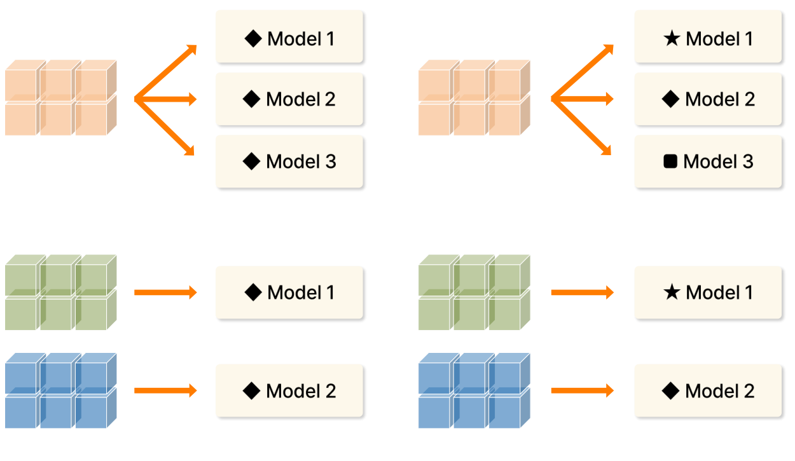
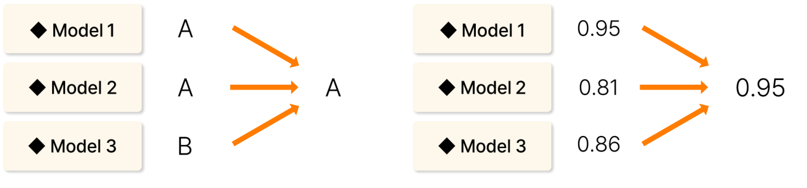

# 22. 앙상블모델링

> 원본 PDF 범위: 567~586쪽 · PDF 설명 순서에 따라 재작성

## 주요 단어 먼저 보기

| 주요 단어 | 뜻 |
|---|---|
| 앙상블 | 여러 모델의 예측을 결합하는 방법 |
| 보팅 | 여러 분류 결과를 투표로 결합 |
| 배깅 | 부트스트랩 표본 모델을 병렬 학습해 결합 |
| 부스팅 | 이전 모델의 오류를 다음 모델이 순차 보완 |
| 스태킹 | 기본 모델 예측을 메타모델이 다시 학습 |
| 부트스트랩 | 복원추출로 원자료 크기의 표본을 생성 |
| 다양성 | 구성 모델의 오류 패턴이 서로 다른 정도 |
| 편향 | 모델 가정 때문에 생기는 체계적 오차 |
| 분산 | 학습 데이터 변화에 따른 예측 변동 |

> **단원 시작법:** 주요 단어의 뜻을 먼저 읽고, 아래 PDF 절 순서대로 학습한다.

<!-- TOC START -->
## 목차

- [1. 앙상블 모델링 개요](#1-앙상블-모델링-개요)
  - [기본 아이디어](#기본-아이디어)
- [2. 목적과 특징](#2-목적과-특징)
  - [목적](#목적)
  - [특징](#특징)
- [3. 앙상블 모델링의 유형](#3-앙상블-모델링의-유형)
  - [데이터셋·알고리즘 수에 따른 구분](#데이터셋알고리즘-수에-따른-구분)
  - [다양성을 만드는 실제 방법](#다양성을-만드는-실제-방법)
- [4. 부트스트랩](#4-부트스트랩)
  - [OOB 비율](#oob-비율)
- [5. 배깅](#5-배깅)
  - [배깅](#배깅)
  - [투표(Voting)](#투표voting)
- [6. 수행 시 고려사항](#6-수행-시-고려사항)
  - [구성 모델과 비중](#구성-모델과-비중)
  - [다양성 만들기](#다양성-만들기)
  - [보강: 대표 앙상블 방식 비교](#보강-대표-앙상블-방식-비교)
- [7. 교재 문제와 해설](#7-교재-문제와-해설)
  - [문제 바로가기](#문제-바로가기)
  - [문제 1. Hard Voting 다수결](#문제-1-hard-voting-다수결)
  - [문제 2. 확률에서 Hard Voting](#문제-2-확률에서-hard-voting)
  - [문제 3. 앙상블 다양성](#문제-3-앙상블-다양성)
  - [문제 4. 배깅과 부스팅](#문제-4-배깅과-부스팅)
  - [문제 5. 부트스트랩 제외 확률](#문제-5-부트스트랩-제외-확률)
- [보충 학습](#보충-학습)
  - [보강: 선택 기준](#보강-선택-기준)
  - [체크포인트](#체크포인트)
- [시험 직전 암기](#시험-직전-암기)
<!-- TOC END -->

## 1. 앙상블 모델링 개요

> **PDF 568쪽**

> **암기 한 줄:** 여러 기본학습기의 예측을 결합해 단일 모델보다 정확하고 안정적인 강한 학습기를 만든다.

### 기본 아이디어

앙상블 모델링(Ensemble Modeling)은 다수의 기본학습기 또는 약한 학습기를 조합하여 단일 모델보다 성능이 좋은 모델을 만드는 기법이다. 회귀값이나 분류 결과를 평균·투표·가중결합하여 정확성과 안정성을 높인다.

| 관련 용어 | 교재의 의미 | 정확히 기억할 점 |
|---|---|---|
| 기본학습기(Base Learner) | 앙상블을 구성하는 개별 예측 모델 | 단순하고 해석 가능한 모델을 쓸 수 있지만 반드시 단순해야 하는 것은 아님 |
| 약한 학습기(Weak Learner) | 무작위 추측보다 조금 나은 모델 | `정확도 50% 이상`은 균형 이진분류에서만 직관적으로 통하는 표현 |
| 강한 학습기(Strong Learner) | 높은 정확도를 내는 최종 결합 모델 | 여러 약한 학습기의 오류를 상쇄해 만듦 |
| 다양성(Diversity) | 구성 모델 사이의 예측·오류 차이 | 정확도와 다양성의 균형이 중요 |

개별 모델이 정확해도 모두 같은 관측값에서 틀리면 결합 이득이 작다. 반대로 서로 다르기만 하고 개별 성능이 너무 낮아도 좋지 않다.

> **핵심식:** 좋은 앙상블 = `쓸 만한 개별 성능 + 서로 다른 오류`.

## 2. 목적과 특징

> **PDF 569쪽**

> **암기 한 줄:** 편향·분산·오차를 줄이고 불안정성을 완화해 일반화 성능을 높인다.

### 목적

1. 개별 모델의 편향(bias)과 분산(variance)을 줄여 회귀 오차나 분류 오류를 감소시킨다.
2. 모델들의 예측 분포나 변동을 이용해 예측 불확실성을 정량화하는 데 활용한다.

### 특징

- 편향과 분산을 함께 고려하여 전체 오차를 최적화한다.
- 모델 복잡성을 적절히 제어하여 과적합을 줄인다.
- 학습자료 변화에 따른 불안정성을 완화해 새 데이터에 대한 일반화 성능을 높인다.
- 평균·투표는 개별 모델의 우연한 오류를 상쇄한다.

회귀에서 서로 독립이고 같은 분산 $\sigma^2$을 가진 $M$개 모델을 평균하면 평균의 분산은 $\sigma^2/M$로 줄어든다. 실제 모델은 서로 상관되어 있으므로 감소 폭은 작지만, 오류 상관이 낮을수록 평균 효과가 커진다.

> **보강 주의:** 구성 모델의 예측 분산이 곧바로 잘 보정된 확률구간을 뜻하지는 않는다. 불확실성 추정에는 별도의 보정과 검증이 필요하다.

## 3. 앙상블 모델링의 유형

> **PDF 570~571쪽**

> **암기 한 줄:** 데이터가 `하나/여러 개`, 알고리즘이 `하나/여러 개`인 2×2 조합이다.

### 데이터셋·알고리즘 수에 따른 구분

교재는 앙상블을 데이터셋 수와 알고리즘 수로 다음 네 가지로 구분한다.

| 데이터 | 알고리즘 | 구성 방식 | 대표적인 다양성의 원천 |
|---|---|---|---|
| 단일 데이터셋 | 단일 알고리즘 | 같은 데이터·알고리즘으로 여러 모델 생성 | 난수 초기값, 하이퍼파라미터 |
| 단일 데이터셋 | 다중 알고리즘 | 같은 데이터에 서로 다른 알고리즘 적용 | 학습 원리 |
| 다중 데이터셋 | 단일 알고리즘 | 서로 다른 표본에 같은 알고리즘 적용 | 데이터 표본; 배깅의 핵심 |
| 다중 데이터셋 | 다중 알고리즘 | 표본과 알고리즘을 모두 다르게 구성 | 데이터와 학습 원리 모두 |

여기서 `다중 데이터셋`은 반드시 외부에서 별도 수집한 데이터라는 뜻만은 아니다. 부트스트랩이나 다른 재표본화로 한 원본에서 여러 학습표본을 만든 경우도 포함한다.

> **2×2 암기:** `한데-한알 / 한데-여알 / 여러데-한알 / 여러데-여알`.

### 다양성을 만드는 실제 방법

- 같은 알고리즘의 초기값이나 하이퍼파라미터를 다르게 한다.
- 행을 재표본화하거나 특성 부분집합을 다르게 한다.
- 의사결정나무·로지스틱 회귀처럼 학습 원리가 다른 알고리즘을 결합한다.
- 서로 다른 기간이나 센서·채널의 데이터로 학습한다.

## 4. 부트스트랩

> **PDF 572~573쪽**

> **암기 한 줄:** 복원추출 표본을 반복 생성해 모델 간 데이터 차이를 만든다.

부트스트랩(Bootstrap)은 원본 데이터셋에서 **복원추출**하여 원본과 같은 크기의 새로운 데이터셋을 만드는 통계적 기법이다.

- 뽑은 관측값을 다시 넣고 추출하므로 같은 관측값이 여러 번 선택될 수 있다.
- 부트스트랩 표본에 한 번도 뽑히지 않은 관측값을 OOB(Out-of-Bag) 표본이라고 한다.
- 표본마다 포함된 관측값과 중복 횟수가 달라져 학습 모델 사이의 다양성이 생긴다.

교재는 클래스 불균형을 맞추는 용도로도 사용할 수 있다고 설명한다. 다만 **일반 부트스트랩이 자동으로 균형을 맞추는 것은 아니다**. 클래스별 추출 수를 통제하는 balanced bootstrap이나 층화 재표본화가 필요하다.

### OOB 비율

원자료가 $n$개일 때 한 번 뽑을 때 특정 관측값이 선택되지 않을 확률은 $1-1/n$이다. 이를 $n$번 복원추출하면

$$
\left(1-\frac1n\right)^n\rightarrow e^{-1}\approx0.368
$$

이므로 한 부트스트랩 표본에는 원자료의 서로 다른 관측값이 약 63.2% 포함되고, 약 36.8%는 포함되지 않는다.

> **암기:** `복원추출 n번 → 약 63.2% 포함, 36.8% OOB`.

교재의 `부트스트랩의 부스팅은 주로 편향 감소`라는 문장은 용어가 섞인 표현으로 보아야 한다. **부트스트랩은 재표본화 기법**, **배깅은 부트스트랩 모델을 평균해 주로 분산 감소**, **부스팅은 앞 모델의 오류를 순차 보완해 편향 감소에 기여**한다.

## 5. 배깅

> **PDF 574~575쪽**

> **암기 한 줄:** `Bootstrap으로 학습 + Aggregating으로 결합 = Bagging`.

### 배깅

배깅(Bagging; Bootstrap Aggregating)은 여러 부트스트랩 학습데이터로 모델을 병렬 학습한 뒤 예측을 집계한다. 높은 분산을 가진 기본학습기의 예측을 평균하여 더 안정적인 예측을 만드는 것이 주목적이다.

- 회귀: 여러 모델의 수치 예측을 산술평균
- 분류: 여러 모델의 클래스 또는 확률을 투표로 결합
- 대표 모델: Bagging, Random Forest

부트스트랩 표본에 포함되지 않은 관측치로 OOB 성능을 추정할 수 있다. 배깅의 이득은 개별 모델의 분산이 높고 오류 상관이 낮을수록 커진다.

### 투표(Voting)

분류 앙상블에서 여러 모델의 예측을 하나의 최종 클래스로 결합하는 방법이다.

- **Hard Voting:** 모델이 예측한 클래스의 최빈값, 즉 다수결을 선택한다. 그림의 `A, A, B`는 최종 `A`다.
- **Soft Voting:** 각 클래스의 예측확률을 모델별로 평균하고, 평균확률이 가장 큰 클래스를 선택한다.
- **Weighted Voting:** 검증 성능이나 신뢰도에 따라 모델별 가중치를 주어 결합한다.

표준 Soft Voting은 한 모델이 낸 가장 큰 확률 하나를 그대로 선택하는 방식이 아니다. 클래스 $c$에 대해

$$
\bar p(c\mid x)=\frac{1}{M}\sum_{m=1}^{M}p_m(c\mid x),\qquad
\hat y=\arg\max_c \bar p(c\mid x)
$$

로 계산한다. 모델마다 확률 보정 수준이 다르면 평균이 왜곡될 수 있으므로 calibration을 확인한다.

> **구분 암기:** `Hard=클래스 표`, `Soft=클래스별 확률 평균`.

## 6. 수행 시 고려사항

> **PDF 576쪽**

> **암기 한 줄:** 모델 수·가중치·학습 원리·예측 상관을 함께 본다.

### 구성 모델과 비중

- 성능 향상과 계산비용 사이 균형을 고려해 모델 수를 정한다.
- 도메인과 데이터 맥락에 맞는 모델을 조합하고 필요하면 가중치를 설정한다.
- 의사결정나무와 로지스틱 회귀처럼 서로 다른 학습 원리를 가진 모델을 결합한다.
- 기본모델 사이 예측·오류 상관을 낮춰 다양성을 높인다.
- 최종 성능뿐 아니라 학습시간, 예측지연, 메모리, 해석 가능성도 함께 비교한다.

### 다양성 만들기

- 서로 다른 알고리즘을 결합
- 데이터 행·특성·기간을 다르게 학습
- 손실함수와 하이퍼파라미터를 다르게 설정
- 난수 시드를 바꾸되 단순 복제 모델만 늘리지 않음

모델 간 예측오류 상관을 확인하면 추가 모델이 앙상블에 실제로 새로운 정보를 주는지 판단할 수 있다.

### 보강: 대표 앙상블 방식 비교

| 방식 | 학습 관계 | 주로 줄이는 것 | 결합 |
|---|---|---|---|
| Voting | 서로 독립적인 여러 모델 | 공통 오류 상쇄 | 클래스 다수결·확률 평균 |
| Bagging | 부트스트랩 표본으로 병렬 학습 | 분산 | 평균·투표 |
| Boosting | 이전 모델의 오류를 순차 보완 | 편향을 포함한 예측오차 | 가중합 |
| Stacking | 기본모델 예측을 메타모델이 학습 | 모델별 장단점 | 메타모델 |

Gradient Boosting은 현재 모델의 손실을 줄이는 방향에 새 학습기 $h_m$을 더한다.

$$
F_m(x)=F_{m-1}(x)+\eta h_m(x)
$$

Stacking의 메타모델은 학습 데이터에 대한 직접 예측이 아니라 **out-of-fold 예측**으로 학습해야 누수를 막을 수 있다.

## 7. 교재 문제와 해설

> **원문 단원 말미 문제 전체 수록**

> 먼저 문제와 보기를 풀고, **정답 및 선택지별 해설 보기**를 펼쳐 확인하세요. 일반 4지선다 문항은 ①~④를 모두 해설하며, 원문이 2지선다인 경우에는 실제 보기만 수록합니다.

### 문제 바로가기

| 문제 | 주제 | 관련 목차 | PDF |
|---:|---|---|---:|
| [1](#ch22-q1) | Hard Voting 다수결 | [3. 앙상블 모델링의 유형](#3-앙상블-모델링의-유형) | 577쪽 |
| [2](#ch22-q2) | 확률에서 Hard Voting | [3. 앙상블 모델링의 유형](#3-앙상블-모델링의-유형) | 579쪽 |
| [3](#ch22-q3) | 앙상블 다양성 | [2. 목적과 특징](#2-목적과-특징) · [6. 수행 시 고려사항](#6-수행-시-고려사항) | 581쪽 |
| [4](#ch22-q4) | 배깅과 부스팅 | [3. 앙상블 모델링의 유형](#3-앙상블-모델링의-유형) · [5. 배깅](#5-배깅) | 583쪽 |
| [5](#ch22-q5) | 부트스트랩 제외 확률 | [4. 부트스트랩](#4-부트스트랩) | 585쪽 |

### 문제 1. Hard Voting 다수결

**출처:** PDF 577쪽  
**관련 목차:** [3. 앙상블 모델링의 유형](#3-앙상블-모델링의-유형)

5개 분류모델의 예측이 A, B, A, C, A일 때 Hard Voting의 최종 예측은?

1. A
2. B
3. C
4. 오류 발생

정답 및 선택지별 해설 보기

**정답: ① A**

- **① 정답:** A가 3표, B와 C가 각각 1표이므로 최빈 클래스 A가 선택된다.
- **② 오답:** B는 한 모델만 예측해 다수표가 아니다.
- **③ 오답:** C도 한 표뿐이다.
- **④ 오답:** 명확한 최다 득표 A가 있어 동률 처리나 오류가 필요 없다.

### 문제 2. 확률에서 Hard Voting

**출처:** PDF 579쪽  
**관련 목차:** [3. 앙상블 모델링의 유형](#3-앙상블-모델링의-유형)

세 모델의 클래스 확률이 다음과 같을 때 Hard Voting의 최종 예측은?

- 모델 1: P(A)=0.8, P(B)=0.1, P(C)=0.1
- 모델 2: P(A)=0.3, P(B)=0.4, P(C)=0.3
- 모델 3: P(A)=0.4, P(B)=0.3, P(C)=0.3

1. A
2. B
3. C
4. 동점으로 인한 문제 발생

정답 및 선택지별 해설 보기

**정답: ① A**

- **① 정답:** 각 모델의 argmax는 A, B, A이고 클래스 투표가 2:1:0이므로 A다.
- **② 오답:** 모델 2만 B에 투표하고 모델 1·3은 A에 투표한다.
- **③ 오답:** 어느 모델에서도 C가 최대확률 클래스가 아니다.
- **④ 오답:** A가 두 표로 단독 최다라 동점이 아니다.

### 문제 3. 앙상블 다양성

**출처:** PDF 581쪽  
**관련 목차:** [2. 목적과 특징](#2-목적과-특징) · [6. 수행 시 고려사항](#6-수행-시-고려사항)

앙상블에서 기본모델 간 강한 상관관계가 있을 때 예상되는 문제는?

1. 계산비용이 기하급수적으로 증가한다.
2. 해석가능성이 반드시 크게 떨어진다.
3. 다양성이 부족하여 앙상블 효과가 감소한다.
4. 메모리 사용량이 반드시 과도하게 증가한다.

정답 및 선택지별 해설 보기

**정답: ③ 다양성이 부족하여 앙상블 효과가 감소한다.**

- **① 오답:** 모델 수와 복잡도에 따라 계산비용은 늘지만 상관이 높다는 사실이 기하급수 증가를 직접 뜻하지 않는다.
- **② 오답:** 앙상블 해석은 어려울 수 있으나 기본모델 예측 상관의 핵심 문제는 오류 상쇄가 줄어드는 것이다.
- **③ 정답:** 모델들이 같은 실수를 하면 평균·투표로 오류가 상쇄되지 않아 다양성에서 얻는 성능 향상이 작다.
- **④ 오답:** 메모리는 모델 수·크기에 좌우되며 예측 상관관계가 직접 원인은 아니다.

### 문제 4. 배깅과 부스팅

**출처:** PDF 583쪽  
**관련 목차:** [3. 앙상블 모델링의 유형](#3-앙상블-모델링의-유형) · [5. 배깅](#5-배깅)

배깅과 부스팅이 편향-분산 균형에 미치는 영향으로 올바른 것은?

1. 배깅: 편향 감소, 부스팅: 분산 감소
2. 배깅: 분산 감소, 부스팅: 편향 감소
3. 배깅: 편향·분산 모두 감소, 부스팅: 변화 없음
4. 배깅: 변화 없음, 부스팅: 편향·분산 모두 증가

정답 및 선택지별 해설 보기

**정답: ② 배깅: 분산 감소, 부스팅: 편향 감소**

- **① 오답:** 평균화하는 배깅의 대표 효과와 잔차를 순차 보정하는 부스팅의 대표 효과를 반대로 썼다.
- **② 정답:** 배깅은 불안정한 모델들의 평균으로 분산을 줄이고, 부스팅은 이전 오류를 집중 보정해 편향을 줄이는 데 강하다.
- **③ 오답:** 어떤 방법도 편향·분산을 항상 동시에 감소한다고 보장하지 않고 부스팅도 분명한 변화를 만든다.
- **④ 오답:** 배깅은 분산 감소가 목적이며 부스팅도 학습을 개선한다. 다만 과도한 부스팅은 노이즈에 민감할 수 있다.

### 문제 5. 부트스트랩 제외 확률

**출처:** PDF 585쪽  
**관련 목차:** [4. 부트스트랩](#4-부트스트랩)

원본 데이터셋에서 크기 n의 부트스트랩 표본을 복원추출할 때 특정 데이터 포인트가 포함되지 않을 확률은 n이 충분히 크면 약 얼마인가?

1. 약 26.4%
2. 약 36.8%
3. 약 50.0%
4. 약 63.2%

정답 및 선택지별 해설 보기

**정답: ② 약 36.8%**

- **① 오답:** 한 번 안 뽑힐 확률이 1−1/n이고 이를 n번 모두 피할 확률을 계산해야 한다.
- **② 정답:** (1−1/n)ⁿ→e⁻¹≈0.368이므로 약 36.8%가 한 부트스트랩 표본에서 OOB로 남는다.
- **③ 오답:** 복원추출이라고 포함·미포함이 단순히 반반이 되는 것은 아니다.
- **④ 오답:** 약 63.2%=1−e⁻¹은 적어도 한 번 포함될 확률이며 문제는 포함되지 않을 확률을 묻는다.

## 보충 학습

> 원문 절 순서를 모두 학습한 뒤 이해와 문제 적용력을 높이는 확장 내용이다.

### 보강: 선택 기준

| 방법 | 주된 효과 | 병렬성 | 대표 위험 |
|---|---|---:|---|
| 보팅 | 오류 상쇄 | 높음 | 유사 모델만 결합 |
| 배깅 | 분산 감소 | 높음 | 큰 계산·메모리 |
| 부스팅 | 편향 감소 | 낮음 | 잡음·튜닝 민감 |
| 스태킹 | 모델 간 보완 | 중간 | 메타 누수 |

### 체크포인트

- 하드 보팅은 클래스 표, 소프트 보팅은 확률을 결합한다.
- 배깅은 병렬, 부스팅은 순차 학습이 기본이다.
- 스태킹은 out-of-fold 예측으로 메타데이터를 만든다.

## 시험 직전 암기

- 서로 다른 모델의 오차를 결합해 한 모델보다 안정적인 예측을 만든다.
- 성능 향상의 핵심은 구성 모델의 정확도와 오차 다양성이다.
- 보팅은 결과 결합, 배깅은 병렬 재표본, 부스팅은 순차 오류 보정이다.
- 복원추출 표본을 반복 생성해 모델 간 데이터 차이를 만든다.
- 여러 부트스트랩 모델의 평균·투표로 분산을 줄인다.
- 검증 누수·계산비용·해석성·상관된 오차를 점검한다.
