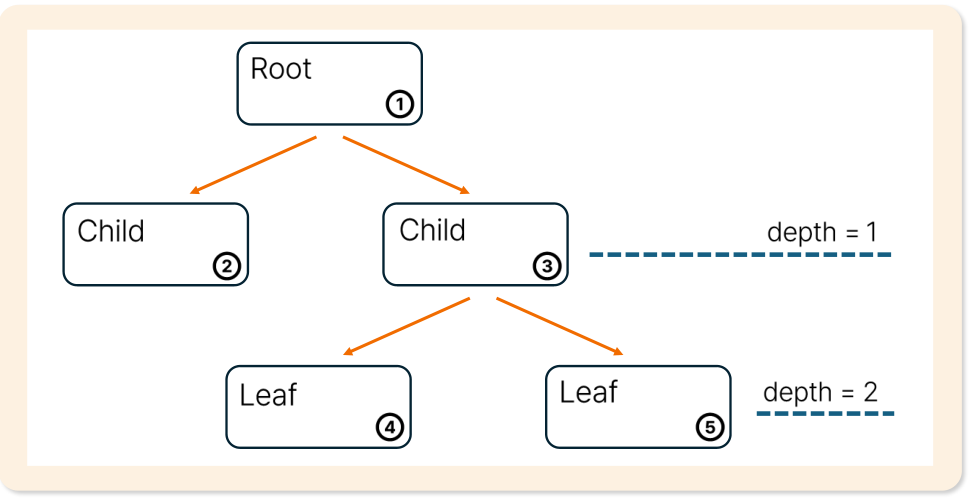
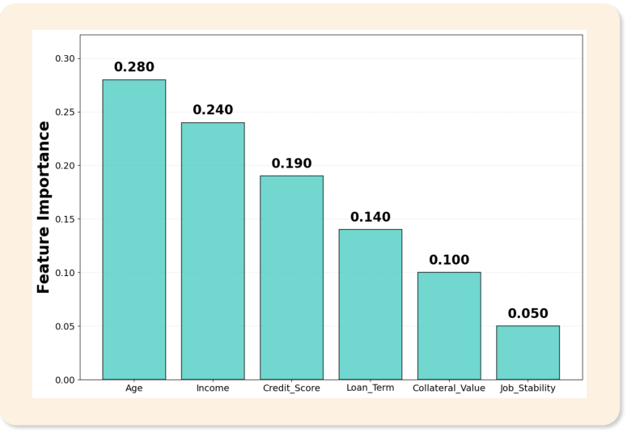

# 23. 랜덤포레스트

> 원본 PDF 범위: 587~611쪽 · PDF 설명 순서에 따라 재작성

## 주요 단어 먼저 보기

| 주요 단어 | 뜻 |
|---|---|
| 랜덤포레스트 | 배깅과 무작위 특성 선택을 결합한 나무 앙상블 |
| 부트스트랩 표본 | 복원추출로 만든 각 나무의 학습 데이터 |
| 무작위 특성 선택 | 노드마다 일부 특성만 분할 후보로 사용 |
| OOB 표본 | 특정 나무의 부트스트랩 표본에 뽑히지 않은 관측값 |
| OOB 평가 | OOB 표본으로 일반화 성능을 추정 |
| 특성 중요도 | 예측에 대한 변수의 상대적 기여 |
| 분류 예측 | 여러 나무의 투표 또는 확률 평균 |
| 회귀 예측 | 여러 나무 예측값의 평균 |
| 나무 수 | 앙상블에 포함할 의사결정나무 개수 |

> **단원 시작법:** 주요 단어의 뜻을 먼저 읽고, 아래 PDF 절 순서대로 학습한다.

<!-- TOC START -->
## 목차

- [1. 랜덤포레스트 개요](#1-랜덤포레스트-개요)
  - [핵심 원리](#핵심-원리)
  - [왜 두 번 랜덤인가](#왜-두-번-랜덤인가)
- [2. 목적과 특징](#2-목적과-특징)
  - [목적과 기본 특징](#목적과-기본-특징)
  - [장단점](#장단점)
  - [나무 수 증가 시 특징](#나무-수-증가-시-특징)
- [3. 쓰임새](#3-쓰임새)
- [4. 의사결정나무 복습](#4-의사결정나무-복습)
- [5. 앙상블 모델링 복습](#5-앙상블-모델링-복습)
  - [앙상블과 네 가지 구성](#앙상블과-네-가지-구성)
  - [배깅 복습](#배깅-복습)
  - [학습과 예측](#학습과-예측)
- [6. 해석](#6-해석)
  - [특성 중요도](#특성-중요도)
  - [MDI의 장점과 한계](#mdi의-장점과-한계)
- [7. 예측값 산출](#7-예측값-산출)
  - [학습 과정](#학습-과정)
  - [예측 과정](#예측-과정)
  - [분류 예측](#분류-예측)
  - [회귀 예측](#회귀-예측)
- [8. 평가](#8-평가)
  - [분류 모델 평가](#분류-모델-평가)
  - [회귀 모델 평가](#회귀-모델-평가)
  - [OOB 평가](#oob-평가)
- [9. 수행 시 고려사항](#9-수행-시-고려사항)
  - [과적합 방지와 교재 표현 바로잡기](#과적합-방지와-교재-표현-바로잡기)
  - [주요 하이퍼파라미터](#주요-하이퍼파라미터)
- [10. 교재 문제와 해설](#10-교재-문제와-해설)
  - [문제 바로가기](#문제-바로가기)
  - [문제 1. 랜덤포레스트 원리](#문제-1-랜덤포레스트-원리)
  - [문제 2. 랜덤포레스트 회귀 예측](#문제-2-랜덤포레스트-회귀-예측)
  - [문제 3. MDI 특성중요도](#문제-3-mdi-특성중요도)
  - [문제 4. 랜덤포레스트 장점](#문제-4-랜덤포레스트-장점)
  - [문제 5. 나무 개수의 영향](#문제-5-나무-개수의-영향)
- [보충 학습](#보충-학습)
  - [불확실성과 분위수 예측](#불확실성과-분위수-예측)
  - [Extra Trees와 비교](#extra-trees와-비교)
  - [보강: 불균형 데이터](#보강-불균형-데이터)
  - [체크포인트](#체크포인트)
- [시험 직전 암기](#시험-직전-암기)
<!-- TOC END -->

## 1. 랜덤포레스트 개요

> **PDF 588쪽**

> **암기 한 줄:** 랜덤포레스트 = `의사결정나무 여러 개 + 부트스트랩 + 무작위 특성 + 투표·평균`.

### 핵심 원리

랜덤포레스트(Random Forest)는 다수의 의사결정나무를 결합하여 단일 나무보다 예측성능을 높이는 **지도학습 앙상블 알고리즘**이다.

| 관련 용어 | 뜻 | 랜덤포레스트에서의 역할 |
|---|---|---|
| 앙상블학습 | 여러 약한 학습기를 결합해 강한 학습기를 만드는 기법 | 여러 나무의 예측을 결합 |
| 배깅(Bagging) | 부트스트랩 표본별 모델을 학습하고 결과를 집계 | 나무마다 다른 행 표본 사용 |
| 특성 부분집합 선택 | 전체 특성 중 일부를 무작위로 선택 | 나무들의 분할이 서로 달라지게 함 |
| 기본학습기 | 앙상블을 구성하는 개별 모델 | 의사결정나무 한 그루 |

각 나무에 두 종류의 무작위성을 준다.

1. 관측치 무작위성: 부트스트랩 표본으로 학습
2. 특성 무작위성: **각 노드의 분할마다** 일부 특성만 후보로 고려

이로써 나무 사이 상관을 낮추고 평균을 통해 분산을 줄인다.

교재의 `개별 나무 모델에 사용되는 특성이 랜덤하게 사용됨`은 핵심을 단순화한 표현이다. 일반적인 랜덤포레스트는 나무 하나에 고정된 특성 집합을 한 번만 주는 것이 아니라 **노드마다 무작위 후보 특성 집합을 새로 선택**한다.

### 왜 두 번 랜덤인가

- 행만 무작위로 뽑으면 강한 특성이 모든 나무의 상단 분할에 반복되어 나무들이 비슷해질 수 있다.
- 특성 후보도 제한하면 서로 다른 규칙의 나무가 만들어져 오류 상관이 낮아진다.
- 서로 덜 비슷한 나무를 평균·투표하면 단일 나무의 높은 분산이 줄어든다.

회귀에서 동일한 분산 $\sigma^2$과 나무 간 평균 상관 $\rho$를 가진 B개 나무 평균의 분산은 대략

$$
\rho\sigma^2+\frac{1-\rho}{B}\sigma^2
$$

다. 나무 수를 늘리면 두 번째 항은 줄지만 상관된 오류의 첫 번째 항은 남는다. 특성 무작위성이 $\rho$를 낮추는 역할을 한다.

## 2. 목적과 특징

> **PDF 589~590쪽**

> **암기 한 줄:** 단일 나무의 불안정성을 줄이고 성능을 높이지만, 나무 수만큼 비용과 해석 난도가 커진다.

### 목적과 기본 특징

- 앙상블로 단일 의사결정나무의 한계를 줄이고 예측성능을 높인다.
- 배깅한 표본과 무작위 특성 후보로 여러 나무를 병렬 학습한다.
- 분류는 다수결 투표 또는 확률평균, 회귀는 수치 예측 평균으로 최종값을 만든다.
- 단일 나무보다 일반적으로 안정적이고 성능이 좋지만 전체 규칙을 한눈에 해석하기 어렵다.
- 각 특성이 불순도 감소에 기여한 정도로 MDI 특성 중요도를 계산할 수 있다.

### 장단점

| 장점 | 한계 |
|---|---|
| 비선형관계와 특성 상호작용을 자동 포착 | 단일 나무보다 해석이 어려움 |
| 수치형 특성의 스케일링이 보통 불필요 | 나무 수가 많으면 모델 크기·예측시간 증가 |
| 단일 깊은 나무보다 분산이 낮고 안정적 | 회귀에서 학습 목표 범위 밖 외삽에 약함 |
| 분류·회귀 모두 사용 가능 | MDI 중요도에 고카디널리티 편향 가능 |

### 나무 수 증가 시 특징

- 학습 연산시간은 대체로 나무 수에 비례해 선형적으로 증가한다.
- 예측할 때 모든 나무를 통과하므로 속도가 느려지고 메모리 요구량이 증가한다.
- 초기에는 성능이 빠르게 좋아지지만 일정 개수 이후에는 개선 폭이 작아지며 수렴한다.
- 나무가 늘면 예측 평균·투표가 안정되고 단일 나무의 과적합 영향을 완화한다.

따라서 `많을수록 무조건 좋다`가 아니라 검증성능이 거의 수렴하는 지점과 계산비용을 함께 본다.

## 3. 쓰임새

> **PDF 591쪽**

> **암기 한 줄:** `제조-공정 최적화, 유통-수요·재고, 금융-다중지표 거래`.

| 분야 | 교재의 활용 예 | 랜덤포레스트가 맞는 이유 |
|---|---|---|
| 제조 | 다변수 공정조건 최적화 | 센서·설비·환경 변수의 비선형 상호작용 처리 |
| 유통 | 수요예측 및 재고 최적화 | 상품·매장·시기 특성으로 수요 회귀·품절 분류 |
| 금융 | 다양한 지표 조합을 이용한 알고리즘 트레이딩 | 여러 시장지표의 복잡한 분기 규칙 포착 |

그 밖에 고객 이탈·부도·질병 여부 분류, 가격·매출 회귀, 특성 중요도를 이용한 변수 탐색에 쓸 수 있다.

수치형 변수의 스케일링이 보통 필요 없고 복잡한 관계를 잘 포착하지만, 시간·공간 순서나 외삽이 중요한 문제에는 별도 검증과 다른 모델을 함께 고려한다.

## 4. 의사결정나무 복습

> **PDF 592쪽**

> **암기 한 줄:** `Root에서 시작 → Parent가 Child로 분기 → Terminal=Leaf에서 예측`.

- 가장 위의 노드는 뿌리(Root) 노드다.
- 더 이상 나뉘지 않는 말단(Terminal) 노드는 잎(Leaf) 노드다.
- 위쪽 노드는 부모(Parent), 바로 아래 분기된 노드는 자식(Child) 노드다.
- 교재 그림에서 첫 자식의 깊이(depth)는 1이고 단계(level)는 2다. 즉 root의 depth를 0, level을 1로 센다.
- 최대깊이(`max_depth`)가 커질수록 더 많은 규칙을 만들지만 과적합 위험도 커진다.

의사결정나무는 다음 과정을 반복한다.

1. 후보 변수와 분할점 중 불순도 또는 오차를 가장 많이 줄이는 조건을 고른다.
2. 데이터를 두 자식 노드로 나눈다.
3. 정지조건을 만족할 때까지 자식 노드를 다시 분할한다.
4. 분류는 리프의 다수 클래스, 회귀는 리프 목표값 평균으로 예측한다.

랜덤포레스트는 이러한 깊은 나무를 여러 개 만들고 평균·투표해 단일 나무의 높은 분산을 줄인다.

## 5. 앙상블 모델링 복습

> **PDF 593~595쪽**

> **암기 한 줄:** 여러 기본학습기를 조합하고, 배깅은 `부트스트랩 학습 + 결과 집계`로 분산을 줄인다.

### 앙상블과 네 가지 구성

앙상블 모델링은 다수의 기본학습기 또는 약한 학습기를 결합해 단일 모델보다 정확하고 안정적인 모델을 만드는 기법이다. 데이터셋과 알고리즘이 각각 하나인지 여러 개인지에 따라 네 조합으로 나눌 수 있다.

랜덤포레스트는 `여러 부트스트랩 데이터셋 + 하나의 의사결정나무 알고리즘`에 속한다. 여기에 노드마다 무작위 특성 후보를 쓰는 차이가 추가된다.

### 배깅 복습

배깅(Bagging; Bootstrap Aggregating)은 부트스트랩으로 만든 여러 학습데이터셋에 모델을 학습하고 예측을 평균·투표하는 방법이다. 높은 분산을 가진 나무 모델에 특히 효과적이다.

- 회귀: 여러 모델의 수치 예측을 산술평균
- 분류: 여러 모델의 클래스 또는 확률을 투표
- 목적: 기본학습기의 분산을 낮춰 예측을 안정화

### 학습과 예측

랜덤포레스트는 배깅 흐름에 각 분할의 무작위 특성 선택을 추가하여 나무 사이 상관을 더 낮춘다.

## 6. 해석

> **PDF 596쪽**

> **암기 한 줄:** MDI는 `학습 중 각 특성이 줄인 불순도`를 합산·정규화한 값이다.

### 특성 중요도

MDI(Mean Decrease in Impurity)는 각 특성이 나무의 분할에서 불순도를 줄인 정도를 모든 나무에 걸쳐 합산한 중요도다.

노드 $t$에서의 가중 불순도 감소량은 다음처럼 이해할 수 있다.

$$
\Delta I(t)=\frac{N_t}{N}\left[I(t)-\frac{N_L}{N_t}I(L)-\frac{N_R}{N_t}I(R)\right]
$$

특성 $j$로 분할한 모든 노드의 $\Delta I(t)$를 합하고, 전체 특성 중요도 합이 1이 되도록 정규화한다.

| 특성 | MDI 중요도 | 해석 |
|---|---:|---|
| Age | 0.280 | 예시에서 가장 큰 불순도 감소 기여 |
| Income | 0.240 | 두 번째 |
| Credit_Score | 0.190 | 세 번째 |
| Loan_Term | 0.140 | 네 번째 |
| Collateral_Value | 0.100 | 다섯 번째 |
| Job_Stability | 0.050 | 여섯 번째 |

중요도 합은 $1.000$이다.

### MDI의 장점과 한계

- 모델 학습 중 자동 계산되어 별도 재학습이나 데이터 조작이 필요 없다.
- 학습 데이터에서 분할에 사용된 정도를 측정하므로 검증 데이터의 일반화 기여와 같다고 보장할 수 없다.
- 값의 종류나 분할 후보가 많은 **고카디널리티 특성**이 과도하게 중요하게 나올 수 있다.
- 상관 특성은 중요도를 나누어 가지거나 한 특성이 다른 특성의 중요도를 가릴 수 있다.

보강 방법으로 검증 데이터의 Permutation Importance를 함께 확인할 수 있다. 단, 둘 다 인과효과를 뜻하지 않는다.

## 7. 예측값 산출

> **PDF 597~598쪽**

> **암기 한 줄:** 학습은 `표본 생성 → 특성 무작위 선택 → 나무 학습 → 숲 구성`, 예측은 `개별 예측 → 집계`.

### 학습 과정

1. 원본 데이터에서 복원추출하여 여러 부트스트랩 표본을 만든다.
2. 각 나무의 노드에서 전체 특성 중 일부 특성만 무작위로 선택한다.
3. 각 부트스트랩 표본과 선택된 후보 특성으로 의사결정나무를 학습한다.
4. $B$개의 나무를 모아 랜덤포레스트를 구성한다.

교재는 표본 수와 나무 수에 모두 $n$을 사용하지만 혼동을 피하려면 `관측값 수=n`, `나무 수=B`로 구분하는 편이 좋다.

### 예측 과정

1. **개별 예측:** 모든 나무가 새 관측값을 각각 예측한다.
2. **결과 집계:** 분류는 투표, 회귀는 평균으로 최종값을 정한다.

### 분류 예측

각 나무가 예측한 클래스를 다수결로 합치거나, 나무별 클래스 확률을 평균한 뒤 가장 큰 클래스를 선택한다.

$$
\hat y=\operatorname{mode}\{T_1(x),\ldots,T_B(x)\}
$$

### 회귀 예측

각 나무가 출력한 연속형 예측값을 평균한다.

$$
\hat y=\frac1B\sum_{b=1}^{B}T_b(x)
$$

나무 수 $B$가 늘면 예측 평균의 변동은 안정되지만 계산시간과 메모리 사용량은 증가한다.

> **암기:** `분류는 투표·확률평균, 회귀는 수치평균`.

## 8. 평가

> **PDF 599~600쪽**

> **암기 한 줄:** 랜덤포레스트 전용 지표가 아니라 `분류는 혼동행렬 지표`, `회귀는 오차 지표`를 쓴다.

### 분류 모델 평가

| 지표 | 식 | 기억할 질문 |
|---|---|---|
| Accuracy | $\dfrac{TP+TN}{TP+TN+FP+FN}$ | 전체 중 맞힌 비율은? |
| Precision | $\dfrac{TP}{TP+FP}$ | 양성이라고 예측한 것 중 실제 양성은? |
| Recall | $\dfrac{TP}{TP+FN}$ | 실제 양성 중 찾아낸 것은? |
| F1-score | $2\dfrac{Precision\times Recall}{Precision+Recall}$ | 정밀도와 재현율의 조화평균은? |

- TP: 실제 양성을 양성으로 예측
- TN: 실제 음성을 음성으로 예측
- FP: 실제 음성을 양성으로 잘못 예측
- FN: 실제 양성을 음성으로 놓침

불균형 분류에서는 Accuracy만 보면 다수 클래스를 예측하는 모델도 좋아 보일 수 있으므로 Precision, Recall, F1, ROC-AUC 또는 PR-AUC를 함께 본다.

### 회귀 모델 평가

실제값 $y_i$, 예측값 $\hat y_i$, 표본 수 $n$일 때 다음 지표를 사용할 수 있다.

$$
\operatorname{MSE}=\frac1n\sum_{i=1}^{n}(y_i-\hat y_i)^2
$$

$$
\operatorname{RMSE}=\sqrt{\operatorname{MSE}}
$$

$$
\operatorname{MAE}=\frac1n\sum_{i=1}^{n}|y_i-\hat y_i|
$$

$$
\operatorname{MAPE}=\frac{100}{n}\sum_{i=1}^{n}\left|\frac{y_i-\hat y_i}{y_i}\right|
$$

| 지표 | 특징 |
|---|---|
| MSE | 큰 오차를 제곱해 강하게 벌점, 단위가 제곱됨 |
| RMSE | MSE의 제곱근, 목표값과 같은 단위 |
| MAE | 절댓값 사용, 큰 오차에 MSE보다 덜 민감 |
| MAPE | 백분율 해석이 쉽지만 실제값이 0이면 계산 불가, 0 근처에서 불안정 |

### OOB 평가

랜덤포레스트의 추가 평가 방법으로 OOB를 사용할 수 있다. 관측값 하나가 특정 나무의 부트스트랩 표본에 포함되지 않을 확률은 **표본 수 $n$이 충분히 클 때** 약 36.8%다.

$$
\left(1-\frac1n\right)^n\to e^{-1}\approx0.368
$$

각 관측치를 포함하지 않은 나무들의 예측으로 OOB 성능을 계산할 수 있어 별도 검증의 보조 지표가 된다.

OOB는 편리하지만 시간·그룹 구조를 자동으로 보존하지 않는다. 시계열이나 동일 고객 반복 데이터에서는 적절한 외부 교차검증을 우선한다.

## 9. 수행 시 고려사항

> **PDF 601쪽**

> **암기 한 줄:** `나무 수는 수렴·비용`, `최대깊이는 과적합`을 중심으로 조정한다.

### 과적합 방지와 교재 표현 바로잡기

교재는 `너무 많은 나무는 과적합 위험 증가`, `max_depth 조절로 사전 가지치기`를 제시한다. 시험에서 교재 문장을 묻는다면 이 두 항목을 기억하되, 표준적인 랜덤포레스트 성질은 다음과 같이 구분해야 한다.

- **나무 수 증가:** 테스트 오차는 보통 어느 수준에서 수렴하며, 나무 수 자체 때문에 과적합이 계속 커지는 경우는 일반적이지 않다. 주된 문제는 학습·예측시간과 메모리 증가다.
- **개별 나무 복잡도:** `max_depth`, `min_samples_leaf`, `max_features`가 과적합과 다양성에 더 직접적인 영향을 준다.
- **깊이 제한:** `max_depth`를 줄이는 것은 나무가 완전히 자라기 전에 막는 사전 가지치기(pre-pruning)다.

### 주요 하이퍼파라미터

- `n_estimators`: 나무 수. 충분히 커져 검증·OOB 성능이 안정되는지 확인한다.
- `max_features`: 각 분할에서 고려할 후보 특성 수. 작으면 다양성은 커지지만 개별 나무 성능은 낮아질 수 있다.
- `max_depth`: 나무의 최대 깊이. 작게 하면 규칙 수와 과적합을 줄일 수 있다.
- `min_samples_leaf`: 잎의 최소 표본 수. 키우면 예측이 더 부드럽고 안정적이 된다.
- `bootstrap`: 부트스트랩 표본 사용 여부.
- `class_weight`: 불균형 분류에서 클래스별 손실 가중치.
- `random_state`: 표본추출과 특성선택의 난수를 고정해 재현성을 확보.

나무 수가 많아지면 일반적으로 분산이 안정되며 단순히 나무 수 때문에 과적합이 급격히 커지지는 않지만 계산비용은 증가한다.

회귀의 잎 예측은 학습 목표값 평균이므로 학습 범위 밖으로 외삽하기 어렵다. 시간순 자료에서는 무작위 분할보다 시간순 검증을 사용하고, 불균형 분류에서는 정확도 외의 지표와 임계값을 함께 조정한다.

## 10. 교재 문제와 해설

> **원문 단원 말미 문제 전체 수록**

> 먼저 문제와 보기를 풀고, **정답 및 선택지별 해설 보기**를 펼쳐 확인하세요. 일반 4지선다 문항은 ①~④를 모두 해설하며, 원문이 2지선다인 경우에는 실제 보기만 수록합니다.

### 문제 바로가기

| 문제 | 주제 | 관련 목차 | PDF |
|---:|---|---|---:|
| [1](#ch23-q1) | 랜덤포레스트 원리 | [1. 랜덤포레스트 개요](#1-랜덤포레스트-개요) · [5. 앙상블 모델링 복습](#5-앙상블-모델링-복습) | 602쪽 |
| [2](#ch23-q2) | 랜덤포레스트 회귀 예측 | [7. 예측값 산출](#7-예측값-산출) | 604쪽 |
| [3](#ch23-q3) | MDI 특성중요도 | [6. 해석](#6-해석) | 606쪽 |
| [4](#ch23-q4) | 랜덤포레스트 장점 | [2. 목적과 특징](#2-목적과-특징) · [9. 수행 시 고려사항](#9-수행-시-고려사항) | 608쪽 |
| [5](#ch23-q5) | 나무 개수의 영향 | [9. 수행 시 고려사항](#9-수행-시-고려사항) | 610쪽 |

### 문제 1. 랜덤포레스트 원리

**출처:** PDF 602쪽  
**관련 목차:** [1. 랜덤포레스트 개요](#1-랜덤포레스트-개요) · [5. 앙상블 모델링 복습](#5-앙상블-모델링-복습)

랜덤포레스트의 기본 원리에 대한 설명으로 가장 적절한 것은?

1. 모든 나무가 동일한 데이터와 특성을 사용해 학습한다.
2. 이전 모델 오류를 순차 보정하는 부스팅을 사용한다.
3. 단일 의사결정나무를 깊게 성장시킨다.
4. 부트스트랩 샘플링과 무작위 특성 선택으로 다양한 나무를 생성한다.

정답 및 선택지별 해설 보기

**정답: ④ 부트스트랩 샘플링과 무작위 특성 선택으로 다양한 나무를 생성한다.**

- **① 오답:** 같은 데이터·특성만 쓰면 나무 상관이 커져 앙상블 이점이 줄어든다.
- **② 오답:** 순차 오류보정은 부스팅이고 랜덤포레스트는 나무를 독립적으로 학습하는 배깅 계열이다.
- **③ 오답:** 핵심은 한 나무가 아니라 서로 다른 여러 나무의 평균·투표다.
- **④ 정답:** 행은 부트스트랩으로, 각 분할 후보 특성은 무작위 부분집합으로 달리해 나무의 다양성과 오류 상쇄를 얻는다.

### 문제 2. 랜덤포레스트 회귀 예측

**출처:** PDF 604쪽  
**관련 목차:** [7. 예측값 산출](#7-예측값-산출)

B가 나무 수이고 h_b(x)가 b번째 나무의 예측값일 때 랜덤포레스트 회귀 예측을 나타내는 것은?

1. 가중평균으로만 계산한다.
2. ŷ=(1/B)Σᵇ₌₁ᴮh_b(x), 즉 모든 나무 예측값의 산술평균이다.
3. 모든 나무 예측값 중 최빈값을 선택한다.
4. 모든 나무 예측값 중 중앙값을 선택한다.

정답 및 선택지별 해설 보기

**정답: ② ŷ=(1/B)Σᵇ₌₁ᴮh_b(x), 즉 모든 나무 예측값의 산술평균이다.**

- **① 오답:** 표준 랜덤포레스트 회귀는 나무마다 동일 가중치 1/B를 주는 산술평균이다.
- **② 정답:** 연속형 예측을 B개 나무에서 얻고 합을 B로 나눠 분산을 줄인다.
- **③ 오답:** 최빈 클래스 투표는 랜덤포레스트 분류의 기본 집계 방식이다.
- **④ 오답:** 중앙값 집계는 강건한 변형일 수 있으나 표준 교재 정의는 평균이다.

### 문제 3. MDI 특성중요도

**출처:** PDF 606쪽  
**관련 목차:** [6. 해석](#6-해석)

MDI(Mean Decrease in Impurity) 특성중요도에 대한 설명으로 올바르지 않은 것은?

1. 모델 학습과 동시에 계산되어 추가 연산비용이 작다.
2. 모든 특성 중요도의 합이 1이 되도록 정규화된다.
3. 중요도 산출과 카디널리티는 관련이 없다.
4. 특성이 불순도 감소에 기여한 평균적 정도를 측정한다.

정답 및 선택지별 해설 보기

**정답: ③ 중요도 산출과 카디널리티는 관련이 없다.**

- **① 오답:** 정답이 아님. 학습 중 사용한 분할의 불순도 감소량을 누적하므로 별도 재학습이 필요 없다.
- **② 오답:** 정답이 아님. 구현에서는 누적 감소량을 전체 합이 1이 되도록 정규화해 제공한다.
- **③ 정답:** 정답(올바르지 않은 설명). 고유값이 많은 연속형·고카디널리티 특성은 분할 후보가 많아 우연히 큰 감소를 만들 기회가 많아 과대평가될 수 있다.
- **④ 오답:** 정답이 아님. 각 노드의 표본가중 불순도 감소를 나무와 숲 전체에서 합산·평균한다.

### 문제 4. 랜덤포레스트 장점

**출처:** PDF 608쪽  
**관련 목차:** [2. 목적과 특징](#2-목적과-특징) · [9. 수행 시 고려사항](#9-수행-시-고려사항)

다음 중 랜덤포레스트의 장점으로 올바르지 않은 것은?

1. 단일 의사결정나무보다 과적합 방지 효과가 크다.
2. 특성 스케일링이나 정규화가 대체로 불필요하다.
3. 나무를 독립적으로 학습해 병렬처리가 가능하다.
4. 단일 의사결정나무보다 모델 해석이 더 쉽다.

정답 및 선택지별 해설 보기

**정답: ④ 단일 의사결정나무보다 모델 해석이 더 쉽다.**

- **① 오답:** 정답이 아님. 여러 비상관 나무를 평균해 단일 깊은 나무의 높은 분산을 완화한다.
- **② 오답:** 정답이 아님. 임계값 분할은 거리 기반이 아니므로 선형 스케일 변화에 민감하지 않다.
- **③ 오답:** 정답이 아님. 배깅의 각 나무는 서로 의존하지 않아 병렬 학습이 가능하다.
- **④ 정답:** 정답(올바르지 않은 설명). 한 나무는 if-then 경로를 추적할 수 있지만 수백 개 나무의 집계 규칙은 직접 해석하기 더 어렵다.

### 문제 5. 나무 개수의 영향

**출처:** PDF 610쪽  
**관련 목차:** [9. 수행 시 고려사항](#9-수행-시-고려사항)

랜덤포레스트에서 사용하는 의사결정나무 수의 영향으로 올바른 것은?

1. 나무 수가 증가할수록 이상치·노이즈 영향이 평균화되어 완화된다.
2. 나무 수가 증가할수록 항상 과적합이 발생한다.
3. 나무 수와 모델 성능은 반비례한다.
4. 나무 수가 증가하면 특성중요도가 더 불안정해진다.

정답 및 선택지별 해설 보기

**정답: ① 나무 수가 증가할수록 이상치·노이즈 영향이 평균화되어 완화된다.**

- **① 정답:** 서로 다른 표본·특성에서 학습한 나무를 더 많이 평균하면 개별 나무의 우연한 노이즈 영향이 상쇄되어 예측이 안정된다.
- **② 오답:** 나무 수 증가는 보통 분산을 줄이고 성능은 일정 수준에서 포화된다. 계산비용은 늘지만 항상 과적합하지 않는다.
- **③ 오답:** 성능이 나무 수에 단순 반비례하지 않으며 보통 초기에는 개선 후 수렴한다.
- **④ 오답:** 충분한 나무를 평균하면 중요도 추정도 보통 더 안정된다. 데이터 편향과 MDI 편향은 별도 문제다.

## 보충 학습

> 원문 절 순서를 모두 학습한 뒤 이해와 문제 적용력을 높이는 확장 내용이다.

### 불확실성과 분위수 예측

나무별 예측 분산을 단순한 신뢰구간으로 해석해서는 안 된다. 나무들은 독립 표본에서 나온 것이 아니다. 예측구간이 필요하면 quantile regression forest, conformal prediction, 적절한 부트스트랩을 고려한다.

### Extra Trees와 비교

Extra Trees는 분할 임계값도 더 무작위로 선택해 편향은 다소 늘 수 있지만 분산과 계산비용을 낮춘다. Random Forest와 어느 쪽이 좋은지는 검증으로 판단한다.

### 보강: 불균형 데이터

정확도 대신 PR-AUC, 재현율, F1 등을 확인하고 `class_weight`, 임계값 조정, 재표본화를 교차검증 안에서 적용한다.

확률예측이 필요하면 잎 비율을 평균한 기본 확률의 보정상태를 확인하고 Platt scaling 또는 isotonic calibration을 검증 세트·교차검증으로 적용한다.

### 체크포인트

- 랜덤포레스트는 배깅 기반이며 부스팅이 아니다.
- 각 트리는 독립적으로 학습된다.
- MDI 중요도 하나만으로 변수의 실제 영향이나 인과성을 단정하지 않는다.

## 시험 직전 암기

- 배깅한 나무마다 분할 후보 특성도 무작위로 제한해 상관을 낮춘다.
- 비선형성과 상호작용을 잘 포착하고 단일 나무보다 안정적이다.
- 표형 데이터의 분류·회귀·중요도 탐색에 강한 기본모델이다.
- 각 나무는 불순도 감소 분할을 반복해 규칙을 만든다.
- 여러 나무의 투표·평균으로 최종 예측한다.
- 불순도 중요도는 편향될 수 있어 순열 중요도와 함께 본다.
- 분류는 클래스 투표·확률 평균, 회귀는 나무 예측 평균이다.
- 각 표본을 뽑지 않은 나무들의 예측으로 OOB 성능을 추정한다.
- 나무 수·깊이·특성 수·최소 표본·불균형과 계산비용을 조정한다.
