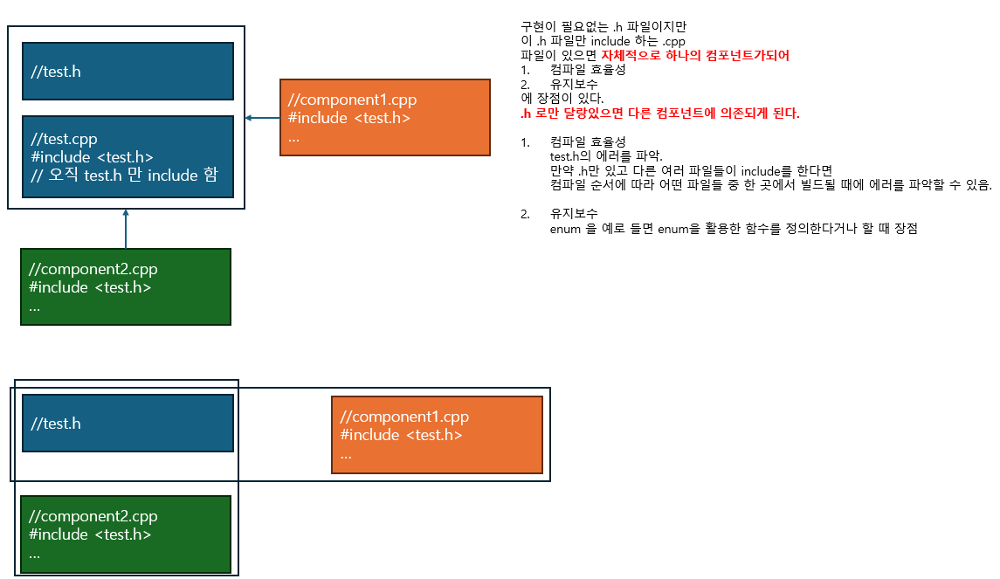

## 2.6 컴포넌트 설계 규칙

- 이해 용이성, 테스트, 유지보수에 개선을 가져온 논리적/물리적 설계규칙
    - Readability 
    - Testability
    - Maintainability

### 설계 규칙
1. 컴포넌트 속성 : 컴포넌트의 .cpp 파일은 대응되는 .h 파일을 실질적인 코드의 첫 줄에서 include 한다.
2. 컴포넌트 속성 : 외부 링키지를 가진 논리적 구문이 컴포넌트의 .cpp 파일에 정의되어 있다면 그에 대한 선언이 반드시 컴포넌트의 .h 파일에 있어야 한다.
    ```cpp
    //test.h

    class Test{
    public :
        int foo(int a);
    };
    ```

    ```cpp
    #include <test.h>
    int Test::foo(int a){
        return a + 100;
    }
    ```
3. 컴포넌트 속성 : 컴포넌트의 .h 파일에서 실질적으로 외부 바인디지로 선언된 논리적 구문의 정의는 (그러한 정의가 있다면) 그 컴포넌트 안에 존재해야 한다.
4. 컴포넌트 속성 : 컴포넌트의 기능은 헤더를 #include 하여 접근할 수 있어야 한다. 클라이언트의 local extern 선언으로 접근할 수 있어서는 안 된다.
5. main() 밖에서 정의되는 모든 논리적 구문은 반드시 컴포넌트 안에 존재해야 한다.
6. 각 컴포넌트의 .h 파일은 반드시 유일하고 예측가능한 include 가드를 사용해야한다.
7. 컴포넌트 밖으로 노출되는 내부 바인디지(ex 인라인 함수)가 아닌 논리적 구문은 반드시 선언이 먼저 되어야 하고,  
같은 컴포넌트 안에 별도로 정의되어야 한다. 이때 모든 자유 연산자와 자유 함수는 그것이 선언된 네임스페이스 밖에서 정의되어야 한다.
8. 파일 스코프 또는 네임스페이스 스코프에 속한 static 객체의 런타임 초기화는 허용되지 않는다.
    각 컴포넌트의 .h 파일은 반드시 독립적으로 컴파일 될 수 있어야 한다.
    - .h 파일은 독립적으로 컴파일 될 수 있는 것만 #include 지시자로 담아야 한다.(또는 적합한 경우 클래스의 지역 전방선언을 담을 수도 있다.
    이로써 스스로 독립적인 컴파일이 가능하게 해야한다.
    - 헤더 안에서 #include 지시자 사용이 정당화되는 경우
        1) 상속 관계
        2) 소유 관계
        3) inline
        4) enum
        5) typedef
9. 컴포넌트(클라이언트)가 다른 컴포넌트를 직접 실질적으로 사용한다면 사용되는 컴포넌트의 헤더를 사용처 컴포넌트에서 직접 include 해야 한다.  
(.h 또는 .cpp 둘 중 하나에서만 include 한다). 단 public 상속으로 인해 내재적이고 실질적인 컴파일 타임 종속성이 있는 경우에만 예외적으로 간접적인 include를 통한 사용이 일어날 수 있다.
    - 전이적 include 는 (그 정의가 직접적으로 접근해야하는) public 상속을 위해 필요한 경우를 제외하고는 허용되지 않는다.
10. 컴포넌트 간 순환적인 물리적 종속성은 허용되지 않는다.
11. 어떤 논리적인 구문이 private 상세 사항에 접근할 때 해당 구문이 정의된 물리적 연합의 경계를 벗어나면 안 된다.  
예를 들어 원거리 friend 는 허용되지 않는다.
    - 특별히 엔지니어링 차원의 타당한 사유가 없다면 컴포넌트 하나당 public 클래스 하나만 둔다.
    

|||
---
아래에 **규칙별로** 제목 달고, 다음의 **일관된 3단계 포맷**으로 쉽게 정리했습니다.

---

## 규칙 1. `.cpp`는 대응 `.h`를 반드시 첫 줄에 include

### 1. 요약 설명

컴포넌트의 구현 파일은 해당 헤더의 내용을 **가장 먼저** 포함해야 합니다.

### 2. 상세 설명

* **목적**: 헤더 의존성 누락 또는 헤더 순서 문제를 사전에 검출
* **미준수 시 문제**: 헤더의 중요한 구현 세부사항(예: `#pragma once`, 타입 정의 등)이 빠져 컴파일 오류나 예기치 않은 동작 발생 가능

### 3. 예시

* ❌ 잘못된 경우:

  ```cpp
  #include <vector>
  #include "MyComponent.h"  // 헤더 포함이 늦음 → 내부 타입 미등록 가능
  ```
* ✅ 잘된 경우:

  ```cpp
  #include "MyComponent.h"
  #include <vector>
  ```

---

## 규칙 2. 외부 링키지 정의는 헤더에 선언 있어야

### 1. 요약 설명

컴포넌트의 `.cpp`에서 외부 링키지 함수/변수를 정의하면, 같은 컴포넌트 `.h`에 **반드시 선언이 있어야** 합니다.

### 2. 상세 설명

* **목적**: 외부 사용자가 정의된 기능을 헤더에서 알 수 있도록 보장
* **미준수 시 문제**: 헤더에 선언이 없으면 클라이언트가 사용할 수 없거나, 정의만 있고 선언 없으면 컴파일 오류 발생

### 3. 예시

* ❌ 잘못된 경우:

  ```cpp
  // MyComponent.cpp
  int compute() { return 42; }
  // MyComponent.h  에 선언 없음
  ```
* ✅ 잘된 경우:

  ```cpp
  // MyComponent.h
  int compute();
  // MyComponent.cpp
  int compute() { return 42; }
  ```

---

## 규칙 3. 헤더의 외부 링키지 정의는 컴포넌트 내부에 존재해야
> 선언과 정의를 같은 컴포넌트에서 하기

### 1. 요약 설명

헤더에 `extern`으로 선언된 함수/변수는 **반드시 해당 컴포넌트(.cpp)에서 정의**되어야 합니다.

### 2. 상세 설명

* **목적**: 선언-정의 파편화 방지, ODR 위반 방지
* **미준수 시 문제**: 다른 컴포넌트 정의로부터 참조되어 **링크 에러** 또는 **중복 정의** 야기 가능

### 3. 예시

* ❌ 잘못된 경우:

  ```cpp
  // MyComponent.h
  extern int sharedVar;
  // MyComponent.cpp
  // 정의 없음 → 링크 에러
  ```
* ✅ 잘된 경우:

  ```cpp
  // MyComponent.h
  extern int sharedVar;
  // MyComponent.cpp
  int sharedVar = 0;
  ```

---

## 규칙 4. 컴포넌트 기능은 헤더 include로만 접근되야 함
> 규칙 3,4 는 extern을 사용하지 않도록 하기
### 1. 요약 설명

다른 컴포넌트는 **헤더를 include해야만** 해당 컴포넌트 기능을 사용 가능해야 합니다.

### 2. 상세 설명

* **목적**: 모듈 경계를 명확히 하고, 의존성을 일관성 있게 유지
* **미준수 시 문제**: `extern` 선언으로 임시 우회할 경우, 런타임 불확실성 및 설계 혼란 가능

### 3. 예시

* ❌ 잘못된 경우:

  ```cpp
  // 클라이언트.cpp
  extern void feature();
  feature();  // impl.cpp 에 정의됐더라도 include 없이 사용 → 관리 어려움
  ```
* ✅ 잘된 경우:

  ```cpp
  #include "Component.h"
  Component::feature();
  ```

---

## 규칙 5. main() 밖의 모든 논리적 구문은 컴포넌트 내에 존재해야

### 1. 요약 설명

`main()` 외부에서 정의된 함수나 전역 변수는 **반드시 해당 컴포넌트 내에 포함**되어야 합니다.
> 항상 h-cpp 짝을 두어 독립된 컴파일이 가능하게 하기
### 2. 상세 설명

* **목적**: 전역 심볼이 모듈 경계 밖으로 새어나가지 않도록 방지
* **미준수 시 문제**: **심볼 충돌**, ODR 위반, 모듈 의존성 불투명성 초래
* enum을 헤더에 선언하고 이 헤더를 include 하는 cpp를 두면 이 자체로 독립된 컴포넌트로써 컴파일할 수 있다. 이로 잠재된 컴파일 에러를 다른 파일 컴파일 시가 아니라 즉시 드러낼 수 있다.
* 컴파일 시점의 효율화를 위해 필요한 방법
### 3. 예시

* ❌ 잘못된 경우:

  ```cpp
  // 임의 파일에서
  void utilFunc() {}  // 컴포넌트 없음 → 전역 유출
  ```
* ✅ 잘된 경우:

  ```cpp
  namespace Util {
    void utilFunc() {}
  }
  // 또는 MyComponent.cpp 안에 정의
  ```

---

## 규칙 6. 헤더는 예측 가능한 include guard를 가져야

### 1. 요약 설명

각 컴포넌트의 `.h` 파일은 반드시 `#ifndef ... #define ... #endif` 또는 `#pragma once`를 사용해야 합니다.

### 2. 상세 설명

* **목적**: 다중 include 시 중복 정의, 심볼 충돌 예방
* **미준수 시 문제**: 컴파일 오류, 심볼 중복, 잘못된 전처리 결과 발생 가능

### 3. 예시

* ❌ 잘못된 경우:

  ```cpp
  // Foo.h
  // include guard 없음
  class Foo {};
  ```
* ✅ 잘된 경우:

  ```cpp
  #pragma once
  class Foo {};
  ```

---

## 규칙 7. 외부 바인디지 논리문은 반드시 선언 → 정의 순이고 네임스페이스 밖에 구현

### 1. 요약 설명

인라인 함수를 등 헤더에 선언된 외부 바인디지 구성요소는 **먼저 선언**, **컴포넌트 내부(i.e. 헤더 또는 cpp)에서 정의**,
그리고 **해당 네임스페이스 밖에서 구현**되어야 합니다.

### 2. 상세 설명

* **목적**: 자유 함수, 연산자 오버로드 등의 올바른 링크 동작과 이름 해석 보장
* **미준수 시 문제**: ODR 위반, 잘못된 네임스페이스 해석, 링크 에러

### 3. 예시

* ❌ 잘못된 경우:

  ```cpp
  inline void Util::doSomething() { ... }  // 정의가 헤더 바깥에 잘못 위치함
  ```
* ✅ 잘된 경우:

  ```cpp
  // Util.h
  namespace Util { inline void doSomething(); }
  // Util.cpp
  namespace Util { inline void doSomething() { ... } }
  ```

---

## 규칙 8. static 객체의 런타임 초기화 금지 / 헤더는 독립 컴파일 가능해야

### 1. 요약 설명

전역 또는 네임스페이스 스코프 `static` 객체를 런타임 초기화하지 않고,
헤더는 독자적으로 컴파일 가능한 상태를 유지해야 합니다.

### 2. 상세 설명

* **목적**: 초기화 순서 이슈 및 컴파일 타이밍 의존성 제거
* **미준수 시 문제**: 정적 초기화 순서 문제, 예기치 않은 실행 순서, 빌드 실패

### 3. 예시

* ❌ 잘못된 경우:

  ```cpp
  // MyComponent.cpp
  static SomeClass obj = computeSomething();  // 런타임 초기화 → 위험
  ```
* ✅ 잘된 경우:

  ```cpp
  // MyComponent.h
  header-only 내용만 – 컴파일 가능

  // MyComponent.cpp
  static SomeClass obj;  // 기본 생성만 허용
  ```

---

## 규칙 9. 직접 사용 시 헤더 직접 include, 전이적 include 제한

### 1. 요약 설명

컴포넌트 A가 B를 직접 참조하면 반드시 B의 헤더를 명시적으로 include 해야 하며,
상속 등의 compile-time 종속성이 아니면 전이적 include는 피해야 합니다.
> 컴포넌트 A는 B와 C를 사용하고, B가 C를 사용한다고 할 때,
> A --> B 로 C까지 include 될 것이라고 하면 안되고
> A --> B, C B --> C로 해야한다.
### 2. 상세 설명

* **목적**: 의존성을 명확히, 컴파일 시간 및 모듈 관계 가독성 향상
* **미준수 시 문제**: 불필요한 컴파일 트리거, 예측 불가능한 코드 변경 영향

### 3. 예시

* ❌ 잘못된 경우:

  ```cpp
  // A.cpp
  #include "C.h"  // C를 직접 사용하지 않았음
  // B.h 포함되어야 함
  ```
* ✅ 잘된 경우:

  ```cpp
  // A.cpp
  #include "B.h"
  ```

---

## 규칙 10. 컴포넌트 간 순환 의존 금지
> 컴포넌트는 가장 작은 단위임
> 순환의 개념이 있을 수 없다
### 1. 요약 설명

A가 B를 의존하고, B가 다시 A를 의존하는 형태의 **순환 구조는 허용되지 않습니다**.

### 2. 상세 설명

* **목적**: 모듈 독립성과 빌드 안정성 유지
* **미준수 시 문제**: include 순서 문제, 심볼 중복, 유지보수성 저하

### 3. 예시

* ❌ 잘못된 경우:

  ```cpp
  // A.h includes B.h
  // B.h includes A.h → 순환
  ```
* ✅ 잘된 경우:

  ```cpp
  // A.h
  class B;  // 전방 선언
  ```

---

## 규칙 11. 프라이빗 접근은 컴포넌트 내부에, 컴포넌트당 Public 클래스는 1개 권장

### 1. 요약 설명

특정 private 구성요소에 접근해야 한다면 같은 컴포넌트 내에서 `friend` 선언해야 하며,
컴포넌트당 public 클래스는 특별한 이유 없으면 1개만 유지해야 합니다.

### 2. 상세 설명

* **목적**: 캡슐화 강화, 모듈 경계 명확화
* **미준수 시 문제**: 모듈 간 결합도 증가, 코드 변경 파급범위 불확실

### 3. 예시

* ❌ 잘못된 경우:

  ```cpp
  // B.cpp
  class A { friend class C; };  // C가 A 내부 디테일을 엉뚱한 컴포넌트에서 참조
  ```
* ✅ 잘된 경우:

  ```cpp
  // MyComponent.h
  class MyComponent { /* public */ };
  // MyComponent.cpp
  class Helper { /* private 세부 */ };
  ```


