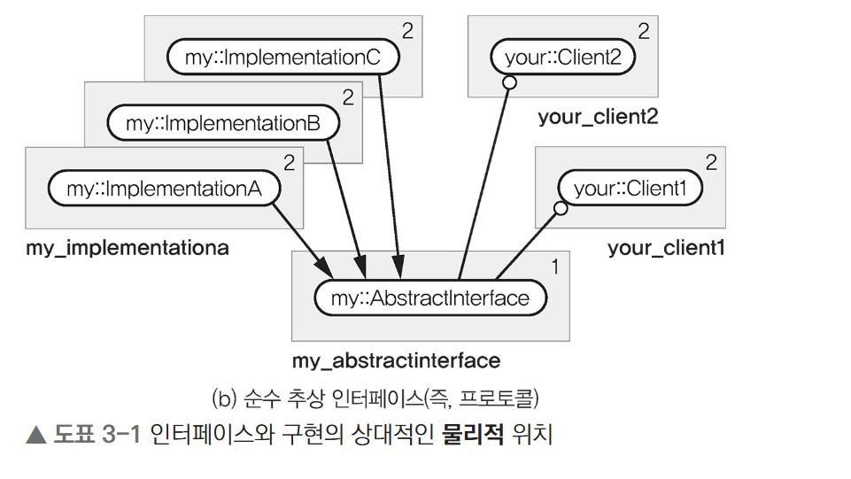

## 3.1.3 소프트웨어의 설계 공간은 방향이 있다
- 물리적 설계는 SW 구조에 유용한 차원을 도입한다. 즉 위, 아래 개념을 만들어준다.
- 수직적 방향 : 상위계층은 하위계층에 대해 종속성을 갖는다.
    - 당연히 하위 계층은 상위 계층에 종속되지 않는다.
- 수평적 방향 : 컴포넌트/패키지/패키지 그룹 이 완전히 독립적이라면 수평적이다고 볼 수 있다. 즉 같은 계층이다.

### 3.1.3.1 상대적인 물리적 위치의 예 : 추상 인터페이스
- 추상 인터페이스의 구현부는 인터페이스의 아래가 아니라 클라이언트와 동일하게 인터페이스 클래스 위에 위치한다.
    - 추상 인터페이스의 구현부와 클라이언트가 물리적으로도 종속성이 없어 수평적인 위치로 취급한다.
        - 자연스레 이해되는 부분이 구현과 클라이언트(인터페이스를 사용하는 컴포넌트) 가 인터페이스만을 바라보니 서로 내용이 달라져도 영향을 끼치지 않아 확장성에 이점이 있다.
        